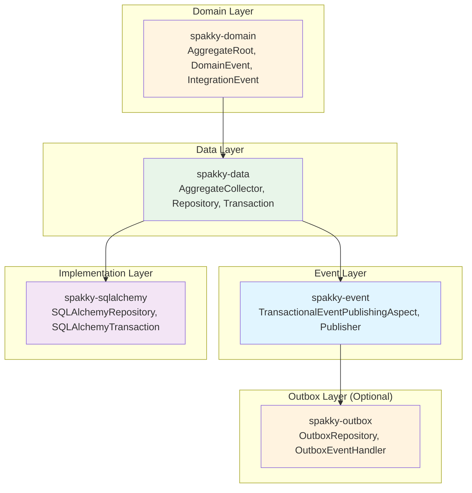
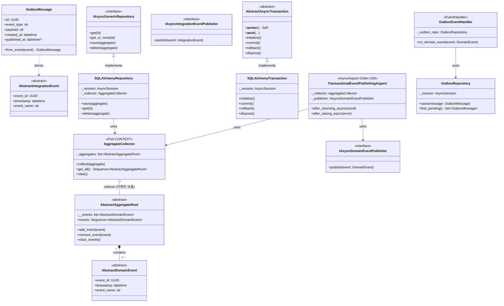
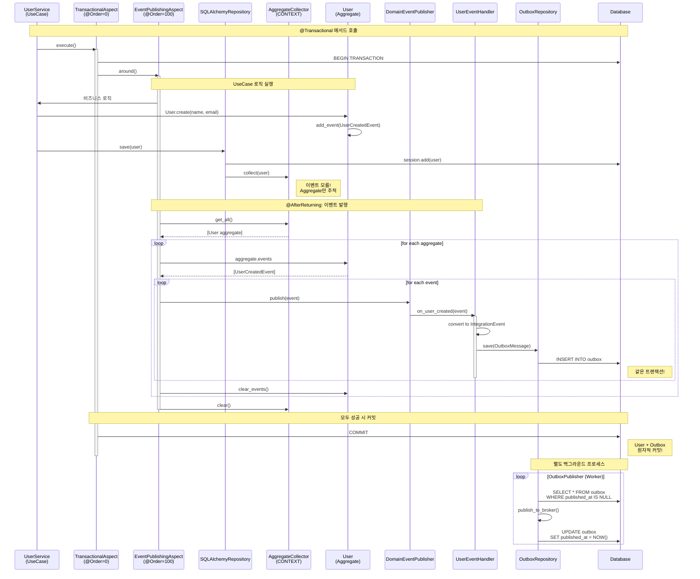
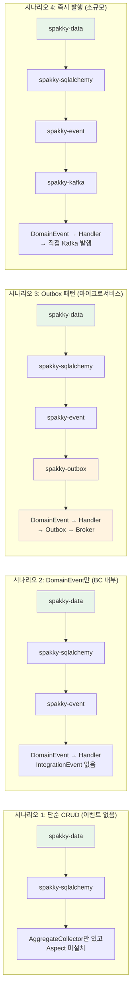

# Spakky Event-Driven Architecture

## 패키지 의존성 구조



**핵심: 단방향 의존! 하위 패키지는 상위 패키지를 모름!**

---

## 핵심 컴포넌트 역할

| 컴포넌트                               | 패키지        | 역할                                  | 이벤트를 아나? |
| -------------------------------------- | ------------- | ------------------------------------- | :------------: |
| **AggregateRoot**                      | spakky-domain | 이벤트 보유 (`events`, `add_event()`) |       ✅       |
| **AggregateCollector**                 | spakky-data   | save()된 aggregate 추적               |       ❌       |
| **Repository**                         | spakky-data   | save() 시 Collector에 등록            |       ❌       |
| **Transaction**                        | spakky-data   | BEGIN/COMMIT/ROLLBACK                 |       ❌       |
| **TransactionalEventPublishingAspect** | spakky-event  | Collector에서 이벤트 추출 후 발행     |       ✅       |
| **DomainEventPublisher**               | spakky-event  | EventHandler에 이벤트 전달            |       ✅       |

---

## 상세 클래스 다이어그램



---

## 실행 흐름 시퀀스 다이어그램



---

## Aspect 순서와 트랜잭션 경계

### 핵심: EventPublishingAspect는 트랜잭션 안에서 실행됨!

```
@Transactional 메서드 시작
│
├─ [TransactionalAspect @Order(0)]
│   └─ BEGIN TRANSACTION
│
│   ├─ [TransactionalEventPublishingAspect @Order(100)]
│   │   │
│   │   ├─ UseCase 로직 실행
│   │   │   ├─ aggregate = User.create(...)
│   │   │   ├─ aggregate.add_event(UserCreatedEvent)
│   │   │   └─ repository.save(aggregate)
│   │   │       └─ collector.collect(aggregate)  ← 등록!
│   │   │
│   │   ├─ 이벤트 발행 (@AfterReturning)
│   │   │   ├─ collector.get_all()
│   │   │   ├─ publisher.publish(event)
│   │   │   │   └─ EventHandler.on_user_created()
│   │   │   │       └─ outbox_repo.save(...)  ← 같은 트랜잭션!
│   │   │   └─ aggregate.clear_events()
│   │   │
│   │   └─ (실패 시 @AfterRaising → collector.clear())
│   │
│   └─ COMMIT (모두 성공 시) 또는 ROLLBACK (실패 시)
│
└─ 끝
```

**EventHandler 실패 = 전체 롤백 = 데이터 일관성 보장!**

---

## 코드 예시

### spakky-data: AggregateCollector

```python
from spakky.core.stereotype.pod import Pod, Scope
from spakky.domain.aggregate import AbstractAggregateRoot
from typing import Sequence
from attrs import define, field

@define
@Pod(scope=Scope.CONTEXT)
class AggregateCollector:
    """save()된 Aggregate들을 추적 (이벤트 개념 모름!)"""

    _aggregates: list[AbstractAggregateRoot] = field(factory=list)

    def collect(self, aggregate: AbstractAggregateRoot) -> None:
        """Repository.save() 시 호출"""
        self._aggregates.append(aggregate)

    def get_all(self) -> Sequence[AbstractAggregateRoot]:
        """Aspect에서 호출하여 추적된 aggregate 조회"""
        return list(self._aggregates)

    def clear(self) -> None:
        """트랜잭션 종료 시 정리"""
        self._aggregates.clear()
```

### spakky-data: Repository (SQLAlchemy 구현)

```python
from spakky.core.stereotype.repository import Repository
from spakky.data.persistency.repository import IAsyncGenericRepository
from spakky.data.persistency.event_collector import AggregateCollector
from sqlalchemy.ext.asyncio import AsyncSession
from uuid import UUID

@Repository()
class SQLAlchemyUserRepository(IAsyncGenericRepository[User, UUID]):
    def __init__(
        self,
        session: AsyncSession,
        collector: AggregateCollector,
    ) -> None:
        self._session = session
        self._collector = collector

    async def save(self, aggregate: User) -> User:
        self._session.add(aggregate)
        self._collector.collect(aggregate)  # 그냥 모아! (이벤트 모름)
        return aggregate

    async def get(self, id: UUID) -> User:
        result = await self._session.get(User, id)
        if result is None:
            raise EntityNotFoundError(User, id)
        return result
```

### spakky-event: TransactionalEventPublishingAspect

```python
from spakky.core.aop.aspect import AsyncAspect, IAsyncAspect
from spakky.core.aop.pointcut import AfterReturning, AfterRaising
from spakky.core.aop.order import Order
from spakky.data.persistency.event_collector import AggregateCollector
from spakky.event.publisher import IAsyncDomainEventPublisher
from spakky.data.annotation.transactional import Transactional
from typing import Any

@Order(100)  # TransactionalAspect(0)보다 안쪽에서 실행
@AsyncAspect()
class TransactionalEventPublishingAspect(IAsyncAspect):
    """트랜잭션 내에서 DomainEvent 자동 발행"""

    def __init__(
        self,
        collector: AggregateCollector,
        publisher: IAsyncDomainEventPublisher,
    ) -> None:
        self._collector = collector
        self._publisher = publisher

    @AfterReturning(lambda ctx: Transactional.exists(ctx))
    async def after_returning_async(self, result: Any) -> None:
        """UseCase 성공 시 이벤트 발행"""
        for aggregate in self._collector.get_all():
            for event in aggregate.events:
                await self._publisher.publish(event)
            aggregate.clear_events()
        self._collector.clear()

    @AfterRaising(lambda ctx: Transactional.exists(ctx))
    async def after_raising_async(self, error: Exception) -> None:
        """UseCase 실패 시 정리만"""
        self._collector.clear()
```

### 사용자 코드 (UseCase)

```python
from spakky.core.stereotype.usecase import UseCase
from spakky.data.annotation.transactional import Transactional
from spakky.data.persistency.repository import IAsyncGenericRepository
from uuid import UUID

@UseCase()
class CreateUserUseCase:
    def __init__(
        self,
        user_repo: IAsyncGenericRepository[User, UUID],
    ) -> None:
        self._user_repo = user_repo

    @Transactional()
    async def execute(self, command: CreateUserCommand) -> User:
        user = User.create(command.name, command.email)
        # 내부에서 user.add_event(UserCreatedEvent(...)) 호출됨

        await self._user_repo.save(user)
        return user
        # 끝! 이벤트 발행은 Aspect가 알아서! ✨
```

### EventHandler with Outbox

```python
from spakky.event.stereotype.event_handler import EventHandler, on_event
from spakky.outbox.repository import IOutboxRepository
from spakky.outbox.message import OutboxMessage

@EventHandler()
class UserOutboxHandler:
    def __init__(self, outbox_repo: IOutboxRepository) -> None:
        self._outbox_repo = outbox_repo

    @on_event(UserCreatedEvent)
    async def on_user_created(self, event: UserCreatedEvent) -> None:
        integration_event = UserRegisteredIntegrationEvent(
            user_id=event.user_id,
            email=event.email,
        )
        await self._outbox_repo.save(
            OutboxMessage.from_event(integration_event)
        )
        # ↑ 같은 트랜잭션! User + Outbox 원자적 커밋!
```

---

## DomainEvent vs IntegrationEvent

| 특성         | DomainEvent         | IntegrationEvent                 |
| ------------ | ------------------- | -------------------------------- |
| **범위**     | BC 내부             | BC 외부 (마이크로서비스 간)      |
| **발생**     | Aggregate에서       | EventHandler에서 변환            |
| **전달**     | In-memory Publisher | Message Broker (Kafka, RabbitMQ) |
| **저장**     | 저장 안 함          | Outbox 테이블에 저장             |
| **트랜잭션** | 같은 트랜잭션       | 같은 트랜잭션 (Outbox)           |
| **패키지**   | spakky-event        | spakky-outbox                    |

---

## 플러그인 선택 시나리오



---

## 핵심 설계 결정 요약

| 결정 사항                  | 선택                               | 이유                            |
| -------------------------- | ---------------------------------- | ------------------------------- |
| UoW 패턴                   | ❌ 불필요                          | SQLAlchemy Session이 이미 제공  |
| 이벤트 수집 방식           | 자동 (AggregateCollector + Aspect) | Spring Boot 철학, 편의성 우선   |
| Collector 위치             | spakky-data                        | 이벤트 개념과 분리, 단방향 의존 |
| Collector가 이벤트를 아나? | ❌ 모름                            | Aggregate만 추적, SRP           |
| 발행 위치                  | spakky-event Aspect                | 트랜잭션 내에서 실행 보장       |
| Aspect 순서                | @Order로 제어                      | Transaction(0) → Event(100)     |
| Handler 실패 시            | 전체 롤백                          | 데이터 일관성 보장              |

---

## Unit of Work 패턴에 대한 고찰

### "Unit of Work가 필요한가?"

**결론: Spakky에서는 불필요합니다.**

#### 전통적 Unit of Work (Martin Fowler)

```python
# ORM 없던 시절의 패턴
class UnitOfWork:
    new_objects: Set[Entity]
    dirty_objects: Set[Entity]
    removed_objects: Set[Entity]

    def commit(self):
        # 수동 변경 추적 및 SQL 생성
        for obj in new_objects:
            db.execute("INSERT INTO ...")
```

#### 현대 ORM (SQLAlchemy Session)

```python
# Session이 이미 UoW 역할 수행
session.add(user)           # 자동 추적
user.name = "Changed"       # Dirty 자동 감지
session.commit()            # 일괄 커밋
```

#### Spakky의 접근: AggregateCollector + Aspect

```python
# ✅ 더 단순하고 명확
# AggregateCollector: Aggregate만 추적 (단일 책임, 이벤트 모름)
# TransactionalEventPublishingAspect: 이벤트 추출 및 발행
# ORM Session: 엔티티 변경 추적 (기존 역할)
```

**장점:**

- 각 컴포넌트가 단일 책임 (SRP)
- ORM 기능 손실 없음
- 패키지 간 의존성 최소화
- 테스트 용이
- 오버엔지니어링 방지

---

## Transactional Outbox 패턴

Transactional Outbox 패턴은 **분산 시스템에서 이벤트 발행의 신뢰성을 보장**하는 패턴입니다.

### 문제: 이중 쓰기 문제

```python
# ❌ 신뢰할 수 없는 패턴
async def create_user(user: User):
    await db.save(user)              # 성공
    await rabbitmq.publish(event)    # 실패하면? 이벤트 유실!
```

### 해결: Outbox 패턴

```python
# ✅ 신뢰할 수 있는 패턴
async def create_user(user: User):
    async with transaction:
        await db.save(user)          # 1. 엔티티 저장
        await outbox.save(event)     # 2. Outbox 저장 (같은 트랜잭션)
        # 커밋 성공 = 이벤트 발행 보장

# 별도 프로세스
async def outbox_publisher():
    events = await outbox.find_pending()
    for event in events:
        await rabbitmq.publish(event)  # 재시도 가능
        await outbox.mark_published(event)
```

### Spakky에서의 구현

AggregateCollector + TransactionalEventPublishingAspect 조합으로 Outbox 패턴을 자연스럽게 지원:

1. **Aggregate 수집**: Repository.save() 시 AggregateCollector가 추적
2. **이벤트 추출**: Aspect가 Aggregate에서 이벤트 꺼냄
3. **Handler 실행**: DomainEvent → IntegrationEvent 변환
4. **Outbox 저장**: 같은 트랜잭션 내에서 저장
5. **원자적 커밋**: 엔티티 + Outbox 동시 커밋
6. **백그라운드 발행**: 별도 Worker가 Outbox 읽어서 Broker로 발행

---

## 참고 자료

- [Martin Fowler - Unit of Work](https://martinfowler.com/eaaCatalog/unitOfWork.html)
- [Microsoft - Transactional Outbox Pattern](https://learn.microsoft.com/en-us/azure/architecture/best-practices/transactional-outbox-cosmos)
- [Spring Data - @DomainEvents](https://docs.spring.io/spring-data/commons/docs/current/api/org/springframework/data/domain/DomainEvents.html)
- [Cosmic Python - Architecture Patterns with Python](https://www.cosmicpython.com/book/chapter_08_events_and_message_bus.html)
- [Spakky Framework Repository](https://github.com/E5presso/spakky-framework)
