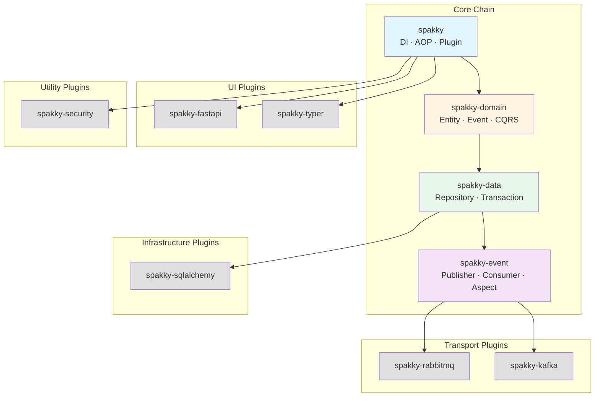
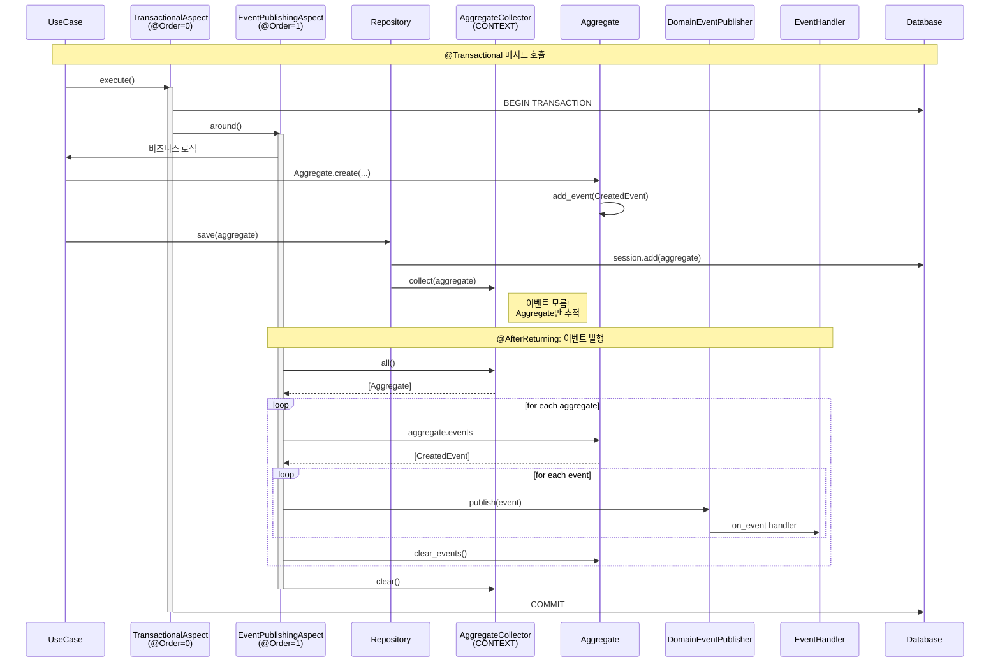

# Spakky Framework Architecture

이 문서는 Spakky Framework의 전체 아키텍처를 기술합니다.
코드와 문서가 불일치할 경우, **코드가 진실**입니다.

---

## 목차

- [패키지 구조](#패키지-구조)
- [의존성 그래프](#의존성-그래프)
- [코어: DI/IoC 컨테이너](#코어-diioc-컨테이너)
- [코어: AOP 시스템](#코어-aop-시스템)
- [코어: 플러그인 시스템](#코어-플러그인-시스템)
- [도메인 레이어 (spakky-domain)](#도메인-레이어-spakky-domain)
- [데이터 레이어 (spakky-data)](#데이터-레이어-spakky-data)
- [이벤트 레이어 (spakky-event)](#이벤트-레이어-spakky-event)
- [플러그인 구현체](#플러그인-구현체)
- [설계 결정](#설계-결정)
- [Architecture Decision Records](#architecture-decision-records)
- [참고 자료](#참고-자료)

---

## 패키지 구조

모노레포는 **코어 패키지**와 **플러그인 패키지**로 나뉩니다.

| 계층 | 패키지 | 역할 |
|------|--------|------|
| **Core** | `spakky` | DI Container, AOP, 애플리케이션 부트스트랩 |
| **Core** | `spakky-domain` | DDD 빌딩 블록 (Entity, AggregateRoot, ValueObject, Event, CQRS) |
| **Core** | `spakky-data` | 데이터 접근 추상화 (Repository, Transaction, AggregateCollector) |
| **Core** | `spakky-event` | 인프로세스 이벤트 시스템 (Publisher, Consumer, EventHandler) |
| **Plugin** | `spakky-fastapi` | FastAPI REST 컨트롤러 통합 |
| **Plugin** | `spakky-typer` | Typer CLI 컨트롤러 통합 |
| **Plugin** | `spakky-security` | 암호화/해싱/JWT 유틸리티 |
| **Plugin** | `spakky-rabbitmq` | RabbitMQ 이벤트 브로커 통합 |
| **Plugin** | `spakky-kafka` | Apache Kafka 이벤트 브로커 통합 |
| **Plugin** | `spakky-sqlalchemy` | SQLAlchemy ORM 통합 |

---

## 의존성 그래프



**핵심: 단방향 의존.** 하위 패키지는 상위 패키지를 모릅니다.

- **UI 플러그인** (fastapi, typer) → `spakky` 코어에만 의존
- **유틸리티 플러그인** (security) → `spakky` 코어에만 의존
- **인프라 플러그인** (sqlalchemy) → `spakky-data`까지 의존
- **트랜스포트 플러그인** (rabbitmq, kafka) → `spakky-event`까지 의존 (전체 코어 체인)

---

## 코어: DI/IoC 컨테이너

### 어노테이션 시스템

프레임워크의 기반입니다. 모든 메타데이터는 `__spakky_annotation_metadata__` 속성에 저장됩니다.

```
Annotation                      ← 기본 메타데이터 저장
├── ClassAnnotation             ← 클래스 대상 (type[T] → type[T])
└── FunctionAnnotation          ← 함수 대상 (Callable → Callable)
```

**MRO 기반 인덱싱**: 어노테이션 설정 시 `type(self).mro()` 전체를 인덱싱합니다.
`@Controller`로 마킹된 클래스에 `Pod.exists(obj)`를 호출해도 `True`가 반환됩니다.

```python
# 모든 어노테이션이 제공하는 정적 메서드
Annotation.exists(obj)           # 존재 여부
Annotation.get(obj)              # 단일 조회 (없으면 에러)
Annotation.get_or_none(obj)      # 단일 조회 (없으면 None)
Annotation.all(obj)              # 전체 조회
```

### `@Pod` 데코레이터

컨테이너에 등록될 의존성 관리 대상을 선언합니다.

```python
from spakky.core.pod.annotations.pod import Pod

@Pod()
class UserService:
    def __init__(self, repo: UserRepository) -> None:
        self._repo = repo
```

**Pod의 핵심 필드:**

| 필드 | 설명 |
|------|------|
| `id` | UUID (자동 생성) |
| `name` | 기본값: `PascalCase → snake_case` |
| `scope` | `Pod.Scope.SINGLETON` (기본), `PROTOTYPE`, `CONTEXT` |
| `type_` | 클래스 타입 또는 함수의 반환 타입 |
| `base_types` | generic MRO에서 추출한 다형성 조회용 타입 집합 |
| `dependencies` | `__init__` 파라미터에서 추출한 의존성 맵 |

**Pod 초기화 로직 (`_initialize`):**

- **클래스 Pod**: `type_ = obj`, `__init__` 파라미터에서 의존성 추출
- **함수 Pod**: `type_ = return_annotation`, 함수 파라미터에서 의존성 추출
- `Annotated[T, Qualifier(...)]`로 한정자(qualifier)를 지정 가능
- 유효성 검사: `*args`/`**kwargs` 불가, positional-only 불가, 타입 힌트 필수

### Pod 스코프

| 스코프 | 생명주기 | 구현 |
|--------|---------|------|
| `SINGLETON` | 컨테이너당 하나 | `RLock` 기반 double-checked locking |
| `PROTOTYPE` | 요청마다 새 인스턴스 | 캐시 없음 |
| `CONTEXT` | 요청/컨텍스트 단위 | `contextvars.ContextVar` 기반 캐시 |

### Pod 어노테이션

| 어노테이션 | 위치 | 용도 |
|-----------|------|------|
| `@Primary` | `spakky.core.pod.annotations.primary` | 복수 후보 중 우선 구현체 지정 |
| `@Order(n)` | `spakky.core.pod.annotations.order` | 실행 순서 제어 (낮을수록 먼저, 기본값: `sys.maxsize`) |
| `@Lazy` | `spakky.core.pod.annotations.lazy` | 첫 접근 시까지 초기화 지연 |
| `@Tag` | `spakky.core.pod.annotations.tag` | 커스텀 메타데이터 태그 |
| `Qualifier` | `spakky.core.pod.annotations.qualifier` | `Annotated[T, Qualifier(...)]` 형태로 의존성 한정 |

### 스테레오타입

모든 스테레오타입은 **`Pod`의 서브클래스**입니다. MRO 기반 인덱싱으로 `Pod.exists()`가 모든 스테레오타입에 대해 동작합니다.

| 스테레오타입 | 패키지 | 용도 |
|-------------|--------|------|
| `@Controller` | `spakky.core.stereotype.controller` | 기본 컨트롤러 |
| `@UseCase` | `spakky.core.stereotype.usecase` | 비즈니스 로직 |
| `@Configuration` | `spakky.core.stereotype.configuration` | 설정 클래스 |
| `@Repository` | `spakky.data.stereotype.repository` | 데이터 접근 |
| `@EventHandler` | `spakky.event.stereotype.event_handler` | 이벤트 처리 |
| `@Aspect` / `@AsyncAspect` | `spakky.core.aop.aspect` | AOP 관점 |

### 컨테이너 (`ApplicationContext`)

`IApplicationContext(IContainer, ITagRegistry, ABC)`의 구현체입니다.

**내부 캐시 구조:**

| 캐시 | 용도 |
|------|------|
| `__pods: dict[str, Pod]` | name → Pod 레지스트리 |
| `__type_cache: dict[type, set[Pod]]` | type → Pods (O(1) 다형성 조회) |
| `__singleton_cache: dict[str, object]` | 싱글턴 인스턴스 캐시 |
| `__context_cache: ContextVar[dict]` | CONTEXT 스코프 인스턴스 캐시 |
| `__tags: set[Tag]` | 태그 레지스트리 |

**의존성 해결 순서:**

1. `__type_cache`에서 타입으로 후보 조회 (O(1))
2. 후보가 1개 → 즉시 반환
3. 복수 → Qualifier → name → `@Primary` 순으로 필터링
4. 여전히 모호 → `NoUniquePodError`

**인스턴스화 시 순환 참조 감지:**

- 불변 튜플 `dependency_hierarchy`로 재귀 경로를 추적
- 이미 방문한 타입 발견 시 `CircularDependencyGraphDetectedError` (체인 정보 포함)

### Post-Processor 파이프라인

Pod 생성 후 순차적으로 적용되는 후처리기입니다.

```
Pod 생성
  │
  ├─ 1. ApplicationContextAwareProcessor
  │     └─ IContainerAware, ITagRegistryAware, IApplicationContextAware 주입
  │
  ├─ 2. AspectPostProcessor
  │     └─ 매칭되는 Aspect의 Dynamic Proxy 래핑
  │
  ├─ 3. ServicePostProcessor
  │     └─ IService / IAsyncService 라이프사이클 등록
  │
  └─ 4. 사용자 정의 IPostProcessor (@Order 순서)
```

### 애플리케이션 부트스트랩

```python
from spakky.core.application.application import SpakkyApplication
from spakky.core.application.application_context import ApplicationContext

app = (
    SpakkyApplication(ApplicationContext())
    .load_plugins()   # entry_points("spakky.plugins") 기반 플러그인 로드
    .add(CustomPod)   # 개별 Pod 등록
    .scan()           # 호출자 패키지 자동 감지 → 모듈 스캔 → Pod/Tag 등록
    .start()          # Post-Processor 등록 → 비-Lazy 싱글턴 초기화 → 서비스 시작
)
```

**`scan()` 자동 감지**: `inspect.stack()`으로 호출자의 패키지를 찾고, 하위 모듈을 재귀 순회하며 `Pod.exists()` 또는 `Tag.exists()`인 객체를 등록합니다.

---

## 코어: AOP 시스템

### 포인트컷

메서드에 적용하여 "언제" 어드바이스를 실행할지 지정합니다.

| 포인트컷 | 실행 시점 |
|----------|----------|
| `@Before` | 대상 메서드 실행 전 |
| `@AfterReturning` | 대상 메서드 정상 반환 후 |
| `@AfterRaising` | 대상 메서드 예외 발생 후 |
| `@After` | 대상 메서드 종료 후 (항상) |
| `@Around` | 대상 메서드를 감싸서 실행 |

모든 포인트컷은 `pointcut: Callable[[Func], bool]` 선택자 함수를 받습니다.

### Aspect 인터페이스

| 인터페이스 | 위치 | 용도 |
|-----------|------|------|
| `IAspect` | `spakky.core.aop.interfaces.aspect` | 동기 어드바이스 메서드 |
| `IAsyncAspect` | `spakky.core.aop.interfaces.aspect` | 비동기 어드바이스 메서드 |

모든 어드바이스 메서드는 **기본 no-op 구현**을 가지므로, 필요한 것만 오버라이드합니다.

### Dynamic Proxy 메커니즘

```
AspectPostProcessor
  │
  ├─ 매칭되는 Aspect 수집 → @Order 정렬
  │
  ├─ ProxyFactory로 런타임 서브클래스 생성
  │     └─ types.new_class("{TypeName}@DynamicProxy", ...)
  │
  └─ AspectProxyHandler → Advisor 체인 구성
        │
        └─ Advisor.__call__:
              before → around(joinpoint) → after_returning / after_raising → after
```

- **런타임 서브클래스**: `types.new_class()`로 프록시 클래스를 생성하여 `isinstance()` 투명성을 유지합니다.
- **Advisor 체이닝**: `self.next`가 다음 `Advisor`를 가리키며, `@Order` 순서에 따라 중첩됩니다.

### 실행 예시

```python
from spakky.core.aop.aspect import AsyncAspect
from spakky.core.aop.interfaces.aspect import IAsyncAspect
from spakky.core.aop.pointcut import Around
from spakky.core.pod.annotations.order import Order

@Order(0)
@AsyncAspect()
class TimingAspect(IAsyncAspect):
    async def around_async(self, joinpoint, *args, **kwargs):
        start = time.time()
        result = await joinpoint(*args, **kwargs)
        logger.info("Elapsed: %.3fs", time.time() - start)
        return result
```

---

## 코어: 플러그인 시스템

### Entry Point 기반 발견

각 서브패키지의 `pyproject.toml`에 등록합니다:

```toml
[project.entry-points."spakky.plugins"]
spakky-data = "spakky.data.main:initialize"
```

`SpakkyApplication.load_plugins()`는 `importlib.metadata.entry_points(group="spakky.plugins")`로 등록된 플러그인을 발견하고, 각 플러그인의 `initialize(app: SpakkyApplication)` 함수를 호출합니다.

### 플러그인 등록 요약

| 플러그인 | 등록하는 컴포넌트 |
|---------|-------------------|
| `spakky-domain` | (없음 — 모델만 제공) |
| `spakky-data` | `AsyncTransactionalAspect`, `TransactionalAspect`, `AggregateCollector` |
| `spakky-event` | Event Mediator/Publisher (sync+async), `TransactionalEventPublishingAspect` (sync+async), `EventHandlerRegistrationPostProcessor` |
| `spakky-fastapi` | `BindLifespanPostProcessor`, `AddBuiltInMiddlewaresPostProcessor`, `RegisterRoutesPostProcessor` |
| `spakky-typer` | `TyperCLIPostProcessor` |
| `spakky-security` | (없음 — 유틸리티 함수만 제공) |
| `spakky-rabbitmq` | `RabbitMQConnectionConfig`, Consumer/Publisher (sync+async), `RabbitMQPostProcessor` |
| `spakky-kafka` | `KafkaConnectionConfig`, Consumer/Publisher (sync+async), `KafkaPostProcessor` |
| `spakky-sqlalchemy` | `SQLAlchemyConnectionConfig`, `SchemaRegistry`, Session/ConnectionManager, Transaction |

---

## 도메인 레이어 (spakky-domain)

### 모델 계층

```
AbstractDomainModel (ABC)
├── AbstractEntity[EquatableT_co]         @mutable (frozen=False, kw_only=True)
│   └── AbstractAggregateRoot[EquatableT_co]  이벤트 보유
├── AbstractValueObject                   @immutable (frozen=True, kw_only=True)
└── AbstractEvent                         @immutable
    ├── AbstractDomainEvent               Bounded Context 내부 이벤트
    └── AbstractIntegrationEvent          Bounded Context 간 이벤트
```

> **`@mutable` / `@immutable`**: `spakky.core.common.mutability`에서 제공하는 데코레이터입니다.
> 표준 `@dataclass`를 래핑하며, 부모 클래스의 frozen 설정과 일치시키기 위해 도메인 모델에는 반드시 이 데코레이터를 사용합니다.

### Entity

- `uid`, `version` (UUID v7), `created_at`, `updated_at` 필드
- 동등성: `uid` 기반 (identity equality)
- `__setattr__` 오버라이드: 유효성 검사 + `updated_at`/`version` 자동 갱신
- 추상 메서드: `next_id()`, `validate()`

### AggregateRoot

- `AbstractEntity`를 확장
- `__events: list[AbstractDomainEvent]`를 내부적으로 관리
- `add_event()`, `remove_event()`, `clear_events()`, `events` (프로퍼티, 복사본 반환)

### ValueObject

- 동등성: `astuple(self)` 기반 (structural equality)
- 모든 속성 타입이 hashable인지 `__init_subclass__`에서 검증
- `clone()` → `self` 반환 (불변이므로 안전)

### Event

- `event_id: UUID`, `timestamp: datetime`
- `event_name` → 클래스명
- `IComparable` 구현: `timestamp` 기반 비교

### CQRS

```python
# Command
ICommandUseCase[CommandT_contra, ResultT_co].run(command) -> result
IAsyncCommandUseCase[CommandT_contra, ResultT_co].run(command) -> result

# Query
IQueryUseCase[QueryT_contra, ResultT_co].run(query) -> result
IAsyncQueryUseCase[QueryT_contra, ResultT_co].run(query) -> result
```

#### CQRS 조회 원칙

**조회(Query)는 사용자의 직접 구현을 원칙으로 합니다.**

- Repository에 다양한 조회 메서드(`find_by_xxx`, `search_xxx` 등)를 추가하지 않습니다.
- Repository는 Aggregate의 **영속성 관리**(CRUD)만 담당합니다.
- 복잡한 조회는 **QueryUseCase**에서 직접 ORM/SQL을 사용하여 구현합니다.

**이유**: Repository에 조회 관점이 침투하면 도메인이 인프라에 의존하게 되고,
결과적으로 **도메인 오염**의 위험이 높아집니다.

```python
# ❌ 잘못된 예: Repository에 조회 관점 추가
class IUserRepository:
    def find_by_email(self, email: str) -> User | None: ...  # 조회 관점!
    def search_by_name(self, name: str) -> list[User]: ...   # 조회 관점!

# ✅ 올바른 예: QueryUseCase에서 직접 구현
@QueryUseCase()
class FindUserByEmailUseCase(IAsyncQueryUseCase[FindUserByEmailQuery, UserDTO]):
    def __init__(self, session: AsyncSession) -> None:
        self._session = session

    async def run(self, query: FindUserByEmailQuery) -> UserDTO:
        # 직접 ORM/SQL 사용
        result = await self._session.execute(
            select(UserTable).where(UserTable.email == query.email)
        )
        ...
```

---

## 데이터 레이어 (spakky-data)

### `@Transactional`과 트랜잭션 Aspect

`Transactional(FunctionAnnotation)` — 메서드에 트랜잭션 경계를 선언합니다.
하나의 어노테이션으로 sync/async를 모두 처리합니다.

| Aspect | @Order | 대상 |
|--------|--------|------|
| `AsyncTransactionalAspect` | 0 | `@Transactional` + `iscoroutinefunction` |
| `TransactionalAspect` | 0 | `@Transactional` + sync |

```python
# 둘 다 동일한 @Transactional() 사용
from spakky.data.aspects.transactional import Transactional

@Transactional()
def sync_method(self): ...

@Transactional()
async def async_method(self): ...
```

### Repository 인터페이스

`IGenericRepository[AggregateRootT, AggregateIdT_contra]`:
- `get()`, `get_or_none()`, `contains()`, `range()`
- `save()`, `save_all()`, `delete()`, `delete_all()`

`IAsyncGenericRepository` — 비동기 버전.

### AggregateCollector

```python
@Pod(scope=Pod.Scope.CONTEXT)
class AggregateCollector:
    """트랜잭션 내에서 save()된 Aggregate를 추적합니다."""
```

- **CONTEXT 스코프**: 요청/트랜잭션 단위로 격리
- `collect(aggregate)`: Repository에서 save 시 호출
- `all()`: 추적된 전체 Aggregate 조회
- `clear()`: 트랜잭션 종료 시 정리

**핵심**: AggregateCollector는 **이벤트의 존재를 모릅니다**. Aggregate만 추적하며, 이벤트 추출은 `spakky-event`의 Aspect가 담당합니다.

### Transaction 추상화

```
AbstractTransaction (context manager)
├── __enter__() → initialize()
└── __exit__()  → commit() / rollback() / dispose()
    └── autocommit_enabled 플래그로 제어

AbstractAsyncTransaction (async context manager)
└── 동일 구조
```

### External Proxy 패턴

**외부 저장소 또는 서비스 호출**을 통한 데이터 접근을 추상화하는 읽기 전용 인터페이스입니다.

> **주의**: External Proxy는 **데이터베이스 접근이 아닙니다**. 외부 REST API, gRPC 서비스, 레거시 시스템,
> 메시지 큐 조회 등 **프로세스 외부의 서비스 호출**을 추상화합니다.
> Repository는 도메인 Aggregate의 영속성을, Proxy는 외부 서비스 데이터 조회를 담당합니다.

- `ProxyModel[ProxyIdT_contra]` — `@immutable`, identity equality
- `IGenericProxy` / `IAsyncGenericProxy` — `get()`, `get_or_none()`, `contains()`, `range()`

**사용 사례**:
- 외부 마이크로서비스 API 호출
- 서드파티 서비스 데이터 조회 (결제, 배송 등)
- 레거시 시스템 연동
- 외부 캐시 서버 조회

---

## 이벤트 레이어 (spakky-event)

### ISP 기반 이벤트 아키텍처

인터페이스 분리 원칙(ISP)에 따라 역할이 분리되어 있습니다.

```
Consumer (등록)              Dispatcher (전달)           Publisher (발행 API)
├─ IDomainEventConsumer     ├─ IDomainEventDispatcher   ├─ IDomainEventPublisher
├─ IAsyncDomainEvent...     ├─ IAsyncDomainEvent...     ├─ IAsyncDomainEvent...
├─ IIntegrationEvent...     ├─ IIntegrationEvent...     ├─ IIntegrationEvent...
└─ IAsyncIntegration...     └─ IAsyncIntegration...     └─ IAsyncIntegration...
```

- **Consumer**: `register(event_type, handler)` — 이벤트 타입과 콜백 연결
- **Dispatcher**: `dispatch(event)` — 등록된 핸들러에 이벤트 전달
- **Publisher**: `publish(event)` — 외부에서 사용하는 발행 API

### Mediator 패턴

`DomainEventMediator`가 Consumer + Dispatcher를 통합합니다.

- `_handlers: dict[type[Event], list[callback]]`
- **Resilient dispatch**: 핸들러 예외가 발생해도 나머지 핸들러는 계속 실행됩니다.

### `@EventHandler`와 `@on_event`

```python
from spakky.event.stereotype.event_handler import EventHandler, on_event

@EventHandler()
class UserEventHandler:
    @on_event(UserCreatedEvent)
    async def on_user_created(self, event: UserCreatedEvent) -> None:
        ...
```

`EventHandlerRegistrationPostProcessor`가 `@EventHandler` Pod를 스캔하여 `@on_event` 메서드를 Consumer에 자동 등록합니다.

### 트랜잭션-이벤트 통합

`TransactionalEventPublishingAspect`가 `@Transactional` 메서드의 성공 후 이벤트를 자동 발행합니다.

```
@Transactional 메서드 시작
│
├─ [TransactionalAspect @Order(0)]
│   └─ BEGIN TRANSACTION
│
│   ├─ [TransactionalEventPublishingAspect @Order(1)]
│   │   │
│   │   ├─ UseCase 로직 실행
│   │   │   ├─ aggregate = User.create(...)
│   │   │   ├─ aggregate.add_event(UserCreatedEvent)
│   │   │   └─ repository.save(aggregate)
│   │   │       └─ collector.collect(aggregate)  ← 등록!
│   │   │
│   │   ├─ @AfterReturning: 이벤트 발행
│   │   │   ├─ collector.all() → Aggregate 목록
│   │   │   ├─ aggregate.events → 이벤트 추출
│   │   │   ├─ publisher.publish(event) → Handler 호출
│   │   │   └─ aggregate.clear_events()
│   │   │
│   │   └─ @AfterRaising: collector.clear() (정리만)
│   │
│   └─ COMMIT (모두 성공) 또는 ROLLBACK (실패)
│
└─ 끝
```

**Handler 실패 = 전체 롤백 = 데이터 일관성 보장**

### 시퀀스 다이어그램



### DomainEvent vs IntegrationEvent

| 특성 | DomainEvent | IntegrationEvent |
|------|------------|-----------------|
| **범위** | BC 내부 | BC 외부 (마이크로서비스 간) |
| **발생** | Aggregate에서 | EventHandler에서 변환 |
| **전달** | In-memory Publisher | Message Broker (Kafka, RabbitMQ) |
| **패키지** | spakky-event | spakky-event + 트랜스포트 플러그인 |

---

## 플러그인 구현체

### UI 플러그인

| 플러그인 | PostProcessor | 역할 |
|---------|---------------|------|
| `spakky-fastapi` | `RegisterRoutesPostProcessor` | `@ApiController`의 라우트를 FastAPI에 등록 |
| | `BindLifespanPostProcessor` | 앱 라이프사이클 바인딩 |
| | `AddBuiltInMiddlewaresPostProcessor` | CONTEXT 스코프 미들웨어 등록 |
| `spakky-typer` | `TyperCLIPostProcessor` | `@CliController`의 커맨드를 Typer에 등록 |

### 트랜스포트 플러그인

| 플러그인 | 등록 컴포넌트 | 외부 의존성 |
|---------|-------------|-----------|
| `spakky-rabbitmq` | ConnectionConfig, Consumer, Publisher, PostProcessor | `aio-pika`, `pika`, `pydantic` |
| `spakky-kafka` | ConnectionConfig, Consumer, Publisher, PostProcessor | `confluent-kafka`, `pydantic` |

### 인프라 플러그인

| 플러그인 | 등록 컴포넌트 | 외부 의존성 |
|---------|-------------|-----------|
| `spakky-sqlalchemy` | ConnectionConfig, SchemaRegistry, Session/ConnectionManager, Transaction | `sqlalchemy` |
| `spakky-security` | (등록 없음 — 유틸리티 함수만) | `argon2-cffi`, `bcrypt`, `pycryptodome` |

---

## 설계 결정

### 어노테이션 MRO 인덱싱

| 결정 | 선택 | 이유 |
|------|------|------|
| 어노테이션 조회 방식 | MRO 전체 인덱싱 | `Pod.exists()`가 모든 스테레오타입에 작동 |
| 메타데이터 저장 위치 | 객체의 `__spakky_annotation_metadata__` 속성 | 데코레이터 기반, 분산 선언 가능 |

### 싱글턴 vs ContextVar

| 결정 | 선택 | 이유 |
|------|------|------|
| SINGLETON 동시성 | `RLock` + double-checked locking | Thread-safe 싱글턴 보장 |
| CONTEXT 구현 | `contextvars.ContextVar` | asyncio 컨텍스트 격리 (요청 당 Session 등) |

### AOP Dynamic Proxy

| 결정 | 선택 | 이유 |
|------|------|------|
| 프록시 방식 | `types.new_class()` 런타임 서브클래스 | `isinstance()` 투명성 유지 |
| Advisor 체이닝 | `self.next` 링크드 리스트 | 다중 Aspect 중첩 지원, @Order로 순서 제어 |

### 이벤트 아키텍처

| 결정 | 선택 | 이유 |
|------|------|------|
| UoW 패턴 | ❌ 불필요 | SQLAlchemy Session이 이미 UoW 역할 수행 |
| 이벤트 수집 | `AggregateCollector` + Aspect | 자동화, 사용자 코드 무침투 |
| Collector가 이벤트를 아나? | ❌ 모름 | Aggregate만 추적, SRP + 단방향 의존 |
| Aspect 순서 | `@Order`로 제어 | Transaction(0) → Event(1) |
| ISP 분리 | Consumer / Dispatcher / Publisher | 인터페이스 분리 원칙 준수 |
| Handler 실패 | 전체 롤백 | 트랜잭션 내 실행 → 데이터 일관성 보장 |

### 플러그인 시스템

| 결정 | 선택 | 이유 |
|------|------|------|
| 플러그인 발견 | `importlib.metadata.entry_points` | 표준 Python 패키징 메커니즘 활용 |
| 초기화 규약 | `initialize(app: SpakkyApplication)` | 단순한 함수 호출 인터페이스 |

---

## Architecture Decision Records

주요 아키텍처 의사결정은 [docs/adr/](docs/adr/README.md)에 ADR(Architecture Decision Record)로 관리합니다.

| # | 제목 | 상태 | 날짜 |
|---|------|------|------|
| [ADR-0001](docs/adr/0001-event-system-redesign.md) | 이벤트 시스템 재설계 — 단일 진입점, EventBus, Outbox Seam | Proposed | 2026-03-06 |

---

## 참고 자료

- [Martin Fowler — Unit of Work](https://martinfowler.com/eaaCatalog/unitOfWork.html)
- [Microsoft — Transactional Outbox Pattern](https://learn.microsoft.com/en-us/azure/architecture/best-practices/transactional-outbox-cosmos)
- [Spring Data — @DomainEvents](https://docs.spring.io/spring-data/commons/docs/current/api/org/springframework/data/domain/DomainEvents.html)
- [Cosmic Python — Architecture Patterns with Python](https://www.cosmicpython.com/book/chapter_08_events_and_message_bus.html)
- [Spakky Framework Repository](https://github.com/E5presso/spakky-framework)
