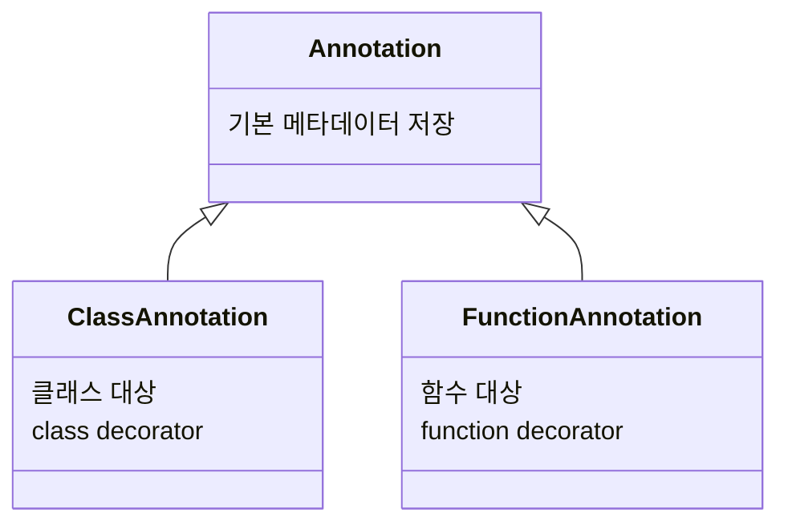
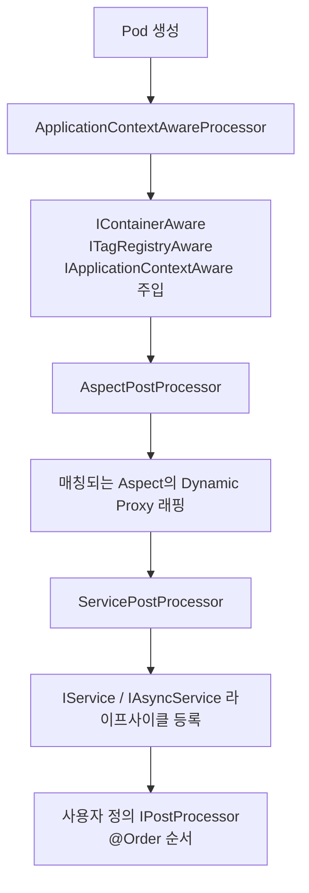
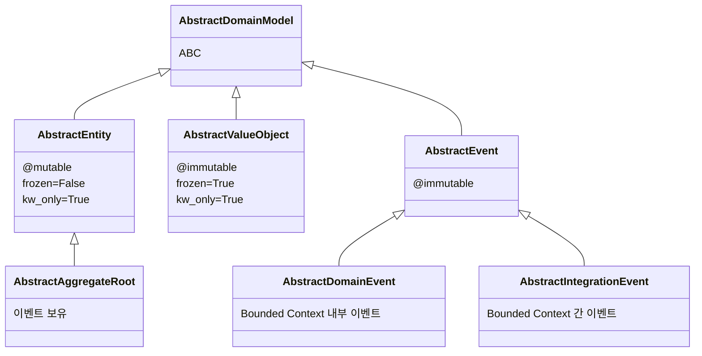
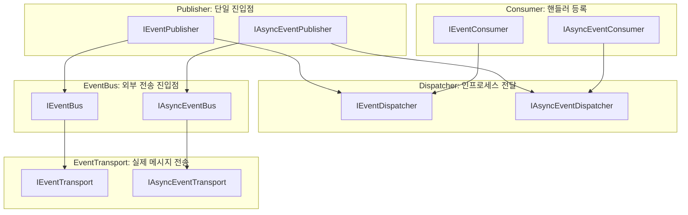
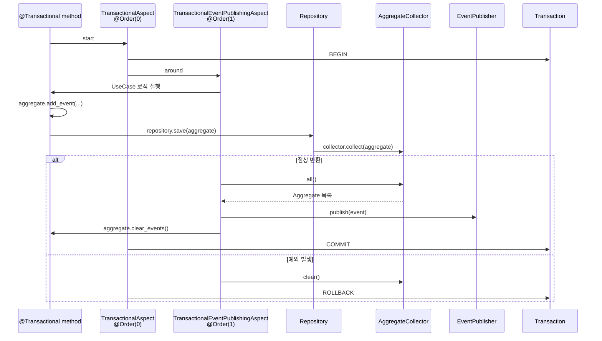
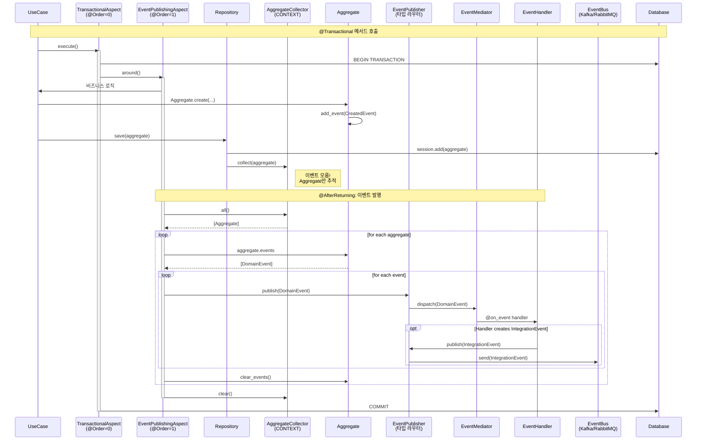
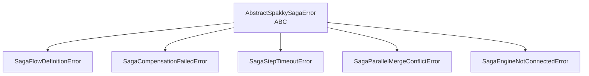

# Spakky Framework Architecture

> Spakky Framework의 전체 아키텍처를 기술합니다.
> 코드와 문서가 불일치할 경우, **코드가 진실**입니다.

---

## 패키지 구조

모노레포는 **코어 패키지**와 **플러그인 패키지**로 나뉩니다.

| 계층 | 패키지 | 역할 |
|------|--------|------|
| **Core** | `spakky` | DI Container, AOP, 애플리케이션 부트스트랩 |
| **Core** | `spakky-domain` | DDD 빌딩 블록 (Entity, AggregateRoot, ValueObject, Event, CQRS) |
| **Core** | `spakky-auth` | Provider-neutral 인증/인가 package root와 feature entry point |
| **Core** | `spakky-data` | 데이터 접근 추상화 (Repository, Transaction, AggregateCollector) |
| **Core** | `spakky-event` | 인프로세스 이벤트 시스템 (Publisher, Consumer, EventHandler) |
| **Core** | `spakky-task` | 태스크 큐 추상화 (@TaskHandler, @task, @schedule, Crontab) |
| **Core** | `spakky-agent` | Agentic workflow 계약 (AgentExecutionSpec, AgentYield, AgentState/Signal/Evidence, IAgentModel, delegation) |
| **Core** | `spakky-actuator` | Actuator 상태/정보 계약 (Health, Readiness, Liveness, Info) |
| **Core** | `spakky-cache` | 애플리케이션 데이터 캐시 계약 (CacheHit, CacheMiss, ICache) |
| **Core** | `spakky-tracing` | 분산 트레이싱 추상화 (TraceContext, ITracePropagator, W3C Propagator) |
| **Core** | `spakky-outbox` | Transactional Outbox 패턴 추상화 (IEventBus 교체, Relay) |
| **Core** | `spakky-saga` | 사가 오케스트레이션 (SagaFlow, SagaStep, ErrorStrategy, 보상 기반 롤백) |
| **Plugin** | `spakky-fastapi` | FastAPI REST 컨트롤러 통합 |
| **Plugin** | `spakky-typer` | Typer CLI 컨트롤러 통합 |
| **Plugin** | `spakky-security` | 암호화/해싱/JWT 유틸리티 |
| **Plugin** | `spakky-rabbitmq` | RabbitMQ 이벤트 브로커 통합 |
| **Plugin** | `spakky-kafka` | Apache Kafka 이벤트 브로커 통합 |
| **Plugin** | `spakky-sqlalchemy` | SQLAlchemy ORM 통합 + Outbox/Agent persistence contribution |
| **Plugin** | `spakky-celery` | Celery 태스크 디스패치 및 스케줄 등록 |
| **Plugin** | `spakky-logging` | 구조화 로깅, 컨텍스트 전파, @logged AOP Aspect |
| **Plugin** | `spakky-opentelemetry` | OpenTelemetry SDK 브릿지 (TracerProvider, OTel Propagator) |
| **Plugin** | `spakky-grpc` | gRPC 서비스 컨트롤러 통합 (code-first, 타입 안전 프로토콜 생성) |
| **Plugin** | `spakky-redis` | Redis 기반 애플리케이션 데이터 캐시 backend |
| **Plugin** | `spakky-openfga` | OpenFGA 관계 검사 AuthZ provider |
| **Plugin** | `spakky-vllm` | vLLM OpenAI-compatible `IAgentModel` adapter |

---

## 의존성 그래프

```mermaid
graph TD
    subgraph core_packages ["Core Packages"]
        core[spakky<br/>DI · AOP · Plugin]
        domain[spakky-domain<br/>Entity · Event · CQRS]
        auth[spakky-auth<br/>Auth root · Entry Point]
        data[spakky-data<br/>Repository · Transaction]
        event[spakky-event<br/>Publisher · Consumer · Aspect]
        task_pkg["spakky-task<br/>@task · @schedule · Crontab"]
        agent["spakky-agent<br/>AgentYield · State · Signal · Model Port · Delegation"]
        actuator["spakky-actuator<br/>Health · Readiness · Info"]
        cache["spakky-cache<br/>CacheHit · CacheMiss · ICache"]
        tracing["spakky-tracing<br/>TraceContext · Propagator"]
        outbox[spakky-outbox<br/>OutboxEventBus · Relay]
        saga[spakky-saga<br/>SagaFlow · SagaStep · Compensation]
    end

    subgraph plugins ["Plugins"]
        subgraph persistence ["Persistence"]
            sqlalchemy[spakky-sqlalchemy]
        end

        subgraph transport ["Transport"]
            rabbitmq[spakky-rabbitmq]
            kafka[spakky-kafka]
        end

        subgraph task_plugins ["Task"]
            celery_plugin[spakky-celery]
        end

        subgraph observability ["Observability"]
            logging_pkg[spakky-logging]
            otel[spakky-opentelemetry]
        end

        subgraph ui ["UI & Utility"]
            fastapi[spakky-fastapi]
            typer[spakky-typer]
            security[spakky-security]
            grpc[spakky-grpc]
            redis[spakky-redis]
            openfga[spakky-openfga]
            vllm[spakky-vllm]
        end
    end

    domain --> core
    auth --> core
    data --> domain
    event --> domain
    event --> data
    event --> tracing
    task_pkg --> core
    tracing --> core
    actuator --> core
    cache --> core
    outbox --> event
    outbox --> tracing
    saga --> core
    saga --> domain

    sqlalchemy --> data
    sqlalchemy -. outbox contribution .-> outbox
    sqlalchemy -. agent persistence contribution .-> agent
    rabbitmq --> event
    rabbitmq --> tracing
    kafka --> event
    kafka --> tracing
    openfga --> auth
    celery_plugin --> task_pkg
    celery_plugin --> tracing
    logging_pkg --> core
    otel --> core
    otel --> tracing
    otel -.->|optional| logging_pkg
    fastapi --> core
    fastapi --> tracing
    fastapi -. actuator endpoints .-> actuator
    typer --> core
    typer -. actuator commands .-> actuator
    security --> core
    grpc --> core
    grpc --> tracing
    redis --> cache
    vllm --> agent

    style core fill:#e1f5ff,stroke:#42a5f5,stroke-width:2px,color:#0d47a1
    style domain fill:#fff4e1,stroke:#ffa726,stroke-width:2px,color:#e65100
    style auth fill:#fff4e1,stroke:#ffa726,stroke-width:2px,color:#e65100
    style data fill:#e8f5e9,stroke:#66bb6a,stroke-width:2px,color:#1b5e20
    style event fill:#f3e5f5,stroke:#ab47bc,stroke-width:2px,color:#4a148c
    style outbox fill:#f3e5f5,stroke:#ab47bc,stroke-width:2px,color:#4a148c
    style task_pkg fill:#fce4ec,stroke:#ef5350,stroke-width:2px,color:#b71c1c
    style tracing fill:#e0f2f1,stroke:#26a69a,stroke-width:2px,color:#004d40
    style saga fill:#fff3e0,stroke:#ff9800,stroke-width:2px,color:#e65100

    style sqlalchemy fill:#f5f5f5,stroke:#9e9e9e,color:#424242
    style rabbitmq fill:#f5f5f5,stroke:#9e9e9e,color:#424242
    style kafka fill:#f5f5f5,stroke:#9e9e9e,color:#424242
    style celery_plugin fill:#f5f5f5,stroke:#9e9e9e,color:#424242
    style logging_pkg fill:#f5f5f5,stroke:#9e9e9e,color:#424242
    style otel fill:#f5f5f5,stroke:#9e9e9e,color:#424242
    style fastapi fill:#f5f5f5,stroke:#9e9e9e,color:#424242
    style typer fill:#f5f5f5,stroke:#9e9e9e,color:#424242
    style security fill:#f5f5f5,stroke:#9e9e9e,color:#424242
    style grpc fill:#f5f5f5,stroke:#9e9e9e,color:#424242
```



**핵심: 단방향 의존.** 하위 패키지는 상위 패키지를 모릅니다.

- **UI 플러그인** (fastapi, typer) → `spakky` 코어에만 의존. fastapi는 `spakky-tracing`에도 의존 (트레이싱 미들웨어)
- **유틸리티 플러그인** (security) → `spakky` 코어에만 의존
- **인증/인가 코어** (spakky-auth) → `spakky` 코어에만 의존. provider-neutral semantic model, ABC port, `AuthCapability`, `spakky.contributions.spakky.auth` contribution contract, AOP enforcement, feature-local capability startup validation을 제공하며 provider implementation은 후속 인증/인가 이슈에서 추가
- **인프라 플러그인** (sqlalchemy) → `spakky-data`에 의존. Base plugin은 SQLAlchemy substrate를 등록하고, Outbox 저장소는 `spakky-outbox`가 함께 설치·활성화된 경우 `spakky.contributions.spakky.outbox` contribution으로 등록하며, Agent state/signal/evidence 저장소는 `spakky-agent`가 함께 설치·활성화된 경우 `spakky.contributions.spakky.agent` contribution으로 등록
- **트랜스포트 플러그인** (rabbitmq, kafka) → `spakky-event`까지 의존 (전체 코어 체인). `spakky-tracing`에도 의존 (컨텍스트 전파)
- **Outbox 코어** (spakky-outbox) → `spakky-event` + `spakky-tracing`에 의존 (추상화 + 오케스트레이션)
- **태스크 코어** (spakky-task) → `spakky` 코어에만 의존
- **Agent 코어** (spakky-agent) → `spakky` 코어에만 의존. `@Agent` stereotype, AgentYield, state/signal/evidence, model port, tool binding, delegation 계약을 제공하며 vLLM/SQLAlchemy/FastAPI/Typer 같은 infrastructure dependency와 production in-memory persistence fallback을 포함하지 않음
- **vLLM 플러그인** (spakky-vllm) → `spakky-agent`에 의존하는 outbound `IAgentModel` adapter. vLLM OpenAI-compatible HTTP/SSE mapping만 담당하고 core 또는 inbound adapter를 역참조하지 않음
- **Actuator 코어** (spakky-actuator) → `spakky` 코어에만 의존
- **캐시 코어** (spakky-cache) → `spakky` 코어에만 의존
- **트레이싱 코어** (spakky-tracing) → `spakky` 코어에만 의존
- **이벤트 코어** (spakky-event) → `spakky-domain` + `spakky-data` + `spakky-auth` + `spakky-tracing`에 의존
- **태스크 플러그인** (spakky-celery) → `spakky-task` + `spakky-tracing`에 의존 (컨텍스트 전파)
- **로깅 플러그인** (spakky-logging) → `spakky` 코어에만 의존
- **OTel 플러그인** (spakky-opentelemetry) → `spakky` + `spakky-tracing`에 의존, `spakky-logging` optional
- **사가 코어** (spakky-saga) → `spakky` + `spakky-domain` + `spakky-auth`에 의존
- **gRPC 플러그인** (spakky-grpc) → `spakky` + `spakky-tracing`에 의존 + `grpcio`, `protobuf` 외부 의존성
- **Redis 캐시 플러그인** (spakky-redis) → `spakky-cache`에 의존 + `redis`, `pydantic-settings` 외부 의존성

---

## 코어: DI/IoC 컨테이너

### 어노테이션 시스템

프레임워크의 기반입니다. 모든 메타데이터는 `__spakky_annotation_metadata__` 속성에 저장됩니다.



**MRO 기반 인덱싱**: 어노테이션 설정 시 `type(self).mro()` 전체를 인덱싱합니다.
`@Controller`로 마킹된 클래스에 `Pod.exists(obj)`를 호출해도 `True`가 반환됩니다.

```python
# 모든 어노테이션이 제공하는 정적 메서드
Annotation.exists(obj)           # 존재 여부
Annotation.get(obj)              # 단일 조회 (없으면 에러)
Annotation.get_or_none(obj)      # 단일 조회 (없으면 None)
Annotation.all(obj)              # 전체 조회
```

### `@Pod` 데코레이터

컨테이너에 등록될 의존성 관리 대상을 선언합니다.

```python
from spakky.core.pod.annotations.pod import Pod

@Pod()
class UserService:
    def __init__(self, repo: UserRepository) -> None:
        self._repo = repo
```

**Pod의 핵심 필드:**

| 필드 | 설명 |
|------|------|
| `id` | UUID (자동 생성) |
| `name` | 기본값: `PascalCase → snake_case` |
| `scope` | `Pod.Scope.SINGLETON` (기본), `PROTOTYPE`, `CONTEXT` |
| `type_` | 클래스 타입 또는 함수의 반환 타입 |
| `base_types` | generic MRO에서 추출한 다형성 조회용 타입 집합 |
| `dependencies` | `__init__` 파라미터에서 추출한 의존성 맵 |

**Pod 초기화 로직 (`_initialize`):**

- **클래스 Pod**: `type_ = obj`, `__init__` 파라미터에서 의존성 추출
- **함수 Pod**: `type_ = return_annotation`, 함수 파라미터에서 의존성 추출
- `Annotated[T, Qualifier(...)]`로 한정자(qualifier)를 지정 가능
- `list[T]`, `tuple[T, ...]`, `dict[str, T]` 의존성은 같은 타입의 모든 Pod 후보를 안정적인 Pod name 순서로 주입
- 유효성 검사: `*args`/`**kwargs` 불가, positional-only 불가, 타입 힌트 필수

### 복수 구현체 DI Resolution

`ApplicationContext`는 하나의 interface/port에 여러 Pod가 등록되어도 registration을 허용합니다. 단수 의존성 주입이나 `get()` 호출에서 하나의 구현체가 필요할 때만 후보를 선택합니다.

| 선택 방식 | API | 우선순위 |
|-----------|-----|----------|
| Qualifier | `Annotated[T, Qualifier(...)]` | 1 |
| 명시 이름 조회 | `context.get(T, name="...")` | 2 |
| Application binding | `context.bind(PodBinding(...))`, `bind_to_type()`, `bind_to_name()` | 3 |
| Primary | `@Primary()`가 붙은 후보가 정확히 하나 | 4 |
| Legacy parameter name | 생성자 파라미터명이 Pod name과 일치 | 5 |
| 단일 후보 | 후보가 하나뿐인 타입 조회 | 6 |

Application binding은 애플리케이션 설정이 interface와 구현체 선택을 연결하는 정책 값입니다. `spakky.core.pod.binding.PodBinding(interface=T, implementation_type=Impl)` 또는 `PodBinding(interface=T, implementation_name="impl")` 중 정확히 하나의 target selector를 지정해야 하며, 둘 다 없거나 둘 다 있으면 `InvalidPodBindingError`가 발생합니다. Binding 대상이 등록 후보와 일치하지 않으면 `NoSuchPodBindingTargetError`가 발생합니다.

`list[T]`, `tuple[T, ...]`, `dict[str, T]` collection dependency는 모든 후보를 주입하므로 binding/`@Primary`로 단일화하지 않습니다. `dict[str, T]`는 등록된 Pod name을 key로 사용합니다. `set[T]`, bare collection type, `dict[K, T]`에서 `K != str`인 형태는 지원하지 않습니다.

### Pod 스코프

| 스코프 | 생명주기 | 구현 |
|--------|---------|------|
| `SINGLETON` | 컨테이너당 하나 | `RLock` 기반 double-checked locking |
| `PROTOTYPE` | 요청마다 새 인스턴스 | 캐시 없음 |
| `CONTEXT` | 요청/컨텍스트 단위 | `contextvars.ContextVar` 기반 캐시 |

### Pod 어노테이션

| 어노테이션 | 위치 | 용도 |
|-----------|------|------|
| `@Primary` | `spakky.core.pod.annotations.primary` | 복수 후보 중 우선 구현체 지정 |
| `@Order(n)` | `spakky.core.pod.annotations.order` | 실행 순서 제어 (낮을수록 먼저, 기본값: `sys.maxsize`) |
| `@Lazy` | `spakky.core.pod.annotations.lazy` | 첫 접근 시까지 초기화 지연 |
| `@Tag` | `spakky.core.pod.annotations.tag` | 커스텀 메타데이터 태그 |
| `Qualifier` | `spakky.core.pod.annotations.qualifier` | `Annotated[T, Qualifier(...)]` 형태로 의존성 한정 |

### 스테레오타입

모든 스테레오타입은 **`Pod`의 서브클래스**입니다. MRO 기반 인덱싱으로 `Pod.exists()`가 모든 스테레오타입에 대해 동작합니다.

| 스테레오타입 | 패키지 | 용도 |
|-------------|--------|------|
| `@Controller` | `spakky.core.stereotype.controller` | 기본 컨트롤러 |
| `@UseCase` | `spakky.core.stereotype.usecase` | 비즈니스 로직 |
| `@Configuration` | `spakky.core.stereotype.configuration` | 설정 클래스 |
| `@Repository` | `spakky.data.stereotype.repository` | 데이터 접근 |
| `@EventHandler` | `spakky.event.stereotype.event_handler` | 이벤트 처리 |
| `@TaskHandler` | `spakky.task.stereotype.task_handler` | 태스크 핸들러 |
| `@Saga` | `spakky.saga.stereotype` | 사가 오케스트레이터 |
| `@GrpcController` | `spakky.plugins.grpc.stereotypes.grpc_controller` | gRPC 서비스 컨트롤러 |
| `@Aspect` / `@AsyncAspect` | `spakky.core.aop.aspect` | AOP 관점 |

### 컨테이너 (`ApplicationContext`)

`IApplicationContext(IContainer, ITagRegistry, ABC)`의 구현체입니다.

**내부 캐시 구조:**

| 캐시 | 용도 |
|------|------|
| `__pods: dict[str, Pod]` | name → Pod 레지스트리 |
| `__type_cache: dict[type, set[Pod]]` | type → Pods (O(1) 다형성 조회) |
| `__singleton_cache: dict[str, object]` | 싱글턴 인스턴스 캐시 |
| `__context_cache: ContextVar[dict]` | CONTEXT 스코프 인스턴스 캐시 |
| `__tags: set[Tag]` | 태그 레지스트리 |

**의존성 해결 순서:**

1. `__type_cache`에서 타입으로 후보 조회 (O(1))
2. Qualifier 또는 명시 name selector가 있으면 해당 후보로 필터링
3. 설정 binding → `@Primary` → legacy parameter name 순으로 필터링
4. selector 없이 후보가 1개만 남으면 단일 후보를 반환
5. 여전히 모호 → 후보 Pod와 해결 힌트가 포함된 `NoUniquePodError`

`contains(type_)`는 타입 후보 존재 여부만 나타냅니다. 후보가 둘 이상이고
단수 resolution이 모호해도 후보가 등록되어 있으면 `True`이며, 실제 단수
선택 가능성은 `get(type_)` 또는 의존성 주입 시점에 판정합니다.

`NoUniquePodError`는 요청 타입, 후보 Pod name/type, `@Primary` 여부,
dependency path, 해결 힌트를 구조화된 diagnostic으로 제공합니다.

**인스턴스화 시 순환 참조 감지:**

- 불변 튜플 `dependency_hierarchy`로 재귀 경로를 추적
- 이미 방문한 타입 발견 시 `CircularDependencyGraphDetectedError` (체인 정보 포함)
- 누락·순환 의존성 진단은 `Pod.dependencies` 메타데이터에서 실패 Pod, 파라미터, 요청 타입, 경로를 구성합니다.

### Post-Processor 파이프라인

Pod 생성 후 순차적으로 적용되는 후처리기입니다.



### 애플리케이션 부트스트랩

```python
from spakky.core.application.application import SpakkyApplication
from spakky.core.application.application_context import ApplicationContext

app = (
    SpakkyApplication(ApplicationContext())
    .load_plugins()   # entry_points("spakky.plugins") 기반 플러그인 로드
    .add(CustomPod)   # 개별 Pod 등록
    .scan()           # 호출자 패키지 자동 감지 → 모듈 스캔 → Pod/Tag 등록
    .start()          # Post-Processor 등록 → 비-Lazy 싱글턴 초기화 → 서비스 시작
)
```

**`scan()` 자동 감지**: `inspect.stack()`으로 호출자의 패키지를 찾고, 하위 모듈을 재귀 순회하며 `Pod.exists()` 또는 `Tag.exists()`인 객체를 등록합니다.

**Startup diagnostics**: `enable_startup_diagnostics()`는 no-op 기본 recorder를 활성 recorder로 교체합니다. 활성화된 앱은 startup attempt별 `StartupReport`를 생성하고 `load_plugins`, `scan`, `registration`, `post_processor_registration`, `instantiation`, `post_processing`, `service_start` phase를 실행 순서대로 기록합니다. 각 record는 phase name, elapsed seconds, processed count, success/failure status, optional diagnostic details, optional structured failure summary를 포함합니다. `load_plugins` phase는 base plugin 이후 로드된 feature contribution의 loaded/skipped/failed count와 `inactive_feature`, `inactive_provider`, `include_filter` skip reason을 diagnostic detail로 기록합니다. 실패 phase는 기록된 뒤 기존 예외를 그대로 전파합니다.

**DiscoveryManifest 재사용**: `enable_discovery_manifest(path=None)`을 `scan()` 전에 호출하면 scan discovery 결과를 JSON manifest로 저장합니다. manifest fingerprint는 schema version, Python major/minor version, scan 대상 module/package, exclude pattern, source file mtime/size로 구성됩니다. decision은 `miss`, `hit`, `stale_schema`, `stale_input` 중 하나이며 startup diagnostics의 scan phase diagnostic detail로 기록됩니다. `hit`은 저장된 Pod/Tag 후보를 기존 등록 경로로 재생하고, stale/miss는 기존 fresh discovery로 돌아갑니다. container lookup/type cache는 변경하지 않습니다.

---

## 코어: AOP 시스템

### 포인트컷

메서드에 적용하여 "언제" 어드바이스를 실행할지 지정합니다.

| 포인트컷 | 실행 시점 |
|----------|----------|
| `@Before` | 대상 메서드 실행 전 |
| `@AfterReturning` | 대상 메서드 정상 반환 후 |
| `@AfterRaising` | 대상 메서드 예외 발생 후 |
| `@After` | 대상 메서드 종료 후 (항상) |
| `@Around` | 대상 메서드를 감싸서 실행 |

모든 포인트컷은 `pointcut: Callable[[Func], bool]` 선택자 함수를 받습니다.

### Aspect 인터페이스

| 인터페이스 | 위치 | 용도 |
|-----------|------|------|
| `IAspect` | `spakky.core.aop.interfaces.aspect` | 동기 어드바이스 메서드 |
| `IAsyncAspect` | `spakky.core.aop.interfaces.aspect` | 비동기 어드바이스 메서드 |

모든 어드바이스 메서드는 **기본 no-op 구현**을 가지므로, 필요한 것만 오버라이드합니다.

### Dynamic Proxy 메커니즘

```mermaid
flowchart TD
    processor[AspectPostProcessor]
    collect[매칭되는 Aspect 수집]
    order[@Order 정렬]
    factory[ProxyFactory]
    subclass["types.new_class('{TypeName}@DynamicProxy', ...)"]
    handler[AspectProxyHandler]
    chain[Advisor 체인 구성]
    call[Advisor.__call__]
    before[before]
    around[around(joinpoint)]
    result[after_returning / after_raising]
    after[after]

    processor --> collect --> order --> factory --> subclass --> handler --> chain --> call
    call --> before --> around --> result --> after
```

- **런타임 서브클래스**: `types.new_class()`로 프록시 클래스를 생성하여 `isinstance()` 투명성을 유지합니다.
- **Advisor 체이닝**: `self.next`가 다음 `Advisor`를 가리키며, `@Order` 순서에 따라 중첩됩니다.

### 실행 예시

```python
from spakky.core.aop.aspect import AsyncAspect
from spakky.core.aop.interfaces.aspect import IAsyncAspect
from spakky.core.aop.pointcut import Around
from spakky.core.pod.annotations.order import Order

@Order(0)
@AsyncAspect()
class TimingAspect(IAsyncAspect):
    async def around_async(self, joinpoint, *args, **kwargs):
        start = time.time()
        result = await joinpoint(*args, **kwargs)
        logger.info("Elapsed: %.3fs", time.time() - start)
        return result
```

---

## 코어: 플러그인 시스템

### Entry Point 기반 발견

각 서브패키지의 `pyproject.toml`에 등록합니다:

```toml
[project.entry-points."spakky.plugins"]
spakky-data = "spakky.data.main:initialize"
```

`SpakkyApplication.load_plugins()`는 `importlib.metadata.entry_points(group="spakky.plugins")`로 등록된 base 플러그인을 발견하고, 각 플러그인의 `initialize(app: SpakkyApplication)` 함수를 호출합니다. 그 뒤 active core feature마다 `spakky.contributions.<feature>` group을 조회해 feature contribution을 base plugin 이후, `scan()`/`start()` 이전에 호출합니다. Feature plugin 이름의 `-`는 entry point group에서 `.`로 정규화되므로 `spakky-outbox`의 group은 `spakky.contributions.spakky.outbox`입니다. 복수 구현체 DI resolution은 이 자동 활성화 모델을 유지합니다. 여러 플러그인이 같은 port 후보를 등록해도 플러그인은 그대로 초기화되고, 단수 주입 지점에서만 Qualifier/name/binding/`@Primary`/legacy parameter name 순서로 하나를 선택합니다.

### 플러그인 등록 요약

| 플러그인 | 등록하는 컴포넌트 |
|---------|-------------------|
| `spakky-logging` | `LoggingConfig`, `LoggingSetupPostProcessor`, `LoggingAspect`, `AsyncLoggingAspect` |
| `spakky-domain` | (없음 — 모델만 제공) |
| `spakky-auth` | Provider-neutral auth model, ABC port, `AuthCapability`, auth contribution contract, AOP enforcement, capability startup validation |
| `spakky-policy` | YAML/TOML/JSON policy document evaluator for RBAC/PBAC/ABAC authorization |
| `spakky-oidc` | OIDC/OAuth bearer credential verification provider for `AuthCapability.AUTHENTICATION` |
| `spakky-data` | `AsyncTransactionalAspect`, `TransactionalAspect`, `AggregateCollector` |
| `spakky-event` | `EventMediator`, `EventPublisher` (sync+async), `DirectEventBus` (sync+async), `TransactionalEventPublishingAspect` (sync+async), `EventHandlerRegistrationPostProcessor` |
| `spakky-fastapi` | `BindLifespanPostProcessor`, `AddBuiltInMiddlewaresPostProcessor`, `RegisterRoutesPostProcessor`, `RegisterActuatorPostProcessor` |
| `spakky-typer` | `TyperCLIPostProcessor`, `ActuatorTyperCommandPostProcessor` |
| `spakky-security` | (없음 — 유틸리티 함수만 제공) |
| `spakky-rabbitmq` | `RabbitMQConnectionConfig`, Consumer/`RabbitMQEventTransport` (sync+async), `RabbitMQPostProcessor` |
| `spakky-kafka` | `KafkaConnectionConfig`, Consumer/`KafkaEventTransport` (sync+async), `KafkaPostProcessor` |
| `spakky-sqlalchemy` | `SQLAlchemyConnectionConfig`, `SchemaRegistry`, Session/ConnectionManager, Transaction |
| `spakky-sqlalchemy` contribution for `spakky-outbox` | `SqlAlchemyOutboxStorage` (sync+async), `OutboxMessageTable` |
| `spakky-sqlalchemy` contribution for `spakky-agent` | `SqlAlchemyAgentStateRepository`, `SqlAlchemyAgentSignalRepository`, `SqlAlchemyAgentEvidenceRepository`, `AgentStateTable`, `AgentSignalTable`, `AgentEvidenceTable` |
| `spakky-outbox` | `OutboxConfig`, `OutboxEventBus` (sync+async), `OutboxRelayBackgroundService` (sync+async) |
| `spakky-task` | `TaskRegistrationPostProcessor` |
| `spakky-actuator` | `ActuatorConfig`, `ActuatorExtensionRegistry`, `ActuatorExtensionPostProcessor`, `ActuatorAggregationService` |
| `spakky-cache` | `CacheAspect`, `AsyncCacheAspect` |
| `spakky-celery` | `CeleryConfig`, `CeleryPostProcessor`, `CeleryTaskDispatchAspect` (sync+async) |
| `spakky-tracing` | `W3CTracePropagator` |
| `spakky-opentelemetry` | `OpenTelemetryConfig`, `OTelSetupPostProcessor` |
| `spakky-saga` | (없음 — `@Saga`가 `@Pod` 기반이므로 Pod 스캔만으로 DI 컨테이너가 관리) |
| `spakky-grpc` | `RegisterServicesPostProcessor`, `AddInterceptorsPostProcessor`, `BindServerPostProcessor` |
| `spakky-redis` | `RedisCacheConfig`, `RedisCache` |
| `spakky-vllm` | `VllmConfig`, `HttpxVllmChatClient`, `VllmAgentModel` |

### Agentic workflow layer

`spakky-agent`는 LLM SDK wrapper가 아니라 application layer building block입니다. `@Agent`는 `@UseCase`와 동격인 `@Pod` 계열 stereotype이고, inbound adapter는 `execute()`가 내보내는 `AgentYield` stream을 HTTP/WebSocket/CLI 이벤트로 변환합니다. Agent 내부의 비결정적 orchestration은 business workflow로 남고, 외부 세계 접근은 constructor DI로 받은 outbound port와 `@agent_tool` descriptor를 통해서만 표현합니다.

Core public API의 중심은 `AgentExecutionSpec`, `AgentYield`, `AgentState`, `AgentSignal`, `AgentEvidence`, `IAgentModel`, `@agent_tool`, `DelegationPacket`/`IAgentDelegate`, context/safety/recovery contract입니다. Durable 실행은 `RecoveryStrategy.ACTION_BOUNDARY` 또는 `accepted_signals` 선언에서 파생되며, bootstrap 단계에서 `IAgentStateRepository`, `IAgentSignalRepository`, `IAgentEvidenceRepository`가 모두 등록되어 있는지 검증합니다. Core는 production in-memory repository fallback을 제공하지 않습니다.

`spakky-vllm`은 첫 공식 model provider plugin입니다. `VllmConfig`, `HttpxVllmChatClient`, `VllmAgentModel`을 등록하고 `IAgentModel -> VllmAgentModel` binding을 추가합니다. 이 패키지는 OpenAI-compatible vLLM `/v1/chat/completions` 요청, SSE stream, structured output, tool-call JSON validation을 provider-neutral `ModelResponse`/`ModelStreamEvent`로 변환하며, `spakky-agent` core와 inbound adapter package를 역참조하지 않습니다.

`spakky-sqlalchemy`는 ADR-0010 feature contribution 정책에 따라 Agent persistence를 기여합니다. `spakky.contributions.spakky.agent` entry point는 `spakky-agent` feature와 `spakky-sqlalchemy` provider가 모두 active일 때 base plugin 이후 로드되어 `AgentStateTable`, `AgentSignalTable`, `AgentEvidenceTable`과 세 repository Pod을 등록합니다. Signal은 `consumed_at`으로 pending queue를 구분하고, Evidence repository는 append/read만 노출해 append-only contract를 유지합니다. 별도 `spakky-agent-sqlalchemy` plugin은 만들지 않습니다.

### 애플리케이션 데이터 캐시

`spakky-cache`는 서비스·유스케이스 코드가 backend에 묶이지 않고 `CacheHit`/`CacheMiss`와 sync/async `ICache` 계약으로 애플리케이션 데이터를 캐시하기 위한 코어 패키지입니다. 이 캐시는 `ApplicationContext`의 type/singleton/context 내부 캐시와 별개이며 DI 컨테이너 lookup 동작을 변경하지 않습니다.

`spakky-cache` 플러그인은 backend-neutral `ICache` 계약과 `@cacheable`/`@cache_evict` 메서드를 처리하는 `CacheAspect`, `AsyncCacheAspect`만 등록합니다. Core layer는 실제 저장소 backend를 제공하지 않습니다. `spakky-redis`는 같은 계약을 Redis에 연결하는 backend plugin이며, configured key prefix 하위 항목만 clear하고 tag invalidation, Redis lock 기반 cache stampede protection, write-through/write-behind policy, metrics snapshot, actuator health/info extension을 제공합니다.

---

## 도메인 레이어 (spakky-domain)

### 모델 계층



> **`@mutable` / `@immutable`**: `spakky.core.common.mutability`에서 제공하는 데코레이터입니다.
> 표준 `@dataclass`를 래핑하며, 부모 클래스의 frozen 설정과 일치시키기 위해 도메인 모델에는 반드시 이 데코레이터를 사용합니다.

### Entity

- `uid`, `version` (UUID v7), `created_at`, `updated_at` 필드
- 동등성: `uid` 기반 (identity equality)
- `__setattr__` 오버라이드: 유효성 검사 + `updated_at`/`version` 자동 갱신
- 추상 메서드: `next_id()`, `validate()`

### AggregateRoot

- `AbstractEntity`를 확장
- `__events: list[AbstractDomainEvent]`를 내부적으로 관리
- `add_event()`, `remove_event()`, `clear_events()`, `events` (프로퍼티, 복사본 반환)

### ValueObject

- 동등성: `astuple(self)` 기반 (structural equality)
- 모든 속성 타입이 hashable인지 `__init_subclass__`에서 검증
- `clone()` → `self` 반환 (불변이므로 안전)

### Event

- `event_id: UUID`, `timestamp: datetime`
- `event_name` → 클래스명
- `IComparable` 구현: `timestamp` 기반 비교

### CQRS

```python
# Command
ICommandUseCase[CommandT_contra, ResultT_co].run(command) -> result
IAsyncCommandUseCase[CommandT_contra, ResultT_co].run(command) -> result

# Query
IQueryUseCase[QueryT_contra, ResultT_co].run(query) -> result
IAsyncQueryUseCase[QueryT_contra, ResultT_co].run(query) -> result
```

#### CQRS 조회 원칙

**조회(Query)는 사용자의 직접 구현을 원칙으로 합니다.**

- Repository에 다양한 조회 메서드(`find_by_xxx`, `search_xxx` 등)를 추가하지 않습니다.
- Repository는 Aggregate의 **영속성 관리**(CRUD)만 담당합니다.
- 복잡한 조회는 **QueryUseCase**에서 직접 ORM/SQL을 사용하여 구현합니다.

**이유**: Repository에 조회 관점이 침투하면 도메인이 인프라에 의존하게 되고,
결과적으로 **도메인 오염**의 위험이 높아집니다.

```python
# ❌ 잘못된 예: Repository에 조회 관점 추가
class IUserRepository:
    def find_by_email(self, email: str) -> User | None: ...  # 조회 관점!
    def search_by_name(self, name: str) -> list[User]: ...   # 조회 관점!

# ✅ 올바른 예: QueryUseCase에서 직접 구현
@UseCase()
class FindUserByEmailUseCase(IAsyncQueryUseCase[FindUserByEmailQuery, UserDTO]):
    def __init__(self, session: AsyncSession) -> None:
        self._session = session

    async def run(self, query: FindUserByEmailQuery) -> UserDTO:
        # 직접 ORM/SQL 사용
        result = await self._session.execute(
            select(UserTable).where(UserTable.email == query.email)
        )
        ...
```

---

## 데이터 레이어 (spakky-data)

### `@Transactional`과 트랜잭션 Aspect

`Transactional(FunctionAnnotation)` — 메서드에 트랜잭션 경계를 선언합니다.
하나의 어노테이션으로 sync/async를 모두 처리합니다.

| Aspect | @Order | 대상 |
|--------|--------|------|
| `AsyncTransactionalAspect` | 0 | `@Transactional` + `iscoroutinefunction` |
| `TransactionalAspect` | 0 | `@Transactional` + sync |

```python
# 둘 다 동일한 @Transactional() 사용
from spakky.data.aspects.transactional import Transactional

@Transactional()
def sync_method(self): ...

@Transactional()
async def async_method(self): ...
```

### Repository 인터페이스

`IGenericRepository[AggregateRootT, AggregateIdT_contra]`:
- `get()`, `get_or_none()`, `contains()`, `range()`
- `save()`, `save_all()`, `delete()`, `delete_all()`

`IAsyncGenericRepository` — 비동기 버전.

### AggregateCollector

```python
@Pod(scope=Pod.Scope.CONTEXT)
class AggregateCollector:
    """트랜잭션 내에서 save()된 Aggregate를 추적합니다."""
```

- **CONTEXT 스코프**: 요청/트랜잭션 단위로 격리
- `collect(aggregate)`: Repository에서 save 시 호출
- `all()`: 추적된 전체 Aggregate 조회
- `clear()`: 트랜잭션 종료 시 정리

**핵심**: AggregateCollector는 **이벤트의 존재를 모릅니다**. Aggregate만 추적하며, 이벤트 추출은 `spakky-event`의 Aspect가 담당합니다.

### Transaction 추상화

```mermaid
flowchart TD
    tx[AbstractTransaction<br/>context manager]
    enter["__enter__()"]
    init[initialize()]
    exit["__exit__()"]
    commit[commit()]
    rollback[rollback()]
    dispose[dispose()]
    flag[autocommit_enabled 플래그]
    async_tx[AbstractAsyncTransaction<br/>async context manager]

    tx --> enter --> init
    tx --> exit
    exit --> commit
    exit --> rollback
    exit --> dispose
    flag --> exit
    async_tx --> tx
```

### External Proxy 패턴

**외부 저장소 또는 서비스 호출**을 통한 데이터 접근을 추상화하는 읽기 전용 인터페이스입니다.

> **주의**: External Proxy는 **데이터베이스 접근이 아닙니다**. 외부 REST API, gRPC 서비스, 레거시 시스템,
> 메시지 큐 조회 등 **프로세스 외부의 서비스 호출**을 추상화합니다.
> Repository는 도메인 Aggregate의 영속성을, Proxy는 외부 서비스 데이터 조회를 담당합니다.

- `ProxyModel[ProxyIdT_contra]` — `@immutable`, identity equality
- `IGenericProxy` / `IAsyncGenericProxy` — `get()`, `get_or_none()`, `contains()`, `range()`

**사용 사례**:
- 외부 마이크로서비스 API 호출
- 서드파티 서비스 데이터 조회 (결제, 배송 등)
- 레거시 시스템 연동
- 외부 캐시 서버 조회

---

## 이벤트 레이어 (spakky-event)

### 이벤트 인터페이스 구조

> 설계 배경 및 대안 분석은 [ADR-0001](docs/adr/0001-event-system-redesign.md)을 참조하세요.

5가지 역할 축으로 구성됩니다:



- **Publisher** (`IEventPublisher`): `publish(event: AbstractEvent)` — 타입 기반 라우팅
  - `AbstractDomainEvent` → `EventMediator` (인프로세스 dispatch)
  - `AbstractIntegrationEvent` → `IEventBus` (외부 전송)
- **EventBus** (`IEventBus`): `send(event: AbstractIntegrationEvent)` — Integration Event 발행 진입점, Outbox seam 역할. `DirectEventBus` / `AsyncDirectEventBus`는 기존 tracing header를 보존하고, `AuthSnapshotPropagationConfig(enabled=True)`와 request-scope `AuthContext`가 있으면 raw bearer token 대신 signed `AuthContextSnapshot` envelope를 `spakky.auth.context_snapshot` metadata로 주입합니다.
- **EventTransport** (`IEventTransport`): `send(event: AbstractIntegrationEvent)` — 실제 메시지 브로커 전송 (Kafka/RabbitMQ 구현)
- **Dispatcher**: `dispatch(event)` — 등록된 핸들러에 인프로세스 전달
- **Consumer**: `register(event_type, handler)` — 이벤트 타입과 콜백 연결

### EventPublisher 타입 기반 라우팅

`EventPublisher`는 이벤트 타입에 따라 경로를 결정하는 라우터입니다:

```python
@Pod()
class AsyncEventPublisher(IAsyncEventPublisher):
    _dispatcher: IAsyncEventDispatcher
    _bus: IAsyncEventBus

    async def publish(self, event: AbstractEvent) -> None:
        match event:
            case AbstractDomainEvent():
                await self._dispatcher.dispatch(event)
            case AbstractIntegrationEvent():
                await self._bus.send(event)
            case _:
                raise AssertionError(f"Unknown event type: {type(event)!r}")
```

- **`IEventBus`는 필수 의존성**: `spakky-event` 플러그인이 `DirectEventBus`를 기본 등록하므로 항상 사용 가능
- **Transport 플러그인 설치 시**: Kafka/RabbitMQ가 `IEventTransport`를 제공하여 `DirectEventBus`가 실제 메시지 브로커로 전송

### Mediator 패턴

`EventMediator`가 Consumer + Dispatcher를 통합합니다.

- `_handlers: dict[type[AbstractEvent], list[callback]]`
- **Resilient dispatch**: 핸들러 예외가 발생해도 나머지 핸들러는 계속 실행됩니다.

### `@EventHandler`와 `@on_event`

```python
from spakky.event.stereotype.event_handler import EventHandler, on_event

@EventHandler()
class UserEventHandler:
    @on_event(UserCreatedEvent)
    async def on_user_created(self, event: UserCreatedEvent) -> None:
        ...
```

`EventHandlerRegistrationPostProcessor`가 `@EventHandler` Pod를 스캔하여 `@on_event` 메서드를 Consumer에 자동 등록합니다.

### 트랜잭션-이벤트 통합

`TransactionalEventPublishingAspect`가 `@Transactional` 메서드의 성공 후 이벤트를 자동 발행합니다.



**Handler 실패 = 전체 롤백 = 데이터 일관성 보장**

### DomainEvent vs IntegrationEvent

| 특성 | DomainEvent | IntegrationEvent |
|------|------------|-----------------|
| **범위** | BC 내부 | BC 외부 (마이크로서비스 간) |
| **발생** | Aggregate에서 | EventHandler에서 명시적 생성 |
| **전달** | `EventMediator` (인프로세스) | `IEventBus` → Message Broker |
| **패키지** | `spakky-event` | `spakky-event` + 트랜스포트 플러그인 |
| **Outbox** | 불필요 | `IEventBus` `@Primary` 교체로 opt-in |

### Domain → Integration Event 변환 흐름

핸들러가 DomainEvent를 받아 IntegrationEvent를 **명시적으로** 생성합니다:

```python
@EventHandler()
class OrderEventHandler:
    _publisher: IAsyncEventPublisher  # DI 주입

    @on_event(OrderCreatedEvent)
    async def handle(self, event: OrderCreatedEvent) -> None:
        # 인프로세스 처리
        await self._notification_service.send(event.order_id)

        # 외부 전송이 필요한 경우 → IntegrationEvent 생성
        await self._publisher.publish(
            OrderCreatedIntegrationEvent(order_id=event.order_id)
        )
        # → EventPublisher → IEventBus.send() → Kafka/RabbitMQ
```

### Outbox 패턴 (opt-in)

`IEventBus`와 `IEventTransport`의 **2단 인터페이스 분리**로 Outbox PnP를 달성합니다:

```mermaid
flowchart TD
    event_bus[IEventBus]
    direct[DirectEventBus]
    outbox_bus[OutboxEventBus<br/>@Primary]
    table[outbox_table.insert()<br/>같은 트랜잭션]
    relay[OutboxRelay<br/>background]
    transport[IEventTransport.send()]
    broker[Kafka / RabbitMQ]

    event_bus --> direct --> transport --> broker
    event_bus --> outbox_bus --> table --> relay --> transport
```

- **DirectEventBus**: 기본 `IEventBus` 구현. `IEventTransport`에 직접 위임
- **OutboxEventBus**: Outbox 플러그인이 `@Primary`로 `IEventBus`를 교체
- **OutboxRelay**: `IEventTransport`에 의존하여 실제 전송 (DI 경쟁 없음)
- **핵심**: `IEventBus`와 `IEventTransport`가 다른 인터페이스이므로 컨테이너의 DI 경쟁 없이 `@Primary` 하나로 PnP 달성

### 시퀀스 다이어그램



---

## 태스크 레이어 (spakky-task)

태스크 큐 추상화를 제공합니다. 구현체(Celery 등)와 독립된 선언적 인터페이스로, 비즈니스 로직에서 태스크 큐 세부사항을 분리합니다.

### `@TaskHandler`와 `@task`

```python
from spakky.task import TaskHandler, task

@TaskHandler()
class EmailTaskHandler:
    @task
    def send_email(self, to: str, subject: str, body: str) -> None:
        """AOP Aspect가 호출을 가로채 브로커로 디스패치합니다."""
        ...
```

- **`@TaskHandler`**: `Pod`의 서브클래스. 태스크 메서드를 포함하는 클래스를 마킹합니다.
- **`@task`**: 메서드에 `TaskRoute` 어노테이션을 부착. 플러그인 Aspect가 호출을 가로채 브로커로 디스패치합니다.
- **`@schedule`**: 정기 실행용. PostProcessor가 브로커 스케줄러에 등록합니다. `interval`, `at`, `crontab` 중 하나를 지정합니다.

### `Crontab`

Python 네이티브 타입 기반 cron 명세입니다. 문자열 대신 `Weekday`/`Month` IntEnum을 사용합니다.

| 필드 | 타입 | 기본값 |
|------|------|--------|
| `month` | `Month \| tuple[Month, ...] \| None` | `None` (매월) |
| `day` | `int \| tuple[int, ...] \| None` | `None` (매일) |
| `weekday` | `Weekday \| tuple[Weekday, ...] \| None` | `None` (매일) |
| `hour` | `int` | `0` |
| `minute` | `int` | `0` |

### `TaskRegistrationPostProcessor`

`@TaskHandler` Pod를 스캔하여 `@task` 메서드의 `TaskRoute`를 수집합니다. 플러그인(예: `spakky-celery`)은 이 PostProcessor에서 수집된 라우트를 가져와 브로커에 등록합니다.

### `ITaskResult`

디스패치된 태스크의 결과 핸들입니다. 구현체(예: `CeleryTaskResult`)가 브로커별로 제공합니다.

- `task_id` — 디스패치된 태스크의 고유 식별자
- `get()` / `get_async()` — 태스크 완료까지 대기 후 결과 반환

> **분리 배경**: `@task`(온디맨드)와 `@schedule`(정기)의 분리 근거는 [ADR-0003](docs/adr/0003-task-schedule-decorator-split.md) 참조.

---

## 트레이싱 레이어 (spakky-tracing)

분산 트레이싱 추상화를 제공합니다. W3C Trace Context Level 2와 호환되는 `TraceContext`와 `ITracePropagator` 인터페이스를 정의하며, 순수 Python 구현체(`W3CTracePropagator`)를 기본 등록합니다.

### `TraceContext`

`@immutable` 데이터클래스로, `contextvars` 기반의 ambient trace context를 관리합니다.

| 필드 | 설명 |
|------|------|
| `trace_id` | 128-bit hex (32자) |
| `span_id` | 64-bit hex (16자) |
| `parent_span_id` | 부모 span ID (루트는 `None`) |
| `trace_flags` | 트레이스 플래그 (0x01 = sampled) |

**주요 메서드:**

- `new_root()` → 새 루트 트레이스 생성
- `child()` → 현재 컨텍스트의 자식 스팬 생성
- `to_traceparent()` / `from_traceparent()` → W3C traceparent 직렬화/역직렬화
- `get()` / `set()` / `clear()` → `contextvars` 기반 ambient context 접근

### `ITracePropagator`

서비스 경계를 넘는 트레이스 컨텍스트 전파 인터페이스입니다. OpenTelemetry `TextMapPropagator` 규약을 따릅니다.

| 메서드 | 설명 |
|--------|------|
| `inject(carrier)` | 현재 `TraceContext`를 캐리어(헤더 딕셔너리)에 기록 |
| `extract(carrier)` | 캐리어에서 `TraceContext`를 복원 |
| `fields()` | 사용하는 헤더 필드명 반환 |

### `W3CTracePropagator`

기본 `ITracePropagator` 구현체입니다. `traceparent` 헤더를 사용합니다. 외부 의존성 없이 순수 Python으로 구현되어 있습니다.

### OTel 교체 메커니즘

`spakky-opentelemetry`가 설치되면 `OTelSetupPostProcessor`가 `W3CTracePropagator`를 `OTelTracePropagator`로 런타임 교체합니다. 자세한 내용은 [ADR-0004](docs/adr/0004-distributed-tracing-architecture.md) 참조.

---

## 아웃박스 레이어 (spakky-outbox)

Transactional Outbox 패턴의 추상화를 제공합니다. `IEventBus`를 `@Primary`로 교체하여 이벤트를 트랜잭션 내에서 아웃박스에 저장하고, 백그라운드 릴레이가 외부 트랜스포트로 전송합니다.

### PnP 아키텍처

```mermaid
flowchart TD
    event_bus[IEventBus]
    direct[DirectEventBus]
    outbox_bus[OutboxEventBus<br/>@Primary]
    table[outbox_table.insert()<br/>같은 트랜잭션]
    relay[OutboxRelay<br/>background]
    transport[IEventTransport]
    broker[Kafka / RabbitMQ]

    event_bus --> direct --> transport --> broker
    event_bus --> outbox_bus --> table --> relay --> transport
```

`IEventBus`와 `IEventTransport`가 다른 인터페이스이므로 DI 경쟁 없이 `@Primary` 교체로 PnP를 달성합니다.

### 컴포넌트

| 컴포넌트 | 설명 |
|---------|------|
| `IOutboxStorage` / `IAsyncOutboxStorage` | 아웃박스 메시지 저장소 포트 |
| `OutboxEventBus` / `AsyncOutboxEventBus` | `@Primary`로 `DirectEventBus`를 교체하는 EventBus seam. 저장되는 Outbox headers에는 tracing metadata와 signed `AuthContextSnapshot` metadata가 함께 보존되며 raw bearer token은 저장하지 않음 |
| `OutboxRelayBackgroundService` / `AsyncOutboxRelayBackgroundService` | 백그라운드 릴레이 (polling → `IEventTransport.send()`) |
| `OutboxConfig` | 환경변수 기반 설정 (polling interval, batch size, retry 등) |
| `OutboxMessage` | 아웃박스 메시지 모델 |

### 저장소 구현

`spakky-sqlalchemy`는 `spakky.contributions.spakky.outbox` entry point로 `SqlAlchemyOutboxStorage`와 `OutboxMessageTable`을 기여합니다. 이 contribution은 `spakky-outbox` feature와 `spakky-sqlalchemy` provider가 모두 active일 때 base plugin 이후 로드됩니다. 커스텀 저장소는 `IAsyncOutboxStorage`를 구현합니다.

Agent persistence도 같은 contribution 모델을 사용합니다. `spakky.contributions.spakky.agent` entry point는 `SqlAlchemyAgentStateRepository`, `SqlAlchemyAgentSignalRepository`, `SqlAlchemyAgentEvidenceRepository`와 `spakky_agent_state`, `spakky_agent_signal`, `spakky_agent_evidence` table을 등록합니다. Durable `@Agent`는 이 repository port가 없으면 bootstrap에서 실패하며, 운영용 in-memory fallback은 없습니다.

> **설계 배경**: [ADR-0002](docs/adr/0002-outbox-plugin-architecture.md), [ADR-0005](docs/adr/0005-merge-outbox-sqlalchemy-into-sqlalchemy.md), [ADR-0006](docs/adr/0006-move-outbox-to-core.md) 참조.

---

## 사가 레이어 (spakky-saga)

분산 트랜잭션의 보상(compensation) 기반 롤백을 오케스트레이션합니다. `SagaFlow`와 `SagaStep`을 조합하여 비즈니스 프로세스를 선언적으로 모델링합니다.

### `@Saga` 스테레오타입

`@Saga`는 `@Pod`의 서브클래스입니다. 사가 오케스트레이터 클래스를 마킹합니다.

```python
from spakky.saga.stereotype import Saga
from spakky.saga.base import AbstractSaga

@Saga()
class OrderSaga(AbstractSaga[OrderSagaData]):
    ...
```

### `AbstractSaga`와 `@saga_step` 디스크립터

`AbstractSaga[SagaDataT]`는 사가의 기본 클래스로, 추상 메서드 `flow()`와 실행 진입점 `execute(data)`를 제공합니다. `execute()`는 내부적으로 `run_saga_flow(self.flow(), data, saga_name=type(self).__name__)`를 호출합니다.

사가 step 역할을 하는 async 메서드에는 `@saga_step` 데코레이터를 **명시적으로** 붙여야 합니다. 데코레이터는 `_SagaStepDescriptor`를 반환하여 인스턴스 접근 시 `SagaStep`을 돌려주고, 이를 통해 `>>`, `&`, `|` 연산자가 타입 안전하게 동작합니다.

```python
from spakky.saga import AbstractSaga, Saga, SagaFlow, saga_step

@Saga()
class OrderSaga(AbstractSaga[OrderSagaData]):
    @saga_step
    async def create_order(self, data: OrderSagaData) -> OrderSagaData:
        ...

    @saga_step
    async def cancel_order(self, data: OrderSagaData) -> None:
        ...

    @saga_step
    async def reserve_stock(self, data: OrderSagaData) -> OrderSagaData:
        ...

    def flow(self) -> SagaFlow[OrderSagaData]:
        return SagaFlow(items=(
            self.create_order >> self.cancel_order,  # Transaction
            self.reserve_stock,                      # SagaStep (보상 없음)
        ))
```

### `SagaFlow`와 흐름 연산자

`SagaFlow`는 `>>` (보상 결합), `&` (병렬), `|` (에러 전략) 연산자를 사용하여 DSL 기반으로 흐름을 조합합니다. 빌더 함수 `step()`, `parallel()`, `saga_flow()`도 제공됩니다.

```python
from spakky.saga.flow import SagaFlow, step, parallel, saga_flow
from spakky.saga.strategy import Compensate, Skip, Retry

# 연산자 방식 (AbstractSaga.flow() 내부)
flow = SagaFlow(items=(
    self.create_order >> self.cancel_order,           # Transaction
    self.reserve_stock | Retry(max_attempts=3),       # SagaStep + ErrorStrategy
))

# 빌더 함수 방식
flow = saga_flow(
    step(create_order_fn, compensate=cancel_order_fn),
    parallel(reserve_stock_fn, process_payment_fn),
)
```

| 연산자 | 의미 | 생성 타입 |
|--------|------|----------|
| `>>` | 보상 함수 결합 (action + compensate) | `Transaction[T]` |
| `&` | 병렬 실행 | `Parallel[T]` |
| `\|` | 에러 전략 연결 | 동일 타입 (`SagaStep` 또는 `Transaction`) + `ErrorStrategy` |

### `ErrorStrategy`

| 전략 | 시그니처 | 설명 |
|------|---------|------|
| `Compensate` | `Compensate()` | 역순 보상을 트리거 (기본값) |
| `Skip` | `Skip()` | 실패를 무시하고 다음 단계로 진행 |
| `Retry` | `Retry(max_attempts=3, backoff=ExponentialBackoff(), then=Compensate())` | 지정 횟수만큼 재시도 후 `then` 전략 적용 |
| `ExponentialBackoff` | `ExponentialBackoff(base=1.0)` | `Retry`의 `backoff` 파라미터로 사용되는 지수 백오프 전략 |

### `SagaResult`와 실행 엔진

`run_saga_flow(flow, data, *, saga_name=...)` 함수가 `SagaFlow`를 실행하고 `SagaResult`를 반환합니다. `AbstractSaga.execute()`는 이 함수의 얇은 래퍼입니다. 실행은 순차 step → 병렬 그룹 → 실패 시 역순 보상 순서로 진행되며, 각 단계는 `[saga=... step=... status=... elapsed=...ms]` 형식의 구조화 로그를 남깁니다.

| 컴포넌트 | 필드 | 설명 |
|---------|------|------|
| `SagaResult[T]` | `status`, `data`, `failed_step`, `error`, `history`, `elapsed` | 사가 실행 결과. 예외를 발생시키지 않고 결과를 전달 |
| `StepRecord` | `name`, `status`, `elapsed` | 단일 step의 실행 기록 |
| `StepStatus` | `COMMITTED`, `FAILED`, `COMPENSATED` | 개별 step의 실행 상태 |
| `SagaStatus` | `STARTED`, `RUNNING`, `COMPENSATING`, `COMPLETED`, `FAILED`, `TIMED_OUT` | 사가 전체 상태 (6가지) |

### `AbstractSagaData`

`@immutable` + `AbstractDomainModel`을 확장한 사가 데이터 모델입니다. `saga_id: UUID` 필드를 기본 제공하며, 각 단계에서 읽기 전용으로 전달됩니다.

### 에러 계층



---

## 플러그인 구현체

### UI 플러그인

| 플러그인 | PostProcessor | 역할 |
|---------|---------------|------|
| `spakky-fastapi` | `RegisterRoutesPostProcessor` | `@ApiController`의 라우트를 FastAPI에 등록 |
| | `BindLifespanPostProcessor` | 앱 라이프사이클 바인딩 |
| | `AddBuiltInMiddlewaresPostProcessor` | CONTEXT 스코프 미들웨어 등록. `TracingMiddleware` 자동 추가 (`spakky-tracing` 필수 의존) |
| `spakky-typer` | `TyperCLIPostProcessor` | `@CliController`의 커맨드를 Typer에 등록 |
| `spakky-grpc` | `RegisterServicesPostProcessor` | `@GrpcController`의 `@rpc` 메서드를 gRPC 서비스로 등록 |
| | `AddInterceptorsPostProcessor` | `TracingInterceptor`, `ErrorHandlingInterceptor` 자동 추가 |
| | `BindServerPostProcessor` | gRPC 서버 바인딩 및 라이프사이클 관리 |

### 트랜스포트 플러그인

| 플러그인 | 등록 컴포넌트 | 외부 의존성 |
|---------|-------------|-----------|
| `spakky-rabbitmq` | ConnectionConfig, Consumer, `RabbitMQEventTransport`, PostProcessor | `aio-pika`, `pika`, `pydantic`, `spakky-tracing` (컨텍스트 전파) |
| `spakky-kafka` | ConnectionConfig, Consumer, `KafkaEventTransport`, PostProcessor | `aiokafka`, `confluent-kafka`, `pydantic`, `spakky-tracing` (컨텍스트 전파) |

### 인프라 플러그인

| 플러그인 | 등록 컴포넌트 | 외부 의존성 |
|---------|-------------|-----------|
| `spakky-sqlalchemy` | ConnectionConfig, SchemaRegistry, Session/ConnectionManager, Transaction; `spakky-outbox` contribution으로 `SqlAlchemyOutboxStorage` (sync+async), `OutboxMessageTable`; `spakky-agent` contribution으로 agent state/signal/evidence repository와 table | `sqlalchemy`; outbox contribution에는 `spakky-outbox` extra, agent contribution에는 `spakky-agent` extra 또는 별도 설치 필요 |
| `spakky-security` | (등록 없음 — 유틸리티 함수만) | `argon2-cffi`, `bcrypt`, `pycryptodome` |
| `spakky-policy` | `SpakkyPolicyAuthProvider`; `spakky.contributions.spakky.auth` contribution으로 policy/permission/role/scope capability 선언 | `pyyaml`, `spakky-auth` |
| `spakky-redis` | `RedisCacheConfig`, `RedisCache` (sync+async) | `redis`, `pydantic-settings`, `spakky-cache` |
| `spakky-openfga` | `OpenFgaConfig`, `OpenFgaSdkCheckClient`, `OpenFgaAuthProvider` | `openfga-sdk`, `pydantic-settings`, `spakky-auth` |
| `spakky-vllm` | `VllmConfig`, `HttpxVllmChatClient`, `VllmAgentModel` | `httpx`, `pydantic-settings`, `spakky-agent` |
### 태스크 플러그인

| 플러그인 | 등록 컴포넌트 | 외부 의존성 |
|---------|-------------|----------|
| `spakky-task` | `TaskRegistrationPostProcessor` | (없음 — 추상화만 제공) |
| `spakky-celery` | `CeleryConfig`, `CeleryPostProcessor`, `CeleryTaskDispatchAspect` (sync+async) | `celery`, `pydantic-settings`, `spakky-tracing` (컨텍스트 전파) |

**태스크 시스템 아키텍처:**

- **`@task`**: 온디맨드 디스패치용. AOP Aspect가 호출을 가로채 브로커로 전달
- **`@schedule`**: 정기 실행용. PostProcessor가 Celery Beat에 스케줄 등록
- **`Crontab`**: Python 네이티브 타입 기반 cron 명세 (문자열 대신 `Weekday`/`Month` IntEnum 사용)
- **분리 배경**: [ADR-0003](docs/adr/0003-task-schedule-decorator-split.md) 참조

### Observability 플러그인

| 플러그인 | 등록 컴포넌트 | 외부 의존성 |
|---------|-------------|-----------|
| `spakky-logging` | `LoggingConfig`, `LoggingSetupPostProcessor`, `LoggingAspect`, `AsyncLoggingAspect` | `pydantic-settings` |
| `spakky-opentelemetry` | `OpenTelemetryConfig`, `OTelSetupPostProcessor` | `opentelemetry-api`, `opentelemetry-sdk`, `pydantic-settings` |

**OTel Propagator 교체 메커니즘:**

`spakky-tracing`은 기본 `W3CTracePropagator`를 등록합니다. `spakky-opentelemetry`가 설치되면 `OTelSetupPostProcessor`(`@Order(0)`)가 Pod 후처리 시 `W3CTracePropagator` 인스턴스를 감지하여 `OTelTracePropagator`로 교체합니다. 동시에 OTel `TracerProvider`(exporter, sampler, resource)를 초기화합니다.

**LogContextBridge:** `spakky-logging`이 함께 설치되면 `LogContextBridge.sync()`로 현재 `TraceContext`의 trace_id/span_id를 `LogContext`에 바인딩할 수 있습니다. optional dependency이므로 `spakky-logging` 미설치 시 no-op으로 동작합니다.

---

## 설계 결정

### 어노테이션 MRO 인덱싱

| 결정 | 선택 | 이유 |
|------|------|------|
| 어노테이션 조회 방식 | MRO 전체 인덱싱 | `Pod.exists()`가 모든 스테레오타입에 작동 |
| 메타데이터 저장 위치 | 객체의 `__spakky_annotation_metadata__` 속성 | 데코레이터 기반, 분산 선언 가능 |

### 싱글턴 vs ContextVar

| 결정 | 선택 | 이유 |
|------|------|------|
| SINGLETON 동시성 | `RLock` + double-checked locking | Thread-safe 싱글턴 보장 |
| CONTEXT 구현 | `contextvars.ContextVar` | asyncio 컨텍스트 격리 (요청 당 Session 등) |

### AOP Dynamic Proxy

| 결정 | 선택 | 이유 |
|------|------|------|
| 프록시 방식 | `types.new_class()` 런타임 서브클래스 | `isinstance()` 투명성 유지 |
| Advisor 체이닝 | `self.next` 링크드 리스트 | 다중 Aspect 중첩 지원, @Order로 순서 제어 |

### 이벤트 아키텍처

> 상세 배경 및 대안 분석은 [ADR-0001](docs/adr/0001-event-system-redesign.md)을 참조하세요.

| 결정 | 선택 | 이유 |
|------|------|------|
| UoW 패턴 | ❌ 불필요 | SQLAlchemy Session이 이미 UoW 역할 수행 |
| 이벤트 수집 | `AggregateCollector` + Aspect | 자동화, 사용자 코드 무침투 |
| Collector가 이벤트를 아나? | ❌ 모름 | Aggregate만 추적, SRP + 단방향 의존 |
| Aspect 순서 | `@Order`로 제어 | Transaction(0) → Event(1) |
| 발행 진입점 | `IEventPublisher` 단일 | 타입 기반 라우팅으로 Domain/Integration 통합 |
| Domain Event 전달 | `EventMediator` 인프로세스 | Spring `@EventListener`, eShop `MediatR` 패턴 |
| Integration Event 전송 | `IEventBus` → `IEventTransport` 2단 분리 | eShop `IEventBus` 패턴, Outbox seam 확보, DI 경쟁 제거 |
| Outbox 패턴 | `IEventBus` `@Primary` 교체, opt-in | 2단 인터페이스 분리로 PnP 달성, 강제 아닌 선택 |
| Transport 미설치 시 | DI 해결 실패 (`IEventTransport` 미등록) | Fail Loudly — DI 시점에서 조기 실패 |
| Handler 실패 | 전체 롤백 | 트랜잭션 내 실행 → 데이터 일관성 보장 |

### 플러그인 시스템

| 결정 | 선택 | 이유 |
|------|------|------|
| 플러그인 발견 | `importlib.metadata.entry_points` | 표준 Python 패키징 메커니즘 활용 |
| 초기화 규약 | `initialize(app: SpakkyApplication)` | 단순한 함수 호출 인터페이스 |

---

## Architecture Decision Records

주요 아키텍처 의사결정은 [docs/adr/](docs/adr/README.md)에 ADR(Architecture Decision Record)로 관리합니다.

---

## 참고 자료

- [Martin Fowler — Unit of Work](https://martinfowler.com/eaaCatalog/unitOfWork.html)
- [Microsoft — Transactional Outbox Pattern](https://learn.microsoft.com/en-us/azure/architecture/best-practices/transactional-outbox-cosmos)
- [Spring Data — @DomainEvents](https://docs.spring.io/spring-data/commons/docs/current/api/org/springframework/data/domain/DomainEvents.html)
- [Cosmic Python — Architecture Patterns with Python](https://www.cosmicpython.com/book/chapter_08_events_and_message_bus.html)
- [Spakky Framework Repository](https://github.com/E5presso/spakky-framework)
