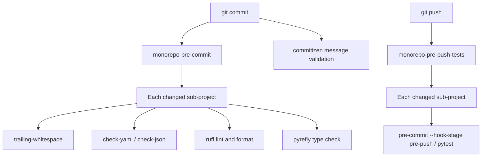

# Spakky Framework 기여 가이드

> Spakky Framework와 플러그인에 기여하기 위한 안내입니다.
> 각 패키지는 자체 `pyrefly`, `ruff`, `pytest` 설정을 가지므로 package-level tool은 패키지 디렉토리에서 실행합니다.

기여에 시간을 내주셔서 감사합니다.

## 🛠 개발 환경 설정

이 프로젝트는 의존성 관리와 workspace 처리를 위해 [`uv`](https://github.com/astral-sh/uv)를 사용합니다.

### 사전 준비

- Python 3.12 이상
- `uv` 설치

### 설치

1. **저장소 복제**

   ```bash
   git clone https://github.com/E5presso/spakky-framework.git
   cd spakky-framework
   ```

2. **의존성 동기화**

   개발 도구를 포함하여 core framework와 모든 plugin의 의존성을 설치합니다.

   ```bash
   uv sync --all-packages --all-extras
   ```

   > **💡 `uv sync` 옵션 이해하기**
   >
   > | 명령어                               | 사용 위치               | 설명                                                                                                                                    |
   > | ------------------------------------- | ------------------------- | ---------------------------------------------------------------------------------------------------------------------------------------------- |
   > | `uv sync --all-packages --all-extras` | **루트 디렉토리**        | 모든 workspace package와 optional dependency를 설치합니다. 여러 패키지를 함께 개발할 때 사용합니다.                            |
   > | `uv sync --all-extras`                | **하위 패키지 디렉토리** | 현재 패키지와 해당 optional dependency만 설치합니다. 단일 플러그인에서 작업할 때 사용합니다(예: `cd plugins/spakky-fastapi`). |
   >
   > `--all-packages` flag는 모든 monorepo package를 포함해야 하는 workspace root에서만 필요합니다. 하위 패키지로 `cd`하면 그 패키지가 context가 되므로 `--all-extras`만으로 충분합니다.

### 하위 프로젝트 독립 열기

각 하위 프로젝트는 root virtual environment를 그대로 사용하면서 VS Code에서 독립적으로 열 수 있습니다.

1. **VS Code 설정**: 각 하위 프로젝트의 `.vscode/settings.json`은 `python.defaultInterpreterPath`가 root의 `.venv`를 가리키도록 설정되어 있습니다.

   ```json
   {
   	"python.defaultInterpreterPath": "${workspaceFolder}/../../.venv/bin/python"
   }
   ```

2. **Pre-commit hook**: 모든 hook은 monorepo root와 독립 실행 모두에서 동작하도록 conditional path handling을 사용합니다.

3. **터미널**: 하위 프로젝트를 독립적으로 열었을 때는 올바른 virtual environment를 자동으로 찾는 `uv run`을 사용합니다.

## 🧪 테스트 실행

테스트에는 `pytest`를 사용합니다.

```bash
cd core/spakky
uv run pytest

cd plugins/spakky-fastapi
uv run pytest

# coverage와 함께 실행(package directory에서)
uv run pytest --cov --cov-report=html
```

테스트는 대상 패키지 디렉토리에서 실행합니다. repository root에서 `uv run pytest`를 직접 호출하지 마세요.

## 🎨 코딩 표준

### Pre-commit hook

코드 품질 검사를 강제하기 위해 **pre-commit**을 사용합니다.

- **commit 시점**: lint, formatting, type check(빠름)
- **push 시점**: 변경된 패키지의 unit test만 실행(느리지만 필요)

```bash
# 모든 hook 설치(pre-commit, commit-msg, pre-push)
uv run pre-commit install -t pre-commit -t commit-msg -t pre-push

# pre-commit hook 수동 실행
uv run pre-commit run --all-files

# pre-push hook 수동 실행(pytest 포함)
uv run pre-commit run --all-files --hook-stage pre-push
```

#### Hook workflow



각 하위 프로젝트의 `.pre-commit-config.yaml`은 monorepo root와 standalone 양쪽에서 동작하도록 **conditional path handling**을 사용합니다.

```yaml
# root에서 동작: cd core/spakky 후 실행
# standalone에서 동작: 현재 디렉토리에서 실행
entry: bash -c 'if [ -d "core/spakky" ]; then cd core/spakky; fi && uv run pyrefly check'
```

pre-commit 설정에는 다음 항목이 포함됩니다.

- **Monorepo hook**: 변경 파일에 대해 하위 프로젝트별 검사를 실행합니다.
- **Commitizen**: commit message가 Conventional Commits format을 따르는지 검증합니다.

### Style guide

lint와 formatting에는 **Ruff**를 사용합니다.

```bash
cd core/spakky

# 코드 formatting
uv run ruff format

# 코드 lint
uv run ruff check --fix
```

Ruff와 pyrefly는 변경된 코드를 소유한 패키지 디렉토리에서 실행합니다. root workspace는 의존성 동기화와 orchestration을 위한 곳이며 직접 package check를 실행하는 위치가 아닙니다.

### 타입 힌트

Spakky는 엄격한 타입 프레임워크입니다. 모든 public API와 dependency injection point에는 type hint가 있어야 합니다.

- `typing` module 기능(예: `TypeVar`, `cast`)을 사용합니다. `Protocol` 기반 goose typing은 프로젝트 규칙상 사용하지 않습니다.
- 검증에는 `pyrefly` 또는 호환 type checker를 사용합니다.

#### `Any` 타입 사용

**`Any` 타입 사용은 가능한 피해야 합니다.** 먼저 대안을 사용하세요.

- generic function에는 `Any` 반환 타입 대신 `TypeVar`를 사용합니다.
- 타입이 정말 알 수 없을 때는 upper bound로 `object`를 사용합니다.
- 구조적 typing 계약에는 `Protocol`을 사용하지 않고 명시적 ABC interface를 정의합니다.
- 알려진 복수 타입에는 `Union` 또는 `|`를 사용합니다.

**허용 예외**는 inline comment로 이유를 문서화해야 합니다.

- invariant generic을 가진 외부 라이브러리 interface(예: SQLAlchemy `Column[Any]`, `TypeEngine[Any]`)
- 구조가 실제로 dynamic인 JSON parsing/serialization
- 임의 signature를 보존해야 하는 decorator 구현

```python
# 나쁜 예: 근거 없는 Any 사용
from typing import Any

def get_constraint(constraint_type: type) -> Any | None:
    ...

# 좋은 예: TypeVar 사용
from typing import TypeVar

_T = TypeVar("_T")

def get_constraint(constraint_type: type[_T]) -> _T | None:
    ...

# 좋은 예: 근거가 있는 Any 사용(외부 라이브러리 invariant generic)
def create_column() -> Column[Any]:  # Any: SQLAlchemy Column is invariant
    ...
```

#### `type: ignore` 주석

**`# type: ignore` 주석 사용은 금지됩니다.** 항상 proper한 type-safe solution을 찾고, 피할 수 없을 때만 문서화된 `Any`를 사용합니다.

### 로깅 패턴

Spakky는 logger에 dependency injection을 사용하지 않고 **standard Python logging**을 사용합니다.

```python
from logging import getLogger

logger = getLogger(__name__)

@Pod()
class MyService:
    def do_something(self) -> None:
        logger.info("Doing something")
```

**핵심 원칙**:

- `getLogger(__name__)`으로 module-level `logger`를 선언합니다.
- constructor 또는 제거된 `ILoggerAware`로 logger를 주입하지 않습니다.
- `ApplicationContext`는 더 이상 `logger` parameter를 받지 않습니다.

### 네이밍 컨벤션

- **Package**: `snake_case`(예: `spakky.plugins.fastapi`)
- **Class**: `PascalCase`(예: `UserController`)
- **Function/Method**: `snake_case`(예: `get_user`)
- **Interface**: `I`로 시작해야 합니다(예: `IEventPublisher`, `IContainer`).
- **Abstract class**: `Abstract`로 시작해야 합니다(예: `AbstractEntity`, `AbstractEvent`, `AbstractDomainEvent`, `AbstractIntegrationEvent`).
- **Error class**: `Error`로 끝나야 합니다(예: `CannotDeterminePodTypeError`).
- **Async class**: `Async`로 시작해야 합니다(예: `AsyncTransactionalAspect`, `AsyncRabbitMQEventTransport`).

#### 상속 타입 suffix

구체 class는 **상속한 class/interface 역할을 suffix로 포함**해야 합니다.

| 상속 타입 | suffix | 예시 |
|---------------|--------|--------|
| `IAsyncAspect` | `~Aspect` | `AsyncTransactionalAspect` |
| `AbstractAsyncBackgroundService` | `~BackgroundService` | `AsyncOutboxRelayBackgroundService` |
| `IPostProcessor` | `~PostProcessor` | `RegisterRoutesPostProcessor` |
| `AbstractAsyncTransaction` | `~Transaction` | `AsyncTransaction` |

**예외 — Domain model**: Domain model은 suffix 규칙에서 제외됩니다. ubiquitous language(도메인 용어)를 그대로 사용합니다.

```python
# ✅ Domain model: suffix 없이 도메인 용어 사용
class User(AbstractAggregateRoot[UUID]): ...
class OrderPlaced(AbstractDomainEvent): ...  # past participle
class Money(AbstractValueObject): ...

# ✅ Infrastructure/Framework: suffix 필요
class AsyncTransactionalAspect(IAsyncAspect): ...
class AsyncOutboxRelayBackgroundService(AbstractAsyncBackgroundService): ...
```

#### Domain Event 네이밍

- **DomainEvent**: **과거분사만** 사용합니다. `DomainEvent` suffix를 붙이지 않습니다.
  - `OrderPlaced` ✅ / `OrderPlacedDomainEvent` ❌
  - `UserCreated` ✅ / `UserCreatedEvent` ❌
- **IntegrationEvent**: `IntegrationEvent` suffix를 붙입니다.
  - `OrderConfirmedIntegrationEvent` ✅

#### Generic type narrowing

구체 type parameter를 가진 Generic interface를 상속할 때는 **Generic 이름을 narrowed type 이름으로 교체**합니다.

```python
# ✅ Generic narrowing → type 이름으로 교체
class UserRepository(IAsyncGenericRepository[User, UUID]): ...
class OrderRepository(IGenericRepository[Order, UUID]): ...

# ❌ Generic 이름 유지
class UserGenericRepository(IAsyncGenericRepository[User, UUID]): ...
```

### Magic number

**magic number는 피하세요.** 설명적인 이름과 docstring이 있는 named constant를 사용합니다.

```python
# 나쁜 예: magic number
return String(length=255)

# 좋은 예: 문서화된 named constant
DEFAULT_STRING_LENGTH: int = 255
"""Default length for fallback String column type."""

return String(length=DEFAULT_STRING_LENGTH)
```

**허용 예외**는 constant가 필요 없습니다.

- 명확한 context의 `0`, `1`, `-1`(예: `range(0, n)`, `index + 1`)
- context가 명확한 percentage 계산의 `100` 같은 일반 값

### Error class 가이드라인

모든 framework error는 `AbstractSpakkyFrameworkError`를 상속합니다.

**단순 error**는 추가 context가 필요 없는 경우입니다.

```python
class CannotUseOptionalReturnTypeInPodError(PodAnnotationFailedError):
    """function Pod가 Optional return type을 가질 때 발생합니다."""

    message = "Cannot use optional return type in pod"
```

**구조화 error**는 programmatic access를 위한 context data가 필요한 경우입니다.

구조화된 data를 저장하려면 `__init__`을 override합니다. **`__str__`을 override하지 마세요.** 상세 message는 error가 아니라 log에 둡니다.

```python
class CircularDependencyGraphDetectedError(AbstractSpakkyPodError):
    """circular dependency가 감지되었을 때 발생합니다."""

    message = "Circular dependency graph detected"

    def __init__(self, dependency_chain: list[type]) -> None:
        super().__init__()
        self.dependency_chain = dependency_chain

# 상세 message를 남기는 logging 위치:
except CircularDependencyGraphDetectedError as e:
    logger.error(
        "Circular dependency detected: %s",
        " -> ".join(t.__name__ for t in e.dependency_chain),
    )
```

**가이드라인**:

- **Error는 설명문이 아니라 structured data**입니다. detail은 log가 처리합니다.
- 설명형 error message를 만들기 위해 **f-string을 사용하지 않습니다.**
- **`__str__`을 override하지 않습니다.** class `message` attribute를 사용합니다.
- custom `__init__`에서는 항상 `super().__init__()`을 호출합니다.
- 기본 error 식별을 위해 `message` class attribute를 유지합니다.

**핵심 규칙**:

- 단순 error: `message` class attribute만 사용
- 구조화 error: data용 `__init__`, `__str__` override 금지

### 문서화

docstring은 **Google Python Style Guide**를 따릅니다.

```python
def fetch_user(user_id: int) -> User | None:
    """Fetch a user by ID.

    Args:
        user_id: The unique identifier.

    Returns:
        The User object if found, None otherwise.
    """
```

## 🔌 플러그인 개발

Spakky는 formal plugin architecture를 사용합니다. 새 플러그인을 기여할 때는 다음 절차를 따릅니다.

1.  **패키지 생성**: `uv init`으로 workspace 안에 새 패키지를 생성합니다.

    ```bash
    # workspace root에서
    cd plugins
    uv init --lib spakky-<name>
    cd spakky-<name>

    # 올바른 package structure 생성
    mkdir -p src/spakky/plugins/<name>
    touch src/spakky/plugins/<name>/__init__.py
    touch src/spakky/plugins/<name>/main.py
    ```

2.  **Workspace 등록**: 새 패키지를 root `pyproject.toml`의 `[tool.uv.workspace]` members에 추가합니다.

    ```toml
    [tool.uv.workspace]
    members = [
      # ... 기존 패키지 ...
      "plugins/spakky-<name>",
    ]
    ```

3.  **Entry point**: 플러그인의 `pyproject.toml`에 entry point를 정의합니다.

    ```toml
    [project.entry-points."spakky.plugins"]
    spakky-<name> = "spakky.plugins.<name>.main:initialize"
    ```

4.  **초기화**: `main.py`에 `initialize` 함수를 구현합니다.

    ```python
    from spakky.core.application.application import SpakkyApplication

    def initialize(app: SpakkyApplication) -> None:
        """Pod와 Post-Processor를 여기에서 등록합니다."""
        pass
    ```

5.  **Version synchronization**: 새 패키지를 root `pyproject.toml`의 `[tool.commitizen]` `version_files` 목록에 추가합니다.

    ```toml
    [tool.commitizen]
    version_files = [
      # ... 기존 패키지 ...
      "plugins/spakky-<name>/pyproject.toml:version",
    ]
    ```

6.  **패키지 등록**: 모든 workspace package는 root `pyproject.toml`의 `[tool.uv.workspace]` members에서 자동 감지됩니다. script에 수동 등록할 필요가 없습니다.

## 📦 Commit message

versioning과 changelog 자동화를 위해 **Conventional Commits**를 사용합니다.

형식: `<type>(<scope>): <subject>`

- **type**: `feat`, `fix`, `docs`, `style`, `refactor`, `test`, `chore`
- **scope**: `core`, `domain`, `data`, `event`, `task`, `tracing`, `outbox`, `saga`, `fastapi`, `kafka`, `rabbitmq`, `security`, `sqlalchemy`, `typer`, `celery`, `logging`, `opentelemetry`, `grpc`

예시:

- `feat(core): add new scope type`
- `fix(fastapi): resolve routing issue`
- `docs: update contributing guide`

## 🏷️ Versioning

모든 패키지에 **통합 단일 버전**을 적용하고 **Semantic Versioning**을 사용합니다.

### 통합 버전 전략

monorepo의 모든 package는 같은 version number를 공유합니다. 어떤 package가 변경되어도 모든 package를 함께 release합니다.

| 구성 요소        | 형식       | 예시                                        |
| ---------------- | ------------ | ---------------------------------------------- |
| **Tag**          | `v{version}` | `v3.3.0`                                       |
| **모든 패키지** | 같은 version | `spakky==3.3.0`, `spakky-fastapi==3.3.0`, etc. |

### Bump type 규칙

| Commit type                    | bump  | version 변경    |
| ------------------------------ | ----- | ----------------- |
| `fix:`                         | Patch | `3.2.0` → `3.2.1` |
| `feat:`                        | Minor | `3.2.0` → `3.3.0` |
| `feat!:` or `BREAKING CHANGE:` | Major | `3.2.0` → `4.0.0` |

## 🚀 Pull Request 절차

1.  repository를 fork하고 `develop`에서 branch를 생성합니다.
2.  테스트해야 하는 코드를 추가했다면 test를 추가합니다.
3.  test suite가 통과하는지 확인합니다. CI system은 변경된 package를 자동 감지하고 해당 package test만 실행합니다.
4.  코드가 lint를 통과하는지 확인합니다.
5.  Pull Request를 생성합니다.

---

즐거운 개발 되세요.
