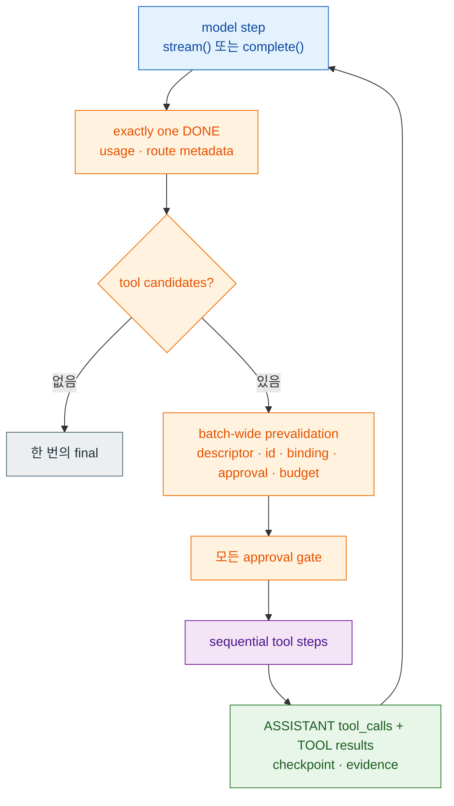

# spakky-agent

> `spakky-agent`는 ADR-0009 Agentic Hexagonal Architecture의 core contract 패키지입니다.
> Agent를 LLM SDK wrapper가 아니라 `@UseCase`와 같은 application workflow component로 다루기 위한 public 타입 표면을 제공합니다.

## 언제 필요한가

- agentic workflow를 Spakky DI/hexagonal architecture 안에서 표현하려는 경우
- spec과 `@agent_tool` 메서드만 선언하고 프레임워크가 bounded iterative model/tool orchestration(`execute()`)을 자동 제공하게 하려는 경우
- `AgentYield` stream을 FastAPI, WebSocket, CLI 같은 inbound adapter가 직접 소비하게 하려는 경우
- model adapter를 `IAgentModel` outbound port로 구현하려는 경우
- long-running execution의 state, signal, evidence 계약을 plugin contribution으로 구현하려는 경우

## 설치

Core contract만 사용할 때는 `spakky-agent`를 설치합니다.

```bash
pip install spakky-agent
```

multi-provider model adapter와 SQLAlchemy durable repository를 함께 쓰는 일반적인 조합은 다음처럼 설치합니다.

```bash
pip install spakky-agent spakky-llm "spakky-sqlalchemy[agent]"
```

`spakky-agent`는 public API와 bootstrap validation만 제공합니다. Production state/signal/evidence repository는 `spakky.contributions.spakky.agent` provider contribution으로 들어와야 하며, 운영용 in-memory persistence fallback은 없습니다.

## 제공하는 public surface

- `Agent`, `AgentExecutionSpec`, `AgentExecutionLimits`: `@UseCase`와 동격인 Pod stereotype과 보조 실행 의미. `AgentExecutionSpec`은 실행 이름/목표(`name`, `objective`), system-level 지시문(`instructions`), 구조화 출력 타입(`output_type`), 수신 signal/recovery/streaming 선언(`accepted_signals`, `recovery`, `streaming_exposure_mode`), bounded execution(`limits`), 협력 agent(`teammates`), 컨텍스트 압축 정책(`compaction`), model step별 dynamic context 재조회 여부(`refresh_context_each_step`), 위임 허용 marker(`delegation_allowed`), 문자열 metadata(`metadata`)를 보존한다. `AgentExecutionLimits`는 `max_steps=8`, `max_tool_calls=32`, optional `max_tokens`, optional `timeout_seconds`를 한 곳에 모읍니다. `AgentExecutionSpec.timeout_seconds` alias는 없으며 unknown constructor argument로 실패한다. Limit과 name/objective/instructions는 양수/nonblank, `output_type`은 지원되는 class와 portable schema로 정의 시점에 검증되고, teammate name은 unique여야 한다. `execute()` 없이 spec + `@agent_tool` 메서드만 선언하면 프레임워크가 `AgentRunner` 기반 bounded iterative orchestration을 `execute()`로 자동 바인딩한다(ADR-0017). 개발자가 직접 `execute()`를 작성한 경우에는 건드리지 않는다.
- `AgentRunner`, `AgentRunResult`: 프레임워크가 소유하는 bounded iterative model/tool orchestration. `AgentRunner.for_agent_instance(instance)`는 인스턴스에 주입된 속성을 타입 기반으로 탐색해 required `IAgentModel`과 optional `IAgentStateRepository`·`IAgentSignalRepository`·`IAgentEvidenceRepository`·`ITaskStore`·`IAgentContextProvider`를 resolve한다. `run(run_input)`은 inbound adapter용 `AgentYield` stream을, `run_events(run_input)`은 protocol adapter용 중립 `AgentEvent` stream을 내보냅니다. 한 model step이 terminal validation을 통과해 tool batch를 내면 runner는 batch 전체의 descriptor·call id·argument binding·approval plan·tool budget을 dispatch 전에 검증하고, 모든 approval gate를 먼저 통과한 뒤 tool을 선언 순서대로 실행합니다. 각 result는 assistant tool-call history 뒤의 `ModelMessageRole.TOOL` message로 추가되고 다음 `ModelRequest`가 같은 invocation에서 이어집니다. Tool이 없는 terminal model step에서 final을 정확히 한 번 생성합니다. Durable 경로는 같은 loop에 state/signal/evidence, approval pause/resume와 action-boundary checkpoint를 더합니다. `AgentRunResult`는 spec이 `output_type`을 선언하지 않을 때 기본으로 반환되는 중립 종료 요약 dataclass(`state_id`, `status`, `tool_calls`, `evidence_count`)다.
- `IAgentRunnerFactory`, `AgentRunnerFactory`: inbound adapter가 request/run scope runner를 여는 DI 포트와 기본 구현. 기본 구현은 `AgentRunner.for_agent_instance()`를 감싼다. MCP처럼 runner catalog나 외부 세션 수명주기를 확장하는 plugin은 이 port를 자체 구현으로 바인딩하고, AG-UI/A2A 같은 protocol adapter는 직접 `AgentRunner.for_agent_instance()`를 호출하지 않고 이 factory를 주입받아 실행한다.
- `RunAgentInput`: inbound run 계약. `state_id`(실행 상관 ID), `instruction`(모델 요청의 사용자 프롬프트), `conversation_id`(멀티턴 스레드 ID, 생략 시 `state_id`로 대체), `parent_run_id`(위임 child run이 parent run과 연결되는 중립 링크), `resume`(일시 중단된 실행 재개 여부), `message_history`(클라이언트가 주입한 이전 대화 이력 `tuple[ModelMessage, ...]`, ADR-0013 §6 client-injected history), `model_selection`(요청별 opaque logical model ref), `context`(요청이 소유하는 static `AgentContext`, 기본값은 empty), `metadata`(model request metadata에 병합되는 runner 레벨 부가 정보)를 담는다. `effective_conversation_id` property는 `conversation_id or state_id`를 반환한다. Runner는 `ModelRequest.metadata`를 `{"state_id": run_input.state_id, **run_input.metadata}` 순서로 구성하므로 현재 같은 이름의 caller metadata가 자동 `state_id`를 덮어쓴다. Approval decision은 이 계약이 아닌 signal repository를 통해 전달된다. Model selection은 run-scoped이며 transcript `ConversationTurn`에 저장·상속되지 않는다. 같은 conversation의 다음 turn이나 approval resume에서 selection을 생략하면 model adapter의 default가 다시 적용된다.
- `AgentTeammate`: 이름과 로컬 Pod 타입(`pod`) 또는 원격 AgentCard http(s) URL(`card_url`) 중 정확히 하나를 선언하는 협력 agent 기술자. 둘 다 지정하거나 둘 다 생략하면 `AgentDefinitionError`. `@Agent`는 teammate마다 `teammate.<schema_token(name)>.delegate` synthetic tool descriptor를 생성하며, schema token은 teammate name의 앞뒤 공백을 제거한 뒤 `[a-zA-Z0-9_]`가 아닌 연속 문자를 단일 `_`로 치환하고, 앞뒤 `_`를 제거한 다음 소문자화한 값이다. 이 결과가 비면 `AgentDefinitionError`다. 로컬 teammate는 parent에 주입된 child Pod를 찾아 `AgentRunner.run_events()`로 in-process 실행하고, 원격 teammate는 parent에 주입된 `IAgentDelegate` port로 위임한다.
- `ICompactionStrategy`: 교체 가능한 컨텍스트 압축 포트(`ABC`). `async compact(history: tuple[ModelMessage, ...], usage: ModelUsage, capability: ModelCapability) -> tuple[ModelMessage, ...]`를 구현하며, 이력을 더 짧은 이력으로 변환하는 순수 transform이다. pydantic-ai의 message history processor / `ProcessHistory` capability를 참조하되 usage·capability를 명시 파라미터로 받아 압축 강도를 조절한다(ADR-0013 §7).
- 내장 전략 4종:
    - `KeepRecentMessagesCompactionStrategy(max_messages)`: 최근 message window를 선택하되 assistant tool-call + 그 call id들의 모든 `TOOL` result를 하나의 correlation group으로 유지한다. Group을 자르지 않기 위해 실제 보존 수가 `max_messages`보다 클 수 있다.
    - `TrimToolResultsCompactionStrategy(max_characters)`: `TOOL` role content만 자르고 `call_id`/`tool_name` metadata와 assistant envelope를 보존한다.
    - `SummarizeOldTurnsCompactionStrategy(model, keep_recent, summary_instruction)`: group 경계보다 오래된 history만 보조 모델로 요약하고 최신 assistant/TOOL group 전체를 남긴다.
    - `ProviderManagedCompactionStrategy()`: 프로바이더가 자체 압축을 소유하는 backend용 passthrough(이력 무변경).
- `AgentCompactionPolicy`: 압축 전략 체인(`strategies: tuple[ICompactionStrategy, ...]`, 비어 있으면 거부)과 트리거 토큰 임계값(`trigger_token_threshold: int`, 양수 필수)을 선언하는 값 타입. `AgentRunner`는 input history를 먼저 `validate_tool_call_groups()`로 검사하고, 각 built-in/custom strategy 결과도 다음 strategy/provider request 전에 다시 검사한다. Orphan `TOOL`, duplicate/blank call id, unknown/duplicate result 또는 assistant call의 missing result는 provider에 보내지 않고 model execution failure로 닫는다. 유효한 이력은 임계값을 넘으면 선언 순서대로 압축한다. 토큰 trigger는 transcript 길이의 ~4자/토큰 근사를 쓴다.
- `AgentYield`: `execute()`가 caller에게 흘려보내는 typed stream item
- `AgentEvent`, `AgentEventKind`, `AgentEventAttribution`: message/reasoning delta, tool call(start·args delta·end·result), run/step 수명주기, state(snapshot·delta), artifact를 구분하는 protocol-neutral taxonomy. 모든 중립 이벤트는 `agent_id`, `run_id`, `parent_run_id`(루트는 `None`), `conversation_id`를 attribution으로 운반하지만 adapter가 이를 wire payload 전체에 그대로 복제하는 계약은 아니다. AG-UI는 `RUN_STARTED`에서 `conversation_id`/`run_id`/`parent_run_id`를 `threadId`/`runId`/`parentRunId`로 사용하고 event별 protocol field를 구성한다. A2A executor는 inbound task/context로 `TaskUpdater`를 bind하고 event별 message/status/artifact를 만들며 neutral attribution이나 arbitrary event metadata를 wholesale 직렬화하지 않는다. MCP는 이 event stream을 소비하지 않고 외부 MCP server tools를 lazy search/call 도구로 agent tool catalog에 합류시킨다. 도구 호출 이벤트는 `ToolCallResultEvent.message_id`와 `ToolCallStartEvent.parent_message_id` 같은 중립 message link를 추가로 보존하며 실제 wire projection은 adapter별 규칙을 따른다.
- `AgentState`: long-running agent execution의 materialized lifecycle state
- `AgentSignal`: 실행 중 들어오는 user message, approval, cancel 같은 inbound stimulus
- `AgentSignalPollPoint`, `consume_pending_agent_signals`: safe boundary나 configured poll point에서 durable signal queue를 대기 없이 소비하는 helper
- `on_signal`, `discover_agent_signal_hooks`, `AgentSignalHookCatalog`: 선언형 시그널 훅(ADR-0013 §1). `@on_signal(kind)`는 `@agent_tool`과 같은 선언형 seam으로, `async def m(self, signal: AgentSignal) -> AsyncGenerator[AgentYield[object], None]` 메서드를 표시한다. `Agent` discovery가 같은 MRO walk로 훅을 수집하고 runner가 safe boundary에서 호출한다. `run()`은 hook yield를 public stream으로 내보내지만 `run_events()`는 `Progress`만 `ArtifactEvent(name="signal_progress")`로 중립화할 수 있습니다. `Token`/`Tool` 등 다른 hook yield shape는 조용히 drop하지 않고 `agent_signal_projection_unsupported`로 fail closed합니다. `CANCEL`·`APPROVAL_DECISION`은 runner 전용 단계가 처리하고, hook이 없는 `USER_MESSAGE`는 built-in Progress로 소비되어 event surface에서는 같은 Artifact로 나타납니다. 계약 위반(비 async generator, `signal: AgentSignal` 외 인자, `AgentYield` 외 yield 타입)은 정의 시점에 `AgentDefinitionError`로 거부된다.
- `AgentApprovalRequest`, `plan_agent_tool_approval`, `parse_agent_approval_decision_signal`: 위험 boundary에서만 HITL approval을 요구하고 decision signal을 typed state target으로 해석하는 helper
- `begin_agent_cancellation`, `run_agent_cancellation_cleanup`, `complete_agent_cancellation`: cancel signal을 `CANCELLING`으로 materialize하고 model stream/tool/delegate cleanup hook 결과를 evidence와 terminal state에 반영하는 helper
- `AgentEvidence`: tool/model/context 판단 근거를 위한 append-only artifact
- `AgentEvidenceCandidate`: tool result와 model/tool decision을 append-only evidence 후보로 변환하는 contract
- `AgentActionBoundaryCheckpoint`, `plan_agent_resume`: model call, tool call, approval wait 전후 checkpoint evidence와 restart/resume 결정 helper
- `DelegationPacket`, `DelegationResult`, `IAgentDelegate`: 다른 `@Agent` component로 작업을 위임하고 parent evidence/stream에 결과를 연결하는 계약
- `AgentContext`, `ContextPack`, `ContextManifest`, `ContextDigest`, `IAgentContextProvider`: run-scoped static context와 optional dynamic context를 같은 typed envelope로 구성하고 model input·provenance evidence로 연결하는 contract. Provider signature는 `async provide(run_input: RunAgentInput, model_step: int) -> AgentContext`이며 step은 1부터 시작한다.
- `ContextHealthSignal`, `ContextRotSymptom`, `ContextOptimizationAction`: context rot 관찰 결과와 압축/refresh/delegation/slice drop action metadata
- `SensitiveField`, `SecretField`, `CredentialRef`, `SecretRef`, `ContextExposurePolicy`, `EvidenceExposurePolicy`: `typing.Annotated` 민감 metadata와 deterministic guard 정책
- `StreamingSensitivePattern`, `StreamingRedactionPolicy`, `StreamingRedactionSession`: chunk boundary를 가로지르는 sensitive output pattern을 bounded buffer로 redaction하고 final audit evidence/error를 생성하는 streaming guard 계약
- `IAgentStateRepository`, `IAgentSignalRepository`, `IAgentEvidenceRepository`: persistence provider가 구현하는 core port
- `ITaskStore`, `ConversationTurn`: 멀티턴 대화 이력을 `conversation_id`로 영속하는 server-side session 계약(ADR-0013 §6). `load_history(conversation_id)`로 이전 transcript를 조회하고 `append_turns(conversation_id, turns)`로 user/assistant turn을 누적한다. `conversation_id`는 AG-UI `threadId`와 A2A `contextId`로 투영될 수 있는 프로토콜 중립 키입니다. 단, A2A protocol `Task` snapshot 영속은 `spakky-a2a`의 `IA2ATaskRepository`/`SpakkyA2ATaskStore` 책임이고 core `ITaskStore`와 분리됩니다. `ConversationTurn`은 transcript 단위(user/assistant role + content)이며 history 재생 시 `as_model_message()`로 model 요청 메시지로 투영된다. `AgentRunner`는 `message_history`가 주입되면 그 이력을 우선해 시드하고(stateless, store 미기록), 아니면 store의 영속 이력을 시드한 뒤 완료 시 turn을 기록한다 — 두 경로는 run마다 상호 배타적이다.
- `IAgentModel`: vLLM, OpenRouter, Anthropic, Vertex, OpenAI 같은 model backend나 router가 구현하는 outbound port. `capability` property로 기본 backend 능력을 런타임 전에 노출하고, run별 선택을 지원하는 adapter/router는 `capability_for(selection)`로 exact selected route의 능력을 반환한다. Fixed-model adapter는 기본 구현을 상속해 selection을 무시하고 자신의 `capability`를 반환할 수 있다.
- `IAgentModelResolver`: 전체 `RunAgentInput`을 보고 request scope에서 사용할 `IAgentModel` 구현 자체를 선택하는 optional extension port. 하나의 router 내부 logical route 선택과는 별도 경계이며, 기본 `AgentRunnerFactory`는 resolver가 없으면 agent에 주입된 model을 사용한다.
- `ModelCapability`, `ModelModality`: reasoning, context window, token counting, input/output modality, tool calling, structured output 지원 여부를 run 이전에 조회하는 provider-neutral descriptor. Modality 값은 `TEXT`, `IMAGE`, `AUDIO`, `VIDEO`, `DOCUMENT`이며 base descriptor의 input/output 기본값은 text-only, 나머지 optional capability 기본값은 false다. `output_type`을 선언한 run은 선택된 route의 `supports_structured_output`을 model request 전에 검사하지만, 나머지 모든 field가 일괄적으로 자동 집행된다는 뜻은 아니다. 현재 `ModelMessage.content`는 `str`이므로 image/audio/video/document content-part payload는 아직 core request contract로 표현할 수 없다. Router는 provider 이름으로 capability를 추론하지 않고 선택된 route 선언을 보존한다.
- `ModelSelection`: `model_ref: str` 하나만 갖는 run-scoped logical model selector. Core는 whitespace-only 값을 거부하지만 nonblank 원문을 trim하거나 provider/profile/model로 분해하지 않는다. `spakky-llm` router가 앞뒤 공백만 제거한 case-sensitive opaque key를 operator catalog와 exact match하며 raw physical model fallback을 제공하지 않는다. Agent class는 실제 profile/model 이름을 소유하지 않고 AG-UI/A2A/service boundary는 이 selector를 `RunAgentInput.model_selection`으로 전달한다.
- `ModelRequest`, `ModelResponse`, `ModelStreamEvent`: provider-neutral model 호출/응답/stream 계약. Runner는 같은 `ModelSelection` 객체를 `RunAgentInput.model_selection`에서 `ModelRequest.model_selection`과 `capability_for(selection)`으로 전달해 실행 route와 capability 조회를 결속한다. Selector를 request metadata로 복제하지 않는다.
- `ToolCallingSpec`, `ModelToolSpec`, `ModelToolCall`: model-facing tool call 요청과 후보 결과
- `agent_tool`, `AgentToolBoundInvocation`, `AgentToolBindingError`, `ToolEffects`, `ToolRisk`, `ToolApprovalRequirement`, `ToolResumeMetadata`, `EvidenceCapture`: tool binding, risk, approval, idempotency, evidence capture metadata
- `AgentToolDispatcher`, `AgentToolDispatchError`: model tool-call을 카탈로그 descriptor로 조회·자동 바인딩·실행하는 디스패치 building block과 미등록 도구 에러

## 의존성 경계

Core package는 `spakky` core에만 의존합니다. vLLM, SQLAlchemy, FastAPI, Typer 같은 infrastructure dependency를 직접 import하지 않습니다.

운영용 persistence fallback도 제공하지 않습니다. State, signal, evidence repository 구현은 SQLAlchemy 등 provider plugin의 feature contribution으로 등록되어야 하며, 누락 시 bootstrap 단계에서 custom error로 실패해야 합니다.

Durable 실행 경로는 `AgentExecutionSpec.recovery == RecoveryStrategy.ACTION_BOUNDARY` 또는 `accepted_signals` 선언에서 파생됩니다. 이 경우 bootstrap은 `IAgentStateRepository`, `IAgentSignalRepository`, `IAgentEvidenceRepository`가 모두 등록되어 있는지 검증하고, 누락 시 필요한 repository type과 설치해야 할 `spakky-sqlalchemy[agent]` / `spakky.contributions.spakky.agent` provider contribution을 error message에 포함합니다. 운영용 in-memory repository fallback은 없습니다.

`IAgentEvidenceRepository`의 agent-facing interface는 append/read 계열만 노출합니다. Redaction, correction, context digest 갱신은 기존 evidence를 수정하지 않고 새 evidence를 append하는 방식으로 표현합니다.

## 사용 예시

### 선언형 — 프레임워크 제공 orchestration (권장)

spec과 `@agent_tool` 메서드만 작성하면 `@Agent`가 `AgentRunner` 기반 bounded iterative orchestration을 `execute()`로 자동 바인딩합니다. `RunAgentInput`을 인자로 받아 `AgentYield` stream을 내보내고, model → validated/authorized tool batch → assistant/TOOL continuation → next model 순서를 limits 안에서 반복합니다.

```python
from spakky.agent import (
    Agent,
    AgentExecutionLimits,
    AgentExecutionSpec,
    IAgentModel,
    agent_tool,
)


@Agent(
    spec=AgentExecutionSpec(
        name="file_agent",
        instructions="Use the declared tools to read and summarize files.",
        limits=AgentExecutionLimits(
            max_steps=8,
            max_tool_calls=32,
            max_tokens=None,
            timeout_seconds=None,
        ),
    )
)
class FileAgent:
    def __init__(self, model: IAgentModel) -> None:
        self.model = model

    @agent_tool(schema_name="file.read")
    async def read_file(self, path: str) -> str:
        with open(path) as f:
            return f.read()
    # execute()를 작성하지 않으면 AgentRunner 기반 bounded loop가 제공된다.
```

호출 측은 `RunAgentInput`을 구성해 `execute()`를 호출합니다.

```python
from spakky.agent import ModelSelection, RunAgentInput

run_input = RunAgentInput(
    state_id="run-001",
    instruction="Read README.md and summarize.",
    model_selection=ModelSelection(model_ref="support/primary"),
)
async for item in agent_instance.execute(run_input):
    print(item)
```

`support/primary`는 application-facing product key입니다. Physical model id, provider profile, endpoint와 credential은 `IAgentModel` 구현의 operator configuration에 남습니다. Selection을 생략하면 router가 설정한 default route를 사용합니다.

### Typed output과 run-scoped context

가장 작은 공개 DX는 agent spec에 최종 타입과 context refresh 의미를 선언하고, caller가 알고 있는 context는 `RunAgentInput.context`로 넘기는 방식입니다. 런타임에서 context를 가져와야 할 때만 optional `IAgentContextProvider`를 constructor DI로 받습니다.

```python
from pydantic import BaseModel

from spakky.agent import (
    Agent,
    AgentContext,
    AgentExecutionSpec,
    ContextPack,
    ContextPackRole,
    IAgentContextProvider,
    IAgentModel,
    RunAgentInput,
)


class Answer(BaseModel):
    answer: str
    confidence: float


@Agent(
    spec=AgentExecutionSpec(
        name="support_agent",
        output_type=Answer,
        refresh_context_each_step=False,
    )
)
class SupportAgent:
    def __init__(
        self,
        model: IAgentModel,
        context_provider: IAgentContextProvider,
    ) -> None:
        self.model = model
        self.context_provider = context_provider


run_input = RunAgentInput(
    state_id="run-001",
    instruction="요청을 분류하고 답변하세요.",
    context=AgentContext(
        packs=(
            ContextPack(
                id="request-facts",
                content="customer_tier=premium; locale=ko-KR",
                source="caller",
                role=ContextPackRole.STATE,
            ),
        ),
    ),
)
```

위 예시는 dynamic context를 쓰는 variant이므로 provider를 required constructor dependency로 받습니다. Static `RunAgentInput.context`만 사용하는 agent는 `context_provider` parameter와 속성을 둘 다 생략합니다. Optional은 framework 기능 사용 여부를 뜻하며 optional-union constructor injection을 공개 계약으로 가정하지 않습니다.

`output_type`은 Pydantic `BaseModel`, 표준 라이브러리 `dataclass`, `TypedDict` class를 지원합니다. Framework는 alias를 반영한 validation schema를 정의 시점에 만들고 local definition reference를 펼친 뒤, portable subset 밖의 keyword·순환/외부 reference·non-finite JSON을 `AgentDefinitionError`로 거부합니다. 따라서 `str`같은 임의 class나 schema로 안전하게 옮길 수 없는 타입은 model call까지 미루지 않습니다. Core-portable schema라도 특정 provider의 strict wire 제약과 맞지 않을 수 있으므로 operator는 선택한 route의 실제 지원 범위를 검증해야 합니다.

`output_type`이 있으면 runner는 선택 route의 `supports_structured_output`을 request 전에 검사하고 strict `StructuredOutputSpec`을 모델에 전달합니다. Tool-only 중간 step은 허용하지만 tool이 없는 최종 step은 structured payload를 정확히 하나 내야 합니다. Text를 JSON처럼 보이게 출력하는 것은 fallback이 아니며, tool call과 structured payload가 한 step에 공존해도 모호성으로 거부합니다. Provider JSON은 coercion·extra-key drop 없이 strict materialization되고 JSON shape가 유지되어야 합니다.

| 경계 | 성공 결과 | fail-closed code |
|------|-----------|------------------|
| 선택 route가 structured output을 지원하지 않음 | model request 없음 | `agent_structured_output_unsupported` |
| 최종 step에 payload가 없음 | final 없음 | `agent_structured_output_missing` |
| 복수 payload 또는 tool call과 동시 반환 | final/tool dispatch 없음 | `agent_structured_output_ambiguous` |
| 선언 타입과 다른 값·extra key·shape loss | final 없음 | `agent_structured_output_invalid` |

Public `run()`의 `Final.output`은 실제 `Answer` 객체가 되고, protocol-neutral `run_events()`의 성공 `RunFinishedEvent.metadata`에는 JSON-safe `output`과 `output_type="Answer"`가 들어갑니다. `output_type=None`이면 기존 흐름을 유지합니다. 즉 structured-output request를 만들지 않고 `Final.output`은 `AgentRunResult`이며, neutral terminal metadata에 typed `output`/`output_type`을 추가하지 않습니다.

Static `RunAgentInput.context`는 모든 model step에 사용됩니다. Provider가 주입되면 기본 `refresh_context_each_step=False`에서는 **runner invocation당 첫 model step에 한 번** 호출하고 결과를 후속 step에 cache합니다. `True`면 1-based model step마다 다시 호출합니다. Durable checkpoint는 raw static/dynamic context를 저장하지 않고, guard·budget 적용을 마친 static context의 deterministic SHA-256 `static_context_fingerprint`만 저장합니다. 따라서 context가 있던 run을 `resume=True`로 재개할 때 caller는 **같은 prepared static identity를 만드는 `AgentContext`를 다시 제공**해야 하며 missing·changed·additive context는 model/tool dispatch 전 `agent_checkpoint_invalid`로 fail closed합니다. Dynamic provider context는 새 invocation의 복원된 step에서 다시 조회합니다. Provider error/invalid return은 model request 전 `agent_model_execution_failed`, active deadline 초과는 `agent_timeout`으로 닫힙니다.

### Bounded iterative model/tool loop



`StreamingExposureMode.NO_STREAM_UNTIL_FINAL_GUARDED`는 각 model step에서 `IAgentModel.complete()`를 호출하고 완성된 `ModelResponse`를 message/tool/structured-output/usage/DONE event로 normalize합니다. 다른 exposure mode는 `IAgentModel.stream()`을 소비합니다. 두 경로 모두 같은 batch validation, approval, dispatch, continuation과 limit semantics를 사용합니다. Complete 경로는 response가 돌아오기 전 incremental token을 공개하지 않지만, 이 이름 자체가 별도 output redaction 정책을 자동 구성한다는 뜻은 아닙니다.

한 response의 tool candidates는 dispatch 전에 모두 준비됩니다. Unknown descriptor, blank/duplicate/reused call id, argument signature binding 실패, malformed approval plan 또는 batch 전체 tool budget 초과가 하나라도 있으면 **어떤 tool도 실행하지 않습니다**. Approval이 필요한 call도 batch 전체에서 모두 결정된 뒤 첫 tool을 실행합니다. 이 성질은 pre-dispatch authority 원자성이지 transaction 원자성이 아닙니다. 승인된 tool은 순서대로 실행되므로 뒤 tool이 실패·timeout·cancel되면 앞 tool의 이미 완료된 side effect/result를 rollback하지 않습니다.

각 model tool batch는 `ASSISTANT` message metadata의 `tool_calls`에 call id/name/arguments와 provider call metadata를 보존합니다. 각 실행 결과는 `TOOL` message에 `call_id`/`tool_name`과 JSON-compatible content로 추가합니다. 다음 model step은 이 history 전체를 받습니다. `MODIFY`가 승인되면 pending call과 대응하는 assistant `tool_calls` envelope를 같은 validation phase에서 approved name/arguments/provider metadata로 함께 교체하고, 둘 중 하나라도 갱신할 수 없으면 원래 history를 유지한 채 `agent_approval_invalid`로 실패합니다. Provider routing metadata(`model_ref`, `profile`, `provider`, `model`)는 step metadata와 durable model evidence에 남고 assistant history에도 결속됩니다. Google tool-call metadata의 base64 `thought_signature`도 assistant history를 거쳐 다음 native `Part`로 복원됩니다.

`run_events()`는 model step을 `model-1`, `model-2`, …로, 실제 tool execution을 `tool-1`, `tool-2`, …로 구분합니다. Missing provider call id는 `{state_id}:model-{step}:call-{index}`로 보완하며 blank·duplicate·run 내 reuse는 거부합니다. Provider가 `TOOL_CALL_CANDIDATE`만 보내면 runner가 missing START/END를 각각 한 번 합성하고, 이미 받은 frame side는 중복 생성하지 않습니다. Model step은 정확히 하나의 terminal `DONE`을 가져야 하고 run은 `RunFinishedEvent` 또는 public final을 한 번만 냅니다.

### 실행 limits

| Limit | 기본값 | 집행 시점 |
|-------|--------|-----------|
| `max_steps` | `8` | 다음 model request 직전; 이미 실행한 model step 수가 한도 이상이면 request하지 않음 |
| `max_tool_calls` | `32` | validated candidate batch 전체를 dispatch하기 전; 현재 완료 수 + batch 크기가 한도를 넘으면 batch를 하나도 실행하지 않음 |
| `max_tokens` | `None` | 각 terminal model response의 `usage.total_tokens`를 누적한 직후; 초과 response는 이미 소비됐지만 tool dispatch·다음 request·success final은 막음 |
| `timeout_seconds` | `None` | invocation마다 monotonic deadline을 만들고 model await와 **async tool** await에 적용; tool 자체 timeout과 둘 다 있으면 더 이른 deadline 사용 |

`max_tokens`를 설정했는데 provider가 terminal `total_tokens`를 주지 않으면 `agent_usage_unavailable`로 fail closed합니다. Runner는 response route metadata를 먼저 고정하고 usage/counters를 계산한 뒤 usage error를 구성하며, durable path에서는 그 error를 포함한 MODEL evidence를 append한 다음 state를 실패시킵니다. 누적값이 limit보다 **클 때** `agent_max_tokens_exceeded`, 다음 request가 step budget을 넘길 때 `agent_max_steps_exceeded`, candidate batch가 tool budget을 넘길 때 `agent_max_tool_calls_exceeded`, async model/tool deadline은 `agent_timeout`으로 종료합니다. Resume invocation은 checkpoint counter/history를 복원하지만 wall-clock deadline은 그 resume에 대해 새로 계산합니다.

Active run deadline 또는 tool-local timeout이 있는 batch에 in-process sync callable이 하나라도 있으면 runner는 그 callable을 실행하거나 중단할 수 있다고 가장하지 않습니다. Approval과 dispatch 전에 batch 전체를 0건 차단하고 `agent_sync_tool_timeout_unenforceable`로 종료합니다. 실제 await cancellation/timeout은 async tool에만 적용됩니다. Deadline 없이 sync tool을 허용하는 기존 실행 경로는 유지됩니다.

### Approval, cancellation, checkpoint

Approval request id는 state id, stable call id와 **full SHA-256 argument digest**에 결속됩니다. Checkpoint key는 `approved_call_fingerprints`이며 approved fingerprint도 최종 approved arguments의 full digest를 사용합니다. Pending arguments만 변조하면 기존 approval과 일치하지 않아 새 approval을 요구합니다. Pending batch와 transcript/counters/seen ids/fingerprints/route metadata는 state의 `runner_checkpoint`에 저장됩니다. Fresh runner의 `resume=True`는 첫 model step을 replay하지 않고 pending batch를 복원합니다. Matching signal의 `APPROVE`는 원래 call을, `MODIFY`는 modified payload를 tool signature에 다시 bind하고 assistant history까지 atomic하게 갱신한 뒤 실행합니다. `DEFER`는 pause를 유지하고 `REJECT`/`CANCEL`은 dispatch 없이 typed terminal state로 갑니다. Durable authority port가 없는 stateless run에서 approval-required tool은 `agent_approval_unavailable`로 실패합니다.

Model, approval wait, tool 전후 action-boundary evidence를 남깁니다. Incomplete non-idempotent tool boundary는 fresh restart에서 자동 재실행하지 않고 `RECOVERY_REQUIRES_HITL`로 pause합니다. 승인 후 dispatch crash의 unchanged pending call은 persisted approval/checkpoint를 사용해 다시 승인받지 않고 resume할 수 있습니다. Cancellation은 loop 시작, model event tick, batch dispatch 전, 각 tool 전후에 poll하며 tool return 직후 cancel도 result commit·다음 model·final을 막습니다.

### Typed terminal codes

| Code | Fail-closed 경계 |
|------|------------------|
| `agent_model_execution_failed` | stream/complete 또는 compaction에서 발생한 framework error |
| `agent_tool_execution_failed` | tool invocation 또는 result serialization의 framework error |
| `agent_checkpoint_invalid` | checkpoint decode 또는 restored pending batch 검증 실패 |
| `agent_approval_invalid` | malformed approval plan/signal, invalid MODIFY binding/history update |
| `agent_signal_projection_unsupported` | `run_events()`가 neutral event로 표현할 수 없는 signal-hook yield |
| `agent_sync_tool_timeout_unenforceable` | active deadline 아래 in-process sync tool이 있는 batch |

이 wrapper code는 underlying framework exception class를 metadata에 남기되 raw exception을 generator 밖으로 누출하지 않고 `Error`/`RunFinishedEvent.error` 하나로 terminalize합니다. Canonical cancellation은 별도 `cancelled` code, reason message, `state=CANCELLED`, `signal_id`, optional `requested_by` metadata를 사용하며 pre-loop/mid-stream/post-tool polling에서 같은 shape를 유지합니다.

실행 중 들어오는 시그널에 커스텀 반응이 필요하면 `@on_signal`을 선언합니다 — 루프 본문을 작성하지 않고 시그널 종류별 핸들러만 선언하면 runner가 자동 호출합니다.

```python
from collections.abc import AsyncGenerator

from spakky.agent import (
    AgentSignal,
    AgentSignalKind,
    AgentYield,
    AgentYieldKind,
    Progress,
    on_signal,
)


class FileAgent:
    @on_signal(AgentSignalKind.STEERING_INSTRUCTION)
    async def on_steering(
        self,
        signal: AgentSignal,
    ) -> AsyncGenerator[AgentYield[object], None]:
        yield AgentYield(
            kind=AgentYieldKind.PROGRESS,
            payload=Progress(
                f"steering: {signal.payload.get('instruction')}",
                current_step="steering",
            ),
        )
```

### 커스텀 execute() 탈출 경로

자동 제공 루프로 표현할 수 없는 커스텀 제어가 필요한 경우에만 `execute()`를 직접 작성합니다. 이 경우 자동 바인딩은 적용되지 않으며, `execute()` 본문이 전체 실행을 책임집니다.

```python
from collections.abc import AsyncGenerator

from spakky.agent import (
    Agent,
    AgentExecutionLimits,
    AgentExecutionSpec,
    AgentSignalKind,
    AgentYield,
    AgentYieldKind,
    Final,
    IAgentModel,
    ModelMessage,
    ModelMessageRole,
    ModelRequest,
    ModelStreamEventKind,
    Token,
)


@Agent(
    spec=AgentExecutionSpec(
        name="code_assistant",
        objective="inspect and edit a workspace",
        accepted_signals=(
            AgentSignalKind.USER_MESSAGE,
            AgentSignalKind.APPROVAL_DECISION,
            AgentSignalKind.CANCEL,
        ),
        limits=AgentExecutionLimits(timeout_seconds=300),
    )
)
class CodeAssistant:
    def __init__(self, model: IAgentModel) -> None:
        self.model = model

    async def execute(
        self,
        command: str,
    ) -> AsyncGenerator[AgentYield[Final[str]], None]:
        request = ModelRequest(
            messages=(ModelMessage(ModelMessageRole.USER, command),),
        )
        async for event in self.model.stream(request):
            if event.kind == ModelStreamEventKind.TOKEN_DELTA:
                yield AgentYield(
                    kind=AgentYieldKind.TOKEN,
                    payload=Token(event.token_delta or ""),
                )

        yield AgentYield(
            kind=AgentYieldKind.FINAL,
            payload=Final(output=command, metadata={}),
        )
```

`@Agent`는 `@Pod` 계열 stereotype이므로 application scan과 constructor DI에 참여합니다. Spec과 `@agent_tool` 메서드만 선언하고 `execute()`를 작성하지 않으면 프레임워크가 `AgentRunner` 기반 bounded iterative orchestration을 `execute()`로 자동 바인딩합니다(ADR-0017). 표준 contract 밖의 제어가 필요한 경우에만 `execute()`를 직접 작성하며, 이 경우 자동 바인딩은 적용되지 않습니다. `execute()`는 `Generator[AgentYield[T], None, None]` 또는 `AsyncGenerator[AgentYield[T], None]`로 typed stream item을 yield할 수 있고, non-generator 반환형은 streaming 없는 직접 결과 계약으로 취급됩니다. Inbound adapter가 SSE/WebSocket/CLI처럼 진행 상태를 즉시 내보내야 한다면 `AgentYield` generator 계약을 사용해야 합니다.

`AgentYieldKind`의 public status vocabulary는 `token`, `progress`, `tool`, `evidence`, `approval`, `final`, `error`, `cancel`입니다. 각 item의 payload는 `Token`, `Progress`, `Tool`, `Evidence`, `Approval`, `Final[T]`, `Error`, `Cancel` value object로 구분되므로 inbound adapter는 별도 stream projector 없이 generator를 직접 순회해 transport별 이벤트로 바꿀 수 있습니다.

HITL approval은 모든 action 앞에 자동 삽입되는 step이 아니라 risk boundary에서만 materialize됩니다. `plan_agent_tool_approval()`은 `@agent_tool` descriptor의 `ToolRisk`와 `ToolApprovalRequirement`를 읽어 low-risk 또는 `NOT_REQUIRED` tool은 `PROCEED`로 돌려보내고, side-effect/write/network/destructive 후보만 `AgentState(status=INTERRUPTED, transition=WAITING_APPROVAL, reason=APPROVAL_REQUIRED)`와 `AgentYieldKind.APPROVAL` item으로 바꿉니다. `run_events()`는 이 상태를 성공 `RunFinishedEvent`로 덮지 않고, prompt·approval id·tool call id·allowed decisions를 담은 `RunPausedEvent`로 방출합니다. Auth 인터럽트는 `AgentStateReason.AUTH_REQUIRED`로 구분되어 A2A 같은 어댑터가 `auth-required`를 직접 투영할 수 있습니다. Inbound adapter가 approval decision signal을 append하면 `parse_agent_approval_decision_signal()`이 `approve`, `reject`, `modify`, `defer`, `cancel`을 typed outcome으로 해석합니다. `approve`/`modify`는 `ACTIVE/RUNNING`, `defer`는 계속 `INTERRUPTED/WAITING_APPROVAL`, `reject`는 `FAILED`, `cancel`은 `CANCELLING`으로 분리되므로 approval wait와 cancellation/failure lifecycle이 섞이지 않습니다.

실행 중 inbound adapter가 user message, approval decision, cancel, resume signal을 append하면 orchestration은 safe boundary, action boundary, model stream tick과 tool result commit 전 같은 poll point에서 `consume_pending_agent_signals()`를 호출합니다. 이 helper는 sleep/poll loop 없이 현재 pending queue만 읽고 append order의 eligible prefix를 consumed 처리하므로 token streaming을 불필요하게 block하지 않습니다. Repository 구현은 `list_pending()` 결과를 append/queue order로 반환해야 하며, helper는 earlier unaccepted signal을 건너뛰어 later signal을 먼저 소비하지 않습니다. `run_events()`에서 USER_MESSAGE built-in Progress와 STEERING hook Progress는 stable `signal_progress` Artifact로 투영되고 AG-UI/A2A adapter는 이를 각자의 artifact surface로 변환합니다.

Cancel은 즉시 terminal state로 뭉개지지 않습니다. Orchestration은 `begin_agent_cancellation()`으로 durable state를 `CANCELLING(reason=CANCELLATION_REQUESTED)`으로 먼저 저장하고, 실행 중인 model stream, async tool/delegate cleanup hook을 정리합니다. `run_agent_cancellation_cleanup()`은 각 outcome을 `AgentCancellationCleanupReport`로 모으고 append-only cancellation evidence를 남깁니다. 모든 cleanup이 성공하거나 skipped이면 `complete_agent_cancellation()`은 `CANCELLED`로 끝내고, 하나라도 실패하면 `FAILED(reason=CANCELLATION_CLEANUP_FAILED)`로 끝냅니다. `run_events()`의 canonical cancel terminal은 `code="cancelled"`, signal reason 또는 `run cancelled` message, `state`, `signal_id`, optional `requested_by` metadata를 사용합니다. 일반 실패, timeout, user interruption과 cancellation은 state reason/recovery 의미가 분리됩니다.

Action-boundary recovery는 model call, tool call, approval wait 전후에 `AgentActionBoundaryCheckpoint`를 append-only `AgentEvidenceKind.ACTION_BOUNDARY` evidence로 저장하는 방식으로 표현합니다. Restart 후 scheduler나 application orchestration은 `IAgentStateRepository`가 반환한 state, `IAgentSignalRepository`의 pending signal, `IAgentEvidenceRepository`의 state evidence만으로 `plan_agent_resume()`을 호출해 다음 동작을 복원합니다. 마지막 boundary가 completed이면 `SKIP_COMPLETED`로 중복 실행을 피하고, incomplete idempotent action이면 `RETRY`를 반환합니다. Incomplete non-idempotent/unknown action 또는 unresolved approval wait는 state를 `INTERRUPTED` / `RECOVERY_REQUIRES_HITL`로 materialize해 자동 재실행하지 않습니다.

`@agent_tool` descriptor는 Python 함수 signature와 type hint를 정본으로 삼아 `AgentToolSchemaHandle.input_schema` / `output_schema`에 model-facing JSON schema를 보존합니다. 입력 schema는 `self`/`cls`를 제외한 실제 호출 parameter를 object schema로 표현하며, required 여부는 Python default 유무를 따릅니다. 지원 타입은 primitive, enum, dataclass, `list[T]`, `tuple[...]`, `Mapping[str, T]`, `T | None`, `Union[...]`, `Annotated[T, ...]`입니다. `Any`, untyped parameter/return, untyped mapping, non-string mapping key, positional-only parameter, `*args`, `**kwargs`, JSON schema로 표현할 수 없는 임의 object는 definition/bootstrap 단계에서 `AgentDefinitionError`로 실패합니다.

`Annotated[T, SensitiveField(...)]`와 `Annotated[T, SecretField(...)]` metadata는 schema extraction 중 버리지 않고 `AgentToolSchemaHandle.input_sensitive_fields` / `output_sensitive_fields` descriptor에 보존합니다. 기본 `input_schema` / `output_schema`는 LLM-facing schema이므로 민감 extension을 포함하지 않습니다. 필요할 때만 `input_schema_for(ContextExposurePolicy(include_sensitive_schema_metadata=True))`처럼 명시 policy를 넘겨 `x-spakky-sensitive` extension을 포함한 schema copy를 얻습니다.

```python
from typing import Annotated

from spakky.agent import PII, SecretField, SensitiveField, agent_tool


@agent_tool(schema_name="customer.lookup")
async def lookup_customer(
    email: Annotated[str, SensitiveField(PII.EMAIL)],
    api_token: Annotated[str, SecretField()],
) -> dict[str, str]:
    ...
```

Model adapter가 decoded tool-call JSON을 받으면 tool 실행 전에 `descriptor.bind_invocation(payload)`로 Python signature binding을 수행합니다. Payload는 flat keyword object(`{"query": "agent", "limit": 5}`) 또는 structured object(`{"args": ["agent"], "kwargs": {"limit": 5}}`)를 사용할 수 있습니다. Binding은 `inspect.Signature`의 required/default/duplicate/unknown argument semantics를 따르며, 실패 시 tool callable을 실행하지 않고 `AgentToolBindingError`를 발생시킵니다.

`AgentToolDispatcher`는 이 조회·바인딩·실행을 하나의 building block으로 묶어, 소비자가 `if call.name == ...` 같은 이름 문자열 매칭 디스패치를 직접 작성하지 않도록 합니다. `AgentToolDispatcher(target=agent_instance, catalog=Agent.get(MyAgent).tool_catalog).dispatch(call)`은 `ModelToolCall.name`으로 descriptor를 조회하고, `bind_invocation`으로 `call.arguments`를 바인딩한 뒤, descriptor callable을 실행해 결과를 반환합니다. 동기/비동기 tool 모두를 처리하고, `self`/`cls` owner parameter가 없는 descriptor(MCP normalize 등 외부 도구)는 instance 없이 호출합니다. 카탈로그에 없는 이름은 `AgentToolDispatchError`로 실패합니다.

```python
from spakky.agent import Agent, AgentToolDispatcher

dispatcher = AgentToolDispatcher(
    target=assistant,
    catalog=Agent.get(CodeAssistant).tool_catalog,
)
result = await dispatcher.dispatch(model_tool_call)
```

## Delegation contract

Agent-to-agent delegation은 runtime topology나 자동 spawn 정책이 아니라 core building block으로 제공됩니다. Parent agent는 `DelegationPacket`으로 task, projected context slice, constraints, expected output, budget metadata, allowed capabilities, return policy를 명시하고, first-class target은 `AgentDelegateTarget`으로 식별되는 다른 `@Agent` component입니다.

`AgentExecutionSpec.teammates`는 이 계약을 model-callable synthetic tool로 노출합니다. Schema 이름은 `teammate.<schema_token(name)>.delegate`입니다. `schema_token`은 teammate name의 앞뒤 공백을 제거한 뒤 `[a-zA-Z0-9_]`가 아닌 연속 문자를 단일 `_`로 치환하고, 앞뒤 `_`를 제거한 다음 소문자화한 값입니다. 이 결과가 비면 `AgentDefinitionError`입니다. 입력은 `instruction`, 선택적 `task`, 선택적 `context_summary`입니다. 로컬 teammate(`AgentTeammate(pod=...)`)는 parent instance에 주입된 child Pod를 찾아 같은 process에서 `AgentRunner.run_events()`로 실행하고, child `AgentEvent`를 parent tool result 앞에 그대로 흘립니다. 원격 teammate(`card_url=...`)는 parent에 주입된 `IAgentDelegate` port를 사용하며, 공식 A2A 구현은 `spakky-a2a`의 `A2AAgentDelegate`입니다.

`IAgentDelegate`는 packet을 받아 `AgentYield[DelegationResult]` stream을 반환하는 execution hook입니다. Remote agent adapter, queue 기반 worker 같은 구체 topology는 이 hook 구현이 선택합니다. Child 결과는 `DelegationResult.to_parent_evidence()` 또는 `to_parent_yield()`로 `AgentEvidenceKind.DELEGATION` evidence와 기존 `AgentYieldKind.EVIDENCE` stream item에 연결할 수 있습니다. Raw child trace를 parent context에 강제로 주입하지 않고 summary/evidence reference 중심으로 되돌리는 ADR-0009 boundary를 유지합니다.

잘못된 signature나 지원하지 않는 metadata는 definition/bootstrap 단계에서 `AgentDefinitionError` 또는 `AgentBootstrapError`로 드러납니다.

## Tool metadata

`@agent_tool`은 method object에 descriptor metadata를 붙이고, `Agent` discovery는 owner, callable reference, schema handle, metadata를 deterministic catalog로 보존합니다. Core metadata의 정본은 permission/effects/idempotency/data access/externality/evidence capture이며, `ToolRisk`는 ADR-0009에 맞춰 이 정본 metadata에서 계산되는 derived contract입니다.

```python
from spakky.agent import (
    EvidenceCapture,
    Idempotency,
    ToolApprovalRequirement,
    ToolEffects,
    agent_tool,
)


@agent_tool(
    effects=ToolEffects.external_side_effect(),
    idempotency=Idempotency.NON_IDEMPOTENT,
    evidence=EvidenceCapture.SUMMARY,
    approval=ToolApprovalRequirement.DERIVED,
)
async def run_shell(command: str) -> dict[str, str]:
    ...
```

`descriptor.metadata.risk`는 read/write/side-effect/destructive/network 축을 typed enum으로 노출합니다. `descriptor.metadata.requires_approval_candidate`는 HITL 후보 여부를 계산하지만, `ToolApprovalRequirement.NOT_REQUIRED`를 명시한 tool까지 approval을 강제하지 않습니다. `descriptor.metadata.resume`은 완료된 action boundary를 재실행하지 않고, incomplete idempotent action은 retry 후보로, non-idempotent/unknown action은 approval 후보로 분류합니다.

`IAgentModel.stream()`은 model adapter가 message delta(`MESSAGE_DELTA`), reasoning delta(`REASONING_DELTA`), tool-call 경계(`TOOL_CALL_START`/`TOOL_CALL_END`)와 tool-call argument delta(`TOOL_CALL_ARGS_DELTA`), 그리고 기존 token delta, tool-call candidate, structured output, error, done을 `ModelStreamEventKind`로 구분해 내보내는 계약입니다. Reasoning을 지원하지 않는 route는 `capability.supports_reasoning`이 `False`이며 `REASONING_DELTA` 이벤트를 에러 없이 생략합니다(graceful degrade) — 호출자는 default에는 `IAgentModel.capability`, run-specific selection에는 `capability_for(selection)`으로 이를 실행 전에 판별합니다. 실제 provider 연결은 `plugins/spakky-llm`의 operator-owned model catalog와 공식 SDK adapter가 담당하며, core package에는 provider 구현을 넣지 않습니다.

## CodeAssistant demo

`examples/code_assistant_demo.py`는 ADR-0009의 Claude Code-like 흐름을 프레임워크 building block 조합으로 보여주는 예제입니다. 완제품 coding app이 아니라 `@Agent CodeAssistant`가 constructor DI로 `IAgentModel`, workspace/shell/git ports, `IAgentStateRepository`, `IAgentSignalRepository`, `IAgentEvidenceRepository`를 받고, 외부 동작을 `@agent_tool`로 노출하는 방식을 검증합니다.

노출되는 tool schema는 `workspace.read`, `workspace.search`, `workspace.write`, `shell.command`, `git.status`, `git.diff`, `git.apply`입니다. 읽기 도구는 approval 없이 진행하고, workspace write/shell/git apply처럼 side effect가 있는 도구는 `plan_agent_tool_approval()`로 `AgentYieldKind.APPROVAL`을 먼저 내보냅니다. 실행 중 user message, approval decision, cancel signal은 repository에서 non-blocking으로 소비되며, action-boundary checkpoint evidence는 restart/resume 판단에 사용됩니다.

테스트는 scripted `IAgentModel`로 provider-neutral token/tool-call stream을 모사합니다. 실제 provider 연결은 core 예제가 아니라 `plugins/spakky-llm`이 `IAgentModel`에 binding하는 `LlmAgentModel`로 구성합니다. 운영 persistence fallback은 제공하지 않으며, durable 실행에는 SQLAlchemy contribution 같은 실제 repository provider가 필요합니다.

`examples/inbound_adapter_examples.py`는 `spakky-fastapi`의 `@ApiController`/`@websocket`과 `spakky-typer`의 `@CliController`/`@command`로 `CodeAssistant.execute()` stream을 노출하는 app-level wiring을 보여줍니다. 두 adapter 모두 container에서 `CodeAssistant`를 UseCase처럼 resolve하고 `AgentYield`를 transport event로 변환하며, approval/user input은 `IAgentSignalRepository.append()`로 추가합니다. 이 예제는 기존 plugin building block 조합이며 `spakky-agent-fastapi`나 `spakky-agent-typer` 패키지를 만들지 않습니다.

## Context contract

Model input context는 raw 문자열을 이어 붙인 prompt snapshot이 아니라 `AgentContext(packs, manifest, digest)` envelope로 전달합니다. 각 `ContextPack`은 id/content/source/role, freshness, relevance, token budget, sensitivity와 field descriptor를 갖고 `ContextManifest`는 pack 구성과 origin/evidence reference를 audit 단위로 남깁니다. `ContextDigest`는 manifest와 모든 pack id를 정확한 순서로 커버하는 derived value로만 인정됩니다.

Caller static envelope는 `RunAgentInput.context`로, runtime dynamic envelope는 optional constructor-injected `IAgentContextProvider` 포트로 받습니다. Runner는 static packs 뒤에 dynamic packs를 붙이고 전체 id uniqueness과 manifest의 exact ordered coverage를 검증합니다. Manifest를 생략한 nonempty envelope는 deterministic manifest를 얻습니다. 두 nonempty envelope가 각자 manifest를 갖으면 entries/evidence ref를 static-first로 이어 붙이고 `component_manifest_refs`를 갖는 composite manifest를 만듭니다. 한 component에만 결속된 digest가 있는 상태에서 두 envelope를 합치면 전체를 커버한다고 가장하지 않고 `AgentDefinitionError`로 fail closed합니다.

Model boundary 직전 preparation은 caller 객체를 mutate하지 않는 copy에서 일어납니다. `ContextSensitivity.REDACTED`는 content 전체를 `[REDACTED]`로 바꾸고 `sensitive_fields`는 deterministic replacement를 적용한 뒤 descriptor를 제거합니다. `max_tokens`는 기본 4 characters/token cap을 두고, `estimated_tokens > max_tokens`면 입력 길이에 비례한 더 작은 cap을 적용합니다. 잘린 pack에는 framework-generated `context_truncation` metadata만 남고 caller pack metadata는 제거됩니다. Manifest entry의 sensitive descriptor/metadata와 digest summary/metadata도 제거되며, composite manifest의 `component_manifest_refs`만 유지됩니다.

`ModelRequest.assemble_messages()`는 기존 `messages`와 준비된 packs를 provider-neutral `ModelMessage` tuple로 조립하는 hook입니다. First-party LLM adapter는 이 hook을 사용하여 각 pack을 evidence-role message로 매핑합니다. Raw caller metadata나 descriptor를 다시 복구하지 않으며, `REDACTED` 외의 sensitivity label만으로 content를 자동 숨긴다고 가정하지도 않습니다. 민감한 부분은 `sensitive_fields`로 정확히 표시하거나 pack 전체를 `REDACTED`로 분류해야 합니다.

Durable runner는 raw context를 checkpoint에 넣지 않습니다. Static context는 model-bound safe form의 deterministic SHA-256 fingerprint만 `static_context_fingerprint`로 저장하므로 resume caller가 같은 prepared identity를 만드는 `AgentContext`를 다시 제공해야 합니다. Missing·changed·additive static context는 checkpoint mismatch로 거부되고 dynamic provider는 resume/retry invocation에서 재호출됩니다. Durable `CONTEXT`/`CONTEXT_MANIFEST`/`CONTEXT_DIGEST` evidence는 model step과 **전체 prepared context fingerprint**에 결속됩니다. 같은 step의 같은 context는 retry에서 중복 append하지 않지만, 같은 step이라도 model-bound context가 바뀌면 새 fingerprint와 evidence set을 남깁니다. Evidence payload는 content·digest summary·raw metadata를 넣지 않지만 pack id/source/role, 공개 상태·예산 메타데이터, manifest/digest reference는 남깁니다. 따라서 이 식별자와 reference에 secret을 넣지 않아야 합니다.

Context rot은 prompt injection detector가 아니라 quality/budget metadata입니다. `ContextHealthSignal`은 `stale`, `contradictory`, `low_relevance`, `over_budget`, `polluted` 증상을 pack/manifest/evidence reference와 함께 표현하고, `IAgentContextHandler`는 이 signal에서 `ContextOptimizationAction`을 선택합니다. Action kind는 `compression`, `retrieval_refresh`, `delegation`, `context_slice_drop`입니다.

Optimization 실행 전후 기록은 기존 `AgentYieldKind.EVIDENCE` stream과 append-only `AgentEvidenceKind.CONTEXT_OPTIMIZATION` evidence로 남깁니다. 압축은 원본 evidence를 수정하지 않고 `ContextDigest` 또는 derived evidence reference를 추가하는 방식으로만 표현합니다.

Evidence와 model output/stream boundary도 같은 descriptor를 재사용합니다. `AgentEvidenceCandidate.tool_result(..., sensitive_fields=...)`, `ModelResponse.guarded(...)`, `ModelStreamEvent.guarded(...)`는 raw PII/secret 값을 append-only evidence나 downstream stream payload에 넣기 전에 deterministic replacement로 바꿉니다.

Streaming output은 `StreamingRedactionSession`으로 bounded buffering을 적용할 수 있습니다. Adapter나 agent orchestration은 `StreamingSensitivePattern`을 제공하고 `StreamingRedactionPolicy(buffer_size=..., emit_chunk_size=...)`로 redaction correctness와 latency tradeoff를 조절합니다. Session은 `push()`에서 안전하게 확정된 prefix만 반환하고 `finish()`에서 aggregate final audit을 항상 실행합니다. Audit이 raw 후보를 발견하면 기본값은 `AgentOutputGuardError` raise이며, `StreamingGuardFailureMode.EMIT_ERROR`를 선택한 경우에는 stream consumer가 `StreamingRedactionAudit.to_evidence_payload()`와 error payload를 append-only evidence / `AgentYieldKind.ERROR`로 남길 수 있습니다. Core는 heuristic PII detector를 내장하지 않으며, detector나 concrete pattern selection은 extension/adapter가 담당합니다.

## 개발 검증

패키지 단위 검증은 해당 패키지 디렉토리에서 실행합니다.

```bash
uv run ruff format .
uv run ruff check .
uv run pyrefly check
uv run pytest
```

`pytest`는 각 패키지 `pyproject.toml`의 coverage 설정을 사용합니다.

## 라이선스

MIT License
