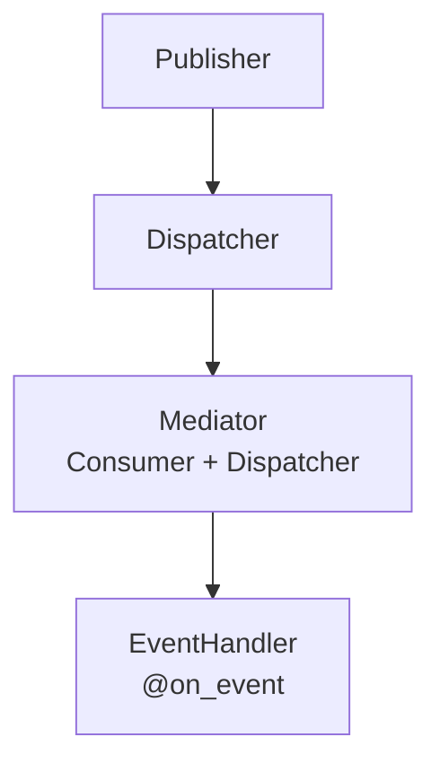

# Spakky Event

> [Spakky Framework](https://github.com/E5presso/spakky-framework)를 위한 이벤트 처리 stereotype입니다.

## 설치

```bash
pip install spakky-event
```

## 주요 기능

- **`@EventHandler`**: 이벤트 handler 클래스용 stereotype
- **`@on_event`**: 메서드를 이벤트 handler로 표시하는 decorator
- **타입 안전성**: 이벤트 타입에 대한 타입 힌트 지원
- **비동기 지원**: 이벤트 처리에 async/await 네이티브 지원

## 빠른 시작

### 이벤트 정의

이벤트는 `spakky-domain`의 이벤트 기반 클래스 중 하나를 상속해야 합니다.

- bounded context 내부 이벤트(in-process domain event)에는 `AbstractDomainEvent`를 사용합니다.
- 경계를 넘는 이벤트(message broker integration)에는 `AbstractIntegrationEvent`를 사용합니다.

메시지 브로커 플러그인(RabbitMQ/Kafka)을 사용할 때는 이벤트를 `AbstractIntegrationEvent`로 정의하세요.

```python
from spakky.core.common.mutability import immutable
from spakky.domain.models.event import AbstractIntegrationEvent


@immutable
class UserCreatedEvent(AbstractIntegrationEvent):
    user_id: str
    email: str


@immutable
class UserDeletedEvent(AbstractIntegrationEvent):
    user_id: str
```

### EventHandler 생성

`@EventHandler` stereotype과 `@on_event` decorator를 함께 사용합니다.

```python
from spakky.event.stereotype.event_handler import EventHandler, on_event


@EventHandler()
class UserEventHandler:
    def __init__(self, notification_service: NotificationService) -> None:
        self.notification_service = notification_service

    @on_event(UserCreatedEvent)
    async def on_user_created(self, event: UserCreatedEvent) -> None:
        await self.notification_service.send_welcome_email(event.email)

    @on_event(UserDeletedEvent)
    async def on_user_deleted(self, event: UserDeletedEvent) -> None:
        await self.notification_service.send_goodbye_email(event.user_id)
```

### 메시지 브로커 통합

`@EventHandler` stereotype은 Spakky의 message broker 플러그인과 함께 동작합니다.

#### RabbitMQ

```bash
pip install spakky-rabbitmq
```

```python
from spakky.core.application.application import SpakkyApplication
from spakky.core.application.application_context import ApplicationContext

app = (
    SpakkyApplication(ApplicationContext())
    .load_plugins()  # Loads spakky-rabbitmq plugin
    .scan()
    .start()
)
```

#### Kafka

```bash
pip install spakky-kafka
```

```python
from spakky.core.application.application import SpakkyApplication
from spakky.core.application.application_context import ApplicationContext

app = (
    SpakkyApplication(ApplicationContext())
    .load_plugins()  # Loads spakky-kafka plugin
    .scan()
    .start()
)
```

## API 레퍼런스

### 스테레오타입

| 데코레이터 | 설명 |
|-----------|-------------|
| `@EventHandler()` | 클래스를 event handler로 표시(`@Pod` 확장) |
| `@on_event(EventType)` | 메서드를 특정 event type의 handler로 표시 |

### 인터페이스

| 인터페이스 | 설명 |
|-----------|-------------|
| `IEventPublisher` / `IAsyncEventPublisher` | Event publish 진입점(type-based routing) |
| `IEventBus` / `IAsyncEventBus` | Integration event send 진입점(Outbox 경계) |
| `IEventTransport` / `IAsyncEventTransport` | 실제 message broker transport |
| `IEventConsumer` / `IAsyncEventConsumer` | Handler callback 등록 |
| `IEventDispatcher` / `IAsyncEventDispatcher` | In-process handler dispatch |

### 구현체

| 클래스 | 설명 |
|-------|-------------|
| `EventMediator` / `AsyncEventMediator` | Consumer와 Dispatcher를 결합한 in-process 구현체 |
| `EventPublisher` / `AsyncEventPublisher` | Type-based router(DomainEvent→Mediator, IntegrationEvent→EventBus) |
| `DirectEventBus` / `AsyncDirectEventBus` | 기본 EventBus → EventTransport 위임 구현 |
| `AuthContextSnapshotHeaderInjector` | Event/Outbox outbound header에 signed `AuthContextSnapshot` metadata를 주입하는 helper |
| `EventHandlerRegistrationPostProcessor` | `@EventHandler` 메서드를 자동 등록 |

### 전파 metadata

`DirectEventBus`와 `AsyncDirectEventBus`는 `IEventTransport.send(event_name, payload, headers)` public signature를 유지하면서 outbound header를 구성합니다.

| metadata | 조건 | 설명 |
|----------|------|------|
| `traceparent` | `spakky-tracing` propagator 활성 | 기존 W3C tracing header를 보존합니다. |
| `spakky.auth.context_snapshot` | `AuthSnapshotPropagationConfig(enabled=True)` + request-scope `AuthContext` + snapshot signer provider | raw bearer token 대신 signed `AuthContextSnapshot` envelope를 전파합니다. |

`Authorization: Bearer ...` 같은 raw bearer credential은 event header로 전파하지 않습니다.

### 타입

| 타입 | 설명 |
|------|-------------|
| `EventRoute` | event routing metadata용 annotation 클래스 |
| `EventT_contra` | `AbstractEvent`에 bound된 TypeVar |
| `EventHandlerCallback` | 동기 event callback용 type alias |
| `AsyncEventHandlerCallback` | 비동기 event callback용 type alias |

### 에러

| 클래스 | 설명 |
|-------|-------------|
| `AbstractSpakkyEventError` | event operation 기반 error |
| `AuthSnapshotPropagationContextUnavailableError` | snapshot 전파가 활성화되었지만 `ApplicationContext`를 읽을 수 없을 때 발생 |
| `AuthSnapshotPropagationSignerUnavailableError` | snapshot 전파가 활성화되었지만 signer provider가 없을 때 발생 |
| `InvalidMessageError` | message가 malformed일 때 발생 |

## 관련 패키지

| 패키지 | 설명 |
|---------|-------------|
| `spakky-domain` | DDD building block 포함 `AbstractEvent`, `AbstractDomainEvent`, `AbstractIntegrationEvent` |
| `spakky-rabbitmq` | RabbitMQ transport(`RabbitMQEventTransport`) |
| `spakky-kafka` | Kafka transport(`KafkaEventTransport`) |

## In-process 도메인 이벤트 발행

bounded context 내부 이벤트(DomainEvents)에는 in-process publisher를 사용합니다.

```python
from spakky.core.application.application import SpakkyApplication
from spakky.core.application.application_context import ApplicationContext
from spakky.event import IAsyncEventPublisher

# 애플리케이션 부트스트랩(load_plugins가 event component를 자동 등록)
app = (
    SpakkyApplication(ApplicationContext())
    .load_plugins()
    .scan()
    .start()
)

# 컨테이너에서 publisher 조회
publisher = app.container.get(IAsyncEventPublisher)
await publisher.publish(UserCreatedEvent(user_id="123", email="test@example.com"))
```

### 아키텍처(ISP 준수)

in-process event system은 Interface Segregation Principle을 따릅니다.

- **Consumer**: event handler 등록(`register()` 메서드)
- **Dispatcher**: event를 handler로 dispatch(`dispatch()` 메서드)
- **Mediator**: 두 인터페이스를 단일 구현체로 결합
- **Publisher**: Consumer가 아니라 Dispatcher에만 의존



## 라이선스

MIT License
