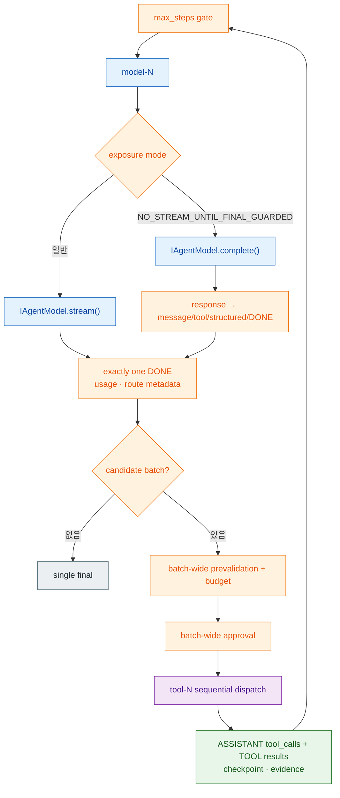

# ADR-0017: Bounded iterative model/tool loop

> Framework-owned `AgentRunner`가 model → validated/authorized tool batch → assistant/TOOL continuation을 bounded하게 반복합니다.
> 개발자는 `AgentExecutionLimits` 하나로 실행 예산을 선언하고, runner는 limit·approval·cancellation·checkpoint·evidence를 stream/complete 양쪽 model path에서 동일하게 집행합니다.

## 맥락 (Context)

[ADR-0013](0013-declarative-agent-loop-ownership.md)은 개발자가 model stream과 tool dispatch 배관을 반복 작성하지 않도록 framework가 표준 loop를 소유한다고 결정했습니다. 초기 구현은 한 model request에서 나온 tool candidate를 실행한 뒤 result/evidence를 caller에게 내보내고 종료했습니다. Tool result를 model history로 돌려보내 최종 답을 생성하거나 여러 tool round를 이어 가려면 custom `execute()`가 필요했습니다.

이 제한은 선언형 DX의 핵심을 application code로 다시 밀어냈습니다. Tool을 선택한 model이 그 결과를 관찰해 다음 판단을 내려야 하는 일반적인 agent workflow에서 caller가 반복 loop, transcript, provider correlation metadata, approval resume와 budget을 직접 구현해야 했습니다. Framework가 loop를 소유한다는 ADR-0013의 원칙을 실제 multi-round 실행 의미까지 확장하되 unbounded 반복과 authority 우회를 막아야 했습니다.

Pydantic AI의 `UsageLimits`는 비교 선례로만 사용했습니다. 현재 공식 문서는 request limit을 다음 model request 전에, tool-call limit을 batch 실행 전에, token limit을 provider response usage를 받은 뒤 검사한다고 설명합니다. Parallel tool batch가 limit을 넘으면 아무 tool도 실행하지 않는다는 점도 참고했습니다. Spakky의 field 이름, default, error, durable checkpoint와 execution timing은 아래 live source 계약이 독립적으로 정합니다.

## 결정 (Decision)

### 1. Public limit surface는 `AgentExecutionLimits` 하나입니다

`AgentExecutionSpec`은 `limits: AgentExecutionLimits`만 소유합니다. `AgentExecutionSpec.timeout_seconds`는 제거하며 compatibility alias를 두지 않습니다.

```python
from spakky.agent import AgentExecutionLimits, AgentExecutionSpec

spec = AgentExecutionSpec(
    name="support_agent",
    limits=AgentExecutionLimits(
        max_steps=8,
        max_tool_calls=32,
        max_tokens=None,
        timeout_seconds=None,
    ),
)
```

`max_steps`와 `max_tool_calls`는 각각 8과 32의 positive default를 갖습니다. `max_tokens`와 `timeout_seconds`는 `None`이면 비활성이고 설정할 때는 positive여야 합니다. Limit error는 counters(`model_steps`, `tool_calls`, `total_tokens`)와 resolve된 route metadata를 함께 운반합니다.

### 2. Streaming과 guarded-complete는 같은 loop로 합류합니다



일반 exposure mode에서는 adapter `stream()`을 terminal까지 소비합니다. `NO_STREAM_UNTIL_FINAL_GUARDED`에서는 `complete()`가 반환한 `ModelResponse`를 message delta, tool START/END/CANDIDATE, structured output와 DONE으로 normalize합니다. Incremental content를 complete 반환 전에 공개하지 않지만 이 mode 이름만으로 별도 redaction detector/policy를 자동 구성하지 않습니다.

두 path 모두 `_ModelStepAccumulator`를 거치며 model step마다 정확히 하나의 DONE을 요구합니다. Missing/duplicate DONE은 partial content가 있었더라도 `agent_model_terminal_invalid`이고 success final을 만들지 않습니다. Provider가 candidate만 내고 fine-grained START/END를 생략한 경우 runner cursor가 missing frame side만 합성하고 이미 관찰한 START/END는 중복 생성하지 않습니다.

### 3. Candidate batch 전체를 검증·승인한 뒤 순서대로 실행합니다

Terminal response에 candidates가 있으면 runner는 첫 side effect 전에 batch 전체를 다음 순서로 준비합니다.

1. Missing call id를 `{state_id}:model-{step}:call-{index}`로 보완합니다.
2. Blank, batch duplicate와 run 내 reused call id를 거부합니다.
3. 모든 tool descriptor가 catalog에 있는지 확인합니다.
4. 각 arguments를 Python tool signature에 bind합니다.
5. Invocation-specific approval context와 call/argument-bound approval plan을 생성합니다.
6. 현재 committed tool count + batch size가 `max_tool_calls`를 넘는지 검사합니다.
7. Batch의 모든 required approval outcome을 확인합니다.

어느 call 하나라도 validation·binding·approval plan·tool budget을 통과하지 못하면 batch의 valid prefix도 dispatch하지 않습니다. 하나의 approval이 missing/deferred/rejected여도 첫 tool을 실행하지 않습니다. Stateless run에 approval-required candidate가 나오면 durable authority channel이 없으므로 `agent_approval_unavailable`로 fail closed합니다.

모든 gate가 열린 뒤 tool은 model이 선언한 순서로 하나씩 실행합니다. 이는 **pre-dispatch validation/authority atomicity**이며 transaction atomicity가 아닙니다. 뒤 tool이 failure·timeout·cancel되면 앞 tool에서 이미 발생한 external side effect나 committed result를 자동 rollback하지 않습니다. Framework가 서로 다른 outbound system을 하나의 분산 transaction으로 추론하지 않습니다.

### 4. Assistant tool-call와 TOOL result를 다음 model request에 연결합니다

Validated batch는 assistant `ModelMessage` metadata의 `tool_calls`에 보존합니다. 각 entry는 stable call id, name, arguments와 provider-specific call metadata를 유지합니다. Tool result는 JSON-compatible content와 `call_id`/`tool_name` metadata를 가진 `ModelMessageRole.TOOL` message로 append합니다. `MODIFY`가 승인되면 pending call과 대응 assistant envelope를 임시 copy에서 함께 갱신한 뒤 둘 다 valid할 때만 context에 commit합니다. Invalid binding 또는 missing assistant call은 partial mutation 없이 `agent_approval_invalid`입니다.

다음 model step은 기존 user/history, assistant tool-call message와 순서대로 committed TOOL result를 모두 받습니다. OpenAI adapter는 이를 assistant tool calls + tool role message, Anthropic은 `tool_use` + `tool_result`, Google은 `FunctionCall` + `FunctionResponse` part로 복원합니다. Google call metadata의 base64 `thought_signature`는 assistant history를 통해 다음 native `types.Part.thought_signature`로 복원됩니다.

Runner는 provider metadata 중 `model_ref`, `profile`, `provider`, `model`을 current route metadata로 보존합니다. Usage budget 판단 전에 route를 먼저 capture하고 usage/counters를 갱신합니다. Usage failure terminal은 route·counters·step usage를 함께 가지며 durable path는 error를 포함한 MODEL evidence를 append한 뒤 state를 실패시킵니다. Tool result event, checkpoint와 정상 model-decision evidence도 같은 route에 결속됩니다. Credential·header는 이 metadata에 포함하지 않습니다.

### 5. Approval은 call과 arguments에 결속되고 fresh resume이 checkpoint를 복원합니다

Approval id는 state id, stable call id와 **full SHA-256 argument digest**로 만듭니다. Checkpoint는 `approved_call_fingerprints`라는 clean key에 최종 approved call의 full fingerprint를 저장하며 call-id-only alias를 유지하지 않습니다. Approval evidence에는 request id, decision과 modified payload를 남깁니다. `APPROVE`는 original call을, `MODIFY`는 modified payload를 descriptor signature와 assistant history에 함께 반영한 call을 승인합니다. Persisted pending arguments가 바뀌면 fingerprint가 달라져 기존 approval을 재사용하지 않습니다. `DEFER`는 pause를 유지하고 `REJECT`/`CANCEL`은 dispatch 없이 failure/cancellation lifecycle로 전이합니다.

Durable checkpoint는 transcript, accumulated assistant text, committed tool names, step/tool/token counters, seen call ids, approved call fingerprints, pending calls와 route metadata를 보존합니다. Fresh process/runner의 `resume=True`는 checkpoint를 strict typed parsing하고 pending batch가 있으면 첫 model request를 replay하지 않습니다. Resume invocation은 counters/history를 이어받되 optional wall-clock deadline은 새 invocation 시작 시 다시 계산합니다. Decode failure와 structurally valid checkpoint의 invalid restored batch는 모두 `agent_checkpoint_invalid`로 terminalize합니다.

Model call, approval wait, tool call 전후에 `AgentActionBoundaryCheckpoint` evidence를 append합니다. Incomplete non-idempotent/unknown tool boundary는 restart에서 자동 retry하지 않고 `RECOVERY_REQUIRES_HITL`로 pause합니다. 승인 후 dispatch crash가 발생한 unchanged pending call은 persisted approved call id와 checkpoint를 사용해 같은 approval을 반복 요구하지 않을 수 있습니다. Corrupted checkpoint root/field는 silent restart 대신 `AgentDefinitionError`로 실패합니다.

### 6. Limit과 cancellation timing을 명시합니다

| Gate | 집행 시점 | 초과/불능 결과 |
|------|-----------|----------------|
| `max_steps` | 각 model request 직전 | `step_count >= max_steps`이면 request 없이 `agent_max_steps_exceeded` |
| `max_tool_calls` | batch validation 후 approval/dispatch 전 | committed count + batch size가 초과하면 어떤 call도 실행하지 않고 `agent_max_tool_calls_exceeded` |
| `max_tokens` | terminal model response의 usage를 누적한 직후 | 누적값이 limit보다 크면 `agent_max_tokens_exceeded`; total usage가 없으면 `agent_usage_unavailable` |
| `timeout_seconds` | invocation 시작의 monotonic deadline을 model/async-tool await에 적용 | async deadline 도달 시 `agent_timeout`; sync batch는 dispatch 전 `agent_sync_tool_timeout_unenforceable` |

Token check는 response 이후이므로 초과를 보고한 model response 자체는 이미 소비됐을 수 있습니다. 그러나 그 response의 tool batch, 다음 model request와 success final은 실행하지 않습니다. `max_tokens`가 비활성일 때도 provider가 준 `total_tokens`는 counters에 누적합니다.

Tool descriptor의 local timeout과 run deadline이 모두 있으면 async tool에는 더 이른 deadline을 사용합니다. Active run deadline 또는 tool timeout 아래 in-process sync callable은 안전하게 preempt할 수 없으므로 runner가 실행·중단을 거짓 주장하지 않습니다. Batch authorization 전에 sync callable을 발견하면 **batch 0-dispatch**로 `agent_sync_tool_timeout_unenforceable`을 반환합니다. Timeout durable state는 `FAILED`/`TIMED_OUT`/`TIMEOUT`으로 materialize합니다. Cancellation은 durable loop 시작, model event tick, authority 완료 후 첫 dispatch 전, 각 tool 전후에 poll합니다. Tool callable이 return한 직후 cancel이 관찰되면 result/evidence commit, 다음 model과 final을 막습니다. `run_events()`의 cancel은 위치와 무관하게 `cancelled` code, reason message, state/signal id와 optional requester metadata의 canonical shape를 사용합니다.

### 7. Model/tool step과 terminal boundary는 unique합니다

`run_events()`는 `model-1`, `tool-1`, `model-2`, …처럼 step name을 run 안에서 unique하게 부여하고 정상 완료된 step은 `StepStartedEvent`/`StepFinishedEvent`로 감쌉니다. Model message/reasoning id도 model step에 결속됩니다. Tool result event는 stable call id와 current model message id를 사용합니다. Run은 success/failure/pause 각각의 boundary에서 중복 final 없이 정확히 한 terminal/pause event로 닫힙니다.

AG-UI projector는 `STEP_FINISHED`를 wire에 쓰기 전에 해당 step의 열린 text/reasoning/tool frame을 모두 닫습니다. 따라서 이전 model message frame이 tool step이나 다음 model step으로 이어지지 않습니다. A2A projector는 같은 step name을 working status metadata로 표현하고 executor가 stream 종료 후 terminal Task transition을 한 번 적용합니다.

### 8. Framework failure와 signal projection은 typed terminal입니다

Framework-owned boundary에서 발생한 `AbstractSpakkyFrameworkError`는 raw generator exception으로 새지 않고 다음 stable code로 정규화합니다.

| Code | 경계 |
|------|------|
| `agent_model_execution_failed` | stream/complete 또는 compaction |
| `agent_tool_execution_failed` | tool invocation 또는 result serialization |
| `agent_checkpoint_invalid` | checkpoint decode/restored pending validation |
| `agent_approval_invalid` | approval plan/signal/MODIFY binding/history update |
| `agent_signal_projection_unsupported` | neutral event로 표현할 수 없는 signal-hook yield |
| `agent_sync_tool_timeout_unenforceable` | active deadline 아래 in-process sync tool batch |

`run()`은 USER_MESSAGE fallback과 signal hook의 `Progress`를 그대로 yield합니다. `run_events()`는 같은 Progress를 stable `ArtifactEvent(name="signal_progress")`로 변환해 message/current step/metadata를 content에 담습니다. STEERING hook이 `Progress`를 내는 경우도 같습니다. 다른 `AgentYield` payload는 임의의 잘못된 neutral event로 꾸미거나 drop하지 않고 `agent_signal_projection_unsupported`로 state/run을 fail closed합니다.

### 9. Compaction은 assistant/tool correlation group을 보존합니다

Provider-bound history는 assistant `tool_calls` envelope와 그 call id 각각의 `TOOL` result를 하나의 group으로 취급합니다. Orphan result, blank/duplicate assistant call id, unknown/duplicate result, missing result를 거부합니다. `KeepRecentMessagesCompactionStrategy`와 `SummarizeOldTurnsCompactionStrategy`는 message count가 경계를 가르더라도 group 전체를 보존하고 `TrimToolResultsCompactionStrategy`는 result content만 줄여 correlation metadata를 유지합니다.

Runner는 compaction 전 input history와 **각 built-in/custom strategy 결과**를 모두 `validate_tool_call_groups()`로 검사합니다. Custom strategy가 group을 깨면 provider request를 보내지 않고 `agent_model_execution_failed`로 닫습니다.

## 대안 (Alternatives)

### 대안 A: One-request loop를 유지하고 custom `execute()`에 반복을 맡깁니다

Framework loop는 단순하지만 모든 application이 continuation history, tool correlation, approval resume, limit와 evidence를 다시 작성해야 합니다. Declarative ownership의 이익을 핵심 agent workflow에서 잃으므로 ADR-0013의 이 제한을 대체했습니다.

### 대안 B: Tool batch를 병렬 dispatch합니다

Latency는 줄 수 있지만 deterministic order, cancellation/result commit timing, approval resume와 external side-effect 해석이 복잡해집니다. 현재 contract는 model-declared order의 sequential dispatch를 선택합니다. 향후 병렬 정책이 필요하면 별도 explicit execution policy와 failure semantics가 먼저 필요합니다.

### 대안 C: Batch 전체를 transaction atomic으로 선언합니다

Tool은 DB, filesystem, network, remote agent 등 서로 다른 system을 호출할 수 있어 공통 rollback을 보장할 수 없습니다. Framework는 dispatch 전 validation/authority만 batch-wide하게 보장하고 execution rollback을 암시하지 않습니다.

### 대안 D: Pydantic AI runtime loop와 UsageLimits를 직접 채택합니다

검증된 선례지만 Spakky는 이미 model/tool/state/signal/evidence/protocol-neutral event contract를 소유합니다. Runtime을 위임하면 두 계약과 durable authority가 중복됩니다. Limit timing의 비교 근거만 사용하고 Spakky public API와 implementation은 독립적으로 유지합니다.

## 결과 (Consequences)

### 긍정적

- 선언형 agent가 custom loop 없이 tool result를 관찰하고 여러 model/tool round를 이어갈 수 있습니다.
- Stream과 complete model path가 같은 authority, continuation, limits와 terminal semantics를 공유합니다.
- Invalid/unauthorized/over-budget batch는 side-effect prefix 없이 fail closed합니다.
- Durable approval pause와 fresh resume가 first model replay 없이 pending batch에서 이어집니다.
- Provider routing/call metadata와 Google signature가 다음 native request까지 유지됩니다.
- Model/tool step, counter, checkpoint와 evidence가 같은 execution context에 결속됩니다.

### 부정적

- Runner가 transcript, batch authority, counters, timeout, recovery를 함께 소유해 구현과 test surface가 커집니다.
- Sequential dispatch는 parallel execution보다 느릴 수 있습니다.
- Token budget은 provider-reported usage에 의존하며 configured limit에서 usage가 없으면 실행을 계속할 수 없습니다.
- Batch dispatch는 transaction이 아니므로 application tool은 idempotency와 compensation을 여전히 정확히 선언해야 합니다.
- Deadline이 필요한 in-process sync tool은 지원하지 않으므로 async callable 또는 별도 interruptible execution adapter가 필요합니다.

### 중립적

- Custom `execute()` escape hatch는 유지하지만 iterative model/tool wiring은 더 이상 그 사용 이유가 아닙니다.
- `AgentExecutionLimits`는 runner execution budget이며 provider price/cost catalog가 아닙니다.
- Current model message content는 여전히 text 중심이며 multimodal content-part 확장은 별도 결정입니다.
- ADR-0013의 loop ownership/protocol boundary, ADR-0015의 official SDK/tool authority와 ADR-0016의 model catalog 결정은 계속 유지됩니다.

## 참고 자료

- [ADR-0013: 선언형 Agent loop ownership](0013-declarative-agent-loop-ownership.md)
- [ADR-0015: Multi-provider LLM official SDK adapters](0015-multi-provider-llm-official-sdk-adapters.md)
- [ADR-0016: Operator-owned model catalog](0016-operator-owned-model-catalog.md)
- [Pydantic AI — Usage limits](https://ai.pydantic.dev/agent/#usage-limits)
- [Pydantic AI `UsageLimits` source](https://github.com/pydantic/pydantic-ai/blob/main/pydantic_ai_slim/pydantic_ai/usage.py)
