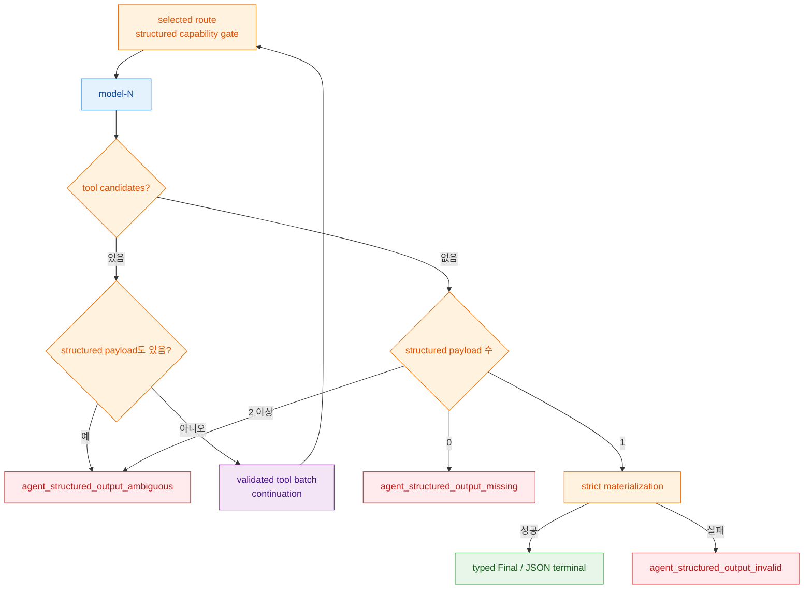

# ADR-0018: Typed agent output과 composed execution context

> Agent는 `output_type`으로 최종 Python 타입을 선언하고, caller static `AgentContext`와 optional constructor-injected `IAgentContextProvider`를 model step에서 조합합니다.
> Framework는 portable schema·strict materialization·provenance coverage·privacy-safe fingerprint를 fail closed로 집행하고, provider와 inbound protocol은 교체 가능한 adapter로 남습니다.

## 맥락 (Context)

[ADR-0013](0013-declarative-agent-loop-ownership.md)은 `@Agent` 실행 loop와 protocol-neutral event taxonomy를 framework가 소유하도록 했고, [ADR-0017](0017-bounded-iterative-agent-loop.md)은 이 loop를 bounded model/tool continuation으로 확장했습니다. 그러나 application이 원하는 최종 결과 타입은 아직 model adapter의 raw `StructuredOutputSpec`과 `JsonValue`를 직접 다루거나 caller가 수동 cast해야 했습니다. Model이 JSON처럼 보이는 text를 내는 경우, schema validation과 application type materialization의 어느 쪽이 authority를 갖는지도 모호했습니다.

Context 타입은 `ContextPack`, `ContextManifest`, `ContextDigest`로 존재했지만 표준 runner에 요청별 static context를 넣고 model step별 dynamic context를 합치는 작은 public execution contract가 없었습니다. Application이 context를 system/user text에 수동으로 이어 붙이면 pack identity, manifest/digest coverage, sensitivity marker와 budget을 잃고 provider별 prompt wiring이 새는 문제가 있었습니다. 반대로 raw context를 durable checkpoint/evidence에 저장하면 재개 편의는 얻지만 불필요한 내용·metadata 노출을 만듭니다.

목표는 Spring Boot식으로 간단한 선언형 default와 명시적 extension seam을 같이 제공하는 것입니다. Agent 개발자는 output class, run context, optional provider만 알면 되고 schema compiler·provider wire format·protocol projector는 framework 내부에 남아야 합니다. 편의를 위해 text fallback, type coercion, partial provenance, ambient context 추론을 추가하지는 않습니다.

## 결정 (Decision)

### 1. Public DX는 output class, `AgentContext`, optional provider로 한정합니다

```python
from pydantic import BaseModel

from spakky.agent import (
    Agent,
    AgentContext,
    AgentExecutionSpec,
    ContextPack,
    ContextPackRole,
    IAgentContextProvider,
    IAgentModel,
    RunAgentInput,
)


class Answer(BaseModel):
    answer: str
    confidence: float


@Agent(
    spec=AgentExecutionSpec(
        name="support_agent",
        output_type=Answer,
        refresh_context_each_step=False,
    )
)
class SupportAgent:
    def __init__(
        self,
        model: IAgentModel,
        context_provider: IAgentContextProvider,
    ) -> None:
        self.model = model
        self.context_provider = context_provider


run_input = RunAgentInput(
    state_id="run-1",
    instruction="요청을 분류하고 답변하세요.",
    context=AgentContext(
        packs=(
            ContextPack(
                id="request-facts",
                content="customer_tier=premium; locale=ko-KR",
                source="caller",
                role=ContextPackRole.STATE,
            ),
        ),
    ),
)
```

위 예시는 dynamic context를 쓰는 variant이므로 `IAgentContextProvider`를 required constructor dependency로 받습니다. Static `RunAgentInput.context`만 필요한 agent는 provider parameter와 속성을 둘 다 생략합니다. 즉 provider는 framework 기능 사용 여부의 optional extension이지 optional-union constructor injection 계약은 아닙니다. Runner는 agent instance의 주입 속성에서 이 port를 타입으로 찾으며 속성 이름이나 provider class를 hardcode하지 않습니다. 복수 provider는 모호성이므로 resolution 시점에 실패합니다.

### 2. `output_type`은 strict portable contract를 정의 시점에 만듭니다

지원하는 top-level class는 다음 세 종류입니다.

- Pydantic `BaseModel`
- Python 표준 라이브러리 `dataclass`
- `TypedDict`

Framework는 alias를 반영한 validation-mode JSON Schema를 생성하고 local `$defs` reference를 재귀적으로 펼칩니다. Object schema는 closed shape로 정규하고 portable keyword subset만 허용합니다. 순환 reference, external/missing reference, reference sibling, unsupported keyword, non-object root, non-finite/non-JSON schema는 `AgentExecutionSpec` 생성 시 `AgentDefinitionError`입니다. `str`같은 임의 class를 애매하게 감싸지 않습니다.

Provider가 반환한 JSON은 strict validation과 extra-key forbid를 통과해 선언한 Python 타입으로 materialize됩니다. Primitive는 정확한 Python type이 같아야 하고 sequence 길이와 입력 key의 nested shape가 유지되어야 합니다. 선언된 default field가 materialization 과정에서 추가되는 것은 허용하지만 submitted key가 serializer에서 사라지는 shape loss는 거부합니다. Model text를 JSON으로 다시 parse하는 fallback은 없습니다.

Portable core schema가 모든 provider wire에서 표현 가능하다는 뜻은 아닙니다. 선택한 route는 `supports_structured_output=True`를 정확히 선언해야 하고, provider adapter는 wire 제약을 약화하는 fallback 대신 explicit unsupported error를 반환합니다.

### 3. Typed final은 tool이 없는 terminal model step에서 하나만 인정합니다



Runner는 model request 전 selected route capability를 조회합니다. 지원하지 않으면 provider를 호출하지 않고 `agent_structured_output_unsupported`로 닫힙니다. Tool-only 중간 step은 정상 continuation이지만, tool candidate와 structured payload가 같은 step에 공존하면 tool도 dispatch하지 않습니다. Stream과 `NO_STREAM_UNTIL_FINAL_GUARDED` complete path는 같은 accumulator·error code·materialization을 사용합니다.

`run()` success의 `Final.output`은 실제 `output_type` instance입니다. `run_events()` success의 `RunFinishedEvent.metadata` 내 `output`은 alias-aware JSON-safe value이고 `output_type`은 class `__name__`입니다. Server-side `ITaskStore`에 assistant text가 없고 typed output만 있으면 이 JSON-safe value를 compact JSON text로 저장합니다.

`output_type=None`은 기존 흐름을 보존합니다. Runner는 `StructuredOutputSpec`을 만들지 않고 `run()` final은 `AgentRunResult`이며 `run_events()` terminal metadata에 typed `output`/`output_type`을 넣지 않습니다. 기존 agent를 typed output으로 자동 승격시키지 않습니다.

### 4. Static과 dynamic `AgentContext`는 exact provenance로 조합합니다

`RunAgentInput.context` default는 empty `AgentContext()`입니다. Provider signature는 `async provide(run_input: RunAgentInput, model_step: int) -> AgentContext`이고 `model_step`은 1-based입니다. `refresh_context_each_step=False`이면 provider를 runner invocation의 첫 model step에 한 번 호출하고 결과를 후속 step에 cache합니다. `True`면 model step마다 재호출합니다. Provider exception/invalid return은 model request 전 `agent_model_execution_failed`, active run deadline 초과는 `agent_timeout`으로 fail closed합니다.

조합 순서는 static packs 다음 dynamic packs입니다. 결합된 pack id는 unique해야 하고 manifest entry는 pack 순서대로 id, `source`, role을 정확히 커버해야 합니다. Manifest가 없는 nonempty envelope는 pack id/source/role로 deterministic manifest를 얻습니다. Static/dynamic이 둘 다 nonempty면 entries와 evidence ref를 이어 붙이고 component manifest id를 보존하는 composite manifest를 생성합니다.

Digest는 `source_manifest_ref`가 manifest id와 같고 `derived_from_pack_ids`가 모든 pack id와 순서대로 같을 때만 유효합니다. Nonempty envelope가 하나면 이 exact digest를 보존합니다. 두 nonempty envelope를 결합하면 component digest 하나를 전체 digest로 가장할 수 없으므로 digest가 하나라도 있을 때 `AgentDefinitionError`로 fail closed합니다. Framework가 부분 digest를 임의로 재계산하거나 drop하지 않습니다.

### 5. Model-bound context만 fingerprint하고 raw context는 checkpoint/evidence에 저장하지 않습니다

Runner는 model request 전 caller 객체를 mutate하지 않는 copy에서 다음을 적용합니다.

1. `ContextSensitivity.REDACTED`는 content 전체를 `[REDACTED]`로 바꾸고, `sensitive_fields`는 deterministic guard한 뒤 descriptor를 제거합니다.
2. `max_tokens`는 기본 4 characters/token cap을 적용하고, explicit estimate가 budget을 넘으면 비례한 더 작은 cap을 선택합니다.
3. Caller pack metadata는 제거하고 잘린 pack에만 framework-generated `context_truncation` metadata를 남깁니다.
4. Manifest entry의 sensitive descriptor/metadata를 제거하고 manifest metadata는 validated `component_manifest_refs`만 유지합니다.
5. Digest summary/metadata는 제거하지만 identity, manifest/pack reference와 digest value는 보존합니다.

`CONFIDENTIAL`/`SENSITIVE` label 자체만으로 content가 자동 숨겨지는 것은 아닙니다. 부분 내용은 `sensitive_fields`, pack 전체는 `REDACTED`로 명시해야 합니다. Evidence에 남는 pack/manifest/digest 식별자와 reference도 secret-bearing 문자열로 사용하지 않아야 합니다.

Durable checkpoint는 prepared static context의 deterministic SHA-256 `static_context_fingerprint`만 저장합니다. Raw static/dynamic context는 checkpoint에 들어가지 않습니다. Context가 있던 run을 resume하는 caller는 동일한 prepared static identity를 만드는 `RunAgentInput.context`를 다시 제공해야 합니다. Missing, changed, additive static context는 model/tool dispatch 전 `agent_checkpoint_invalid`로 거부합니다. Dynamic provider는 resume/retry invocation의 복원된 model step에서 다시 호출됩니다.

Durable context evidence는 각 model step의 전체 prepared context를 해시한 `context_fingerprint`에 결속됩니다. `CONTEXT`, `CONTEXT_MANIFEST`, `CONTEXT_DIGEST` 중 실제로 있는 kind만 append하고 모든 payload에 `context_fingerprint`를 넣어 deduplication identity를 공유합니다. Top-level `AgentEvidence.digest`는 `CONTEXT`/`CONTEXT_MANIFEST`에서 fingerprint를 사용하지만 `CONTEXT_DIGEST`에서는 caller가 선언한 `ContextDigest.digest`를 보존하고 payload의 `context_fingerprint`로 model-bound identity에 결속합니다. 같은 step에서 같은 fingerprint가 retry되면 deduplicate하지만 model-bound content나 provenance가 바뀌면 새 evidence set을 append합니다. Payload에 raw content, caller metadata, digest summary는 넣지 않습니다.

### 6. Provider wire와 protocol output은 각 adapter가 명시적으로 정규화합니다

First-party LLM adapter는 prepared `ContextPack`을 `ModelRequest.assemble_messages()`로 evidence-role message에 포함합니다. Context 내용을 system/user text에 수동으로 이어 붙이지 않고, manifest/digest는 core request/evidence의 분리된 provenance로 유지합니다.

OpenAI-compatible strict structured-output request는 core schema를 mutate하지 않는 wire copy에서 **모든 nested object property를 required**로 만들고 `additionalProperties=false`를 적용합니다. Core에서 default field 생략을 허용하는 의미는 유지하되 OpenAI wire는 해당 property도 생성하도록 요청합니다. `additionalProperties` 자체가 schema인 arbitrary-key strict object는 제약을 완화하지 않고 `LlmUnsupportedFeatureError`로 거부합니다. Non-strict direct request는 원본 required set을 보존합니다. Anthropic은 Messages output format, Google은 JSON response schema, vLLM dialect는 명시적 extension으로 매핑하며 모든 provider JSON은 core materialization 전에 adapter codec를 통과해야 합니다.

Protocol adapter는 neutral terminal JSON만 소비합니다.

| Surface | Typed success | `output_type=None` |
|---------|---------------|--------------------|
| Public `run()` | `Final.output` = 선언한 Python 타입 | `Final.output` = `AgentRunResult` |
| Neutral `run_events()` | metadata `output` + class-name `output_type` | typed output metadata 없음 |
| AG-UI | JSON-safe `output` → `RUN_FINISHED.result` | `result=null` |
| A2A | class 이름의 data artifact 하나 후 complete | typed final artifact 없음 |

AG-UI는 Python class 이름을 wire field로 복제하지 않고 result만 보냅니다. A2A는 `output_type`을 artifact name으로 쓰고 output을 protobuf JSON data part로 전송합니다. Typed failure는 AG-UI `RUN_ERROR`, A2A failed Task data part로 표면화되며 success result/artifact를 만들지 않습니다. 현재 AG-UI/A2A inbound는 typed `AgentContext`를 재구성하지 않으므로 application service의 `RunAgentInput.context` 또는 injected provider가 이 입력을 소유합니다.

## 대안 (Alternatives)

### 대안 A: Caller가 `StructuredOutputSpec`/raw schema를 직접 작성합니다

Provider adapter 작성자에게는 필요한 low-level contract이지만 application에 노출하면 output class와 schema, validation, serialization이 중복됩니다. 선언한 class 하나를 SSOT로 삼는 현재 결정이 더 작고 안전한 DX를 제공합니다.

### 대안 B: Final text를 JSON으로 parse하고 실패하면 text를 반환합니다

모델과 provider가 structured-output authority를 통과했는지 알 수 없고 malformed/partial JSON을 success로 위장할 수 있습니다. Typed agent는 missing/ambiguous/invalid를 정확히 실패시키고, text result가 필요한 agent는 `output_type=None`을 유지합니다.

### 대안 C: Context provider만 두고 caller static context를 없앩니다

모든 request data가 service에서 provider로 우회하고 간단한 run도 DI 구현을 필요로 합니다. Static `RunAgentInput.context`를 기본으로 두고 provider를 optional extension으로 두는 것이 더 작은 표면으로 두 use case를 모두 커버합니다.

### 대안 D: Raw context를 checkpoint에 저장해 resume에서 자동 복원합니다

Caller 편의는 있지만 sensitive content·metadata의 영속 범위를 framework가 임의로 늘립니다. Safe fingerprint로 identity만 검증하고 resume caller에게 static context 재제공을 요구하며 dynamic provider를 재호출하는 것을 선택했습니다.

### 대안 E: Static/dynamic digest를 묵묵히 제거하거나 하나를 전체 digest로 사용합니다

Digest가 커버하는 pack 범위가 실제 model input과 달라져 provenance가 거짓이 됩니다. 완전한 composite digest 생성 authority가 없는 core는 partial digest를 fail closed하고 caller/provider가 정확한 전체 digest를 구성할 수 있는 단일 envelope에서만 보존합니다.

## 결과 (Consequences)

### 긍정적

- Agent 개발자는 `output_type=Answer`만으로 provider-neutral strict output과 typed final을 얻습니다.
- `RunAgentInput.context` + optional injected provider로 static/dynamic context를 같은 결합·검증·privacy boundary에 넣습니다.
- Stream/complete, public yield/neutral event, AG-UI/A2A가 같은 terminal output authority에서 출발합니다.
- Unsupported schema, route capability, missing/ambiguous/invalid output, partial provenance가 silent fallback 없이 조기에 실패합니다.
- Raw context를 durable checkpoint/evidence에 복제하지 않고 resume 정합성과 same-step evidence identity를 fingerprint로 결속합니다.

### 부정적

- Output class의 generated schema가 portable subset을 벗어나면 정의 시점에 사용할 수 없습니다.
- Core-portable schema라도 provider strict wire의 더 작은 subset에서 거부될 수 있어 route별 acceptance validation이 필요합니다.
- Durable resume caller는 original static context와 같은 prepared identity를 만드는 context를 다시 제공해야 합니다.
- Dynamic provider refresh는 model step 지연과 failure surface를 추가하며 active run deadline의 제약을 받습니다.

### 중립적

- `output_type=None`, custom `execute()`, direct low-level `StructuredOutputSpec` 구현 seam은 제거하지 않습니다.
- Context provider는 model/backend adapter가 아닌 application outbound port이고 concrete implementation은 DI로 교체합니다.
- Current AG-UI/A2A adapter는 typed final output만 protocol에 투영하고 inbound `AgentContext` mapping을 추가하지 않습니다.
- ADR-0015의 official SDK/tool authority, ADR-0016의 operator model catalog, ADR-0017의 bounded loop·approval·limit·resume 결정은 유지됩니다.

## 참고 자료

- [ADR-0013: 선언형 Agent loop ownership](0013-declarative-agent-loop-ownership.md)
- [ADR-0015: Multi-provider LLM official SDK adapters](0015-multi-provider-llm-official-sdk-adapters.md)
- [ADR-0016: Operator-owned model catalog](0016-operator-owned-model-catalog.md)
- [ADR-0017: Bounded iterative model/tool loop](0017-bounded-iterative-agent-loop.md)
- [`spakky-agent` API](../api/core/spakky-agent.md)
- [`spakky-llm` API](../api/plugins/spakky-llm.md)
- [`spakky-agui` API](../api/plugins/spakky-agui.md)
- [`spakky-a2a` API](../api/plugins/spakky-a2a.md)
