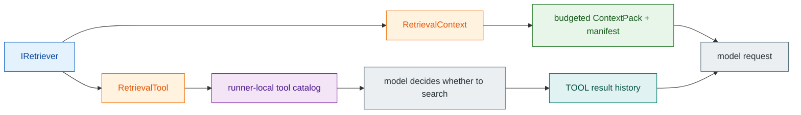

# ADR-0019: Minimal retrieval runtime

> `spakky-agent`는 `IRetriever` 하나를 classic pre-model context와 agentic read-only tool로 각각 감싸는 최소 retrieval runtime을 제공합니다.
> Storage/index topology를 프레임워크가 고르지 않고, scope·budget·provenance·privacy·tool authority를 기존 Agent contract에 결속합니다.

## 맥락 (Context)

[ADR-0017](0017-bounded-iterative-agent-loop.md)은 framework-owned model/tool loop와 limits, approval, evidence, checkpoint를 정했고 [ADR-0018](0018-typed-agent-output-and-context.md)은 typed `AgentContext`와 optional `IAgentContextProvider`를 추가했습니다. 그러나 외부 지식을 가져오는 application은 여전히 hit 검증, context framing, token budget, tool schema와 provenance를 매번 직접 구현해야 했습니다. Classic flow와 agentic flow를 다른 abstraction으로 만들면 같은 backend·scope 규칙이 두 곳에서 drift합니다.

반대로 프레임워크가 vector backend과 knowledge-base lifecycle까지 소유하면 특정 vendor/storage를 core에 고정하고 application의 기존 system을 다시 구축하게 합니다. 이 Wave의 목표는 full knowledge platform이 아니라 **이미 존재하는 retrieval implementation을 Agent runtime에 안전하게 연결하는 seam**입니다.

비교 근거로 현재 공식 문서를 확인했습니다.

- Spring AI는 `QuestionAnswerAdvisor`로 간단한 pre-model retrieval을 제공하고, `RetrievalAugmentationAdvisor` + modular `DocumentRetriever`로 교체 가능한 조합을 제공합니다. 이는 작은 default wrapper와 교체 가능한 port를 분리하는 근거가 됩니다.
- LangChain은 retriever를 저장 역할 없이 query에 대한 결과를 반환하는 read-only interface로 설명하고, retrieval을 항상 먼저 수행하는 2-step flow와 model이 tool 호출을 결정하는 agentic flow의 latency/control tradeoff를 분리합니다.
- Pydantic AI는 typed dependency를 `RunContext`로 tool에 전달하고, 공식 RAG 예시에서 injected client/pool을 사용하는 retrieval tool로 조합합니다. Spakky는 이 dependency + tool 분리를 constructor DI와 `IAgentToolProvider`로 표현합니다.

이들은 설계 비교 근거일 뿐 runtime dependency로 추가하지 않습니다.

## 결정 (Decision)

### 1. Public retrieval surface는 `spakky-agent`의 최소 contract로 한정합니다

| Contract | 역할 |
|----------|------|
| `IRetriever` | scoped query를 받아 ordered `RetrievalHit` sequence를 반환하는 async application port |
| `RetrievalHit` | model-facing text와 id/source, score, digest/revision, tenant/namespace, optional span을 보존하는 value |
| `RetrievalContext` | `IRetriever` → `IAgentContextProvider` classic adapter |
| `RetrievalTool` | `IRetriever` → `IAgentToolProvider` agentic adapter |
| `AgentRetrievalError` | malformed query/result/scope/budget를 표면화하는 strict framework error |

`IRetriever` signature는 다음과 같습니다.

```python
from collections.abc import Sequence

from spakky.agent import IRetriever, JsonObject, RetrievalHit


class SearchBackend(IRetriever):
    async def retrieve(
        self,
        query: str,
        *,
        limit: int,
        tenant_id: str | None,
        namespace: str | None,
        filters: JsonObject,
    ) -> Sequence[RetrievalHit]:
        ...
```

이 contract는 저장·생성·갱신 수명주기를 소유하지 않고 retrieval만 표현합니다. 별도 RAG package/plugin을 만들지 않고 기존 `spakky-agent` application layer에 둡니다. Public RAG taxonomy를 더 늘리지 않고 hit + port + 두 adapter만 표준 경계로 삼습니다.

### 2. 같은 `IRetriever`를 classic과 agentic mode에 재사용합니다



`RetrievalContext`는 `RunAgentInput.instruction`을 query로 쓰고 ordered hits를 deterministic framed `ContextPack`/`ContextManifest`로 변환합니다. Default `limit=5`, `max_context_tokens=2048`, `allow_empty=False`입니다. Default `IAgentContextProvider` 시점에 따라 invocation의 첫 model request 전에 한 번 retrieval하고 결과를 후속 model step에 cache합니다. Empty result는 model을 호출하지 않고 `AgentRetrievalError`이며 `allow_empty=True`만 empty context를 허용합니다.

`RetrievalTool`은 default name `search`, default `limit=5`이며 model-facing schema에 `query: str` 하나만 노출합니다. Descriptor는 read-only, idempotent, structured evidence, approval-not-required로 선언됩니다. Empty result는 empty list로 반환하고 model이 다음 step을 결정합니다. Classic empty-context fail-closed 의미를 agentic tool result에 임의로 확장하지 않습니다.

### 3. Scope, budget, provenance와 privacy를 wrapper 경계에서 집행합니다

Tenant id, namespace와 filters는 `RetrievalContext`/`RetrievalTool` 생성 시 고정합니다. Filters는 recursive finite JSON만 허용하고 deep snapshot한 뒤 각 call에 copy로 넘깁니다. Model tool argument로 scope/filter를 받지 않습니다. Bound tenant/namespace의 result는 exact match여야 하고, unbound wrapper는 해당 field가 `None`인 unscoped hit만 받습니다. Cross-scope result를 필터링해 계속하지 않고 전체 call을 fail closed합니다.

Hit id/source는 nonblank single-line, content는 nonblank, score는 finite, span은 nonnegative start + greater end여야 합니다. Wrapper는 result가 sequence인지, 모든 item이 `RetrievalHit`인지, id가 unique한지를 검증하고 input order의 앞 `limit`개만 사용합니다. Retrieval component에 직접 도달한 malformed query/hit/runtime value는 raw `AttributeError`/`TypeError`로 누출하지 않고 `AgentRetrievalError`로 정규화합니다. Model-generated non-string tool query는 `_retrieval_query` runtime validator가 retriever 호출 전 `AgentRetrievalError`로 거부하고 runner가 `agent_tool_execution_failed`로 표면화합니다. Missing/extra argument는 이 단계보다 앞선 tool batch signature binding error입니다.

Classic context는 hit 순서대로 shared token budget을 할당합니다. Framed content의 token estimate는 4 characters/token이고 현재 hit이 budget보다 길면 해당 pack을 잘라 사용한 뒤 뒤 hit를 선택하지 않습니다. Manifest id는 selected hit reference, pack id와 deterministic framed pack-content digest에서 만듭니다. Entry는 hit id를 evidence ref, optional hit content digest를 digest ref로 보존합니다.

Arbitrary `RetrievalHit.metadata`는 context나 tool result에 전달하지 않습니다. Classic pack은 hit id/score/rerank score/digest/revision/scope/span만 reserved `metadata["retrieval"]`에 넣고, context preparation은 exact key allowlist·type·single-line framing·finite-number·span 검증을 통과한 object만 보존합니다. 이는 ADR-0018의 “raw/arbitrary pack metadata를 제거한다”는 원칙을 **framework-validated reserved retrieval metadata만 예외**로 구체화합니다. Durable context evidence는 raw hit content를 저장하지 않고 이 reference metadata를 pack provenance로 남깁니다.

Agentic tool은 다른 privacy 특성을 갖습니다. Tool result에서 arbitrary hit metadata는 제거하지만 typed provenance와 **raw hit content는 model이 읽어야 하므로** existing assistant tool-call 뒤 `TOOL` history에 들어갑니다. Durable run이면 structured tool evidence와 runner checkpoint history에도 같은 result가 영속됩니다. `RetrievalTool`을 context evidence처럼 raw-content-free라고 설명하지 않습니다.

### 4. Injected tool catalog는 runner-local copy에서 기존 authority를 재사용합니다

`IAgentToolProvider.tool_catalog` 포트는 deterministic `AgentToolCatalog`를 기여합니다. `AgentRunner.for_agent_instance()`는 agent instance에 주입된 모든 tool provider를 찾고 native `@agent_tool` descriptors 뒤에 provider descriptors를 merge합니다. Shared class-level `Agent.tool_catalog`는 mutate하지 않고 shallow-copied runner agent만 merged catalog를 갖습니다. 따라서 하나의 run/instance에 주입된 tool이 다른 instance에 누적되지 않습니다.

Provider catalog의 normal instance method descriptor는 agent target이 아닌 **provider instance**에 bind됩니다. Merge 결과에 duplicate identity/schema name이 있으면 runner 생성 시 `AgentDefinitionError`이고 shared catalog는 변하지 않습니다. Merged tool은 실행 전에 기존과 같이 descriptor lookup, call-id/signature binding, batch-wide approval plan·tool limit, timeout/cancellation을 통과합니다. Result는 기존 Tool yield/event, evidence capture와 checkpoint/history 의미를 재사용합니다. Retrieval만을 위한 parallel authority path를 만들지 않습니다.

### 5. Embedding, vector search와 reranking은 advanced replaceable seam입니다

`ITextEmbedding.embed(texts, purpose)`은 text batch와 `EmbeddingPurpose.QUERY`/`DOCUMENT`를 받아 `EmbeddingVector` sequence를 반환합니다. Vector는 nonempty finite numeric tuple, optional normalized marker, derived `dimension`을 갖습니다. `IVectorSearch.search(vector, *, limit, tenant_id, namespace, filters)`는 backend-specific search를 숨깁니다.

`VectorRetriever`는 nonblank query 하나를 `QUERY`로 embed하고 exactly one `EmbeddingVector`만 받아 vector-search port에 넘깁니다. Search result는 다시 hit type/id/scope/limit validation을 통과합니다. `RerankedRetriever`는 base retriever와 `IReranker` decorator를 조합하고, reranker가 existing hit id/provenance를 바꾸거나 새 hit를 만들면 `AgentRetrievalError`입니다. `rerank_score`만 바꾸고 order를 재구성할 수 있습니다.

Core는 production `IRetriever`, `ITextEmbedding`, `IVectorSearch`, `IReranker` 또는 in-memory fallback을 자동 등록하지 않습니다. Existing knowledge base/index의 생성·갱신·삭제 수명주기는 application/vendor 책임입니다. Vector backend을 하나로 선택하지 않은 것은 classic/agentic runtime을 사용하는 blocker가 아닙니다. Application은 vector 없이도 임의 `IRetriever`를 두 wrapper에 즉시 주입할 수 있습니다.

### 6. Google embedding은 operator-owned route를 사용하는 explicit adapter입니다

`GoogleTextEmbedding` 구현은 `spakky-llm`의 `LlmConfig` model ref를 exact lookup하고 route/profile을 snapshot합니다. Route는 Gemini Developer API 또는 Vertex AI profile을 가리켜야 하며 기존 explicit endpoint/backend/auth 의미를 재사용합니다. SDK ambient state나 request metadata로 embedding backend/credential을 추론하지 않습니다.

Workspace에 설치된 `google-genai==2.19.0`의 async `models.embed_content()`로 모든 input text를 하나의 batch에 보냅니다. `QUERY`/`DOCUMENT`는 SDK task type `RETRIEVAL_QUERY`/`RETRIEVAL_DOCUMENT`로 매핑하고 positive optional `output_dimensionality`를 전달합니다. Response count, nonempty finite values, uniform/explicit dimension을 검증하고 SDK가 truncated를 보고하면 fail closed합니다. Developer/Vertex client lifecycle과 SDK/transport error normalization은 기존 Google adapter 경계를 재사용합니다.

Plugin entry point는 `GoogleTextEmbedding`을 Pod로 등록하거나 `ITextEmbedding`에 auto-bind하지 않습니다. Operator/application이 embedding route, optional dimension과 `IVectorSearch` 조합을 명시해야 합니다.

## 대안 (Alternatives)

### 대안 A: Classic과 agentic retrieval을 서로 다른 port로 만듭니다

각 flow의 입출력을 자유롭게 설계할 수 있지만 scope, filters, backend result 검증이 분기합니다. 같은 `IRetriever`를 context/tool adapter가 감싸는 것이 두 execution mode를 더 적은 contract로 유지합니다.

### 대안 B: Retrieval을 별도 core/package/plugin으로 분리합니다

현재 표면은 Agent context/tool port와 직접 결합되는 작은 application contract입니다. 패키지를 늘리면 설치/선택 비용만 늘고 provider-neutral 경계는 얻지 못합니다. 구체 backend adapter가 나온 때만 기존 plugin 경계에 명시적으로 둡니다.

### 대안 C: Framework-owned ingestion façade와 content taxonomy를 추가합니다

처음부터 완전한 pipeline을 제공할 수 있지만 application/vendor마다 기존 식별자, revision, ACL, index 운영이 다릅니다. Runtime retrieval을 열기 위해 이 lifecycle을 재모델링하게 만들지 않습니다. 이 결정은 ingestion façade나 추가 public content model을 도입하지 않습니다.

### 대안 D: 특정 vector backend 또는 production in-memory default를 제공합니다

Zero-config demo는 쉬워지지만 durability, tenancy, filter·distance 의미를 임의로 선택합니다. `IVectorSearch`를 port로 남기고 application/vendor가 실제 backend을 선택하게 합니다. Test double은 production fallback이 아닙니다.

### 대안 E: Model이 retrieval scope/filter를 직접 선택합니다

유연해 보이지만 model-generated arguments가 tenant/namespace 경계를 확장할 수 있습니다. Application이 wrapper 생성 시 scope/filter를 bind하고 model에는 query만 노출하는 현재 결정이 authority를 보존합니다.

## 결과 (Consequences)

### 긍정적

- 하나의 backend `IRetriever`를 classic과 agentic mode에 재사용할 수 있습니다.
- Framework default wrapper가 context framing, budget, scope, provenance와 metadata omission을 일관되게 집행합니다.
- Agentic retrieval도 기존 tool catalog/authority/limits/evidence/checkpoint 경계를 우회하지 않습니다.
- Vector/reranker/provider를 port/decorator로 교체하면서 simple flow에는 노출하지 않습니다.
- Google embedding은 operator-owned route의 explicit Developer/Vertex backend/auth를 재사용합니다.

### 부정적

- Application은 production `IRetriever` 또는 `IVectorSearch`를 직접 구현/연결해야 합니다.
- Classic empty result default가 fail closed이므로 empty context를 정상으로 보는 application은 `allow_empty=True`를 명시해야 합니다.
- `RetrievalTool` raw hit content는 model continuation을 위해 tool history에 들어가고 durable run에서 evidence/checkpoint에 영속됩니다.
- Google embedding은 auto-registration이 없으므로 route와 composition을 application이 명시해야 합니다.

### 중립적

- Existing knowledge base/index lifecycle은 application/vendor 책임으로 남습니다.
- `RetrievalContext`/`RetrievalTool`은 저장 topology, similarity 알고리즘이나 reranker를 추론하지 않습니다.
- ADR-0017의 iterative tool loop·authority·limits와 ADR-0018의 typed context·privacy·resume 결정은 유지됩니다. Reserved `retrieval` metadata allowlist만 ADR-0018의 arbitrary-metadata omission을 구체화합니다.

## 참고 자료

- [ADR-0017: Bounded iterative model/tool loop](0017-bounded-iterative-agent-loop.md)
- [ADR-0018: Typed agent output과 composed execution context](0018-typed-agent-output-and-context.md)
- [Spring AI — Retrieval Augmented Generation](https://docs.spring.io/spring-ai/reference/api/retrieval-augmented-generation.html)
- [LangChain — Retrieval](https://docs.langchain.com/oss/python/langchain/retrieval)
- [Pydantic AI — Dependencies](https://pydantic.dev/docs/ai/core-concepts/dependencies/)
- [Pydantic AI — RAG example](https://pydantic.dev/docs/ai/examples/data-analytics/rag/)
- [Google Gen AI Python SDK](https://googleapis.github.io/python-genai/)
- [Vertex AI — Get text embeddings](https://cloud.google.com/vertex-ai/generative-ai/docs/embeddings/get-text-embeddings)
