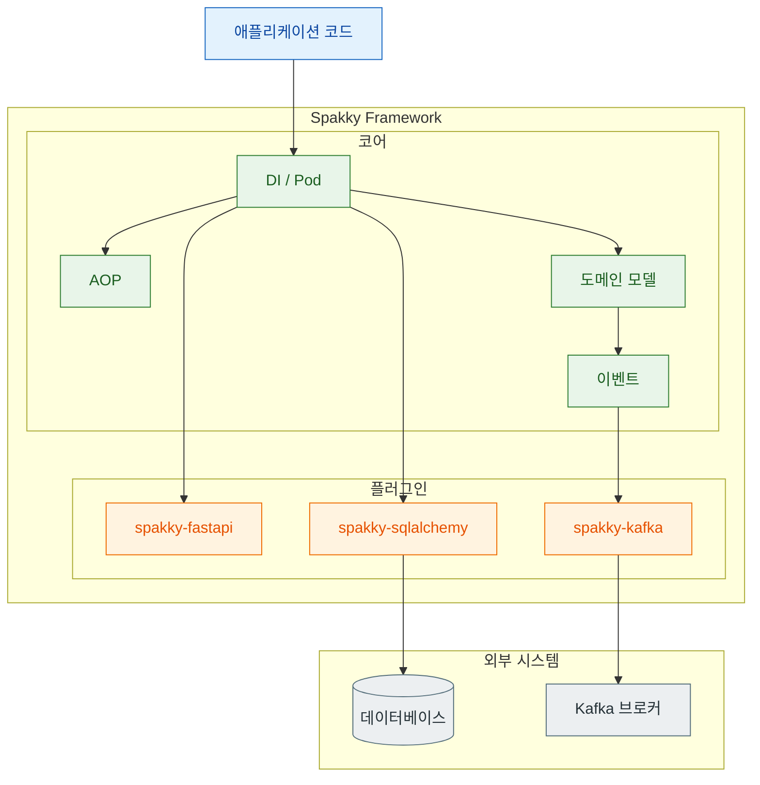
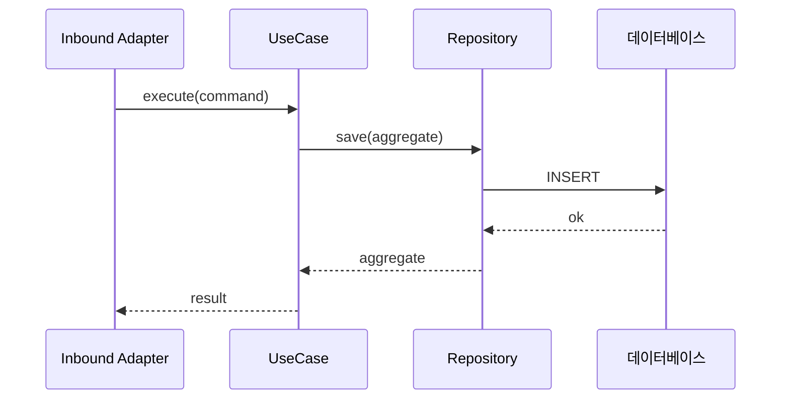

# 도식(Mermaid) 사용 표준

> Spakky 문서의 도식은 모두 [Mermaid](https://mermaid.js.org/)로 작성합니다. 이 문서는 **어떤 설명에 어떤 다이어그램을 쓰고, 어떻게 그릴지**의 표준을 정의합니다. 후속 가이드는 이 표준을 따릅니다.

문서의 도식은 글로 설명하기 어려운 **구조·흐름·관계**를 한눈에 보여 주기 위한 것입니다. 장식이 아니라 본문의 한 문단을 대신하는 그림이므로, 아래 선택 기준과 작성 규칙을 지킵니다.

## 1. 어떤 설명에 어떤 다이어그램을 쓰나

| 설명하려는 것 | 다이어그램 | 예시 상황 |
| --- | --- | --- |
| 모듈/패키지/레이어 간 **의존 방향** | `graph TD` (Top-Down flowchart) | DI 컨테이너가 Pod를 스캔해 주입하는 구조, 플러그인이 코어에 의존하는 방향 |
| 컴포넌트 간 **호출/데이터 흐름** | `graph LR` (Left-Right flowchart) | 요청이 Adapter → UseCase → Repository로 흐르는 경로 |
| 시간 순서가 있는 **상호작용** | `sequenceDiagram` | Agent 실행 루프의 모델 호출 → 도구 호출 → 승인(HITL) → 재개 |
| 객체가 거치는 **상태 전이** | `stateDiagram-v2` | Saga 단계 전이, Outbox 메시지 상태(pending → published) |
| 도메인 모델의 **구조와 관계** | `classDiagram` | Aggregate ↔ Entity ↔ Value Object 관계 |

선택이 애매하면 **의존 방향은 `graph TD`, 처리 흐름은 `graph LR`**를 기본값으로 씁니다 (`.agents/rules/mermaid.md`).

## 2. 작성 규칙

`.agents/rules/mermaid.md`의 가이드라인을 문서 도식에 그대로 적용합니다.

- **`graph TD` 기본**: 의존성 흐름은 위→아래(Top-Down)로 그립니다.
- **중첩 서브그래프**: 관련 노드를 상위 컨테이너 + 하위 카테고리로 그룹핑합니다.
- **인라인 엣지**: 서브그래프 내부 엣지는 노드 선언과 함께 인라인으로 작성합니다.
- **크로스 엣지 분리**: 서브그래프 사이를 잇는 엣지는 서브그래프 블록 **밖에** 별도로 선언합니다.
- **노드 색상 구분**: 역할(코어/플러그인/사용자 코드/외부 시스템)별로 `fill`·`stroke`·`color`를 지정합니다.

### 역할별 색상 팔레트

문서 전체에서 노드 역할을 일관된 색으로 구분합니다. 새 도식은 아래 `classDef`를 재사용합니다.

| 역할 | classDef 이름 | 색상 의미 |
| --- | --- | --- |
| 사용자 코드 (애플리케이션) | `app` | 사용자가 작성하는 비즈니스 코드 |
| 프레임워크 코어 | `core` | `spakky` 코어 컴포넌트(DI·AOP·도메인·이벤트) |
| 플러그인 | `plugin` | `spakky-*` 플러그인(FastAPI·SQLAlchemy 등) |
| 외부 시스템 | `external` | DB·브로커·LLM 등 프레임워크 밖 시스템 |

## 3. 표준 예시

아래는 코어와 플러그인, 외부 시스템을 색으로 구분하고 중첩 서브그래프로 그룹핑한 `graph TD` 예시입니다. 새 도식의 출발점으로 복사해 쓰세요.

상호작용 순서를 보일 때는 `sequenceDiagram`을 씁니다.

## 4. 체크리스트

도식을 추가하기 전에 다음을 확인합니다.

- [ ] 설명하려는 것(구조/흐름/순서/상태/관계)에 맞는 다이어그램 종류를 §1 기준으로 골랐다.
- [ ] 의존 방향 도식이면 `graph TD`로 위→아래를 지켰다.
- [ ] 노드 역할을 §2 팔레트(`app`/`core`/`plugin`/`external`)로 색 구분했다.
- [ ] 서브그래프 사이 엣지를 블록 밖에 별도 선언했다.
- [ ] 도식이 본문 문단 하나를 실제로 대신한다(장식용이 아니다).
