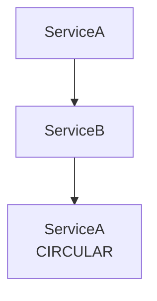

# DI/IoC 컨테이너 가이드

이 문서는 Spakky Framework의 의존성 주입(DI) 및 제어 역전(IoC) 컨테이너를 설명합니다.

---

## 개요

Spakky의 IoC 컨테이너는 `ApplicationContext`입니다. Pod의 생명주기 관리, 의존성 해결, 서비스 조정을 담당합니다.

```python
from spakky.core.application.application_context import ApplicationContext
from spakky.core.application.application import SpakkyApplication

# 직접 사용
context = ApplicationContext()
context.add(UserService)
context.start()

# SpakkyApplication을 통한 부트스트랩
app = SpakkyApplication(ApplicationContext())
app.scan().start()
```

---

## Pod 등록

### 클래스 Pod

`@Pod` 데코레이터로 클래스를 등록합니다. 생성자 파라미터가 자동으로 의존성으로 인식됩니다.

```python
from spakky.core.pod.annotations.pod import Pod

@Pod()
class UserService:
    def __init__(self, repository: UserRepository) -> None:
        self.repository = repository
```

### 함수 Pod (팩토리 메서드)

함수도 Pod로 등록할 수 있습니다. 반환 타입이 Pod의 타입이 됩니다.

```python
@Pod()
def create_connection_pool() -> ConnectionPool:
    return ConnectionPool(size=10)
```

### Configuration 패턴

`@Configuration`은 `@Pod`의 특화 스테레오타입으로, 설정 값을 그룹화하는 클래스에 사용합니다.

```python
from spakky.core.stereotype.configuration import Configuration
from pydantic_settings import BaseSettings

@Configuration()
class DatabaseConfig(BaseSettings):
    pool_size: int = 10
    connection_url: str = "postgresql://localhost/mydb"
```

> **주의**: `@Configuration` 클래스 내부 메서드에 `@Pod()`를 붙여도 자동으로 Pod이 등록되지 않습니다. 팩토리 메서드는 모듈 수준 함수로 정의하세요.

---

## Pod 스코프

Pod의 생명주기를 결정하는 세 가지 스코프가 있습니다.

### SINGLETON (기본값)

애플리케이션 전체에서 하나의 인스턴스를 공유합니다.

```python
@Pod(scope=Pod.Scope.SINGLETON)
class UserService:
    ...
```

### PROTOTYPE

요청할 때마다 새 인스턴스를 생성합니다.

```python
@Pod(scope=Pod.Scope.PROTOTYPE)
class RequestHandler:
    ...
```

### CONTEXT

요청/컨텍스트 범위 내에서 인스턴스를 공유합니다. 웹 요청 처럼 요청 단위로 상태를 격리해야 할 때 사용합니다.

```python
@Pod(scope=Pod.Scope.CONTEXT)
class RequestContext:
    user_id: UUID | None = None
```

---

## 의존성 주입 규칙

### 생성자 주입

Spakky는 **생성자 주입**만 지원합니다. 생성자 파라미터의 타입 힌트를 기반으로 의존성을 해결합니다.

```python
@Pod()
class OrderService:
    def __init__(
        self,
        user_repo: UserRepository,      # 타입으로 해결
        order_repo: OrderRepository,    # 타입으로 해결
    ) -> None:
        self.user_repo = user_repo
        self.order_repo = order_repo
```

### 제약 사항

다음은 허용되지 않습니다:

```python
# ❌ 위치 전용 인자 금지
def __init__(self, repo: Repository, /): ...

# ❌ *args, **kwargs 금지
def __init__(self, *args, **kwargs): ...

# ❌ 함수 Pod에서 Optional 반환 타입 금지
@Pod()
def create_service() -> Service | None: ...  # 에러
```

### Optional 의존성

의존성이 선택적일 경우 `| None`을 사용합니다.

```python
@Pod()
class NotificationService:
    def __init__(
        self,
        email_sender: EmailSender,
        sms_sender: SmsSender | None = None,  # 없으면 None 주입
    ) -> None:
        self.email_sender = email_sender
        self.sms_sender = sms_sender
```

---

## 의존성 해결 우선순위

단수 의존성 또는 `get(type_)` 조회에서 동일 타입의 여러 Pod 후보가 있으면
컨테이너는 다음 순서로 정확히 하나의 후보를 선택합니다.

### 1. Qualifier로 명시적 지정

`Annotated`와 `Qualifier`를 사용하여 특정 Pod를 지정합니다. Qualifier는
가장 높은 우선순위의 명시 선택 정책입니다.

```python
from typing import Annotated
from spakky.core.pod.annotations.qualifier import Qualifier

@Pod(name="cache")
class CacheUserRepository(IUserRepository):
    ...

@Pod(name="database")
class DatabaseUserRepository(IUserRepository):
    ...

@Pod()
class UserService:
    def __init__(
        self,
        repository: Annotated[IUserRepository, Qualifier(lambda p: p.name == "cache")],
    ) -> None:
        self.repository = repository
```

### 2. 명시 name 조회

`context.get(IUserRepository, name="cache")`처럼 호출자가 name을 명시하면
해당 Pod name 후보를 선택합니다. 생성자 파라미터 이름 자동 매칭은
하위 호환용 fallback이므로 이 단계에 포함되지 않습니다.

### 3. 설정 기반 binding

애플리케이션 또는 feature config가 `ApplicationContext`에 binding policy를
등록하면, 같은 interface를 구현하는 후보 중 하나를 명시적으로 선택합니다.
이 선택은 Qualifier/name보다 낮고 `@Primary`보다 높은 우선순위로 동작합니다.

```python
from spakky.core.application.application_context import ApplicationContext
from spakky.core.pod.annotations.pod import Pod
from spakky.core.pod.binding import PodBinding

class IAgentAdapter:
    def engine(self) -> str: ...

@Pod(name="langgraph")
class LangGraphAgentAdapter(IAgentAdapter):
    def engine(self) -> str:
        return "langgraph"

@Pod(name="pydantic_ai")
class PydanticAiAgentAdapter(IAgentAdapter):
    def engine(self) -> str:
        return "pydantic-ai"

context = ApplicationContext()
context.bind(PodBinding(interface=IAgentAdapter, implementation_name="pydantic_ai"))
context.add(LangGraphAgentAdapter)
context.add(PydanticAiAgentAdapter)

adapter = context.get(IAgentAdapter)  # PydanticAiAgentAdapter
```

간단한 등록에는 `context.bind_to_name(IAgentAdapter, "pydantic_ai")` 또는
`context.bind_to_type(IAgentAdapter, PydanticAiAgentAdapter)`를 사용할 수
있습니다. binding은 Pod 등록 전에도 설정할 수 있으므로 plugin 자동 활성화
모델을 유지하면서 application config에서 선택 정책을 먼저 선언할 수 있습니다.
binding이 type과 name을 동시에 지정하거나 둘 다 생략하면
`InvalidPodBindingError`가 발생합니다. 지정한 target이 후보 Pod와 일치하지
않으면 `NoSuchPodBindingTargetError`가 발생합니다.

### 4. Primary 지정

`@Primary`로 기본 선택 대상을 지정합니다.

```python
from spakky.core.pod.annotations.primary import Primary

@Pod()
@Primary()
class DefaultUserRepository(IUserRepository):
    ...

@Pod()
class CacheUserRepository(IUserRepository):
    ...

# Qualifier 없이 요청하면 Primary가 선택됨
@Pod()
class UserService:
    def __init__(self, repository: IUserRepository) -> None:
        self.repository = repository  # DefaultUserRepository
```

`@Primary` 후보가 둘 이상이면 컨테이너는 임의로 선택하지 않고
`NoUniquePodError`를 발생시킵니다.

### 5. Legacy parameter name 자동 매칭

생성자 또는 factory 함수 파라미터 이름이 Pod name과 일치하면 해당 후보를
선택합니다. 이 동작은 기존 편의를 유지하기 위한 fallback이며, Qualifier,
명시 name, binding, `@Primary`보다 낮은 우선순위입니다.

### 6. 단일 후보

타입에 해당하는 Pod가 하나뿐이면 자동 선택됩니다.

### 7. 해결 실패

- `NoSuchPodError` — 해당 타입의 Pod가 없음
- `NoUniquePodError` — 여러 후보가 있으나 구분 불가

`NoUniquePodError`는 요청 타입, 후보 Pod name/type, `@Primary` 여부,
dependency path, 해결 힌트를 구조화된 diagnostic으로 제공합니다.

### `contains(type_)` 의미

`contains(type_)`는 후보 존재 여부만 확인합니다. 후보가 둘 이상이라 단수
resolution이 모호해도, 해당 타입 후보가 하나 이상 등록되어 있으면 `True`를
반환합니다. 실제 단수 선택 가능성은 `get(type_)` 또는 의존성 주입 시점에
위 우선순위로 판정됩니다.

---

## Dependency diagnostic

누락, 순환 참조, ambiguity는 기존 예외 의미를 유지하면서 구조화된
dependency diagnostic을 함께 제공합니다. 이 진단은 별도 graph cache가
아니라 등록된 `Pod.dependencies` 메타데이터에서 실패 Pod, 파라미터,
요청 타입, 의존성 경로, 후보 Pod, 해결 힌트를 구성합니다. Adapter는
`dependency_diagnostic.as_detail_pairs()`로 안정적인 key/value 형태를 얻을
수 있습니다.

## 순환 참조 감지

컨테이너는 의존성 체인에서 순환 참조를 감지합니다.

```python
@Pod()
class ServiceA:
    def __init__(self, b: ServiceB) -> None: ...

@Pod()
class ServiceB:
    def __init__(self, a: ServiceA) -> None: ...  # 순환!
```

순환 참조 발생 시 `CircularDependencyGraphDetectedError`가 발생하며, 의존성 경로를 표시합니다:



### 해결 방법

1. **설계 재검토** — 순환 의존성은 종종 설계 문제를 나타냅니다
2. **인터페이스 분리** — 공통 인터페이스를 추출하여 의존 방향 정리
3. **이벤트 기반 통신** — 직접 참조 대신 이벤트로 통신

---

## Pod 조회

### 타입으로 조회

```python
service = context.get(UserService)
```

### 이름으로 조회

```python
repo = context.get(IUserRepository, "cache")
```

---

## Lazy 초기화

`@Lazy`로 Pod 인스턴스화를 첫 사용 시점까지 지연합니다.

```python
from spakky.core.pod.annotations.lazy import Lazy

@Pod()
@Lazy()
class ExpensiveService:
    def __init__(self) -> None:
        # 무거운 초기화 작업
        self.connection = establish_connection()
```

---

## 순서 지정

`@Order`로 PostProcessor와 Aspect의 실행 순서를 지정합니다. 숫자가 낮을수록 먼저 실행됩니다. 기본값은 `sys.maxsize`(마지막)입니다.

```python
from spakky.core.pod.annotations.order import Order
from spakky.core.pod.annotations.pod import Pod
from spakky.core.pod.interfaces.post_processor import IPostProcessor

@Order(1)
@Pod()
class FirstPostProcessor(IPostProcessor):
    def post_process(self, pod: object) -> object:
        # 가장 먼저 실행됨
        return pod

@Order(2)
@Pod()
class SecondPostProcessor(IPostProcessor):
    def post_process(self, pod: object) -> object:
        # 그 다음 실행됨
        return pod
```

> **참고**: `@Order`는 PostProcessor, Aspect 등 프레임워크 확장 포인트의 실행 순서를 제어합니다. 일반 Pod의 초기화 순서를 지정하는 데는 사용되지 않습니다.

---

## Tag로 그룹화

`Tag`를 서브클래싱하여 커스텀 메타데이터 태그를 정의합니다. 태그는 Pod와 독립적으로 등록할 수도 있습니다.

```python
from dataclasses import dataclass
from spakky.core.pod.annotations.tag import Tag
from spakky.core.pod.annotations.pod import Pod

@dataclass(eq=False)
class ValidatorTag(Tag):
    """검증기 태그"""
    category: str = ""

@ValidatorTag(category="input")
@Pod()
class EmailValidator:
    ...

@ValidatorTag(category="input")
@Pod()
class PhoneValidator:
    ...
```

태그는 `ApplicationContext`의 태그 레지스트리에서 조회합니다:

```python
# 등록된 모든 태그 조회
all_tags = context.list_tags()

# 조건으로 필터링
input_tags = context.list_tags(
    lambda t: isinstance(t, ValidatorTag) and t.category == "input"
)

# 특정 태그 존재 여부 확인
assert context.contains_tag(ValidatorTag(category="input"))
```

---

## PostProcessor

Pod 인스턴스가 생성된 후 추가 처리를 수행하는 확장 포인트입니다. PostProcessor도 `@Pod()`로 등록해야 합니다.

```python
from spakky.core.pod.annotations.pod import Pod
from spakky.core.pod.interfaces.post_processor import IPostProcessor

@Pod()
class LoggingPostProcessor(IPostProcessor):
    def post_process(self, pod: object) -> object:
        print(f"Pod created: {type(pod).__name__}")
        return pod
```

`ApplicationContext`에는 기본 PostProcessor들이 등록되어 있습니다:

- `AspectPostProcessor` — AOP 프록시 적용
- `ApplicationContextAwareProcessor` — 컨텍스트 주입
- `ServicePostProcessor` — 서비스 생명주기 관리

---

## 컴포넌트 스캔

`SpakkyApplication.scan()`으로 패키지 내 Pod를 자동 탐색합니다.

```python
from spakky.core.application.application import SpakkyApplication

app = SpakkyApplication(ApplicationContext())
app.scan()  # 호출자의 패키지 스캔
app.scan(path="myapp.services")  # 특정 패키지 스캔
app.scan(exclude={"myapp.tests"})  # 제외 패턴
```

반복 startup에서 scan discovery 결과를 재사용하려면 manifest를 명시적으로
활성화합니다. manifest는 container cache가 아니라 scan artifact이며, 입력이
바뀌거나 schema가 stale하면 fresh discovery로 돌아갑니다.

```python
from pathlib import Path

from spakky.core.application.application import SpakkyApplication
from spakky.core.application.application_context import ApplicationContext

app = (
    SpakkyApplication(ApplicationContext())
    .enable_startup_diagnostics()
    .enable_discovery_manifest(Path(".spakky/cache/discovery-manifest.json"))
    .scan(path="myapp.services")
)

scan_record = app.startup_report.records[0]
manifest_decision = scan_record.diagnostic_details[0].value
```

`manifest_decision`은 `miss`, `hit`, `stale_schema`, `stale_input` 중 하나입니다.
`hit`은 저장된 후보를 기존 등록 경로로 재생하고, `miss`와 stale decision은
새 discovery를 수행합니다. 이 기능은 actuator 엔드포인트, exporter, 또는
플러그인별 튜닝을 자동으로 제공하지 않습니다.

### 시작 진단

시작 진단은 기본적으로 비활성화되어 있으며
`enable_startup_diagnostics()`로 명시적으로 켭니다. 활성화된 앱은 하나의
시작 시도에 대한 `StartupReport`를 노출합니다.

```python
app = (
    SpakkyApplication(ApplicationContext())
    .enable_startup_diagnostics()
    .load_plugins(include=set())
    .scan(apps)
    .start()
)

for record in app.startup_report.records:
    print(record.phase_name, record.processed_count, record.status)
```

기록되는 phase는 실행 순서대로 `load_plugins`, `scan`, `registration`,
`post_processor_registration`, `instantiation`, `post_processing`,
`service_start`입니다. 각 record는 경과 시간, 처리 개수, 성공/실패 상태, 진단 상세, 실패 요약을 담습니다. 실패한 phase도 report에 남긴 뒤 기존 예외를 그대로 전파합니다.

---

## 생명주기 관리

```python
context = ApplicationContext()

# Pod 등록
context.add(UserService)
context.add(OrderService)

# 시작 - Singleton 초기화, 서비스 시작
context.start()

# 사용
service = context.get(UserService)

# 종료 - 서비스 정지, 리소스 정리
context.stop()
```
