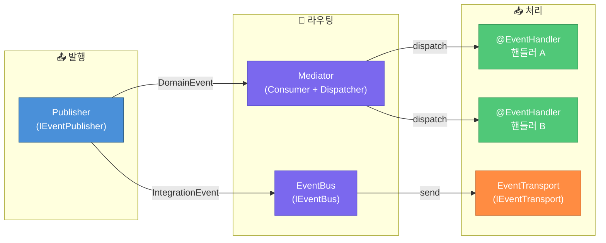

# 이벤트 시스템 가이드

이 문서는 Spakky Framework의 이벤트 시스템을 설명합니다.

---

## 개요

Spakky 이벤트 시스템은 두 가지 이벤트 타입을 지원합니다:

- **DomainEvent** — 동일 바운디드 컨텍스트 내 상태 변경 알림
- **IntegrationEvent** — 바운디드 컨텍스트 간 또는 서비스 간 통신

패키지 분리:

- `spakky-domain` — 이벤트 모델 정의 (`AbstractDomainEvent`, `AbstractIntegrationEvent`)
- `spakky-event` — 인프로세스 이벤트 처리 (Mediator, Publisher, Consumer)
- `spakky-rabbitmq`, `spakky-kafka` — 분산 이벤트 브로커 통합

---

## 이벤트 정의

### DomainEvent

동일 애플리케이션 내에서 발생하는 도메인 상태 변경을 표현합니다.

```python
from dataclasses import dataclass
from uuid import UUID
from spakky.core.common.mutability import immutable
from spakky.domain.models.event import AbstractDomainEvent

@immutable
class UserCreatedEvent(AbstractDomainEvent):
    """사용자 생성됨 도메인 이벤트"""
    user_id: UUID
    email: str
```

### IntegrationEvent

서비스 경계를 넘어 통신에 사용됩니다. RabbitMQ, Kafka 등으로 전송됩니다.

```python
from dataclasses import dataclass
from decimal import Decimal
from uuid import UUID
from spakky.core.common.mutability import immutable
from spakky.domain.models.event import AbstractIntegrationEvent

@immutable
class OrderPlacedEvent(AbstractIntegrationEvent):
    """주문 완료 통합 이벤트"""
    order_id: UUID
    customer_id: UUID
    total_amount: Decimal
```

### 이벤트 공통 속성

모든 이벤트는 다음 속성을 자동으로 가집니다:

- `event_id: UUID` — 고유 식별자 (자동 생성)
- `timestamp: datetime` — 발생 시각 (UTC, 자동 생성)
- `event_name: str` — 이벤트 클래스 이름 (property)

---

## AggregateRoot에서 이벤트 발생

AggregateRoot는 도메인 이벤트를 수집하고, 트랜잭션 커밋 시 발행합니다.

```python
from spakky.domain.models.aggregate_root import AbstractAggregateRoot
from spakky.core.common.mutability import mutable
from uuid import UUID

@mutable
class Order(AbstractAggregateRoot[UUID]):
    """주문 애그리게이트"""
    items: list[OrderItem]
    status: OrderStatus

    def place(self) -> None:
        """주문 확정"""
        self.status = OrderStatus.PLACED
        # 도메인 이벤트 추가
        self.add_event(OrderPlacedEvent(
            order_id=self.uid,
            customer_id=self.customer_id,
            total_amount=self.total_amount,
        ))

    def cancel(self, reason: str) -> None:
        """주문 취소"""
        self.status = OrderStatus.CANCELLED
        self.add_event(OrderCancelledEvent(
            order_id=self.uid,
            reason=reason,
        ))
```

### 이벤트 수집 메서드

- `add_event(event)` — 이벤트 추가
- `remove_event(event)` — 이벤트 제거
- `clear_events()` — 모든 이벤트 제거
- `events` — 현재 이벤트 목록 (읽기 전용)

---

## 인프로세스 이벤트 처리

### 아키텍처

Publisher는 이벤트 타입에 따라 라우팅합니다:



### Mediator

Consumer(핸들러 등록)와 Dispatcher(이벤트 전달) 책임을 결합한 인프로세스 구현체입니다.

```python
from spakky.event.mediator import AsyncEventMediator

# Mediator 생성 (보통 DI로 주입)
mediator = AsyncEventMediator()

# 핸들러 등록
mediator.register(UserCreatedEvent, handle_user_created)
mediator.register(UserCreatedEvent, send_welcome_email)  # 복수 핸들러 가능

# 이벤트 디스패치
await mediator.dispatch(UserCreatedEvent(user_id=uuid4(), email="user@example.com"))
```

### Publisher

Dispatcher에 위임하여 이벤트를 발행합니다. 핸들러 등록 세부사항을 몰라도 됩니다.

```python
from spakky.event.publisher import AsyncEventPublisher

# UseCase에서 Publisher 사용
@UseCase()
class CreateUserUseCase:
    def __init__(self, publisher: IAsyncEventPublisher) -> None:
        self.publisher = publisher

    async def execute(self, command: CreateUserCommand) -> User:
        user = User.create(command)
        await self.publisher.publish(UserCreatedEvent(
            user_id=user.uid,
            email=user.email,
        ))
        return user
```

---

## @EventHandler로 이벤트 처리

선언적 방식으로 이벤트 핸들러를 정의합니다.

```python
from spakky.event.stereotype.event_handler import EventHandler, on_event

@EventHandler()
class UserEventHandler:
    """사용자 관련 이벤트 핸들러"""

    def __init__(self, mailer: IMailer, analytics: IAnalytics) -> None:
        self.mailer = mailer
        self.analytics = analytics

    @on_event(UserCreatedEvent)
    async def send_welcome_email(self, event: UserCreatedEvent) -> None:
        """신규 사용자에게 환영 이메일 발송"""
        await self.mailer.send_welcome(event.email)

    @on_event(UserCreatedEvent)
    async def track_signup(self, event: UserCreatedEvent) -> None:
        """회원가입 분석 추적"""
        await self.analytics.track("signup", user_id=str(event.user_id))

    @on_event(UserDeletedEvent)
    async def cleanup_user_data(self, event: UserDeletedEvent) -> None:
        """사용자 데이터 정리"""
        await self.cleanup_service.remove_user_data(event.user_id)
```

### 핸들러 자동 등록

`@EventHandler` Pod가 등록되면, `@on_event`로 표시된 메서드가 자동으로 Consumer에 등록됩니다.

---

## 인터페이스 구조

> 설계 배경은 [ADR-0001](adr/0001-event-system-redesign.md) 참조.
> 동사 규칙은 [glossary — 동사 규칙](glossary.md#동사-규칙-verb-convention) 참조.

| 인터페이스 | 동사 | 역할 |
|-----------|------|------|
| `IEventPublisher` / `IAsyncEventPublisher` | `publish` | 단일 발행 진입점 (타입 기반 라우팅) |
| `IEventBus` / `IAsyncEventBus` | `send` | Integration Event 발행 진입점 (Outbox seam) |
| `IEventTransport` / `IAsyncEventTransport` | `send` | 실제 메시지 브로커 전송 |
| `IEventConsumer` / `IAsyncEventConsumer` | `register` | 핸들러 콜백 등록 (통합) |
| `IEventDispatcher` / `IAsyncEventDispatcher` | `dispatch` | 인프로세스 핸들러 전달 (통합) |

---

## DomainEvent vs IntegrationEvent

| 특성       | DomainEvent            | IntegrationEvent                |
| ---------- | ---------------------- | ------------------------------- |
| **범위**   | 단일 바운디드 컨텍스트 | 서비스/컨텍스트 간              |
| **전달**   | 인프로세스 (Mediator)  | 메시지 브로커 (RabbitMQ, Kafka) |
| **일관성** | 동일 트랜잭션          | 최종 일관성 (eventual)          |
| **직렬화** | 불필요                 | JSON/Protobuf 등                |
| **용도**   | 내부 도메인 로직       | 외부 시스템 통합                |

### 패턴: DomainEvent → IntegrationEvent 변환

내부 도메인 이벤트를 외부에 발행할 때 변환합니다.
핸들러가 `IAsyncEventPublisher`를 통해 IntegrationEvent를 **명시적으로** 생성합니다:

```python
@EventHandler()
class OrderEventBridge:
    """도메인 이벤트를 통합 이벤트로 변환"""

    def __init__(self, publisher: IAsyncEventPublisher) -> None:
        self.publisher = publisher

    @on_event(OrderPlacedDomainEvent)
    async def bridge_order_placed(self, event: OrderPlacedDomainEvent) -> None:
        # 도메인 이벤트를 통합 이벤트로 변환하여 발행
        await self.publisher.publish(OrderPlacedIntegrationEvent(
            order_id=event.order_id,
            customer_id=event.customer_id,
            total_amount=event.total_amount,
        ))
```

---

## Outbox 패턴

트랜잭션과 이벤트 발행의 원자성을 보장합니다.

### 문제

```python
async def place_order(self, command: PlaceOrderCommand) -> Order:
    async with transaction:
        order = Order.create(command)
        await self.repository.save(order)

    # ❌ 트랜잭션 외부에서 발행 - 실패하면 이벤트 누락
    await self.publisher.publish(OrderPlacedEvent(...))
    return order
```

### 해결: Outbox 테이블

1. 이벤트를 DB 테이블에 트랜잭션 내에서 저장
2. 백그라운드 워커가 테이블을 폴링하여 브로커에 발행
3. 발행 성공 시 테이블에서 제거

Spakky에서는 `AsyncOutboxEventBus`가 `@Primary`로 `IAsyncEventBus`를 교체하므로, 별도 코드 변경 없이 기존 `IAsyncEventPublisher.publish()` 호출이 자동으로 Outbox를 통해 저장됩니다.

```python
# UseCase 코드는 동일 — Outbox 플러그인이 투명하게 동작
@UseCase()
class PlaceOrderUseCase:
    def __init__(self, publisher: IAsyncEventPublisher) -> None:
        self.publisher = publisher

    @transactional
    async def place_order(self, command: PlaceOrderCommand) -> Order:
        order = Order.create(command)
        await self.repository.save(order)
        # AsyncOutboxEventBus가 IAsyncEventBus를 교체하여
        # 같은 트랜잭션에서 OutboxMessage로 자동 저장
        await self.publisher.publish(OrderPlacedEvent(
            order_id=order.uid,
        ))
        return order
```

---

## 분산 이벤트 브로커

### RabbitMQ (spakky-rabbitmq)

> `RabbitMQEventTransport` / `AsyncRabbitMQEventTransport` (implements `IEventTransport` / `IAsyncEventTransport`)
>
> `RabbitMQEventConsumer` / `AsyncRabbitMQEventConsumer` (implements `IEventConsumer` / `IAsyncEventConsumer`)

### Kafka (spakky-kafka)

> `KafkaEventTransport` / `AsyncKafkaEventTransport` (implements `IEventTransport` / `IAsyncEventTransport`)
>
> `KafkaEventConsumer` / `AsyncKafkaEventConsumer` (implements `IEventConsumer` / `IAsyncEventConsumer`)

Publisher 코드는 브로커에 의존하지 않습니다. `IAsyncEventPublisher.publish()`를 통해 IntegrationEvent를 발행하면, DI로 주입된 `IAsyncEventBus` → `IAsyncEventTransport` 경로로 브로커에 전송됩니다.

---

## 오류 처리

### Mediator의 핸들러 격리

인프로세스 Mediator는 핸들러 실패 시에도 나머지 핸들러를 계속 실행합니다:

```python
# 핸들러 A 실행 → 성공
# 핸들러 B 실행 → 실패 (로그 기록, 예외 전파하지 않음)
# 핸들러 C 실행 → 계속 실행됨
```

### 재시도 전략

분산 환경에서의 재시도는 메시지 브로커 수준에서 처리됩니다. RabbitMQ의 nack/requeue, Kafka의 offset 관리 등 트랜스포트 구현체가 재시도 로직을 담당합니다. 개별 핸들러에 재시도 로직을 직접 구현할 필요는 없습니다.

