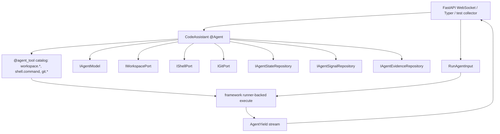

# Agent 만들기: CodeAssistant 심화 예제

> `spakky-agent`의 tool, approval, evidence, state/signal repository를 하나의 실행 흐름으로 연결하는 심화 예제입니다.

이 문서는 [AI Agent 개발](agents.md)과 [AI Agent 심화](agents-advanced.md)를 읽은
뒤 보는 실행 가능한 예제입니다. `core/spakky-agent/examples/code_assistant_demo.py`는
`CodeAssistant`가 생성자 주입으로 model, workspace, shell, git,
state/signal/evidence repository를 받고 외부 동작을 `@agent_tool`로 노출하는
선언형 흐름을 보여줍니다. `CodeAssistant`에는 `execute()` 본문이 없으며 runner는
한 provider stream의 tool candidate를 승인·dispatch하고 result/evidence/terminal을
방출합니다. Tool result 재주입이나 같은 invocation의 model 재호출은 하지 않습니다.

## 무엇을 검증하나

이 예제는 다음 요소가 하나의 execution 안에서 어떻게 이어지는지 보여줍니다.

- `@Agent CodeAssistant`와 생성자 주입
- `workspace.read`, `workspace.search`, `workspace.write`
- `shell.command`
- `git.status`, `git.diff`, `git.apply`
- `IAgentModel.stream()` 기반 provider-neutral token/tool-call stream
- 위험한 작업 앞에서 멈추는 approval wait와 `AgentSignalKind.APPROVAL_DECISION`
- 실행 중 `AgentSignalKind.USER_MESSAGE` 소비
- append-only `AgentEvidence`
- `AgentSignalKind.CANCEL`을 통한 cancellation lifecycle
- action boundary evidence를 사용한 restart/resume 계획

운영용 영속 저장소는 예제 안에 포함하지 않습니다. 실제 운영에서는 `IAgentStateRepository`, `IAgentSignalRepository`, `IAgentEvidenceRepository`를 SQLAlchemy contribution 같은 provider plugin으로 주입해야 합니다.

## 전체 구조

CodeAssistant는 "코딩 에이전트 제품"이 아니라 framework building block을 한 파일에 모은 예제입니다. 파일을 읽고, 검색하고, 쓰고, shell/git을 호출하는 기능은 모두 port 뒤에 있습니다. Agent는 port를 생성자 주입으로 받고, 각 port 동작을 `@agent_tool`로 model에게 노출합니다.



예제 파일에서 이름이 어디서 오는지 먼저 확인하세요.

| 이름 | 위치 | 역할 |
|------|------|------|
| `WorkspaceReadResult`, `WorkspaceSearchResult`, `WorkspaceWriteResult` | `code_assistant_demo.py` dataclass | workspace tool 결과 payload |
| `ShellCommandResult`, `GitCommandResult` | `code_assistant_demo.py` dataclass | shell/git tool 결과 payload |
| `IWorkspacePort`, `IShellPort`, `IGitPort` | `code_assistant_demo.py` interface | Agent가 외부 세계를 직접 import하지 않게 하는 port |
| `LocalWorkspaceAdapter`, `SubprocessShellAdapter`, `GitCliAdapter` | `code_assistant_demo.py` adapter | demo용 실제 adapter. 운영에서는 Pod로 등록해 주입합니다. |
| `StaticModel` | `code_assistant_demo.py` fake model | smoke/test에서 외부 LLM 없이 runner를 움직이는 scripted model |
| `FakeStateRepository`, `FakeSignalRepository`, `FakeEvidenceRepository` | `tests/unit/test_code_assistant_demo.py` test double | acceptance test용 in-memory repository |
| `CodeAssistantWebSocketController`, `CodeAssistantCliController` | `inbound_adapter_examples.py` | 기존 FastAPI/Typer plugin으로 Agent stream을 노출하는 adapter 예제 |

처음 따라 할 때는 세 단계를 나누면 됩니다.

1. **core demo를 읽는다**: `CodeAssistant`의 constructor와 `@agent_tool` 7개가 어떤 port를 쓰는지 확인합니다.
2. **test collector로 실행한다**: acceptance test처럼 `StaticModel` 또는 scripted `RecordingModel`, fake repository, fake workspace를 직접 넘겨 `collect_stream()`을 호출합니다.
3. **애플리케이션에 붙인다**: 실제 앱에서는 workspace/shell/git adapter와 repository provider를 `@Pod`로 등록하고, FastAPI/Typer controller가 container에서 `CodeAssistant`를 resolve합니다.

## 실행 가능한 빠른 검증

이 가이드의 예제는 `core/spakky-agent` 패키지에 실제 코드와 테스트로 들어 있습니다. 문서 흐름이 코드와 맞는지 확인하려면 패키지 디렉터리에서 acceptance test를 실행합니다.

```bash
cd core/spakky-agent
uv run pytest tests/acceptance/test_code_assistant_demo_acceptance.py -q --no-cov
```

이 테스트는 scripted `IAgentModel` stream을 사용하므로 실제 LLM provider가 없어도 실행됩니다.
테스트 double repository는 예제와 테스트를 위한 것이며, 운영 durable 실행에는
`spakky-sqlalchemy[agent]`가 제공하는 `spakky.contributions.spakky.agent`
contribution을 사용해야 합니다.

가장 작은 선언형 `@Agent` 형태는 다음 예시와 같습니다. 도구만 선언하고
`execute()`를 생략하면, 파일로 저장해 애플리케이션 scan 대상에 포함했을 때
`CodeAssistant`는 일반 UseCase처럼 container에서 resolve되고 runner가 single-pass
표준 실행을 `execute()`로 제공합니다.

아래 snippet은 핵심 모양만 보여줍니다. 실제로 실행하려면 `IWorkspacePort`와 `WorkspaceReadResult`도 같은 모듈에 정의하거나 import해야 하며, 앱에서는 `IWorkspacePort` 구현체를 `@Pod`로 등록해야 합니다.

```python
from spakky.agent import (
    Agent,
    AgentExecutionSpec,
    EvidenceCapture,
    IAgentModel,
    Idempotency,
    ToolApprovalRequirement,
    ToolEffects,
    agent_tool,
)


@Agent(spec=AgentExecutionSpec(name="code_assistant", objective="inspect a workspace"))
class CodeAssistant:
    def __init__(self, model: IAgentModel, workspace: IWorkspacePort) -> None:
        self._model = model
        self._workspace = workspace

    @agent_tool(
        schema_name="workspace.read",
        description="Read a text file from the bounded workspace.",
        effects=ToolEffects.read_only(),
        idempotency=Idempotency.IDEMPOTENT,
        evidence=EvidenceCapture.STRUCTURED,
        approval=ToolApprovalRequirement.NOT_REQUIRED,
    )
    def workspace_read(self, path: str) -> WorkspaceReadResult:
        return self._workspace.read_text(path)
```

`code_assistant_demo.py`의 CodeAssistant는 이 최소 형태에 workspace/shell/git port 도구 7종, write/shell/apply 도구의 approval, evidence repository, action boundary resume, 그리고 `@on_signal(AgentSignalKind.STEERING_INSTRUCTION)` 훅을 더한 구성입니다. 각 개념의 배경은 [AI Agent 심화](agents-advanced.md)에서 먼저 확인할 수 있습니다.

## 앱으로 조립할 때 필요한 Pod

예제는 library/test 형태라서 운영 앱의 `main.py`를 대신 만들지 않습니다. 앱으로 붙일 때는 아래 Pod들이 container에 있어야 합니다.

| Pod/interface | test에서는 | 운영 앱에서는 |
|---------------|------------|---------------|
| `IAgentModel` | `StaticModel` 또는 scripted fake를 직접 전달 | `spakky-llm`의 `LlmAgentModel` 또는 다른 model adapter |
| `IWorkspacePort` | `FakeWorkspace` | workspace root를 제한하는 `LocalWorkspaceAdapter` Pod |
| `IShellPort` | `FakeShell` | cwd를 제한하는 `SubprocessShellAdapter` Pod |
| `IGitPort` | `FakeGit` | shell port를 사용하는 `GitCliAdapter` Pod |
| `IAgentStateRepository` | `FakeStateRepository` | `spakky-sqlalchemy[agent]` contribution repository |
| `IAgentSignalRepository` | `FakeSignalRepository` | `spakky-sqlalchemy[agent]` contribution repository |
| `IAgentEvidenceRepository` | `FakeEvidenceRepository` | `spakky-sqlalchemy[agent]` contribution repository |

앱 entrypoint는 보통 다음 모양입니다. 실제 port adapter factory와 SQLAlchemy 설정은 애플리케이션 모듈에 `@Pod`로 둡니다.

```python
import spakky.agent
import spakky.plugins.fastapi
import spakky.plugins.llm
import my_code_app
from spakky.core.application.application import SpakkyApplication
from spakky.core.application.application_context import ApplicationContext

application = (
    SpakkyApplication(ApplicationContext())
    .load_plugins(
        include={
            spakky.agent.PLUGIN_NAME,
            spakky.plugins.llm.PLUGIN_NAME,
            spakky.plugins.fastapi.PLUGIN_NAME,
        }
    )
    .scan(my_code_app)
    .start()
)
```

Durable repository까지 운영 구성으로 쓰려면 `spakky-sqlalchemy` plugin과 `spakky.contributions.spakky.agent` contribution을 함께 구성합니다. 그렇지 않으면 acceptance test처럼 repository double을 명시적으로 넘기는 테스트 경로만 안전합니다.

## 구조

```python
from examples.code_assistant_demo import CodeAssistant
from spakky.agent import Agent

agent = Agent.get(CodeAssistant)

print(agent.spec.name)
print([descriptor.schema.name for descriptor in agent.tool_catalog.descriptors])
```

`CodeAssistant`는 model backend를 직접 고르지 않습니다. 생성자에 `IAgentModel`을
받으므로 테스트에서는 scripted model을, 실제 앱에서는 `spakky-llm`의
`LlmAgentModel`을 주입할 수 있습니다. 이 의존 방향 덕분에 `spakky-agent` core는
provider SDK나 SQLAlchemy를 import하지 않습니다.

## 실행 collector

예제 파일의 `collect_stream()`은 FastAPI, WebSocket, Typer 같은 inbound adapter가 할 일을 작은 함수로 축약한 것입니다. 호출 입력은 `RunAgentInput`이며, runner-backed `execute()`를 순회해 `AgentYield` stream을 모읍니다.

```python
from examples.code_assistant_demo import collect_stream
from spakky.agent import RunAgentInput

items = await collect_stream(
    model,
    workspace,
    shell,
    git,
    states,
    signals,
    evidence,
    RunAgentInput(
        state_id="run-1",
        instruction="inspect the workspace and make a small approved edit",
    ),
)
```

반환되는 item은 `AgentYield` stream입니다. inbound adapter는 `token`, `tool`, `evidence`, `approval`, `cancel`, `final`을 transport별 이벤트로 바꾸면 됩니다. 최종 `FINAL` payload는 runner가 만드는 `AgentRunResult`(state_id, status, tool_calls, evidence_count)입니다. 별도 Agent 전용 inbound adapter package는 필요하지 않습니다.

## FastAPI WebSocket / Typer adapter 예제

`core/spakky-agent/examples/inbound_adapter_examples.py`는 기존 `spakky-fastapi`와 `spakky-typer` building block으로 같은 `CodeAssistant` stream을 노출합니다. 이 파일은 애플리케이션 wiring 예제이며 `spakky-agent-fastapi`나 `spakky-agent-typer` 패키지를 만들지 않습니다.

FastAPI 쪽은 `@ApiController`와 `@websocket`을 사용합니다. 컨트롤러는 container-aware Pod로 등록되고, connection handler 안에서 `CodeAssistant`를 `@UseCase`처럼 container에서 resolve한 뒤 `execute()`를 순회합니다.

```python
from examples.inbound_adapter_examples import CodeAssistantWebSocketController

# 앱 scan 대상 모듈에 controller를 포함합니다.
# WebSocket path: /agents/code/ws
```

각 `AgentYield`는 `{"kind": ..., "payload": ...}` JSON event로 전송됩니다. runner는 approval decision을 durable signal queue에서 non-blocking으로 확인하므로, WebSocket 예제는 첫 command payload의 `signals` 배열에 사전 수신된 user message / approval decision을 넣어 큐에 append한 뒤 stream을 시작합니다.

Typer 쪽은 `@CliController("agents")`와 `@command("code")`를 사용합니다. command handler 역시 container에서 `CodeAssistant`를 resolve하고 `execute()`를 호출합니다.

```bash
python main.py agents code --state-id run-1 --instruction "inspect and edit" --read-stdin-signal
```

`token` yield는 stdout에 즉시 이어 쓰고, `progress`, `approval`, `final` 같은 구조화 event는 줄 단위로 출력합니다. `--read-stdin-signal`을 켜면 stdin JSON line들을 실행 전에 signal queue로 append합니다. 따라서 approval을 같은 run에서 통과시키려면 해당 approval decision JSON line을 미리 제공하고, 이미 `approval` event를 받은 뒤 decision을 보낸 경우에는 같은 state_id로 resume run을 시작합니다.

## Approval과 resume

읽기 도구(`workspace.read`, `workspace.search`, `git.status`, `git.diff`)는 approval 없이 진행됩니다. 쓰기 또는 side effect 도구(`workspace.write`, `shell.command`, `git.apply`)는 `plan_agent_tool_approval()` 결과에 따라 `AgentYieldKind.APPROVAL`을 먼저 내보냅니다.

approval decision은 durable signal queue에 append되어야 합니다.

```python
from spakky.agent import AgentSignal, AgentSignalKind, ApprovalDecision

signals.append(
    AgentSignal(
        id="approval:run-1:workspace.write",
        agent_state_id="run-1",
        kind=AgentSignalKind.APPROVAL_DECISION,
        payload={
            "request_id": "approval:run-1:workspace.write",
            "decision": ApprovalDecision.APPROVE.value,
        },
    )
)
```

restart 후에는 저장된 `AgentState`, pending `AgentSignal`, append-only `AgentEvidence`를 사용해 `plan_agent_resume()`이 다음 action을 결정합니다. 완료된 boundary는 `skip_completed`, incomplete idempotent boundary는 `retry`, 불확실하거나 approval wait 중인 boundary는 `require_hitl`로 정리됩니다.

## 실제 LLM 연결

Provider 연결은 core demo가 아니라 `spakky-llm` plugin이 담당합니다. 별도 설정이
없으면 공식 OpenAI SDK adapter가 `http://127.0.0.1:8000/v1`의 로컬 vLLM
OpenAI-compatible API를 사용합니다.

```python
from spakky.agent import IAgentModel
from spakky.core.application.application import SpakkyApplication
from spakky.core.application.application_context import ApplicationContext
from spakky.core.application.plugin import Plugin

app = (
    SpakkyApplication(ApplicationContext())
    .load_plugins(
        include={
            Plugin(name="spakky-agent"),
            Plugin(name="spakky-llm"),
        }
    )
    .start()
)
model = app.container.get(type_=IAgentModel)
```

`spakky-llm` 플러그인은 `LlmConfig`, OpenAI/Anthropic/Google 공식 SDK adapter,
`LlmAgentModel`을 등록하고 `IAgentModel -> LlmAgentModel` binding을 설정합니다.
이 model을 `CodeAssistant` 생성자에 주입하면 `IAgentModel.stream()`에서 provider
SDK stream이 공통 `ModelStreamEvent`로 변환되어 demo Agent에 들어옵니다. Adapter는
tool 후보를 검증할 뿐 직접 실행하지 않으며, CodeAssistant runner가 candidate
approval/dispatch와 result/evidence/terminal 방출을 담당합니다. 실행한 tool result로
모델 답변을 다시 생성해야 하는 제품 흐름은 custom `execute()`에서 다음
`ModelRequest`와 model 호출을 명시적으로 조립해야 합니다.
