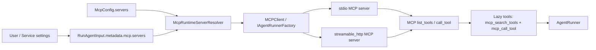

# MCP 어댑터

> `spakky-mcp`는 Agent가 외부 MCP(Model Context Protocol) 서버의 도구를 사용할 수 있게 하는 plug-and-play connector입니다. MCP 서버를 만드는 프레임워크도 아니고, Agent 도구를 MCP 서버로 내보내는 기능도 아닙니다.

`spakky-agent` core는 MCP 라이브러리에 의존하지 않습니다. `spakky-mcp`가 실행 시점에 MCP 서버 연결을 열고, 서버가 제공하는 tools를 Agent run에 붙입니다. 개발자는 서버 목록을 서비스 설정, 사용자 설정, AG-UI forwarded props, A2A data part 등 실행 경계에서 공급합니다.

## 언제 쓰는가

이미 운영 중인 MCP 서버를 에이전트가 도구처럼 호출해야 할 때 씁니다.

- 사용자가 Linear, GitHub, 검색, 사내 업무 도구 MCP 서버를 자기 계정으로 연결한다.
- 서비스가 tenant별 MCP endpoint를 저장해 두고 run마다 선택한다.
- Agent class 코드는 그대로 두고, 요청별로 쓸 MCP 서버만 바꾼다.

외부 서버는 FastMCP, 공식 MCP SDK, 사내 서버 등 어떤 방식으로 만들어도 됩니다. `spakky-mcp`는 그 서버를 받아 Agent runner에 연결합니다.



## 설치

```bash
pip install spakky-mcp
# 또는 에이전트 번들
pip install "spakky[agent]"
```

plugin 초기화는 `McpConfig`, HTTP client provider, runtime resolver, `McpClient`를 등록하고 `IAgentRunnerFactory`를 `McpClient`로 바인딩합니다. 그래서 AG-UI/A2A 같은 inbound adapter가 runner factory를 통해 실행하면 MCP 서버가 자동으로 합류합니다.

## 서버 선언

`McpConfig.servers`에는 서비스가 미리 허용한 서버를 선언합니다. `SPAKKY_MCP__` 환경변수로도 같은 값을 넣을 수 있습니다.

```bash
export SPAKKY_MCP__SERVERS='[
  {"name": "weather", "transport": "stdio", "command": "weather-mcp-server"}
]'
```

| 환경변수 | 의미 | 기본값 |
|----------|------|--------|
| `SPAKKY_MCP__SERVERS` | 외부 MCP 서버 목록(JSON 배열) | `[]` |
| `SPAKKY_MCP__CONNECT_TIMEOUT_SECONDS` | 연결 수립 타임아웃(초) | `30.0` |

서버 항목 필드:

| 필드 | 의미 |
|------|------|
| `name` | 서버 이름. 한 run 안에서 유일해야 하며 `__`를 포함할 수 없습니다. |
| `transport` | `stdio` 또는 `streamable_http` |
| `command`, `args`, `env` | `stdio` 서버 프로세스를 구동할 명령, 인자, 환경변수 |
| `url` | `streamable_http` 서버의 `http(s)` endpoint |
| `auth.headers` | HTTP 요청에 붙일 정적 headers |
| `auth.bearer_token_env` | bearer token을 읽을 환경변수 이름 |
| `auth.oauth_client_credentials` | OAuth2 client-credentials token 요청 설정 |
| `call_timeout_seconds` | MCP tool 호출 타임아웃. 기본 `60.0` |

`stdio` MCP 서버가 GitHub token을 직접 읽는다면 Spakky는 필요한 환경변수만 전달합니다.

```bash
export SPAKKY_MCP__SERVERS='[
  {
    "name": "github",
    "transport": "stdio",
    "command": "github-mcp-server",
    "env": {"GITHUB_TOKEN": "ghp_..."}
  }
]'
```

원격 HTTP MCP 서버는 bearer token이나 OAuth client-credentials를 선언할 수 있습니다.

```bash
export SPAKKY_MCP__SERVERS='[
  {
    "name": "linear",
    "transport": "streamable_http",
    "url": "https://mcp.example.com/linear",
    "auth": {"bearer_token_env": "LINEAR_MCP_TOKEN"}
  }
]'
```

사용자 consent 화면, Authorization Code/PKCE callback, refresh token 저장 정책은 애플리케이션 책임입니다. 앱은 그 결과로 얻은 access token이나 tenant MCP endpoint를 `RunAgentInput.metadata` 또는 custom resolver에 공급합니다.

## 사용자 셀프서비스 연결

사용자에게 MCP 서버 추가 UI를 제공하려면 Agent class를 바꾸지 않습니다. 사용자가 등록한 connection을 DB/vault에 저장하고, run을 시작할 때 선택된 서버를 metadata로 넘깁니다.

```python
from spakky.agent import RunAgentInput

run_input = RunAgentInput(
    state_id="run-42",
    instruction="Check the customer's open issues.",
    metadata={
        "mcp": {
            "servers": [
                {
                    "name": "tenant-linear",
                    "transport": "streamable_http",
                    "url": "https://tenant.example.com/mcp",
                    "auth": {"bearer_token": access_token},
                }
            ]
        }
    },
)
```

운영 서비스에서는 raw token을 request payload에 직접 싣지 않습니다. `RunAgentInput.metadata`는 model adapter나 로그 경계까지 전달될 수 있으므로, 실제 token은 서버의 DB/vault에 두고 `IMcpRuntimeServerResolver`가 `connection_id`를 서버 쪽에서 해석하게 만듭니다.

```python
from spakky.agent import RunAgentInput
from spakky.core.pod.annotations.pod import Pod
from spakky.plugins.mcp import IMcpRuntimeServerResolver, McpServerConfig, McpTransport


@Pod()
class UserMcpResolver(IMcpRuntimeServerResolver):
    def __init__(self, store: UserConnectionStore) -> None:
        self.store = store

    def resolve_servers(
        self,
        agent_instance: object,
        run_input: RunAgentInput | None,
    ) -> tuple[McpServerConfig, ...]:
        if run_input is None:
            return ()
        connection_ids = run_input.metadata["mcp"]["servers"]
        return tuple(
            McpServerConfig(
                name=connection.name,
                transport=McpTransport.STREAMABLE_HTTP,
                url=connection.url,
                auth=connection.auth_config(),
            )
            for connection in self.store.load_many(connection_ids)
        )
```

resolver를 앱에 등록할 때는 `spakky-mcp`가 제공하는 default binding을 서비스 binding으로 교체합니다.

```python
from spakky.core.application.application import SpakkyApplication
from spakky.core.application.plugin import Plugin
from spakky.plugins.mcp import IMcpRuntimeServerResolver


PLUGIN_NAME = Plugin(name="my-mcp-connections")


def initialize(app: SpakkyApplication) -> None:
    app.add(UserMcpResolver)
    app.container.bind_to_type(IMcpRuntimeServerResolver, UserMcpResolver)
```

이 패턴을 쓰면 browser payload에는 `connection_id` 같은 안정적인 식별자만 두고, 실제 endpoint와 OAuth token은 서버의 DB/vault에서만 읽습니다.

브라우저 사용자가 임의의 `stdio command`를 등록하게 두는 것은 원격 코드 실행 표면이 됩니다. 셀프서비스는 보통 `streamable_http` endpoint 중심으로 열고, `stdio`는 신뢰된 관리자 설정으로 제한합니다.

## 실행 시점 선택

`RunAgentInput.metadata["mcp"]["servers"]`의 각 항목은 두 형태 중 하나입니다.

| 형태 | 의미 |
|------|------|
| 문자열 | `McpConfig.servers`에 미리 선언된 서버 이름 |
| object | run에만 쓰는 inline `McpServerConfig` 선언 |

```python
RunAgentInput(
    state_id="run-2",
    instruction="inspect issue status",
    metadata={
        "mcp": {
            "servers": [
                "github",
                {
                    "name": "tenant-search",
                    "transport": "streamable_http",
                    "url": "https://tenant.example.com/mcp",
                    "auth": {"bearer_token_env": "TENANT_MCP_TOKEN"},
                },
            ]
        }
    },
)
```

`metadata["mcp"]["servers"]`를 생략하면 configured MCP server 전체를 연결합니다. 같은 run 안에서 같은 서버 이름이 두 번 나오거나 inline server가 configured server 이름을 shadow하면 `McpServerConfigurationError`로 실패합니다.

AG-UI에서는 `forwardedProps.mcp`, A2A에서는 data part의 `mcp` object가 같은 metadata로 변환됩니다.

## Lazy tool 탐색

MCP 서버는 도구가 많을 수 있습니다. 모든 MCP tool schema를 모델 요청에 곧바로 넣으면 context 오염과 비용 증가가 생깁니다. `spakky-mcp`는 pydantic-ai의 deferred MCP toolset 패턴처럼 기본적으로 lazy catalog를 씁니다.

모델이 처음부터 보는 MCP 관련 도구는 두 개뿐입니다.

| 도구 | 용도 |
|------|------|
| `mcp_search_tools` | 현재 run에 연결된 MCP 서버의 tool 목록을 검색합니다. |
| `mcp_call_tool` | 검색 결과에서 고른 tool을 이름과 arguments로 호출합니다. |

실제 외부 tool 이름은 검색 결과 안에서만 나타납니다. 이름은 `<server_name>__<tool_name>` 형태입니다. 예를 들어 `weather` 서버의 `forecast` tool은 검색 결과에서 `weather__forecast`로 보입니다.

```json
{
  "tools": [
    {
      "name": "weather__forecast",
      "description": "Return a forecast.",
      "input_schema": {
        "type": "object",
        "properties": {"city": {"type": "string"}}
      }
    }
  ],
  "count": 1,
  "total": 1
}
```

호출은 다음 모양입니다.

```json
{
  "tool_name": "weather__forecast",
  "arguments": {"city": "Seoul"}
}
```

이 구조 때문에 서버가 100개 tool을 제공해도 최초 model request에는 `mcp_search_tools`, `mcp_call_tool`만 들어갑니다. 필요한 tool schema는 검색 결과로만 좁혀서 들어갑니다.
`mcp_call_tool`이 HITL approval 후보가 되면 approval prompt와 `action_ref`는 meta-tool 이름이 아니라 선택된 외부 tool 이름을 기준으로 만들어지고, approval metadata에는 `mcp_tool_name`과 `mcp_arguments`가 포함됩니다.

## 동작 원리

`McpClient.open_runner()`는 run마다 다음 순서로 동작합니다.

1. `IMcpRuntimeServerResolver`가 configured 이름과 inline 선언을 `McpServerConfig` 목록으로 해석합니다.
2. 각 서버 transport session을 열고 MCP `initialize`와 `list_tools()`를 수행합니다.
3. 발견된 tool을 세션 내부 descriptor registry에 보관합니다.
4. Agent catalog에는 `mcp_search_tools`, `mcp_call_tool`만 병합합니다.
5. `mcp_call_tool`이 호출되면 registry에서 실제 descriptor를 찾아 MCP `call_tool`로 전달합니다. approval이 필요하면 선택된 외부 tool 이름과 arguments를 approval request에 싣습니다.
6. runner context가 닫히면 모든 MCP session을 닫습니다.

외부 tool 결과는 `structuredContent`가 있으면 그대로, 없으면 텍스트 콘텐츠를 모아 JSON 값으로 정규화합니다. 서버가 오류 결과(`isError`)를 반환하거나 연결·디스커버리·호출이 실패하면 `McpTransportError`, `McpToolDiscoveryError`, `McpToolInvocationError` 등 타입화된 오류로 표면화됩니다.

## 함께 보기

- [AI Agent 개발](agents.md)
- [AI Agent 심화](agents-advanced.md)
- [spakky-mcp API Reference](../api/plugins/spakky-mcp.md)
- [spakky-agent API Reference](../api/core/spakky-agent.md)
