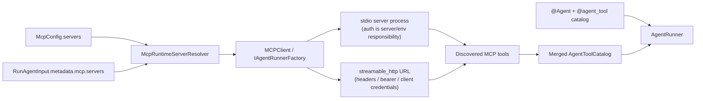

# MCP 어댑터 (클라이언트·서버)

> MCP(Model Context Protocol) 양방향 어댑터 가이드입니다. **클라이언트** 방향은 외부 MCP 서버의 도구를 선언형 Agent의 도구 카탈로그에 합류시키고, **서버** 방향은 Agent의 `@agent_tool` 도구를 MCP 서버로 노출해 외부 MCP 클라이언트가 발견·호출하게 합니다.

`spakky-mcp` 플러그인은 [ADR-0013](../adr/0013-declarative-agent-loop-ownership.md) §2의 결정에 따라 프로토콜 중립 코어(`spakky-agent`) 밖에 위치하는 독립 어댑터입니다. 코어는 MCP 라이브러리에 의존하지 않으며, 외부 도구 정규화·연결 수명주기와 도구의 MCP 서버 노출은 이 플러그인이 전담합니다.

> 아래 "클라이언트" 절은 외부 도구를 끌어오는 방향이고, "서버" 절은 자신의 도구를 내보내는 방향입니다.

## 클라이언트: 외부 도구 끌어오기

### 언제 쓰는가

이미 운영 중인 외부 MCP 서버(파일 시스템, 검색, 사내 도구 서버 등)의 도구를 에이전트가 일반 도구처럼 사용하고 싶을 때 씁니다. 외부 서버는 사용자나 3rd-party가 FastMCP, 공식 MCP SDK, 사내 서버 등 원하는 방식으로 만들면 됩니다. `spakky-mcp`는 그 서버를 만드는 프레임워크가 아니라, 서버 연결을 열고 발견된 tools를 Spakky Agent tool catalog에 합류시키는 connector입니다.

이 플러그인은 **도구 공급원**일 뿐 모델 어댑터가 아닙니다. 실행에는 별도의 `IAgentModel` 공급자(예: `spakky-vllm`)가 필요합니다.

외부 서버 선택은 Agent class annotation에 굽지 않습니다. 서비스 설정이나 사용자 설정이 `RunAgentInput.metadata["mcp"]["servers"]`에 서버 이름 또는 inline 서버 선언을 넣고, `MCPClient`가 run마다 그 값을 해석합니다. pydantic-ai의 `Agent(..., toolsets=[MCPToolset(...)])`처럼 toolset은 Agent class 자체가 아니라 조립/실행 경계에서 선택합니다.

인증 경계도 분리되어 있습니다. `spakky-mcp`는 MCP transport에 필요한 HTTP client를 구성할 수 있지만, 3rd-party 사용자 consent 화면, Authorization Code/PKCE callback, 장기 refresh-token 저장 정책은 애플리케이션 책임입니다.

| 서버 형태 | 인증 방식 |
|-----------|-----------|
| `stdio` MCP 서버 | 서버 프로세스가 자체적으로 읽는 환경변수나 credential store를 `env`/실행 환경으로 전달합니다. |
| `streamable_http` MCP 서버 | `auth.headers`, `auth.bearer_token_env`, `auth.oauth_client_credentials`로 HTTP header 또는 OAuth client-credentials token을 구성합니다. Authorization Code/PKCE는 custom `IMcpHttpClientProvider`로 확장합니다. |

즉 "MCP를 붙이면 모든 3rd-party OAuth가 자동으로 끝난다"가 아니라, **서비스가 준비한 MCP server endpoint/process를 Agent run에 plug-and-play로 합류시킨다**가 기능입니다.



## 설치

```bash
pip install spakky-mcp
# 또는 에이전트 번들로
pip install "spakky[agent]"
```

plugin 초기화는 `MCPConfig`, `MCPClient`, `MCPToolServerRegistry`, `MCPToolServer`, MCP post-processor를 등록합니다. 또한 `IAgentRunnerFactory`를 `MCPClient`로 바인딩하므로 AG-UI/A2A 같은 inbound adapter가 runner factory를 통해 실행할 때 외부 도구가 자동으로 합류합니다.

## 외부 서버 선언

외부 서버는 `SPAKKY_MCP__` 접두사 환경변수 또는 `MCPConfig`로 선언합니다. `transport`는 `stdio`(하위 프로세스로 서버 구동)와 `streamable_http`(원격 HTTP 서버)를 지원합니다.

```bash
# stdio 서버 1개를 JSON 배열로 선언
export SPAKKY_MCP__SERVERS='[{"name": "weather", "command": "weather-mcp-server"}]'
```

| 환경변수 | 의미 | 기본값 |
|----------|------|--------|
| `SPAKKY_MCP__SERVERS` | 외부 MCP 서버 목록(JSON 배열) | `[]` |
| `SPAKKY_MCP__CONNECT_TIMEOUT_SECONDS` | 연결 수립 타임아웃(초) | `30.0` |

서버 항목 필드:

| 필드 | 의미 |
|------|------|
| `name` | 서버 이름. configured server와 runtime inline server 전체에서 유일해야 하며, 도구 이름 충돌을 막는 접두사로 쓰입니다. `__`를 포함할 수 없습니다. |
| `transport` | `stdio`(기본) 또는 `streamable_http` |
| `command`, `args`, `env` | `stdio` 전송에서 서버를 구동할 명령·인자·환경변수 |
| `url` | `streamable_http` 전송에서 서버의 http(s) 엔드포인트 |
| `auth.headers` | `streamable_http` 요청에 붙일 정적 HTTP headers |
| `auth.bearer_token_env` | bearer token을 읽을 환경변수 이름 |
| `auth.oauth_client_credentials` | OAuth2 client-credentials token 요청 설정 |
| `call_timeout_seconds` | 도구 호출 타임아웃(초). 기본 `60.0` |

예를 들어 인증 토큰을 환경변수로 읽는 stdio MCP 서버는 다음처럼 선언합니다. 이 토큰을 해석하고 3rd-party API에 OAuth/Bearer 요청을 보내는 책임은 해당 MCP 서버에 있습니다.

```bash
export SPAKKY_MCP__SERVERS='[
  {
    "name": "github",
    "transport": "stdio",
    "command": "github-mcp-server",
    "env": {"GITHUB_TOKEN": "ghp_..."}
  }
]'
```

원격 HTTP MCP 서버가 bearer token을 요구하면 다음처럼 선언합니다.

```bash
export SPAKKY_MCP__SERVERS='[
  {
    "name": "linear",
    "transport": "streamable_http",
    "url": "https://mcp.example.com/linear",
    "auth": {"bearer_token_env": "LINEAR_MCP_TOKEN"}
  }
]'
```

OAuth client-credentials가 필요한 서버는 token endpoint와 client credential source를 선언합니다.

```bash
export SPAKKY_MCP__SERVERS='[
  {
    "name": "internal",
    "transport": "streamable_http",
    "url": "https://mcp.example.com/internal",
    "auth": {
      "oauth_client_credentials": {
        "token_url": "https://auth.example.com/oauth/token",
        "client_id_env": "MCP_CLIENT_ID",
        "client_secret_env": "MCP_CLIENT_SECRET",
        "scopes": ["mcp:tools"]
      }
    }
  }
]'
```

## 도구 이름 접두사

여러 서버가 같은 이름의 도구를 노출해도 충돌하지 않도록, 모델이 보는 도구 이름은 `<서버이름>__<도구이름>` 형태로 접두사가 붙습니다. 예를 들어 `weather` 서버의 `forecast` 도구는 카탈로그에 `weather__forecast`로 등록됩니다. 서버 이름 자체는 전역 유일해야 합니다. 같은 `name`을 두 번 선언하거나 runtime `servers` 배열에서 같은 이름을 두 번 선택하면 어떤 credential/server가 선택되는지 모호해지므로 `McpServerConfigurationError`로 실패합니다.

## 에이전트에 합류시키기

외부 MCP tool은 `IAgentRunnerFactory` 경로로 합류합니다. `spakky-mcp`가 로드되면 이 port가
`MCPClient`에 바인딩되고, inbound adapter가 agent run마다 factory context를 열 때 외부 서버에
연결해 도구를 발견합니다. 외부 서버 세션은 runner context 동안 유지되며 context를 벗어나면
정리됩니다.

```python
from spakky.agent import IAgentRunnerFactory, RunAgentInput


async def custom_inbound_boundary(
    factory: IAgentRunnerFactory,
    agent: WeatherAgent,
) -> None:
    run_input = RunAgentInput(
        state_id="run-1",
        instruction="answer with external tools",
        metadata={"mcp": {"servers": ["weather"]}},
    )
    async with factory.open_runner(agent, run_input=run_input) as runner:
        async for item in runner.run(run_input):
            ...
```

`servers` 배열의 각 항목은 `McpConfig.servers`에 선언된 서버 이름이거나 inline 서버 선언입니다. `metadata["mcp"]["servers"]`를 생략하면 configured MCP server 전체를 연결합니다. Runtime inline 선언의 `name`도 configured server와 같은 namespace를 공유하므로 한 run 안에서 중복될 수 없습니다.

```python
RunAgentInput(
    state_id="run-2",
    instruction="inspect issue status",
    metadata={
        "mcp": {
            "servers": [
                "github",
                {
                    "name": "tenant-search",
                    "transport": "streamable_http",
                    "url": "https://tenant.example.com/mcp",
                    "auth": {"bearer_token_env": "TENANT_MCP_TOKEN"},
                },
            ]
        }
    },
)
```

AG-UI에서는 `forwardedProps.mcp`, A2A에서는 data part의 `mcp` object가 같은 metadata로 변환됩니다. 예를 들어 AG-UI client는 `forwardedProps: {"mcp": {"servers": ["github"]}}`를 보낼 수 있습니다.

## 동작 원리: 소유자 없는(owner-less) 도구

발견된 외부 도구는 소유 클래스가 없는 `AgentToolDescriptor`로 정규화됩니다. 이 디스크립터의 호출 대상은 첫 인자가 `self`/`cls`가 아닌 비동기 콜러블이라, `AgentToolDispatcher`가 인스턴스를 바인딩하지 않고 모델이 전달한 인자만 그대로 외부 서버 `call_tool`로 넘깁니다. 그 결과 외부 도구는 `@agent_tool` 메서드와 **단일 디스패치 경로**를 공유합니다.

외부 도구는 네트워크 외부 부수효과(external side-effect)로 표시되어, 프레임워크의 HITL(Human-In-The-Loop) 승인 판정에서 승인 후보로 분류됩니다.

## 안전 경계

- 외부 도구 결과는 구조화 콘텐츠(`structuredContent`)가 있으면 그대로, 없으면 텍스트 콘텐츠를 모아 JSON 값으로 정규화합니다.
- 서버가 오류 결과(`isError`)를 반환하거나 연결·디스커버리·호출이 실패하면 `McpTransportError`·`McpToolDiscoveryError`·`McpToolInvocationError` 등 타입화된 오류로 표면화됩니다.
- 외부 도구 이름이 기존 카탈로그 도구와 충돌하면 `McpCatalogMergeError`로 거부됩니다.

## 서버: 자신의 도구 내보내기

반대 방향으로, Agent가 선언한 `@agent_tool` 도구를 MCP 서버로 노출하면 외부 MCP 클라이언트가 표준 MCP 프로토콜로 그 도구들을 발견·호출할 수 있습니다. 노출된 각 도구는 모델이 보는 것과 같은 디스패치 경로(`AgentToolDispatcher`)로 실행되므로, 원격 클라이언트의 호출은 로컬 모델의 도구 호출과 동일하게 동작합니다.

### 서버 만들기

MCP server는 agent가 아니라 MCP protocol host입니다. `@MCPServer`는 `@Agent` 자체를
서버라고 부르는 annotation이 아니라, 그 Agent의 `@agent_tool` 카탈로그를 MCP server에
연결하겠다는 marker입니다.

```python
from spakky.agent import Agent, AgentExecutionSpec, agent_tool
from spakky.plugins.mcp import MCPServer


@MCPServer(server_name="weather-agent")
@Agent(spec=AgentExecutionSpec(name="weather"))
class WeatherAgent:
    @agent_tool(schema_name="forecast", description="Return a forecast.")
    def forecast(self, city: str) -> str:
        return f"sunny:{city}"
```

`MCPToolServer` Pod는 registry에서 agent를 resolve하므로 host entrypoint는 agent instance를 직접 넘기지 않습니다.

```python
from spakky.plugins.mcp import MCPToolServer


async def expose(server: MCPToolServer) -> None:
    await server.serve_stdio_for("weather")
```

### 전송 선택

| 전송 | 진입점 | 용도 |
|------|--------|------|
| `stdio` | `MCPToolServer.serve_stdio_for(agent_name)` | 클라이언트가 하위 프로세스로 서버를 구동 |
| `streamable_http` | `MCPToolServer.streamable_http_session_manager_for(agent_name)` | 원격 HTTP 노출 — 반환된 세션 매니저를 호스트 애플리케이션의 lifespan에서 구동하고 인바운드 요청을 `handle_request`로 라우팅 |

`streamable_http` 세션 매니저는 자신의 `run()` 컨텍스트 동안 단일 task group을 소유하며 컨텍스트를 벗어나면 재사용할 수 없습니다 — 호스트 애플리케이션 lifespan에서 1회 구동합니다.

`build_agent_tool_server(agent_instance, server_name)`, `serve_stdio(server)`,
`streamable_http_session_manager(server)`는 특수 host와 테스트를 위한 lower-level API입니다.

### 서버 노출 설정

| 환경변수 | 의미 | 기본값 |
|----------|------|--------|
| `SPAKKY_MCP__TOOL_SERVER__NAME` | MCP 핸드셰이크에서 광고할 서버 이름 | `spakky-agent` |
| `SPAKKY_MCP__TOOL_SERVER__TRANSPORT` | 설정 모델에 보존되는 전송 의도 값. 실제 전송은 host entrypoint가 `serve_stdio_for()` 또는 `streamable_http_session_manager_for()` 호출로 선택 | `stdio` |

### 결과 변환

도구 디스패치 결과는 MCP의 `content`(사람이 읽는 텍스트)와 `structuredContent`(기계가 읽는 JSON)로 변환됩니다. 매핑(`dict`) 결과는 그대로 구조화 콘텐츠가 되고, 그 외 값은 `{"result": ...}` 형태로 감싸집니다 — 이는 클라이언트 방향의 결과 정규화(`normalize_call_result`)가 읽어 들이는 형태와 대칭입니다. 디스패치가 실패하면 `McpToolExposureError`로 표면화되어 SDK가 원격 클라이언트에 도구 오류로 보고합니다.

## 함께 보기

- [AI Agent 개발](agents.md)
- [AI Agent 심화](agents-advanced.md)
- [spakky-mcp API Reference](../api/plugins/spakky-mcp.md)
- [spakky-agent API Reference](../api/core/spakky-agent.md)
- [ADR-0013: 선언형 Agent](../adr/0013-declarative-agent-loop-ownership.md)
