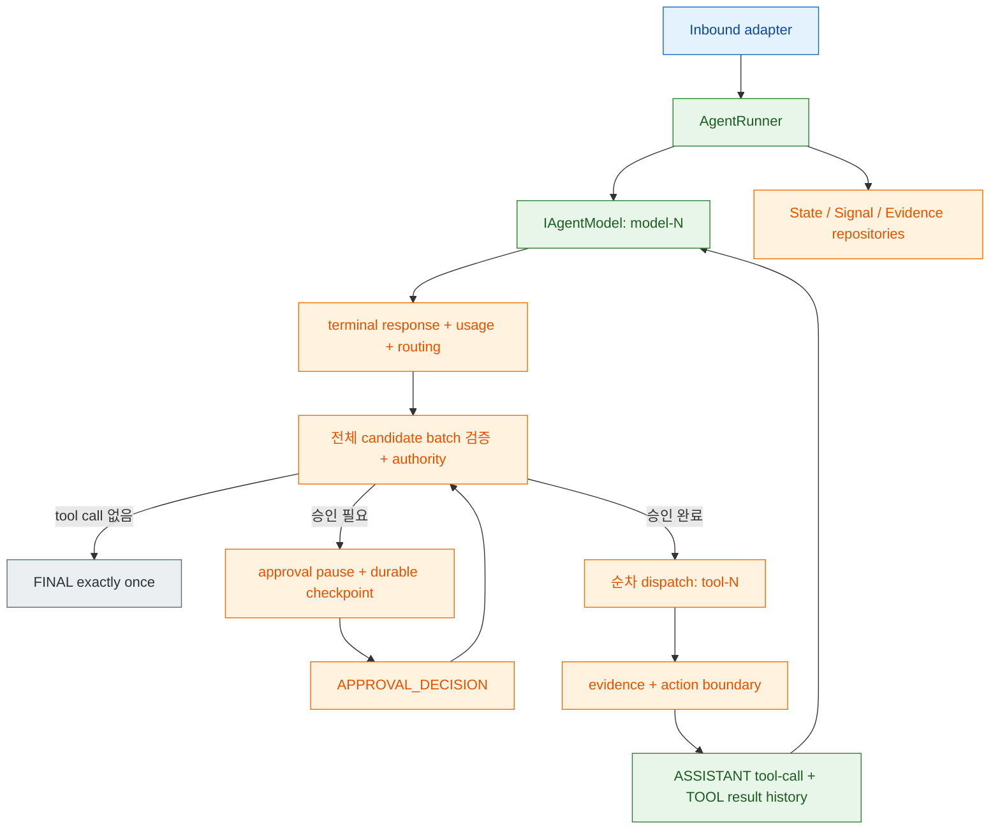
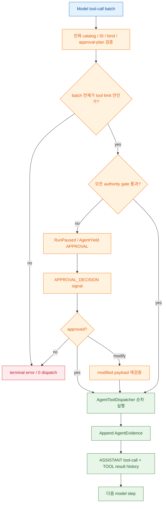
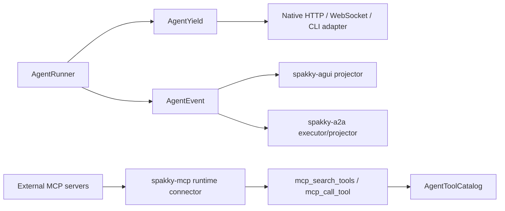

# AI Agent 심화

> `spakky-agent`의 tool catalog, approval, `@on_signal` 선언형 훅, context compaction, teammate, durable execution, `AgentEvent` stream, protocol adapter 연동을 다룹니다.

이 문서는 [AI Agent 개발](agents.md)을 읽은 뒤 보는 심화 가이드입니다. 여기서는 작은 Agent를 운영형 Agent로 확장할 때 필요한 선택지를 정리합니다.

기초 문서가 "무엇을 작성해야 실행되는가"를 다룬다면, 이 문서는 "왜 그렇게 나뉘어 있고 어떤 경계가 원리를 지키는가"를 다룹니다. 세 가지 원칙이 전체 설계를 묶습니다.

1. Runner가 bounded iterative orchestration을 소유하고, Agent class는 선언을 소유합니다.
2. 위험한 side effect는 approval/evidence/action boundary 뒤에서만 실행됩니다.
3. 외부 protocol은 core event를 재해석하지 않고 `AgentEvent`를 각 wire event로 투영합니다.

## 원리: 선언은 Agent, iterative 실행은 Runner

Runner-backed Agent에서 개발자는 표준 배관을 직접 쓰지 않습니다. `@Agent` spec,
`@agent_tool`, `@on_signal`, 생성자 주입 port를 선언하면 runner가 model/tool loop,
whole-batch validation과 authority, signal polling, evidence, checkpoint, terminal
uniqueness를 집행합니다.



이 구조의 이점은 표준 실행 정책이 한 곳에 있다는 점입니다. Approval, signal
polling, evidence append, recovery, compaction을 각 Agent가 제각각 구현하지 않고
runner가 일관되게 적용합니다. Runner는 model이 낸 assistant tool-call turn과 실제
`TOOL` result를 provider-neutral history에 추가하고, 같은 invocation의 다음 model
step을 호출합니다. Tool call이 없는 valid terminal step에서만 public final을 한 번
방출합니다.

## 원리: 도구 호출은 계약, side effect는 경계

`@agent_tool`은 "함수를 모델에게 보여준다"만 의미하지 않습니다. Python signature는 입력 schema가 되고, metadata는 approval/evidence/retry 판단의 근거가 됩니다.



읽기 tool은 `ToolEffects.read_only()`와 `approval=NOT_REQUIRED`로 의도를 분명히 합니다. 쓰기, shell, 외부 API, patch 적용처럼 상태를 바꾸는 tool은 approval을 명시하거나 기본 `DERIVED` 판정에 맡깁니다. Evidence는 append-only라서 나중에 resume/retry를 판단할 때 "무엇을 이미 실행했는가"를 재구성할 수 있습니다.

## 원리: Protocol adapter는 투영 계층

Core runner는 AG-UI, A2A, MCP를 직접 알지 않습니다. AG-UI와 A2A는 `AgentRunner.run_events()`의 protocol-neutral `AgentEvent`를 각 protocol event로 바꿉니다. MCP는 다릅니다. MCP는 실행 event stream adapter가 아니라 **tool adapter**입니다.



따라서 직접 protocol adapter를 만들 때는 `AgentYield`를 AG-UI/A2A event로 억지 변환하지 말고 `run_events()`를 사용합니다. 반대로 MCP를 붙일 때는 "실행 stream을 노출한다"가 아니라 "run마다 선택된 외부 MCP 서버를 Agent tool catalog에 lazy search/call 도구로 합류시킨다"로 이해해야 합니다.

## Tool 설계

Tool은 모델이 호출할 수 있는 애플리케이션 기능입니다. `@agent_tool`은 Python method의 signature를 읽어 schema를 만들고, risk, approval, evidence, idempotency metadata를 함께 보관합니다.

읽기 tool은 approval 없이 실행할 수 있도록 명시합니다.

```python
from abc import ABC, abstractmethod
from dataclasses import dataclass

from spakky.agent import (
    Agent,
    AgentExecutionSpec,
    EvidenceCapture,
    IAgentModel,
    Idempotency,
    ToolApprovalRequirement,
    ToolEffects,
    agent_tool,
)


@dataclass(frozen=True, slots=True)
class WorkspaceReadResult:
    path: str
    content: str


class IWorkspacePort(ABC):
    @abstractmethod
    def read_text(self, path: str) -> WorkspaceReadResult:
        ...

    @abstractmethod
    def write_text(self, path: str, content: str) -> "WorkspaceWriteResult":
        ...


@Agent(spec=AgentExecutionSpec(name="code_assistant", objective="inspect files"))
class CodeAssistant:
    def __init__(self, model: IAgentModel, workspace: IWorkspacePort) -> None:
        self._model = model
        self._workspace = workspace

    @agent_tool(
        schema_name="workspace.read",
        description="Read a text file from the bounded workspace.",
        effects=ToolEffects.read_only(),
        idempotency=Idempotency.IDEMPOTENT,
        evidence=EvidenceCapture.STRUCTURED,
        approval=ToolApprovalRequirement.NOT_REQUIRED,
    )
    def workspace_read(self, path: str) -> WorkspaceReadResult:
        return self._workspace.read_text(path)
```

쓰기 tool은 state를 바꾸므로 approval 후보가 됩니다.

```python
@dataclass(frozen=True, slots=True)
class WorkspaceWriteResult:
    path: str
    bytes_written: int


@agent_tool(
    schema_name="workspace.write",
    description="Write a text file in the bounded workspace.",
    effects=ToolEffects.write_state(),
    idempotency=Idempotency.CONDITIONALLY_IDEMPOTENT,
    evidence=EvidenceCapture.STRUCTURED,
)
def workspace_write(self, path: str, content: str) -> WorkspaceWriteResult:
    return self._workspace.write_text(path, content)
```

`approval`을 생략하면 기본값은 `DERIVED`입니다. `ToolEffects.write_state()`, `external_side_effect()`, `destructive_action()`처럼 side effect가 있는 tool은 approval candidate가 됩니다.

| tool 종류 | 권장 metadata |
|-----------|---------------|
| 파일 읽기, 검색, git status/diff | `ToolEffects.read_only()`, `Idempotency.IDEMPOTENT`, `approval=NOT_REQUIRED` |
| 파일 쓰기, local state 변경 | `ToolEffects.write_state()`, `Idempotency.CONDITIONALLY_IDEMPOTENT` |
| shell command, 외부 API 호출 | `ToolEffects.external_side_effect()`, `Idempotency.NON_IDEMPOTENT` |
| patch 적용, 삭제, 되돌리기 어려운 변경 | `ToolEffects.destructive_action()` |
| 모델에게 raw output을 보내면 위험한 결과 | `evidence=SUMMARY` 또는 `evidence=REDACTED` |
| audit trail에 구조화 결과가 필요한 경우 | `evidence=STRUCTURED` |

`@agent_tool` signature는 schema의 정본입니다. Parameter와 return type은 annotation해야 합니다. `*args`, `**kwargs`, positional-only parameter, JSON schema로 표현할 수 없는 임의 object는 definition 단계에서 실패합니다.

## Tool catalog를 모델 요청에 넣기

`@Agent` metadata에는 발견된 tool catalog가 들어 있습니다.

재사용 가능한 tool component는 `IAgentToolProvider`를 구현해 Agent constructor에 주입할 수
있습니다. Runner는 provider instance의 `self`/`cls` method에 descriptor를 bind한 뒤 해당
run의 catalog에 합치며 shared `@Agent` metadata는 mutate하지 않습니다. Descriptor owner가
provider instance와 다르거나 이미 bound된 callable을 주거나 schema name이 기존 tool과
겹치면 model request 전에 `AgentDefinitionError`로 fail closed합니다. `RetrievalTool`이 이
경계를 사용하는 기본 provider입니다.

```python
from spakky.agent import Agent

agent_metadata = Agent.get(CodeAssistant)
for descriptor in agent_metadata.tool_catalog.descriptors:
    print(descriptor.schema.name, descriptor.description)
```

Model request에 tool schema를 넣을 때는 descriptor를 `ModelToolSpec`으로 변환합니다.

```python
from spakky.agent import (
    Agent,
    JsonSchemaConstraint,
    ModelMessage,
    ModelMessageRole,
    ModelRequest,
    ModelToolChoice,
    ModelToolSpec,
    ToolCallingSpec,
)

tools = tuple(
    ModelToolSpec(
        name=descriptor.schema.name,
        description=descriptor.description,
        parameters=JsonSchemaConstraint(schema=descriptor.schema.input_schema),
        metadata={"tool_identity": descriptor.identity.key},
    )
    for descriptor in Agent.get(CodeAssistant).tool_catalog.descriptors
)

request = ModelRequest(
    messages=(ModelMessage(ModelMessageRole.USER, instruction),),
    tool_calling=ToolCallingSpec(tools=tools, choice=ModelToolChoice.AUTO),
)
```

Model adapter가 `ModelStreamEventKind.TOOL_CALL_CANDIDATE` batch를 내보내면 **runner가**
다음 순서를 자동으로 수행합니다.

1. Provider call ID를 nonblank·unique 값으로 정규화합니다. Missing ID는
   `{state_id}:model-{N}:call-{index}`로 만듭니다.
2. Batch의 모든 call에 대해 catalog lookup, Python signature bind, approval plan과
   arguments digest를 검증합니다.
3. Batch 전체를 추가해도 `max_tool_calls`를 넘지 않는지 확인합니다.
4. 모든 approval/authority gate를 통과시킵니다. 하나라도 invalid이면 실제 tool은 0개
   dispatch됩니다.
5. Authority가 모두 열린 뒤 선언 순서대로 `AgentToolDispatcher`를 호출합니다.
6. 각 성공 result를 append-only evidence와 `TOOL` message로 commit합니다.
7. 전체 batch가 끝나면 assistant tool-call turn과 모든 `TOOL` result를 담은 다음
   `ModelRequest`를 실행합니다.

Provider stream이 fine-grained `TOOL_CALL_START`/`TOOL_CALL_END` 없이 terminal
`TOOL_CALL_CANDIDATE`만 내는 경우, `run_events()`는 candidate correlation ID를 기준으로
빠진 `ToolCallStartEvent`와 `ToolCallEndEvent`를 합성합니다. Provider가 이미 한쪽 또는
양쪽 frame을 보냈다면 없는 쪽만 만들며 중복 frame은 만들지 않습니다. 이 framing은
protocol lifecycle을 완성할 뿐 dispatch authority가 아니며 terminal batch 검증 실패 시
tool result는 나오지 않습니다.

이 원자성은 **검증과 dispatch 진입 여부**에 대한 것입니다. 실제 tool 실행은 순차이며
cross-tool transaction이 아닙니다. 첫 tool의 side effect가 완료된 뒤 둘째 tool이 실패하거나
cancel되면 runner가 첫 side effect를 rollback하지 않습니다. 그런 business transaction이
필요하면 tool 자체가 transaction/compensation port를 소유해야 합니다.

## Approval, signal, cancel

Approval은 모든 tool 앞에서 묻는 기능이 아닙니다. Tool metadata에서 risk를 계산하고, side effect가 있는 boundary에서만 approval request를 만듭니다.

```python
from spakky.agent import (
    AgentSignal,
    AgentSignalKind,
    Approval,
    ApprovalDecision,
    IAgentSignalRepository,
)


def queue_approval(
    signals: IAgentSignalRepository,
    state_id: str,
    approval: Approval,
) -> None:
    signals.append(
        AgentSignal(
            id=f"decision:{approval.id}",
            agent_state_id=state_id,
            kind=AgentSignalKind.APPROVAL_DECISION,
            payload={
                "request_id": approval.id,
                "decision": ApprovalDecision.APPROVE.value,
            },
        )
    )
```

Runner는 pause 전에 assistant tool-call history, pending batch, counters, route metadata,
`approved_call_fingerprints`를 `runner_checkpoint`에 저장합니다. Fingerprint는
`state_id`, call ID, canonical JSON argument의 full SHA-256 digest에 결속된 approval
ID `approval:{state_id}:{call_id}:{digest}`입니다. Client가 같은 `state_id`에 decision
signal을 append하고 새 `RunAgentInput(resume=True)` invocation을 열면 fresh runner가
checkpoint를 복원합니다. 이미 끝난 model step을 replay하지 않고 pending batch의 approval,
dispatch, `TOOL` history, 다음 model step부터 이어갑니다.

`MODIFY`는 `modified_payload`를 원래 call argument 대신 사용하며 Python signature에 다시
bind한 뒤 그 값만 dispatch합니다. Pending call뿐 아니라 provider metadata를 보존한
assistant `tool_calls` history의 arguments도 최종 승인 payload로 교체하므로 다음 model은
실제로 실행된 argument를 봅니다. Assistant envelope에서 해당 call을 찾을 수 없거나
modified payload가 bind되지 않으면 `agent_approval_invalid`로 0 dispatch 종료합니다.

승인 뒤에는 최종 approved call로 fingerprint를 다시 계산합니다. Resume 시 pending
argument만 변조하면 fingerprint가 일치하지 않아 기존 승인을 재사용하지 않고 변경된
payload용 새 approval에서 다시 pause합니다. `REJECT`/`CANCEL`은 final 없이 terminal
error/cancel로 끝나고 `DEFER`는 pause를 유지합니다.

Model/tool/approval 전후 action-boundary checkpoint는 evidence로 남습니다. Crash 뒤
incomplete non-idempotent tool boundary는 자동 재실행하지 않고
`RECOVERY_REQUIRES_HITL`로 pause합니다. 이미 승인된 call도 ID와 argument가 같은 pending
retry에만 approval을 재사용합니다.

Checkpoint root/history/counter/call metadata가 malformed이거나 restored pending batch가
현재 catalog/signature로 다시 검증되지 않으면 input부터 조용히 재시작하지 않고
`agent_checkpoint_invalid`로 failed terminal을 만듭니다.

Signal은 실행 중 Agent에게 들어오는 외부 입력입니다.

| signal kind | 의미 |
|-------------|------|
| `USER_MESSAGE` | 실행 중 사용자가 추가 지시를 보냄 |
| `APPROVAL_DECISION` | approval request에 대한 approve/reject/modify/defer/cancel 결정 |
| `CANCEL` | 실행 취소 요청 |
| `RESUME` | 중단된 실행 재개 요청 |
| `STEERING_INSTRUCTION` | 실행 방향을 바꾸는 운영 지시 |
| `EXTERNAL_EVENT` | 외부 시스템에서 들어온 event |
| `SCHEDULER_WAKE_UP` | scheduler가 Agent를 깨움 |

Durable repository를 쓰는 경우 orchestration은 safe boundary에서 `consume_pending_agent_signals()`를 호출합니다. 이 helper는 pending queue를 append order로 읽고, 현재 Agent가 받아들일 수 있는 prefix만 consumed 처리합니다.

Cancel은 바로 terminal state로 덮어쓰는 flag가 아닙니다. 일반적인 흐름은 `begin_agent_cancellation()`으로 state를 `CANCELLING`으로 만들고, model stream/tool/delegate cleanup hook을 실행한 뒤 `complete_agent_cancellation()`으로 끝냅니다.

Runner는 model step 사이, model event마다, authority 뒤 첫 dispatch 전, 각 tool 전후에 cancel
signal을 확인합니다. 첫 dispatch 전 cancel이면 batch는 0개 실행됩니다. Tool callable이
return한 직후 cancel이면 result/evidence/history/final을 commit하지 않지만, callable 내부의
side effect 자체를 rollback하지는 않습니다. Provider `ERROR`나 malformed terminal
(`DONE`이 정확히 하나가 아님)은 state를 failed로 끝내고 다음 model step과 public final을
방출하지 않습니다.

Model stream/guarded complete/compaction에서 발생한 typed framework failure는
`agent_model_execution_failed`, tool invocation이나 result serialization의 typed framework
failure는 `agent_tool_execution_failed` terminal로 정규화됩니다. 두 surface 모두 예외를
success나 partial final로 바꾸지 않습니다.

Canonical cancel은 `run()`에서 `AgentYieldKind.CANCEL`로 나오며 reason, optional
`requested_by`, `state="cancelled"`, `signal_id`를 보존하고 `FINAL`을 내지 않습니다.
`run_events()`에서는 정확히 하나의 `RunFinishedEvent.error`가
`code="cancelled"`, 같은 message/metadata shape를 가집니다. AG-UI는 이를 `RUN_ERROR`,
A2A는 failed task로 투영합니다.

## 선언형 시그널 훅: `@on_signal`

`CANCEL`과 `APPROVAL_DECISION`은 runner가 전용 단계에서 처리하지만, 그 외 시그널(`USER_MESSAGE`·`STEERING_INSTRUCTION`·`EXTERNAL_EVENT`·`SCHEDULER_WAKE_UP` 등)에 **커스텀 반응**을 붙이고 싶을 때 `@on_signal`을 씁니다. 이것은 `@agent_tool`과 같은 선언형 seam입니다. 시그널 종류별 핸들러만 선언하면 runner가 해당 시그널을 소비하는 poll 지점에서 자동 호출합니다.

```python
from collections.abc import AsyncGenerator

from spakky.agent import (
    Agent,
    AgentExecutionSpec,
    AgentSignal,
    AgentSignalKind,
    AgentYield,
    AgentYieldKind,
    IAgentModel,
    Progress,
    RecoveryStrategy,
    on_signal,
)


@Agent(
    spec=AgentExecutionSpec(
        name="steerable_agent",
        objective="react to steering instructions mid-run",
        accepted_signals=(AgentSignalKind.STEERING_INSTRUCTION,),
        recovery=RecoveryStrategy.ACTION_BOUNDARY,
    )
)
class SteerableAgent:
    def __init__(self, model: IAgentModel, states, signals, evidence) -> None:
        ...

    @on_signal(AgentSignalKind.STEERING_INSTRUCTION)
    async def on_steering(
        self,
        signal: AgentSignal,
    ) -> AsyncGenerator[AgentYield[object], None]:
        yield AgentYield(
            kind=AgentYieldKind.PROGRESS,
            payload=Progress(
                f"steering applied: {signal.payload.get('instruction')}",
                current_step="steering",
            ),
        )
```

`@on_signal` 계약은 정의 시점에 검증됩니다.

- 메서드는 `async def`이며 `AgentYield` item을 yield하는 async generator여야 합니다.
- `self` 외에 정확히 하나의 `signal: AgentSignal` 인자를 받아야 합니다.
- 반환 annotation은 `AsyncGenerator[AgentYield[...], None]`이어야 합니다.

위반하면 bootstrap 전에 `AgentDefinitionError`로 실패합니다. 훅이 선언된 시그널 종류는 훅이 소비를 책임지고 yield한 item이 public stream으로 흘러갑니다. 훅이 없는 `USER_MESSAGE`는 runner의 기본 "user message consumed" progress로 폴백합니다.

pydantic-ai의 `@agent.instructions`/event handler 데코레이터처럼, `@on_signal`은 비즈니스 반응만 선언하고 폴링·소비·evidence 기록은 runner가 담당합니다.

두 public surface의 signal 표현은 다릅니다. `run()`은 hook이 yield한 `AgentYield`를 그대로
전달합니다. `run_events()`는 `Progress` payload만 neutral `ArtifactEvent`로 바꾸며
`name="signal_progress"`, message/current step/metadata를 content에 보존합니다. AG-UI는 이
artifact를 `CUSTOM`, A2A는 artifact update로 투영합니다. Hook이 `Token`, `Tool`, `Final`
등 지원되지 않는 shape를 yield하면 signal/evidence를 이미 소비한 뒤
`agent_signal_projection_unsupported` terminal error로 fail closed합니다.

## Durable 실행과 repository

짧은 Agent는 repository 없이도 동작할 수 있습니다. 하지만 다음 중 하나를 쓰면 durable path입니다.

- `AgentExecutionSpec(recovery=RecoveryStrategy.ACTION_BOUNDARY)`
- `AgentExecutionSpec(accepted_signals=(...))`

Durable path에서는 bootstrap이 다음 repository port를 요구합니다.

| repository | 저장하는 것 |
|------------|-------------|
| `IAgentStateRepository` | `AgentState`: 현재 status, transition, current activity, input ref |
| `IAgentSignalRepository` | `AgentSignal`: user message, approval decision, cancel 같은 inbound queue |
| `IAgentEvidenceRepository` | `AgentEvidence`: tool/model/context 판단 근거와 action-boundary checkpoint |

운영에서는 `spakky-sqlalchemy[agent]` contribution을 사용합니다.

```bash
pip install "spakky-sqlalchemy[agent]"
```

이 contribution은 `spakky.contributions.spakky.agent` entry point로 SQLAlchemy repository와 table을 등록합니다. 운영용 in-memory fallback은 없습니다. Repository가 없는데 durable path를 선언하면 bootstrap에서 fail-fast해야 합니다.

```python
from spakky.agent import AgentExecutionLimits, AgentExecutionSpec, AgentSignalKind, RecoveryStrategy

spec = AgentExecutionSpec(
    name="code_assistant",
    objective="inspect and edit a workspace",
    recovery=RecoveryStrategy.ACTION_BOUNDARY,
    accepted_signals=(
        AgentSignalKind.USER_MESSAGE,
        AgentSignalKind.APPROVAL_DECISION,
        AgentSignalKind.CANCEL,
    ),
    limits=AgentExecutionLimits(
        max_steps=8,
        max_tool_calls=32,
        max_tokens=100_000,
        timeout_seconds=300.0,
    ),
)
```

`AgentExecutionLimits()`의 기본값은 `max_steps=8`, `max_tool_calls=32`,
`max_tokens=None`, `timeout_seconds=None`입니다. Count/token/time 값은 설정한다면 모두
양수여야 합니다. `AgentExecutionSpec.timeout_seconds` field나 compatibility alias는 없으며
반드시 `limits` 안에 둡니다.

| 제한 | 집행 시점 | terminal code |
| --- | --- | --- |
| `max_steps` | 다음 `ModelRequest`를 보내기 직전 | `agent_max_steps_exceeded` |
| `max_tool_calls` | 검증된 candidate batch 전체를 dispatch하기 직전 | `agent_max_tool_calls_exceeded` |
| `max_tokens` | 각 model step의 terminal provider usage를 누적한 직후 | `agent_max_tokens_exceeded` |
| `timeout_seconds` | model과 async tool await를 감싸는 invocation wall-clock deadline | `agent_timeout` |

Token budget은 prompt 길이 추정치가 아니라 provider가 보고한 `ModelUsage.total_tokens`를
step마다 누적합니다. `max_tokens`를 설정했는데 어떤 terminal step에서도 total usage를
받지 못하면 안전하게 계속할 수 없으므로 `agent_usage_unavailable`로 종료합니다. Token
budget과 batch tool limit은 해당 step의 tool dispatch보다 먼저 적용됩니다.

`agent_max_tokens_exceeded`와 `agent_usage_unavailable`도 단순 counter만 남기지 않습니다.
Terminal metadata는 해당 step이 제공한 actual route, per-step usage, 누적 counter를
보존하고 durable run은 같은 routing/usage/limit snapshot과 typed error를 model-decision
evidence에 append한 뒤 failed state로 끝납니다.

Run timeout은 model stream의 다음 event, guarded `complete()`, async tool await에 실제로
적용됩니다. Async tool 자체의 `TimeoutPolicy`도 있으면 run deadline과 tool deadline 중
이른 쪽을 사용합니다. Fresh `resume=True` invocation은 checkpoint의 step/tool/token
counter를 복원하면서 새 invocation deadline을 시작합니다.

In-process sync callable은 event loop 안에서 실행되므로 실행 중 deadline으로 preempt할 수
없습니다. Run deadline 또는 해당 tool의 `TimeoutPolicy`가 있는 batch에 sync tool이 하나라도
포함되면 runner는 authority/dispatch 전에 batch 전체를
`agent_sync_tool_timeout_unenforceable`로 0 dispatch 종료합니다. Deadline이 전혀 없는 sync
tool은 순차 실행할 수 있지만 runtime timeout 보장은 없습니다. Deadline이 필요한 tool은
`async def`로 작성하거나 timeout을 집행하는 외부 worker/transport port 뒤에 둡니다.

## Streaming과 guarded complete

기본 `LOW_LATENCY`/`BALANCED`/`STRICT` 계열은 각 model step에서
`IAgentModel.stream()`을 소비합니다. Streaming provider는 step마다 정확히 하나의 terminal
`DONE`을 내야 하며 0개 또는 2개 이상이면 `agent_model_terminal_invalid`입니다.

`StreamingExposureMode.NO_STREAM_UNTIL_FINAL_GUARDED`는 각 step에서
`IAgentModel.complete()`를 호출합니다. Runner가 `ModelResponse`의 content, tool calls,
structured output, usage를 같은 internal event shape로 정규화하므로 whole-batch validation,
approval, 순차 dispatch, history continuation, limit, final uniqueness는 streaming path와
동일합니다. Tool call이 있으면 guarded complete도 다음 model step으로 이어지고,
structured payload가 있어도 public final은 한 번만 방출됩니다.

## Typed structured output

지원하는 public `output_type`은 Pydantic `BaseModel`, 표준 dataclass, `TypedDict`입니다.

```python
from dataclasses import dataclass
from typing import NotRequired, TypedDict

from pydantic import BaseModel
from spakky.agent import AgentExecutionSpec


class ModelAnswer(BaseModel):
    answer: str
    confidence: float = 1.0


@dataclass(frozen=True)
class DataclassAnswer:
    answer: str
    confidence: float = 1.0


class TypedAnswer(TypedDict):
    answer: str
    confidence: NotRequired[float]


supported_specs = (
    AgentExecutionSpec(output_type=ModelAnswer),
    AgentExecutionSpec(output_type=DataclassAnswer),
    AgentExecutionSpec(output_type=TypedAnswer),
)
```

`BaseModel`과 dataclass는 해당 instance로, `TypedDict`는 runtime `dict`로 materialize됩니다.
Schema와 materializer는 strict입니다. String-to-number coercion, extra key, missing required
key, non-finite JSON, serializer key loss, text JSON fallback을 허용하지 않습니다. Alias는
schema/request/materialization/event JSON에서 일관되게 사용합니다.

Declaration 단계에서 local schema reference는 inline되고 모든 object는
`additionalProperties=false`인 closed shape가 됩니다. External reference, recursive cycle,
portable allowlist 밖 keyword(예: date/time `format`), arbitrary class처럼 portable JSON
Schema로 표현할 수 없는 타입은 `AgentDefinitionError`입니다. Nested list/tuple과 closed
object는 지원하지만 provider wire가 더 좁은 경우 adapter가 fail closed할 수 있습니다.

선택 model이 `supports_structured_output=false`이면 provider를 호출하기 전에
`agent_structured_output_unsupported`입니다. Intermediate tool-only step은 허용되지만 한
step에 structured payload와 tool candidate가 함께 있으면
`agent_structured_output_ambiguous`로 tool 0개 dispatch됩니다. Tool call이 없는 final
step에서는 structured payload가 정확히 하나 필요합니다.

| 실패 | terminal code |
| --- | --- |
| Final step에 structured payload 없음 또는 text JSON만 있음 | `agent_structured_output_missing` |
| Structured payload가 여러 개이거나 tool batch와 함께 존재 | `agent_structured_output_ambiguous` |
| 선언 타입과 불일치, extra/missing/wrong type, JSON shape 손실 | `agent_structured_output_invalid` |

Surface별 final은 의도적으로 다릅니다.

- `run()` / synthesized `execute()`의 `Final.output`: 실제 `BaseModel`/dataclass/TypedDict 값
- `run_events()`의 `RunFinishedEvent.metadata`: JSON-safe `output`과 `output_type`
- AG-UI `RUN_FINISHED.result`: JSON-safe output
- A2A: `output_type` 이름의 final data artifact를 추가한 뒤 task complete

Server-side `ITaskStore`가 있고 assistant text가 비어 있는 structured-only final이면 다음
turn을 위해 JSON-safe output을 canonical compact JSON 문자열의 assistant turn으로 한 번
저장합니다.

`output_type=None`인 기존 경로는 regression 없이 유지됩니다. `run()`은
`AgentRunResult`를 반환하고, `run_events()`는 `output` key를 만들지 않으며, AG-UI result는
`None`, A2A는 final output artifact를 추가하지 않습니다.

Restart 후에는 `plan_agent_resume(state, evidence, pending_signals)`가 다음 동작을 결정합니다.

| 상황 | resume action |
|------|---------------|
| 이미 완료된 action boundary | 완료된 action을 다시 실행하지 않고 skip |
| idempotent action이 incomplete | retry 가능 |
| non-idempotent/unknown action이 incomplete | 사람 확인 필요 |
| approval wait 중 재시작 | approval decision을 기다림 |

Evidence는 append-only입니다. Tool result를 수정하거나 삭제해서 history를 고치지 않고, redaction, correction, context digest 갱신도 새 evidence를 append하는 방식으로 표현합니다.

## 멀티턴 대화와 TaskStore

`RunAgentInput`은 한 실행을 식별하는 `state_id`, 모델 요청을 시작하는 `instruction`, optional `conversation_id`, `parent_run_id`, `resume`, `message_history`, `model_selection`, static `context`, `metadata`를 받습니다. `conversation_id`를 생략하면 `effective_conversation_id`는 `state_id`가 되며, 이 값이 AG-UI의 `threadId`, A2A의 `contextId`, `ITaskStore`의 conversation key로 투영됩니다.

`model_selection`은 요청별 opaque logical model ref 선택입니다. Agent class는 특정
provider나 실제 model 이름을 소유하지 않고 `IAgentModel` port만 주입받습니다. 서비스
boundary가 `RunAgentInput.model_selection`으로 선택을 전달하면 runner는 같은 값을
`ModelRequest.model_selection`에 실어 adapter/router로 넘기고, reasoning gate와
compaction은 `IAgentModel.capability_for(selection)`을 조회합니다.

`spakky-llm`을 설치하면 하나의 `LlmAgentModel`이 catalog-aware routing model 역할을
합니다. Caller가 전달하는 값은 `ModelSelection.model_ref` 하나입니다. 운영자는
`LlmConfig.models`에서 ref를 `LlmModelRoute`에, route를 connection-only
`LlmConfig.profiles`에 연결합니다. Profile, provider, physical model, base URL, API key,
headers는 caller selection이나 request metadata로 덮어쓸 수 없습니다.

```python
from spakky.agent import ModelSelection, RunAgentInput

run_input = RunAgentInput(
    state_id="run-42",
    instruction="릴리스 위험을 검토해 주세요.",
    model_selection=ModelSelection(model_ref="analysis/deep"),
)
```

`LlmAgentModel`은 route가 참조한 profile의 `api`에 따라 OpenAI Chat Completions,
Anthropic Messages, Gemini Developer API, Vertex AI 공식 SDK adapter 중 하나를
선택합니다. Model ref는 trim 이외 canonicalization이나 `/` parsing을 하지 않는
case-sensitive key이며 unknown ref는 raw provider model로 fallback하지 않습니다.
Selection을 생략했을 때 `LlmConfig.default_model`을 적용하는 것도 활성 model이
`LlmAgentModel`인 경로의 동작입니다. 다른 `IAgentModel` 구현은 자체 selection/default
정책을 가질 수 있습니다.
여러 개의 독립적인
`IAgentModel` 구현 자체를 run마다 교체해야 하는 애플리케이션만
`IAgentModelResolver`를 별도로 등록합니다. 일반적인 provider 전환에는 resolver를
추가하지 않습니다.

| Inbound | 모델 선택 전달 |
|---------|----------------|
| Python/custom boundary | `ModelSelection(model_ref="analysis/deep")` |
| AG-UI | `forwardedProps.modelSelection.modelRef` |
| A2A | data part의 `modelSelection.modelRef` |

Wire object도 `modelRef` 외 nested field를 허용하지 않습니다. Direct catalog 구성,
환경변수, capability와 provider recipe는 [LLM 모델 라우팅](llm-routing.md)을 확인하세요.

멀티턴 history는 두 경로 중 하나로만 들어옵니다.

| 경로 | 언제 쓰나 | runner 동작 |
|------|-----------|-------------|
| `RunAgentInput.message_history` | 클라이언트가 이전 transcript를 매 요청에 실어 보낼 때 | inline history를 그대로 model request 앞에 붙입니다. |
| `ITaskStore` | 서버가 conversation transcript를 보존할 때 | `effective_conversation_id`로 `ConversationTurn` 목록을 읽어 model message로 변환합니다. |

둘 다 있으면 inline `message_history`가 우선합니다. `ITaskStore`는 `ConversationTurn(role, content, metadata)`를 저장하며, role은 `USER` 또는 `ASSISTANT`만 허용됩니다. A2A protocol `Task` snapshot 저장은 `spakky-a2a`의 `IA2ATaskRepository`와 `SpakkyA2ATaskStore`가 담당하므로 core transcript store와 별도로 구성합니다.

## Static context와 dynamic context provider

Static context는 `RunAgentInput.context`에 둡니다. 실행 중 application state를 다시 읽어야
하면 `IAgentContextProvider` 구현을 Agent constructor에 주입합니다.

```python
from spakky.agent import (
    Agent,
    AgentContext,
    AgentExecutionSpec,
    ContextPack,
    ContextPackRole,
    IAgentContextProvider,
    IAgentModel,
    RunAgentInput,
)
from spakky.core.pod.annotations.pod import Pod


@Pod()
class RuntimeStateContext(IAgentContextProvider):
    async def provide(
        self,
        run_input: RunAgentInput,
        model_step: int,
    ) -> AgentContext:
        return AgentContext(
            packs=(
                ContextPack(
                    id=f"runtime-state-{model_step}",
                    content=f"run={run_input.state_id}; step={model_step}",
                    source="application:runtime-state",
                    role=ContextPackRole.STATE,
                ),
            )
        )


@Agent(
    spec=AgentExecutionSpec(
        name="contextual_agent",
        refresh_context_each_step=True,
    )
)
class ContextualAgent:
    def __init__(
        self,
        model: IAgentModel,
        context_provider: IAgentContextProvider,
    ) -> None:
        self._model = model
        self._context_provider = context_provider
```

Provider의 `provide(run_input, model_step)`은 async이고 model step은 1부터 시작합니다.
Runner는 constructor attribute를 runtime type으로 찾아 provider 0개를 허용하고 1개를
사용하며 2개 이상이면 `AgentModelConfigurationError`로 모호성을 거부합니다.
`refresh_context_each_step=False`가 기본이며 한 invocation의 첫 model step에서 얻은 dynamic
context를 뒤 step에서 재사용합니다. `True`이면 각 model step마다 다시 호출합니다. Fresh
resume invocation은 raw dynamic context cache를 checkpoint에서 복원하지 않고 provider를
다시 호출합니다.

Durable run은 raw static context도 checkpoint하지 않고 model boundary를 실제로 통과한
guarded/truncated static context의 SHA-256 fingerprint만 저장합니다. Static context가 있던
run을 resume할 때 caller는 같은 model-bound prepared value가 되는 `RunAgentInput.context`를
다시 제공해야 합니다. Context를 누락하거나 guarded/truncated content나 provenance를
바꾸거나 pack을 더하면 fingerprint가 달라져
`agent_checkpoint_invalid`로 fail closed하며 pending model/tool을 replay하지 않습니다.

Static pack이 먼저, dynamic pack이 뒤에 결합됩니다. 전체 pack ID는 unique해야 합니다.
Pack이 있는데 manifest가 없으면 runner가 pack 순서/ID/source/role을 정확히 덮는 manifest를
결정적으로 합성합니다. Caller manifest가 있으면 entry 수와 순서, pack ID/source/role이
모두 일치해야 합니다. Digest는 manifest ID와 전체 pack ID 순서를 정확히 덮어야 합니다.
Static과 dynamic 양쪽이 content를 제공하는데 한쪽 digest만 있는 partial digest는 전체
context digest로 승격하지 않고 fail closed합니다. Runner는 digest reference/coverage를
검증하지만 declared digest value를 content에서 다시 계산하지는 않으므로 algorithm과
digest value의 생성 책임은 context producer에게 있습니다.

모든 prepared pack은 model message 관점에서는 `EVIDENCE` role로 조립되고 원래
`ContextPackRole`은 message metadata의 `role`에 보존됩니다. 따라서 `SYSTEM` 같은 pack role이
runner의 system instruction을 덮어쓰지는 않습니다.

Provider가 `AgentContext`가 아닌 값을 반환하거나 dynamic context를 static context와
결합하는 model-step validation이 실패하면 provider request 전에
`agent_model_execution_failed`입니다. Provider가 run deadline을 넘기면
`agent_timeout`입니다.

현재 typed `AgentContext` inbound는 Python/custom `RunAgentInput.context`와 constructor
provider 경로입니다. AG-UI의 protocol-native `context` 배열과 A2A data part를 core
`AgentContext`로 자동 승격하지 않습니다. Protocol-exposed Agent의 dynamic application
context는 injected provider를 사용하세요.

## Context redaction, budget, evidence

Runner는 caller object를 mutate하지 않고 model-safe copy를 준비합니다.

- `ContextSensitivity.REDACTED` pack content는 `[REDACTED]`가 됩니다.
- `SensitiveFieldDescriptor`는 `ContextExposurePolicy`에 따라 deterministic하게 guard됩니다.
- `ContextTokenBudget.max_tokens`가 있으면 4 characters/token 상한을 사용합니다.
  `estimated_tokens > max_tokens`이면 content 길이에 비례해 더 짧게 자릅니다.
- Truncation metadata는 original/retained characters, estimated/max tokens만 담습니다.
- Prepared pack은 arbitrary pack metadata와 sensitive-field descriptor를 제거합니다. 예외는
  framework가 만드는 `retrieval` block 하나뿐입니다. 이 block은 `id`, score,
  digest/revision, tenant/namespace, span offset만 허용하며 unknown key나 잘못된 type이
  하나라도 있으면 block 전체를 제거합니다.
- Prepared manifest entry의 sensitive fields/metadata를 제거하고 digest summary/metadata도
  model request와 evidence에 노출하지 않습니다.

Durable path의 `CONTEXT`, `CONTEXT_MANIFEST`, `CONTEXT_DIGEST` evidence는 raw content를
저장하지 않습니다. Pack ID/source/role/sensitivity/freshness/relevance/budget, manifest
provenance ref, digest value와 algorithm처럼 재현에 필요한 metadata만 남깁니다. 실제로
존재하는 manifest/digest kind만 append하고 같은 model step의 동일 provenance evidence는
중복하지 않습니다. 각 evidence에는 privacy-safe combined context fingerprint가 결속되어
같은 step retry의 context가 실제로 달라지면 별도 evidence로 구분됩니다. Raw static/dynamic
context는 runner checkpoint에 저장하지 않습니다. Evidence의 `digest` correlation field는
`CONTEXT`/`CONTEXT_MANIFEST`에서는 combined fingerprint입니다. `CONTEXT_DIGEST` evidence의
`digest`는 caller가 선언한 `ContextDigest.digest`를 유지하고 payload의
`context_fingerprint`로 같은 model-bound context에 결속합니다.

## Retrieval extension ports { #retrieval-extension-ports }

기본 사용법은 [Agent RAG](agent-rag.md)의 네 계약으로 충분합니다. Classic RAG는 같은
`IRetriever`를 `RetrievalContext`로 model 호출 전에 넣고, agentic RAG는
`RetrievalTool`로 model-callable tool에 넣습니다. Vector search가 필요한 애플리케이션만
아래 port를 조합합니다.

| 계약 | 책임 |
| --- | --- |
| `ITextEmbedding` | text batch를 `EmbeddingVector`로 변환 |
| `IVectorSearch` | query vector와 고정 scope로 기존 index 검색 |
| `VectorRetriever` | query embedding 한 건과 vector search를 `IRetriever`로 합성 |
| `IReranker` | 기존 hit를 재정렬하고 `rerank_score`만 갱신 |
| `RerankedRetriever` | base retriever 뒤에 optional reranking 적용 |

`VectorRetriever`는 query를 정확히 한 건의 batch로 embed하고 vector가 정확히 하나
돌아오는지 검증합니다. `RerankedRetriever`는 hit를 재정렬하거나 일부를 제외할 수 있지만,
새 hit를 만들거나 ID/content/source/scope/provenance를 바꿀 수 없습니다.

Google embedding을 쓰려면 chat catalog와 분리된 operator configuration에서 route를
명시적으로 snapshot합니다. 아래 `embedding_config`의 logical ref는 chat
`RunAgentInput.model_selection`에 노출하기 위한 값이 아닙니다.

```python
from os import environ

from pydantic import SecretStr

from spakky.plugins.llm.config import (
    GoogleCredentialStrategy,
    LlmConfig,
    LlmModelRoute,
    LlmProfile,
    LlmProviderApi,
)
from spakky.plugins.llm.providers.google import GoogleTextEmbedding


embedding_config = LlmConfig(
    default_model="embedding/support",
    profiles={
        "google-embedding": LlmProfile(
            provider="google",
            api=LlmProviderApi.GOOGLE_GEMINI_DEVELOPER,
            api_key=SecretStr(environ["GOOGLE_API_KEY"]),
            google_credential_strategy=GoogleCredentialStrategy.API_KEY,
        )
    },
    models={
        "embedding/support": LlmModelRoute(
            profile="google-embedding",
            model="gemini-embedding-001",
        )
    },
)

embedding = GoogleTextEmbedding.from_config(
    embedding_config,
    "embedding/support",
    output_dimensionality=768,
)
```

`GoogleTextEmbedding`은 installed official Google Gen AI SDK를 사용합니다. Gemini Developer
API는 API key mode, Vertex AI는 explicit project/location과 ADC 또는 service-account-file
mode를 사용하며 endpoint/credential 규칙은 chat adapter와 같습니다. 입력 batch가 비거나
blank text가 있거나 `output_dimensionality`가 양수가 아니면 `LlmConfigurationError`, SDK
payload가 잘렸거나 vector 수·차원이 맞지 않으면 `LlmResponseError`입니다.

Embedding adapter와 retrieval 합성 class는 자동 Pod 등록되지 않습니다. 애플리케이션이
factory로 원하는 구현만 등록하고, application/vendor가 `IVectorSearch` 구현과 이미 만들어진
knowledge/index의 write lifecycle을 소유합니다. Framework는 vector backend, 임시 in-memory
fallback, index write API를 제공하지 않습니다.

```python
from spakky.agent import (
    IReranker,
    ITextEmbedding,
    IVectorSearch,
    RerankedRetriever,
    VectorRetriever,
)


def build_vector_retriever(
    embedding: ITextEmbedding,
    vector_search: IVectorSearch,
) -> VectorRetriever:
    return VectorRetriever(embedding=embedding, vector_search=vector_search)


def add_reranking(
    retriever: VectorRetriever,
    reranker: IReranker,
) -> RerankedRetriever:
    return RerankedRetriever(retriever=retriever, reranker=reranker)
```

## Context compaction

긴 멀티턴 대화는 결국 model backend의 context window를 넘습니다. 압축할지 여부(언제)는 runner가 소유하고, 압축하는 방법(어떻게)은 교체 가능한 `ICompactionStrategy` 포트가 담당합니다 (ADR-0013 §7). `@Agent` spec에 `AgentCompactionPolicy`를 선언하면 runner가 model 요청 직전, 누적 토큰 추정치가 임계값을 넘었을 때 선언된 전략 chain을 history에 적용합니다.

```python
from spakky.agent import (
    AgentCompactionPolicy,
    AgentExecutionSpec,
    KeepRecentMessagesCompactionStrategy,
    TrimToolResultsCompactionStrategy,
)

spec = AgentExecutionSpec(
    name="long_session_agent",
    objective="hold a long multi-turn session",
    compaction=AgentCompactionPolicy(
        strategies=(
            TrimToolResultsCompactionStrategy(max_characters=2000),
            KeepRecentMessagesCompactionStrategy(max_messages=20),
        ),
        trigger_token_threshold=8000,
    ),
)
```

`strategies`는 순서대로 적용되는 chain입니다 — 각 전략의 출력이 다음 전략의 입력이 됩니다. 내장 전략은 다음과 같습니다.

| 전략 | 압축 방식 |
|------|-----------|
| `KeepRecentMessagesCompactionStrategy` | 최근 N개 경계를 기준으로 하되 latest ASSISTANT tool-call과 상관된 모든 TOOL result group을 통째로 유지 |
| `TrimToolResultsCompactionStrategy` | TOOL 본문만 자르고 call ID/tool name correlation metadata는 보존 |
| `SummarizeOldTurnsCompactionStrategy` | complete ASSISTANT+TOOL group을 쪼개지 않는 경계에서 오래된 turn만 보조 model로 요약 |
| `ProviderManagedCompactionStrategy` | history를 그대로 두고 provider가 압축을 소유 (no-op 명시) |

Tool-call assistant message와 그 call ID를 가진 모든 연속 `TOOL` result는 하나의
continuation group입니다. `max_messages=1`이어도 최신 group이 여러 message라면 group
전체를 유지하므로 결과 개수가 설정값을 넘을 수 있습니다.

Runner는 compaction 전 history와 chain의 **각 strategy 출력 직후**를 검증합니다. Orphan
`TOOL`, assistant call의 missing result, unknown/duplicate/mismatched call ID를 발견하면
조용히 버리거나 수선하지 않고 provider request 전에 `agent_model_execution_failed`로
종료합니다. 따라서 custom `ICompactionStrategy`도 ASSISTANT+TOOL group을 통째로
보존해야 하며 invalid output은 fail closed합니다. 압축은 raw evidence를 대체하지 않고
derived context view만 만듭니다.

pydantic-ai의 message history processor / `compact_messages` capability와 같은 자리를 `ICompactionStrategy` 포트가 채웁니다.

## Teammate (팀 모드)와 delegation

multi-agent 팀 모드는 `@Agent` spec의 `teammates`로 선언합니다. 로컬 teammate는 로컬 `@Agent` Pod 타입으로, 원격 teammate는 A2A `AgentCard` 엔드포인트 URL로 해석됩니다 (ADR-0013 §8).

```python
from spakky.agent import AgentExecutionSpec, AgentTeammate

spec = AgentExecutionSpec(
    name="orchestrator",
    objective="delegate sub-tasks to teammates",
    delegation_allowed=True,
    teammates=(
        AgentTeammate(name="researcher", pod=ResearchAgent),
        AgentTeammate(name="remote_reviewer", card_url="https://reviewer.example/agent"),
    ),
)
```

`AgentTeammate`는 정확히 하나의 바인딩(로컬 `pod` 또는 원격 `card_url`)만 선언해야 하며, 위반 시 정의 시점에 `AgentDefinitionError`로 실패합니다. 위임은 ADR-0009 delegation building block(`DelegationPacket`/`DelegationResult`) 위에서 동작하고, 원격 위임은 A2A 어댑터를 통해 확장됩니다.

## FastAPI, WebSocket, SSE, CLI

Agent 전용 inbound package는 필요하지 않습니다. 기존 `spakky-fastapi`나 `spakky-typer` controller에서 Agent를 resolve하고 stream을 변환합니다.

WebSocket adapter의 핵심은 다음과 같습니다.

```python
@websocket("/agents/code/ws")
async def code_socket(self, websocket: WebSocket) -> None:
    payload = await websocket.receive_json()
    run_input = code_assistant_command_from_json(payload)
    agent = self._container.get(CodeAssistant)
    signals = self._container.get(IAgentSignalRepository)
    for signal_payload in code_assistant_signals_from_json(payload):
        signals.append(agent_signal_from_json(run_input.state_id, signal_payload))
    async for item in agent.execute(run_input):
        await websocket.send_json(agent_yield_to_event(item))
```

SSE는 단방향 server-to-client stream입니다. 사용자의 새 메시지나 approval decision을 같은 연결로 받을 수 없으므로, SSE endpoint와 별도의 POST endpoint를 함께 둡니다.

- `POST /agents/code/sse`: 실행을 시작하고 `AgentYield`를 SSE frame으로 흘려보냅니다.
- `POST /agents/code/signals`: approval decision, cancel, user message를 `IAgentSignalRepository`에 append합니다.

## Protocol event stream

`AgentRunner`는 같은 orchestration을 두 stream으로 제공합니다. `run()`은 Spakky-native
inbound adapter가 소비하는 `AgentYield`를 내보내고, `run_events()`는 AG-UI/A2A 같은
protocol adapter가 각 wire contract에 맞게 투영할 수 있는 세분화된 `AgentEvent`
taxonomy를 내보냅니다. Target protocol의 framing·상태·필드가 다르므로 이 변환을
무손실 또는 1:1이라고 가정하지 않습니다.

현재 Spakky 상태를 정확히 말하면 다음과 같습니다.

- `AgentYield` 자체는 AG-UI 또는 A2A event가 아닙니다.
- `AgentEventAttribution`은 `agent_id`, `run_id`, `conversation_id`, optional `parent_run_id`를 모든 이벤트에 싣습니다.
- `RunPausedEvent`는 approval/auth/user-input pause를 중립 이벤트로 표현합니다. A2A는 auth를 `auth-required`, 그 밖의 pause를 `input-required`로 투영합니다. AG-UI는 non-null `approval_id`가 있는 approval pause만 deferred tool로 투영하며 다른 pause는 현재 `AgUiPendingApprovalError`입니다.
- `spakky-agui`는 `AgentEvent`를 AG-UI `BaseEvent`로 투영하고 FastAPI SSE, HTTP streaming, WebSocket, stdio 경계를 제공합니다.
- `spakky-a2a`는 `AgentEvent`를 A2A task/message/artifact update로 투영하고 AgentCard, JSON-RPC, HTTP+JSON REST, gRPC transport를 제공합니다.
- `spakky-mcp`는 `AgentEvent` stream을 소비하지 않습니다. 외부 MCP server tool을 직접 전부 노출하지 않고 `mcp_search_tools`와 `mcp_call_tool`만 `AgentToolCatalog`에 병합합니다.

Iterative loop의 step과 correlation ID는 실제 action에 맞춰 증가합니다.

- Model request는 `model-1`, `model-2`, … step으로 열리고 각 step은 matching
  `STEP_STARTED`/`STEP_FINISHED`를 가집니다.
- 실제 tool dispatch는 누적 순서대로 `tool-1`, `tool-2`, … step입니다.
- Message/reasoning ID는 `{state_id}:model-{N}:message|reasoning`이라 model round 사이에서
  겹치지 않습니다.
- Provider call ID가 없으면 `{state_id}:model-{N}:call-{batch_index}`를 만들고, provider가
  준 ID는 nonblank이며 run 전체에서 재사용되지 않아야 합니다.
- Core `StepFinishedEvent.metadata`에는 누적 `model_steps`, 실제 완료된 `tool_calls`, 누적
  `total_tokens`, provider event가 제공한 actual route의
  `model_ref`/`profile`/`provider`/`model`, 해당 step의
  input/output/total usage가 포함됩니다. Durable model-decision evidence도 같은 routing,
  usage, counter snapshot을 남깁니다. 현재 AG-UI/A2A projector는 이 metadata 전체를
  wire에 보존하지 않으므로 core event/evidence가 진단 정본입니다.

수동 adapter를 직접 작성할 때는 `AgentYieldKind`를 AG-UI로 재구성하지 말고 다음 `AgentEvent` mapping을 기준으로 삼습니다.

| 중립 `AgentEvent` | 주 사용처 |
|-------------------|-----------|
| `MESSAGE_DELTA`, `REASONING_DELTA` | AG-UI text/reasoning frame, A2A task working message |
| `TOOL_CALL_START`, `TOOL_CALL_ARGS_DELTA`, `TOOL_CALL_END`, `TOOL_CALL_RESULT` | AG-UI tool call lifecycle, A2A tool artifact/status |
| `RUN_STARTED`, `RUN_FINISHED`, `RUN_PAUSED` | run/task lifecycle, error, HITL pause |
| `STEP_STARTED`, `STEP_FINISHED` | progress step status |
| `STATE_SNAPSHOT`, `STATE_DELTA` | shared state projection |
| `ARTIFACT` | protocol-specific artifact/custom event |

CopilotKit으로 붙일 때도 endpoint는 AG-UI `RunAgentInput` request/response를 구현해야 합니다. Spakky-native `AgentYield` JSON stream은 CopilotKit용 endpoint가 아니며, 기본 구현은 [AG-UI 어댑터](agent-ag-ui.md)를 사용합니다.

## 테스트 전략

Agent 테스트는 실제 LLM에 의존하지 않는 것이 좋습니다.

| 테스트 대상 | 권장 double |
|-------------|-------------|
| model stream 처리 | scripted `IAgentModel` fake |
| tool 호출 | in-memory workspace/shell/git port fake |
| approval | in-memory `IAgentSignalRepository`에 decision signal append |
| durable state | in-memory repository double 또는 SQLAlchemy test DB |
| resume | 저장된 state/evidence/signal을 만들고 `plan_agent_resume()` 결과 확인 |

이 repository의 runnable reference는 다음 명령으로 확인합니다.

```bash
cd core/spakky-agent
uv run pytest tests/acceptance/test_code_assistant_demo_acceptance.py -q --no-cov
```

이 테스트는 실제 LLM provider 없이 scripted model stream으로 CodeAssistant 흐름을 검증합니다.

## 운영 체크리스트

- 일반적인 multi-round model/tool continuation은 `execute()` 본문을 생략하고 bounded iterative runner에 맡깁니다. 표준 loop와 다른 business orchestration을 직접 소유해야 할 때만 custom `execute()`의 input과 return/yield type을 모두 annotate합니다.
- `AgentExecutionSpec.limits`에 model/tool/token/time budget을 두고 direct timeout alias를 만들지 않습니다.
- Agent가 provider SDK, DB client, HTTP framework를 직접 import하지 않고 port/interface에 의존합니다.
- Model backend는 `IAgentModel` adapter 뒤에 있습니다.
- 모든 model-callable capability는 `@agent_tool`로 선언되어 schema, risk, idempotency, evidence metadata가 있습니다.
- 실행 중 시그널 반응은 `@on_signal` 훅으로 선언하고 custom orchestration에 중복 polling 코드를 작성하지 않습니다.
- Write/network/destructive tool은 approval path가 있습니다.
- 긴 멀티턴 Agent는 `AgentCompactionPolicy`를 spec에 선언합니다.
- Durable path를 쓰면 state/signal/evidence repository contribution이 등록되어 있습니다.
- Inbound adapter는 `AgentYieldKind.APPROVAL`을 사용자 decision signal로 연결합니다.
- Protocol adapter는 Spakky-native `AgentYield` JSON이 아니라 `AgentRunner.run_events()`에서 나온 `AgentEvent`를 각 wire protocol event로 투영합니다.
- Cancel은 cancellation lifecycle로 처리하고 즉시 terminal state로 덮지 않습니다.
- Evidence는 append-only로 남깁니다.
- 테스트는 실제 model server 없이 scripted stream으로 주요 branch를 검증합니다.

## 더 볼 곳

- [CodeAssistant 에이전트 예제](agent-code-assistant.md): workspace/shell/git tool, approval, evidence, cancel/resume을 한 execution으로 연결한 runnable demo입니다.
- [spakky-agent API Reference](../api/core/spakky-agent.md): public class와 helper의 상세 signature를 확인합니다.
- [LLM 모델 라우팅](llm-routing.md): opaque model ref, connection profile, model route, Google credential 전략을 확인합니다.
- [spakky-llm API Reference](../api/plugins/spakky-llm.md): catalog validation과 OpenAI, Anthropic, Google SDK adapter를 확인합니다.
- [spakky-agui API Reference](../api/plugins/spakky-agui.md): AG-UI endpoint, projector, HITL helpers를 확인합니다.
- [spakky-a2a API Reference](../api/plugins/spakky-a2a.md): A2A server, transport, delegation API를 확인합니다.
- [spakky-mcp API Reference](../api/plugins/spakky-mcp.md): 외부 MCP 서버 연결, runtime server resolution, lazy MCP tool API를 확인합니다.
- [spakky-sqlalchemy API Reference](../api/plugins/spakky-sqlalchemy.md): durable agent repository contribution을 확인합니다.
