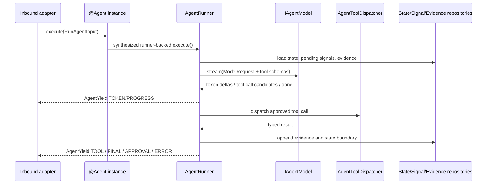
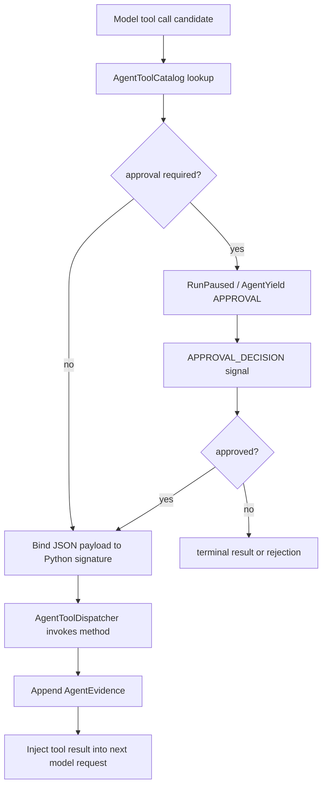
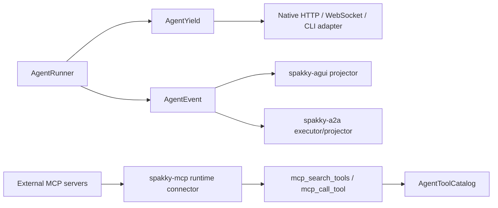

# AI Agent 심화

> `spakky-agent`의 tool catalog, approval, `@on_signal` 선언형 훅, context compaction, teammate, durable execution, `AgentEvent` stream, protocol adapter 연동을 다룹니다.

이 문서는 [AI Agent 개발](agents.md)을 읽은 뒤 보는 심화 가이드입니다. 여기서는 작은 Agent를 운영형 Agent로 확장할 때 필요한 선택지를 정리합니다.

기초 문서가 "무엇을 작성해야 실행되는가"를 다룬다면, 이 문서는 "왜 그렇게 나뉘어 있고 어떤 경계가 원리를 지키는가"를 다룹니다. 세 가지 원칙이 전체 설계를 묶습니다.

1. Runner가 loop를 소유하고, Agent class는 선언을 소유합니다.
2. 위험한 side effect는 approval/evidence/action boundary 뒤에서만 실행됩니다.
3. 외부 protocol은 core event를 재해석하지 않고 `AgentEvent`를 각 wire event로 투영합니다.

## 원리: 선언은 Agent, 반복은 Runner

Runner-backed Agent에서 개발자는 `execute()` 루프를 쓰지 않습니다. `@Agent` spec, `@agent_tool`, `@on_signal`, 생성자 주입 port를 선언하면 runner가 그 선언을 읽어 model/tool/signal loop를 수행합니다.



이 구조의 이점은 loop 정책이 한 곳에 있다는 점입니다. Approval, signal polling, evidence append, retry/resume, compaction을 각 Agent가 제각각 구현하지 않고 runner가 일관되게 적용합니다. 커스텀 `execute()`는 이 표준 loop를 벗어나야 할 때의 escape hatch입니다.

## 원리: 도구 호출은 계약, side effect는 경계

`@agent_tool`은 "함수를 모델에게 보여준다"만 의미하지 않습니다. Python signature는 입력 schema가 되고, metadata는 approval/evidence/retry 판단의 근거가 됩니다.



읽기 tool은 `ToolEffects.read_only()`와 `approval=NOT_REQUIRED`로 의도를 분명히 합니다. 쓰기, shell, 외부 API, patch 적용처럼 상태를 바꾸는 tool은 approval을 명시하거나 기본 `DERIVED` 판정에 맡깁니다. Evidence는 append-only라서 나중에 resume/retry를 판단할 때 "무엇을 이미 실행했는가"를 재구성할 수 있습니다.

## 원리: Protocol adapter는 투영 계층

Core runner는 AG-UI, A2A, MCP를 직접 알지 않습니다. AG-UI와 A2A는 `AgentRunner.run_events()`의 protocol-neutral `AgentEvent`를 각 protocol event로 바꿉니다. MCP는 다릅니다. MCP는 실행 event stream adapter가 아니라 **tool adapter**입니다.



따라서 직접 protocol adapter를 만들 때는 `AgentYield`를 AG-UI/A2A event로 억지 변환하지 말고 `run_events()`를 사용합니다. 반대로 MCP를 붙일 때는 "실행 stream을 노출한다"가 아니라 "run마다 선택된 외부 MCP 서버를 Agent tool catalog에 lazy search/call 도구로 합류시킨다"로 이해해야 합니다.

## Tool 설계

Tool은 모델이 호출할 수 있는 애플리케이션 기능입니다. `@agent_tool`은 Python method의 signature를 읽어 schema를 만들고, risk, approval, evidence, idempotency metadata를 함께 보관합니다.

읽기 tool은 approval 없이 실행할 수 있도록 명시합니다.

```python
from abc import ABC, abstractmethod
from dataclasses import dataclass

from spakky.agent import (
    Agent,
    AgentExecutionSpec,
    EvidenceCapture,
    Idempotency,
    ToolApprovalRequirement,
    ToolEffects,
    agent_tool,
)


@dataclass(frozen=True, slots=True)
class WorkspaceReadResult:
    path: str
    content: str


class IWorkspacePort(ABC):
    @abstractmethod
    def read_text(self, path: str) -> WorkspaceReadResult:
        ...

    @abstractmethod
    def write_text(self, path: str, content: str) -> "WorkspaceWriteResult":
        ...


@Agent(spec=AgentExecutionSpec(name="code_assistant", objective="inspect files"))
class CodeAssistant:
    def __init__(self, workspace: IWorkspacePort) -> None:
        self._workspace = workspace

    @agent_tool(
        schema_name="workspace.read",
        description="Read a text file from the bounded workspace.",
        effects=ToolEffects.read_only(),
        idempotency=Idempotency.IDEMPOTENT,
        evidence=EvidenceCapture.STRUCTURED,
        approval=ToolApprovalRequirement.NOT_REQUIRED,
    )
    def workspace_read(self, path: str) -> WorkspaceReadResult:
        return self._workspace.read_text(path)
```

쓰기 tool은 state를 바꾸므로 approval 후보가 됩니다.

```python
@dataclass(frozen=True, slots=True)
class WorkspaceWriteResult:
    path: str
    bytes_written: int


@agent_tool(
    schema_name="workspace.write",
    description="Write a text file in the bounded workspace.",
    effects=ToolEffects.write_state(),
    idempotency=Idempotency.CONDITIONALLY_IDEMPOTENT,
    evidence=EvidenceCapture.STRUCTURED,
)
def workspace_write(self, path: str, content: str) -> WorkspaceWriteResult:
    return self._workspace.write_text(path, content)
```

`approval`을 생략하면 기본값은 `DERIVED`입니다. `ToolEffects.write_state()`, `external_side_effect()`, `destructive_action()`처럼 side effect가 있는 tool은 approval candidate가 됩니다.

| tool 종류 | 권장 metadata |
|-----------|---------------|
| 파일 읽기, 검색, git status/diff | `ToolEffects.read_only()`, `Idempotency.IDEMPOTENT`, `approval=NOT_REQUIRED` |
| 파일 쓰기, local state 변경 | `ToolEffects.write_state()`, `Idempotency.CONDITIONALLY_IDEMPOTENT` |
| shell command, 외부 API 호출 | `ToolEffects.external_side_effect()`, `Idempotency.NON_IDEMPOTENT` |
| patch 적용, 삭제, 되돌리기 어려운 변경 | `ToolEffects.destructive_action()` |
| 모델에게 raw output을 보내면 위험한 결과 | `evidence=SUMMARY` 또는 `evidence=REDACTED` |
| audit trail에 구조화 결과가 필요한 경우 | `evidence=STRUCTURED` |

`@agent_tool` signature는 schema의 정본입니다. Parameter와 return type은 annotation해야 합니다. `*args`, `**kwargs`, positional-only parameter, JSON schema로 표현할 수 없는 임의 object는 definition 단계에서 실패합니다.

## Tool catalog를 모델 요청에 넣기

`@Agent` metadata에는 발견된 tool catalog가 들어 있습니다.

```python
from spakky.agent import Agent

agent_metadata = Agent.get(CodeAssistant)
for descriptor in agent_metadata.tool_catalog.descriptors:
    print(descriptor.schema.name, descriptor.description)
```

Model request에 tool schema를 넣을 때는 descriptor를 `ModelToolSpec`으로 변환합니다.

```python
from spakky.agent import (
    Agent,
    JsonSchemaConstraint,
    ModelMessage,
    ModelMessageRole,
    ModelRequest,
    ModelToolChoice,
    ModelToolSpec,
    ToolCallingSpec,
)

tools = tuple(
    ModelToolSpec(
        name=descriptor.schema.name,
        description=descriptor.description,
        parameters=JsonSchemaConstraint(schema=descriptor.schema.input_schema),
        metadata={"tool_identity": descriptor.identity.key},
    )
    for descriptor in Agent.get(CodeAssistant).tool_catalog.descriptors
)

request = ModelRequest(
    messages=(ModelMessage(ModelMessageRole.USER, instruction),),
    tool_calling=ToolCallingSpec(tools=tools, choice=ModelToolChoice.AUTO),
)
```

Model adapter가 `ModelStreamEventKind.TOOL_CALL_CANDIDATE`를 내보내면, **runner가** 다음 순서를 자동으로 수행합니다 (개발자가 루프 본문에 작성하지 않습니다, ADR-0013 §1).

1. `call.name`으로 `AgentToolCatalog`에서 descriptor를 찾습니다.
2. `plan_agent_tool_approval()`로 approval이 필요한지 판단합니다.
3. 필요하면 `AgentYieldKind.APPROVAL`을 yield하고 decision signal을 기다립니다 (HITL pause → resume).
4. 승인되었거나 approval이 필요 없으면 `descriptor.bind_invocation(call.arguments)`로 argument를 검증합니다.
5. Python method를 호출합니다.
6. result를 `AgentYieldKind.TOOL`과 append-only evidence로 남깁니다.

`bind_invocation()`은 model payload가 Python signature와 맞는지 검사합니다. 필수 인자 누락, 알 수 없는 인자, 중복 인자는 tool method가 실행되기 전에 `AgentToolBindingError`로 실패합니다. 이 전체 dispatch는 `AgentToolDispatcher`가 담당하며, 외부 MCP 도구도 같은 `AgentToolCatalog`로 정규화되어 동일 경로로 호출됩니다.

루프 본문을 직접 들여다보고 싶다면 동일 단계를 명시적으로 작성한 코드는 다음과 같습니다 — 커스텀 제어가 필요할 때만 `execute()` 본문으로 옮깁니다.

```python
from spakky.agent import Agent, AgentYield, plan_agent_tool_approval

descriptor = Agent.get(CodeAssistant).tool_catalog.by_schema_name(call.name)
approval = plan_agent_tool_approval(
    descriptor=descriptor,
    approval_id=f"approval:{state.id}:{call.name}",
    agent_state_id=state.id,
    agent_type="CodeAssistant",
    call_id=call.call_id,
)
if approval.requires_approval and approval.yield_item is not None:
    yield AgentYield(kind=approval.yield_item.kind, payload=approval.yield_item.payload)
    return
bound = descriptor.bind_invocation(call.arguments)
result = descriptor.callable(self, *bound.args, **bound.kwargs)
```

## Approval, signal, cancel

Approval은 모든 tool 앞에서 묻는 기능이 아닙니다. Tool metadata에서 risk를 계산하고, side effect가 있는 boundary에서만 approval request를 만듭니다.

```python
from spakky.agent import AgentSignal, AgentSignalKind, ApprovalDecision

signals.append(
    AgentSignal(
        id="approval:run-1:workspace.write",
        agent_state_id="run-1",
        kind=AgentSignalKind.APPROVAL_DECISION,
        payload={
            "request_id": "approval:run-1:workspace.write",
            "decision": ApprovalDecision.APPROVE.value,
        },
    )
)
```

Signal은 실행 중 Agent에게 들어오는 외부 입력입니다.

| signal kind | 의미 |
|-------------|------|
| `USER_MESSAGE` | 실행 중 사용자가 추가 지시를 보냄 |
| `APPROVAL_DECISION` | approval request에 대한 approve/reject/modify/defer/cancel 결정 |
| `CANCEL` | 실행 취소 요청 |
| `RESUME` | 중단된 실행 재개 요청 |
| `STEERING_INSTRUCTION` | 실행 방향을 바꾸는 운영 지시 |
| `EXTERNAL_EVENT` | 외부 시스템에서 들어온 event |
| `SCHEDULER_WAKE_UP` | scheduler가 Agent를 깨움 |

Durable repository를 쓰는 경우 orchestration은 safe boundary에서 `consume_pending_agent_signals()`를 호출합니다. 이 helper는 pending queue를 append order로 읽고, 현재 Agent가 받아들일 수 있는 prefix만 consumed 처리합니다.

Cancel은 바로 terminal state로 덮어쓰는 flag가 아닙니다. 일반적인 흐름은 `begin_agent_cancellation()`으로 state를 `CANCELLING`으로 만들고, model stream/tool/delegate cleanup hook을 실행한 뒤 `complete_agent_cancellation()`으로 끝냅니다.

## 선언형 시그널 훅: `@on_signal`

`CANCEL`과 `APPROVAL_DECISION`은 runner가 전용 단계에서 처리하지만, 그 외 시그널(`USER_MESSAGE`·`STEERING_INSTRUCTION`·`EXTERNAL_EVENT`·`SCHEDULER_WAKE_UP` 등)에 **커스텀 반응**을 붙이고 싶을 때 `@on_signal`을 씁니다. 이것은 `@agent_tool`과 같은 선언형 seam입니다 — `execute()` 루프를 작성하지 않고, 시그널 종류별 핸들러만 선언하면 runner가 해당 시그널을 소비하는 poll 지점에서 자동 호출합니다.

```python
from collections.abc import AsyncGenerator

from spakky.agent import (
    Agent,
    AgentExecutionSpec,
    AgentSignal,
    AgentSignalKind,
    AgentYield,
    AgentYieldKind,
    IAgentModel,
    Progress,
    RecoveryStrategy,
    on_signal,
)


@Agent(
    spec=AgentExecutionSpec(
        name="steerable_agent",
        objective="react to steering instructions mid-run",
        accepted_signals=(AgentSignalKind.STEERING_INSTRUCTION,),
        recovery=RecoveryStrategy.ACTION_BOUNDARY,
    )
)
class SteerableAgent:
    def __init__(self, model: IAgentModel, states, signals, evidence) -> None:
        ...

    @on_signal(AgentSignalKind.STEERING_INSTRUCTION)
    async def on_steering(
        self,
        signal: AgentSignal,
    ) -> AsyncGenerator[AgentYield[object], None]:
        yield AgentYield(
            kind=AgentYieldKind.PROGRESS,
            payload=Progress(
                f"steering applied: {signal.payload.get('instruction')}",
                current_step="steering",
            ),
        )
```

`@on_signal` 계약은 정의 시점에 검증됩니다.

- 메서드는 `async def`이며 `AgentYield` item을 yield하는 async generator여야 합니다.
- `self` 외에 정확히 하나의 `signal: AgentSignal` 인자를 받아야 합니다.
- 반환 annotation은 `AsyncGenerator[AgentYield[...], None]`이어야 합니다.

위반하면 bootstrap 전에 `AgentDefinitionError`로 실패합니다. 훅이 선언된 시그널 종류는 훅이 소비를 책임지고 yield한 item이 public stream으로 흘러갑니다. 훅이 없는 `USER_MESSAGE`는 runner의 기본 "user message consumed" progress로 폴백합니다.

pydantic-ai의 `@agent.instructions`/event handler 데코레이터처럼, `@on_signal`은 비즈니스 반응만 선언하고 폴링·소비·evidence 기록은 runner가 담당합니다.

## Durable 실행과 repository

짧은 Agent는 repository 없이도 동작할 수 있습니다. 하지만 다음 중 하나를 쓰면 durable path입니다.

- `AgentExecutionSpec(recovery=RecoveryStrategy.ACTION_BOUNDARY)`
- `AgentExecutionSpec(accepted_signals=(...))`

Durable path에서는 bootstrap이 다음 repository port를 요구합니다.

| repository | 저장하는 것 |
|------------|-------------|
| `IAgentStateRepository` | `AgentState`: 현재 status, transition, current activity, input ref |
| `IAgentSignalRepository` | `AgentSignal`: user message, approval decision, cancel 같은 inbound queue |
| `IAgentEvidenceRepository` | `AgentEvidence`: tool/model/context 판단 근거와 action-boundary checkpoint |

운영에서는 `spakky-sqlalchemy[agent]` contribution을 사용합니다.

```bash
pip install "spakky-sqlalchemy[agent]"
```

이 contribution은 `spakky.contributions.spakky.agent` entry point로 SQLAlchemy repository와 table을 등록합니다. 운영용 in-memory fallback은 없습니다. Repository가 없는데 durable path를 선언하면 bootstrap에서 fail-fast해야 합니다.

```python
from spakky.agent import AgentExecutionLimits, AgentExecutionSpec, AgentSignalKind, RecoveryStrategy

spec = AgentExecutionSpec(
    name="code_assistant",
    objective="inspect and edit a workspace",
    recovery=RecoveryStrategy.ACTION_BOUNDARY,
    accepted_signals=(
        AgentSignalKind.USER_MESSAGE,
        AgentSignalKind.APPROVAL_DECISION,
        AgentSignalKind.CANCEL,
    ),
    limits=AgentExecutionLimits(timeout_seconds=300),
)
```

Restart 후에는 `plan_agent_resume(state, evidence, pending_signals)`가 다음 동작을 결정합니다.

| 상황 | resume action |
|------|---------------|
| 이미 완료된 action boundary | 완료된 action을 다시 실행하지 않고 skip |
| idempotent action이 incomplete | retry 가능 |
| non-idempotent/unknown action이 incomplete | 사람 확인 필요 |
| approval wait 중 재시작 | approval decision을 기다림 |

Evidence는 append-only입니다. Tool result를 수정하거나 삭제해서 history를 고치지 않고, redaction, correction, context digest 갱신도 새 evidence를 append하는 방식으로 표현합니다.

## 멀티턴 대화와 TaskStore

`RunAgentInput`은 한 실행을 식별하는 `state_id`, 모델 요청을 시작하는 `instruction`, optional `conversation_id`, `parent_run_id`, `resume`, `message_history`, `model_selection`, `metadata`를 받습니다. `conversation_id`를 생략하면 `effective_conversation_id`는 `state_id`가 되며, 이 값이 AG-UI의 `threadId`, A2A의 `contextId`, `ITaskStore`의 conversation key로 투영됩니다.

`model_selection`은 요청별 provider/model/profile 선택입니다. Agent class는 특정 모델 이름을 소유하지 않고 `IAgentModel` port만 주입받습니다. 서비스 boundary가 사용자 선택을 `RunAgentInput.model_selection`으로 전달하면 runner는 같은 값을 `ModelRequest.model_selection`에 실어 adapter/router로 넘기고, reasoning gate와 compaction은 `IAgentModel.capability_for(selection)`을 조회합니다. vLLM 단일 adapter는 `provider in (None, "vllm")`만 수용하고, OpenRouter/Anthropic/Vertex/OpenAI 같은 multi-provider 지원은 router adapter가 이 selector를 해석하는 방식으로 확장합니다.

런타임 모델 선택을 서비스에서 지원하려면 `IAgentModelResolver`를 Pod로 등록하고 `AgentRunnerFactory`에 주입되게 합니다. Resolver가 `None`을 반환하면 agent 생성자에 이미 주입된 기본 `IAgentModel`을 그대로 사용합니다. 특정 provider/model/profile을 처리할 수 있으면 그 run에 사용할 model adapter를 반환합니다.

```python
from typing import override

from spakky.agent import IAgentModel, IAgentModelResolver, RunAgentInput
from spakky.core.pod.annotations.pod import Pod


@Pod()
class ModelRouter(IAgentModelResolver):
    def __init__(
        self,
        openai_model: OpenAIModelAdapter,
        anthropic_model: AnthropicModelAdapter,
        openrouter_model: OpenRouterModelAdapter,
    ) -> None:
        self._models: dict[str, IAgentModel] = {
            "openai": openai_model,
            "anthropic": anthropic_model,
            "openrouter": openrouter_model,
        }

    @override
    def resolve_model(
        self,
        agent_instance: object,
        run_input: RunAgentInput | None = None,
    ) -> IAgentModel | None:
        _ = agent_instance
        if run_input is None or run_input.model_selection is None:
            return None
        provider = run_input.model_selection.provider
        if provider is None:
            return None
        return self._models.get(provider)
```

각 adapter는 `ModelRequest.model_selection.model`을 provider의 실제 model id로 해석합니다. 예를 들어 OpenRouter adapter는 `anthropic/claude-sonnet-4.5` 같은 provider-qualified model id를 그대로 보낼 수 있고, Anthropic/OpenAI 전용 adapter는 자기 provider만 허용하도록 검증할 수 있습니다. Router adapter를 하나의 `IAgentModel` 구현으로 만들 수도 있습니다. 그 경우 `complete()`/`stream()` 안에서 `request.model_selection`을 읽어 provider SDK를 선택하고, `capability_for(selection)`도 provider별 context window와 reasoning 지원 여부를 반환해야 합니다.

| Inbound | 모델 선택 전달 |
|---------|----------------|
| Python/custom boundary | `RunAgentInput(model_selection=ModelSelection(...))` |
| AG-UI | `forwardedProps.modelSelection` |
| A2A | message data part의 `modelSelection` 또는 `model_selection` |

멀티턴 history는 두 경로 중 하나로만 들어옵니다.

| 경로 | 언제 쓰나 | runner 동작 |
|------|-----------|-------------|
| `RunAgentInput.message_history` | 클라이언트가 이전 transcript를 매 요청에 실어 보낼 때 | inline history를 그대로 model request 앞에 붙입니다. |
| `ITaskStore` | 서버가 conversation transcript를 보존할 때 | `effective_conversation_id`로 `ConversationTurn` 목록을 읽어 model message로 변환합니다. |

둘 다 있으면 inline `message_history`가 우선합니다. `ITaskStore`는 `ConversationTurn(role, content, metadata)`를 저장하며, role은 `USER` 또는 `ASSISTANT`만 허용됩니다. A2A protocol `Task` snapshot 저장은 `spakky-a2a`의 `IA2ATaskRepository`와 `SpakkyA2ATaskStore`가 담당하므로 core transcript store와 별도로 구성합니다.

## Context compaction

긴 멀티턴 대화는 결국 model backend의 context window를 넘습니다. 압축할지 여부(언제)는 runner가 소유하고, 압축하는 방법(어떻게)은 교체 가능한 `ICompactionStrategy` 포트가 담당합니다 (ADR-0013 §7). `@Agent` spec에 `AgentCompactionPolicy`를 선언하면 runner가 각 model 요청 직전, 누적 토큰 추정치가 임계값을 넘었을 때 선언된 전략 chain을 history에 적용합니다 — 개발자가 루프 본문에서 직접 호출하지 않습니다.

```python
from spakky.agent import (
    AgentCompactionPolicy,
    AgentExecutionSpec,
    KeepRecentMessagesCompactionStrategy,
    TrimToolResultsCompactionStrategy,
)

spec = AgentExecutionSpec(
    name="long_session_agent",
    objective="hold a long multi-turn session",
    compaction=AgentCompactionPolicy(
        strategies=(
            TrimToolResultsCompactionStrategy(max_characters=2000),
            KeepRecentMessagesCompactionStrategy(max_messages=20),
        ),
        trigger_token_threshold=8000,
    ),
)
```

`strategies`는 순서대로 적용되는 chain입니다 — 각 전략의 출력이 다음 전략의 입력이 됩니다. 내장 전략은 다음과 같습니다.

| 전략 | 압축 방식 |
|------|-----------|
| `KeepRecentMessagesCompactionStrategy` | 가장 오래된 메시지를 버리고 최근 N개만 유지 (가장 저렴) |
| `TrimToolResultsCompactionStrategy` | 오래된 tool result 본문을 잘라 토큰을 줄임 |
| `SummarizeOldTurnsCompactionStrategy` | 보조 model 호출로 오래된 turn을 요약 (가장 풍부) |
| `ProviderManagedCompactionStrategy` | history를 그대로 두고 provider가 압축을 소유 (no-op 명시) |

`ICompactionStrategy`를 직접 구현해 커스텀 전략을 주입할 수도 있습니다. 압축은 ADR-0009 `ContextDigest` 모델과 정렬되어 raw evidence를 대체하지 않고 derived 결과로 표현됩니다.

pydantic-ai의 message history processor / `compact_messages` capability와 같은 자리를 `ICompactionStrategy` 포트가 채웁니다.

## Teammate (팀 모드)와 delegation

multi-agent 팀 모드는 `@Agent` spec의 `teammates`로 선언합니다. 로컬 teammate는 로컬 `@Agent` Pod 타입으로, 원격 teammate는 A2A `AgentCard` 엔드포인트 URL로 해석됩니다 (ADR-0013 §8).

```python
from spakky.agent import AgentExecutionSpec, AgentTeammate

spec = AgentExecutionSpec(
    name="orchestrator",
    objective="delegate sub-tasks to teammates",
    delegation_allowed=True,
    teammates=(
        AgentTeammate(name="researcher", pod=ResearchAgent),
        AgentTeammate(name="remote_reviewer", card_url="https://reviewer.example/agent"),
    ),
)
```

`AgentTeammate`는 정확히 하나의 바인딩(로컬 `pod` 또는 원격 `card_url`)만 선언해야 하며, 위반 시 정의 시점에 `AgentDefinitionError`로 실패합니다. 위임은 ADR-0009 delegation building block(`DelegationPacket`/`DelegationResult`) 위에서 동작하고, 원격 위임은 A2A 어댑터를 통해 확장됩니다.

## FastAPI, WebSocket, SSE, CLI

Agent 전용 inbound package는 필요하지 않습니다. 기존 `spakky-fastapi`나 `spakky-typer` controller에서 Agent를 resolve하고 stream을 변환합니다.

WebSocket adapter의 핵심은 다음과 같습니다.

```python
@websocket("/agents/code/ws")
async def code_socket(self, websocket: WebSocket) -> None:
    payload = await websocket.receive_json()
    run_input = code_assistant_command_from_json(payload)
    agent = self._container.get(CodeAssistant)
    signals = self._container.get(IAgentSignalRepository)
    for signal_payload in code_assistant_signals_from_json(payload):
        signals.append(agent_signal_from_json(run_input.state_id, signal_payload))
    async for item in agent.execute(run_input):
        await websocket.send_json(agent_yield_to_event(item))
```

SSE는 단방향 server-to-client stream입니다. 사용자의 새 메시지나 approval decision을 같은 연결로 받을 수 없으므로, SSE endpoint와 별도의 POST endpoint를 함께 둡니다.

- `POST /agents/code/sse`: 실행을 시작하고 `AgentYield`를 SSE frame으로 흘려보냅니다.
- `POST /agents/code/signals`: approval decision, cancel, user message를 `IAgentSignalRepository`에 append합니다.

## Protocol event stream

`AgentRunner`는 같은 orchestration을 두 stream으로 제공합니다. `run()`은 Spakky-native inbound adapter가 소비하는 `AgentYield`를 내보내고, `run_events()`는 AG-UI/A2A 같은 protocol adapter가 손실 없이 투영하는 `AgentEvent` taxonomy를 내보냅니다.

현재 Spakky 상태를 정확히 말하면 다음과 같습니다.

- `AgentYield` 자체는 AG-UI 또는 A2A event가 아닙니다.
- `AgentEventAttribution`은 `agent_id`, `run_id`, `conversation_id`, optional `parent_run_id`를 모든 이벤트에 싣습니다.
- `RunPausedEvent`는 approval/auth/user-input pause를 중립 이벤트로 표현하고, adapter가 AG-UI deferred tool 또는 A2A `input-required`/`auth-required` 상태로 투영합니다.
- `spakky-agui`는 `AgentEvent`를 AG-UI `BaseEvent`로 투영하고 FastAPI SSE, HTTP streaming, WebSocket, stdio 경계를 제공합니다.
- `spakky-a2a`는 `AgentEvent`를 A2A task/message/artifact update로 투영하고 AgentCard, JSON-RPC, HTTP+JSON REST, gRPC transport를 제공합니다.
- `spakky-mcp`는 `AgentEvent` stream을 소비하지 않습니다. 외부 MCP server tool을 직접 전부 노출하지 않고 `mcp_search_tools`와 `mcp_call_tool`만 `AgentToolCatalog`에 병합합니다.

수동 adapter를 직접 작성할 때는 `AgentYieldKind`를 AG-UI로 재구성하지 말고 다음 `AgentEvent` mapping을 기준으로 삼습니다.

| 중립 `AgentEvent` | 주 사용처 |
|-------------------|-----------|
| `MESSAGE_DELTA`, `REASONING_DELTA` | AG-UI text/reasoning frame, A2A task working message |
| `TOOL_CALL_START`, `TOOL_CALL_ARGS_DELTA`, `TOOL_CALL_END`, `TOOL_CALL_RESULT` | AG-UI tool call lifecycle, A2A tool artifact/status |
| `RUN_STARTED`, `RUN_FINISHED`, `RUN_PAUSED` | run/task lifecycle, error, HITL pause |
| `STEP_STARTED`, `STEP_FINISHED` | progress step status |
| `STATE_SNAPSHOT`, `STATE_DELTA` | shared state projection |
| `ARTIFACT` | protocol-specific artifact/custom event |

CopilotKit으로 붙일 때도 endpoint는 AG-UI `RunAgentInput` request/response를 구현해야 합니다. Spakky-native `AgentYield` JSON stream은 CopilotKit용 endpoint가 아니며, 기본 구현은 [AG-UI 어댑터](agent-ag-ui.md)를 사용합니다.

## 테스트 전략

Agent 테스트는 실제 LLM에 의존하지 않는 것이 좋습니다.

| 테스트 대상 | 권장 double |
|-------------|-------------|
| model stream 처리 | scripted `IAgentModel` fake |
| tool 호출 | in-memory workspace/shell/git port fake |
| approval | in-memory `IAgentSignalRepository`에 decision signal append |
| durable state | in-memory repository double 또는 SQLAlchemy test DB |
| resume | 저장된 state/evidence/signal을 만들고 `plan_agent_resume()` 결과 확인 |

이 repository의 runnable reference는 다음 명령으로 확인합니다.

```bash
cd core/spakky-agent
uv run pytest tests/acceptance/test_code_assistant_demo_acceptance.py -q --no-cov
```

이 테스트는 실제 vLLM server 없이 scripted model stream으로 CodeAssistant 흐름을 검증합니다.

## 운영 체크리스트

- 가능한 한 `execute()` 본문을 생략하고 runner-backed 루프를 사용합니다. 커스텀 `execute()`를 직접 쓸 때만 input과 return/yield type을 모두 annotate합니다.
- Agent가 provider SDK, DB client, HTTP framework를 직접 import하지 않고 port/interface에 의존합니다.
- Model backend는 `IAgentModel` adapter 뒤에 있습니다.
- 모든 model-callable capability는 `@agent_tool`로 선언되어 schema, risk, idempotency, evidence metadata가 있습니다.
- 실행 중 시그널 반응은 `@on_signal` 훅으로 선언하고 루프 본문에 폴링 코드를 작성하지 않습니다.
- Write/network/destructive tool은 approval path가 있습니다.
- 긴 멀티턴 Agent는 `AgentCompactionPolicy`를 spec에 선언합니다.
- Durable path를 쓰면 state/signal/evidence repository contribution이 등록되어 있습니다.
- Inbound adapter는 `AgentYieldKind.APPROVAL`을 사용자 decision signal로 연결합니다.
- Protocol adapter는 Spakky-native `AgentYield` JSON이 아니라 `AgentRunner.run_events()`에서 나온 `AgentEvent`를 각 wire protocol event로 투영합니다.
- Cancel은 cancellation lifecycle로 처리하고 즉시 terminal state로 덮지 않습니다.
- Evidence는 append-only로 남깁니다.
- 테스트는 실제 model server 없이 scripted stream으로 주요 branch를 검증합니다.

## 더 볼 곳

- [CodeAssistant 에이전트 예제](agent-code-assistant.md): workspace/shell/git tool, approval, evidence, cancel/resume을 한 execution으로 연결한 runnable demo입니다.
- [spakky-agent API Reference](../api/core/spakky-agent.md): public class와 helper의 상세 signature를 확인합니다.
- [spakky-vllm API Reference](../api/plugins/spakky-vllm.md): OpenAI-compatible vLLM model adapter를 확인합니다.
- [spakky-agui API Reference](../api/plugins/spakky-agui.md): AG-UI endpoint, projector, HITL helpers를 확인합니다.
- [spakky-a2a API Reference](../api/plugins/spakky-a2a.md): A2A server, transport, delegation API를 확인합니다.
- [spakky-mcp API Reference](../api/plugins/spakky-mcp.md): 외부 MCP 서버 연결, runtime server resolution, lazy MCP tool API를 확인합니다.
- [spakky-sqlalchemy API Reference](../api/plugins/spakky-sqlalchemy.md): durable agent repository contribution을 확인합니다.
