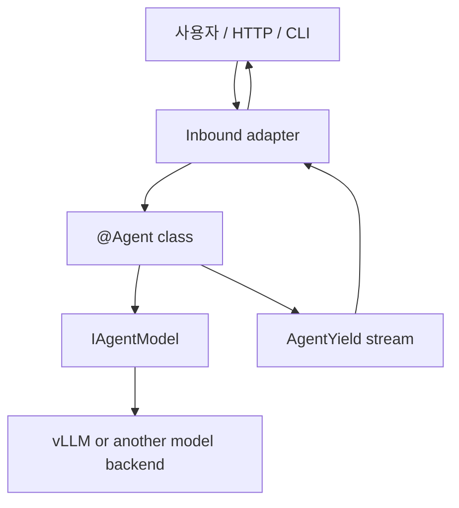

# AI Agent 개발

> `spakky-agent`로 LLM 실행과 도구 호출을 Spakky 애플리케이션 안에 자연스럽게 넣는 입문 가이드입니다.

Spakky에서 Agent는 특별한 외부 런타임이 아니라 하나의 애플리케이션 컴포넌트입니다. 일반 `@UseCase`처럼 생성자 주입을 받고, 실행 결과는 `AgentYield` stream으로 내보냅니다. 모델 호출, 도구 호출, 승인, 재개 같은 복잡한 기능은 필요할 때 단계적으로 붙입니다.

처음에는 세 가지만 기억하면 충분합니다.

| 개념 | 역할 |
|------|------|
| `@Agent` | Agent class를 Spakky Pod로 등록합니다. |
| `execute()` | Agent가 실제 일을 하는 public entrypoint입니다. |
| `AgentYield` | HTTP, WebSocket, CLI 같은 adapter가 받을 실행 이벤트입니다. |

Tool, approval, durable repository, AG-UI/CopilotKit 연동은 [AI Agent 심화](agents-advanced.md)에서 다룹니다. 실제 CodeAssistant 흐름을 보고 싶다면 [CodeAssistant 에이전트 예제](agent-code-assistant.md)를 이어서 보세요.

## 언제 Agent를 쓰나요?

다음 중 하나라도 필요하면 `@Agent`가 어울립니다.

- LLM token이나 진행 상태를 streaming으로 보여줘야 합니다.
- 모델이 호출할 수 있는 Python tool을 안전하게 노출해야 합니다.
- 파일 쓰기, shell 실행, 외부 API 호출 앞에서 사용자 승인을 받아야 합니다.
- 오래 걸리는 실행을 중간 checkpoint에서 다시 이어가야 합니다.
- 실행 중 사용자 메시지, 승인, 취소 같은 signal을 받아야 합니다.

반대로 한 번의 요청에서 결정적인 비즈니스 로직만 실행한다면 일반 `@UseCase`가 더 단순합니다.

## 설치

가장 작은 Agent contract만 실험할 때는 `spakky-agent`만 설치합니다.

```bash
pip install spakky-agent
```

로컬 vLLM 모델 adapter와 운영용 repository까지 함께 쓰려면 다음처럼 설치합니다.

```bash
pip install "spakky[agent]"
```

직접 조합하고 싶다면 같은 구성을 아래처럼 나눠 설치할 수 있습니다.

```bash
pip install spakky-agent spakky-vllm "spakky-sqlalchemy[agent]"
```

## 실행 흐름

Agent는 transport를 직접 알지 않습니다. HTTP, WebSocket, CLI adapter가 container에서 Agent를 꺼내고, Agent가 내보낸 `AgentYield`를 각 transport의 응답으로 바꿉니다.



## 가장 작은 Agent

먼저 LLM도 tool도 없는 Agent를 만들어 봅니다. 목적은 `@Agent`도 일반 Spakky component처럼 생성자 주입을 받고 `execute()` stream을 반환한다는 점을 확인하는 것입니다.

```python
from collections.abc import AsyncGenerator

from spakky.agent import Agent, AgentExecutionSpec, AgentYield, AgentYieldKind, Final
from spakky.core.pod.annotations.pod import Pod


@Pod()
class AnswerService:
    def answer(self, command: str) -> str:
        return f"handled:{command}"


@Agent(spec=AgentExecutionSpec(name="simple_agent", objective="handle one command"))
class SimpleAgent:
    def __init__(self, answers: AnswerService) -> None:
        self._answers = answers

    async def execute(
        self,
        command: str,
    ) -> AsyncGenerator[AgentYield[Final[str]], None]:
        yield AgentYield(
            kind=AgentYieldKind.FINAL,
            payload=Final(output=self._answers.answer(command), metadata={}),
        )
```

이 예제에서 중요한 부분은 다음과 같습니다.

| 코드 | 의미 |
|------|------|
| `@Agent(...)` | class를 Agent workflow component로 등록합니다. |
| `AgentExecutionSpec` | 이름, 목적, recovery 같은 실행 의미를 선언합니다. |
| `__init__(..., answers: AnswerService)` | 일반 Spakky 생성자 주입입니다. |
| `execute(command: str)` | Agent 실행 entrypoint입니다. 인자는 type annotation이 필요합니다. |
| `AgentYieldKind.FINAL` | 실행이 끝났음을 adapter에게 알립니다. |

`execute()` 계약은 bootstrap 시점에 검증됩니다. `execute()`가 없거나, parameter annotation이 없거나, `*args`/`**kwargs`를 쓰거나, `AgentYield`가 아닌 값을 yield하도록 annotation하면 definition error가 납니다.

## 응답으로 바꾸기

Adapter는 `AgentYield`를 transport별 응답으로 바꾸면 됩니다.

```python
from spakky.agent import AgentYieldKind

agent = container.get(SimpleAgent)

async for item in agent.execute("summarize this file"):
    if item.kind is AgentYieldKind.FINAL:
        return {"result": item.payload.output}
```

Streaming UI라면 token과 progress도 그대로 보낼 수 있습니다.

```python
async for item in agent.execute(command):
    if item.kind is AgentYieldKind.TOKEN:
        await websocket.send_text(item.payload.text)
    elif item.kind is AgentYieldKind.PROGRESS:
        await websocket.send_json({"progress": item.payload.message})
    elif item.kind is AgentYieldKind.FINAL:
        await websocket.send_json({"result": item.payload.output})
```

자주 쓰는 `AgentYieldKind`는 다음과 같습니다.

| kind | 언제 쓰나 |
|------|-----------|
| `TOKEN` | 모델 token 조각을 즉시 보여줄 때 |
| `PROGRESS` | 현재 진행 상태를 보여줄 때 |
| `TOOL` | tool call 또는 tool result를 노출할 때 |
| `APPROVAL` | 사용자 승인이 필요해 실행을 멈출 때 |
| `FINAL` | 최종 결과를 반환할 때 |
| `ERROR` | recoverable 또는 terminal error를 구조화해 보낼 때 |
| `CANCEL` | 취소 요청이 반영되었음을 알릴 때 |

## 모델 붙이기

Agent는 모델 SDK를 직접 import하지 않습니다. `IAgentModel`만 의존하고, 실제 모델 provider는 adapter가 맡습니다.

```python
from collections.abc import AsyncGenerator

from spakky.agent import (
    Agent,
    AgentExecutionSpec,
    AgentYield,
    AgentYieldKind,
    Final,
    IAgentModel,
    ModelMessage,
    ModelMessageRole,
    ModelRequest,
    ModelStreamEventKind,
    Token,
)


@Agent(spec=AgentExecutionSpec(name="answer_agent", objective="answer questions"))
class AnswerAgent:
    def __init__(self, model: IAgentModel) -> None:
        self._model = model

    async def execute(
        self,
        question: str,
    ) -> AsyncGenerator[AgentYield[object], None]:
        request = ModelRequest(
            messages=(
                ModelMessage(ModelMessageRole.SYSTEM, "Answer as a concise assistant."),
                ModelMessage(ModelMessageRole.USER, question),
            )
        )
        answer: list[str] = []
        async for event in self._model.stream(request):
            if event.kind is ModelStreamEventKind.TOKEN_DELTA:
                text = event.token_delta or ""
                answer.append(text)
                yield AgentYield(kind=AgentYieldKind.TOKEN, payload=Token(text))
            elif event.kind is ModelStreamEventKind.DONE:
                yield AgentYield(
                    kind=AgentYieldKind.FINAL,
                    payload=Final(output="".join(answer), metadata={}),
                )
```

운영에서 vLLM을 쓰면 `spakky-vllm` adapter를 주입합니다.

```python
from spakky.agent import IAgentModel
from spakky.core.application.application import SpakkyApplication
from spakky.core.application.application_context import ApplicationContext
from spakky.core.application.plugin import Plugin

app = (
    SpakkyApplication(ApplicationContext())
    .load_plugins(
        include={
            Plugin(name="spakky-agent"),
            Plugin(name="spakky-vllm"),
        }
    )
    .start()
)
model = app.container.get(type_=IAgentModel)
```

`spakky-vllm` 플러그인은 `VllmConfig`, `HttpxVllmChatClient`, `VllmAgentModel`을 등록하고 `IAgentModel -> VllmAgentModel` binding을 설정합니다.
테스트에서는 network가 없는 scripted `IAgentModel` fake를 만들어 token이나 tool event를 원하는 순서로 내보내면 됩니다.

## 다음 단계

처음부터 CodeAssistant 전체를 만들려고 하면 어렵습니다. 이 순서로 쌓아 올리세요.

1. `@Agent` class와 `execute()`만 만든다.
2. `AgentYieldKind.FINAL`만 yield해서 container resolve와 invocation을 확인한다.
3. `IAgentModel`을 생성자로 받고 token stream을 `AgentYieldKind.TOKEN`으로 변환한다.
4. read-only `@agent_tool` 하나를 추가한다.
5. write/network/destructive tool을 추가하고 approval event를 처리한다.
6. durable 실행이 필요해지면 state/signal/evidence repository를 붙인다.
7. FastAPI, WebSocket, SSE, CLI adapter에서 `AgentYield`를 transport event로 변환한다.

## 더 볼 곳

- [AI Agent 심화](agents-advanced.md): tool catalog, approval, durable repository, AG-UI/CopilotKit 연동을 다룹니다.
- [CodeAssistant 에이전트 예제](agent-code-assistant.md): workspace/shell/git tool, approval, evidence, cancel/resume을 한 흐름으로 연결합니다.
- [spakky-agent API Reference](../api/core/spakky-agent.md): public class와 helper의 상세 signature를 확인합니다.
