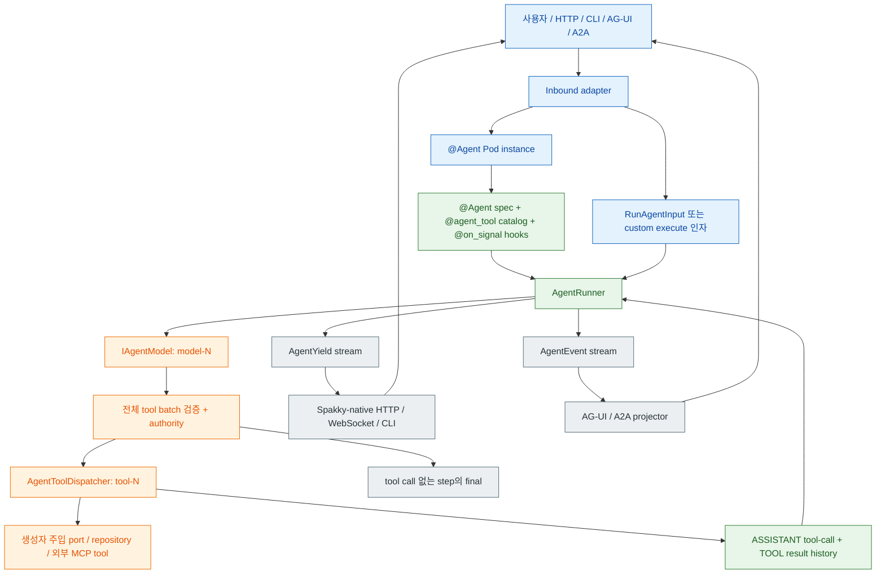
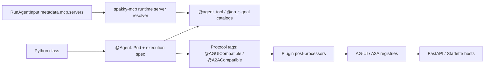

# AI Agent 개발

> `spakky-agent`로 LLM 실행과 도구 호출을 Spakky 애플리케이션 안에 자연스럽게 넣는 입문 가이드입니다.

Spakky에서 Agent는 특별한 외부 런타임이 아니라 하나의 애플리케이션 컴포넌트입니다. 일반 `@UseCase`처럼 생성자 주입을 받고, native adapter에는 `AgentYield` stream을, AG-UI/A2A 같은 protocol adapter에는 `AgentRunner.run_events()`의 `AgentEvent` stream을 제공합니다.

핵심은 **표준 실행의 범위**입니다. Runner-backed 경로는 model response의 전체 tool
batch를 먼저 검증하고 authority/approval gate를 모두 통과시킨 뒤 tool을 순서대로
dispatch합니다. 이어서 assistant tool-call history와 `TOOL` result history를 다음
`ModelRequest`에 넣어 model을 다시 호출하고, tool call이 없는 model step에서 final을
정확히 한 번 방출합니다. 이 bounded iterative loop는 framework가 소유합니다.

이 문서는 **기초 문서**입니다. 목표는 "파일을 만들고, 애플리케이션을 시작하고, Agent를 한 번 실행한다"입니다. Runner 내부 구조, approval resume 알고리즘, protocol event fidelity 같은 원리는 [AI Agent 심화](agents-advanced.md)에서 설명합니다.

처음에는 다섯 가지만 기억하면 충분합니다.

| 개념 | 역할 |
|------|------|
| `@Agent` | Agent class를 Spakky Pod로 등록하고 실행 spec을 선언합니다. |
| `RunAgentInput` | runner-backed Agent 실행을 시작하거나 재개하는 inbound contract입니다. |
| `@agent_tool` | model이 호출할 수 있는 Python 도구를 선언합니다. |
| `AgentYield` | Spakky-native HTTP, WebSocket, CLI adapter가 받을 실행 이벤트입니다. |
| `AgentEvent` | AG-UI, A2A 같은 protocol adapter가 각 wire contract에 맞게 투영하는 중립 이벤트입니다. |

`@Agent`가 도구만 선언하고 `execute()` 본문을 작성하지 않으면 프레임워크가 이
iterative 실행을 `execute()`로 자동 제공합니다. Agent class는 tool과 business limit를
선언하고 runner가 model/tool continuation, authority, checkpoint, terminal uniqueness를
집행합니다.

선언형 시그널 훅(`@on_signal`), approval, durable repository, context compaction, teammate, AG-UI/A2A/MCP 어댑터는 [AI Agent 심화](agents-advanced.md)에서 다룹니다. 실제 CodeAssistant 흐름을 보고 싶다면 [CodeAssistant 에이전트 예제](agent-code-assistant.md)를 이어서 보세요.
기존 지식 검색을 model context 또는 tool로 연결하려면 [Agent RAG](agent-rag.md)를 사용하세요.

## 언제 Agent를 쓰나요?

다음 중 하나라도 필요하면 `@Agent`가 어울립니다.

- LLM token이나 진행 상태를 streaming으로 보여줘야 합니다.
- 모델이 호출할 수 있는 Python tool을 안전하게 노출해야 합니다.
- 파일 쓰기, shell 실행, 외부 API 호출 앞에서 사용자 승인을 받아야 합니다.
- 오래 걸리는 실행을 중간 checkpoint에서 다시 이어가야 합니다.
- 실행 중 사용자 메시지, 승인, 취소 같은 signal을 받아야 합니다.

반대로 한 번의 요청에서 결정적인 비즈니스 로직만 실행한다면 일반 `@UseCase`가 더 단순합니다.

## 설치

가장 작은 Agent contract만 실험할 때는 `spakky-agent`만 설치합니다.

```bash
pip install spakky-agent
```

Agent core, 다중 provider LLM adapter, AG-UI/A2A/MCP protocol adapter,
SQLAlchemy provider까지 함께 쓰려면 다음처럼 설치합니다.

```bash
pip install "spakky[agent]"
```

직접 조합하고 싶다면 필요한 축만 나눠 설치할 수 있습니다.

```bash
pip install spakky-agent spakky-llm spakky-agui spakky-a2a spakky-mcp "spakky-sqlalchemy[agent]"
```

## 실행 흐름

Agent는 transport를 직접 알지 않습니다. HTTP, WebSocket, CLI adapter는 container에서 Agent를 꺼내 `AgentYield`를 native 응답으로 바꾸고, AG-UI/A2A protocol adapter는 같은 runner의 `AgentEvent`를 각 프로토콜 이벤트로 투영합니다.

중요한 방향은 아래와 같습니다. **Adapter가 Agent를 호출**하고, **runner가 bounded
iterative model/tool orchestration을 소유**합니다. Agent class는 runner가 사용할
spec, tool catalog, signal hook, DI dependency를 담는 애플리케이션 component입니다.


```mermaid
flowchart TD
  Client[사용자 / HTTP / CLI / AG-UI / A2A] --> Adapter[Inbound adapter]
  Adapter --> Input[RunAgentInput 또는 custom execute 인자]
  Adapter --> AgentInstance["@Agent Pod instance"]
  AgentInstance --> Metadata["@Agent spec + @agent_tool catalog + @on_signal hooks"]
  Metadata --> Runner[AgentRunner]
  Input --> Runner
  Runner --> Model["IAgentModel: model-N"]
  Model --> Batch["전체 tool batch 검증 + authority"]
  Batch --> Tools["AgentToolDispatcher: tool-N"]
  Tools --> Ports[생성자 주입 port / repository / 외부 MCP tool]
  Tools --> History["ASSISTANT tool-call + TOOL result history"]
  History --> Runner
  Batch --> Final[tool call 없는 step의 final]
  Runner --> Yield[AgentYield stream]
  Runner --> Event[AgentEvent stream]
  Yield --> Native[Spakky-native HTTP / WebSocket / CLI]
  Event --> Protocol[AG-UI / A2A projector]
  Native --> Client
  Protocol --> Client

  classDef inbound fill:#E3F2FD,stroke:#1565C0,color:#0D47A1
  classDef runner fill:#E8F5E9,stroke:#2E7D32,color:#1B5E20
  classDef action fill:#FFF3E0,stroke:#EF6C00,color:#E65100
  classDef output fill:#ECEFF1,stroke:#546E7A,color:#263238
  class Client,Adapter,Input,AgentInstance inbound
  class Metadata,Runner,History runner
  class Model,Batch,Tools,Ports action
  class Final,Yield,Event,Native,Protocol output
```

## 처음 실행하는 파일 구조

가장 작은 Agent 애플리케이션은 아래 두 파일이면 됩니다. 이 예제는 LLM runner를 쓰지 않고 `execute()`를 직접 구현합니다. 먼저 "Agent도 일반 Pod처럼 scan되고 resolve된다"는 감각을 잡기 위한 시작점입니다.

| 경로 | 역할 |
| --- | --- |
| `my_agent_app/my_app/__init__.py` | scan할 application package 표시 |
| `my_agent_app/my_app/agents.py` | `@Agent`와 주입할 Pod 선언 |
| `my_agent_app/main.py` | `SpakkyApplication` 조립과 시작 |

`my_app/agents.py`:

```python
from collections.abc import AsyncGenerator

from spakky.agent import Agent, AgentExecutionSpec, AgentYield, AgentYieldKind, Final
from spakky.core.pod.annotations.pod import Pod


@Pod()
class AnswerService:
    def answer(self, command: str) -> str:
        return f"handled:{command}"


@Agent(spec=AgentExecutionSpec(name="simple_agent", objective="handle one command"))
class SimpleAgent:
    def __init__(self, answers: AnswerService) -> None:
        self._answers = answers

    async def execute(
        self,
        command: str,
    ) -> AsyncGenerator[AgentYield[Final[str]], None]:
        yield AgentYield(
            kind=AgentYieldKind.FINAL,
            payload=Final(output=self._answers.answer(command), metadata={}),
        )
```

`main.py`:

```python
import asyncio

import my_app
import spakky.agent
from my_app.agents import SimpleAgent
from spakky.agent import AgentYieldKind
from spakky.core.application.application import SpakkyApplication
from spakky.core.application.application_context import ApplicationContext


async def main() -> None:
    app = (
        SpakkyApplication(ApplicationContext())
        .load_plugins(include={spakky.agent.PLUGIN_NAME})
        .scan(my_app)
        .start()
    )
    agent = app.container.get(type_=SimpleAgent)
    async for item in agent.execute("summarize"):
        if item.kind is AgentYieldKind.FINAL:
            print(item.payload.output)


asyncio.run(main())
```

실행:

```bash
python main.py
# handled:summarize
```

플러그인 로딩은 `PLUGIN_NAME` 상수를 우선 사용합니다. 직접 `Plugin(name="spakky-agent")`를 만들 수도 있지만, 문서 예제에서는 오타를 줄이기 위해 `spakky.agent.PLUGIN_NAME`, `spakky.plugins.agui.PLUGIN_NAME` 같은 공개 상수를 사용합니다.

## 가장 작은 Agent

먼저 LLM도 tool도 없는 Agent를 만들어 봅니다. 목적은 `@Agent`도 일반 Spakky component처럼 생성자 주입을 받고 `execute()` stream을 반환한다는 점을 확인하는 것입니다.

```python
from collections.abc import AsyncGenerator

from spakky.agent import Agent, AgentExecutionSpec, AgentYield, AgentYieldKind, Final
from spakky.core.pod.annotations.pod import Pod


@Pod()
class AnswerService:
    def answer(self, command: str) -> str:
        return f"handled:{command}"


@Agent(spec=AgentExecutionSpec(name="simple_agent", objective="handle one command"))
class SimpleAgent:
    def __init__(self, answers: AnswerService) -> None:
        self._answers = answers

    async def execute(
        self,
        command: str,
    ) -> AsyncGenerator[AgentYield[Final[str]], None]:
        yield AgentYield(
            kind=AgentYieldKind.FINAL,
            payload=Final(output=self._answers.answer(command), metadata={}),
        )
```

이 예제에서 중요한 부분은 다음과 같습니다.

| 코드 | 의미 |
|------|------|
| `@Agent(...)` | class를 Agent workflow component로 등록합니다. |
| `AgentExecutionSpec` | 이름, 목적, recovery 같은 실행 의미를 선언합니다. |
| `__init__(..., answers: AnswerService)` | 일반 Spakky 생성자 주입입니다. |
| `execute(command: str)` | Agent 실행 entrypoint입니다. 인자는 type annotation이 필요합니다. |
| `AgentYieldKind.FINAL` | 실행이 끝났음을 adapter에게 알립니다. |

직접 `execute()`를 선언하면 bootstrap 시점에 계약이 검증됩니다. parameter annotation이 없거나, `*args`/`**kwargs`를 쓰거나, generator가 `AgentYield`가 아닌 값을 yield하도록 annotation하면 definition error가 납니다. `execute()`를 생략하면 `@Agent`가 `RunAgentInput`을 받는 runner-backed `execute()`를 합성합니다.

## 실행 방식별 필수 의존성

어떤 의존성이 필요한지는 `@Agent`를 어떤 mode로 쓰는지에 따라 달라집니다.

| mode | 언제 쓰나 | 생성자에 필요한 것 | 생략하면 |
|------|-----------|-------------------|----------|
| Custom `execute()` | 표준 iterative loop와 다른 business orchestration이나 transport-independent yield를 직접 소유해야 할 때 | 실행에 필요한 일반 Pod와 port | `execute()`가 없으면 bounded iterative runner-backed mode가 합성됩니다. |
| Runner-backed tool Agent | `execute()`를 생략하고 model이 `@agent_tool`을 호출하게 할 때 | `IAgentModel`과 tool이 사용할 app port | `IAgentModel`이 없으면 runner가 model 요청을 만들 수 없습니다. |
| Durable runner-backed Agent | approval, cancel, resume, action-boundary recovery가 필요할 때 | `IAgentModel`, `IAgentStateRepository`, `IAgentSignalRepository`, `IAgentEvidenceRepository` | repository provider가 없으면 bootstrap에서 실패해야 합니다. |
| Protocol-exposed Agent | AG-UI/A2A 같은 inbound protocol로 Agent를 실행할 때 | 위 mode의 의존성 + host Pod(FastAPI/Starlette 등) | protocol marker를 빼면 Agent는 내부 component로만 남습니다. MCP는 Agent annotation이 아니라 run metadata로 외부 서버를 붙입니다. |

Runner-backed mode에서 runner는 생성자 parameter 이름이 아니라 **type**으로 필요한 port를 찾습니다. 그래서 `model: IAgentModel`, `states: IAgentStateRepository`처럼 정확한 interface type을 생성자에 선언합니다. 같은 type의 Pod가 여러 개 있으면 Spakky DI의 qualifier/primary 규칙으로 해소해야 합니다. `self._model` 같은 attribute 이름은 관례일 뿐 runner discovery의 public contract가 아닙니다.

## `AgentExecutionSpec` 필드 고르기

처음에는 `name`, `objective`, `instructions`만 있어도 됩니다. 나머지는 필요한 기능이 생겼을 때 추가합니다.

| 필드 | 언제 쓰나 | 안 쓰면 |
|------|-----------|---------|
| `name` | 로그, registry, protocol adapter에서 안정적인 Agent 이름이 필요할 때 | class name 기반 fallback이 쓰입니다. |
| `objective` | AgentCard, 설명, model-facing 목적이 필요할 때 | 설명이 빈약해지고 일부 adapter metadata가 약해집니다. |
| `instructions` | runner-backed model request에 기본 system 지시를 주고 싶을 때 | 사용자의 `RunAgentInput.instruction`과 tool schema 중심으로 요청을 만듭니다. |
| `output_type` | 최종 output을 Pydantic `BaseModel`, dataclass, `TypedDict`로 materialize할 때 | 기존 `AgentRunResult` 결과가 반환됩니다. |
| `accepted_signals` | 실행 중 user message, approval decision, cancel, resume 등을 받을 때 | signal queue를 소비하지 않는 stateless 경로가 됩니다. |
| `recovery` | action boundary resume/retry/skip 판단이 필요할 때 | 재시작 후 이어가기 계획을 만들지 않습니다. |
| `streaming_exposure_mode` | protocol adapter가 token streaming을 얼마나 보수적으로 노출할지 정할 때 | `BALANCED`가 사용됩니다. |
| `limits` | model step, 실제 tool call, 누적 provider token usage, wall-clock 실행 시간을 제한할 때 | `max_steps=8`, `max_tool_calls=32`, token/time 제한 없음이 사용됩니다. |
| `teammates` / `delegation_allowed` | local/remote Agent에게 일을 위임할 때 | delegation tool이 만들어지지 않습니다. |
| `compaction` | 긴 멀티턴 history를 압축해야 할 때 | context가 길어져도 압축 전략을 적용하지 않습니다. |
| `refresh_context_each_step` | 주입된 `IAgentContextProvider`를 model step마다 다시 호출할 때 | 한 invocation의 첫 model step에서 받은 context를 재사용합니다. |
| `metadata` | adapter나 운영 도구가 읽을 작은 문자열 metadata가 필요할 때 | 추가 metadata가 없습니다. |

## Typed structured output

가장 간단한 typed final은 `output_type`에 Pydantic model을 선언하는 것입니다.

```python
from pydantic import BaseModel
from spakky.agent import AgentExecutionSpec


class SupportAnswer(BaseModel):
    answer: str
    confidence: float


spec = AgentExecutionSpec(
    name="support_agent",
    output_type=SupportAnswer,
)
```

Runner는 선택 model의 structured-output capability를 provider 호출 전에 확인하고, strict
JSON Schema를 요청합니다. Final step의 structured payload가 선언 타입과 정확히 맞으면
`run()`의 `Final.output`은 `SupportAnswer` instance입니다. `run_events()`와 AG-UI/A2A에는
같은 값을 JSON-safe object로 보냅니다. `output_type`을 선언하지 않은 기존 Agent는 계속
`AgentRunResult`를 반환하며 protocol terminal에 임의의 output을 추가하지 않습니다.

## Static typed context

한 run에 고정된 context는 prompt 문자열에 이어 붙이지 말고 `RunAgentInput.context`에
`AgentContext`로 전달합니다.

```python
from spakky.agent import (
    AgentContext,
    ContextPack,
    ContextPackRole,
    ContextTokenBudget,
    RunAgentInput,
)


run_input = RunAgentInput(
    state_id="run-42",
    instruction="현재 상태를 요약해 주세요.",
    context=AgentContext(
        packs=(
            ContextPack(
                id="case-state",
                content="priority=high; owner=team-a",
                source="inbound:case-state",
                role=ContextPackRole.STATE,
                token_budget=ContextTokenBudget(max_tokens=64),
            ),
        ),
    ),
)
```

Runner는 pack을 `ModelRequest.context`로 전달하고 manifest가 없으면 pack ID/source/role을
정확히 덮는 manifest를 합성합니다. Context는 `ModelRequest.messages`에 raw 문자열로
concatenate되지 않으며 provider adapter가 `assemble_messages()` 경계에서 guarded evidence
message로 조립합니다. Dynamic refresh와 provenance/privacy 규칙은
[AI Agent 심화](agents-advanced.md)를 확인하세요.

## 응답으로 바꾸기

Adapter는 `AgentYield`를 transport별 응답으로 바꾸면 됩니다.

```python
from spakky.agent import AgentYieldKind

agent = container.get(SimpleAgent)

async for item in agent.execute("summarize this file"):
    if item.kind is AgentYieldKind.FINAL:
        return {"result": item.payload.output}
```

Streaming UI라면 token과 progress도 그대로 보낼 수 있습니다.

```python
async for item in agent.execute(command):
    if item.kind is AgentYieldKind.TOKEN:
        await websocket.send_text(item.payload.text)
    elif item.kind is AgentYieldKind.PROGRESS:
        await websocket.send_json({"progress": item.payload.message})
    elif item.kind is AgentYieldKind.FINAL:
        await websocket.send_json({"result": item.payload.output})
```

자주 쓰는 `AgentYieldKind`는 다음과 같습니다.

| kind | 언제 쓰나 |
|------|-----------|
| `TOKEN` | 모델 token 조각을 즉시 보여줄 때 |
| `PROGRESS` | 현재 진행 상태를 보여줄 때 |
| `TOOL` | tool call 또는 tool result를 노출할 때 |
| `APPROVAL` | 사용자 승인이 필요해 실행을 멈출 때 |
| `FINAL` | 최종 결과를 반환할 때 |
| `ERROR` | recoverable 또는 terminal error를 구조화해 보낼 때 |
| `CANCEL` | 취소 요청이 반영되었음을 알릴 때 |

## 모델 붙이기

Agent는 모델 SDK를 직접 import하지 않습니다. `IAgentModel`만 의존하고, 실제 모델 provider는 adapter가 맡습니다.

```python
from collections.abc import AsyncGenerator

from spakky.agent import (
    Agent,
    AgentExecutionSpec,
    AgentYield,
    AgentYieldKind,
    Final,
    IAgentModel,
    ModelMessage,
    ModelMessageRole,
    ModelRequest,
    ModelStreamEventKind,
    Token,
)


@Agent(spec=AgentExecutionSpec(name="answer_agent", objective="answer questions"))
class AnswerAgent:
    def __init__(self, model: IAgentModel) -> None:
        self._model = model

    async def execute(
        self,
        question: str,
    ) -> AsyncGenerator[AgentYield[object], None]:
        request = ModelRequest(
            messages=(
                ModelMessage(ModelMessageRole.SYSTEM, "Answer as a concise assistant."),
                ModelMessage(ModelMessageRole.USER, question),
            )
        )
        answer: list[str] = []
        async for event in self._model.stream(request):
            if event.kind is ModelStreamEventKind.TOKEN_DELTA:
                text = event.token_delta or ""
                answer.append(text)
                yield AgentYield(kind=AgentYieldKind.TOKEN, payload=Token(text))
            elif event.kind is ModelStreamEventKind.DONE:
                yield AgentYield(
                    kind=AgentYieldKind.FINAL,
                    payload=Final(output="".join(answer), metadata={}),
                )
```

실제 LLM provider에 연결할 때는 `spakky-llm` adapter를 주입합니다. 별도 설정이
없으면 공식 OpenAI SDK를 통해 로컬 vLLM OpenAI-compatible API를 사용합니다.

```python
from spakky.agent import IAgentModel
from spakky.core.application.application import SpakkyApplication
from spakky.core.application.application_context import ApplicationContext
from spakky.core.application.plugin import Plugin

app = (
    SpakkyApplication(ApplicationContext())
    .load_plugins(
        include={
            Plugin(name="spakky-agent"),
            Plugin(name="spakky-llm"),
        }
    )
    .start()
)
model = app.container.get(type_=IAgentModel)
```

`spakky-llm`은 `SPAKKY_LLM__` 접두사의 중첩 환경변수로 operator-owned connection
profile과 logical model catalog를 구성합니다. Agent 코드는 provider 이름이나 실제
model ID를 알지 않고 `support/primary` 같은 안정된 ref만 사용합니다.

```bash
export SPAKKY_LLM__DEFAULT_MODEL='support/primary'
export SPAKKY_LLM__PROFILES__MANAGED_TEXT__PROVIDER='anthropic'
export SPAKKY_LLM__PROFILES__MANAGED_TEXT__API='anthropic-messages'
export SPAKKY_LLM__PROFILES__MANAGED_TEXT__API_KEY="$ANTHROPIC_API_KEY"
export SPAKKY_LLM__MODELS='{"support/primary":{"profile":"managed_text","model":"claude-opus-4-1","capability":{"supports_tools":true,"supports_structured_output":true}}}'
```

연결 설정은 fail closed합니다. 알 수 없는 top-level `SPAKKY_LLM__` key, profile,
route field는 시작 단계에서 거부됩니다. Standard OpenAI와 Anthropic profile의
`base_url`을 생략하면 adapter가 코드에 고정된 공식 endpoint를 사용하므로
SDK ambient endpoint가 연결을 바꾸지 못합니다. Gemini Developer API와 Vertex AI도
서로 다른 API family와 credential strategy로 명시합니다. Custom header는 profile의
`headers`로만 등록하며,
`OPENAI_CUSTOM_HEADERS` 또는 `ANTHROPIC_CUSTOM_HEADERS`가 process 환경에 있으면
configuration error로 중단합니다. 세부 endpoint와 검증 규칙은
[LLM 연결 설정 경계](../api/plugins/spakky-llm.md#llm-connection-boundary)를 확인하세요.

`ModelSelection`은 `model_ref` 하나만 받습니다. Router는 이 opaque key를 operator
catalog에서 exact lookup하며 `/`를 provider 구분자로 해석하거나 raw model로 fallback하지
않습니다. 요청 metadata는 profile, physical model, base URL, API key, headers를 바꿀 수
없습니다. Direct construction, environment 설정, OpenRouter, vLLM, Anthropic, Gemini
Developer API, Vertex AI recipe는 [LLM 모델 라우팅](llm-routing.md)을 확인하세요.

플러그인은 `LlmConfig`, 세 공식 SDK provider adapter, `LlmAgentModel`을 등록하고
`IAgentModel -> LlmAgentModel` binding을 설정합니다. SDK가 인증, retry, typed
response와 stream parsing을 맡고, Spakky는 provider-neutral response/event 변환과
JSON/tool 검증을 맡습니다. Adapter는 tool을 실행하지 않으며 runner가 현재 provider
stream의 candidate 승인과 dispatch를 담당합니다.
테스트에서는 network가 없는 scripted `IAgentModel` fake를 만들어 token이나 tool event를 원하는 순서로 내보내면 됩니다.

## 선언형 Agent: iterative 실행 맡기기

앞의 예제는 `execute()` 본문을 직접 작성했습니다. 표준 model/tool continuation을
사용한다면 본문을 생략하세요. `@Agent`가 spec과 도구를 선언하면 runner가 반복 model
step, whole-batch validation/authority, 순차 tool dispatch, tool-result history 재주입,
다음 model step, final까지 이어지는 `execute()`를 합성합니다.

```python
from spakky.agent import (
    Agent,
    AgentExecutionLimits,
    AgentExecutionSpec,
    EvidenceCapture,
    IAgentModel,
    Idempotency,
    ToolApprovalRequirement,
    ToolEffects,
    agent_tool,
)
from spakky.core.pod.annotations.pod import Pod


@Pod()
class NoteStore:
    def read(self, topic: str) -> str:
        return f"note:{topic}"


@Agent(
    spec=AgentExecutionSpec(
        name="note_agent",
        objective="read and write notes for a topic",
        instructions="Use the declared tools to manage the user's notes.",
        limits=AgentExecutionLimits(
            max_steps=8,
            max_tool_calls=32,
            max_tokens=100_000,
            timeout_seconds=300.0,
        ),
    )
)
class NoteAgent:
    def __init__(self, model: IAgentModel, notes: NoteStore) -> None:
        self._model = model
        self._notes = notes

    @agent_tool(
        schema_name="note.read",
        description="Read a note for a topic.",
        effects=ToolEffects.read_only(),
        idempotency=Idempotency.IDEMPOTENT,
        evidence=EvidenceCapture.STRUCTURED,
        approval=ToolApprovalRequirement.NOT_REQUIRED,
    )
    async def read_note(self, topic: str) -> str:
        return self._notes.read(topic)
```

`NoteAgent`에는 `execute()`가 없습니다. Runner가 spec(`instructions`), 생성자에
주입된 `IAgentModel`, `@agent_tool` catalog와 `limits`로부터 bounded iterative 실행을
합성합니다. `max_steps=8`, `max_tool_calls=32`는 원래 기본값이고, 예제는 provider usage와
wall-clock budget도 함께 켰습니다. `timeout_seconds`는 `AgentExecutionSpec`의 direct
field나 alias가 아니며 모든 실행 제한은 `limits=AgentExecutionLimits(...)` 한 곳에 둡니다.
예제의 `read_note()`가 `async def`인 이유도 이 deadline을 실제로 집행하기 위해서입니다.
Deadline이 있는 batch에 in-process sync tool이 들어가면 runner는 중단 가능한 것처럼
가장하지 않고 전체 batch를 실행 전에 `agent_sync_tool_timeout_unenforceable`로 거부합니다.
호출 입력은 `RunAgentInput`입니다.

```python
from spakky.agent import AgentYieldKind, RunAgentInput

agent = container.get(NoteAgent)
async for item in agent.execute(
    RunAgentInput(state_id="run-1", instruction="summarize my agent notes")
):
    if item.kind is AgentYieldKind.TOOL:
        ...  # tool 호출 결과
    elif item.kind is AgentYieldKind.FINAL:
        return item.payload.output  # 타입은 AgentRunResult
```

Spakky에서는 `@Agent(spec=...)`, `@agent_tool`, runner-backed
`execute(RunAgentInput)`을 사용하고 도구·model·repository는 **생성자 DI**로 주입합니다.
표준 runner가 tool-call assistant turn과 `TOOL` result를 provider-neutral history로 만든
뒤 다음 model request를 소유하므로, 일반적인 multi-round tool use를 위해 custom
`execute()`를 작성하지 않습니다.

AG-UI나 A2A처럼 protocol adapter를 직접 만들 때는 coarse한 `AgentYield`를 재해석하지
말고 `IAgentRunnerFactory.open_runner(agent, run_input=run_input)`으로 request-scoped
runner를 열고 `runner.run_events(run_input)`을 사용합니다. 이 factory 경로를 거쳐야
`spakky-mcp`의 외부 MCP tool 합류, 인증 세션 수명주기, `IAgentModelResolver` 기반
runtime model routing이 모두 적용됩니다. `AgentEvent`는 message/reasoning delta, tool
call lifecycle, run/step boundary, pause, state, artifact를 분리해 제공하지만, 각 adapter는
대상 protocol의 framing과 상태 모델에 맞춰 event를 확장·축약하거나 지원하지 않는
필드를 생략할 수 있습니다.

```python
from spakky.agent import IAgentRunnerFactory, RunAgentInput


async def stream_protocol_events(
    runner_factory: IAgentRunnerFactory,
    agent: NoteAgent,
) -> None:
    run_input = RunAgentInput(
        state_id="run-1",
        instruction="summarize my agent notes",
    )
    async with runner_factory.open_runner(agent, run_input=run_input) as runner:
        async for event in runner.run_events(run_input):
            ...
```

## Annotation catalog

Agent 주변 annotation은 두 종류입니다. `@Agent`는 Pod 등록까지 하는 실행 component annotation이고, `@agent_tool`/`@on_signal`은 Agent class 안의 method metadata입니다. `@AGUICompatible`, `@A2ACompatible`은 protocol adapter가 같은 Agent class를 발견할 수 있게 붙이는 `Tag`입니다.


```mermaid
flowchart LR
  Class[Python class] --> Agent["@Agent: Pod + execution spec"]
  Agent --> Catalog["@agent_tool / @on_signal catalogs"]
  Agent --> Tags["Protocol tags: @AGUICompatible / @A2ACompatible"]
  Tags --> PostProcessors[Plugin post-processors]
  PostProcessors --> Registries[AG-UI / A2A registries]
  Registries --> Hosts[FastAPI / Starlette hosts]
  RunInput[RunAgentInput.metadata.mcp.servers] --> MCP[spakky-mcp runtime server resolver]
  MCP --> Catalog
```

| annotation | 붙이는 곳 | 목적 | 언제 쓰나 | 안 쓰면 |
|------------|-----------|------|-----------|---------|
| `@Agent(spec=...)` | class | class를 Agent Pod로 등록하고 실행 spec, tool catalog, signal hook catalog를 검증합니다. | Agent workflow가 필요할 때 항상 사용합니다. | protocol tag나 tool이 있어도 DI container가 Agent로 실행하지 않습니다. |
| `@agent_tool(...)` | Agent method | model-callable tool schema와 risk/evidence/approval metadata를 붙입니다. | runner-backed Agent에서 모델이 Python 기능을 호출해야 할 때 사용합니다. | 해당 method는 일반 method일 뿐 model tool catalog에 들어가지 않습니다. |
| `@on_signal(kind)` | Agent async generator method | 특정 `AgentSignalKind`를 runner poll 지점에서 처리합니다. | 실행 중 steering/user message/external event에 커스텀 반응해야 할 때 사용합니다. | runner 기본 처리만 사용하거나 해당 signal을 소비하지 않습니다. |
| `@AGUICompatible(...)` | `@Agent` class | Agent run을 AG-UI SSE/HTTP streaming/WebSocket route로 노출할 metadata를 붙입니다. | AG-UI 호환 UI에 실시간 실행 이벤트를 보낼 때 사용합니다. | Agent는 내부 실행 가능하지만 AG-UI route에 자동 등록되지 않습니다. |
| `@A2ACompatible(...)` | `@Agent` class | AgentCard, JSON-RPC/REST/gRPC A2A transport metadata를 붙입니다. | 다른 Agent가 표준 A2A protocol로 호출해야 할 때 사용합니다. | AgentCard와 A2A endpoint가 자동 생성되지 않습니다. |
| `@Pod()` | class 또는 factory function | 일반 DI component를 등록합니다. | Agent가 사용할 service, port adapter, host app을 등록할 때 사용합니다. | 생성자 주입 대상으로 resolve되지 않습니다. |
| `@Configuration` | class | 설정 객체를 container에 등록합니다. | 환경변수 기반 설정을 주입해야 할 때 사용합니다. | config provider가 자동 등록되지 않습니다. |

외부 MCP 서버를 Agent가 소비하게 만들 때는 Agent annotation을 추가하지 않습니다. 외부 서버는 `spakky-mcp`의 `McpConfig.servers` 또는 `RunAgentInput.metadata["mcp"]["servers"]`에서 선택하고, 플러그인이 run마다 lazy `mcp_search_tools`/`mcp_call_tool` 도구를 catalog에 합류시킵니다.

모델도 Agent class에 이름을 굽지 않습니다. Agent는 `IAgentModel` port만 주입받고,
서비스가 operator catalog의 논리 모델을 고르면 다음처럼 전달합니다.

```python
from spakky.agent import ModelSelection, RunAgentInput


run_input = RunAgentInput(
    state_id="run-42",
    instruction="고객 문의를 분류해 주세요.",
    model_selection=ModelSelection(model_ref="support/primary"),
)
```

Runner는 이 값을 `ModelRequest.model_selection`에 싣고, catalog-aware
`LlmAgentModel`이 route와 connection profile을 해석해 OpenAI Chat Completions,
Anthropic Messages, Gemini Developer API 또는 Vertex AI adapter로 라우팅합니다.

Protocol marker는 아래 순서를 문서화된 표준으로 사용합니다. Python decorator는 아래에서 위로 적용되므로 `@Agent`가 class에 가장 가까이 놓이고, protocol marker가 같은 class 위에 metadata를 덧붙입니다.

```python
@AGUICompatible(sse_path="/agents/assistant/agui")
@A2ACompatible(mount_path="/a2a/assistant")
@Agent(spec=AgentExecutionSpec(name="assistant"))
class Assistant:
    ...
```

하나의 Agent를 여러 protocol로 동시에 노출할 수 있습니다. 다만 AG-UI/A2A marker는 실행 event stream을 protocol event로 투영하는 책임만 갖습니다. MCP 서버 연결은 class marker가 아니라 run input metadata에서 선택합니다.

## 다음 단계

처음부터 CodeAssistant 전체를 만들려고 하면 어렵습니다. 이 순서로 쌓아 올리세요.

1. `@Agent` class에 `@agent_tool` 하나를 선언하고 `execute()`는 생략한다 (runner가 자동 제공).
2. container에서 resolve해 `RunAgentInput`으로 호출하고 `AgentYieldKind.FINAL`을 확인한다.
3. `IAgentModel`을 생성자로 받아 bounded model/tool loop와 final을 실행한다.
4. write/network/destructive tool을 추가하고 approval event를 처리한다.
5. 실행 중 시그널 반응이 필요하면 `@on_signal` 훅을 선언한다.
6. durable 실행이 필요해지면 state/signal/evidence repository를 붙인다.
7. FastAPI, WebSocket, SSE, CLI adapter에서는 `AgentYield`를 native transport event로, AG-UI/A2A adapter에서는 `AgentEvent`를 protocol event로 변환한다.

## 더 볼 곳

- [Agent RAG](agent-rag.md): 같은 `IRetriever`를 classic context 또는 agentic tool로 주입합니다.
- [AI Agent 심화](agents-advanced.md): tool catalog, approval, durable repository, protocol event stream을 다룹니다.
- [AG-UI 어댑터](agent-ag-ui.md), [A2A 어댑터](agent-a2a.md), [MCP 어댑터](agent-mcp.md): 외부 프로토콜별 endpoint와 transport wiring을 확인합니다.
- [CodeAssistant 에이전트 예제](agent-code-assistant.md): workspace/shell/git tool, approval, evidence, cancel/resume을 한 흐름으로 연결합니다.
- [spakky-agent API Reference](../api/core/spakky-agent.md): public class와 helper의 상세 signature를 확인합니다.
