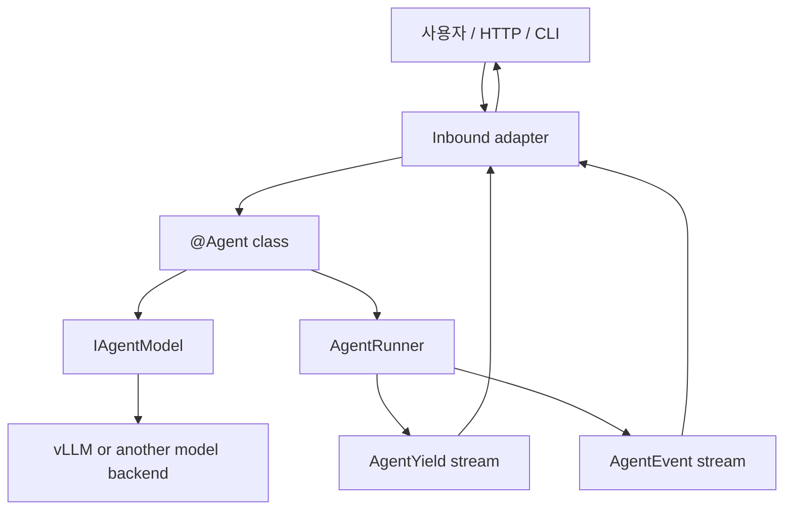

# AI Agent 개발

> `spakky-agent`로 LLM 실행과 도구 호출을 Spakky 애플리케이션 안에 자연스럽게 넣는 입문 가이드입니다.

Spakky에서 Agent는 특별한 외부 런타임이 아니라 하나의 애플리케이션 컴포넌트입니다. 일반 `@UseCase`처럼 생성자 주입을 받고, native adapter에는 `AgentYield` stream을, AG-UI/A2A 같은 protocol adapter에는 `AgentRunner.run_events()`의 `AgentEvent` stream을 제공합니다.

핵심은 **누가 실행 루프를 소유하는가**입니다. [ADR-0013](../adr/0013-declarative-agent-loop-ownership.md)에 따라 model 호출 → tool 호출 추출 → tool 실행 → 결과 주입 → 종료 판정으로 이어지는 반복 루프는 **프레임워크 runner가 소유**합니다. 개발자는 루프 본문을 작성하지 않고 `@Agent` spec으로 **무엇을** 실행할지(어떤 model, 어떤 tool, 어떤 정책)만 선언합니다. 이 개발 경험(DX)은 pydantic-ai를 참조합니다 — pydantic-ai에서 `agent.run()`이 루프를 소유하고 개발자는 `@agent.tool`로 도구만 선언하듯이, Spakky에서는 runner가 루프를 소유하고 개발자는 `@agent_tool`(도구)과 `@on_signal`(시그널 반응)만 선언합니다.

처음에는 세 가지만 기억하면 충분합니다.

| 개념 | 역할 |
|------|------|
| `@Agent` | Agent class를 Spakky Pod로 등록하고 실행 spec을 선언합니다. |
| `RunAgentInput` | runner-backed Agent 실행을 시작하거나 재개하는 inbound contract입니다. |
| `@agent_tool` | model이 호출할 수 있는 Python 도구를 선언합니다. |
| `AgentYield` | Spakky-native HTTP, WebSocket, CLI adapter가 받을 실행 이벤트입니다. |
| `AgentEvent` | AG-UI, A2A 같은 protocol adapter가 손실 없이 투영하는 중립 이벤트입니다. |

`@Agent`가 도구만 선언하고 `execute()` 본문을 작성하지 않으면, 프레임워크가 표준 실행 루프를 `execute()`로 자동 제공합니다. model-mediated orchestration의 기본 흐름을 벗어나는 커스텀 제어가 필요할 때만 `execute()` 본문을 직접 작성합니다.

선언형 시그널 훅(`@on_signal`), approval, durable repository, context compaction, teammate, AG-UI/A2A/MCP 어댑터는 [AI Agent 심화](agents-advanced.md)에서 다룹니다. 실제 CodeAssistant 흐름을 보고 싶다면 [CodeAssistant 에이전트 예제](agent-code-assistant.md)를 이어서 보세요.

## 언제 Agent를 쓰나요?

다음 중 하나라도 필요하면 `@Agent`가 어울립니다.

- LLM token이나 진행 상태를 streaming으로 보여줘야 합니다.
- 모델이 호출할 수 있는 Python tool을 안전하게 노출해야 합니다.
- 파일 쓰기, shell 실행, 외부 API 호출 앞에서 사용자 승인을 받아야 합니다.
- 오래 걸리는 실행을 중간 checkpoint에서 다시 이어가야 합니다.
- 실행 중 사용자 메시지, 승인, 취소 같은 signal을 받아야 합니다.

반대로 한 번의 요청에서 결정적인 비즈니스 로직만 실행한다면 일반 `@UseCase`가 더 단순합니다.

## 설치

가장 작은 Agent contract만 실험할 때는 `spakky-agent`만 설치합니다.

```bash
pip install spakky-agent
```

Agent core, vLLM model adapter, AG-UI/A2A/MCP protocol adapter, SQLAlchemy provider까지 함께 쓰려면 다음처럼 설치합니다.

```bash
pip install "spakky[agent]"
```

직접 조합하고 싶다면 필요한 축만 나눠 설치할 수 있습니다.

```bash
pip install spakky-agent spakky-vllm spakky-agui spakky-a2a spakky-mcp "spakky-sqlalchemy[agent]"
```

## 실행 흐름

Agent는 transport를 직접 알지 않습니다. HTTP, WebSocket, CLI adapter는 container에서 Agent를 꺼내 `AgentYield`를 native 응답으로 바꾸고, AG-UI/A2A protocol adapter는 같은 runner의 `AgentEvent`를 각 프로토콜 이벤트로 투영합니다.


```mermaid
flowchart TD
  Client[사용자 / HTTP / CLI] --> Adapter[Inbound adapter]
  Adapter --> Agent["@Agent class"]
  Agent --> Model[IAgentModel]
  Model --> Backend[vLLM or another model backend]
  Agent --> Runner[AgentRunner]
  Runner --> Yield[AgentYield stream]
  Runner --> Event[AgentEvent stream]
  Yield --> Adapter
  Event --> Adapter
  Adapter --> Client
```

## 가장 작은 Agent

먼저 LLM도 tool도 없는 Agent를 만들어 봅니다. 목적은 `@Agent`도 일반 Spakky component처럼 생성자 주입을 받고 `execute()` stream을 반환한다는 점을 확인하는 것입니다.

```python
from collections.abc import AsyncGenerator

from spakky.agent import Agent, AgentExecutionSpec, AgentYield, AgentYieldKind, Final
from spakky.core.pod.annotations.pod import Pod


@Pod()
class AnswerService:
    def answer(self, command: str) -> str:
        return f"handled:{command}"


@Agent(spec=AgentExecutionSpec(name="simple_agent", objective="handle one command"))
class SimpleAgent:
    def __init__(self, answers: AnswerService) -> None:
        self._answers = answers

    async def execute(
        self,
        command: str,
    ) -> AsyncGenerator[AgentYield[Final[str]], None]:
        yield AgentYield(
            kind=AgentYieldKind.FINAL,
            payload=Final(output=self._answers.answer(command), metadata={}),
        )
```

이 예제에서 중요한 부분은 다음과 같습니다.

| 코드 | 의미 |
|------|------|
| `@Agent(...)` | class를 Agent workflow component로 등록합니다. |
| `AgentExecutionSpec` | 이름, 목적, recovery 같은 실행 의미를 선언합니다. |
| `__init__(..., answers: AnswerService)` | 일반 Spakky 생성자 주입입니다. |
| `execute(command: str)` | Agent 실행 entrypoint입니다. 인자는 type annotation이 필요합니다. |
| `AgentYieldKind.FINAL` | 실행이 끝났음을 adapter에게 알립니다. |

직접 `execute()`를 선언하면 bootstrap 시점에 계약이 검증됩니다. parameter annotation이 없거나, `*args`/`**kwargs`를 쓰거나, generator가 `AgentYield`가 아닌 값을 yield하도록 annotation하면 definition error가 납니다. `execute()`를 생략하면 `@Agent`가 `RunAgentInput`을 받는 runner-backed `execute()`를 합성하므로 직접 루프를 작성할 필요가 없습니다.

## 응답으로 바꾸기

Adapter는 `AgentYield`를 transport별 응답으로 바꾸면 됩니다.

```python
from spakky.agent import AgentYieldKind

agent = container.get(SimpleAgent)

async for item in agent.execute("summarize this file"):
    if item.kind is AgentYieldKind.FINAL:
        return {"result": item.payload.output}
```

Streaming UI라면 token과 progress도 그대로 보낼 수 있습니다.

```python
async for item in agent.execute(command):
    if item.kind is AgentYieldKind.TOKEN:
        await websocket.send_text(item.payload.text)
    elif item.kind is AgentYieldKind.PROGRESS:
        await websocket.send_json({"progress": item.payload.message})
    elif item.kind is AgentYieldKind.FINAL:
        await websocket.send_json({"result": item.payload.output})
```

자주 쓰는 `AgentYieldKind`는 다음과 같습니다.

| kind | 언제 쓰나 |
|------|-----------|
| `TOKEN` | 모델 token 조각을 즉시 보여줄 때 |
| `PROGRESS` | 현재 진행 상태를 보여줄 때 |
| `TOOL` | tool call 또는 tool result를 노출할 때 |
| `APPROVAL` | 사용자 승인이 필요해 실행을 멈출 때 |
| `FINAL` | 최종 결과를 반환할 때 |
| `ERROR` | recoverable 또는 terminal error를 구조화해 보낼 때 |
| `CANCEL` | 취소 요청이 반영되었음을 알릴 때 |

## 모델 붙이기

Agent는 모델 SDK를 직접 import하지 않습니다. `IAgentModel`만 의존하고, 실제 모델 provider는 adapter가 맡습니다.

```python
from collections.abc import AsyncGenerator

from spakky.agent import (
    Agent,
    AgentExecutionSpec,
    AgentYield,
    AgentYieldKind,
    Final,
    IAgentModel,
    ModelMessage,
    ModelMessageRole,
    ModelRequest,
    ModelStreamEventKind,
    Token,
)


@Agent(spec=AgentExecutionSpec(name="answer_agent", objective="answer questions"))
class AnswerAgent:
    def __init__(self, model: IAgentModel) -> None:
        self._model = model

    async def execute(
        self,
        question: str,
    ) -> AsyncGenerator[AgentYield[object], None]:
        request = ModelRequest(
            messages=(
                ModelMessage(ModelMessageRole.SYSTEM, "Answer as a concise assistant."),
                ModelMessage(ModelMessageRole.USER, question),
            )
        )
        answer: list[str] = []
        async for event in self._model.stream(request):
            if event.kind is ModelStreamEventKind.TOKEN_DELTA:
                text = event.token_delta or ""
                answer.append(text)
                yield AgentYield(kind=AgentYieldKind.TOKEN, payload=Token(text))
            elif event.kind is ModelStreamEventKind.DONE:
                yield AgentYield(
                    kind=AgentYieldKind.FINAL,
                    payload=Final(output="".join(answer), metadata={}),
                )
```

운영에서 vLLM을 쓰면 `spakky-vllm` adapter를 주입합니다.

```python
from spakky.agent import IAgentModel
from spakky.core.application.application import SpakkyApplication
from spakky.core.application.application_context import ApplicationContext
from spakky.core.application.plugin import Plugin

app = (
    SpakkyApplication(ApplicationContext())
    .load_plugins(
        include={
            Plugin(name="spakky-agent"),
            Plugin(name="spakky-vllm"),
        }
    )
    .start()
)
model = app.container.get(type_=IAgentModel)
```

`spakky-vllm` 플러그인은 `VllmConfig`, `HttpxVllmChatClient`, `VllmAgentModel`을 등록하고 `IAgentModel -> VllmAgentModel` binding을 설정합니다.
테스트에서는 network가 없는 scripted `IAgentModel` fake를 만들어 token이나 tool event를 원하는 순서로 내보내면 됩니다.

## 선언형 Agent: 루프를 프레임워크에 맡기기

앞의 예제는 `execute()` 본문을 직접 작성했습니다. 도구를 호출하는 Agent라면 보통 그럴 필요가 없습니다. `@Agent`가 도구만 선언하고 `execute()`를 생략하면, 프레임워크 runner가 model 호출 → tool 호출 → 결과 주입 → 종료 판정 루프를 `execute()`로 자동 제공합니다.

```python
from spakky.agent import (
    Agent,
    AgentExecutionSpec,
    EvidenceCapture,
    IAgentModel,
    Idempotency,
    ToolApprovalRequirement,
    ToolEffects,
    agent_tool,
)


@Agent(
    spec=AgentExecutionSpec(
        name="note_agent",
        objective="read and write notes for a topic",
        instructions="Use the declared tools to manage the user's notes.",
    )
)
class NoteAgent:
    def __init__(self, model: IAgentModel, notes: NoteStore) -> None:
        self._model = model
        self._notes = notes

    @agent_tool(
        schema_name="note.read",
        description="Read a note for a topic.",
        effects=ToolEffects.read_only(),
        idempotency=Idempotency.IDEMPOTENT,
        evidence=EvidenceCapture.STRUCTURED,
        approval=ToolApprovalRequirement.NOT_REQUIRED,
    )
    def read_note(self, topic: str) -> str:
        return self._notes.read(topic)
```

`NoteAgent`에는 `execute()`가 없습니다. runner가 spec(`instructions`)과 생성자에 주입된 `IAgentModel`, 그리고 `@agent_tool` 카탈로그로부터 표준 루프를 합성합니다. 호출 입력은 `RunAgentInput`입니다.

```python
from spakky.agent import AgentYieldKind, RunAgentInput

agent = container.get(NoteAgent)
async for item in agent.execute(
    RunAgentInput(state_id="run-1", instruction="summarize my agent notes")
):
    if item.kind is AgentYieldKind.TOOL:
        ...  # tool 호출 결과
    elif item.kind is AgentYieldKind.FINAL:
        return item.payload.output  # 타입은 AgentRunResult
```

pydantic-ai의 `Agent(..., output_type=...)` + `@agent.tool` + `agent.run()` 조합과 같은 자리를 Spakky에서는 `@Agent(spec=...)` + `@agent_tool` + runner-backed `execute(RunAgentInput)`가 채웁니다. 차이는 도구·model·repository가 모두 **생성자 DI**로 주입된다는 점입니다 — spec은 의존성을 다시 선언하지 않습니다.

AG-UI나 A2A처럼 protocol fidelity가 필요한 adapter를 직접 만들 때는 coarse한 `AgentYield`를 재해석하지 말고 `AgentRunner.for_agent_instance(agent).run_events(run_input)`을 사용합니다. `AgentEvent`는 message/reasoning delta, tool call start/args/end/result, run/step boundary, pause, state, artifact를 분리해 내보내므로 adapter가 wire protocol 이벤트로 1:1 투영할 수 있습니다.

## 다음 단계

처음부터 CodeAssistant 전체를 만들려고 하면 어렵습니다. 이 순서로 쌓아 올리세요.

1. `@Agent` class에 `@agent_tool` 하나를 선언하고 `execute()`는 생략한다 (runner가 자동 제공).
2. container에서 resolve해 `RunAgentInput`으로 호출하고 `AgentYieldKind.FINAL`을 확인한다.
3. `IAgentModel`을 생성자로 받아 model-mediated tool 호출 루프를 돌린다.
4. write/network/destructive tool을 추가하고 approval event를 처리한다.
5. 실행 중 시그널 반응이 필요하면 `@on_signal` 훅을 선언한다.
6. durable 실행이 필요해지면 state/signal/evidence repository를 붙인다.
7. FastAPI, WebSocket, SSE, CLI adapter에서는 `AgentYield`를 native transport event로, AG-UI/A2A adapter에서는 `AgentEvent`를 protocol event로 변환한다.

## 더 볼 곳

- [AI Agent 심화](agents-advanced.md): tool catalog, approval, durable repository, protocol event stream을 다룹니다.
- [AG-UI 어댑터](agent-ag-ui.md), [A2A 어댑터](agent-a2a.md), [MCP 어댑터](agent-mcp.md): 외부 프로토콜별 endpoint와 transport wiring을 확인합니다.
- [CodeAssistant 에이전트 예제](agent-code-assistant.md): workspace/shell/git tool, approval, evidence, cancel/resume을 한 흐름으로 연결합니다.
- [spakky-agent API Reference](../api/core/spakky-agent.md): public class와 helper의 상세 signature를 확인합니다.
