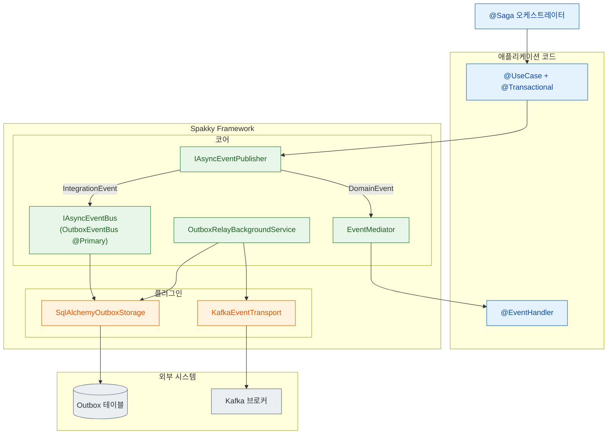

# 이벤트 기반 아키텍처 통합 가이드

> 이벤트 시스템·Transactional Outbox·사가가 **하나의 분산 워크플로우**로 맞물려 동작하는 방식을 개념과 사용법으로 나누어 설명합니다.

이벤트 시스템(`spakky-event`), Outbox(`spakky-outbox`), 사가(`spakky-saga`)는 각각 독립된 가이드가 있지만, 실제 분산 워크플로우는 셋을 함께 씁니다. 이 문서는 세 컴포넌트를 **개념 → 사용법** 순서로 한 번에 연결해, "이벤트로 분산 워크플로우를 어떻게 구성하는가"를 끝까지 따라갈 수 있게 합니다.

개별 컴포넌트의 전체 API는 [이벤트 시스템](events.md) · [Transactional Outbox](outbox.md) · [사가 오케스트레이션](saga.md)을 참고하세요.

---

## 개념

### 세 컴포넌트의 역할 분담

| 컴포넌트 | 책임 | 경계 |
| --- | --- | --- |
| 이벤트 시스템 | 상태 변경을 이벤트로 발행하고 핸들러로 처리 | 같은 프로세스 안(DomainEvent) + 외부 발행 진입점(IntegrationEvent) |
| Outbox | Integration Event를 DB 트랜잭션과 원자적으로 묶어 at-least-once 전달 보장 | 발행 시점 ↔ 브로커 전송 시점 분리 |
| 사가 | 여러 서비스/트랜잭션에 걸친 흐름을 보상 기반으로 오케스트레이션 | 복수 UseCase 호출 + 실패 시 역순 보상 |

이벤트 시스템은 "무엇이 일어났는가"를 알리고, Outbox는 그 알림이 "유실 없이" 외부로 나가도록 보장하며, 사가는 여러 단계의 흐름이 "전부 성공하거나 전부 되돌려지도록" 조율합니다.

### 발행에서 전송, 보상까지의 전체 그림

아래는 주문 사가가 진행되는 동안 세 컴포넌트가 어떻게 연결되는지를 보여 줍니다. 사용자 코드(UseCase·Saga)는 프레임워크 코어(이벤트·Outbox 코어)와 플러그인(SQLAlchemy·Kafka)을 거쳐 외부 시스템(DB·브로커)에 닿습니다.



핵심은 `OutboxEventBus`가 `@Primary`로 기본 `IAsyncEventBus`를 대체한다는 점입니다. 사가 step 안의 UseCase가 `publisher.publish()`로 Integration Event를 발행하면, 이벤트가 브로커로 바로 나가지 않고 **같은 트랜잭션 안에서 Outbox 테이블에 저장**됩니다. 트랜잭션이 commit되어야 메시지도 함께 남고, rollback되면 비즈니스 데이터와 메시지가 함께 사라집니다. 실제 브로커 전송은 `OutboxRelayBackgroundService`가 별도로 폴링하며 수행합니다.

### 왜 세 컴포넌트를 함께 쓰나

단일 Aggregate 내부 변경이라면 이벤트 시스템만으로 충분합니다. 외부로 Integration Event를 내보내는 순간 "DB는 commit됐는데 브로커 전송은 실패"하는 이중 쓰기 문제가 생기고, 이때 Outbox가 필요합니다. 여기에 더해 흐름이 여러 서비스를 가로지르고 중간 실패 시 앞 단계를 되돌려야 하면 사가로 승격합니다. 즉, 세 컴포넌트는 **요구사항이 커질수록 차례로 추가**되는 계층이지, 항상 함께 켜야 하는 묶음이 아닙니다.

---

## 사용법

### 1단계 — 플러그인 로드

세 컴포넌트를 함께 쓰려면 이벤트·Outbox 코어와 저장소·전송 플러그인을 함께 로드합니다. 사가는 `Pod` 스캔만으로 동작하므로 별도 post-processor가 없습니다.

```python
from spakky.core.application.application import SpakkyApplication
from spakky.core.application.application_context import ApplicationContext
import spakky.data
import spakky.event
import spakky.outbox
import spakky.saga
import spakky.plugins.sqlalchemy  # Outbox storage 제공
import spakky.plugins.kafka       # Transport 제공
import apps

app = (
    SpakkyApplication(ApplicationContext())
    .load_plugins(include={
        spakky.data.PLUGIN_NAME,
        spakky.event.PLUGIN_NAME,
        spakky.outbox.PLUGIN_NAME,
        spakky.saga.PLUGIN_NAME,
        spakky.plugins.sqlalchemy.PLUGIN_NAME,
        spakky.plugins.kafka.PLUGIN_NAME,
    })
    .scan(apps)
    .start()
)
```

### 2단계 — UseCase에서 트랜잭션 + 이벤트 발행

각 사가 step의 실체는 `@UseCase()` + `@Transactional()` 메서드입니다. UseCase 안에서 Aggregate를 저장하고 Integration Event를 발행하면, Outbox가 로드돼 있을 때 메시지가 같은 트랜잭션 안에서 Outbox 테이블에 저장됩니다.

```python
from dataclasses import replace
from uuid import UUID

from spakky.core.stereotype.usecase import UseCase
from spakky.data.aspects.transactional import Transactional
from spakky.event.event_publisher import IAsyncEventPublisher


@UseCase()
class CreateOrderUseCase:
    def __init__(
        self,
        order_repo: OrderRepository,
        publisher: IAsyncEventPublisher,
    ) -> None:
        self._order_repo = order_repo
        self._publisher = publisher

    @Transactional()
    async def execute(self, customer_id: UUID, total_amount: float) -> UUID:
        order = Order.create_pending(customer_id, total_amount)
        saved = await self._order_repo.save(order)
        # OutboxEventBus가 @Primary로 IAsyncEventBus를 대체 →
        # 이 발행은 브로커로 즉시 나가지 않고 같은 트랜잭션 안에서 Outbox 테이블에 저장된다.
        await self._publisher.publish(
            OrderPendingCreated(order_id=saved.uid, total_amount=total_amount)
        )
        return saved.uid
```

### 3단계 — 사가로 흐름과 보상 묶기

사가는 UseCase들을 DI로 주입받아 step으로 호출하고, `>>`로 action과 보상 UseCase를 묶습니다. 중간 step이 실패하면 엔진이 이미 commit된 step의 보상 UseCase를 **역순으로** 호출합니다.

```python
from spakky.saga import AbstractSaga, Saga, SagaFlow, saga_flow, saga_step


@Saga()
class OrderSaga(AbstractSaga[OrderSagaData]):
    def __init__(
        self,
        create_order: CreateOrderUseCase,
        cancel_order: CancelOrderUseCase,
        reserve_stock: ReserveStockUseCase,
        release_stock: ReleaseStockUseCase,
        process_payment: ProcessPaymentUseCase,
        refund_payment: RefundPaymentUseCase,
    ) -> None:
        self._create_order = create_order
        self._cancel_order = cancel_order
        self._reserve_stock = reserve_stock
        self._release_stock = release_stock
        self._process_payment = process_payment
        self._refund_payment = refund_payment

    @saga_step
    async def create_order(self, data: OrderSagaData) -> OrderSagaData:
        order_id = await self._create_order.execute(data.customer_id, data.total_amount)
        return replace(data, order_id=order_id)

    @saga_step
    async def cancel_order(self, data: OrderSagaData) -> None:
        await self._cancel_order.execute(require_order_id(data))

    @saga_step
    async def reserve_stock(self, data: OrderSagaData) -> OrderSagaData:
        reservation_id = await self._reserve_stock.execute(require_order_id(data))
        return replace(data, reservation_id=reservation_id)

    @saga_step
    async def release_stock(self, data: OrderSagaData) -> None:
        await self._release_stock.execute(require_reservation_id(data))

    @saga_step
    async def process_payment(self, data: OrderSagaData) -> OrderSagaData:
        payment_id = await self._process_payment.execute(
            require_order_id(data), data.total_amount
        )
        return replace(data, payment_id=payment_id)

    @saga_step
    async def refund_payment(self, data: OrderSagaData) -> None:
        await self._refund_payment.execute(require_payment_id(data))

    def flow(self) -> SagaFlow[OrderSagaData]:
        return saga_flow(
            self.create_order >> self.cancel_order,
            self.reserve_stock >> self.release_stock,
            self.process_payment >> self.refund_payment,
        )
```

`OrderSagaData`와 `require_*` 식별자 검증 헬퍼의 전체 정의는 [사가 오케스트레이션](saga.md)의 "사가 정의"를 참고하세요.

### 보상 흐름

결제 step이 실패하면 사가 엔진이 이미 commit된 재고 예약·주문 생성을 역순으로 보상합니다. 각 보상은 "rollback SQL"이 아니라 `release()`·`cancel()` 같은 명시적 도메인 상태 전이를 수행하는 새 트랜잭션입니다.

```mermaid
sequenceDiagram
  participant Saga as OrderSaga
  participant Create as CreateOrderUseCase
  participant Stock as ReserveStockUseCase
  participant Pay as ProcessPaymentUseCase

  Saga->>Create: create_order 실행
  Create-->>Saga: 주문 생성 commit (order_id)
  Saga->>Stock: reserve_stock 실행
  Stock-->>Saga: 재고 예약 commit (reservation_id)
  Saga->>Pay: process_payment 실행
  Pay--xSaga: 결제 실패
  Note over Saga: 역순 보상 시작
  Saga->>Stock: release_stock 보상
  Saga->>Create: cancel_order 보상
  Saga-->>Saga: SagaResult(status=FAILED)
```

보상이 끝나면 `execute()`는 예외 대신 `SagaResult(status=SagaStatus.FAILED)`를 반환합니다. Controller는 이 상태로 응답을 분기합니다. 보상 자체가 실패하는 경우(`SagaCompensationFailedError`)와 에스컬레이션 핸들러는 [사가 심화 — 타임아웃과 보상 실패](saga-advanced.md)에서 다룹니다.

### Outbox 전송 시점

UseCase가 발행한 Integration Event는 트랜잭션 commit 시점에 Outbox 테이블에 남고, 실제 브로커 전송은 `OutboxRelayBackgroundService`가 폴링으로 따로 처리합니다. 발행 트랜잭션과 전송이 분리돼 있어 at-least-once가 보장됩니다. 폴링 주기·배치 크기·재시도 설정과 전송 상태 전이 도식은 [Transactional Outbox](outbox.md)의 "폴링 → 전송 흐름"에서 다룹니다.

---

## 다음 단계

- [이벤트 시스템](events.md) — DomainEvent/IntegrationEvent 발행과 핸들러 등록
- [Transactional Outbox](outbox.md) — at-least-once 전달 보장과 Relay 설정
- [사가 오케스트레이션](saga.md) — 보상 기반 분산 트랜잭션 정의
- [사가 심화](saga-advanced.md) — DSL, 에러 전략, 타임아웃, Semantic Lock
