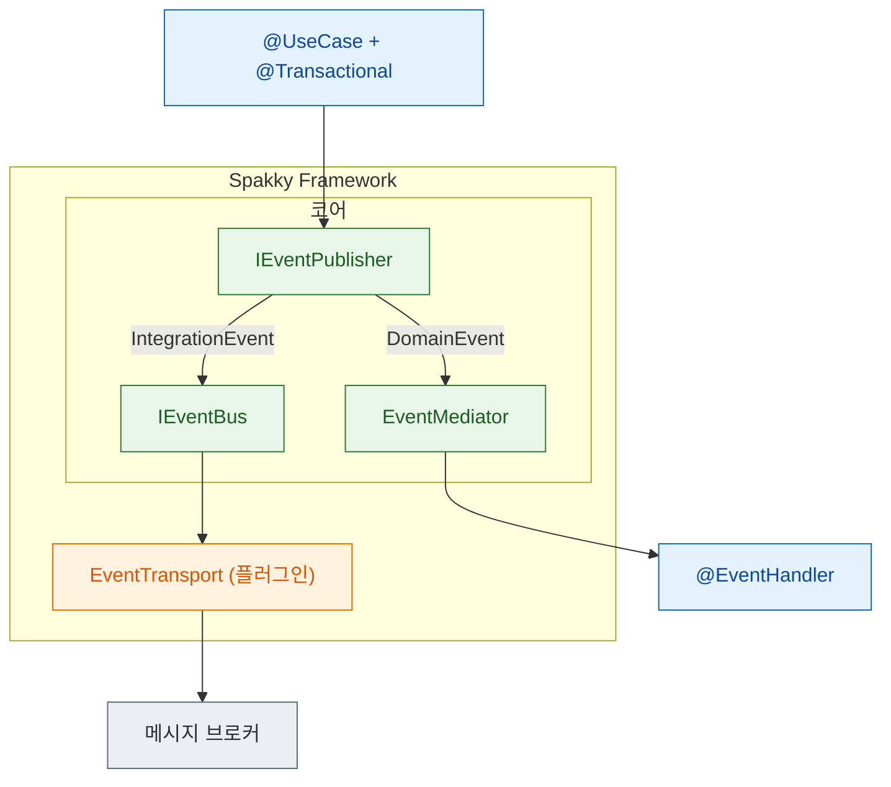

# 이벤트 시스템

> 도메인 이벤트와 통합 이벤트를 발행하고 handler로 처리하는 기본 흐름을, 개념과 사용법으로 나누어 설명합니다.

도메인 이벤트를 자동으로 발행하고 핸들러에서 처리하는 이벤트 기반 아키텍처를 구축합니다. events·outbox·saga가 하나의 분산 워크플로우로 맞물리는 전체 그림은 [이벤트 기반 아키텍처 통합 가이드](event-driven.md)를 참고하세요.

---

## 개념

### 두 가지 이벤트 타입

| 이벤트 타입 | 전달 경로 | 용도 |
| --- | --- | --- |
| `AbstractDomainEvent` | 인프로세스 (`EventMediator`) | 같은 바운디드 컨텍스트 내 상태 변경 알림 |
| `AbstractIntegrationEvent` | 메시지 브로커 (`IEventBus` → RabbitMQ/Kafka) | 서비스/컨텍스트 간 통신 |

두 타입은 모두 `spakky.domain.models.event`에 정의되어 있고, `event_id: UUID`와 `timestamp: datetime`을 자동으로 가집니다. 정의 방법과 공통 속성, AggregateRoot의 이벤트 수집은 [이벤트 시스템 심화](../event-system.md)에서 다룹니다.

### 발행 라우팅

`IEventPublisher.publish()`는 단일 발행 진입점입니다. 이벤트 타입에 따라 인프로세스 핸들러(`EventMediator`)와 브로커(`IEventBus`)로 자동 라우팅합니다. 사용자 코드는 `publish()` 한 번만 호출하면 됩니다.



`@on_event` 핸들러는 `AbstractDomainEvent` 서브클래스에 대해서만 자동 등록됩니다. Integration Event는 핸들러 자동 등록 대상이 아니라, 브로커에서 수신해 transport consumer가 처리합니다.

---

## 사용법

### 이벤트 핸들러 정의

`@EventHandler`와 `@on_event`로 이벤트 핸들러를 선언합니다.

#### 동기 핸들러

```python
from spakky.event.stereotype.event_handler import EventHandler, on_event

@EventHandler()
class OrderEventHandler:
    @on_event(Order.Created)
    def on_order_created(self, event: Order.Created) -> None:
        print(f"주문 생성됨: {event.order_id}, 금액: {event.total_amount}")

    @on_event(Order.ItemAdded)
    def on_item_added(self, event: Order.ItemAdded) -> None:
        print(f"아이템 추가: {event.item_name}")
```

#### 비동기 핸들러

```python
@EventHandler()
class AsyncOrderEventHandler:
    @on_event(Order.Created)
    async def on_order_created(self, event: Order.Created) -> None:
        await send_notification(f"주문 {event.order_id} 접수됨")

    @on_event(Order.ItemAdded)
    async def on_item_added(self, event: Order.ItemAdded) -> None:
        await update_inventory(event.item_name)
```

#### 같은 이벤트, 여러 핸들러

하나의 이벤트에 여러 핸들러를 등록할 수 있습니다. 도메인 이벤트와 통합 이벤트 모두 동일합니다.

```python
@EventHandler()
class NotificationHandler:
    @on_event(Order.Created)
    async def send_email(self, event: Order.Created) -> None:
        await email_service.send(f"주문 {event.order_id} 확인")

@EventHandler()
class AnalyticsHandler:
    @on_event(Order.Created)
    async def track_order(self, event: Order.Created) -> None:
        await analytics.track("order_created", event.total_amount)
```

### 트랜잭션과 연동해 발행

`@Transactional`과 함께 사용하면, 트랜잭션 커밋 후 이벤트가 자동 발행됩니다.

```python
from spakky.core.stereotype.usecase import UseCase
from spakky.data.aspects.transactional import transactional

@UseCase()
class CreateOrderUseCase:
    def __init__(self, order_repository: IOrderRepository) -> None:
        self._order_repository = order_repository

    @transactional
    async def execute(self, customer_name: str, total_amount: float) -> Order:
        # 1. Aggregate 생성 → 이벤트가 내부에 쌓임
        order = Order.create(
            customer_name=customer_name,
            total_amount=total_amount,
        )

        # 2. 아이템 추가 → 추가 이벤트
        order.add_item("노트북")
        order.add_item("마우스")

        # 3. Repository에 저장 → 내부에서 AggregateCollector.collect() 자동 호출
        return await self._order_repository.save(order)
        # 4. @Transactional 완료 시 → commit → 이벤트 자동 발행
```

### 타입별 발행 호출

```python
from spakky.event.publisher.domain_event_publisher import EventPublisher

# DomainEvent → Dispatcher → 인메모리 핸들러
domain_event = Order.Created(order_id=uuid4(), total_amount=1000)
publisher.publish(domain_event)  # EventMediator로 전달

# IntegrationEvent → Bus → 메시지 브로커
integration_event = OrderConfirmed(order_id="ORD-001", total_amount=5000)
publisher.publish(integration_event)  # RabbitMQ/Kafka로 전달
```

### 애플리케이션 설정

```python
import apps
import spakky.data
import spakky.event
from spakky.core.application.application import SpakkyApplication
from spakky.core.application.application_context import ApplicationContext

app = (
    SpakkyApplication(ApplicationContext())
    .load_plugins(include={
        spakky.data.PLUGIN_NAME,
        spakky.event.PLUGIN_NAME,
    })
    .scan(apps)             # @EventHandler 자동 검색
    .start()                # EventHandler ↔ 이벤트 타입 자동 매핑
)
```

!!! info "자동 등록"
    `app.start()` 시점에 `EventHandlerRegistrationPostProcessor`가 `@EventHandler` 클래스를 스캔하여 `@on_event` 메서드를 이벤트 타입별로 자동 등록합니다.

---

## 다음 단계

- [이벤트 기반 아키텍처 통합 가이드](event-driven.md) — events·outbox·saga를 함께 쓰는 분산 워크플로우
- [이벤트 시스템 심화](../event-system.md) — 이벤트 정의, AggregateRoot 이벤트 수집, 인터페이스 구조
- [Transactional Outbox](outbox.md) — Integration Event의 at-least-once 전달 보장
