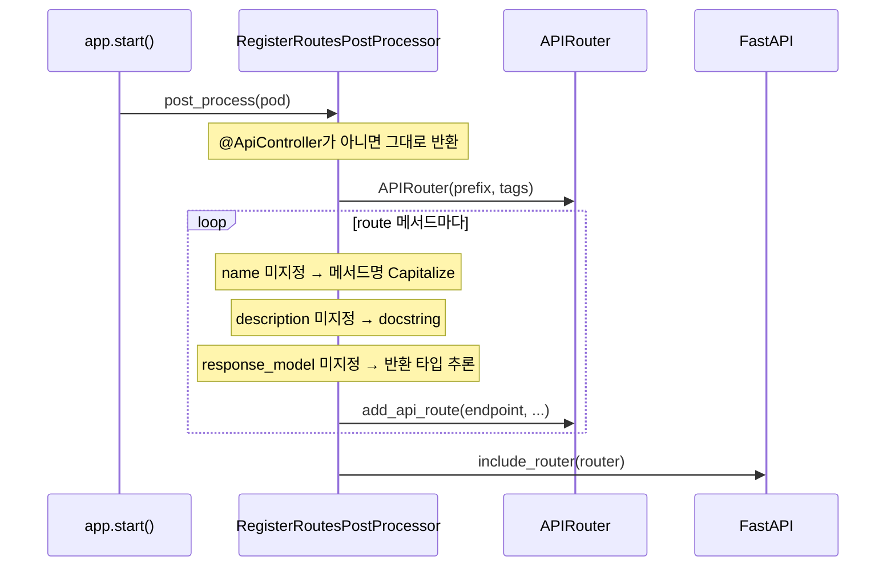

# FastAPI 심화

> `spakky-fastapi`의 라우트 등록 내부 동작과, 운영에서 필요한 커스텀 인스턴스·미들웨어·WebSocket·분산 트레이싱·Agent stream 노출을 다룹니다.

이 문서는 [FastAPI 통합](fastapi.md)의 기초(컨트롤러·라우팅·에러 매핑)를 읽은 뒤 확인하는 심화 가이드입니다. 기본 문서가 "동작하는 컨트롤러"에 집중한다면, 여기서는 등록 과정에서 무슨 일이 일어나는지와 채널 경계에서 자주 마주치는 고급 요구사항을 설명합니다.

## 라우트 등록 내부 동작 { #route-registration }

`app.start()`가 끝나기 전, `RegisterRoutesPostProcessor`가 모든 Pod를 순회하며 `@ApiController`가 붙은 Pod를 찾습니다. 컨트롤러 하나마다 `APIRouter`를 만들고, route 메서드를 `add_api_route()`로 등록한 뒤, 컨테이너에 등록된 모든 `FastAPI` 앱에 `include_router()`로 붙입니다.



`response_model`이 비어 있으면 메서드의 반환 타입 annotation으로 `create_model_field("", return_annotation)`을 시도합니다. FastAPI가 모델 필드를 만들 수 없는 타입(`str`·`dict` 등)이면 `FastAPIError`가 발생하고, 이 경우 `response_model` 없이 등록합니다. 따라서 응답 스키마를 OpenAPI에 노출하려면 반환 타입을 Pydantic 모델로 선언합니다.

등록된 endpoint는 요청마다 `ApplicationContext.clear_context()`를 호출해 CONTEXT scope Pod가 이전 요청과 섞이지 않도록 정리하고, 컨테이너에서 컨트롤러 인스턴스를 다시 resolve해 실제 메서드를 호출합니다. `spakky-auth`를 함께 쓰면 이 경계에서 인증 컨텍스트를 seed하고, `AbstractSpakkyAuthError`를 HTTP 응답으로 매핑합니다.

## 커스텀 FastAPI 인스턴스 { #custom-instance }

기본 앱 대신 직접 만든 `FastAPI` 인스턴스를 쓰려면 플러그인 로드 전에 Pod로 등록합니다. 플러그인은 컨테이너에 이미 `FastAPI` Pod가 있으면 기본 앱을 중복 등록하지 않습니다.

```python
from fastapi import FastAPI
from spakky.core.application.application import SpakkyApplication
from spakky.core.application.application_context import ApplicationContext
from spakky.core.pod.annotations.pod import Pod

import apps
import spakky.plugins.fastapi


@Pod()
def custom_fastapi() -> FastAPI:
    return FastAPI(title="Orders API", version="1.0.0")


spakky_app = (
    SpakkyApplication(ApplicationContext())
    .add(custom_fastapi)
    .load_plugins(include={spakky.plugins.fastapi.PLUGIN_NAME})
    .scan(apps)
    .start()
)
```

`RegisterRoutesPostProcessor`는 컨테이너에 등록된 **모든** `FastAPI` Pod에 라우터를 붙이므로, 여러 `FastAPI` 인스턴스를 등록하면 동일 컨트롤러가 각 앱에 등록됩니다.

## 미들웨어와 에러 처리 { #middleware-error }

`AddBuiltInMiddlewaresPostProcessor`가 `FastAPI` Pod에 기본 미들웨어를 주입합니다. `add_middleware`는 가장 나중에 추가한 미들웨어가 가장 바깥에서 실행되므로, 실행 순서(바깥쪽 우선)는 다음과 같습니다.

1. `TracingMiddleware` — W3C Trace Context 추출/주입 (트레이싱 propagator가 있을 때만)
2. `ErrorHandlingMiddleware` — 예외를 JSON 응답으로 변환

`ErrorHandlingMiddleware`는 `AbstractSpakkyFastAPIError`를 잡아 `to_response()`로 변환하고, 그 외 예외는 로그를 남긴 뒤 `InternalServerError`(500)로 응답합니다. `FastAPI(debug=True)`(또는 `SPAKKY_FASTAPI_DEBUG=true`)이면 500 응답에 traceback이 포함됩니다.

기본 에러로 표현되지 않는 상태 코드가 필요하면 `AbstractSpakkyFastAPIError`를 상속해 `status_code`와 `message`를 선언합니다.

```python
from typing import ClassVar

from fastapi import status
from spakky.plugins.fastapi.error import AbstractSpakkyFastAPIError


class PaymentRequired(AbstractSpakkyFastAPIError):
    message = "Payment Required"
    status_code: ClassVar[int] = status.HTTP_402_PAYMENT_REQUIRED
```

`message`는 클래스 속성으로 정의하고, 추가 컨텍스트가 필요 없으면 `__init__`을 오버라이드하지 않습니다.

## WebSocket

`@websocket` 데코레이터로 WebSocket 엔드포인트를 선언합니다. HTTP route와 마찬가지로 컨트롤러 메서드로 등록되며, 각 연결마다 컨텍스트가 격리됩니다.

```python
from fastapi import WebSocket
from spakky.plugins.fastapi.routes import websocket
from spakky.plugins.fastapi.stereotypes.api_controller import ApiController


@ApiController("/chat")
class ChatController:
    @websocket("/ws")
    async def chat(self, socket: WebSocket) -> None:
        """WebSocket /chat/ws"""
        await socket.accept()
        while True:
            message = await socket.receive_text()
            await socket.send_text(f"Echo: {message}")
```

## 분산 트레이싱 { #tracing }

`spakky-tracing`은 `spakky-fastapi`의 필수 의존성입니다. 컨테이너에 `ITracePropagator`가 등록되어 있으면 `AddBuiltInMiddlewaresPostProcessor`가 `get_or_none(ITracePropagator)`로 propagator를 조회해 `TracingMiddleware`를 자동 등록합니다.

- 수신 요청의 `traceparent` 헤더에서 `TraceContext`를 추출하여 자식 스팬을 생성합니다
- 헤더가 없으면 새로운 루트 트레이스를 시작합니다
- 응답 헤더에 `traceparent`를 자동 주입합니다
- 요청 완료 후 `TraceContext`를 자동으로 정리합니다

별도 설정이나 코드 변경 없이, 플러그인 로드만으로 동작합니다.

## AgentYield stream 노출 { #agent-stream }

`@Agent`는 inbound adapter에서 `@UseCase`처럼 container로 resolve한 뒤 `execute()`를 호출합니다. Agent 전용 FastAPI plugin package를 만들 필요는 없습니다. CodeAssistant demo의 WebSocket 예제는 `core/spakky-agent/examples/inbound_adapter_examples.py`에 있습니다.

```python
from examples.code_assistant_demo import CodeAssistant
from examples.inbound_adapter_examples import (
    agent_signal_from_json,
    agent_yield_to_event,
    code_assistant_command_from_json,
)
from fastapi import WebSocket
from spakky.agent import IAgentSignalRepository
from spakky.core.pod.interfaces.aware.container_aware import IContainerAware
from spakky.core.pod.interfaces.container import IContainer
from spakky.plugins.fastapi.routes import websocket
from spakky.plugins.fastapi.stereotypes.api_controller import ApiController


@ApiController("/agents")
class AgentController(IContainerAware):
    _container: IContainer

    def set_container(self, container: IContainer) -> None:
        self._container = container

    @websocket("/code/ws")
    async def code(self, socket: WebSocket) -> None:
        await socket.accept()
        command = code_assistant_command_from_json(await socket.receive_json())
        agent = self._container.get(CodeAssistant)
        signals = self._container.get(IAgentSignalRepository)

        async for item in agent.execute(command):
            await socket.send_json(agent_yield_to_event(item))
            if item.kind.value == "approval":
                signals.append(
                    agent_signal_from_json(
                        command.state_id,
                        await socket.receive_json(),
                        approval=item.payload,
                    )
                )
```

실제 예제는 inbound JSON을 `CodeAssistantCommand`와 `AgentSignal`로 변환합니다. 핵심은 WebSocket이 transport 변환만 담당하고, agent business workflow는 container에서 얻은 `CodeAssistant.execute()` 안에 남긴다는 점입니다.

SSE나 AG-UI/CopilotKit 연동이 필요하면 [AI Agent 개발](agents.md)의 SSE 및 AG-UI adapter 예제를 사용합니다. Spakky-native SSE는 `AgentYield`를 `data: {"kind": ...}` frame으로 보내고, CopilotKit용 endpoint는 AG-UI `data: {"type": ...}` event stream으로 별도 변환해야 합니다.
