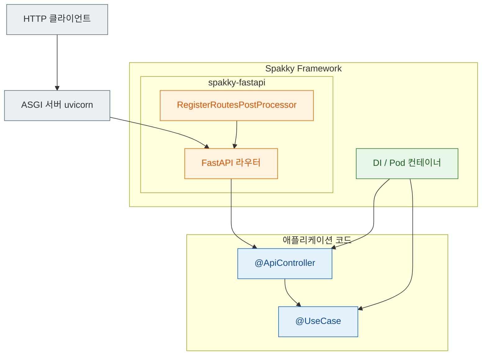

# FastAPI 통합

> `spakky-fastapi`는 FastAPI 엔드포인트를 `@ApiController` 클래스로 구조화합니다.
> Controller Pod를 스캔하면 route decorator가 붙은 메서드를 FastAPI 라우터에 자동 등록합니다.

이 문서는 **처음 HTTP API를 붙일 때 필요한 기초**만 다룹니다. WebSocket·분산 트레이싱 자동 등록·커스텀 FastAPI 인스턴스·라우트 등록 내부 동작 같은 심화 주제는 [FastAPI 심화](fastapi-advanced.md)를 참고하세요.

---

## 요청 처리 흐름

`@ApiController` Pod의 route 메서드 하나가 HTTP 요청을 받기까지의 경로입니다. 사용자 코드(Controller)는 프레임워크 코어(DI/Pod)와 플러그인(`spakky-fastapi`)을 거쳐 ASGI 서버에 연결됩니다.



`app.start()` 시점에 `RegisterRoutesPostProcessor`가 `@ApiController` Pod를 찾아 route 메서드를 `FastAPI` 라우터에 등록합니다. 요청이 들어오면 ASGI 서버 → 라우터 → Controller 메서드 → UseCase 순으로 흐르고, Controller·UseCase 인스턴스는 DI 컨테이너가 제공합니다.

---

## 기본 설정

```python
from fastapi import FastAPI
from spakky.core.application.application import SpakkyApplication
from spakky.core.application.application_context import ApplicationContext
import apps

app = (
    SpakkyApplication(ApplicationContext())
    .load_plugins()
    .scan(apps)
    .start()
)

api: FastAPI = app.container.get(type_=FastAPI)
```

`spakky-fastapi`는 기본 `FastAPI` 앱을 Pod로 제공합니다. `app.start()` 시점에 `RegisterRoutesPostProcessor`가 `@ApiController` Pod를 찾아 `FastAPI.include_router()`로 라우트를 등록합니다. FastAPI 서버는 Spakky가 직접 실행하지 않으므로, ASGI 서버가 import할 수 있는 모듈 전역에 `api` 객체를 노출합니다.

```python
# main.py
from fastapi import FastAPI
from spakky.core.application.application import SpakkyApplication
from spakky.core.application.application_context import ApplicationContext

import apps
import spakky.plugins.fastapi


spakky_app = (
    SpakkyApplication(ApplicationContext())
    .load_plugins(include={spakky.plugins.fastapi.PLUGIN_NAME})
    .scan(apps)
    .start()
)

api: FastAPI = spakky_app.container.get(FastAPI)
```

```bash
export SPAKKY_FASTAPI_TITLE="Orders API"
uvicorn main:api --reload
```

기본 앱의 `title`·`description`·`version`·`debug`는 `FastAPIConfig`(`@Configuration`)가 `SPAKKY_FASTAPI_` 접두사 환경변수에서 읽습니다. 위처럼 `SPAKKY_FASTAPI_TITLE`을 설정하면 OpenAPI 문서 제목이 바뀝니다.

FastAPI lifespan은 `BindLifespanPostProcessor`가 감싸므로, ASGI 서버가 종료될 때 `ApplicationContext.stop()`이 호출되어 `IService`/`IAsyncService` 리소스가 정리됩니다.

---

## @ApiController

### HTTP 메서드 데코레이터

`@ApiController(prefix)`는 클래스를 REST 컨트롤러로 등록하고, `prefix`를 모든 route 앞에 붙입니다. 메서드에는 `spakky.plugins.fastapi.routes`의 `get`·`post`·`put`·`patch`·`delete`·`head`·`options`·`websocket` 데코레이터를 사용합니다.

```python
from pydantic import BaseModel
from fastapi.responses import PlainTextResponse
from spakky.plugins.fastapi.routes import (
    get, post, put, patch, delete, head, options,
)
from spakky.plugins.fastapi.stereotypes.api_controller import ApiController

class UserRequest(BaseModel):
    name: str
    email: str

class UserResponse(BaseModel):
    id: str
    name: str
    email: str

@ApiController("/users")
class UserController:
    _service: UserService

    def __init__(self, service: UserService) -> None:
        self._service = service

    @get("", response_class=PlainTextResponse)
    async def list_users(self) -> str:
        """GET /users"""
        return "User list"

    @get("/{user_id}")
    async def get_user(self, user_id: str) -> UserResponse:
        """GET /users/{user_id}"""
        user = self._service.get_user(user_id)
        return UserResponse(id=user_id, name=user.name, email=user.email)

    @post("")
    async def create_user(self, request: UserRequest) -> UserResponse:
        """POST /users"""
        user = self._service.create(request.name, request.email)
        return UserResponse(id=str(user.uid), name=user.name, email=user.email)

    @put("/{user_id}")
    async def update_user(self, user_id: str, request: UserRequest) -> UserResponse:
        """PUT /users/{user_id}"""
        user = self._service.update(user_id, request.name, request.email)
        return UserResponse(id=user_id, name=user.name, email=user.email)

    @patch("/{user_id}")
    async def patch_user(self, user_id: str, request: UserRequest) -> UserResponse:
        """PATCH /users/{user_id}"""
        return UserResponse(id=user_id, name=request.name, email=request.email)

    @delete("/{user_id}")
    async def delete_user(self, user_id: str) -> dict:
        """DELETE /users/{user_id}"""
        self._service.delete(user_id)
        return {"deleted": user_id}

    @head("")
    async def head_users(self) -> None:
        """HEAD /users"""
        ...

    @options("")
    async def options_users(self) -> str:
        """OPTIONS /users"""
        return "GET, POST, PUT, PATCH, DELETE"
```

반환 타입이 Pydantic 모델이면 `RegisterRoutesPostProcessor`가 `response_model`을 자동 추론합니다. 메서드 docstring은 route `description`으로, 메서드명은 route `name`(예: `list_users` → `List Users`)으로 자동 채워집니다. 이 추론·등록의 내부 동작은 [FastAPI 심화](fastapi-advanced.md#route-registration)에서 다룹니다.

### UseCase와 에러 매핑

Controller에는 Repository를 직접 주입하지 말고 `@UseCase()` Pod를 주입합니다. 예상 가능한 HTTP 실패는 `spakky.plugins.fastapi.error`의 에러 클래스로 변환하면 `ErrorHandlingMiddleware`가 JSON 응답으로 바꿉니다.

```python
from pydantic import BaseModel

from spakky.plugins.fastapi.error import Conflict, NotFound
from spakky.plugins.fastapi.routes import get, post
from spakky.plugins.fastapi.stereotypes.api_controller import ApiController


class CreateOrderRequest(BaseModel):
    customer_id: str
    total_amount: float


class OrderResponse(BaseModel):
    order_id: str
    status: str


@ApiController("/orders")
class OrderController:
    def __init__(
        self,
        create_order: CreateOrderUseCase,
        get_order: GetOrderUseCase,
    ) -> None:
        self._create_order = create_order
        self._get_order = get_order

    @post("", status_code=201)
    async def create_order(self, request: CreateOrderRequest) -> OrderResponse:
        result = await self._create_order.execute(
            request.customer_id,
            request.total_amount,
        )
        if result.conflicted:
            raise Conflict()
        return OrderResponse(order_id=str(result.order_id), status=result.status)

    @get("/{order_id}")
    async def get_order(self, order_id: str) -> OrderResponse:
        order = await self._get_order.execute(order_id)
        if order is None:
            raise NotFound()
        return OrderResponse(order_id=str(order.uid), status=order.status.value)
```

`@post(..., status_code=201)`처럼 route decorator에 전달한 옵션은 내부 `Route` annotation에 저장되고 그대로 `FastAPI.add_api_route()`에 전달됩니다.

`spakky.plugins.fastapi.error`가 제공하는 기본 에러 클래스는 다음과 같습니다. 모두 `AbstractSpakkyFastAPIError`를 상속하며 `to_response()`로 JSON 응답으로 변환됩니다.

| 에러 클래스 | HTTP 상태 코드 |
| --- | --- |
| `BadRequest` | 400 |
| `Unauthorized` | 401 |
| `Forbidden` | 403 |
| `NotFound` | 404 |
| `Conflict` | 409 |
| `InternalServerError` | 500 |

미들웨어 실행 순서와 커스텀 에러 정의는 [FastAPI 심화](fastapi-advanced.md#middleware-error)에서 다룹니다.

---

## 라우트 옵션

FastAPI의 라우트 옵션을 데코레이터에 전달할 수 있습니다.

```python
from fastapi.responses import FileResponse

@ApiController("/files")
class FileController:
    @get(
        "/{filename}",
        response_class=FileResponse,
        name="Download File",
        description="파일 다운로드 엔드포인트",
    )
    async def download(self, filename: str) -> str:
        return f"storage/{filename}"
```

---

## 다음 단계

| 주제 | 문서 |
| --- | --- |
| 라우트 등록 내부 동작·`response_model` 추론 | [FastAPI 심화](fastapi-advanced.md#route-registration) |
| 커스텀 FastAPI 인스턴스 | [FastAPI 심화](fastapi-advanced.md#custom-instance) |
| 미들웨어 순서·커스텀 에러 | [FastAPI 심화](fastapi-advanced.md#middleware-error) |
| WebSocket | [FastAPI 심화](fastapi-advanced.md#websocket) |
| 분산 트레이싱 자동 등록 | [FastAPI 심화](fastapi-advanced.md#tracing) |
| Agent stream 노출 | [FastAPI 심화](fastapi-advanced.md#agent-stream) |
