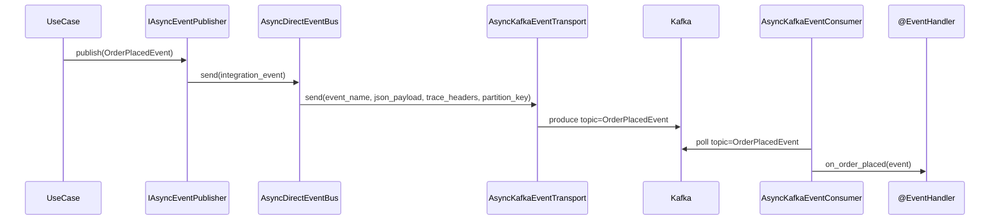

# Kafka 통합

> `spakky-kafka`는 `IEventTransport` 인터페이스를 통해 Integration Event를 Apache Kafka로 전송하고, 백그라운드 Consumer로 수신합니다.
> `AbstractIntegrationEvent.event_name` 값을 Kafka topic으로 사용하므로 발행자와 소비자가 같은 이벤트 타입 계약을 공유해야 합니다.

---

## 동작 원리

1. `@EventHandler`의 `@on_event` 메서드가 `KafkaPostProcessor`에 의해 Consumer에 자동 등록
2. Integration Event 발행 시 `KafkaEventTransport`가 Kafka 토픽으로 전송
3. `KafkaEventConsumer`가 백그라운드 서비스로 토픽을 소비하며 핸들러에 dispatch

Transport는 producer를 발행마다 새로 만들지 않고 하나를 재사용합니다. 비동기 transport는 애플리케이션이 서비스를 시작할 때 producer를 열고 종료할 때 닫으므로, 브로커 연결과 메타데이터 조회가 발행마다 반복되지 않고 producer 단위 설정(배치·멱등 발행)이 수명 내내 유지됩니다. 시작 시점에 브로커에 연결하지 못하면 `app.start()`가 실패하며, 애플리케이션 수명 밖의 발행은 `EventTransportNotRunningError`로 거부됩니다.

---

## 설정

`KafkaConnectionConfig`는 `@Configuration`이므로 환경변수에서 자동 로딩됩니다.
발행 예제는 `IAsyncEventPublisher`와 event bus를 사용하므로 `spakky-kafka`와 함께 `spakky-event`를 설치하고 로드해야 합니다. Kafka만 쓴다면 `pip install "spakky[events-kafka]"`가 가장 가볍습니다. RabbitMQ, Kafka, Outbox를 한 번에 실험하려면 `pip install "spakky[event-driven]"`를 사용하세요.

```python
from spakky.core.application.application import SpakkyApplication
from spakky.core.application.application_context import ApplicationContext
import spakky.event
import spakky.plugins.kafka
import apps

app = (
    SpakkyApplication(ApplicationContext())
    .load_plugins(include={
        spakky.event.PLUGIN_NAME,
        spakky.plugins.kafka.PLUGIN_NAME,
    })
    .scan(apps)
    .start()
)
```

환경변수 예시:

```bash
export SPAKKY_KAFKA__GROUP_ID=my-consumer-group
export SPAKKY_KAFKA__CLIENT_ID=my-app
export SPAKKY_KAFKA__BOOTSTRAP_SERVERS=localhost:9092
export SPAKKY_KAFKA__AUTO_OFFSET_RESET=earliest
export SPAKKY_KAFKA__POLL_TIMEOUT=1.0
```

| 필드 | 환경변수 | 기본값 | 설명 |
|------|---------|--------|------|
| `group_id` | `SPAKKY_KAFKA__GROUP_ID` | (필수) | Consumer 그룹 ID |
| `client_id` | `SPAKKY_KAFKA__CLIENT_ID` | (필수) | Kafka 클라이언트 ID |
| `bootstrap_servers` | `SPAKKY_KAFKA__BOOTSTRAP_SERVERS` | (필수) | 부트스트랩 서버 주소 |
| `security_protocol` | `SPAKKY_KAFKA__SECURITY_PROTOCOL` | `None` | 보안 프로토콜 |
| `sasl_mechanism` | `SPAKKY_KAFKA__SASL_MECHANISM` | `None` | SASL 인증 메커니즘 |
| `sasl_username` | `SPAKKY_KAFKA__SASL_USERNAME` | `None` | SASL 사용자명 |
| `sasl_password` | `SPAKKY_KAFKA__SASL_PASSWORD` | `None` | SASL 비밀번호 |
| `number_of_partitions` | `SPAKKY_KAFKA__NUMBER_OF_PARTITIONS` | `1` | 토픽 파티션 수 |
| `replication_factor` | `SPAKKY_KAFKA__REPLICATION_FACTOR` | `1` | 토픽 복제 팩터 |
| `auto_offset_reset` | `SPAKKY_KAFKA__AUTO_OFFSET_RESET` | `earliest` | 오프셋 리셋 정책 |
| `poll_timeout` | `SPAKKY_KAFKA__POLL_TIMEOUT` | `1.0` | 폴링 타임아웃 (초) |
| `dead_letter_topic_suffix` | `SPAKKY_KAFKA__DEAD_LETTER_TOPIC_SUFFIX` | `.dlt` | 원본 토픽에 붙여 dead-letter 토픽 이름을 만드는 접미사 |
| `max_handler_retries` | `SPAKKY_KAFKA__MAX_HANDLER_RETRIES` | `0` | dead-letter로 보내기 전 핸들러를 다시 호출하는 횟수 |
| `dead_letter_delivery_timeout` | `SPAKKY_KAFKA__DEAD_LETTER_DELIVERY_TIMEOUT` | `10.0` | dead-letter 레코드 배달을 기다리는 최대 시간 (초) |

---

## 이벤트 발행

Integration Event를 발행하면 `EventPublisher`가 `IEventBus`를 통해 `KafkaEventTransport`로 전달합니다.

```python
from uuid import UUID
from spakky.core.common.mutability import immutable
from spakky.domain.models.event import AbstractIntegrationEvent

@immutable
class OrderPlacedEvent(AbstractIntegrationEvent):
    order_id: UUID
    total_amount: float
```

```python
from spakky.core.stereotype.usecase import UseCase
from spakky.event.event_publisher import IAsyncEventPublisher

@UseCase()
class PlaceOrderUseCase:
    _publisher: IAsyncEventPublisher

    def __init__(self, publisher: IAsyncEventPublisher) -> None:
        self._publisher = publisher

    async def execute(self, order_id: UUID, total: float) -> None:
        event = OrderPlacedEvent(order_id=order_id, total_amount=total)
        await self._publisher.publish(event)
```

---

## 이벤트 수신

`@EventHandler`와 `@on_event`로 수신 핸들러를 정의합니다. `KafkaPostProcessor`가 자동으로 Consumer에 등록합니다.

```python
from spakky.event.stereotype.event_handler import EventHandler, on_event

@EventHandler()
class OrderEventHandler:
    @on_event(OrderPlacedEvent)
    async def on_order_placed(self, event: OrderPlacedEvent) -> None:
        print(f"주문 접수: {event.order_id}, 금액: {event.total_amount}")
```

토픽 이름은 이벤트 인스턴스의 `event_name`과 같은 값으로 자동 결정됩니다. 기본값은 이벤트 클래스명(예: `OrderPlacedEvent`)이며, custom `event_name` property를 오버라이드하면 발행 topic과 소비 topic이 함께 그 값을 사용합니다. 토픽이 존재하지 않으면 `number_of_partitions`와 `replication_factor` 설정값으로 자동 생성합니다.

---

## 파티션 키로 순서 보장하기

Kafka가 보장하는 순서는 파티션 안에서만 성립합니다. 파티션이 2개 이상인 토픽에서 같은 주문의 생성/취소 이벤트가 서로 다른 파티션으로 흩어지면, 소비자는 생성보다 취소를 먼저 볼 수 있습니다.

`AbstractIntegrationEvent.partition_key`를 오버라이드하면 같은 키를 가진 이벤트가 항상 같은 파티션으로 갑니다. 보통 aggregate id를 키로 씁니다. 파티션 키는 순서 보장의 **전제 조건**이며, 발행 경로가 그 키의 상대 순서를 함께 지켜야 순서가 완결됩니다(아래 참고 참조).

```python
from spakky.core.common.mutability import immutable
from spakky.domain.models.event import AbstractIntegrationEvent
from typing import override


@immutable
class OrderPlacedEvent(AbstractIntegrationEvent):
    order_id: str
    total_amount: int

    @property
    @override
    def partition_key(self) -> str | None:
        return self.order_id
```

기본값은 `None`이고, 이때 Kafka는 지금까지와 동일하게 라운드로빈으로 파티션을 배정합니다. 즉 `partition_key`를 선언하지 않은 기존 이벤트의 동작은 바뀌지 않습니다.

`spakky-outbox`를 함께 쓰면 bus가 이벤트의 `partition_key`를 Outbox 레코드의 `partition_key` 컬럼에 저장하고, Relay가 그 값을 그대로 Kafka transport에 넘깁니다.

!!! note "Outbox 경로에서 키 단위 순서가 지켜지는 방식"
    `spakky-outbox`를 경유하면 릴레이가 파티션 키 단위 상대 순서를 보전합니다. 순서를 지키는 대가는 실패한 키의 지연입니다.

    - **배치 확정과 거부 귀속**: 릴레이는 배치의 메시지를 순차로 `send`한 뒤 배치 끝에서 `flush()` 한 번으로 확정합니다. `flush()`가 실패하면 어느 레코드가 거부됐는지 그 자리에서 알 수 없으므로, 릴레이가 같은 배치를 1건씩 다시 `send` + `flush` 하여 거부를 메시지에 귀속시킵니다. 거부된 메시지만 자기 키를 보류하고 재시도 예산을 씁니다 — 이 귀속이 없으면 브로커가 영구 거부하는 메시지(메시지 크기 초과·ACL 거부 등)의 재시도 횟수가 영원히 오르지 않아 그 키가 무기한 정지합니다. 반대로 브로커에 닿지 못해 실패한 경우에는 재확인을 멈추고 배치를 미발행으로 남깁니다 — 장애로 멀쩡한 메시지의 예산을 소모시키지 않습니다.
    - **개별 전송 실패**: 어떤 키의 메시지를 producer에 넘기는 것 자체가 실패하거나 위 재확인에서 거부되면 릴레이는 같은 배치에 있는 그 키의 후속 메시지를 발행하지 않고 보류합니다. 그 키는 실패한 메시지가 발행될 때까지 진행하지 않으며, 재개는 그 메시지의 claim이 만료된 뒤(`claim_timeout_seconds`, 기본 300초)입니다.
    - **릴레이 다중 인스턴스**: `fetch_pending()`은 파티션 키를 통째로 claim합니다. 그 키의 가장 오래된 미발행 메시지를 잡은 인스턴스만 그 키를 진행하므로, 두 인스턴스가 같은 키를 병렬 발행하지 않습니다.
    - **재시도 소진**: 어떤 메시지가 `max_retry_count`를 소진하면 릴레이가 그 메시지를 발행 포기(abandoned) 처리하고 키를 다시 진행시킵니다. 그 키의 순서 보장은 포기된 메시지까지이며, 그 이후 메시지는 포기된 메시지 없이 발행됩니다. 포기 사실은 `abandoned_at`으로 남으므로 운영자가 무엇이 빠졌는지 조회할 수 있습니다 — 조회 쿼리는 [Outbox 가이드](outbox.md) 참조.
    - **producer 재시도**: 프레임워크가 `enable.idempotence=true`를 고정하고 transport가 producer를 애플리케이션 수명 동안 하나로 유지하므로, 그 수명 안의 재시도는 파티션 내 순서를 뒤집지 않습니다. 다만 프로세스가 재시작하면 새 producer 세션이 시작되어 이전 세션과의 상대 순서까지는 보장하지 않습니다.

    파티션 키가 없는 메시지에는 보류 제약이 적용되지 않습니다 — 실패한 메시지를 건너뛰고 계속 발행합니다. 키 단위 claim은 파티션 키가 있는 행에만 조건을 걸므로 키 없는 메시지의 claim 경로도 종전과 같습니다.

    **storage 구현 조건**: 위 다중 인스턴스 보장은 Outbox storage가 키 단위 claim을 구현할 때 성립합니다. 프레임워크가 제공하는 `SqlAlchemyOutboxStorage`는 `SELECT ... FOR UPDATE SKIP LOCKED`를 지원하는 백엔드(PostgreSQL 9.5+, MySQL 8.0+)에서 이를 구현합니다 — 지원하지 않는 백엔드에서는 릴레이를 단일 인스턴스로 운영해야 합니다.

---

## 운영 흐름

`IAsyncEventPublisher.publish()`는 Integration Event를 `IAsyncEventBus`로 넘기고, `AsyncDirectEventBus`가 이벤트를 JSON bytes로 직렬화한 뒤 `AsyncKafkaEventTransport`에 전달합니다. Kafka transport는 이벤트 이름을 topic으로 사용하고 trace header를 Kafka headers로 보냅니다.



운영 시에는 아래 항목을 명시적으로 정합니다.

| 항목 | 규칙 |
|------|------|
| topic | `AbstractIntegrationEvent.event_name` 값, 기본은 클래스명 |
| payload | Pydantic `TypeAdapter`가 만든 JSON bytes |
| headers | `ITracePropagator.inject()`가 넣은 trace header |
| partition key | `AbstractIntegrationEvent.partition_key` 값, 기본은 `None`(라운드로빈) |
| consumer group | `SPAKKY_KAFKA__GROUP_ID` |
| topic 생성 | 없으면 `number_of_partitions`, `replication_factor`로 생성 (dead-letter 토픽 포함) |
| offset reset | `SPAKKY_KAFKA__AUTO_OFFSET_RESET` (`earliest`/`latest`/`none`) |
| 처리 실패 | `<topic>` + `dead_letter_topic_suffix` 토픽으로 전달 |
| offset 커밋 | 자동 커밋 없음. 실패가 dead-letter에 저장된 뒤에만 consumer가 직접 커밋 |

`spakky-outbox`를 함께 로드하면 `OutboxEventBus` / `AsyncOutboxEventBus`가 기본 bus를 대체하므로 이벤트는 Kafka에 즉시 produce되지 않고 Outbox 테이블에 저장됩니다. Relay가 재시도 가능한 방식으로 Kafka transport를 호출하므로, 주문 생성 같은 DB 변경과 Kafka 발행을 원자적으로 묶어야 할 때 기본 선택은 Outbox 조합입니다.

---

## 처리 실패 메시지 (dead-letter)

핸들러가 실패하거나 메시지 본문이 이벤트 타입으로 역직렬화되지 않으면, Consumer는 그 메시지를 원본 토픽 이름에 `dead_letter_topic_suffix`(기본 `.dlt`)를 붙인 토픽으로 보냅니다. 예를 들어 `OrderPlacedEvent` 처리에 실패하면 `OrderPlacedEvent.dlt`로 전달됩니다. dead-letter 토픽은 `initialize` 시점에 구독 토픽과 함께 자동 생성됩니다.

원본 본문과 key는 바이트 그대로 전달합니다. 원본 헤더는 consumer가 읽은 문자열 형태로 함께 실리므로, 값이 UTF-8 문자열이 아닌 헤더와 값이 없는 헤더는 옮겨지지 않습니다. 여기에 다음 헤더를 덧붙입니다. 재처리 도구는 본문을 열지 않고 이 헤더만으로 판단할 수 있습니다.

| 헤더 | 값 |
|------|-----|
| `x-spakky-dead-letter-original-topic` | 원본 토픽 이름 |
| `x-spakky-dead-letter-original-partition` | 원본 파티션 번호 |
| `x-spakky-dead-letter-original-offset` | 원본 오프셋 |
| `x-spakky-dead-letter-original-timestamp` | 원본 메시지 타임스탬프 |
| `x-spakky-dead-letter-consumer-group` | 처리에 실패한 consumer group |
| `x-spakky-dead-letter-exception-type` | 예외 클래스 이름 |
| `x-spakky-dead-letter-exception-message` | 예외 메시지 |

dead-letter 발행은 `dead_letter_delivery_timeout`(기본 10초)까지만 배달을 기다립니다. 레코드가 크기 제한을 넘거나 producer 큐가 가득 찼거나 브로커가 거절하면 오류 로그를 남기고 consumer는 계속 폴링합니다 — 실패가 조용히 사라지지도, 소비가 멈추지도 않습니다.

비동기 consumer에서 시간 안에 배달 확인을 받지 못한 경우는 확정 실패와 구분해 "unconfirmed" 로그를 남깁니다. 이때 레코드는 producer 배치에 남아 나중에 실제로 배달될 수 있으므로, 그 로그만 근거로 수동 재발행하면 dead-letter 토픽에 중복이 생깁니다.

`max_handler_retries`를 0보다 크게 설정하면 dead-letter로 보내기 전에 같은 메시지로 핸들러를 그 횟수만큼 다시 호출합니다. 재호출은 해당 이벤트에 등록된 모든 핸들러를 다시 실행하므로, 이 값을 올리려면 핸들러가 멱등해야 합니다. 역직렬화 실패는 같은 본문으로 다시 시도해도 결과가 같으므로 이 설정과 무관하게 즉시 dead-letter로 보냅니다.

지연 재시도 토픽 계층은 두지 않습니다. 메시지를 다른 토픽으로 옮기는 순간 그 aggregate의 파티션 내 순서가 깨지기 때문입니다.

---

## 전달 의미와 핸들러 멱등성

전달 의미는 **at-least-once**입니다. 같은 이벤트가 두 번 이상 핸들러에 전달될 수 있으므로 핸들러는 멱등해야 합니다.

`KafkaConnectionConfig`가 producer 설정과 consumer 설정을 분리하고, 각각의 기본값을 프레임워크가 고정합니다. 환경변수로 바꾸는 항목이 아닙니다.

| 대상 | 고정 설정 | 이유 |
|------|----------|------|
| Producer (이벤트 발행 + dead-letter 발행) | `enable.idempotence=true`, `acks=all` | 한 producer 세션의 재시도가 중복 발행이나 파티션 내 순서 역전을 만들지 않고, 승인된 이벤트가 파티션 리더 장애에도 남습니다 |
| Consumer | `enable.auto.commit=false` | offset이 핸들러 실행 전에 전진하지 않습니다 |

`AsyncKafkaEventTransport`는 `AIOKafkaProducer`를 애플리케이션 수명 동안 하나로 유지하므로, 멱등 producer의 시퀀스 번호가 그 수명 내내 이어집니다. 서로 다른 `send` 호출 사이에서도 중복 발행과 파티션 내 순서 역전이 막힙니다 — 멱등 시퀀스는 producer 인스턴스에 묶여 있어, 발행마다 producer를 새로 만들면 이 보장이 성립하지 않습니다.

Consumer는 핸들러가 끝난 뒤, 그 메시지를 처리 완료로 볼지 다시 받을지 결정합니다.

| 핸들러 결과 | offset | 이후 동작 |
|------------|--------|----------|
| 성공 | 커밋 | 다음 메시지로 진행 |
| 실패 → dead-letter 발행 성공 | 커밋 | 실패가 `.dlt` 토픽에 남았으므로 파티션이 막히지 않습니다 |
| 실패 → dead-letter 발행 실패·미확인 | 커밋 안 함 + 그 메시지로 `seek` 되감기 | 다음 poll이 같은 메시지를 다시 전달합니다 |
| AuthContext DENY / snapshot CHALLENGE | 커밋 | 재시도해도 같은 결정이므로 파티션을 막지 않음 |
| 검증 provider 장애 | 커밋 안 함 | 예외를 전파하여 consumer 루프를 중단합니다. 재시작하면 그 메시지부터 다시 처리합니다 |

**offset은 실패가 다른 곳에 저장된 뒤에만 전진합니다.** dead-letter 발행이 실패했는데 커밋해 버리면 그 이벤트의 마지막 사본이 사라지므로, 발행 실패는 커밋 대신 되감기로 이어집니다.

커밋을 건너뛰는 것만으로는 재처리가 성립하지 않습니다. `enable.auto.commit=false`는 브로커 커밋만 끄고, consumer의 소비 위치는 poll마다 전진합니다. 되감지 않으면 뒤따르는 메시지의 성공 커밋이 실패한 메시지의 offset을 지나쳐 버리고, 그 메시지는 rebalance나 재시작으로도 돌아오지 않습니다.

멱등성은 보통 이벤트 식별자로 확보합니다. 이미 처리한 `AbstractIntegrationEvent`의 `event_id`를 저장해 두고 중복 수신을 건너뛰거나, 핸들러의 DB 반영을 upsert로 작성합니다.

```python
@EventHandler()
class OrderEventHandler:
    def __init__(self, repository: ProcessedEventRepository) -> None:
        self._repository = repository

    @on_event(OrderPlacedEvent)
    async def on_order_placed(self, event: OrderPlacedEvent) -> None:
        if await self._repository.exists(event.event_id):
            return
        await self._repository.save(event.event_id)
```

메시지 단위 동기 커밋은 브로커 왕복을 한 번 추가합니다. 처리량이 커밋 지연에 지배되면 파티션 수를 늘려 consumer를 병렬화합니다.

---

## SASL 인증

프로덕션 환경에서 SASL 인증을 사용하려면:

```bash
export SPAKKY_KAFKA__SECURITY_PROTOCOL=SASL_SSL
export SPAKKY_KAFKA__SASL_MECHANISM=PLAIN
export SPAKKY_KAFKA__SASL_USERNAME=my-api-key
export SPAKKY_KAFKA__SASL_PASSWORD=my-api-secret
```

---

## 분산 트레이싱

`spakky-tracing`은 `spakky-kafka`의 필수 의존성입니다. 컨테이너에 `ITracePropagator`가 등록되어 있으면 메시지 헤더를 통해 `TraceContext`가 자동 전파됩니다.

- **발행 측**: `OutboxEventBus` 또는 `DirectEventBus`가 현재 `TraceContext`를 메시지 헤더에 주입. `SPAKKY_AUTH_SNAPSHOT_PROPAGATION_ENABLED=true`가 설정되어 있으면 raw bearer token 대신 signed `AuthContextSnapshot` metadata도 함께 주입
- **수신 측**: `KafkaEventConsumer`가 헤더에서 `TraceContext`를 추출하여 자식 span 생성
- 헤더가 없으면 새로운 루트 트레이스를 시작
- `ITracePropagator`가 컨테이너에 없으면 트레이싱은 비활성 상태로, 별도 에러 없이 동작합니다

별도 설정이나 코드 변경 없이, 플러그인 로드만으로 동작합니다.
