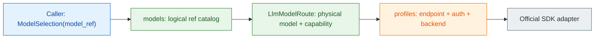

# LLM 모델 라우팅

> 애플리케이션은 `support/primary` 같은 논리 모델만 선택하고, 운영자는 실제 provider 연결과 모델 ID를 설정으로 교체합니다.
> 이 가이드는 `spakky-llm`의 model catalog를 직접 구성하거나 환경변수로 주입하고, Python·AG-UI·A2A에서 같은 선택 계약을 사용하는 방법을 설명합니다.

## 설계 한눈에 보기

`spakky-llm`은 모델 선택을 세 층으로 나눕니다.



| 층 | 소유자 | 담는 값 | 담지 않는 값 |
| --- | --- | --- | --- |
| `ModelSelection` | 호출자 | `model_ref` 하나 | provider, profile, raw model, credential, endpoint |
| `LlmModelRoute` | 운영자 | profile 참조, 실제 모델 ID, capability, vLLM model option | API key, base URL |
| `LlmProfile` | 운영자 | provider 표식, API family, endpoint, auth, timeout, retry | 실제 모델 ID, model capability |

이 경계 덕분에 애플리케이션 코드는 `support/primary`를 유지한 채 실제 Anthropic 모델을
Vertex AI나 OpenRouter route로 교체할 수 있습니다. `provider`는 진단 metadata에 남는
운영자 소유 식별자일 뿐 호출자가 provider를 고르는 입력이 아닙니다.

## 설치와 기본 동작

```bash
pip install spakky-llm
```

별도 설정이 없으면 `LlmConfig()`는 다음 catalog를 만듭니다.

| 항목 | 기본값 | 의미 |
| --- | --- | --- |
| `default_model` | `assistant/default` | 선택이 없을 때 사용할 논리 모델 ref |
| route | `assistant/default -> vllm-local / default` | 실제 provider model은 `default` |
| profile | `vllm-local` | `http://127.0.0.1:8000/v1`의 OpenAI-compatible vLLM 연결 |
| capability | tools, structured output | 나머지는 `ModelCapability` 기본값 |

기본값은 로컬 vLLM 서버를 명시적으로 선택합니다. 운영 환경에 맞는 catalog가 있다면
`profiles`, `models`, `default_model` 세 필드를 함께 대체하세요. 일부 필드만 잘못
덮어써 SDK의 ambient 기본값으로 흘러가는 경로는 허용되지 않습니다.

## Python에서 직접 구성하기

다음은 Anthropic 연결 하나를 `support/primary`라는 제품 언어 뒤에 숨기는 최소 구성입니다.

```python
from os import environ

from pydantic import SecretStr
from spakky.agent import ModelCapability
from spakky.plugins.llm.config import (
    LlmConfig,
    LlmModelRoute,
    LlmProfile,
    LlmProviderApi,
)


config = LlmConfig(
    default_model="support/primary",
    profiles={
        "managed_text": LlmProfile(
            provider="anthropic",
            api=LlmProviderApi.ANTHROPIC_MESSAGES,
            api_key=SecretStr(environ["ANTHROPIC_API_KEY"]),
            max_retries=2,
        ),
    },
    models={
        "support/primary": LlmModelRoute(
            profile="managed_text",
            model="claude-opus-4-1",
            capability=ModelCapability(
                supports_reasoning=True,
                supports_tools=True,
                supports_structured_output=True,
            ),
        ),
    },
)
```

`LlmConfig` 생성자는 keyword-only이며 공개 입력은 `default_model`, `profiles`, `models`
뿐입니다. `LlmProfile`과 `LlmModelRoute`도 알 수 없는 필드를 거부합니다. 따라서 예전
`default_profile`, profile의 `model`, 요청별 provider/profile/raw model override는
호환 alias로 남지 않습니다.

## 환경변수로 구성하기

`LlmConfig`는 `SPAKKY_LLM__` prefix와 `__` 중첩 구분자를 사용합니다. Profile처럼
환경변수 이름으로 표현하기 쉬운 map은 중첩 key로, `/`가 들어간 opaque model ref는
JSON object로 전달하면 읽기 쉽고 shell key 제약도 피할 수 있습니다.

```bash
export SPAKKY_LLM__DEFAULT_MODEL='support/primary'
export SPAKKY_LLM__PROFILES__MANAGED_TEXT__PROVIDER='anthropic'
export SPAKKY_LLM__PROFILES__MANAGED_TEXT__API='anthropic-messages'
export SPAKKY_LLM__PROFILES__MANAGED_TEXT__API_KEY="$ANTHROPIC_API_KEY"
export SPAKKY_LLM__PROFILES__MANAGED_TEXT__MAX_RETRIES='2'
export SPAKKY_LLM__MODELS='{"support/primary":{"profile":"managed_text","model":"claude-opus-4-1","capability":{"supports_reasoning":true,"supports_tools":true,"supports_structured_output":true}}}'
```

배포 시스템은 API key나 service-account 파일을 runtime secret 또는 workload identity로
주입해야 합니다. 모델 요청 body, `RunAgentInput.metadata`, AG-UI/A2A payload는 credential
전달 경로가 아닙니다.

`SPAKKY_LLM__DEFAULT_PROFILE` 같은 legacy top-level key, `PROFILSE` 같은 오타, profile이나
route의 알 수 없는 중첩 필드는 시작 단계에서 실패합니다. `profiles`와 `models`가 비었거나,
`default_model`이 catalog에 없거나, route가 없는 profile을 가리켜도 시작할 수 없습니다.

Nested environment map segment는 case-insensitive settings source를 거치며 소문자 key가
됩니다. 위 `MANAGED_TEXT` segment가 route에서 `managed_text`를 가리키는 이유입니다.
`Support/Primary`처럼 case를 보존해야 하는 profile/model key는 `PROFILES`나 `MODELS`
전체 JSON object로 전달하세요. Direct Python mapping과 JSON object의 key는 case를
보존합니다.

명시 생성자 인자는 같은 field의 environment source보다 우선하며, env JSON을 decode하기
전에 그 field를 mask합니다. 예를 들어 `profiles=...`를 직접 넘기면 malformed
`SPAKKY_LLM__PROFILES`가 있어도 읽지 않지만 `MODELS`와 `DEFAULT_MODEL` environment 값은
계속 처리합니다. 세 field를 모두 직접 넘기면 prefixed environment catalog와 unrelated
prefixed key를 읽거나 감사하지 않습니다. Environment JSON을 사용하는 경로에서는
logical ref 중복뿐 아니라 route 내부 중복 key도 모든 depth에서 거부하며
last-key-wins로 처리하지 않습니다.

## Provider 연결 recipe

### OpenRouter와 표준 OpenAI-compatible API

OpenRouter는 별도 dialect로 추론하지 않습니다. OpenAI Chat Completions API와
`OpenAICompatibleDialect.STANDARD`를 사용하고 endpoint와 API key를 profile에
명시합니다. OpenAI 공식 endpoint와 OpenRouter를 포함한 standard dialect는 API key가
필수이며 ambient key로 fallback하지 않습니다.

```python
from os import environ

from pydantic import SecretStr
from spakky.plugins.llm.config import LlmProfile, LlmProviderApi


model_gateway = LlmProfile(
    provider="openrouter",
    api=LlmProviderApi.OPENAI_CHAT_COMPLETIONS,
    base_url=environ["OPENROUTER_BASE_URL"],
    api_key=SecretStr(environ["OPENROUTER_API_KEY"]),
)
```

Physical model ID에 `/`가 들어가도 그대로 route에 보존됩니다.

```python
from spakky.plugins.llm.config import LlmModelRoute


coding_route = LlmModelRoute(
    profile="model_gateway",
    model="moonshotai/kimi-k2",
)
```

### 로컬 vLLM dialect

vLLM은 같은 OpenAI Chat Completions adapter를 사용하지만 extension을 명시적으로
활성화합니다. `chat_template_kwargs`는 connection profile이 아니라 model route에 둡니다.

```python
from spakky.plugins.llm.config import (
    LlmModelRoute,
    LlmProfile,
    LlmProviderApi,
    OpenAICompatibleDialect,
)


local_inference = LlmProfile(
    provider="vllm",
    api=LlmProviderApi.OPENAI_CHAT_COMPLETIONS,
    base_url="http://127.0.0.1:8000/v1",
    openai_dialect=OpenAICompatibleDialect.VLLM,
)
local_route = LlmModelRoute(
    profile="local_inference",
    model="Qwen/Qwen3-8B",
    chat_template_kwargs={"enable_thinking": False},
)
```

vLLM dialect는 명시 `base_url`이 필요하며 API key는 선택 사항입니다. Key를 생략한
vLLM에만 SDK 호출용 non-secret `not-required` sentinel을 사용하고, 기본 local profile은
`EMPTY`를 명시합니다. Standard dialect에 `chat_template_kwargs`를 붙이면 설정 오류로
중단됩니다.

### Anthropic Messages

Anthropic은 OpenAI compatibility layer가 아니라 native Messages adapter를 사용합니다.
`base_url`을 생략하면 adapter가 공식 endpoint를 명시하고 API key는 반드시 profile에서
제공합니다.

```python
from os import environ

from pydantic import SecretStr
from spakky.plugins.llm.config import LlmProfile, LlmProviderApi


native_messages = LlmProfile(
    provider="anthropic",
    api=LlmProviderApi.ANTHROPIC_MESSAGES,
    api_key=SecretStr(environ["ANTHROPIC_API_KEY"]),
)
```

### Gemini Developer API

Gemini Developer API는 Google의 공식 제품명입니다. 여기서 “Developer”는 개발용
환경이나 비상용 endpoint라는 뜻이 아닙니다. 제품 선택이 Gemini Developer API라면
운영 서비스도 배포 runtime secret으로 API key를 공급할 수 있습니다.

```python
from os import environ

from pydantic import SecretStr
from spakky.plugins.llm.config import (
    GoogleCredentialStrategy,
    LlmProfile,
    LlmProviderApi,
)


public_google_api = LlmProfile(
    provider="google",
    api=LlmProviderApi.GOOGLE_GEMINI_DEVELOPER,
    api_key=SecretStr(environ["GEMINI_API_KEY"]),
    google_credential_strategy=GoogleCredentialStrategy.API_KEY,
)
```

이 backend는 API-key 전략을 명시해야 하며 Vertex project, location, service-account
file을 함께 받을 수 없습니다. Adapter는 설치된 `google-genai`의 Developer API mode를
명시하고 `https://generativelanguage.googleapis.com/` endpoint를 사용합니다.
`GOOGLE_GENAI_USE_VERTEXAI`, `GOOGLE_GENAI_USE_ENTERPRISE`, ambient project/location은
이 profile을 Vertex AI로 바꾸지 못합니다.

### Vertex AI

Vertex AI는 별도의 `google-vertex` API family입니다. 설치된 `google-genai` 2.19.0에서는
adapter가 enterprise mode를 명시하고, profile의 project와 location 및 선택한 credential을
client에 전달합니다. 이 “enterprise mode”도 배포 환경 이름이 아니라 SDK backend mode입니다.

`base_url`을 생략해도 endpoint 선택을 SDK ambient 환경에 맡기지 않습니다. Location이
`global`이면 `https://aiplatform.googleapis.com/`, multi-region `us`와 `eu`이면 각각
`https://aiplatform.us.rep.googleapis.com/`와 `https://aiplatform.eu.rep.googleapis.com/`,
그 밖의 endpoint-safe lowercase region이면
`https://{location}-aiplatform.googleapis.com/`을 adapter가 명시합니다.
Operator가 `LlmProfile.base_url`을 직접 설정한 경우에만 이 official endpoint를
override합니다. `GOOGLE_VERTEX_BASE_URL`, `GOOGLE_GEMINI_BASE_URL`, ambient location은
endpoint를 바꾸지 못합니다.

ADC (Application Default Credentials)를 의도적으로 선택하는 경우:

```python
from spakky.plugins.llm.config import (
    GoogleCredentialStrategy,
    LlmProfile,
    LlmProviderApi,
)


cloud_enterprise = LlmProfile(
    provider="google",
    api=LlmProviderApi.GOOGLE_VERTEX,
    google_credential_strategy=GoogleCredentialStrategy.ADC,
    google_project="my-google-cloud-project",
    google_location="us-central1",
)
```

명시적인 service-account 파일을 mount하는 경우:

```python
from pathlib import Path

from spakky.plugins.llm.config import (
    GoogleCredentialStrategy,
    LlmProfile,
    LlmProviderApi,
)


cloud_enterprise = LlmProfile(
    provider="google",
    api=LlmProviderApi.GOOGLE_VERTEX,
    google_credential_strategy=GoogleCredentialStrategy.SERVICE_ACCOUNT_FILE,
    google_project="my-google-cloud-project",
    google_location="europe-west4",
    google_service_account_file=Path("/var/run/secrets/google/service-account.json"),
)
```

ADC를 선택하면 credential 자체만 `google.auth.default()`에서 찾습니다. Project와 location은
ambient 값이나 ADC가 발견한 project로 추론하지 않고 profile 값을 사용합니다.
Service-account 전략은 지정한 파일만 읽으며 ADC로 fallback하지 않습니다. API key와 Vertex
credential 전략을 섞거나 project/location을 생략하면 설정 단계에서 실패합니다.

Profile 이름은 접근 제어가 아닙니다. 개발자 workstation의 ADC identity가 설정한 project에
IAM 권한을 가지고 있다면 그 workstation에서도 Vertex에 접근할 수 있습니다. 특정 배포
identity와 파일에 고정해야 한다면 `SERVICE_ACCOUNT_FILE` 전략을 선택하고, 실제 권한은
Google IAM에서 제한하세요. `-prod` 같은 profile suffix는 프레임워크가 해석하지 않습니다.

로컬·CI에서 이 routing을 검증하는 데 상용 계정은 필요하지 않습니다. Repository의
acceptance test는 공식 SDK client 경계를 deterministic fake로 대체해 model ref, project,
location, credential 선택과 routing metadata를 network 없이 검증합니다. 실제 backend를
호출하는 acceptance 환경에서만 해당 배포 credential을 준비하세요.

## Route capability 선언

Capability는 provider 이름에서 추론하지 않고 각 `LlmModelRoute`가 선언합니다.

| 필드 | 기본값 | 의미 |
| --- | --- | --- |
| `supports_reasoning` | `false` | reasoning channel 지원 |
| `context_window_tokens` | `None` | 알려진 context window; 값이 있으면 양수 |
| `supports_token_counting` | `false` | 호출 전 token counting 지원 |
| `input_modalities` / `output_modalities` | text only | 비어 있을 수 없는 portable modality 집합 |
| `supports_tools` | `false` | tool calling 지원 |
| `supports_structured_output` | `false` | structured output 지원 |

```python
from spakky.agent import ModelCapability, ModelModality
from spakky.plugins.llm.config import LlmModelRoute


support_route = LlmModelRoute(
    profile="cloud_enterprise",
    model="publishers/google/models/gemini-2.5-pro",
    capability=ModelCapability(
        supports_reasoning=True,
        context_window_tokens=1_000_000,
        supports_token_counting=True,
        input_modalities=frozenset({ModelModality.TEXT, ModelModality.IMAGE}),
        output_modalities=frozenset({ModelModality.TEXT}),
        supports_tools=True,
        supports_structured_output=True,
    ),
)
```

`LlmAgentModel.capability`은 default route의 선언을 반환하고,
`capability_for(ModelSelection(...))`은 선택한 route의 정확한 선언을 반환합니다. 이 값은
자동 탐지 결과가 아니므로 operator가 실제 모델과 endpoint의 지원 범위에 맞게 유지해야
합니다. Capability descriptor만으로 새 payload encoding이 생기지는 않습니다. 현재
`ModelMessage.content`는 text 계약이므로 image/audio/document 전달은 별도 portable
content-part 계약이 추가되기 전까지 사용할 수 없습니다.

## 실행에서 모델 선택하기

Python caller가 아는 선택 API는 `model_ref` 하나뿐입니다.

```python
from spakky.agent import ModelSelection, RunAgentInput


run_input = RunAgentInput(
    state_id="run-42",
    instruction="고객 문의를 분류해 주세요.",
    model_selection=ModelSelection(model_ref="support/primary"),
)
```

활성 model이 `LlmAgentModel`인 경로에서 선택을 생략하면 그 router의 `default_model`이
사용됩니다. 다른 `IAgentModel` 구현에는 자체 selection/default 정책이 있을 수 있습니다.
Logical ref와 profile key는 앞뒤 공백만 제거하는 case-sensitive opaque key입니다. `/`는
namespace 문법으로 해석되지 않으며, physical model ID의 `/`도 그대로 provider SDK에
전달됩니다. 예를 들어 `support/Primary`와 `support/primary`는 서로 다른 ref입니다.

Blank ref는 core 계약에서 실패합니다. Direct `complete()`에서 catalog에 없는 ref는
`LlmModelSelectionError`를 raise하지만, `stream()`은 exception을 protocol shape parser로
보내지 않고 `llm_model_selection_invalid` `ERROR` 뒤 `DONE`으로 terminalize합니다. Caller가
`provider`, `profile`, `model`, selection `metadata`를 보내는 legacy 형태는 지원되지
않습니다. Raw model ID가 우연히 `provider/model`처럼 보여도 catalog entry가 없으면
추론하거나 fallback하지 않습니다.

## AG-UI와 A2A wire 계약

Wire protocol에서도 선택 object는 `modelRef` 하나만 가집니다.

| Inbound | 정확한 shape |
| --- | --- |
| AG-UI | `forwardedProps.modelSelection.modelRef` |
| A2A | data part의 `modelSelection.modelRef` |

```json
{
  "forwardedProps": {
    "modelSelection": {
      "modelRef": "support/primary"
    }
  }
}
```

A2A는 canonical camelCase outer key만 허용하며 legacy `model_selection`을 거부합니다.
한 message의 모든 data part에서 selector는 최대 하나여야 합니다. 내부에 `modelRef` 외
필드를 넣거나 blank/non-string 값을 보내면 protocol adapter가 request를 거부합니다.
AG-UI도 내부 object가 정확히 `modelRef` 하나를 가져야 합니다. Well-formed unknown ref는
두 protocol 모두 shape parser를 통과한 뒤 앞 절의 terminal model error로 표면화됩니다.

## 진단과 교체 가능성

성공 response와 terminal stream event는 최소한 다음 routing metadata를 보존합니다.

```json
{
  "model_ref": "support/primary",
  "profile": "cloud_enterprise",
  "provider": "google",
  "model": "publishers/google/models/gemini-2.5-pro"
}
```

Finish reason, response ID 같은 provider 응답 metadata가 추가될 수 있지만 API key,
service-account 내용, headers, endpoint는 routing evidence에 포함되지 않습니다. Unknown
ref는 선택되지 않은 default route를 꾸며 내지 않고 요청한 `model_ref`만 오류 metadata에
남깁니다.

Route target 교체는 operator 설정에서 수행합니다.

1. `support/primary` ref는 유지합니다.
2. 새 connection profile을 추가합니다.
3. 해당 ref의 `LlmModelRoute.profile`과 `model`을 새 target으로 바꿉니다.
4. Route capability를 새 모델에 맞게 갱신합니다.
5. 시작 단계 검증과 response/event의 exact routing metadata를 확인합니다.

### Provider adapter 구현 교체

공식 OpenAI, Anthropic, Google adapter는 `ILLMProvider.is_default=True`인 replaceable
default입니다. Application이 기여한 `ILLMProvider`는 이 property를 override하지 않으면
non-default custom implementation입니다. Registry는 API family별로 다음 규칙을
`LlmAgentModel` 생성, 일반적으로 `app.start()` 시점에 적용합니다.

- Custom implementation이 정확히 하나면 같은 API의 first-party default를 교체합니다.
- Custom implementation이 둘 이상이면 임의 선택하지 않고 `LlmConfigurationError`입니다.
- Custom이 없으면 default가 정확히 하나여야 합니다. Default가 없거나 둘 이상이어도
  `LlmConfigurationError`입니다.
- Configured profile이 요구하는 API가 최종 registry에 없으면 bootstrap에 실패합니다.

이 경로는 logical route의 target만 바꾸는 것과 다릅니다. 같은 API family의 SDK adapter
구현 자체를 application Pod로 대체해야 할 때 사용합니다.

검증 시점도 구분하세요.

1. `LlmConfig`/profile/route field와 catalog reference는 객체 생성 시 Pydantic이 검증합니다.
2. API family별 default/custom provider ambiguity와 configured API 누락은
   `LlmAgentModel` 생성, 일반적으로 `app.start()`에서 `LlmConfigurationError`입니다.
3. Standard OpenAI/Anthropic API key, vLLM explicit base URL, Google credential load와 실제
   endpoint client 구성은 선택 route가 `complete()`/`stream()`을 시작할 때
   `LlmConfigurationError`로 검증됩니다.

이 흐름은 Spring Boot의 auto-configuration과 같은 방향을 따릅니다. 바로 실행 가능한
local 기본값을 제공하되, 운영 설정은 typed configuration으로 완전히 교체할 수 있고,
잘못된 override는 조용히 다른 provider로 흘리지 않으며, 실제 선택 결과는 진단 가능한
metadata로 남깁니다.

## 함께 보기

- [AI Agent 개발](agents.md): `IAgentModel`을 Agent에 주입하는 기본 흐름
- [AI Agent 심화](agents-advanced.md): `RunAgentInput`과 model capability 사용 경계
- [AG-UI 어댑터](agent-ag-ui.md): AG-UI request 전체 shape
- [A2A 어댑터](agent-a2a.md): A2A data part 전체 shape
- [spakky-llm API Reference](../api/plugins/spakky-llm.md): 모든 설정 필드와 provider 오류 계약
- [에러 계층 구조](../error-hierarchy.md#spakky-llm-errors): stable stream error code
