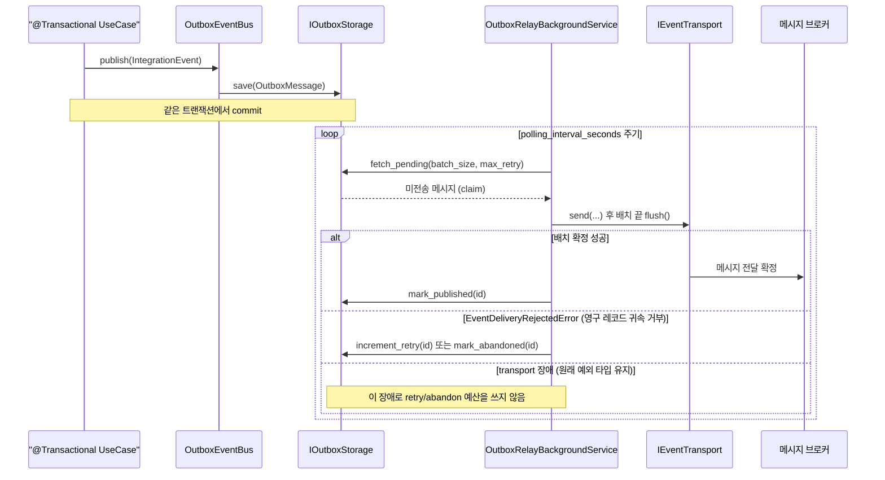
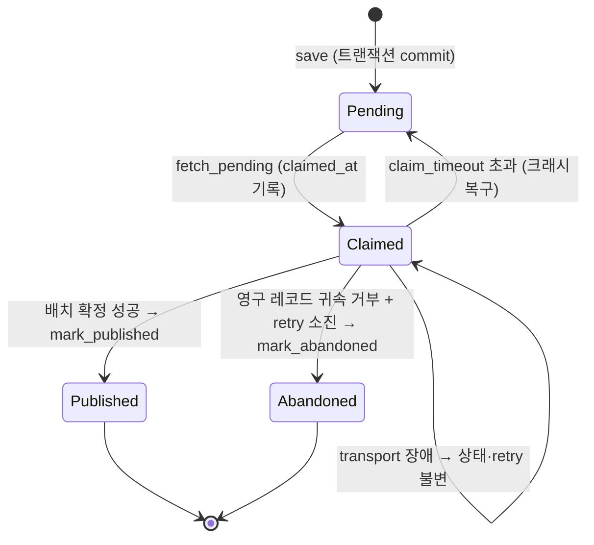

# Transactional Outbox

> `spakky-outbox`로 transaction 이후 Integration Event를 확인 전까지 재전송하는 at-least-once 흐름과, 영구 거부된 레코드를 발행 포기하는 경계를 설명합니다.

`spakky-outbox`는 Transactional Outbox 패턴으로 비즈니스 변경과 Integration Event 기록을 원자적으로 묶습니다. 브로커가 수락 가능한 레코드는 확인될 때까지 재전송하므로 성공 전달 경로는 중복 가능한 at-least-once 의미를 갖지만, 영구적인 레코드 귀속 거부는 retry 예산을 소진하면 abandoned 처리되어 성공 전달이 0회일 수 있습니다. events·outbox·saga가 함께 동작하는 전체 그림은 [이벤트 기반 아키텍처 통합 가이드](event-driven.md)를 참고하세요.

---

## 개념

### 해결하는 문제 — 이중 쓰기

DB 트랜잭션을 commit한 뒤 별도로 브로커에 이벤트를 전송하면, 트랜잭션은 성공했는데 브로커 전송만 실패하는 순간 이벤트가 영구히 유실됩니다. 반대로 브로커 먼저 보내면 트랜잭션 rollback 시 "일어나지 않은 일"이 외부에 알려집니다. 두 저장소(DB·브로커)를 하나의 원자적 연산으로 묶을 수 없는 것이 이중 쓰기 문제입니다.

Outbox는 이벤트를 **비즈니스 데이터와 같은 DB 트랜잭션 안에서 Outbox 테이블에 저장**하고, 브로커 전송은 별도 폴링 프로세스로 분리해 이 문제를 해결합니다. DB commit 하나에 비즈니스 변경과 이벤트가 함께 남으므로 유실 구간이 사라집니다.

### 동작 원리

1. `OutboxEventBus`가 `@Primary`로 기본 `IEventBus`를 대체합니다.
2. Integration Event 발행 시 메시지 브로커 대신 Outbox 테이블에 저장합니다 (트랜잭션 내).
3. `OutboxRelayBackgroundService`가 주기적으로 Outbox 테이블을 폴링합니다.
4. 미전송 메시지를 `IEventTransport`(Kafka/RabbitMQ)를 통해 실제 전송합니다.
5. 전송 성공 시 메시지를 published 처리합니다. Transport가 영구적이고 특정 레코드에 귀속 가능한 거부를 `EventDeliveryRejectedError`로 확정한 경우에만 그 메시지의 retry count를 증가시키고, `max_retry_count`를 소진하면 발행 포기(abandoned) 처리합니다. 연결 끊김·타임아웃·queue 포화·그 밖의 transport 장애는 원래 예외 타입을 유지하며, Relay는 그 예외 때문에 retry/abandon 예산을 쓰지 않습니다. 배치 `flush()` 실패는 1건씩 재확인하고, 최초 `send()`나 1건 재확인의 transport 장애는 미확정 메시지를 그대로 남깁니다.

### 폴링 → 전송 흐름

발행 측(UseCase 트랜잭션)과 전송 측(Relay 폴링)이 시간적으로 분리됩니다. Relay는 `fetch_pending`으로 미전송 메시지를 원자적으로 claim한 뒤 전송하고, 배치 확정 성공·영구 레코드 귀속 거부·transport 장애를 구분해 상태를 갱신합니다. 파티션 키가 있는 메시지는 키 단위로 claim·발행되어 상대 순서가 보전됩니다 — [Kafka 가이드](kafka.md)의 파티션 키 절 참조.



`OutboxMessage`는 이 흐름을 거치며 상태가 전이됩니다. `claimed_at`은 폴링이 메시지를 가져갈 때 잠금으로 찍히며, `claim_timeout_seconds`가 지나면 다른 폴링 사이클이 다시 claim할 수 있어(크래시 복구) 전송이 멈추지 않습니다.



`Abandoned`는 영구적이고 개별 레코드에 귀속된 거부가 반복되어 `max_retry_count`를 소진한 메시지의 종착 상태입니다. Transport 전체 장애는 이 상태로 전이시키지 않습니다. 레코드 거부를 소진 뒤에도 그대로 두면 메시지가 조회 대상에서만 빠진 채 "가장 오래된 미발행 메시지"로 남아 같은 파티션 키의 후속 메시지를 영구히 막습니다. `abandoned_at`이 찍힌 row는 발행 대기열을 떠나므로 그 키가 다시 진행하며, row 자체는 남아 있어 운영자가 성공 전달 0회로 끝난 메시지를 조회할 수 있습니다.

```sql
SELECT id, event_name, partition_key, retry_count, abandoned_at
FROM spakky_event_outbox
WHERE abandoned_at IS NOT NULL
ORDER BY abandoned_at DESC;
```

---

## 사용법

### 설정

`OutboxConfig`는 `@Configuration`이므로 환경변수에서 자동 로딩됩니다.

```python
from spakky.core.application.application import SpakkyApplication
from spakky.core.application.application_context import ApplicationContext
import spakky.outbox
import spakky.plugins.rabbitmq  # 또는 spakky.plugins.kafka
import spakky.plugins.sqlalchemy
import apps

app = (
    SpakkyApplication(ApplicationContext())
    .load_plugins(include={
        spakky.outbox.PLUGIN_NAME,
        spakky.plugins.sqlalchemy.PLUGIN_NAME,  # Outbox storage provider
        spakky.plugins.rabbitmq.PLUGIN_NAME,  # Transport 플러그인 필수
    })
    .scan(apps)
    .start()
)
```

환경변수 예시:

```bash
export SPAKKY_OUTBOX__POLLING_INTERVAL_SECONDS=1.0
export SPAKKY_OUTBOX__BATCH_SIZE=100
export SPAKKY_OUTBOX__MAX_RETRY_COUNT=5
export SPAKKY_OUTBOX__CLAIM_TIMEOUT_SECONDS=300.0
```

| 필드 | 환경변수 | 기본값 | 설명 |
|------|---------|--------|------|
| `polling_interval_seconds` | `SPAKKY_OUTBOX__POLLING_INTERVAL_SECONDS` | `1.0` | 폴링 주기 (초) |
| `batch_size` | `SPAKKY_OUTBOX__BATCH_SIZE` | `100` | 배치당 처리 메시지 수 |
| `max_retry_count` | `SPAKKY_OUTBOX__MAX_RETRY_COUNT` | `5` | 영구 레코드 귀속 거부의 최대 retry 횟수. 소진 시 발행 포기하며 transport 장애에는 소모하지 않음 |
| `claim_timeout_seconds` | `SPAKKY_OUTBOX__CLAIM_TIMEOUT_SECONDS` | `300.0` | 메시지 잠금 타임아웃 (초) |

### 이벤트 발행

코드 변경 없이 플러그인 로드만으로 동작합니다. 기존 `IAsyncEventPublisher.publish()` 호출이 그대로 Outbox를 통하게 됩니다.

```python
from spakky.core.stereotype.usecase import UseCase
from spakky.event.event_publisher import IAsyncEventPublisher

@UseCase()
class PlaceOrderUseCase:
    _publisher: IAsyncEventPublisher

    def __init__(self, publisher: IAsyncEventPublisher) -> None:
        self._publisher = publisher

    async def execute(self, order_id: UUID, total: float) -> None:
        event = OrderPlacedEvent(order_id=order_id, total_amount=total)
        await self._publisher.publish(event)
        # → OutboxEventBus가 Outbox 테이블에 저장 (트랜잭션 내)
        # → Relay가 주기적으로 Kafka/RabbitMQ로 전송
```

### 핵심 컴포넌트

#### OutboxEventBus

`@Primary`로 등록되어 기본 `IEventBus` / `IAsyncEventBus`를 대체합니다. `send()` 호출 시 메시지를 직접 브로커로 전송하지 않고 `IOutboxStorage`에 저장합니다.

```python
from spakky.outbox.bus.outbox_event_bus import OutboxEventBus, AsyncOutboxEventBus
```

#### OutboxRelayBackgroundService

백그라운드 서비스로 실행되며, Outbox 테이블에서 미전송 메시지를 주기적으로 가져와 `IEventTransport`로 전송합니다.

한 번 가져온 배치는 전부 `send`한 뒤 `flush`를 한 번만 호출하고, flush가 성공한 다음에 발행 완료로 표시합니다.

- `send()` 또는 1건 재확인이 영구적인 레코드 귀속 거부인 `EventDeliveryRejectedError`를 올린 경우에만 그 레코드의 retry count를 올립니다. 남은 예산이 없으면 `mark_abandoned()`로 발행 대기열에서 제외합니다.
- 배치 `flush`가 실패하면 어느 메시지의 잘못인지 그 자리에서는 가릴 수 없으므로, 릴레이가 **같은 배치를 메시지 1건씩 다시 `send` + `flush`** 하여 브로커의 판정을 메시지에 귀속시킵니다. 이미 배치에서 전달된 레코드가 재확인 과정에서 다시 전달될 수 있으므로 소비자 멱등성이 전제입니다(at-least-once).
- 재확인에서 브로커가 **그 레코드를 영구 거부**하면(`EventDeliveryRejectedError`) 그 메시지만 retry count를 올리고 자기 파티션 키를 보류합니다. 재시도해도 같은 결과가 나올 메시지이므로 예산을 소모시켜 결국 발행 포기에 도달하게 하는 것이 맞습니다.
- 최초 `send`나 재확인이 연결 끊김·타임아웃·queue 포화·그 밖의 transport 장애로 실패하면 transport는 원래 예외 타입을 유지합니다. Relay는 처리를 멈추고 배치를 DB에서 미발행 상태로 남기며 retry count와 abandoned 상태를 바꾸지 않습니다. 브로커가 앞선 레코드를 이미 받았을 가능성은 남아 있어, 다음 claim의 재전송은 중복을 만들 수 있습니다. 이것이 at-least-once 전달에서 소비자 멱등성이 필요한 이유입니다.
- 재확인은 실패 경로에서만 일어납니다. 정상 경로는 종전대로 배치 1개당 `flush` 1회이므로 처리량이 바뀌지 않습니다.
- 애플리케이션 종료로 transport가 닫히면(`EventTransportNotRunningError`) 남은 배치를 그대로 두고 릴레이를 멈춥니다. 종료는 전달 실패가 아니므로 retry count를 소모하지 않습니다.

```python
from spakky.outbox.relay.relay import (
    OutboxRelayBackgroundService,
    AsyncOutboxRelayBackgroundService,
)
```

#### IOutboxStorage

Outbox 메시지의 저장/조회/상태 변경을 담당하는 포트 인터페이스입니다.
`spakky-sqlalchemy`는 `spakky.contributions.spakky.outbox` contribution으로
SQLAlchemy 구현체와 Outbox table을 제공합니다.

```python
from spakky.outbox.ports.storage import IOutboxStorage, IAsyncOutboxStorage
```

| 메서드 | 설명 |
|--------|------|
| `save(message)` | 현재 트랜잭션 내에서 메시지 저장 |
| `fetch_pending(limit, max_retry)` | 미전송 메시지 claim (잠금 포함). 파티션 키는 통째로 claim한다 — 키의 가장 오래된 미발행 메시지를 함께 잡지 못하면 그 키의 메시지를 넘기지 않는다 |
| `mark_published(message_id)` | 메시지를 전송 완료 처리 |
| `increment_retry(message_id)` | 재시도 카운트 증가 |
| `mark_abandoned(message_id)` | 재시도를 소진한 메시지를 발행 포기 처리 (발행 대기열에서 제외하되 레코드는 보존) |

#### OutboxMessage

영속성에 독립적인 Outbox 메시지 모델입니다.

```python
from spakky.outbox.common.message import OutboxMessage
```

| 필드 | 타입 | 설명 |
|------|------|------|
| `id` | `UUID` | 메시지 고유 ID |
| `event_name` | `str` | 이벤트 이름 (라우팅 키) |
| `payload` | `bytes` | 직렬화된 이벤트 데이터 |
| `headers` | `dict[str, str]` | 메타데이터 헤더 (트레이스 전파 등) |
| `partition_key` | `str \| None` | 브로커 파티션을 고정하는 키. bus가 이벤트의 `partition_key`를 그대로 옮기며, `None`이면 라운드로빈 분산 |
| `created_at` | `datetime` | 생성 시각 |
| `published_at` | `datetime \| None` | 전송 완료 시각 |
| `retry_count` | `int` | 재시도 횟수 |
| `claimed_at` | `datetime \| None` | 잠금 시각 |
| `abandoned_at` | `datetime \| None` | 재시도를 소진하여 발행을 포기한 시각. `None`이면 아직 발행 대기 중 |

---

## 스키마 업그레이드 — `partition_key`·`abandoned_at` 컬럼 추가

`spakky-sqlalchemy`의 `OutboxMessageTable`은 migration용 table metadata만 제공하고, 운영 스키마 적용은 사용자 migration이 소유합니다(`SchemaRegistry`). 따라서 이미 `spakky_event_outbox` 테이블이 배포된 환경을 이 버전으로 올릴 때는 컬럼 추가 DDL을 직접 실행해야 합니다.

```sql
ALTER TABLE spakky_event_outbox ADD COLUMN partition_key TEXT NULL;
ALTER TABLE spakky_event_outbox ADD COLUMN abandoned_at TIMESTAMPTZ NULL;
```

DDL을 실행하지 않은 채 배포하면 다음 두 곳이 깨집니다.

| 위치 | 증상 |
|------|------|
| `IOutboxStorage.save()` | 존재하지 않는 컬럼을 참조하는 INSERT가 실패합니다. `save()`는 비즈니스 트랜잭션 안에서 호출되므로 **이벤트를 발행하는 모든 UseCase가 함께 롤백됩니다.** |
| `OutboxRelayBackgroundService` | `fetch_pending()`의 SELECT가 실패하고, 이 예외는 릴레이의 재시도 `try` 블록 밖에서 발생하므로 **릴레이 백그라운드 서비스가 종료됩니다.** |

두 컬럼의 `NULL` 허용은 각각 "파티션 키 없음"(라운드로빈 발행)과 "아직 발행 대기 중"이라는 도메인 값을 표현하기 위한 것이며, 마이그레이션을 대신하지 않습니다. 기존 row는 DDL 적용 후 `partition_key`와 `abandoned_at`이 `NULL`이 되어 이전과 동일하게 라운드로빈으로 발행 대기합니다.

---

## 분산 트레이싱

`spakky-tracing`이 설치되면 `OutboxEventBus`가 현재 `TraceContext`를 메시지 헤더에 자동 주입합니다. Relay가 전송할 때 해당 헤더가 그대로 브로커 메시지에 포함되므로, 수신 측에서 트레이스 컨텍스트가 복원됩니다.

## 인증 컨텍스트 전파

`SPAKKY_AUTH_SNAPSHOT_PROPAGATION_ENABLED=true`가 설정되어 있고 현재 request/context scope에 `AuthContext`가 있으면 `OutboxEventBus` / `AsyncOutboxEventBus`는 Outbox message headers에 `spakky.auth.context_snapshot` metadata를 저장합니다. 이 값은 `IAuthContextSnapshotSigner`가 만든 signed `AuthContextSnapshot` envelope이며, raw bearer token은 저장하지 않습니다. 기존 `traceparent` header는 함께 보존됩니다.

---

## 다음 단계

- [이벤트 기반 아키텍처 통합 가이드](event-driven.md) — events·outbox·saga를 함께 쓰는 분산 워크플로우
- [이벤트 시스템](events.md) — 도메인/통합 이벤트 발행과 핸들러 등록
- [사가 오케스트레이션](saga.md) — 보상 기반 분산 트랜잭션과 Outbox 조합
