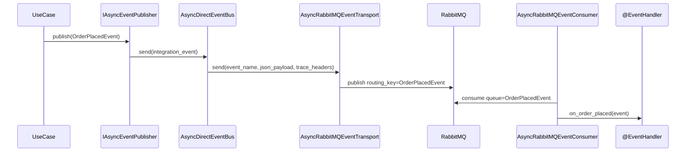

# RabbitMQ 통합

> `spakky-rabbitmq`는 `IEventTransport` 인터페이스를 통해 Integration Event를 RabbitMQ로 전송하고, 백그라운드 Consumer로 수신합니다.
> 이벤트 클래스 이름을 큐/라우팅 키로 사용하므로 발행자와 소비자가 같은 이벤트 타입 계약을 공유해야 합니다.

---

## 동작 원리

1. `@EventHandler`의 `@on_event` 메서드가 `RabbitMQPostProcessor`에 의해 Consumer에 자동 등록
2. Integration Event 발행 시 `RabbitMQEventTransport`가 RabbitMQ 큐로 전송
3. `RabbitMQEventConsumer`가 백그라운드 서비스로 큐를 소비하며 핸들러에 dispatch

---

## 설정

`RabbitMQConnectionConfig`는 `@Configuration`이므로 환경변수에서 자동 로딩됩니다.

```python
from spakky.core.application.application import SpakkyApplication
from spakky.core.application.application_context import ApplicationContext
import spakky.plugins.rabbitmq
import apps

app = (
    SpakkyApplication(ApplicationContext())
    .load_plugins(include={spakky.plugins.rabbitmq.PLUGIN_NAME})
    .scan(apps)
    .start()
)
```

환경변수 예시:

```bash
export SPAKKY_RABBITMQ__USE_SSL=false
export SPAKKY_RABBITMQ__HOST=localhost
export SPAKKY_RABBITMQ__PORT=5672
export SPAKKY_RABBITMQ__USER=guest
export SPAKKY_RABBITMQ__PASSWORD=guest
export SPAKKY_RABBITMQ__EXCHANGE_NAME=my-exchange  # Optional
```

| 필드 | 환경변수 | 기본값 | 설명 |
|------|---------|--------|------|
| `use_ssl` | `SPAKKY_RABBITMQ__USE_SSL` | (필수) | SSL 사용 여부 |
| `host` | `SPAKKY_RABBITMQ__HOST` | (필수) | RabbitMQ 호스트 |
| `port` | `SPAKKY_RABBITMQ__PORT` | (필수) | RabbitMQ 포트 |
| `user` | `SPAKKY_RABBITMQ__USER` | (필수) | 인증 사용자명 |
| `password` | `SPAKKY_RABBITMQ__PASSWORD` | (필수) | 인증 비밀번호 |
| `exchange_name` | `SPAKKY_RABBITMQ__EXCHANGE_NAME` | `None` | Exchange 이름 (pub/sub 라우팅) |

---

## 이벤트 발행

Integration Event를 발행하면 `EventPublisher`가 `IEventBus`를 통해 `RabbitMQEventTransport`로 전달합니다.

```python
from uuid import UUID
from spakky.core.common.mutability import immutable
from spakky.domain.models.event import AbstractIntegrationEvent

@immutable
class OrderPlacedEvent(AbstractIntegrationEvent):
    order_id: UUID
    total_amount: float
```

```python
from spakky.core.stereotype.usecase import UseCase
from spakky.event.event_publisher import IAsyncEventPublisher

@UseCase()
class PlaceOrderUseCase:
    _publisher: IAsyncEventPublisher

    def __init__(self, publisher: IAsyncEventPublisher) -> None:
        self._publisher = publisher

    async def execute(self, order_id: UUID, total: float) -> None:
        event = OrderPlacedEvent(order_id=order_id, total_amount=total)
        await self._publisher.publish(event)
```

---

## 이벤트 수신

`@EventHandler`와 `@on_event`로 수신 핸들러를 정의합니다. `RabbitMQPostProcessor`가 자동으로 Consumer에 등록합니다.

```python
from spakky.event.stereotype.event_handler import EventHandler, on_event

@EventHandler()
class OrderEventHandler:
    @on_event(OrderPlacedEvent)
    async def on_order_placed(self, event: OrderPlacedEvent) -> None:
        print(f"주문 접수: {event.order_id}, 금액: {event.total_amount}")
```

큐 이름은 이벤트 클래스의 `__name__`(예: `OrderPlacedEvent`)으로 자동 결정됩니다.

---

## 운영 흐름

발행 경로는 `IAsyncEventPublisher`에서 시작하지만, RabbitMQ transport가 직접 도메인 객체를 직렬화하지는 않습니다. `AsyncDirectEventBus`가 `TypeAdapter(type(event)).dump_json(event)`로 JSON bytes payload를 만들고, `AsyncRabbitMQEventTransport`가 이벤트 이름과 payload를 RabbitMQ에 씁니다. 동기 경로에서는 같은 역할을 `DirectEventBus`와 `RabbitMQEventTransport`가 수행합니다.



실무에서는 아래 규칙을 맞춥니다.

| 항목 | 규칙 |
|------|------|
| 이벤트 이름 | `AbstractIntegrationEvent.event_name` 값, 기본은 클래스명 |
| 큐 이름 | 수신 핸들러가 등록한 이벤트 클래스명 |
| payload | Pydantic `TypeAdapter`가 만든 JSON bytes |
| headers | `ITracePropagator.inject()`가 넣은 trace header |
| exchange 없음 | 기본 exchange에 큐 이름 routing key로 발행 |
| exchange 있음 | configured exchange에 이벤트 이름 routing key로 발행하고 큐를 bind |

`spakky-outbox`를 함께 로드하면 `OutboxEventBus` / `AsyncOutboxEventBus`가 `@Primary`로 기본 bus를 대체합니다. 이 경우 UseCase 안의 `publish()` 호출은 RabbitMQ에 즉시 전송되지 않고 Outbox 테이블에 저장되며, Relay가 나중에 RabbitMQ transport의 `send()`를 호출합니다. 비즈니스 데이터와 메시지 저장을 같은 DB 트랜잭션에 묶어야 하면 Outbox를 사용하세요.

---

## Exchange 라우팅

`exchange_name`을 설정하면 pub/sub 패턴으로 동작합니다.

- Transport가 exchange를 선언하고 큐를 바인딩
- 같은 exchange에 여러 큐가 바인딩되면 메시지가 팬아웃

`exchange_name`이 `None`이면 기본 exchange(direct)를 사용합니다.

---

## 분산 트레이싱

`spakky-tracing`은 `spakky-rabbitmq`의 필수 의존성입니다. 컨테이너에 `ITracePropagator`가 등록되어 있으면 메시지 헤더를 통해 `TraceContext`가 자동 전파됩니다.

- **발행 측**: `OutboxEventBus` 또는 `DirectEventBus`가 현재 `TraceContext`를 메시지 헤더에 주입
- **수신 측**: `RabbitMQEventConsumer`가 헤더에서 `TraceContext`를 추출하여 자식 span 생성
- 헤더가 없으면 새로운 루트 트레이스를 시작
- `ITracePropagator`가 컨테이너에 없으면 트레이싱은 비활성 상태로, 별도 에러 없이 동작합니다

별도 설정이나 코드 변경 없이, 플러그인 로드만으로 동작합니다.
