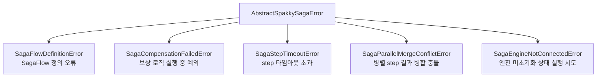

# 사가 심화

> `spakky-saga`의 DSL 조합, 에러 전략, 타임아웃, 실행 결과, Semantic Lock 운영 패턴을 다룹니다.

이 문서는 [사가 오케스트레이션](saga.md)을 읽은 뒤 보는 심화 가이드입니다. 기본 문서가 “언제 Saga를 쓰고 어떻게 하나 정의하는가”에 집중한다면, 여기서는 실패 처리와 운영 세부사항을 다룹니다.

## SagaFlow DSL

| 연산자 | 좌변 | 우변 | 결과 타입 |
|--------|------|------|----------|
| `>>` | `SagaStep` | `SagaStep` 또는 compensate 함수 | `Transaction` |
| `&` | `SagaStep` / `Transaction` / `Parallel` | 동일 | `Parallel` |
| `\|` | `SagaStep` / `Transaction` | `ErrorStrategy` | 전략이 적용된 동일 타입 |

```python
from spakky.saga import parallel, saga_flow, step
```

- `step(action, *, compensate=None, on_error=None, timeout=None)`은 `SagaStep` 또는 `Transaction`을 만듭니다.
- `parallel(*items)`는 동시 실행 그룹을 만듭니다. 최소 2개 item이 필요합니다.
- `saga_flow(*items)`는 최상위 흐름을 만듭니다. 최소 1개 item이 필요합니다.

한 step을 `@saga_step` 메서드로 뽑을지, `flow()` 안에 lambda로 둘지는 data 변환 여부로 결정합니다.

| 기준 | 선택 |
|------|------|
| UseCase 결과로 `SagaData`를 교체해야 함 | `@saga_step` 메서드 |
| side effect만 일으킴 | lambda 또는 `step(callable)` |
| 동일 step을 `>>`, `&`, `\|`와 조합해야 함 | `@saga_step` 메서드 |
| 흐름 내에서 한 번만 쓰이고 의미가 자명 | lambda |

lambda 본문은 coroutine을 반환해야 합니다. lambda 자체는 `async def`가 될 수 없지만, async 메서드를 호출하면 `Awaitable`을 반환하므로 엔진이 이를 `await`할 수 있습니다.

```python
def flow(self) -> SagaFlow[OrderSagaData]:
    return saga_flow(
        self.create_order >> self.cancel_order,
        lambda d: self._audit.record(d.order_id),
        step(
            lambda d: self._notify.sent(d.order_id),
            compensate=lambda d: self._notify.revoke(d.order_id),
        ),
    )
```

## 흐름 조합

```python
from datetime import timedelta

from spakky.saga import Retry, Skip, parallel, saga_flow, step


flow = saga_flow(
    step(saga.create_order, compensate=saga.cancel_order),
    parallel(
        step(saga.reserve_stock, compensate=saga.release_stock),
        step(saga.process_payment, compensate=saga.refund_payment),
    ),
    step(saga.send_notification, timeout=timedelta(seconds=5)) | Retry(max_attempts=3),
    step(saga.log_analytics) | Skip(),
)
```

## 에러 전략

step 실패 시 적용할 전략을 `|` 연산자 또는 `step(..., on_error=...)`로 지정합니다. 기본값은 `Compensate()`입니다.

| 전략 | 설명 |
|------|------|
| `Compensate()` | 역순 보상을 트리거하고 Saga를 `FAILED`로 종료 |
| `Skip()` | 실패를 무시하고 다음 step으로 진행 |
| `Retry(max_attempts, backoff, then)` | 지정한 횟수까지 재시도 후 `then` 전략 적용 |
| `ExponentialBackoff(base=1.0)` | `Retry.backoff`에 주입하는 지수 백오프 |

```python
from spakky.saga import Compensate, ExponentialBackoff, Retry, Skip, step


step(saga.reserve_stock, compensate=saga.release_stock)  # on_error=Compensate()
step(saga.process_payment) | Retry(max_attempts=3)
step(saga.send_notification) | Retry(
    max_attempts=5,
    backoff=ExponentialBackoff(base=2.0),
)
step(saga.log_analytics) | Retry(max_attempts=3, then=Skip())
step(saga.log_analytics) | Skip()
```

v1에서는 `parallel()` 그룹 내부 step에 기본 `Compensate` 외 `on_error`를 지정할 수 없습니다. 또한 `parallel()` 그룹의 action 반환값은 side effect 전용으로 취급되어 무시됩니다. 순차 step은 정상적으로 `data`를 갱신합니다.

## 타임아웃과 보상 실패

`step(..., timeout=timedelta(...))`로 개별 step에 타임아웃을 적용합니다. 초과 시 `SagaStepTimeoutError`가 내부적으로 발생하며 `on_error` 전략을 거칩니다.

```python
from datetime import timedelta

step(saga.call_external_api, timeout=timedelta(seconds=3)) | Retry(max_attempts=2)
```

`SagaFlow.timeout(duration)`으로 Saga 전체 타임아웃을 설정합니다. 초과 시 `SagaStatus.TIMED_OUT`으로 종료되며, 그 시점까지 commit된 step은 역순으로 보상됩니다.

```python
from datetime import timedelta

flow = saga_flow(
    step(saga.create_order, compensate=saga.cancel_order),
    step(saga.process_payment, compensate=saga.refund_payment),
).timeout(timedelta(seconds=30))
```

보상 실행 중 예외가 발생하면 `SagaCompensationFailedError`가 raise됩니다. 별도 에스컬레이션 핸들러를 붙이려면 `SagaFlow.on_compensation_failure(handler)`를 사용합니다. 핸들러 실행 후에도 최종적으로 예외는 raise됩니다.

```python
async def notify_oncall(data: OrderSagaData) -> None:
    await alerting.send(f"Saga compensation failed: {data.order_id}")


flow = saga_flow(
    step(saga.create_order, compensate=saga.cancel_order),
    step(saga.process_payment, compensate=saga.refund_payment),
).on_compensation_failure(notify_oncall)
```

## 실행과 결과

`@Saga` 클래스의 표준 실행 진입점은 `execute(data)`입니다. `AbstractSaga` 없이 직접 `SagaFlow`를 실행하려면 `run_saga_flow`를 사용합니다.

```python
from spakky.saga import run_saga_flow

result = await order_saga.execute(data)
result = await run_saga_flow(flow, data, saga_name="OrderSaga")
```

두 경로 모두 `SagaResult[T]`를 반환합니다. 일반적인 Saga 실패는 비즈니스 결과이므로 예외로 던지지 않습니다. 단, 보상 실패 시 `SagaCompensationFailedError`는 raise됩니다.

| 필드 | 타입 | 설명 |
|------|------|------|
| `status` | `SagaStatus` | Saga 전체 상태 |
| `data` | `T` | 최종 Saga data |
| `failed_step` | `str \| None` | 실패한 step 이름 |
| `error` | `Exception \| None` | 발생한 예외 |
| `history` | `tuple[StepRecord, ...]` | 각 step의 실행 기록 |
| `elapsed` | `timedelta` | 총 실행 시간 |

| 상태 | 설명 |
|------|------|
| `STARTED` | Saga 시작됨 |
| `RUNNING` | 실행 중 |
| `COMPENSATING` | 보상 실행 중 |
| `COMPLETED` | 모든 step 성공 |
| `FAILED` | 실패 후 보상 수행 |
| `TIMED_OUT` | Saga 전체 타임아웃 초과 |

## Transactional UseCase와 Outbox 조합 {#transactional-usecase-outbox}

`@Transactional()`은 `spakky.data.aspects.transactional`의 AOP annotation입니다. 비동기 메서드에는 `AsyncTransactionalAspect`가 적용되어 `AbstractAsyncTransaction` 컨텍스트에서 실행되고, SQLAlchemy 플러그인을 쓰면 `AsyncTransaction`이 현재 `AsyncSession`을 commit/rollback합니다.

따라서 action UseCase 내부에서 예외가 나면 **그 UseCase의 DB 변경만 rollback**되고, 이미 성공한 이전 UseCase의 commit은 DB rollback 대상이 아닙니다. Saga는 성공한 step의 보상 UseCase를 역순으로 실행해 비즈니스 상태를 되돌립니다.

```python
from dataclasses import replace
from uuid import UUID

from spakky.core.common.error import AbstractSpakkyFrameworkError
from spakky.core.stereotype.usecase import UseCase
from spakky.data.aspects.transactional import Transactional
from spakky.event.event_publisher import IAsyncEventPublisher
from spakky.saga import AbstractSaga, Saga, SagaFlow, saga_flow, saga_step


class IncompleteOrderSagaDataError(AbstractSpakkyFrameworkError):
    """Application error raised when a step contract is violated."""

    message = "Order saga data is incomplete for this step"


def require_order_id(data: OrderSagaData) -> UUID:
    if data.order_id is None:
        raise IncompleteOrderSagaDataError()
    return data.order_id


@UseCase()
class CreateOrderUseCase:
    def __init__(
        self,
        order_repo: OrderRepository,
        publisher: IAsyncEventPublisher,
    ) -> None:
        self._order_repo = order_repo
        self._publisher = publisher

    @Transactional()
    async def execute(self, customer_id: UUID, total_amount: float) -> UUID:
        order = Order.create_pending(customer_id, total_amount)
        saved = await self._order_repo.save(order)
        await self._publisher.publish(
            OrderPendingCreated(order_id=saved.uid, total_amount=total_amount)
        )
        return saved.uid


@UseCase()
class CancelOrderUseCase:
    def __init__(self, order_repo: OrderRepository) -> None:
        self._order_repo = order_repo

    @Transactional()
    async def execute(self, order_id: UUID) -> None:
        order = await self._order_repo.find_by_id(order_id)
        order.cancel()
        await self._order_repo.save(order)


@Saga()
class OrderSaga(AbstractSaga[OrderSagaData]):
    def __init__(
        self,
        create_order: CreateOrderUseCase,
        cancel_order: CancelOrderUseCase,
        confirm_order: ConfirmOrderUseCase,
    ) -> None:
        self._create_order = create_order
        self._cancel_order = cancel_order
        self._confirm_order = confirm_order

    @saga_step
    async def create_order(self, data: OrderSagaData) -> OrderSagaData:
        order_id = await self._create_order.execute(
            data.customer_id,
            data.total_amount,
        )
        return replace(data, order_id=order_id)

    @saga_step
    async def cancel_order(self, data: OrderSagaData) -> None:
        await self._cancel_order.execute(require_order_id(data))

    @saga_step
    async def confirm_order(self, data: OrderSagaData) -> None:
        await self._confirm_order.execute(require_order_id(data))

    def flow(self) -> SagaFlow[OrderSagaData]:
        return saga_flow(
            self.create_order >> self.cancel_order,
            self.confirm_order,
        )
```

`IAsyncEventPublisher.publish()`가 Integration Event를 발행하고 `spakky-outbox`가 로드되어 있으면, `AsyncOutboxEventBus`가 `@Primary`로 기본 bus를 대체합니다. 그 결과 이벤트는 브로커로 즉시 나가지 않고 `IAsyncOutboxStorage.save()`로 Outbox 테이블에 저장됩니다. 이 저장도 같은 `@Transactional()` UseCase 안에서 일어나므로, SQLAlchemy transaction이 rollback되면 비즈니스 데이터와 Outbox 메시지가 함께 취소됩니다.

`order_id`, `reservation_id`, `payment_id`처럼 앞선 action step이 채우는 값은 흐름 계약입니다. 보상 UseCase를 Saga 밖에서도 호출할 수 있다면, 해당 UseCase 입구에서 누락된 식별자를 도메인 에러로 검증합니다.

## Semantic Lock 패턴

Saga는 RDB 트랜잭션과 달리 중간 step이 commit되면 그 효과가 보상 전까지 외부에 관찰될 수 있습니다. 이 isolation gap을 줄이려면 Aggregate에 중간 상태를 명시적으로 모델링합니다.

| 성질 | RDB Transaction | Saga |
|------|-----------------|------|
| Atomicity | 즉시 all-or-nothing | 최종적 all-or-nothing |
| Isolation | 중간 상태 비노출 | 중간 상태 노출 |
| Consistency | 강한 일관성 | 최종 일관성 |

대표 패턴은 `PENDING -> CONFIRMED`입니다.

1. 초기 commit step에서 Aggregate를 `PENDING` 상태로 생성합니다.
2. 모든 step이 성공하면 마지막 pivot step에서 `CONFIRMED`로 전이합니다.
3. 보상 step은 `PENDING` Aggregate를 `CANCELLED` 또는 삭제 상태로 돌립니다.
4. 조회 UseCase와 Repository는 `CONFIRMED`만 기본 조회 대상으로 삼습니다.

## 구조화 로깅

Saga 엔진은 실행 전 구간을 구조화 로그로 출력합니다. 로거 이름은 `spakky.saga.engine`입니다.

| 이벤트 | 로그 포맷 예시 | 레벨 |
|--------|---------------|------|
| saga 시작 | `[saga=OrderSaga status=started]` | INFO |
| step 시작 | `[saga=OrderSaga step=create_order status=started]` | INFO |
| step 성공 | `[saga=OrderSaga step=create_order status=completed elapsed=12ms]` | INFO |
| step 실패 | `[saga=OrderSaga step=process_payment status=failed error=TimeoutError]` | WARNING |
| step 재시도 | `[saga=OrderSaga step=process_payment status=retry attempt=2]` | INFO |
| 보상 실행 | `[saga=OrderSaga step=create_order status=compensating]` | INFO |
| saga 종료 | `[saga=OrderSaga status=COMPLETED elapsed=120ms]` | INFO |

## 에러 계층



## 더 볼 곳

- [사가 오케스트레이션](saga.md): Saga를 처음 정의하는 기본 흐름입니다.
- [Transactional Outbox](outbox.md): Integration Event 전달 보장을 다룹니다.
- [spakky-saga API Reference](../api/core/spakky-saga.md): 상세 class와 함수 signature를 확인합니다.
