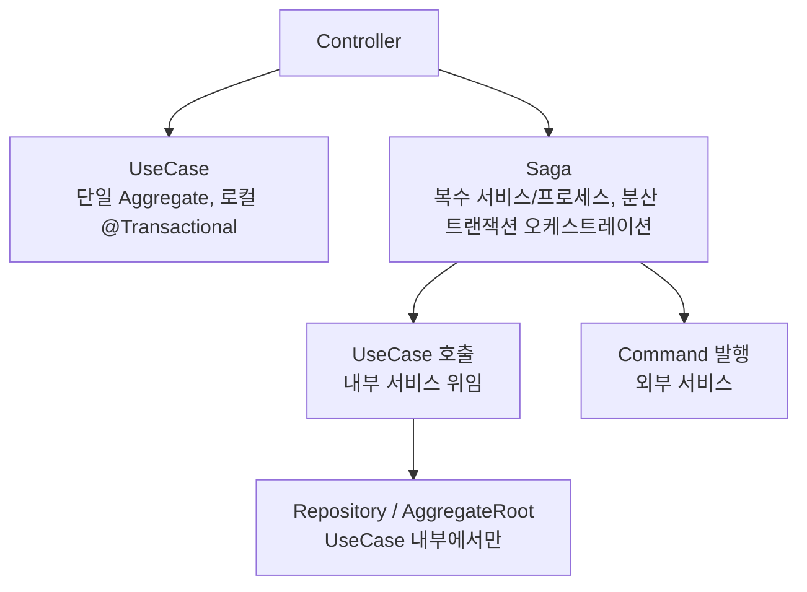
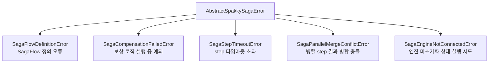

# 사가 오케스트레이션

> `spakky-saga`는 분산 트랜잭션의 보상(compensation) 기반 롤백을 오케스트레이션합니다.
> `SagaFlow`, `SagaStep`, `Transaction`, `Parallel`을 조합하여 비즈니스 프로세스를 선언적으로 모델링합니다.

---

## 동작 원리

1. `@Saga` 스테레오타입으로 사가 오케스트레이터 클래스를 DI 컨테이너에 등록
2. `@saga_step` 데코레이터로 사가 step 메서드를 `SagaStep` 디스크립터로 감쌈
3. `>>` (action + compensate), `&` (병렬), `|` (에러 전략) 연산자 또는 빌더 함수 `step()`, `parallel()`, `saga_flow()`로 실행 흐름을 DSL로 조합
4. `AbstractSaga.execute(data)` 또는 `run_saga_flow(flow, data)`가 흐름을 실행하고 `SagaResult`를 반환
5. step 실패 시 `ErrorStrategy`(Compensate/Skip/Retry)에 따라 분기하고, 필요 시 commit된 step을 역순으로 보상

---

## Saga의 아키텍처 위치

`@Saga()`는 `@UseCase()`와 **동급**의 application layer 스테레오타입입니다. 두 스테레오타입 모두 `Pod`을 상속하므로 DI 컨테이너가 동일한 방식으로 관리하며, Controller가 둘 중 어느 것이든 직접 주입받아 호출할 수 있습니다.



Saga는 **흐름 제어기(flow orchestrator)** 역할만 담당합니다. Repository 접근·Aggregate 조작·트랜잭션 경계·비즈니스 규칙 판단은 **호출되는 UseCase**에서 수행합니다. 이 경계는 다음 절의 "역할 제한"으로 강제됩니다.

> ADR-0007 §아키텍처 위치 참조.

---

## UseCase vs Saga

구현하려는 오퍼레이션이 아래 중 어느 쪽에 가까운지를 기준으로 선택합니다.

| 기준 | `@UseCase()` + `@Transactional` | `@Saga()` |
|------|--------------------------------|-----------|
| 트랜잭션 범위 | 단일 DB / 단일 Aggregate | 복수 서비스·프로세스 경계 |
| 일관성 모델 | 강한 일관성 (ACID) | 최종 일관성 (최종적 all-or-nothing) |
| 실패 복구 | DB rollback | 역순 보상(compensation) |
| 중간 상태 | 외부에 노출되지 않음 | **외부에 노출됨** (Isolation 갭) |
| 대표 예시 | `AddItemToCartUseCase`, `ChangeUserEmailUseCase` | `CreateOrderSaga`, `BookTravelSaga` |

단일 Aggregate 내부 변경이면 `@UseCase()` + `@Transactional`로 충분합니다. 복수 서비스를 가로지르며 보상이 필요한 순간에만 `@Saga()`로 승격합니다.

---

## Saga의 역할 제한 (순수 흐름 제어기)

Saga는 "흐름을 짠다"는 하나의 관심사만 책임집니다. 아래 범주를 넘어가면 Saga가 아니라 UseCase/Aggregate로 옮겨야 합니다.

| Saga가 하는 것 | Saga가 하지 않는 것 |
|----------------|--------------------|
| UseCase를 호출한다 | Repository에 직접 접근하지 않는다 |
| 외부 Command를 발행한다 | AggregateRoot를 직접 조작하지 않는다 |
| 실패 시 보상 step을 역순 실행한다 | 비즈니스 규칙을 판단하지 않는다 |
| step 간 `SagaData`를 전달한다 | `@Transactional` 경계를 관리하지 않는다 |

각 step의 실체는 **"UseCase 호출 1줄 + data 리턴 1줄"** 원칙을 따릅니다. 이 규칙을 지키면 비즈니스 로직이 UseCase에 몰리고, Saga는 흐름 변경에만 집중됩니다.

> ADR-0007 §Saga의 역할 제한 참조.

---

## 설정

`spakky-saga`는 `spakky`와 `spakky-domain`에 의존합니다.

```bash
pip install spakky-saga
```

`@Saga()`는 `Pod`의 서브클래스이므로, 패키지 스캔만으로 DI 컨테이너가 사가 클래스를 자동 관리합니다. 별도 post-processor 등록은 필요하지 않습니다.

```python
from spakky.core.application.application import SpakkyApplication
from spakky.core.application.application_context import ApplicationContext
import spakky.saga
import apps

app = (
    SpakkyApplication(ApplicationContext())
    .load_plugins(include={spakky.saga.PLUGIN_NAME})
    .scan(apps)
    .start()
)
```

---

## 사가 정의

### AbstractSagaData

사가 비즈니스 데이터 모델은 `AbstractSagaData`를 상속합니다. `@immutable` + `AbstractDomainModel` 기반이며, 각 step에는 읽기 전용으로 전달됩니다. `saga_id: UUID` 필드가 기본 제공됩니다.

```python
from uuid import UUID

from spakky.core.common.mutability import immutable
from spakky.saga import AbstractSagaData


@immutable
class OrderSagaData(AbstractSagaData):
    customer_id: UUID
    total_amount: float
    order_id: UUID | None = None
    reservation_id: UUID | None = None
    payment_id: UUID | None = None
```

Saga가 식별자(`order_id`, `reservation_id`, `payment_id`)를 **흐름 진행 중에 발급**하기 때문에 이들 필드는 `None` 기본값을 가진 optional로 선언합니다. 각 step은 `dataclasses.replace(data, ...)`로 새 인스턴스를 반환하여 이후 step에 전달합니다.

### @Saga + AbstractSaga + @saga_step

`@Saga()`는 DI 컨테이너에 사가 클래스를 등록하는 스테레오타입입니다. `AbstractSaga[SagaDataT]`를 상속하여 `flow()`를 구현하면 `execute(data)`가 정의된 흐름을 실행합니다.

step으로 쓸 async 메서드에는 `@saga_step` 데코레이터를 붙여야 `>>`, `&`, `|` 연산자를 타입 안전하게 사용할 수 있습니다.

Saga는 **UseCase들을 DI로 받아** step 메서드에서 호출합니다. step 본문은 "UseCase 호출 + (필요 시) data 교체"로 끝나며, 비즈니스 판단과 영속화는 UseCase 쪽에 있습니다.

```python
from dataclasses import replace
from uuid import UUID

from spakky.core.common.error import AbstractSpakkyFrameworkError
from spakky.saga import AbstractSaga, Saga, SagaFlow, saga_flow, saga_step


class IncompleteOrderSagaDataError(AbstractSpakkyFrameworkError):
    """Application error raised when a step contract is violated."""

    message = "Order saga data is incomplete for this step"


def require_order_id(data: OrderSagaData) -> UUID:
    if data.order_id is None:
        raise IncompleteOrderSagaDataError()
    return data.order_id


def require_reservation_id(data: OrderSagaData) -> UUID:
    if data.reservation_id is None:
        raise IncompleteOrderSagaDataError()
    return data.reservation_id


def require_payment_id(data: OrderSagaData) -> UUID:
    if data.payment_id is None:
        raise IncompleteOrderSagaDataError()
    return data.payment_id


@Saga()
class OrderSaga(AbstractSaga[OrderSagaData]):
    def __init__(
        self,
        create_order: CreateOrderUseCase,
        cancel_order: CancelOrderUseCase,
        reserve_stock: ReserveStockUseCase,
        release_stock: ReleaseStockUseCase,
        process_payment: ProcessPaymentUseCase,
        refund_payment: RefundPaymentUseCase,
    ) -> None:
        self._create_order = create_order
        self._cancel_order = cancel_order
        self._reserve_stock = reserve_stock
        self._release_stock = release_stock
        self._process_payment = process_payment
        self._refund_payment = refund_payment

    @saga_step
    async def create_order(self, data: OrderSagaData) -> OrderSagaData:
        order_id = await self._create_order.execute(data.customer_id)
        return replace(data, order_id=order_id)

    @saga_step
    async def cancel_order(self, data: OrderSagaData) -> None:
        await self._cancel_order.execute(require_order_id(data))

    @saga_step
    async def reserve_stock(self, data: OrderSagaData) -> OrderSagaData:
        reservation_id = await self._reserve_stock.execute(require_order_id(data))
        return replace(data, reservation_id=reservation_id)

    @saga_step
    async def release_stock(self, data: OrderSagaData) -> None:
        await self._release_stock.execute(require_reservation_id(data))

    @saga_step
    async def process_payment(self, data: OrderSagaData) -> OrderSagaData:
        payment_id = await self._process_payment.execute(
            require_order_id(data), data.total_amount
        )
        return replace(data, payment_id=payment_id)

    @saga_step
    async def refund_payment(self, data: OrderSagaData) -> None:
        await self._refund_payment.execute(require_payment_id(data))

    def flow(self) -> SagaFlow[OrderSagaData]:
        return saga_flow(
            self.create_order >> self.cancel_order,
            self.reserve_stock >> self.release_stock,
            self.process_payment >> self.refund_payment,
        )
```

### UseCase 주입 패턴

- `__init__`에서 필요한 UseCase를 **타입 기반 DI**로 주입받습니다. Saga도 `Pod`이므로 컨테이너가 자동으로 해결합니다.
- 각 step은 주입받은 UseCase의 `execute()`를 **한 줄**로 호출합니다.
- `@Transactional`은 UseCase 쪽에 붙입니다. Saga 자체는 트랜잭션 경계를 관리하지 않습니다.
- Repository/Aggregate를 Saga에 직접 주입하지 않습니다. 직접 주입이 필요하다고 느껴지면 그 로직은 UseCase로 승격되어야 한다는 신호입니다.

### @Transactional UseCase를 Saga step으로 묶기

실무에서 Saga step의 action/compensate는 대부분 `@UseCase()` 클래스의 `@Transactional()` 메서드입니다. 이때 **로컬 DB 트랜잭션은 각 UseCase 안에서 시작하고 끝납니다.** Saga 엔진은 이미 commit된 step 목록만 기억했다가 이후 step 실패 시 보상 UseCase를 역순으로 호출합니다.

```mermaid
sequenceDiagram
  participant Grpc as Controller
  participant Saga as OrderSaga
  participant Create as CreateOrderUseCase<br/>@Transactional
  participant Stock as ReserveStockUseCase<br/>@Transactional
  participant Pay as ProcessPaymentUseCase<br/>@Transactional
  participant Cancel as CancelOrderUseCase<br/>@Transactional

  Grpc->>Saga: execute(OrderSagaData)
  Saga->>Create: execute(customer_id, total)
  Create-->>Saga: commit order(PENDING), order_id
  Saga->>Stock: execute(order_id)
  Stock-->>Saga: commit reservation_id
  Saga->>Pay: execute(order_id, total)
  Pay--x Saga: payment failed
  Saga->>Stock: release_stock(reservation_id)
  Saga->>Cancel: cancel_order(order_id)
  Saga-->>Grpc: SagaResult(status=FAILED)
```

`@Transactional()`은 `spakky.data.aspects.transactional`의 AOP annotation입니다. 비동기 메서드에는 `AsyncTransactionalAspect`가 적용되어 `AbstractAsyncTransaction` 컨텍스트에서 실행되고, SQLAlchemy 플러그인을 쓰면 `AsyncTransaction`이 현재 `AsyncSession`을 commit/rollback합니다. 따라서 action UseCase 내부에서 예외가 나면 **그 UseCase의 DB 변경만 rollback**되고, 이미 성공한 이전 UseCase의 commit은 DB rollback 대상이 아닙니다.

Saga compensation은 DB rollback과 다릅니다.

| 구분 | DB rollback | Saga compensation |
|------|-------------|-------------------|
| 적용 범위 | 현재 `@Transactional()` UseCase 내부 | 이미 commit된 이전 step |
| 실행 시점 | UseCase 예외 발생 시 즉시 | 이후 step 실패 후 Saga 엔진이 역순 호출 |
| 구현 위치 | `AbstractTransaction` / SQLAlchemy transaction | 보상 UseCase (`cancel_order`, `release_stock`, `refund_payment`) |
| 의미 | 쓰기 자체를 취소 | 비즈니스 상태를 되돌리는 새 트랜잭션 |

아래처럼 action과 compensation을 모두 UseCase로 분리합니다. Saga는 식별자를 이어 붙이고, 각 UseCase가 Repository·Aggregate·트랜잭션을 소유합니다.

```python
from dataclasses import replace
from uuid import UUID

from spakky.core.common.error import AbstractSpakkyFrameworkError
from spakky.core.stereotype.usecase import UseCase
from spakky.data.aspects.transactional import Transactional
from spakky.event.event_publisher import IAsyncEventPublisher
from spakky.saga import AbstractSaga, Saga, SagaFlow, saga_flow, saga_step


class IncompleteOrderSagaDataError(AbstractSpakkyFrameworkError):
    """Application error raised when a step contract is violated."""

    message = "Order saga data is incomplete for this step"


def require_order_id(data: OrderSagaData) -> UUID:
    if data.order_id is None:
        raise IncompleteOrderSagaDataError()
    return data.order_id


def require_reservation_id(data: OrderSagaData) -> UUID:
    if data.reservation_id is None:
        raise IncompleteOrderSagaDataError()
    return data.reservation_id


def require_payment_id(data: OrderSagaData) -> UUID:
    if data.payment_id is None:
        raise IncompleteOrderSagaDataError()
    return data.payment_id


@UseCase()
class CreateOrderUseCase:
    def __init__(
        self,
        order_repo: OrderRepository,
        publisher: IAsyncEventPublisher,
    ) -> None:
        self._order_repo = order_repo
        self._publisher = publisher

    @Transactional()
    async def execute(self, customer_id: UUID, total_amount: float) -> UUID:
        order = Order.create_pending(customer_id, total_amount)
        saved = await self._order_repo.save(order)
        await self._publisher.publish(
            OrderPendingCreated(order_id=saved.uid, total_amount=total_amount)
        )
        return saved.uid


@UseCase()
class CancelOrderUseCase:
    def __init__(self, order_repo: OrderRepository) -> None:
        self._order_repo = order_repo

    @Transactional()
    async def execute(self, order_id: UUID) -> None:
        order = await self._order_repo.find_by_id(order_id)
        order.cancel()
        await self._order_repo.save(order)


@Saga()
class OrderSaga(AbstractSaga[OrderSagaData]):
    def __init__(
        self,
        create_order: CreateOrderUseCase,
        cancel_order: CancelOrderUseCase,
        reserve_stock: ReserveStockUseCase,
        release_stock: ReleaseStockUseCase,
        process_payment: ProcessPaymentUseCase,
        refund_payment: RefundPaymentUseCase,
        confirm_order: ConfirmOrderUseCase,
    ) -> None:
        self._create_order = create_order
        self._cancel_order = cancel_order
        self._reserve_stock = reserve_stock
        self._release_stock = release_stock
        self._process_payment = process_payment
        self._refund_payment = refund_payment
        self._confirm_order = confirm_order

    @saga_step
    async def create_order(self, data: OrderSagaData) -> OrderSagaData:
        order_id = await self._create_order.execute(
            data.customer_id,
            data.total_amount,
        )
        return replace(data, order_id=order_id)

    @saga_step
    async def cancel_order(self, data: OrderSagaData) -> None:
        await self._cancel_order.execute(require_order_id(data))

    @saga_step
    async def reserve_stock(self, data: OrderSagaData) -> OrderSagaData:
        reservation_id = await self._reserve_stock.execute(require_order_id(data))
        return replace(data, reservation_id=reservation_id)

    @saga_step
    async def release_stock(self, data: OrderSagaData) -> None:
        await self._release_stock.execute(require_reservation_id(data))

    @saga_step
    async def process_payment(self, data: OrderSagaData) -> OrderSagaData:
        payment_id = await self._process_payment.execute(
            require_order_id(data),
            data.total_amount,
        )
        return replace(data, payment_id=payment_id)

    @saga_step
    async def refund_payment(self, data: OrderSagaData) -> None:
        await self._refund_payment.execute(require_payment_id(data))

    @saga_step
    async def confirm_order(self, data: OrderSagaData) -> None:
        await self._confirm_order.execute(require_order_id(data))

    def flow(self) -> SagaFlow[OrderSagaData]:
        return saga_flow(
            self.create_order >> self.cancel_order,
            self.reserve_stock >> self.release_stock,
            self.process_payment >> self.refund_payment,
            self.confirm_order,
        )
```

`IAsyncEventPublisher.publish()`가 Integration Event를 발행하고 `spakky-outbox`가 로드되어 있으면, `AsyncOutboxEventBus`가 `@Primary`로 기본 bus를 대체합니다. 그 결과 이벤트는 브로커로 즉시 나가지 않고 `IAsyncOutboxStorage.save()`로 Outbox 테이블에 저장됩니다. 이 저장도 같은 `@Transactional()` UseCase 안에서 일어나므로, SQLAlchemy transaction이 rollback되면 비즈니스 데이터와 Outbox 메시지가 함께 취소됩니다.

예시의 `order_id`, `reservation_id`, `payment_id`는 앞선 action step이 채운다는 흐름 계약에 의존합니다. 보상 UseCase를 Saga 밖에서도 호출할 수 있다면, 해당 UseCase 입구에서 누락된 식별자를 도메인 에러로 검증합니다.

현실적인 주문/결제 흐름은 보통 다음처럼 나눕니다.

| Step | UseCase 트랜잭션 | 성공 시 상태 | 실패 시 보상 |
|------|------------------|-------------|--------------|
| 주문 생성 | `CreateOrderUseCase.execute()` | `Order(PENDING)` 저장, Outbox에 `OrderPendingCreated` 저장 | `CancelOrderUseCase.execute()` |
| 재고 예약 | `ReserveStockUseCase.execute()` | 예약 행 commit | `ReleaseStockUseCase.execute()` |
| 결제 승인 | `ProcessPaymentUseCase.execute()` | 결제 승인 ID 저장 | `RefundPaymentUseCase.execute()` |
| 주문 확정 | `ConfirmOrderUseCase.execute()` | `Order(CONFIRMED)` commit | 보상 없음 또는 별도 취소 정책 |

마지막 확정 step 전까지는 Semantic Lock 패턴을 적용해 `PENDING` 주문을 외부 확정 주문으로 취급하지 않습니다. 보상 UseCase는 "rollback SQL"이 아니라 `cancel()`, `release()`, `refund()` 같은 명시적 도메인 상태 전이를 수행해야 합니다.

### step 시그니처 규약

| 역할 | 시그니처 | 반환값 |
|------|---------|--------|
| action (commit) | `async def(self, data: T) -> T \| None` | 변경된 `data` 또는 `None` (변경 없음) |
| compensate | `async def(self, data: T) -> None` | 부수효과만 수행, 반환값 없음 |

action이 새 `AbstractSagaData` 인스턴스를 반환하면 엔진이 이후 step들에 전달되는 `data`를 해당 값으로 갱신합니다.

---

## SagaFlow DSL

### 연산자

| 연산자 | 좌변 | 우변 | 결과 타입 |
|--------|------|------|----------|
| `>>` | `SagaStep` | `SagaStep` 또는 compensate 함수 | `Transaction` |
| `&` | `SagaStep` / `Transaction` / `Parallel` | 동일 | `Parallel` (최소 2개) |
| `\|` | `SagaStep` / `Transaction` | `ErrorStrategy` | 전략이 적용된 동일 타입 |

### 빌더 함수

```python
from spakky.saga import parallel, saga_flow, step
```

- `step(action, *, compensate=None, on_error=None, timeout=None)` — `SagaStep` 또는 `Transaction` 생성
- `parallel(*items)` — 동시 실행 그룹 (`Parallel`, 최소 2개). Callable은 자동으로 `SagaStep`으로 승격. **최소 2개 검증은 전달된 최상위 인자 개수 기준**이므로, 중첩된 `parallel(...)` 하나만 넘기면 `SagaFlowDefinitionError`가 발생합니다.
- `saga_flow(*items)` — 최상위 흐름 (`SagaFlow`, 최소 1개)

### 메서드 vs lambda: step 표현 방식

한 step을 `@saga_step` 메서드로 뽑을지, `flow()` 안에 lambda로 inline할지는 **data 변환 여부**로 판단합니다.

| 기준 | 선택 | 이유 |
|------|------|------|
| UseCase 결과로 `SagaData`를 교체해야 함 | `@saga_step` 메서드 | `replace(data, ...)` 변환이 들어가므로 이름을 갖는 메서드가 가독성에 유리 |
| side-effect만 일으킴 (리턴 `None`) | lambda 또는 `step(callable)` | 1줄로 충분하며, lambda는 리턴값이 `SagaData`가 아니면 엔진이 기존 data를 그대로 통과시킴 |
| 동일 메서드를 다른 연산자와 조합(`>>`, `&`, `\|`)해야 함 | `@saga_step` 메서드 | 연산자는 `SagaStep`을 반환하는 descriptor에만 정의되므로 lambda로는 불가 |
| 흐름 내에서 한 번만 쓰이고 의미가 자명 | lambda | `flow()` 한 곳에서 전체 흐름을 읽기 쉬움 |

> **중요**: lambda 본문은 반드시 **coroutine을 반환**해야 합니다. 즉 lambda가 호출하는 대상 메서드(`self._audit.record`, `self._notify.sent`, `self._notify.revoke` 등)는 `async def`로 선언되어 있어야 합니다. lambda 자체는 `async def`가 될 수 없지만, async 메서드를 호출하면 `Awaitable`을 반환하므로 엔진이 이를 `await`할 수 있습니다.

```python
def flow(self) -> SagaFlow[OrderSagaData]:
    return saga_flow(
        # data 변환 → 메서드
        self.create_order >> self.cancel_order,
        # side-effect only → lambda (self._audit.record는 async 메서드)
        lambda d: self._audit.record(d.order_id),
        # 보상이 필요한 side-effect → step(..., compensate=...)
        # self._notify.sent / self._notify.revoke 모두 async 메서드
        step(
            lambda d: self._notify.sent(d.order_id),
            compensate=lambda d: self._notify.revoke(d.order_id),
        ),
    )
```

### 흐름 조합 예시

```python
from datetime import timedelta

from spakky.saga import Retry, Skip, parallel, saga_flow, step


# 순차 실행
flow = saga_flow(
    step(saga.create_order),
    step(saga.reserve_stock),
    step(saga.process_payment),
)

# 보상 함수 지정 (Transaction 생성)
flow = saga_flow(
    step(saga.create_order, compensate=saga.cancel_order),
    step(saga.reserve_stock, compensate=saga.release_stock),
    step(saga.process_payment, compensate=saga.refund_payment),
)

# 병렬 실행
flow = saga_flow(
    step(saga.create_order, compensate=saga.cancel_order),
    parallel(
        step(saga.reserve_stock, compensate=saga.release_stock),
        step(saga.process_payment, compensate=saga.refund_payment),
    ),
)

# 에러 전략 + step 타임아웃
flow = saga_flow(
    step(saga.create_order, compensate=saga.cancel_order),
    step(saga.process_payment, timeout=timedelta(seconds=5)) | Retry(max_attempts=3),
    step(saga.log_analytics) | Skip(),
)
```

---

## 에러 전략 (ErrorStrategy)

step 실패 시 적용할 전략을 `|` 연산자 또는 `step(..., on_error=...)`로 지정합니다. 기본값은 `Compensate()`입니다.

| 전략 | 설명 |
|------|------|
| `Compensate()` | 역순 보상을 트리거하고 saga를 FAILED로 종료 (기본값) |
| `Skip()` | 실패를 무시하고 다음 step으로 진행 |
| `Retry(max_attempts, backoff, then)` | `max_attempts`회까지 재시도 후 `then` 전략 적용 |
| `ExponentialBackoff(base=1.0)` | `Retry.backoff`에 주입하는 지수 백오프. 지연 = `base * 2^(attempt-1)` |

```python
from spakky.saga import Compensate, ExponentialBackoff, Retry, Skip, step


# 기본 보상
step(saga.reserve_stock, compensate=saga.release_stock)  # on_error=Compensate()

# 3회 재시도 (실패 시 기본 Compensate)
step(saga.process_payment) | Retry(max_attempts=3)

# 지수 백오프 재시도
step(saga.send_notification) | Retry(
    max_attempts=5,
    backoff=ExponentialBackoff(base=2.0),
)

# 재시도 후 실패 무시
step(saga.log_analytics) | Retry(max_attempts=3, then=Skip())

# 실패 무시
step(saga.log_analytics) | Skip()
```

### v1 제약

- `parallel()` 그룹 내부의 step은 기본 `Compensate` 외 `on_error`를 지정할 수 없습니다. 지정 시 `SagaFlowDefinitionError`가 발생합니다.
- `parallel()` 그룹의 action 반환값은 v1에서 무시됩니다 (side-effect 전용). 순차 step은 정상적으로 `data`를 갱신합니다.

---

## 타임아웃

### step 타임아웃

`step(..., timeout=timedelta(...))`로 개별 step에 타임아웃을 적용합니다. 초과 시 `SagaStepTimeoutError`가 내부적으로 발생하며 `on_error` 전략을 거칩니다.

```python
from datetime import timedelta

step(saga.call_external_api, timeout=timedelta(seconds=3)) | Retry(max_attempts=2)
```

### saga 전체 타임아웃

`SagaFlow.timeout(duration)`으로 saga 전체 타임아웃을 설정합니다. 초과 시 `SagaStatus.TIMED_OUT`으로 종료되며, 그 시점까지 commit된 step은 역순으로 보상됩니다.

```python
from datetime import timedelta

flow = saga_flow(
    step(saga.create_order, compensate=saga.cancel_order),
    step(saga.process_payment, compensate=saga.refund_payment),
).timeout(timedelta(seconds=30))
```

> **제약**: saga 타임아웃이 `parallel()` 그룹 실행 도중 만료되면, 그 그룹 내에서 이미 성공했지만 `compensable` 리스트에 등록되기 전(gather 반환 전) 상태의 side-effect는 보상되지 않습니다. 순차 step이나 이미 완료된 parallel 그룹의 commit된 step은 정상 보상됩니다.

### 보상 실패 에스컬레이션

보상 실행 중 예외가 발생하면 `SagaCompensationFailedError`가 raise됩니다. 별도 에스컬레이션 핸들러(알림, 수동 개입 트리거 등)를 붙이려면 `SagaFlow.on_compensation_failure(handler)`를 사용합니다. 핸들러 실행 후에도 최종적으로 예외는 raise됩니다.

```python
async def notify_oncall(data: OrderSagaData) -> None:
    await alerting.send(f"Saga compensation failed: {data.order_id}")


flow = saga_flow(
    step(saga.create_order, compensate=saga.cancel_order),
    step(saga.process_payment, compensate=saga.refund_payment),
).on_compensation_failure(notify_oncall)
```

---

## 실행과 결과

### AbstractSaga.execute

`@Saga` 클래스의 표준 실행 진입점입니다. `flow()`를 호출하여 흐름을 구성하고 실행합니다. saga 이름은 클래스명으로 자동 설정되어 구조화 로그에 포함됩니다.

```python
result = await order_saga.execute(data)
```

### run_saga_flow

`AbstractSaga` 없이 직접 `SagaFlow`를 실행하려면 `run_saga_flow`를 사용합니다.

```python
from spakky.saga import run_saga_flow

result = await run_saga_flow(flow, data, saga_name="OrderSaga")
```

두 경로 모두 `SagaResult[T]`를 반환하며, 예외는 발생시키지 않습니다 (단, 보상 실패 시 `SagaCompensationFailedError`는 raise됩니다).

### SagaResult

| 필드 | 타입 | 설명 |
|------|------|------|
| `status` | `SagaStatus` | 사가 전체 상태 |
| `data` | `T` | 최종 사가 데이터 |
| `failed_step` | `str \| None` | 실패한 step 이름 |
| `error` | `Exception \| None` | 발생한 예외 |
| `history` | `tuple[StepRecord, ...]` | 각 step의 실행 기록 |
| `elapsed` | `timedelta` | 총 실행 시간 |

### SagaStatus

| 상태 | 설명 |
|------|------|
| `STARTED` | 사가 시작됨 (엔진 내부 전이용) |
| `RUNNING` | 실행 중 (엔진 내부 전이용) |
| `COMPENSATING` | 보상 실행 중 (엔진 내부 전이용) |
| `COMPLETED` | 모든 step 성공 |
| `FAILED` | 실패 (보상 수행 후) |
| `TIMED_OUT` | saga 전체 타임아웃 초과 |

### StepRecord / StepStatus

각 step의 실행 기록입니다.

| 필드 | 타입 | 설명 |
|------|------|------|
| `name` | `str` | step 이름 (함수 `__name__`) |
| `status` | `StepStatus` | `COMMITTED` / `FAILED` / `COMPENSATED` |
| `elapsed` | `timedelta` | step 실행 시간 |

---

## Controller에서 Saga 호출

Controller는 Saga를 다른 Pod와 동일하게 DI로 주입받아 `execute()`를 호출하고, `SagaResult.status`로 응답을 분기합니다. 예외는 발생하지 않으므로 `try/except`가 아니라 **상태 분기**로 제어 흐름을 짭니다.

`spakky-fastapi`를 사용하는 예시입니다 (`@ApiController(prefix)` + `@post(path)`).

```python
from fastapi import HTTPException

from spakky.plugins.fastapi.routes import post
from spakky.plugins.fastapi.stereotypes.api_controller import ApiController
from spakky.saga import SagaStatus


@ApiController("/orders")
class OrderController:
    def __init__(self, order_saga: OrderSaga) -> None:
        self._order_saga = order_saga

    @post("")
    async def create_order(self, request: CreateOrderRequest) -> CreateOrderResponse:
        data = OrderSagaData(
            customer_id=request.customer_id,
            total_amount=request.total_amount,
        )
        result = await self._order_saga.execute(data)

        match result.status:
            case SagaStatus.COMPLETED:
                return CreateOrderResponse.from_data(result.data)
            case SagaStatus.FAILED:
                raise HTTPException(
                    status_code=409,
                    detail={
                        "failed_step": result.failed_step,
                        "error": type(result.error).__name__ if result.error else None,
                    },
                )
            case SagaStatus.TIMED_OUT:
                raise HTTPException(status_code=504, detail="Saga timed out")
            case _:
                # STARTED / RUNNING / COMPENSATING은 execute 반환 시점엔 나타나지 않음
                raise HTTPException(status_code=500, detail="Unexpected saga status")
```

> **Tip**: `SagaStatus`는 `STARTED`/`RUNNING`/`COMPENSATING`도 포함하지만 이들은 엔진 내부 전이용이며 `execute()` 반환 값에서는 관찰되지 않습니다. 그래도 타입 안전성을 위해 `match` 기본 분기를 두는 것을 권장합니다.

Controller가 없는 환경(워커, CLI 등)에서도 패턴은 동일합니다. 주입받은 Saga 인스턴스에 `execute(data)`를 호출하고 `SagaStatus`로 분기하면 됩니다.

---

## 격리성 갭과 Semantic Lock 패턴

사가는 RDB 트랜잭션과 달리 **Isolation이 약합니다.** 중간 step이 commit되면 그 효과는 보상 전까지 외부에 관찰될 수 있습니다. 예를 들어 `OrderSaga`가 `create_order`까지 commit하고 `process_payment`에서 실패하여 `cancel_order`로 보상하는 동안, 다른 트랜잭션은 `PLACED` 상태의 order를 잠시 볼 수 있습니다.

| 성질 | RDB Transaction | Saga |
|------|-----------------|------|
| Atomicity | 즉시 all-or-nothing | 최종적 all-or-nothing |
| Isolation | ✅ 중간 상태 비노출 | ❌ **중간 상태 노출** |
| Consistency | 강한 일관성 | 최종 일관성 |

### Semantic Lock 패턴 (권장)

Aggregate에 **중간 상태**를 명시적으로 모델링하여, 사가가 완주하기 전까지는 외부 사용자가 해당 엔터티를 "잠정적으로만" 볼 수 있도록 합니다. 대표 패턴: `PENDING → CONFIRMED`.

1. **초기 commit step**에서 Aggregate를 `PENDING` 상태로 생성합니다.
2. 모든 step이 성공하면 **마지막 pivot step**에서 `CONFIRMED`로 전이합니다.
3. 보상 step은 `PENDING` Aggregate를 `CANCELLED`/삭제로 돌립니다.
4. **읽기 쿼리 / 다른 UseCase**는 `CONFIRMED`만 조회하도록 필터링합니다. `PENDING`은 사가 진행 중인 자원으로 취급합니다.

```python
def flow(self) -> SagaFlow[OrderSagaData]:
    return saga_flow(
        # 1. PENDING으로 생성
        self.create_order >> self.cancel_order,
        # 2. 외부 부수효과
        self.reserve_stock >> self.release_stock,
        self.process_payment >> self.refund_payment,
        # 3. 모두 성공해야 CONFIRMED로 승격 (pivot step)
        self.confirm_order,
    )
```

- Aggregate 쪽에 `confirm()` / `cancel()` 같은 **상태 전이 메서드**를 두고, 각 상태에서 허용되는 오퍼레이션을 강제합니다.
- 조회 UseCase/Repository는 `status = CONFIRMED` 조건을 기본 필터로 둡니다.
- 이 패턴으로 "보상 전에 노출되는 중간 상태"가 다른 트랜잭션/사용자에게 유효한 자원으로 오인되는 문제를 막습니다.

> ADR-0007 §맥락(Isolation 갭) 참조.

---

## 구조화 로깅

사가 엔진은 실행 전 구간을 구조화 로그로 출력합니다. 로거 이름은 `spakky.saga.engine`입니다.

| 이벤트 | 로그 포맷 예시 | 레벨 |
|--------|---------------|------|
| saga 시작 | `[saga=OrderSaga status=started]` | INFO |
| step 시작 | `[saga=OrderSaga step=create_order status=started]` | INFO |
| step 성공 | `[saga=OrderSaga step=create_order status=completed elapsed=12ms]` | INFO |
| step 실패 | `[saga=OrderSaga step=process_payment status=failed error=TimeoutError]` | WARNING |
| step 재시도 | `[saga=OrderSaga step=process_payment status=retry attempt=2]` | INFO |
| 보상 실행 | `[saga=OrderSaga step=create_order status=compensating]` | INFO |
| 보상 성공 | `[saga=OrderSaga step=create_order status=compensated elapsed=8ms]` | INFO |
| saga 종료 | `[saga=OrderSaga status=COMPLETED elapsed=120ms]` | INFO |
| saga 예외 중단 | `[saga=OrderSaga status=aborted error=RuntimeError elapsed=15ms]` | WARNING |

`spakky-logging` 플러그인의 JSON 포맷을 사용하면 이 태그들이 구조화 필드로 파싱됩니다.

---

## 에러 계층



---

## 다음 단계

- [도메인 모델링](domain-modeling.md) — Aggregate Root, Entity, Domain Event
- [이벤트 시스템](events.md) — 도메인/통합 이벤트 발행
- [Transactional Outbox](outbox.md) — at-least-once 전달 보장
