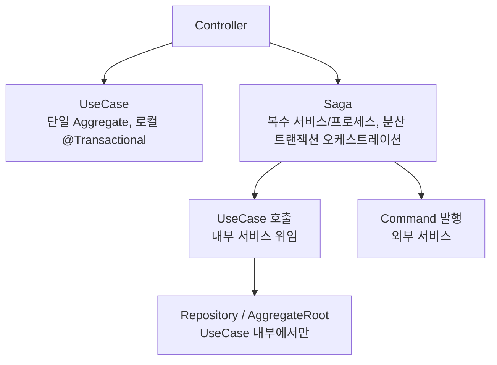

# 사가 오케스트레이션

> `spakky-saga`는 분산 트랜잭션의 보상(compensation) 기반 롤백을 오케스트레이션합니다.
> `SagaFlow`, `SagaStep`, `Transaction`, `Parallel`을 조합하여 비즈니스 프로세스를 선언적으로 모델링합니다.

---

## 동작 원리

1. `@Saga` 스테레오타입으로 사가 오케스트레이터 클래스를 DI 컨테이너에 등록
2. `@saga_step` 데코레이터로 사가 step 메서드를 `SagaStep` 디스크립터로 감쌈
3. `>>` (action + compensate), `&` (병렬), `|` (에러 전략) 연산자 또는 빌더 함수 `step()`, `parallel()`, `saga_flow()`로 실행 흐름을 DSL로 조합
4. `AbstractSaga.execute(data)` 또는 `run_saga_flow(flow, data)`가 흐름을 실행하고 `SagaResult`를 반환
5. step 실패 시 `ErrorStrategy`(Compensate/Skip/Retry)에 따라 분기하고, 필요 시 commit된 step을 역순으로 보상

---

## Saga의 아키텍처 위치

`@Saga()`는 `@UseCase()`와 **동급**의 application layer 스테레오타입입니다. 두 스테레오타입 모두 `Pod`을 상속하므로 DI 컨테이너가 동일한 방식으로 관리하며, Controller가 둘 중 어느 것이든 직접 주입받아 호출할 수 있습니다.



Saga는 **흐름 제어기(flow orchestrator)** 역할만 담당합니다. Repository 접근·Aggregate 조작·트랜잭션 경계·비즈니스 규칙 판단은 **호출되는 UseCase**에서 수행합니다. 이 경계는 다음 절의 "역할 제한"으로 강제됩니다.

> ADR-0007 §아키텍처 위치 참조.

---

## UseCase vs Saga

구현하려는 오퍼레이션이 아래 중 어느 쪽에 가까운지를 기준으로 선택합니다.

| 기준 | `@UseCase()` + `@Transactional` | `@Saga()` |
|------|--------------------------------|-----------|
| 트랜잭션 범위 | 단일 DB / 단일 Aggregate | 복수 서비스·프로세스 경계 |
| 일관성 모델 | 강한 일관성 (ACID) | 최종 일관성 (최종적 all-or-nothing) |
| 실패 복구 | DB rollback | 역순 보상(compensation) |
| 중간 상태 | 외부에 노출되지 않음 | **외부에 노출됨** (Isolation 갭) |
| 대표 예시 | `AddItemToCartUseCase`, `ChangeUserEmailUseCase` | `CreateOrderSaga`, `BookTravelSaga` |

단일 Aggregate 내부 변경이면 `@UseCase()` + `@Transactional`로 충분합니다. 복수 서비스를 가로지르며 보상이 필요한 순간에만 `@Saga()`로 승격합니다.

---

## Saga의 역할 제한 (순수 흐름 제어기)

Saga는 "흐름을 짠다"는 하나의 관심사만 책임집니다. 아래 범주를 넘어가면 Saga가 아니라 UseCase/Aggregate로 옮겨야 합니다.

| Saga가 하는 것 | Saga가 하지 않는 것 |
|----------------|--------------------|
| UseCase를 호출한다 | Repository에 직접 접근하지 않는다 |
| 외부 Command를 발행한다 | AggregateRoot를 직접 조작하지 않는다 |
| 실패 시 보상 step을 역순 실행한다 | 비즈니스 규칙을 판단하지 않는다 |
| step 간 `SagaData`를 전달한다 | `@Transactional` 경계를 관리하지 않는다 |

각 step의 실체는 **"UseCase 호출 1줄 + data 리턴 1줄"** 원칙을 따릅니다. 이 규칙을 지키면 비즈니스 로직이 UseCase에 몰리고, Saga는 흐름 변경에만 집중됩니다.

> ADR-0007 §Saga의 역할 제한 참조.

---

## 설정

`spakky-saga`는 `spakky`와 `spakky-domain`에 의존합니다.

```bash
pip install spakky-saga
```

`@Saga()`는 `Pod`의 서브클래스이므로, 패키지 스캔만으로 DI 컨테이너가 사가 클래스를 자동 관리합니다. 별도 post-processor 등록은 필요하지 않습니다.

```python
from spakky.core.application.application import SpakkyApplication
from spakky.core.application.application_context import ApplicationContext
import spakky.saga
import apps

app = (
    SpakkyApplication(ApplicationContext())
    .load_plugins(include={spakky.saga.PLUGIN_NAME})
    .scan(apps)
    .start()
)
```

---

## 사가 정의

### AbstractSagaData

사가 비즈니스 데이터 모델은 `AbstractSagaData`를 상속합니다. `@immutable` + `AbstractDomainModel` 기반이며, 각 step에는 읽기 전용으로 전달됩니다. `saga_id: UUID` 필드가 기본 제공됩니다.

```python
from uuid import UUID

from spakky.core.common.mutability import immutable
from spakky.saga import AbstractSagaData


@immutable
class OrderSagaData(AbstractSagaData):
    customer_id: UUID
    total_amount: float
    order_id: UUID | None = None
    reservation_id: UUID | None = None
    payment_id: UUID | None = None
```

Saga가 식별자(`order_id`, `reservation_id`, `payment_id`)를 **흐름 진행 중에 발급**하기 때문에 이들 필드는 `None` 기본값을 가진 optional로 선언합니다. 각 step은 `dataclasses.replace(data, ...)`로 새 인스턴스를 반환하여 이후 step에 전달합니다.

### @Saga + AbstractSaga + @saga_step

`@Saga()`는 DI 컨테이너에 사가 클래스를 등록하는 스테레오타입입니다. `AbstractSaga[SagaDataT]`를 상속하여 `flow()`를 구현하면 `execute(data)`가 정의된 흐름을 실행합니다.

step으로 쓸 async 메서드에는 `@saga_step` 데코레이터를 붙여야 `>>`, `&`, `|` 연산자를 타입 안전하게 사용할 수 있습니다.

Saga는 **UseCase들을 DI로 받아** step 메서드에서 호출합니다. step 본문은 "UseCase 호출 + (필요 시) data 교체"로 끝나며, 비즈니스 판단과 영속화는 UseCase 쪽에 있습니다.

```python
from dataclasses import replace
from uuid import UUID

from spakky.core.common.error import AbstractSpakkyFrameworkError
from spakky.saga import AbstractSaga, Saga, SagaFlow, saga_flow, saga_step


class IncompleteOrderSagaDataError(AbstractSpakkyFrameworkError):
    """Application error raised when a step contract is violated."""

    message = "Order saga data is incomplete for this step"


def require_order_id(data: OrderSagaData) -> UUID:
    if data.order_id is None:
        raise IncompleteOrderSagaDataError()
    return data.order_id


def require_reservation_id(data: OrderSagaData) -> UUID:
    if data.reservation_id is None:
        raise IncompleteOrderSagaDataError()
    return data.reservation_id


def require_payment_id(data: OrderSagaData) -> UUID:
    if data.payment_id is None:
        raise IncompleteOrderSagaDataError()
    return data.payment_id


@Saga()
class OrderSaga(AbstractSaga[OrderSagaData]):
    def __init__(
        self,
        create_order: CreateOrderUseCase,
        cancel_order: CancelOrderUseCase,
        reserve_stock: ReserveStockUseCase,
        release_stock: ReleaseStockUseCase,
        process_payment: ProcessPaymentUseCase,
        refund_payment: RefundPaymentUseCase,
    ) -> None:
        self._create_order = create_order
        self._cancel_order = cancel_order
        self._reserve_stock = reserve_stock
        self._release_stock = release_stock
        self._process_payment = process_payment
        self._refund_payment = refund_payment

    @saga_step
    async def create_order(self, data: OrderSagaData) -> OrderSagaData:
        order_id = await self._create_order.execute(data.customer_id)
        return replace(data, order_id=order_id)

    @saga_step
    async def cancel_order(self, data: OrderSagaData) -> None:
        await self._cancel_order.execute(require_order_id(data))

    @saga_step
    async def reserve_stock(self, data: OrderSagaData) -> OrderSagaData:
        reservation_id = await self._reserve_stock.execute(require_order_id(data))
        return replace(data, reservation_id=reservation_id)

    @saga_step
    async def release_stock(self, data: OrderSagaData) -> None:
        await self._release_stock.execute(require_reservation_id(data))

    @saga_step
    async def process_payment(self, data: OrderSagaData) -> OrderSagaData:
        payment_id = await self._process_payment.execute(
            require_order_id(data), data.total_amount
        )
        return replace(data, payment_id=payment_id)

    @saga_step
    async def refund_payment(self, data: OrderSagaData) -> None:
        await self._refund_payment.execute(require_payment_id(data))

    def flow(self) -> SagaFlow[OrderSagaData]:
        return saga_flow(
            self.create_order >> self.cancel_order,
            self.reserve_stock >> self.release_stock,
            self.process_payment >> self.refund_payment,
        )
```

### UseCase 주입 패턴

- `__init__`에서 필요한 UseCase를 **타입 기반 DI**로 주입받습니다. Saga도 `Pod`이므로 컨테이너가 자동으로 해결합니다.
- 각 step은 주입받은 UseCase의 `execute()`를 **한 줄**로 호출합니다.
- `@Transactional`은 UseCase 쪽에 붙입니다. Saga 자체는 트랜잭션 경계를 관리하지 않습니다.
- Repository/Aggregate를 Saga에 직접 주입하지 않습니다. 직접 주입이 필요하다고 느껴지면 그 로직은 UseCase로 승격되어야 한다는 신호입니다.

### @Transactional UseCase를 Saga step으로 묶기

실무에서 Saga step의 action/compensate는 대부분 `@UseCase()` 클래스의 `@Transactional()` 메서드입니다. 로컬 DB 트랜잭션은 각 UseCase 안에서 시작하고 끝나며, Saga 엔진은 이미 commit된 step 목록만 기억했다가 이후 step 실패 시 보상 UseCase를 역순으로 호출합니다.

```mermaid
sequenceDiagram
  participant Grpc as Controller
  participant Saga as OrderSaga
  participant Create as CreateOrderUseCase<br/>@Transactional
  participant Stock as ReserveStockUseCase<br/>@Transactional
  participant Pay as ProcessPaymentUseCase<br/>@Transactional
  participant Cancel as CancelOrderUseCase<br/>@Transactional

  Grpc->>Saga: execute(OrderSagaData)
  Saga->>Create: execute(customer_id, total)
  Create-->>Saga: commit order(PENDING), order_id
  Saga->>Stock: execute(order_id)
  Stock-->>Saga: commit reservation_id
  Saga->>Pay: execute(order_id, total)
  Pay--x Saga: payment failed
  Saga->>Stock: release_stock(reservation_id)
  Saga->>Cancel: cancel_order(order_id)
  Saga-->>Grpc: SagaResult(status=FAILED)
```

Saga compensation은 DB rollback과 다릅니다.

| 구분 | DB rollback | Saga compensation |
|------|-------------|-------------------|
| 적용 범위 | 현재 `@Transactional()` UseCase 내부 | 이미 commit된 이전 step |
| 실행 시점 | UseCase 예외 발생 시 즉시 | 이후 step 실패 후 Saga 엔진이 역순 호출 |
| 구현 위치 | `AbstractTransaction` / SQLAlchemy transaction | 보상 UseCase (`cancel_order`, `release_stock`, `refund_payment`) |
| 의미 | 쓰기 자체를 취소 | 비즈니스 상태를 되돌리는 새 트랜잭션 |

현실적인 주문/결제 흐름은 보통 다음처럼 나눕니다. 전체 UseCase 코드와 Outbox 조합은 [사가 심화](saga-advanced.md#transactional-usecase-outbox)에 분리했습니다.

| Step | UseCase 트랜잭션 | 성공 시 상태 | 실패 시 보상 |
|------|------------------|-------------|--------------|
| 주문 생성 | `CreateOrderUseCase.execute()` | `Order(PENDING)` 저장, Outbox에 `OrderPendingCreated` 저장 | `CancelOrderUseCase.execute()` |
| 재고 예약 | `ReserveStockUseCase.execute()` | 예약 행 commit | `ReleaseStockUseCase.execute()` |
| 결제 승인 | `ProcessPaymentUseCase.execute()` | 결제 승인 ID 저장 | `RefundPaymentUseCase.execute()` |
| 주문 확정 | `ConfirmOrderUseCase.execute()` | `Order(CONFIRMED)` commit | 보상 없음 또는 별도 취소 정책 |

마지막 확정 step 전까지는 Semantic Lock 패턴을 적용해 `PENDING` 주문을 외부 확정 주문으로 취급하지 않습니다. 보상 UseCase는 "rollback SQL"이 아니라 `cancel()`, `release()`, `refund()` 같은 명시적 도메인 상태 전이를 수행해야 합니다.

### step 시그니처 규약

| 역할 | 시그니처 | 반환값 |
|------|---------|--------|
| action (commit) | `async def(self, data: T) -> T \| None` | 변경된 `data` 또는 `None` (변경 없음) |
| compensate | `async def(self, data: T) -> None` | 부수효과만 수행, 반환값 없음 |

action이 새 `AbstractSagaData` 인스턴스를 반환하면 엔진이 이후 step들에 전달되는 `data`를 해당 값으로 갱신합니다.

---

## SagaFlow DSL과 실행 세부사항

기본 흐름은 `self.create_order >> self.cancel_order`처럼 action과 compensation을 묶는 방식으로 충분합니다. 병렬 실행, `Retry`/`Skip`, step timeout, `run_saga_flow`, `SagaResult.history`, 보상 실패 에스컬레이션처럼 운영에서 필요한 세부 주제는 [사가 심화](saga-advanced.md)에 정리했습니다.

## Controller에서 Saga 호출

Controller는 Saga를 다른 Pod와 동일하게 DI로 주입받아 `execute()`를 호출하고, `SagaResult.status`로 응답을 분기합니다. 예외는 발생하지 않으므로 `try/except`가 아니라 **상태 분기**로 제어 흐름을 짭니다.

`spakky-fastapi`를 사용하는 예시입니다 (`@ApiController(prefix)` + `@post(path)`).

```python
from fastapi import HTTPException

from spakky.plugins.fastapi.routes import post
from spakky.plugins.fastapi.stereotypes.api_controller import ApiController
from spakky.saga import SagaStatus


@ApiController("/orders")
class OrderController:
    def __init__(self, order_saga: OrderSaga) -> None:
        self._order_saga = order_saga

    @post("")
    async def create_order(self, request: CreateOrderRequest) -> CreateOrderResponse:
        data = OrderSagaData(
            customer_id=request.customer_id,
            total_amount=request.total_amount,
        )
        result = await self._order_saga.execute(data)

        match result.status:
            case SagaStatus.COMPLETED:
                return CreateOrderResponse.from_data(result.data)
            case SagaStatus.FAILED:
                raise HTTPException(
                    status_code=409,
                    detail={
                        "failed_step": result.failed_step,
                        "error": type(result.error).__name__ if result.error else None,
                    },
                )
            case SagaStatus.TIMED_OUT:
                raise HTTPException(status_code=504, detail="Saga timed out")
            case _:
                # STARTED / RUNNING / COMPENSATING은 execute 반환 시점엔 나타나지 않음
                raise HTTPException(status_code=500, detail="Unexpected saga status")
```

> **Tip**: `SagaStatus`는 `STARTED`/`RUNNING`/`COMPENSATING`도 포함하지만 이들은 엔진 내부 전이용이며 `execute()` 반환 값에서는 관찰되지 않습니다. 그래도 타입 안전성을 위해 `match` 기본 분기를 두는 것을 권장합니다.

Controller가 없는 환경(워커, CLI 등)에서도 패턴은 동일합니다. 주입받은 Saga 인스턴스에 `execute(data)`를 호출하고 `SagaStatus`로 분기하면 됩니다.

---

## 다음 단계

- [사가 심화](saga-advanced.md) — DSL, 에러 전략, 타임아웃, Semantic Lock
- [도메인 모델링](domain-modeling.md) — Aggregate Root, Entity, Domain Event
- [이벤트 시스템](events.md) — 도메인/통합 이벤트 발행
- [Transactional Outbox](outbox.md) — at-least-once 전달 보장
