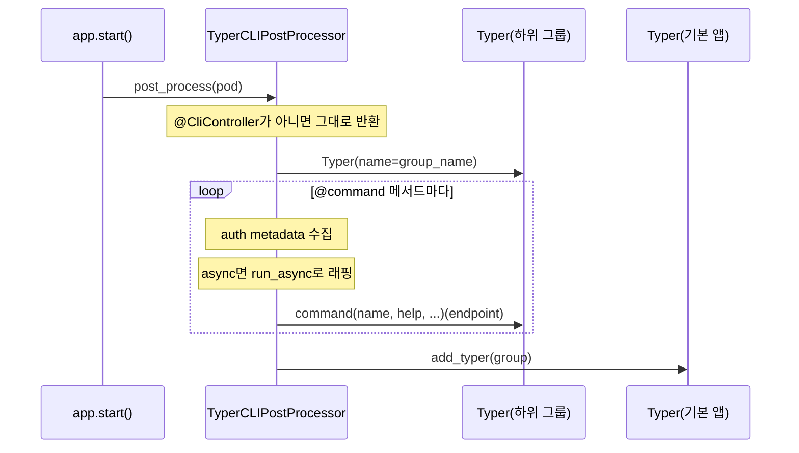

# CLI 심화 (Typer)

> `spakky-typer`의 명령 등록 내부 동작과, 운영에서 필요한 비동기 명령·컨텍스트 정리·인증 경계·Agent stream 노출을 다룹니다.

이 문서는 [CLI 애플리케이션 (Typer)](typer.md)의 기초(컨트롤러·명령 그룹·DI 주입)를 읽은 뒤 확인하는 심화 가이드입니다. 기본 문서가 "동작하는 명령"에 집중한다면, 여기서는 명령이 등록·호출되는 과정에서 일어나는 컨텍스트 정리, async 지원, 인증 경계 처리를 설명합니다.

## 명령 등록 내부 동작 { #command-registration }

`app.start()` 동안 `TyperCLIPostProcessor`가 모든 Pod를 순회하며 `@CliController` Pod를 찾습니다. 컨트롤러 하나마다 하위 `Typer` 그룹을 만들고, `@command()` 메서드를 등록한 뒤, 기본 `Typer` 앱에 `add_typer()`로 붙입니다.



등록된 endpoint는 호출 시점에 컨테이너에서 컨트롤러 인스턴스를 다시 resolve해 실제 메서드를 호출합니다. 코루틴 함수면 `run_async()`로 감싸 동기 호출 모델에서 실행하고, 매 명령 실행 전에 `ApplicationContext.clear_context()`를 호출해 이전 명령의 CONTEXT scope Pod를 정리합니다.

## 비동기 명령과 컨텍스트 정리 { #async-context }

`TyperCLIPostProcessor`는 command 메서드가 coroutine function이면 내부에서 `run_async()`로 감싸 Typer의 동기 호출 모델에서 실행합니다. 또한 각 명령 호출 전에 `ApplicationContext.clear_context()`를 호출하여 CONTEXT scope Pod가 이전 명령과 섞이지 않도록 정리합니다 — 같은 인터프리터 세션에서 여러 명령이 연이어 실행될 때 컨텍스트 누수를 방지합니다.

```python
from spakky.plugins.typer.stereotypes.cli_controller import CliController, command


@CliController("orders")
class OrderCLI:
    def __init__(self, import_orders: ImportOrdersUseCase) -> None:
        self._import_orders = import_orders

    @command("import", help="Import orders from a JSON file")
    async def import_orders(self, path: str) -> None:
        count = await self._import_orders.execute(path)
        print(f"{count} orders imported")
```

위 예시는 `python main.py orders import --path ./orders.json`처럼 호출합니다. `@command(name=None)`이면 메서드명이 Typer command 이름이 되고, 그룹 이름은 `@CliController("orders")` 또는 클래스명 kebab-case로 정해집니다.

## Auth boundary 통합 { #auth-boundary }

`spakky-auth`를 함께 사용하면 CLI command method에 `@protected`, `@require_scope`, `@require_role`, `@require_permission`, `@require_policy`, `@require_relation` metadata를 선언할 수 있습니다. Typer adapter는 command 실행 직전에 `--auth-token` option을 먼저 읽고, 없으면 `SPAKKY_AUTH_TOKEN` env var를 읽어 `CredentialCarrier(location=CLI_OPTION)`로 provider에 전달합니다. stdin은 auth 전달체가 아닙니다.

```python
from spakky.auth import require_scope
from spakky.plugins.typer.stereotypes.cli_controller import CliController, command


@CliController("documents")
class DocumentCLI:
    @command("read")
    @require_scope("documents:read")
    def read_document(self, document_id: str) -> None:
        print(f"reading {document_id}")
```

```bash
python main.py documents read --document-id doc-1 --auth-token "$TOKEN"
SPAKKY_AUTH_TOKEN="$TOKEN" python main.py documents read --document-id doc-1
```

Decorator가 없는 command는 auth provider 없이도 allow all입니다. Protected command는 token, authentication provider, `AuthContext`, authorization checker 중 필요한 요소가 없거나 decision이 `ALLOW`가 아니면 fail closed 됩니다. CLI 출력은 reason code 기반이며 exit code는 다음처럼 고정됩니다.

| Decision | Exit code | 예시 reason code |
|----------|-----------|------------------|
| `CHALLENGE` | `2` | `MISSING_CREDENTIAL`, `INVALID_CREDENTIAL` |
| `DENY` | `3` | `INSUFFICIENT_SCOPE`, `POLICY_DENIED` |
| `ERROR` | `1` | `VERIFICATION_PROVIDER_UNAVAILABLE` |

## AgentYield stream CLI { #agent-stream-cli }

`@Agent`도 CLI adapter에서는 UseCase와 같은 방식으로 다룹니다. Typer 전용 agent plugin을 만들지 않고, `@CliController` command가 container에서 agent Pod를 resolve한 뒤 `execute()`를 순회하면 됩니다. CodeAssistant demo의 CLI 예제는 `core/spakky-agent/examples/inbound_adapter_examples.py`에 있습니다.

```python
from examples.code_assistant_demo import CodeAssistant, CodeAssistantCommand
from examples.inbound_adapter_examples import agent_signal_from_json, agent_yield_to_event
from spakky.agent import IAgentSignalRepository
from spakky.core.pod.interfaces.aware.container_aware import IContainerAware
from spakky.core.pod.interfaces.container import IContainer
from spakky.plugins.typer.stereotypes.cli_controller import CliController, command


@CliController("agents")
class AgentCLI(IContainerAware):
    _container: IContainer

    def set_container(self, container: IContainer) -> None:
        self._container = container

    @command("code")
    async def code(self, state_id: str, instruction: str) -> None:
        command_dto = CodeAssistantCommand(state_id=state_id, instruction=instruction)
        agent = self._container.get(CodeAssistant)
        signals = self._container.get(IAgentSignalRepository)

        async for item in agent.execute(command_dto):
            event = agent_yield_to_event(item)
            print(event["payload"].get("text", ""), end="")
            if item.kind.value == "approval":
                signals.append(
                    agent_signal_from_json(
                        state_id,
                        {"kind": "approval_decision", "decision": "approve"},
                        approval=item.payload,
                    )
                )
```

실제 예제 command는 `token`을 stdout에 즉시 쓰고, 다른 `AgentYield`는 줄 단위 event로 출력합니다. `--read-stdin-signal` 옵션을 켜면 stdin JSON line을 `AgentSignalKind.USER_MESSAGE` 또는 `AgentSignalKind.APPROVAL_DECISION`으로 변환해 repository에 append합니다.
