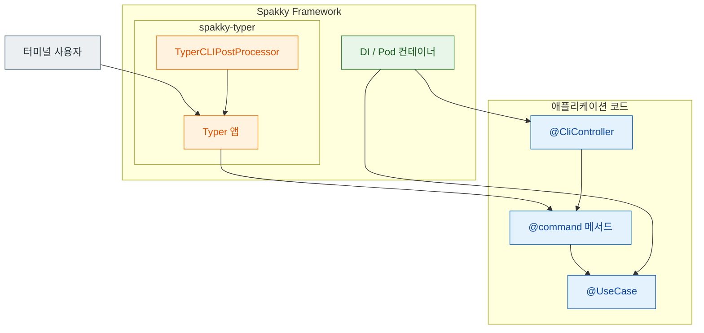

# CLI 애플리케이션 (Typer)

> `spakky-typer`는 Typer CLI 앱을 `@CliController` 클래스로 구조화합니다.
> CLI Controller Pod를 스캔하면 `@command()` 메서드가 Typer 하위 명령으로 자동 등록됩니다.

이 문서는 **처음 CLI를 만들 때 필요한 기초**만 다룹니다. 비동기 명령·컨텍스트 정리·인증 경계·Agent stream 같은 심화 주제는 [CLI 심화](typer-advanced.md)를 참고하세요.

---

## 명령 등록 흐름

`@CliController` Pod의 `@command()` 메서드가 Typer 하위 명령으로 노출되기까지의 경로입니다. 사용자 코드(Controller)는 DI 컨테이너와 `spakky-typer` 플러그인을 거쳐 Typer 앱에 연결되고, 최종 실행 파일에서 `cli()`로 호출됩니다.



`app.start()` 이후 `TyperCLIPostProcessor`가 `@CliController` Pod마다 하위 `Typer` 그룹을 만들고 `@command()` 메서드를 명령으로 등록한 뒤, 기본 `Typer` 앱에 `add_typer()`로 붙입니다. 사용자가 명령을 입력하면 Typer 앱 → 명령 → UseCase 순으로 흐르고, 컨트롤러·UseCase 인스턴스는 DI 컨테이너가 제공합니다.

---

## 기본 설정

```python
from typer import Typer
from spakky.core.application.application import SpakkyApplication
from spakky.core.application.application_context import ApplicationContext
import apps
import spakky.plugins.typer


app = (
    SpakkyApplication(ApplicationContext())
    .load_plugins(include={spakky.plugins.typer.PLUGIN_NAME})
    .scan(apps)
    .start()
)

cli: Typer = app.container.get(type_=Typer)
```

`spakky-typer`는 기본 `Typer` 앱을 Pod로 제공합니다. `app.start()` 이후 `TyperCLIPostProcessor`가 `@CliController` Pod의 `@command()` 메서드를 Typer 앱에 등록합니다. 실제 실행 파일에서는 컨테이너에서 꺼낸 `Typer` 객체를 모듈 전역에 두고, `__main__`에서 호출합니다.

```python
# main.py
from typer import Typer

from spakky.core.application.application import SpakkyApplication
from spakky.core.application.application_context import ApplicationContext

import apps
import spakky.plugins.typer


spakky_app = (
    SpakkyApplication(ApplicationContext())
    .load_plugins(include={spakky.plugins.typer.PLUGIN_NAME})
    .scan(apps)
    .start()
)

cli: Typer = spakky_app.container.get(Typer)


if __name__ == "__main__":
    cli()
```

```bash
python main.py --help
python main.py users create --name "John" --email "john@example.com"
```

---

## @CliController — CLI 명령 그룹

`@CliController`는 클래스를 CLI 명령 그룹으로 등록합니다. `group_name`을 생략하면 클래스명에서 자동으로 kebab-case 이름이 생성됩니다(`pascal_to_kebab`, 예: `UserController` → `user-controller`).
메서드에는 독립 함수인 `@command()`를 사용합니다. `@command(name=...)`을 생략하면 메서드명이 명령 이름이 됩니다.

```python
from spakky.plugins.typer.stereotypes.cli_controller import CliController, command

@CliController("users")
class UserCLI:
    _service: UserService

    def __init__(self, service: UserService) -> None:
        self._service = service

    @command("create")
    def create_user(self, name: str, email: str) -> None:
        """새 사용자 생성"""
        user = self._service.create(name, email)
        print(f"사용자 생성됨: {user.name} ({user.email})")

    @command("list")
    def list_users(self) -> None:
        """모든 사용자 조회"""
        for user in self._service.list_all():
            print(f"- {user.name}: {user.email}")

    @command("delete")
    def delete_user(self, user_id: str) -> None:
        """사용자 삭제"""
        self._service.delete(user_id)
        print(f"삭제됨: {user_id}")
```

실행 예시:

```bash
python main.py users create --name "John" --email "john@example.com"
python main.py users list
python main.py users delete --user-id "user-123"
```

`@command()`에는 Typer의 명령 옵션을 그대로 전달할 수 있습니다 — `help`, `short_help`, `epilog`, `hidden`, `deprecated`, `rich_help_panel` 등이 `TyperCommand` annotation에 저장되어 Typer에 그대로 넘어갑니다.

---

## 여러 컨트롤러

여러 `@CliController`를 정의하면 자동으로 하위 명령 그룹이 생성됩니다.
`group_name`을 생략하면 클래스명이 kebab-case로 변환됩니다 (예: `DatabaseCLI` → `database-cli`).

```python
@CliController("db")
class DatabaseCLI:
    @command("migrate")
    def migrate(self) -> None:
        """데이터베이스 마이그레이션 실행"""
        print("Migration running...")

    @command("seed")
    def seed(self) -> None:
        """초기 데이터 삽입"""
        print("Seeding data...")

# python main.py db migrate
# python main.py db seed
```

---

## DI 주입

일반 `@Pod`처럼 생성자 주입이 동작합니다. 명령은 컨테이너에서 resolve한 컨트롤러 인스턴스 위에서 실행되므로, UseCase·Service를 생성자로 받아 그대로 사용할 수 있습니다.

```python
from spakky.core.stereotype.usecase import UseCase

@UseCase()
class ImportDataUseCase:
    def execute(self, path: str) -> int:
        # 파일에서 데이터 임포트
        return 42

@CliController("data")
class DataCLI:
    _use_case: ImportDataUseCase

    def __init__(self, use_case: ImportDataUseCase) -> None:
        self._use_case = use_case

    @command("import")
    def import_data(self, path: str) -> None:
        """데이터 파일 임포트"""
        count = self._use_case.execute(path)
        print(f"{count}건 임포트 완료")
```

명령 옵션 이름은 Typer의 기본 규칙을 따릅니다. 위 예시는 `python main.py data import --path ./data.json`처럼 호출합니다.

---

## 다음 단계

| 주제 | 문서 |
| --- | --- |
| 명령 등록 내부 동작 | [CLI 심화](typer-advanced.md#command-registration) |
| 비동기 명령·컨텍스트 정리 | [CLI 심화](typer-advanced.md#async-context) |
| 인증/인가 경계 통합 | [CLI 심화](typer-advanced.md#auth-boundary) |
| Agent stream CLI | [CLI 심화](typer-advanced.md#agent-stream-cli) |
