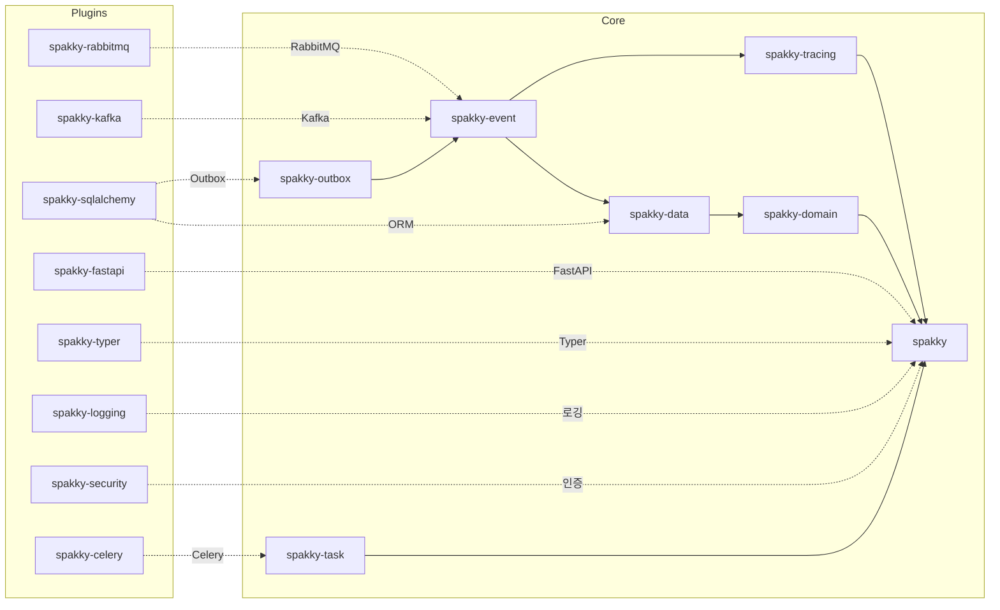

# Spakky Framework

**Spring-inspired DI/IoC Framework for Python 3.11+**

<p style="font-size: 1.2em; color: var(--md-default-fg-color--light);">
타입 안전한 의존성 주입, AOP, 이벤트 기반 아키텍처를 Python답게.
</p>

---

## 30초 만에 시작하기

**1. 설치**

```bash
pip install spakky
```

**2. 첫 번째 애플리케이션**

```python
from spakky.core.pod.annotations.pod import Pod
from spakky.core.application.application import SpakkyApplication
from spakky.core.application.application_context import ApplicationContext
import apps  # 여러분의 패키지

@Pod()
class GreetingService:
    def greet(self, name: str) -> str:
        return f"Hello, {name}!"

app = (
    SpakkyApplication(ApplicationContext())
    .scan(apps)
    .start()
)

service = app.container.get(type_=GreetingService)
print(service.greet("World"))  # Hello, World!
```

이것만으로 **DI 컨테이너**에 `GreetingService`가 싱글톤으로 등록되고, 타입 기반으로 조회할 수 있습니다.

---

## 주요 기능

### :material-needle: 의존성 주입

`@Pod` 데코레이터 하나로 자동 등록. 생성자 주입으로 의존성을 자동 해결합니다.

```python
@Pod()
class UserRepository:
    def find_by_id(self, user_id: UUID) -> User: ...

@Pod()
class UserService:
    _repo: UserRepository  # 자동 주입

    def __init__(self, repo: UserRepository) -> None:
        self._repo = repo

    def get_user(self, user_id: UUID) -> User:
        return self._repo.find_by_id(user_id)
```

### :material-layers-triple: AOP (관점 지향 프로그래밍)

횡단 관심사를 깔끔하게 분리. Before, After, Around 어드바이스를 지원합니다.

```python
from dataclasses import dataclass
from typing import Any

from spakky.core.aop.aspect import Aspect
from spakky.core.aop.interfaces.aspect import IAspect
from spakky.core.aop.pointcut import Around
from spakky.core.common.annotation import FunctionAnnotation
from spakky.core.common.types import Func

@dataclass
class Timed(FunctionAnnotation):
    """실행 시간 측정 어노테이션"""

@Aspect()
class TimingAspect(IAspect):
    @Around(Timed.exists)
    def around(self, joinpoint: Func, *args: Any, **kwargs: Any) -> Any:
        import time
        start = time.perf_counter()
        result = joinpoint(*args, **kwargs)
        elapsed = time.perf_counter() - start
        print(f"{joinpoint.__name__}: {elapsed:.3f}s")
        return result

@Pod()
class DataService:
    @Timed()
    def heavy_computation(self) -> int:
        return sum(range(1_000_000))
```

### :material-domain: DDD 빌딩 블록

Aggregate Root, Entity, Value Object, Domain Event를 기본 제공합니다.

```python
from uuid import UUID, uuid4

from spakky.core.common.mutability import mutable, immutable
from spakky.domain.models.aggregate_root import AbstractAggregateRoot
from spakky.domain.models.event import AbstractDomainEvent

@mutable
class Order(AbstractAggregateRoot[UUID]):
    customer_name: str
    total_amount: float

    @immutable
    class Created(AbstractDomainEvent):
        order_id: UUID
        total_amount: float

    @classmethod
    def next_id(cls) -> UUID:
        return uuid4()

    def validate(self) -> None:
        if self.total_amount < 0:
            raise ValueError("total_amount must be non-negative")

    @classmethod
    def create(cls, customer_name: str, total_amount: float) -> "Order":
        order = cls(uid=cls.next_id(), customer_name=customer_name, total_amount=total_amount)
        order.add_event(Order.Created(order_id=order.uid, total_amount=total_amount))
        return order
```

### :material-lightning-bolt: 이벤트 기반 아키텍처

도메인 이벤트와 통합 이벤트를 자동으로 라우팅합니다.
`@Transactional` 메서드가 성공하면, 수집된 Aggregate의 이벤트가 자동으로 발행됩니다.

```python
from spakky.core.stereotype.usecase import UseCase
from spakky.data.aspects.transactional import transactional
from spakky.event.stereotype.event_handler import EventHandler, on_event

@UseCase()
class CreateOrderUseCase:
    def __init__(self, order_repository: IOrderRepository) -> None:
        self._order_repository = order_repository

    @transactional
    async def execute(self, customer_name: str, total_amount: float) -> Order:
        order = Order.create(customer_name=customer_name, total_amount=total_amount)
        return await self._order_repository.save(order)
        # → Repository.save()가 AggregateCollector에 자동 등록
        # → 메서드 성공 후 Aspect가 order.events를 자동 발행

@EventHandler()
class OrderEventHandler:
    @on_event(Order.Created)
    async def on_order_created(self, event: Order.Created) -> None:
        print(f"주문 생성됨: {event.order_id}")
```

### :material-puzzle: 플러그인 시스템

FastAPI, SQLAlchemy, Celery 등을 플러그인으로 간편하게 통합합니다.

```python
import spakky.plugins.fastapi
import spakky.plugins.sqlalchemy

app = (
    SpakkyApplication(ApplicationContext())
    .load_plugins(include={
        spakky.plugins.fastapi.PLUGIN_NAME,
        spakky.plugins.sqlalchemy.PLUGIN_NAME,
    })
    .scan(apps)
    .start()
)
```

---

## 튜토리얼

실제 코드를 따라하며 배울 수 있는 단계별 가이드:

| 가이드                                     | 배울 내용                                              |
| ------------------------------------------ | ------------------------------------------------------ |
| [DI & Pod](guides/dependency-injection.md) | `@Pod`, 생성자 주입, `@Qualifier`, `@Primary`, `@Lazy` |
| [AOP](guides/aop.md)                       | `@Aspect`, Before/After/Around, 커스텀 어노테이션      |
| [도메인 모델링](guides/domain-modeling.md) | Entity, Value Object, Aggregate Root, Domain Event     |
| [이벤트 시스템](guides/events.md)          | `@EventHandler`, `@on_event`, EventBus, 이벤트 발행    |
| [태스크 & 스케줄링](guides/tasks.md)       | `@task`, `@schedule`, Crontab                          |
| [FastAPI 통합](guides/fastapi.md)          | `@ApiController`, HTTP 라우팅, WebSocket               |
| [보안](guides/security.md)                 | JWT, 암호화, 패스워드 해싱                             |
| [CLI 애플리케이션](guides/typer.md)        | `@Controller`, Typer 명령어                            |
| [데이터베이스](guides/sqlalchemy.md)       | Transaction, Repository, ORM                           |
| [Celery 태스크](guides/celery.md)          | 태스크 디스패치, 비동기 실행                           |
| [분산 트레이싱](guides/tracing.md)         | TraceContext, Propagator, W3C traceparent              |

---

## 패키지 구조

### Core

| 패키지                                     | 설명                               |
| ------------------------------------------ | ---------------------------------- |
| [spakky](api/core/spakky.md)               | DI Container, AOP, 부트스트랩      |
| [spakky-domain](api/core/spakky-domain.md) | DDD 빌딩 블록                      |
| [spakky-data](api/core/spakky-data.md)     | Repository, Transaction 추상화     |
| [spakky-event](api/core/spakky-event.md)   | 인프로세스 이벤트                  |
| [spakky-task](api/core/spakky-task.md)     | 태스크 추상화 (스케줄링, 디스패치) |
| [spakky-tracing](api/core/spakky-tracing.md) | 분산 트레이싱 추상화              |
| [spakky-outbox](api/core/spakky-outbox.md) | Outbox 패턴                        |

### Plugins

| 패키지                                                | 설명             |
| ----------------------------------------------------- | ---------------- |
| [spakky-logging](api/plugins/spakky-logging.md)       | 구조화된 로깅    |
| [spakky-fastapi](api/plugins/spakky-fastapi.md)       | FastAPI 통합     |
| [spakky-rabbitmq](api/plugins/spakky-rabbitmq.md)     | RabbitMQ 통합    |
| [spakky-security](api/plugins/spakky-security.md)     | 보안 (JWT, 인증) |
| [spakky-typer](api/plugins/spakky-typer.md)           | Typer CLI 통합   |
| [spakky-kafka](api/plugins/spakky-kafka.md)           | Kafka 통합       |
| [spakky-sqlalchemy](api/plugins/spakky-sqlalchemy.md) | SQLAlchemy 통합  |
| [spakky-celery](api/plugins/spakky-celery.md)         | Celery 통합      |

### 의존 방향


