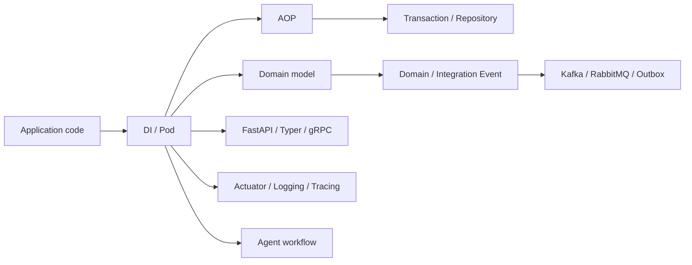

# Spakky Framework

> Spakky는 Python 3.12+에서 의존성 주입, AOP, 이벤트, 플러그인 통합을 한 흐름으로 엮어 주는 애플리케이션 프레임워크입니다.
> 작은 서비스부터 FastAPI, CLI, 메시지 브로커, Agent workflow까지 같은 컴포넌트 모델로 확장할 수 있습니다.

Spakky를 쓰면 비즈니스 코드는 직접 객체를 만들고 연결하는 일에서 한 걸음 떨어질 수 있습니다. `@Pod()`로 컴포넌트를 등록하고, 생성자 타입 힌트로 의존성을 선언하고, 필요할 때 FastAPI, SQLAlchemy, Celery, Kafka, RabbitMQ 같은 플러그인을 붙입니다.

가장 먼저 얻는 성공 경험은 단순합니다. “내 클래스가 컨테이너에 등록되고, 다른 클래스에 자동으로 주입된다.” 여기서 시작해 트랜잭션, 이벤트 발행, 스케줄링, 인증, 캐시, 분산 트레이싱, Agent 실행으로 넓혀 가면 됩니다.

## 첫 애플리케이션

먼저 `spakky`를 설치합니다.

```bash
pip install spakky
```

처음에는 이 설치만으로 충분합니다. 만들려는 앱의 경계가 정해졌다면 extra를 고르면 됩니다.
Extra는 두 층으로 나뉩니다. `minimal`, `recommended`, `full`은 설치 범위를 고르는 tier이고, `web`, `database`, `events-*`, `security` 같은 이름은 만들 앱의 종류를 나타냅니다.

| Tier | 설치 예 | 언제 고르나요 |
| --- | --- | --- |
| Minimal | `pip install spakky` | DI/AOP와 플러그인 로딩을 먼저 익힐 때 |
| Recommended | `pip install "spakky[recommended]"` | FastAPI + SQLAlchemy + 운영 기본기를 갖춘 일반 서비스 |
| Full | `pip install "spakky[full]"` | 공식 통합을 한 환경에서 모두 실험하거나 문서 예제를 넓게 검증할 때 |

| 만들고 싶은 앱 | 설치 예 |
| --- | --- |
| FastAPI 중심 HTTP 서비스 | `pip install "spakky[web]"` |
| SQLAlchemy 데이터베이스 서비스 | `pip install "spakky[database]"` |
| PostgreSQL driver까지 포함한 데이터베이스 서비스 | `pip install "spakky[database-postgres]"` |
| RabbitMQ 이벤트 서비스 | `pip install "spakky[events-rabbitmq]"` |
| Kafka 이벤트 서비스 | `pip install "spakky[events-kafka]"` |
| Outbox + SQLAlchemy 이벤트 저장소 | `pip install "spakky[events-outbox-sqlalchemy]"` |
| RabbitMQ, Kafka, Outbox를 모두 쓰는 이벤트 서비스 | `pip install "spakky[event-driven]"` |
| CLI 애플리케이션 | `pip install "spakky[cli]"` |
| Celery worker | `pip install "spakky[worker]"` |
| Redis cache 애플리케이션 | `pip install "spakky[cache-app]"` |
| 인증/인가가 필요한 서비스 | `pip install "spakky[security]"` |
| 관측성/운영 기본기 | `pip install "spakky[observability]"` |
| Agent workflow | `pip install "spakky[agent]"` |

패키지를 직접 조합해야 한다면 아래 지도를 기준으로 고르면 됩니다.

| 영역 | 패키지 |
| --- | --- |
| 기본 컨테이너 | `spakky`, `spakky-domain`, `spakky-data`, `spakky-event`, `spakky-task` |
| 애플리케이션 경계 | `spakky-fastapi`, `spakky-typer`, `spakky-grpc`, `spakky-sqlalchemy` |
| 메시징과 워크플로우 | `spakky-celery`, `spakky-rabbitmq`, `spakky-kafka`, `spakky-outbox`, `spakky-saga` |
| 인증/인가 | `spakky-auth`, `spakky-cryptography`, `spakky-oidc`, `spakky-policy`, `spakky-openfga` |
| 운영 | `spakky-logging`, `spakky-tracing`, `spakky-opentelemetry`, `spakky-actuator`, `spakky-cache`, `spakky-redis` |
| Agent | `spakky-agent`, `spakky-vllm` |

애플리케이션 패키지에 Pod를 하나 만들고 스캔합니다.

```python
from spakky.core.application.application import SpakkyApplication
from spakky.core.application.application_context import ApplicationContext
from spakky.core.pod.annotations.pod import Pod

import apps


@Pod()
class GreetingService:
    def greet(self, name: str) -> str:
        return f"Hello, {name}!"


app = (
    SpakkyApplication(ApplicationContext())
    .scan(apps)
    .start()
)

service = app.container.get(type_=GreetingService)
print(service.greet("World"))
```

`@Pod()`가 붙은 클래스는 `ApplicationContext`가 관리합니다. 다른 Pod가 `GreetingService`를 생성자 인자로 받으면 Spakky가 타입을 보고 자동으로 넣어 줍니다.

## 무엇을 만들 수 있나요?

Spakky의 핵심은 “같은 방식으로 컴포넌트를 만들고, 필요한 경계만 플러그인으로 확장한다”는 점입니다.



| 하고 싶은 일 | 먼저 볼 문서 |
| --- | --- |
| 클래스를 컨테이너에 등록하고 주입하기 | [DI & Pod](guides/dependency-injection.md) |
| 로깅, 트랜잭션 같은 공통 관심사 분리하기 | [AOP](guides/aop.md) |
| Aggregate, Entity, Value Object로 도메인 모델 만들기 | [도메인 모델링](guides/domain-modeling.md) |
| UseCase 성공 뒤 이벤트를 발행하고 처리하기 | [이벤트 시스템](guides/events.md) |
| HTTP API를 FastAPI 위에 올리기 | [FastAPI 통합](guides/fastapi.md) |
| 데이터베이스와 트랜잭션 붙이기 | [데이터베이스](guides/sqlalchemy.md) |
| 인증/인가 요구사항을 특정 provider에 묶이지 않게 선언하기 | [인증/인가](guides/security.md) |
| 긴 실행, 도구 호출, 승인 흐름이 있는 Agent 만들기 | [AI Agent 개발](guides/agents.md), [AI Agent 심화](guides/agents-advanced.md) |

## 다음 단계

처음이라면 [DI & Pod](guides/dependency-injection.md), [AOP](guides/aop.md), [도메인 모델링](guides/domain-modeling.md)을 차례로 읽어 보세요. 이 세 문서가 Spakky의 기본 문법입니다.

이미 애플리케이션 경계가 정해졌다면 필요한 통합 문서로 바로 가면 됩니다. HTTP는 [FastAPI 통합](guides/fastapi.md), CLI는 [CLI 애플리케이션](guides/typer.md), gRPC는 [gRPC 통합](guides/grpc.md), 메시징은 [RabbitMQ 통합](guides/rabbitmq.md) 또는 [Kafka 통합](guides/kafka.md)을 보면 됩니다.

운영 기능은 [구조화 로깅](guides/logging.md), [분산 트레이싱](guides/tracing.md), [OpenTelemetry 통합](guides/opentelemetry.md), [Actuator 상태 확인](guides/actuator.md)에서 이어집니다. 더 깊은 설계나 마이그레이션은 심화 가이드로 분리되어 있습니다. API 이름과 시그니처를 확인해야 할 때는 [API Reference](api/index.md)를 사용하세요.
