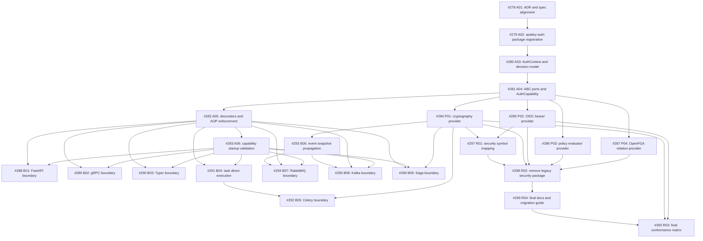

# Authentication and Authorization Milestone Scope

- **상태**: Active scope baseline
- **작성일**: 2026-05-15
- **대상 마일스톤**: 프레임워크 인증/인가
- **관련 ADR**: [ADR-0011](../adr/0011-auth-contribution-routing-boundary.md)

## 목적

이 문서는 인증/인가 마일스톤의 downstream issue가 공유해야 하는 scope와 DAG (Directed Acyclic Graph) 기준을 고정한다. ADR-0011은 future generic contribution routing proposal이며, 현재 인증/인가 구현의 SSOT (Single Source of Truth)가 아니다.

현재 구현 기준은 이 문서와 GitHub milestone issue body다. 코드 작업 티켓은 이 문서를 기준으로 scope drift를 판단하고, 각 티켓의 수용 기준을 넘는 구현을 추가하지 않는다.

## 범위

현재 마일스톤은 다음을 포함한다.

- `core/spakky-auth` 신규 core package 등록
- `AuthContext`, `CredentialCarrier`, `AuthContextSnapshot`, decision/error model
- ABC + `abstractmethod` 기반 auth port와 `AuthCapability` enum
- decorator metadata와 sync/async AOP enforcement
- feature-local capability startup validation
- `spakky-cryptography`, `spakky-oidc`, `spakky-policy`, `spakky-openfga` provider plugin
- FastAPI, gRPC, Typer, task, Celery, event, RabbitMQ, Kafka, Saga boundary integration
- legacy security utility package shim 없는 제거와 migration documentation

## 범위 밖

다음은 현재 인증/인가 마일스톤에서 구현하지 않는다.

- generic multi-contribution routing engine
- provider priority/routing DSL (Domain-Specific Language)
- Redis auth persistence contribution
- SQLAlchemy auth persistence contribution
- audit log platform
- approval grant lifecycle
- MCP (Model Context Protocol) runtime/tool authorization
- authorized data/query filtering
- OIDC browser login/callback/session/refresh/logout route
- OpenFGA tuple/model admin 또는 list-resources API
- generic policy engine, policy UI/API

범위 밖 항목이 downstream issue에서 발견되면 현재 PR에 섞지 않고 follow-up issue로 분리한다.

## 핵심 결정

- decorator가 없는 boundary는 allow all이다.
- protected/decorated boundary는 fail closed다.
- auth failure decision state는 `ALLOW`, `CHALLENGE`, `DENY`, `ERROR`다.
- `AuthContext`는 `ApplicationContext` request/context scope에 저장된다.
- inbound adapter는 기존 `clear_context` 이후 사용자 handler/task/step 호출 전에 `AuthContext`를 seed한다.
- task, broker, event, saga 전파는 raw bearer token이 아니라 signed `AuthContextSnapshot`을 사용한다.
- framework 고정 어휘는 typed model 또는 `Enum`으로 정의한다.
- permission, role, scope, resource, action, claim, tenant 값은 string canonical ref로 둔다.
- public port는 ABC + `abstractmethod`를 사용하며 `Protocol`은 사용하지 않는다.
- auth capability provider 수가 0개 또는 2개 이상이면 feature-local startup validation에서 structured auth startup error로 실패한다.
- provider-specific priority/routing은 구현하지 않는다.

## Phase 3.5 Loop-3 결과

Phase 3.5 Loop-3는 `BLOCKING=false`, `CONFIDENCE=HIGH`로 통과했다. 이 baseline은 다음을 의미한다.

- DAG (Directed Acyclic Graph) 모순 0건
- 누락 blocker 0건
- 도달 불가능한 성공 기준 0건
- 표면적 매핑 0건
- scope drift 0건
- hard block 0건

Downstream issue는 아래 DAG 기준을 따른다. #278은 문서/spec 정합성 고정 작업이며, #279 이후 구현 티켓의 코드를 선행 구현하지 않는다.

## DAG 기준



## 하위 이슈 본문 계약

#279부터 #300까지의 이슈 본문은 각 티켓의 구현 계약으로 취급합니다. 모든 본문은 이 기준선과
정합성을 유지해야 합니다.

- #279는 #278 이후에만 시작합니다.
- #280은 #279의 package registration 이후에만 시작합니다.
- #281은 #280의 semantic model 이후에만 시작합니다.
- #282는 #281의 public port/capability contract 이후에만 시작합니다.
- #283은 auth feature capability를 로컬에서 검증하며, generic contribution routing을 구현하지 않습니다.
- Provider 티켓 #284부터 #287까지는 #281의 public auth contract에 의존합니다.
- Boundary 티켓 #288부터 #296까지는 각 이슈 본문이 #282와 #283을 명시한 경우 decorator/AOP enforcement와 startup validation에 의존합니다.
- 제거/문서화 티켓 #297부터 #300까지는 각 이슈 본문에 적힌 provider 및 cleanup 선행 조건 이후에 실행합니다.

하위 티켓이 Redis/SQLAlchemy auth persistence, audit, approval, MCP runtime auth, data filtering,
generic provider routing을 요구하는 것처럼 보이면, 이후 이슈가 명시적으로 수용하지 않는 한
현재 마일스톤 범위 밖으로 봅니다.

## 검증

이 문서는 documentation-only 변경입니다. #278의 필수 검증은 다음과 같습니다.

```bash
uv run mkdocs build --strict
```
