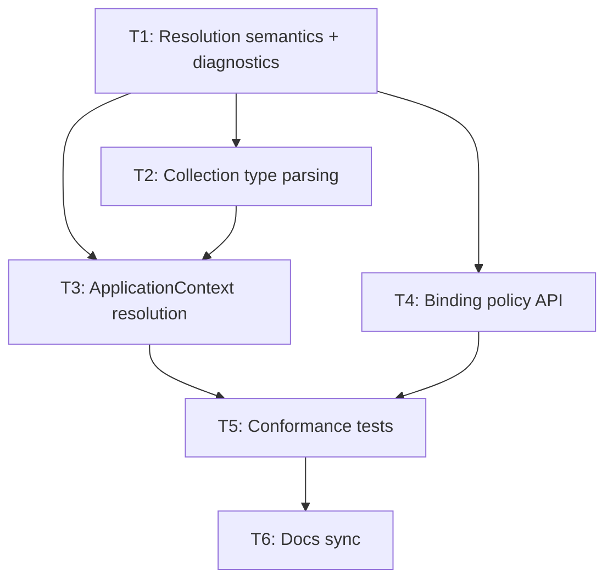

# DI Multi-Implementation Resolution Milestone Draft

- **상태**: Draft
- **작성일**: 2026-05-04
- **대상 마일스톤 제안명**: DI Multi-Implementation Resolution
- **후속 의존**: Agentic Hexagonal Architecture plugin family

## 1. 비즈니스 의도

Spakky Framework는 plugin entry point를 통해 설치된 플러그인을 자동 활성화한다. 이 모델은 사용자가 설치한 기능을 별도 `app.use()` 없이 활용하게 하는 장점이 있지만, 하나의 interface/port에 대응하는 여러 구현체가 동시에 설치될 때 DI resolution이 불안정해지는 문제가 있다.

Agent runtime 논의에서 이 문제가 명확히 드러났다. 예를 들어 `spakky-langgraph`와 `spakky-pydantic-ai`가 모두 `IAgentExecutionEngine`을 제공하거나, `spakky-vllm`과 API provider plugin이 모두 `IChatModel`을 제공하면 현재 DI semantics만으로는 안전한 선택이 어렵다.

이 마일스톤의 목적은 agent plugin family의 선행 기반으로, Spakky DI 컨테이너가 복수 구현체를 안정적으로 등록, 조회, 주입, 진단할 수 있게 만드는 것이다.

## 2. 현재 코드 근거

확인한 코드:

- `core/spakky/src/spakky/core/application/application.py`
- `core/spakky/src/spakky/core/application/application_context.py`
- `core/spakky/src/spakky/core/pod/annotations/primary.py`
- `core/spakky/src/spakky/core/pod/annotations/qualifier.py`
- `core/spakky/src/spakky/core/pod/interfaces/container.py`
- `docs/plugin-api.md`

현재 동작:

- `SpakkyApplication.load_plugins(include=None)`는 `spakky.plugins` entry point를 전부 로드한다.
- `include`가 지정되면 예외적으로 특정 plugin만 로드한다.
- `ApplicationContext`는 `__type_cache: dict[type, set[Pod]]`로 타입별 후보를 관리한다.
- 후보가 하나면 바로 선택한다.
- 후보가 여러 개면 `Qualifier`, dependency parameter name, `@Primary`로 좁힌다.
- `@Primary`와 `Qualifier`는 이미 존재하지만, collection injection과 설정 기반 binding은 없다.
- 복수 후보가 있는데 단수 주입이 명시적으로 결정되지 않는 경우의 사용자 진단이 충분하지 않다.

## 3. 사용자 시나리오

### US-1: 복수 구현체를 설치해도 애플리케이션이 예측 가능하게 시작된다

Given 사용자가 같은 interface를 구현하는 여러 plugin을 설치했다.  
When 애플리케이션이 `load_plugins().scan().start()` 순서로 시작된다.  
Then DI 컨테이너는 명시 선택이 있으면 해당 구현체를 주입하고, 없으면 후보와 해결 방법이 포함된 오류로 시작을 중단한다.

### US-2: 단수 구현체가 필요한 의존성은 명시적으로 하나만 선택된다

Given `IRepository` 구현체가 둘 이상 등록되어 있다.  
When 어떤 Pod가 `IRepository`를 단수로 주입받는다.  
Then `Qualifier`, 명시 name, 설정 binding, `@Primary`, 단일 후보 중 하나로 정확히 하나가 선택되어야 한다.

### US-3: 여러 구현체를 의도적으로 모두 받을 수 있다

Given `IHealthContributor` 또는 `IAgentExecutionEngine` 구현체가 여러 개 등록되어 있다.  
When 어떤 Pod가 collection 형태로 해당 구현체들을 주입받는다.  
Then 컨테이너는 후보 전체를 안정적인 순서와 이름으로 제공한다.

### US-4: 플러그인 adapter 선택은 설치 여부가 아니라 binding policy로 결정된다

Given `spakky-langgraph`와 `spakky-pydantic-ai`가 모두 설치되어 있다.  
When 어떤 agent definition이 `engine="langgraph"`를 지정하거나 application config가 default engine을 지정한다.  
Then 해당 이름의 execution engine이 선택된다.

## 4. 기능 요구사항

- **FR-1**: 컨테이너는 단수 주입에서 복수 후보가 모호하면 반드시 명시적 ambiguity error를 발생시켜야 한다.
- **FR-2**: 단수 후보 선택 우선순위는 `Qualifier`/명시 name, 설정 기반 binding, `@Primary` 단일 후보, legacy parameter name 자동 매칭, 단일 후보 순서여야 한다.
- **FR-3**: dependency parameter name 자동 매칭은 유지하되 명시 선택보다 낮은 legacy convenience로 분류한다.
- **FR-4**: 컨테이너는 `list[T]`, `tuple[T, ...]`, `dict[str, T]` 형태의 collection injection을 지원해야 한다.
- **FR-5**: collection injection은 `@Order` 또는 안정적인 Pod name 순서로 재현 가능한 순서를 제공해야 한다.
- **FR-6**: interface-to-implementation binding을 application config 또는 Pod metadata로 명시할 수 있어야 한다.
- **FR-7**: ambiguity error는 requested type, dependency path, 후보 Pod name/type, primary 여부, qualifier/name 해결 예시를 포함해야 한다.
- **FR-8**: `contains(type_)`는 후보 존재 여부와 단수 resolution 가능 여부를 혼동하지 않도록 semantics가 문서화되어야 한다.
- **FR-9**: 기존 `@Primary`, `Qualifier`, `name` 기반 테스트는 새 우선순위에 맞게 유지 또는 수정되어야 한다.
- **FR-10**: plugin 자동 활성화 모델은 유지한다. 이 마일스톤은 `app.use()` 또는 plugin manual activation API를 도입하지 않는다.

## 5. 도메인 계약

핵심 개념:

- **Candidate set**: 특정 requested type에 대해 등록된 Pod 후보 집합
- **Single resolution**: 단수 의존성에 대해 정확히 하나의 Pod를 선택하는 절차
- **Collection resolution**: 복수 의존성에 대해 후보 전체 또는 qualifier로 좁힌 후보들을 제공하는 절차
- **Binding policy**: 특정 requested type 또는 qualifier에 대해 선택할 Pod를 명시하는 설정
- **Ambiguity diagnostic**: resolution 실패 원인과 해결 방법을 담은 구조화된 오류 정보

계약 방향:

```text
Single injection
  T
  Optional[T]
  Annotated[T, Qualifier(...)]
  named binding

Collection injection
  list[T]
  tuple[T, ...]
  dict[str, T]
```

## 6. 도메인 규칙

- 단수 주입은 정확히 하나의 후보가 선택될 때만 성공한다.
- 후보가 여러 개인데 명시 선택이 없으면 framework가 임의로 선택하지 않는다.
- 여러 `@Primary` 후보가 존재하면 ambiguity error다.
- collection injection은 다중 구현체가 의도된 경우에만 사용한다.
- collection injection의 순서는 재현 가능해야 한다.
- plugin 자동 활성화는 유지한다.
- core package는 구현체 선택을 plugin 설치 순서에 의존하지 않는다.

## 7. 경계 조건

- `Optional[T]`에서 후보가 없으면 `None`이 허용된다.
- `Optional[T]`에서 후보가 여러 개이고 선택이 모호하면 `None`으로 숨기지 않고 ambiguity error를 발생시킨다.
- `dict[str, T]`는 Pod name을 key로 사용한다.
- 같은 Pod name 중복 등록은 기존 `PodNameAlreadyExistsError` 정책을 유지한다.
- parameter name 자동 매칭은 backward compatibility를 위해 유지한다.
- parameter name 자동 매칭은 `Qualifier`, 명시 name, 설정 binding, `@Primary`보다 낮은 우선순위를 가진다.
- 신규 코드에는 parameter name 자동 매칭 대신 `Qualifier`, 명시 name, 또는 binding policy 사용을 권장한다.

## 8. 상호작용

영향 영역:

- `ApplicationContext.__resolve_candidate`
- `ApplicationContext.__instantiate_pod`
- `Pod` dependency parsing
- `Qualifier` metadata
- `Primary` annotation
- `IContainer` interface
- startup diagnostics
- plugin API 문서
- dependency injection guide

Agent 마일스톤과의 상호작용:

- `IAgentExecutionEngine` 복수 구현체 선택
- `IChatModel`/`ILLMProvider` 복수 구현체 선택
- persistence adapter 복수 구현체 선택
- inbound adapter가 여러 runtime을 발견하고 명시 routing하는 구조

## 9. 범위 밖

- `app.use()` 형태의 plugin manual activation API 도입
- plugin installation resolver 또는 package manager 구현
- agent runtime 구현
- LangGraph/Pydantic AI/vLLM plugin 구현
- SaaS hosted runtime 구현
- 기존 plugin entry point 방식 교체

## 10. 성공 기준

- **SC-1**: 같은 interface 구현체가 둘 이상 있고 단수 주입 선택 정책이 없으면 startup 또는 `get()` 시 후보 목록이 포함된 ambiguity error가 발생한다.
- **SC-2**: `@Primary`가 정확히 하나인 경우 단수 주입이 해당 Pod를 선택한다.
- **SC-3**: `@Primary`가 둘 이상이면 ambiguity error가 발생한다.
- **SC-4**: `Annotated[T, Qualifier(...)]`는 qualifier에 맞는 후보를 선택한다.
- **SC-5**: 명시 name 기반 조회는 해당 name의 후보를 선택한다.
- **SC-6**: `list[T]` 또는 `tuple[T, ...]` 주입은 모든 후보를 안정적인 순서로 제공한다.
- **SC-7**: `dict[str, T]` 주입은 Pod name을 key로 모든 후보를 제공한다.
- **SC-8**: `Optional[T]`은 후보 없음만 `None`으로 처리하고, ambiguity는 숨기지 않는다.
- **SC-9**: 기존 plugin 자동 활성화 문서는 유지되고, multi-implementation 선택 방식이 문서에 추가된다.
- **SC-10**: agent adapter 예시 시나리오에서 `langgraph`와 `pydantic-ai` 후보가 동시에 있어도 명시 binding으로 하나를 선택할 수 있다.

## 11. 분해 초안

### T1. DI resolution semantics 확정 및 오류 진단 설계

담당 요구사항: FR-1, FR-2, FR-7, FR-8  
산출물:

- 단수/복수 resolution decision table
- ambiguity diagnostic 구조
- 기존 `NoUniquePodError` 확장 또는 신규 오류 정의
- dependency path에 후보 목록을 포함하는 진단 설계

선행: 없음

### T2. Collection injection 타입 파싱

담당 요구사항: FR-4  
산출물:

- `list[T]`, `tuple[T, ...]`, `dict[str, T]` dependency type parsing
- unsupported collection type error
- Optional/Annotated와의 조합 규칙

선행: T1

### T3. ApplicationContext candidate resolution 리팩터링

담당 요구사항: FR-1, FR-2, FR-3, FR-4, FR-5  
산출물:

- single resolution path
- collection resolution path
- primary/name/qualifier/binding/legacy parameter name 우선순위 정리
- deterministic ordering

선행: T1, T2

### T4. Binding policy API 설계 및 구현

담당 요구사항: FR-6  
산출물:

- interface-to-implementation binding 값 객체 또는 annotation
- application context registration API
- config-based binding을 위한 확장점

선행: T1

### T5. Regression and conformance tests

담당 요구사항: 전체 FR/SC  
산출물:

- 단수 ambiguity tests
- primary/qualifier/name priority tests
- collection injection tests
- optional ambiguity tests
- plugin adapter conflict 시나리오 tests

선행: T3, T4

### T6. 문서 동기화

담당 요구사항: FR-8, FR-10  
산출물:

- `docs/di-container.md` 업데이트
- `docs/guides/dependency-injection.md` 업데이트
- `docs/plugin-api.md` 업데이트
- 필요 시 `ARCHITECTURE.md` 의존성 설명 보강

선행: T5

## 12. 의존성 그래프



Critical path:

```text
T1 -> T2 -> T3 -> T5 -> T6
```

Parallel candidates:

- T2 and T4 can proceed after T1.
- T6 waits for behavior and tests to settle.

## 13. 쓰기 충돌 매트릭스

| 태스크 | 주요 파일 영역 | 충돌 위험 |
| ------ | -------------- | --------- |
| T1 | `core/spakky/src/spakky/core/pod/interfaces/container.py`, error/diagnostics | Medium |
| T2 | `core/spakky/src/spakky/core/pod/annotations/pod.py`, type utilities | Medium |
| T3 | `core/spakky/src/spakky/core/application/application_context.py` | High |
| T4 | container/application context config API | Medium |
| T5 | `core/spakky/tests/...` | Medium |
| T6 | docs | Low |

T3는 central change이므로 단독 처리해야 한다.

## 14. Self Review

- `[NEEDS CLARIFICATION]` 마커 없음.
- Agent 마일스톤과의 관계는 선행 기반으로 명시했다.
- plugin activation 모델은 실제 코드와 문서에 맞춰 `load_plugins()` 자동 로드 모델로 정정했다.
- Core 구현체 금지 원칙을 반영했다.
- `parameter name 자동 매칭`은 유지하되 명시 선택보다 낮은 legacy convenience로 분류했다.
- 다만 `Binding policy API`의 구체 사용자 표면은 후속 스펙에서 확정해야 한다.

## 15. 확정된 추가 결정

### Parameter name 자동 매칭

`parameter name 자동 매칭`은 backward compatibility를 위해 유지한다. 다만 복수 구현체 환경에서 암묵적 선택이 `@Primary` 또는 명시 binding을 덮어쓰면 예측 가능성이 떨어지므로, 우선순위를 낮춘다.

우선순위:

1. `Qualifier` 또는 명시 name
2. 설정 기반 binding
3. 정확히 하나의 `@Primary`
4. legacy parameter name 자동 매칭
5. 후보가 정확히 1개
6. ambiguity error

문서에서는 parameter name 자동 매칭을 legacy convenience로 설명하고, 신규 코드는 `Qualifier`, 명시 name, 또는 binding policy를 사용하도록 유도한다.
