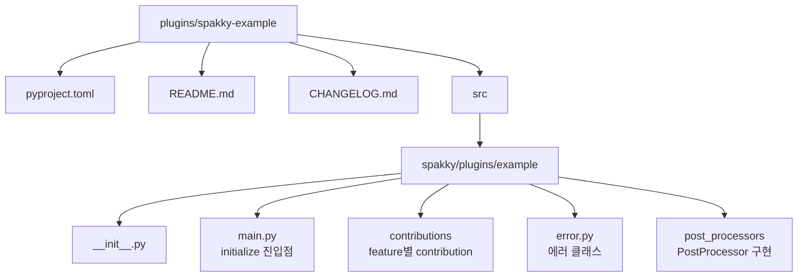
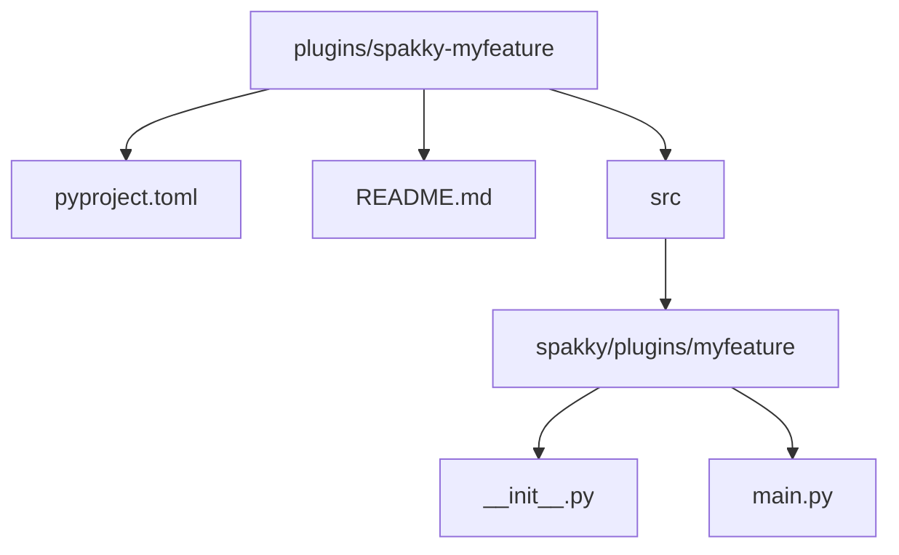
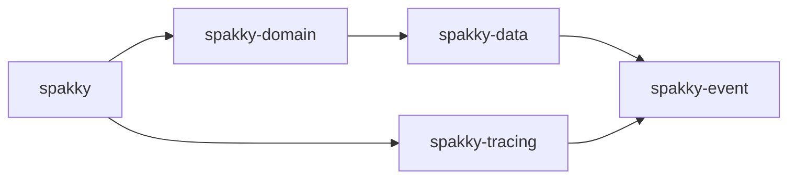

# 플러그인 API 가이드

이 문서는 Spakky Framework의 플러그인 시스템과 플러그인 개발 방법을 설명합니다.

---

## 개요

Spakky 플러그인 시스템은 Python의 `entry_points` 메커니즘을 사용하여 프레임워크 기능을 확장합니다. 플러그인은 다음과 같은 방식으로 동작합니다:

1. `pyproject.toml`에 `spakky.plugins` 그룹으로 entry point 등록
2. `SpakkyApplication.load_plugins()`가 등록된 플러그인 탐색
3. 각 base 플러그인의 `initialize(app: SpakkyApplication)` 함수 호출
4. 활성 core feature에 대한 `spakky.contributions.*` entry point 탐색 및 호출

---

## 플러그인 로딩

### 모든 플러그인 로드

```python
from spakky.core.application.application import SpakkyApplication
from spakky.core.application.application_context import ApplicationContext

app = SpakkyApplication(ApplicationContext())
app.load_plugins()  # 설치된 모든 spakky 플러그인 로드
app.scan()
app.start()
```

`load_plugins()`의 기본 동작은 설치된 entry point를 자동 발견하고 모두
초기화하는 것입니다. 복수 구현체 DI 지원은 이 자동 활성화 모델을 바꾸지
않습니다. 여러 플러그인이 같은 interface나 port 구현체를 등록해도 플러그인은
그대로 로드되며, 단수 주입 지점에서만 DI 컨테이너의 선택 정책이 적용됩니다.

### 선택적 플러그인 로드

```python
import spakky.plugins.fastapi
import spakky.plugins.sqlalchemy

# 각 플러그인의 PLUGIN_NAME을 사용하여 특정 플러그인만 로드
app.load_plugins(include={
    spakky.plugins.fastapi.PLUGIN_NAME,
    spakky.plugins.sqlalchemy.PLUGIN_NAME,
})
```

`include`가 지정되면 base plugin은 include set에 들어 있는 항목만 로드됩니다.
Contribution도 같은 명시성 규칙을 따르며, target feature plugin과 provider base
plugin이 모두 include set에 있고 실제 base plugin으로 로드된 경우에만 호출됩니다.

### Feature Contribution

Feature Contribution Policy는 인프라 plugin 하나가 여러 core feature에 구현을
기여하기 위한 표준 경로입니다. Base plugin은 자기 substrate의 공통 컴포넌트만
등록하고, feature-specific port 구현은 별도 contribution entry point로 선언합니다.
예를 들어 `spakky-sqlalchemy`의 base plugin은 SQLAlchemy connection, session,
transaction, schema registry를 등록하고, Outbox storage/table은
`spakky.contributions.spakky.outbox` contribution에서 등록합니다.
이 contribution은 `spakky-sqlalchemy`의 필수 의존성이 아니며, 사용자는
`spakky-outbox`를 별도로 설치하거나 `spakky-sqlalchemy[outbox]` extra를 사용할 수
있습니다.

```toml
[project.entry-points."spakky.plugins"]
spakky-sqlalchemy = "spakky.plugins.sqlalchemy.main:initialize"

[project.entry-points."spakky.contributions.spakky.outbox"]
spakky-sqlalchemy = "spakky.plugins.sqlalchemy.contributions.outbox:initialize"
```

Contribution group 이름은 `spakky.contributions.<feature>` 형식입니다. Feature
plugin 이름의 `-`는 Python package metadata group에서 안전하게 쓰기 위해 `.`로
정규화됩니다. 따라서 `Plugin(name="spakky-outbox")`의 contribution group은
`spakky.contributions.spakky.outbox`입니다.

Loader 순서는 다음과 같습니다.

1. `spakky.plugins` entry point를 이름순으로 로드합니다.
2. 로드된 base plugin으로 active feature/provider set을 계산합니다.
3. active feature 이름순으로 contribution group을 조회합니다.
4. 각 group 안의 contribution entry point를 이름순으로 호출합니다.
5. `scan()`과 `start()`는 contribution 로딩 이후 실행됩니다.

Provider base plugin은 contribution entry point name을 파싱하지 않고, 같은
distribution이 선언한 `spakky.plugins` metadata로 식별합니다. Contribution module은
target feature core package의 public contract와 자기 plugin 내부 구현만 import할 수
있으며, 다른 plugin public module을 직접 import하지 않습니다.

Startup diagnostics가 활성화되어 있으면 `load_plugins` phase detail에 contribution
결과가 함께 기록됩니다. Summary key는 `contributions.loaded`,
`contributions.skipped`, `contributions.failed`이며, skip reason은
`inactive_feature`, `inactive_provider`, `include_filter`로 구분됩니다. 개별 항목은
`contributions.loaded.item`, `contributions.skipped.item`,
`contributions.failed.item` detail로 feature, provider, group, entry point context를
남깁니다.

### 복수 구현체 선택

서로 다른 플러그인이 같은 port를 구현할 수 있습니다. 예를 들어 여러
execution adapter 플러그인이 같은 `IAgentAdapter`를 제공하는 경우,
플러그인을 opt-out하지 않고 application config에서 단수 선택 정책을 등록합니다.

```python
from spakky.core.application.application import SpakkyApplication
from spakky.core.application.application_context import ApplicationContext
from spakky.core.pod.binding import PodBinding

context = ApplicationContext()
context.bind(PodBinding(interface=IAgentAdapter, implementation_name="langgraph"))

app = (
    SpakkyApplication(context)
    .load_plugins()
    .scan()
    .start()
)
```

Binding은 Pod 등록 전에도 선언할 수 있으므로 `load_plugins()` 자동 활성화를
유지한 채 단수 주입의 기본 구현체만 선택할 수 있습니다. 우선순위는
`Qualifier`, 명시 name, binding, `@Primary`, legacy parameter name fallback
순서입니다. Binding target은 concrete type 또는 Pod name 중 정확히 하나만
지정해야 합니다.

모든 구현체가 필요한 확장 포인트는 단수 port 대신 collection 의존성을
선언합니다. `list[T]`, `tuple[T, ...]`, `dict[str, T]`는 매칭되는 모든 Pod를
Pod name 기준의 안정적인 순서로 주입하며, binding으로 하나를 고르지 않습니다.

```python
@Pod()
class AgentAdapterRegistry:
    def __init__(self, adapters: dict[str, IAgentAdapter]) -> None:
        self.adapters = adapters
```

`contains(type_)`는 후보 존재 여부만 의미합니다. 여러 플러그인이 같은 port
후보를 등록해 단수 선택이 모호해도, 후보가 하나 이상이면 `True`입니다. 실제
단수 resolution 가능성은 `get(type_)` 또는 생성자 주입 시점에 판정됩니다.

---

## 공식 플러그인

### 코어 플러그인

Core 플러그인은 자동 로드되지 않습니다. 구현체 플러그인의 `dependencies`로 선언되어, 구현체 플러그인 설치 시 함께 설치됩니다.

| 플러그인        | 설명                           |
| --------------- | ------------------------------ |
| `spakky-domain` | DDD 빌딩 블록                  |
| `spakky-auth`   | Provider-neutral 인증/인가 core package root |
| `spakky-data`   | Repository, Transaction 추상화 |
| `spakky-event`  | 인프로세스 이벤트 시스템       |
| `spakky-task`    | 태스크 큐 추상화 (@TaskHandler, @task, @schedule) |
| `spakky-tracing` | 분산 트레이싱 추상화 (TraceContext, Propagator)    |
| `spakky-outbox`  | Transactional Outbox 패턴                          |
| `spakky-saga`    | 사가 오케스트레이션 (SagaFlow, SagaStep, 보상 기반 롤백)  |

### UI 플러그인

| 플러그인         | 설명                       |
| ---------------- | -------------------------- |
| `spakky-fastapi` | FastAPI REST 컨트롤러 통합 |
| `spakky-typer`   | Typer CLI 컨트롤러 통합    |
| `spakky-grpc`    | gRPC 서비스 컨트롤러 통합  |

### 인프라 플러그인

| 플러그인            | 설명                       |
| ------------------- | -------------------------- |
| `spakky-rabbitmq`   | RabbitMQ 이벤트 브로커     |
| `spakky-kafka`      | Apache Kafka 이벤트 브로커 |
| `spakky-sqlalchemy` | SQLAlchemy ORM 통합        |
| `spakky-security`   | 암호화/해싱/JWT 유틸리티   |
| `spakky-celery`        | Celery 태스크 디스패치 및 스케줄 등록 |
| `spakky-logging`       | 구조화 로깅, @logged AOP Aspect       |
| `spakky-opentelemetry` | OpenTelemetry SDK 브릿지              |

---

## 플러그인 구조

플러그인 패키지의 표준 구조:



---

## 플러그인 개발

### 1. 패키지 구조 생성



### 2. pyproject.toml 설정

```toml
[project]
name = "spakky-myfeature"
version = "0.1.0"
description = "My feature plugin for Spakky Framework"
dependencies = [
    "spakky",
]

# Entry point 등록 (필수!)
[project.entry-points."spakky.plugins"]
spakky-myfeature = "spakky.plugins.myfeature.main:initialize"

[tool.pyrefly]
module-name = "spakky.plugins.myfeature"
```

기존 core feature에 구현을 기여하는 인프라 plugin이라면 base plugin entry point와
contribution entry point를 함께 선언합니다.

```toml
[project.entry-points."spakky.plugins"]
spakky-myinfra = "spakky.plugins.myinfra.main:initialize"

[project.entry-points."spakky.contributions.spakky.myfeature"]
spakky-myinfra = "spakky.plugins.myinfra.contributions.myfeature:initialize"
```

### 3. Plugin 식별자 정의

```python
# src/spakky/plugins/myfeature/__init__.py
from spakky.core.application.plugin import Plugin

PLUGIN_NAME = Plugin(name="spakky-myfeature")
```

### 4. initialize 함수 구현

```python
# src/spakky/plugins/myfeature/main.py
from spakky.core.application.application import SpakkyApplication


def initialize(app: SpakkyApplication) -> None:
    """플러그인 초기화.

    SpakkyApplication.load_plugins()에 의해 자동 호출됩니다.

    Args:
        app: Spakky 애플리케이션 인스턴스
    """
    # Pod 등록
    app.add(MyFeatureService)
    app.add(MyFeaturePostProcessor)

    # 또는 패키지 스캔
    # app.scan(path="spakky.plugins.myfeature")
```

---

## 확장 포인트

플러그인은 다음 메커니즘으로 프레임워크를 확장합니다:

### PostProcessor

Pod 인스턴스 생성 후 추가 처리를 수행합니다.

```python
from spakky.core.pod.annotations.pod import Pod
from spakky.core.pod.interfaces.post_processor import IPostProcessor

@Pod()
class MyFeaturePostProcessor(IPostProcessor):
    """Pod 인스턴스에 기능 주입"""

    def post_process(self, pod: object) -> object:
        # Pod 인스턴스 수정 또는 래핑
        if hasattr(pod, "__myfeature__"):
            return MyFeatureWrapper(pod)
        return pod
```

### Aspect

횡단 관심사를 구현합니다.

```python
from spakky.core.aop.aspect import AsyncAspect
from spakky.core.aop.interfaces.aspect import IAsyncAspect
from spakky.core.aop.pointcut import Around

@AsyncAspect()
class MyFeatureAspect(IAsyncAspect):
    """커스텀 Aspect"""

    @Around(pointcut=lambda x: MyAnnotation.exists(x))
    async def around_async(self, joinpoint, *args, **kwargs):
        # 전처리
        result = await joinpoint(*args, **kwargs)
        # 후처리
        return result
```

### Stereotype

역할을 나타내는 특화된 Pod 데코레이터를 정의합니다.

```python
from dataclasses import dataclass
from spakky.core.pod.annotations.pod import Pod

@dataclass(eq=False)
class MyFeatureHandler(Pod):
    """MyFeature 핸들러 Stereotype"""
    ...
```

### Service

생명주기 관리가 필요한 백그라운드 서비스를 구현합니다.

```python
from spakky.core.pod.annotations.pod import Pod
from spakky.core.service.background import AbstractBackgroundService

@Pod()
class MyFeatureBackgroundService(AbstractBackgroundService):
    """백그라운드에서 실행되는 서비스"""

    def initialize(self) -> None:
        """서비스 초기화"""
        ...

    def run(self) -> None:
        """메인 루프 (백그라운드 스레드)"""
        while not self._stop_event.is_set():
            self.do_work()
            self._stop_event.wait(timeout=1)

    def dispose(self) -> None:
        """리소스 정리"""
        ...
```

---

## 플러그인 예시: FastAPI

FastAPI 플러그인이 어떻게 구현되어 있는지 살펴봅니다.

### Entry Point

```toml
# plugins/spakky-fastapi/pyproject.toml
[project.entry-points."spakky.plugins"]
spakky-fastapi = "spakky.plugins.fastapi.main:initialize"
```

### 초기화

```python
# plugins/spakky-fastapi/src/spakky/plugins/fastapi/main.py
def initialize(app: SpakkyApplication) -> None:
    """FastAPI 플러그인 초기화"""
    app.add(BindLifespanPostProcessor)
    app.add(AddBuiltInMiddlewaresPostProcessor)
    app.add(RegisterRoutesPostProcessor)
```

### PostProcessor 구현

```python
@Pod()
class RegisterRoutesPostProcessor(IPostProcessor):
    """Controller의 라우트를 FastAPI에 등록"""

    def __init__(self, fast_api: FastAPI) -> None:
        self.fast_api = fast_api

    def post_process(self, pod: object) -> object:
        if Controller.exists(type(pod)):
            self._register_routes(pod)
        return pod

    def _register_routes(self, controller: object) -> None:
        # 라우트 등록 로직
        ...
```

---

## 플러그인 의존성

플러그인 간 의존성은 `pyproject.toml`의 `dependencies`로 선언합니다. Contribution은
target core feature contract를 import할 수 있으므로, provider package는 해당 core
feature package를 의존성에 포함해야 합니다:

```toml
[project]
name = "spakky-rabbitmq"
dependencies = [
    "spakky-event",  # spakky-event에 의존
    "aio-pika>=8.0.0",
]
```

코어 플러그인 의존 체인:



---

## 테스트

플러그인 테스트 시 플러그인만 선택적으로 로드합니다:

```python
import pytest
from spakky.core.application.application import SpakkyApplication
from spakky.core.application.application_context import ApplicationContext
import spakky.plugins.celery

@pytest.fixture
def app():
    app = SpakkyApplication(ApplicationContext())
    app.load_plugins(include={spakky.plugins.celery.PLUGIN_NAME})
    app.scan(path="tests.apps")
    app.start()
    yield app
    app.stop()

def test_my_feature(app):
    service = app.container.get(MyFeatureService)
    assert service is not None
```

---

## 모범 사례

### 명시적 PLUGIN_NAME 정의

```python
# __init__.py
from spakky.core.application.plugin import Plugin

PLUGIN_NAME = Plugin(name="spakky-myfeature")
```

### 에러 클래스 정의

```python
# error.py
from spakky.core.common.error import AbstractSpakkyFrameworkError

class MyFeatureError(AbstractSpakkyFrameworkError):
    """MyFeature 플러그인 기본 에러"""
    message = "MyFeature error occurred"
```

### 문서화

- `README.md` — 사용법, API 레퍼런스
- `CHANGELOG.md` — 버전별 변경 사항
- Docstring — 모든 공개 API에 작성

### 스캔보다 명시적 등록 선호

```python
# ✅ 권장: 명시적 등록
def initialize(app: SpakkyApplication) -> None:
    app.add(ServiceA)
    app.add(ServiceB)
    app.add(MyPostProcessor)

# ⚠️ 주의: 스캔은 예상치 못한 Pod 등록 가능
def initialize(app: SpakkyApplication) -> None:
    app.scan(path="spakky.plugins.myfeature")
```
