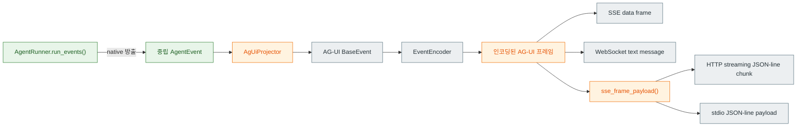

# spakky-agui

> `spakky-agui`는 `spakky-agent`를 위한 공식 AG-UI (Agent User Interaction) protocol adapter plugin입니다.
> 선언형 `@Agent` 실행 스트림을 AG-UI 이벤트로 투영(project)하여 SSE (Server-Sent Events),
> HTTP streaming, WebSocket, CLI stdio로 노출하고, deferred-tool 방식의 HITL (Human-in-the-loop) 승인 흐름을 지원합니다.

## 언제 필요한가

애플리케이션이 선언형 `@Agent` workflow를 실행하고, 그 실행 이벤트(토큰, 도구 호출,
승인 요청, 종료)를 AG-UI 호환 프런트엔드에 실시간 스트리밍하려 할 때 사용합니다.
렌더링(프런트엔드 UI)은 본 plugin의 범위 밖입니다 — 본 plugin은 와이어 프로토콜(SSE
프레임, HTTP JSON-line chunk, WebSocket text message, 또는 stdout JSON-line payload)만
책임집니다.

## 설치

```bash
pip install spakky-agui
```

durable Agent 실행(state·signal·evidence repository)과 모델 어댑터(`IAgentModel`)는
별도 provider가 제공합니다. `spakky-agui`는 inbound SSE/HTTP streaming/WebSocket/stdio
프로토콜 어댑터만 제공합니다.

## 설정

설정은 `SPAKKY_AGUI_` 환경변수 접두사를 사용하는 `AgUiConfig`로 읽습니다.

| 설정 | 기본값 | 목적 |
|------|--------|------|
| `SPAKKY_AGUI_SSE_PATH` | `/agui` | SSE endpoint가 마운트되는 경로 |
| `SPAKKY_AGUI_WEBSOCKET_PATH` | `/agui/ws` | WebSocket endpoint가 마운트되는 경로 |
| `SPAKKY_AGUI_HTTP_STREAM_PATH` | `/agui/stream` | HTTP streaming endpoint가 마운트되는 경로 |
| `SPAKKY_AGUI_EMIT_STATE_SNAPSHOT` | `true` | 중립 `STATE_SNAPSHOT` 이벤트를 AG-UI로 투영할지 여부 |
| `SPAKKY_AGUI_MESSAGES_SNAPSHOT_ENABLED` | `false` | `RUN_FINISHED` 직전에 `MESSAGES_SNAPSHOT` 프레임을 1회 방출할지 여부 |

## 동작 구조



- **`AgentRunner.run_events()`**: 런너가 중립 `AgentEvent` taxonomy를 native로 방출하는
  스트림입니다. 메시지/추론 delta, 도구 호출 `start`/`args-delta`/`end`/`result` 생명주기,
  run/step 경계를 각각 별개 이벤트로 내보냅니다. AG-UI는 이 source event를 그대로 복사하지 않고
  protocol이 요구하는 START/CONTENT/END frame으로 조립하거나 protocol에 없는 metadata를 생략합니다.
- **`AgUiProjector`**: 중립 이벤트의 delta를 AG-UI의 START/CONTENT/END 프레이밍으로
  투영하는 상태 기계입니다. 열린 message/reasoning/tool 프레임을 추적하고, 스트림이
  중간에 끊겨도 `finish()`가 열린 프레임을 닫아 와이어 형식을 보존합니다.
- **`AgUiRunDriver`**: `run_events()`를 projector·encoder에 연결하는 async generator입니다.
  `StreamingResponse`에 직접 전달됩니다. 승인 대기는 `RunPausedEvent`로 들어오며,
  projector가 이를 deferred-tool 승인 프레임으로 직접 투영합니다(아래 HITL 참조).

## 이벤트 매핑 (중립 → AG-UI)

| 중립 `AgentEvent` | AG-UI 이벤트 |
|------------------|-------------|
| `MESSAGE_DELTA` | `TEXT_MESSAGE_START` (id 변경 시) + `TEXT_MESSAGE_CONTENT` (빈 delta는 생략) |
| `REASONING_DELTA` | `REASONING_START` + `REASONING_MESSAGE_START` + `REASONING_MESSAGE_CONTENT` |
| `TOOL_CALL_START` | `TOOL_CALL_START` (`parentMessageId`는 열린 message로 fallback) |
| `TOOL_CALL_ARGS_DELTA` | `TOOL_CALL_ARGS` (빈 delta는 생략) |
| `TOOL_CALL_END` | `TOOL_CALL_END` |
| `TOOL_CALL_RESULT` | `TOOL_CALL_RESULT` (`content`는 result의 JSON 텍스트) |
| `RUN_STARTED` | `RUN_STARTED` (`threadId`=conversation, `runId`, `parentRunId`=neutral `parent_run_id`가 있을 때) |
| `RUN_PAUSED` | 열린 프레임 닫기 → 승인 pause는 `hitl_approval` deferred tool `TOOL_CALL_START`/`ARGS`/`END` |
| `RUN_FINISHED` | 열린 프레임 닫기 → `RUN_FINISHED` 또는 `RUN_ERROR` |
| `STEP_STARTED`/`STEP_FINISHED` | `STEP_STARTED`/`STEP_FINISHED`; finish 전에 해당 step의 열린 message/reasoning/tool frame 닫기 |
| `STATE_SNAPSHOT` | `STATE_SNAPSHOT` (`emit_state_snapshot=true`일 때만) |
| `STATE_DELTA` | `STATE_DELTA` (JSON Patch) |
| `ARTIFACT` | `CUSTOM` (name=`artifact`) — content에 neutral artifact id/name/content; signal Progress는 artifact name=`signal_progress` |

## 사용법

`@Agent` 위에 `@AGUICompatible`를 쌓고 FastAPI host를 Pod으로 등록합니다. plugin
`initialize()`는 `AgUiConfig`, `AgUiAgentRegistry`, FastAPI mount post-processor를 등록하므로
애플리케이션 코드는 `run_driver_factory`나 `add_agui_endpoint()`를 호출하지 않습니다.

```python
from fastapi import FastAPI
from spakky.agent import Agent, AgentExecutionSpec, IAgentModel
from spakky.core.application.application import SpakkyApplication
from spakky.core.application.application_context import ApplicationContext
from spakky.core.pod.annotations.pod import Pod
from spakky.plugins.agui import AGUICompatible


@Pod(name="fastapi_app")
def fastapi_app() -> FastAPI:
    return FastAPI()


@AGUICompatible()
@Agent(spec=AgentExecutionSpec(name="assistant", objective="answer with tools"))
class Assistant:
    def __init__(self, model: IAgentModel) -> None:
        self._model = model


application = SpakkyApplication(ApplicationContext())
application.load_plugins().scan(my_app).start()
app = application.container.get(FastAPI)
```

여러 Agent를 AG-UI로 노출한다면 각 Agent가 서로 다른 path를 선언해야 합니다.

```python
@AGUICompatible(
    sse_path="/agents/researcher/agui",
    http_stream_path="/agents/researcher/agui/stream",
    websocket_path="/agents/researcher/agui/ws",
)
@Agent(spec=AgentExecutionSpec(name="researcher"))
class Researcher:
    ...
```

`@AGUICompatible`에는 MCP 서버명을 굽지 않습니다. 서비스나 사용자가 run마다 붙일 외부 MCP
server를 고르면 AG-UI `forwardedProps.mcp`가 core `RunAgentInput.metadata["mcp"]`로 변환되고,
`spakky-mcp`가 그 run에만 toolset을 합류시킵니다.

Inbound mapping은 `runId` → `state_id`, `threadId` → `conversation_id`, optional
`parentRunId` → `parent_run_id`, 마지막 nonblank text user message → `instruction` 순서입니다.
Non-text user content는 현재 `ModelMessage` content part로 변환하지 않고 이전 text user message를
계속 찾습니다. `forwardedProps.metadata`의 JSON object를 run metadata로 먼저 복사한 뒤 explicit
`forwardedProps.mcp`가 `metadata["mcp"]`를 설정하므로 같은 key가 충돌하면 explicit `mcp`가 우선합니다.

Run별 model 선택은 `forwardedProps.modelSelection` 안의 `modelRef` 하나로 전달합니다. 이 값은
operator가 공개한 case-sensitive opaque catalog key이며 `/`를 provider/model 구분자로 해석하지
않습니다. Profile, provider, physical model, endpoint나 credential은 AG-UI caller surface가
아닙니다. `provider`, `profile`, `model`, `metadata` 같은 legacy/unknown sibling key가
`modelSelection`에 있으면 request resolution이 fail closed합니다.

```json
{
  "threadId": "conv-1",
  "runId": "run-1",
  "state": null,
  "messages": [{"id": "u1", "role": "user", "content": "check the issue"}],
  "tools": [],
  "context": [],
  "forwardedProps": {
    "modelSelection": {"modelRef": "support/primary"},
    "mcp": {"servers": ["github"]}
  }
}
```

`POST /agui`로 AG-UI `RunAgentInput`을 보내면 `text/event-stream` 응답으로 실행
이벤트가 스트리밍됩니다. `POST /agui/stream`은 같은 AG-UI event payload를 SSE `data:`
프레이밍 없이 `application/x-ndjson` HTTP response chunks로 순차 전달합니다.
WebSocket 클라이언트는 `/agui/ws`에 연결한 뒤 같은 AG-UI
`RunAgentInput` JSON을 text/JSON message로 보내고, 실행 이벤트를 AG-UI encoded text
message로 순서대로 받습니다. 같은 연결에서 후속 `RunAgentInput`을 보내 승인 결정
(`forwardedProps.approvalDecision` 또는 deferred tool-result message)을 전달할 수 있습니다.
SSE/HTTP/WebSocket/stdio 입력 경계는 AG-UI `threadId`·`runId`·마지막 user text·approval
resume 여부와 optional logical `modelRef`를 core `RunAgentInput`으로 변환합니다. 중립 `RunPausedEvent`나 delegated child
event의 attribution은 core에 남지만, wire-level `parentRunId`는 `RUN_STARTED` projection에서
`AgentEventAttribution.parent_run_id`를 사용합니다. 다른 event의 attribution·arbitrary metadata를
모든 AG-UI payload에 반복해서 복사하지 않습니다.

CLI stdio 경계는 아직 host command가 필요하므로 lower-level `AgUiStdioCommand`를 사용합니다.
입력은 `RunAgentInput` JSON 문서를 stdin 또는 문자열 인자로 받고 stdout에 AG-UI event payload를
한 줄에 하나씩 출력합니다. Typer 같은 CLI plugin은 이 callable을 command로 등록하면 됩니다.

stdio 전용 host는 `AgUiStdioCommand`에 lower-level `RunDriverFactory`를 전달합니다. 일반
FastAPI SSE/HTTP/WebSocket 노출은 위의 `@AGUICompatible` 선언만 사용합니다.

## HITL — deferred-tool 승인 흐름

AG-UI에는 1급 승인 이벤트가 없으므로, 승인 요청은 **deferred tool call**로 표면화됩니다.
`run_events()`는 승인이 필요한 도구에서 dispatch 없이 멈출 때, 성공 `RUN_FINISHED` 대신
`RunPausedEvent(reason=APPROVAL_REQUIRED)`를 방출합니다. 이 이벤트는 승인 prompt,
approval id, tool call id, allowed decisions를 담고 있으므로 어댑터가 durable state를
재조회하지 않고 직접 표면화할 수 있습니다.

1. 런너가 승인이 필요한 도구에서 멈추면, `run_events()`는 `RunPausedEvent`를 방출합니다.
   `AgUiProjector`는 이를 `hitl_approval` 도구의 `TOOL_CALL_START`/`ARGS`/`END`
   프레임으로 투영합니다 — **결과(result) 프레임은 없습니다** (결과가 지연되었기 때문).
2. 클라이언트는 이 deferred tool을 렌더링하고 사람의 결정을 받습니다.
3. 클라이언트는 다음 `RunAgentInput`에 그 결정을 담아 다시 POST합니다 — deferred call id를
   향한 tool-result 메시지로, 또는 `forwardedProps.approvalDecision`으로. 두 payload 모두
   `{"request_id": "<approval id>", "decision": "approve|reject|modify|defer|cancel"}` 형태여야 하며,
   `modified_payload`와 `comment`를 선택적으로 포함할 수 있습니다.
4. `ingest_decision`이 그 결정을 디코딩하여 durable signal queue에 `APPROVAL_DECISION`
   signal로 적재하면, fresh runner가 persisted iterative checkpoint의 pending batch를 복원해 첫 model
   step을 replay하지 않고 멈췄던 지점을 재개합니다. APPROVE/MODIFY는 tool을 실행하고 TOOL result
   history를 붙여 다음 model step으로 이어지며, REJECT는 dispatch 없이 terminal error가 있는 runner
   종료를 거쳐 AG-UI `RUN_ERROR`로 투영됩니다.

## 매핑 충실도

매핑은 protocol 의미를 보존하는 **명시적 projection**이지 event-by-event byte-for-byte 복사가
아닙니다. 한 `MESSAGE_DELTA`가 message START+CONTENT를 열 수 있고 빈 content/args delta는 AG-UI
제약 때문에 생략합니다. Stream 종료 시 열린 message/reasoning/tool frame은 `finish()`가 END로
닫고, artifact는 native type이 없어 `CUSTOM(name="artifact")`로 변환합니다. State snapshot은
`emit_state_snapshot=true`일 때만 방출하며 arbitrary neutral event metadata는 종류별로 필요한 값만
옮깁니다. `RUN_STARTED`는 thread/run/parent attribution을, successful `RUN_FINISHED`는 thread/run과
`metadata["output"]`을 사용합니다. `run_events()`는 reasoning을 지원하지 않는 route에서는
`REASONING_DELTA`를 생략하고, 현재 모델 루프가 생성하지 않는 `STATE_SNAPSHOT`/`STATE_DELTA`/
`ARTIFACT`도 live 런에 나타나지 않지만 projector는 taxonomy coverage를 위해 처리합니다.

Bounded iterative run에서는 `model-1`, `tool-1`, `model-2`처럼 step이 반복됩니다. Projector는
각 neutral `STEP_FINISHED`를 AG-UI로 내보내기 전에 그 step에서 열린 text/reasoning/tool frame을
먼저 닫으므로 message id와 frame이 다음 model/tool step으로 새지 않습니다. 각 model step은
`{run_id}:model-{N}:message`/`reasoning` id를 사용합니다. `NO_STREAM_UNTIL_FINAL_GUARDED` agent는
model `complete()`가 끝난 뒤에만 해당 step의 normalized frames를 내보내지만 tool continuation과
후속 model step은 streaming path와 같은 방식으로 반복됩니다.

Provider stream이 `TOOL_CALL_CANDIDATE`만 내는 경우 core cursor가 같은 call id의 neutral START와
END를 한 번씩 합성하므로 AG-UI에도 START → END → RESULT가 정확히 한 세트만 나타납니다. 이미
provider START/END를 받은 side는 candidate에서 다시 만들지 않습니다.

Default USER_MESSAGE와 STEERING hook의 `Progress`는 core `run_events()`에서
`ArtifactEvent(name="signal_progress")`로 변환되고 AG-UI에서는 artifact `CUSTOM` event로
표면화됩니다. Hook이 Token/Tool 등 neutral projection을 정의하지 않은 yield를 내면 임의 frame으로
바꾸거나 drop하지 않고 `agent_signal_projection_unsupported` RUN_ERROR로 닫습니다. Model/tool/
checkpoint/approval framework failure도 각각의 typed runner code로 `RUN_ERROR`에 전달됩니다.

Cancellation signal은 도착 위치와 관계없이 core의 canonical `cancelled` error(code, reason message,
state/signal id, optional requester metadata)로 들어오고 projector가 code/message를 한 번의 `RUN_ERROR`로
옮깁니다. Neutral cancel metadata 전체를 AG-UI error frame에 반복하지 않습니다. 이는 AG-UI transport
자체의 disconnect가 in-process sync callable을 preempt한다는 뜻도 아닙니다.

## 개발 검증

패키지 단위 검증은 해당 패키지 디렉토리에서 실행합니다.

```bash
uv run ruff format .
uv run ruff check .
uv run pyrefly check
uv run pytest
```

`pytest`는 각 패키지 `pyproject.toml`의 coverage 설정을 사용합니다.

## 라이선스

MIT License
