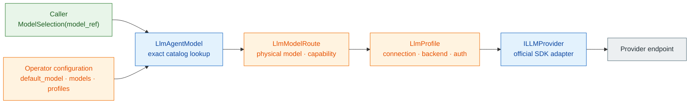
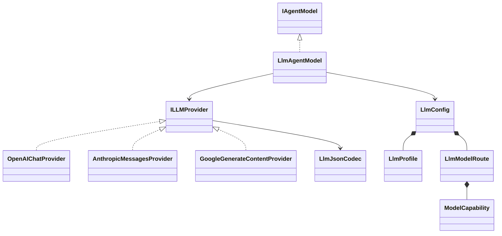

# spakky-llm

> `spakky-llm`은 `spakky-agent`의 `IAgentModel` port를 OpenAI-compatible, Anthropic, Gemini Developer API, Vertex AI에 연결하는 outbound adapter plugin입니다.
> Caller는 logical `model_ref`만 선택하고, operator가 model catalog와 connection profile로 실제 provider topology를 소유합니다.

## 설치

```bash
pip install spakky-llm
```

Agent 전체 조합은 root extra로 설치할 수 있습니다.

```bash
pip install "spakky[agent]"
```

`spakky-llm`은 model adapter만 제공합니다. Durable Agent 실행에는 `spakky-sqlalchemy[agent]` 같은 persistence contribution도 필요합니다.

## DX 경계

Application과 배포 설정의 책임을 다음처럼 분리합니다.



Caller가 알아야 하는 값은 `support/primary` 같은 logical `model_ref` 하나입니다. Profile 이름, physical model id, endpoint, credential과 header는 operator 설정에만 남습니다. 따라서 operator는 logical ref를 유지한 채 backend나 provider model을 교체할 수 있습니다.

Catalog membership은 connection/routing allowlist이지 caller authorization이 아닙니다. Caller·tenant별로 어떤 `model_ref`를 쓸 수 있는지는 상위 application/auth policy가 결정해야 하며, profile 이름에 `-prod`를 붙이는 것으로 접근 제어나 환경 격리가 생기지 않습니다.

`model_ref`는 앞뒤 공백만 routing 경계에서 제거하는 case-sensitive opaque key입니다. `/`를 provider/model separator로 분해하지 않습니다. `support/primary`, `moonshotai/kimi-k2`, `Qwen/Qwen3-8B`는 각각 logical ref와 provider model id의 독립된 문자열입니다. Catalog 밖 physical model id를 `model_ref`로 보내도 raw-model fallback 없이 `LlmModelSelectionError`로 실패합니다.

## 구성요소



| 구성요소 | 책임 |
|----------|------|
| `LlmAgentModel` | `model_ref`를 exact catalog route로 해석하고 단일 `IAgentModel` binding을 제공 |
| `LlmConfig` | `default_model`, operator-owned `models`, `profiles`의 참조 정합성 검증 |
| `LlmProfile` | provider API, endpoint, auth, header, timeout/retry, streaming과 dialect 같은 연결 설정 |
| `LlmModelRoute` | profile 참조, physical model id, capability, model별 vLLM option |
| `OpenAIChatProvider` | 공식 `openai` SDK로 standard OpenAI-compatible API와 vLLM dialect 처리 |
| `AnthropicMessagesProvider` | 공식 `anthropic` SDK로 native Messages API 처리 |
| `GoogleGenerateContentProvider` | 공식 `google-genai` SDK로 Gemini Developer API와 Vertex AI 처리 |
| `LlmJsonCodec` | structured output과 tool argument를 portable JSON Schema subset으로 검증 |

Plugin entry point는 세 first-party SDK adapter와 router를 등록하고 `IAgentModel`을 `LlmAgentModel`에 binding합니다. Root package `spakky.plugins.llm`은 plugin identity인 `PLUGIN_NAME`만 export합니다. 구현 타입이 필요하면 `spakky.plugins.llm.config`, `spakky.plugins.llm.model`, `spakky.plugins.llm.provider`, `spakky.plugins.llm.providers.openai`, `spakky.plugins.llm.providers.anthropic`, `spakky.plugins.llm.providers.google`의 명시적 모듈 경로를 사용합니다.

## Operator model catalog

Profile은 connection/backend/auth만, route는 model/capability만 소유합니다. Profile 이름은 `google-vertex`, `openrouter`, `anthropic`, `vllm-local`처럼 역할을 설명하는 중립 key를 사용합니다. 환경을 profile 이름에 박은 `*-prod` 관례는 필요하지 않습니다. 같은 key에 들어가는 endpoint와 credential을 배포별 external configuration으로 바꿉니다.

```python
from pydantic import SecretStr
from spakky.agent import ModelCapability
from spakky.plugins.llm.config import (
    GoogleCredentialStrategy,
    LlmConfig,
    LlmModelRoute,
    LlmProfile,
    LlmProviderApi,
    OpenAICompatibleDialect,
)

config = LlmConfig(
    default_model="support/primary",
    profiles={
        "google-vertex": LlmProfile(
            provider="google",
            api=LlmProviderApi.GOOGLE_VERTEX,
            google_credential_strategy=GoogleCredentialStrategy.ADC,
            google_project="project-id",
            google_location="us-central1",
        ),
        "openrouter": LlmProfile(
            provider="openrouter",
            api=LlmProviderApi.OPENAI_CHAT_COMPLETIONS,
            base_url="https://openrouter.ai/api/v1",
            api_key=SecretStr("operator-managed-secret"),
        ),
        "anthropic": LlmProfile(
            provider="anthropic",
            api=LlmProviderApi.ANTHROPIC_MESSAGES,
            api_key=SecretStr("operator-managed-secret"),
        ),
        "vllm-local": LlmProfile(
            provider="vllm",
            api=LlmProviderApi.OPENAI_CHAT_COMPLETIONS,
            base_url="http://127.0.0.1:8000/v1",
            openai_dialect=OpenAICompatibleDialect.VLLM,
        ),
    },
    models={
        "support/primary": LlmModelRoute(
            profile="google-vertex",
            model="publishers/google/models/gemini-2.5-pro",
            capability=ModelCapability(
                context_window_tokens=1_000_000,
                supports_tools=True,
                supports_structured_output=True,
            ),
        ),
        "coding/primary": LlmModelRoute(
            profile="openrouter",
            model="moonshotai/kimi-k2",
        ),
        "analysis/primary": LlmModelRoute(
            profile="anthropic",
            model="claude-opus-4-1",
            capability=ModelCapability(supports_reasoning=True),
        ),
        "local/primary": LlmModelRoute(
            profile="vllm-local",
            model="Qwen/Qwen3-8B",
            chat_template_kwargs={"enable_thinking": False},
        ),
    },
)
```

### 기본 구성

`LlmConfig()`를 별도 설정 없이 만들면 명시적 local vLLM route를 제공합니다.

| 항목 | 기본값 | 의미 |
|------|--------|------|
| `default_model` | `assistant/default` | selection이 없을 때 사용할 logical ref |
| `models["assistant/default"].profile` | `vllm-local` | default route의 connection profile |
| `models["assistant/default"].model` | `default` | endpoint에 전달할 physical model id |
| `models["assistant/default"].capability` | text-in/out, tools·structured output true | default route가 광고하는 queryable capability |
| `profiles["vllm-local"].provider` | `vllm` | routing evidence의 provider id |
| `profiles["vllm-local"].api` | `openai-chat-completions` | 공식 OpenAI SDK adapter 선택 |
| `profiles["vllm-local"].base_url` | `http://127.0.0.1:8000/v1` | local vLLM endpoint |
| `profiles["vllm-local"].api_key` | `EMPTY` | local SDK 구성용 sentinel |
| `profiles["vllm-local"].openai_dialect` | `vllm` | vLLM extension만 허용 |

이 기본값은 상용 provider credential을 추론하거나 network fallback을 등록하지 않습니다. Endpoint가 실행 중이지 않으면 local 호출은 정상적으로 연결 실패합니다.

### Environment configuration

`LlmConfig`는 `SPAKKY_LLM__` prefix와 `__` nested delimiter를 사용합니다. Opaque key에 slash가 들어갈 수 있으므로 전체 catalog를 JSON object로 주입하는 방식이 명확합니다.

```bash
export SPAKKY_LLM__DEFAULT_MODEL='support/primary'
export SPAKKY_LLM__PROFILES='{"anthropic":{"provider":"anthropic","api":"anthropic-messages","api_key":"operator-managed-secret"}}'
export SPAKKY_LLM__MODELS='{"support/primary":{"profile":"anthropic","model":"claude-opus-4-1","capability":{"supports_reasoning":true,"supports_tools":true,"supports_structured_output":true}}}'
```

`LlmConfig`와 nested model은 unknown field를 거부합니다. `SPAKKY_LLM__DEFAULT_PROFILE` 같은 제거된 top-level selector, `PROFILSE` 같은 오타, profile의 이전 `MODEL`/capability field, route의 credential field는 compatibility alias나 silent fallback 없이 실패합니다.

Environment와 dotenv의 `PROFILES`/`MODELS` JSON은 `object_pairs_hook` 기반 strict decoder를 사용해 catalog key뿐 아니라 nested profile/route/capability field의 duplicate key도 거부합니다. 표준 JSON parser의 last-key-wins 의미로 보안·routing 설정이 덮이지 않습니다.

Direct constructor 인자는 같은 field의 environment/dotenv 값보다 우선할 뿐 아니라, 그 ambient field를 JSON decoding 전에 mask합니다. 예를 들어 `LlmConfig(profiles=...)`는 malformed `SPAKKY_LLM__PROFILES` 때문에 실패하지 않지만 명시하지 않은 `MODELS`/`DEFAULT_MODEL` env는 계속 parsing·validation합니다. `default_model`, `profiles`, `models`를 모두 직접 넘기면 ambient `SPAKKY_LLM__...` source는 effective config에 참여하지 않으므로 같은 field의 malformed 값과 unrelated prefixed key도 읽지 않습니다.

### `LlmProfile` 필드

| Field | 기본값 | 책임 |
|-------|--------|------|
| `provider` | 필수 | routing evidence용 provider id |
| `api` | 필수 | provider adapter API family |
| `base_url`, `api_key`, `headers` | `None`, `None`, `{}` | operator-owned endpoint, secret, 추가 header |
| `request_timeout_seconds` | `30.0` | complete request timeout |
| `stream_timeout_seconds` | `300.0` | stream request timeout |
| `max_retries` | `0` | provider SDK retry 횟수 |
| `stream_enabled` | `true` | profile의 streaming 허용 여부 |
| `openai_dialect` | `standard` | `standard` 또는 `vllm` |
| `google_credential_strategy` | `None` | `api-key`, `adc`, `service-account-file` 중 explicit Google auth source |
| `google_project`, `google_location` | `None` | Vertex AI project/location |
| `google_service_account_file` | `None` | mounted service-account file path |

`API_KEY`는 `SecretStr`로 보관되며 provider client 생성 경계에서만 평문으로 읽습니다. Model id, capability, Google thought opt-in, Anthropic default token 같은 model 동작은 profile field가 아닙니다.

### `LlmModelRoute`와 capability

| Field | 기본값 | 책임 |
|-------|--------|------|
| `profile` | 필수 | `LlmConfig.profiles`의 exact key |
| `model` | 필수 | SDK에 전달할 physical model id |
| `capability` | `ModelCapability()` | route의 queryable model 능력 |
| `chat_template_kwargs` | `{}` | vLLM dialect에서만 허용되는 model별 option |

`ModelCapability`은 `supports_reasoning`, `context_window_tokens`, `supports_token_counting`, `input_modalities`, `output_modalities`, `supports_tools`, `supports_structured_output`을 선언합니다. Base capability의 input/output modality는 text이며 비어 있을 수 없고, context window는 지정한다면 양수여야 합니다. `spakky-llm` default route만 tools와 structured output을 true로 덮어씁니다. Router의 `capability`는 default route를, `capability_for(selection)`은 exact selected route를 반환합니다.

Capability는 provider 이름에서 추측하지 않습니다. Operator가 실제 deployment 지원과 맞게 선언하고 acceptance test로 확인해야 합니다. Google은 selected route의 `supports_reasoning`이 true일 때 `ThinkingConfig(include_thoughts=True)`를 요청합니다. OpenAI-compatible·Anthropic adapter는 provider가 반환한 reasoning/thinking extension의 노출만 같은 capability로 gate하며 generic thought request를 추가하지 않습니다. `AgentExecutionSpec.output_type`을 선언한 run은 runner가 selected route의 `supports_structured_output`을 provider request 전에 검사하지만, 나머지 모든 modality/tool capability가 일괄적으로 자동 집행된다는 뜻은 아닙니다. 또한 `ModelMessage.content`가 현재 `str`이므로 image/audio/video/document content part는 아직 이 plugin의 request mapping으로 보낼 수 없습니다.

## Caller model selection

Application caller는 operator가 공개한 logical ref만 전달합니다.

```python
from spakky.agent import ModelSelection, RunAgentInput

run_input = RunAgentInput(
    state_id="run-1",
    instruction="summarize this request",
    model_selection=ModelSelection(model_ref="support/primary"),
)
```

Selection을 생략하면 `LlmConfig.default_model`을 사용합니다. `RunAgentInput.model_selection`은 `ModelRequest.model_selection`으로 전달됩니다. `ModelSelection`에는 provider, profile, raw model, credential, endpoint 또는 metadata field가 없습니다.

AG-UI caller는 `forwardedProps.modelSelection.modelRef`, A2A caller는 data part의 canonical `modelSelection.modelRef`를 사용합니다. A2A는 모든 data part를 scan해 legacy outer `model_selection`을 발견하거나 canonical selector가 둘 이상이면 fail closed합니다. 두 adapter 모두 legacy provider/profile/model field와 unknown sibling key를 core request로 전달하지 않고 거부합니다.

## Provider API와 backend mode

Profile의 `api`가 실제 SDK surface를 선택합니다.

`LlmProfile.provider`는 operator label과 routing evidence이며 adapter registry key가 아닙니다. 실제 구현은 `profile.api`에 해당하는 `ILLMProvider.apis`로 선택됩니다. 따라서 `provider="openrouter"`와 `provider="vllm"`이 같은 `OpenAIChatProvider`를 사용하면서 endpoint와 dialect만 명시적으로 달리할 수 있습니다.

| `api` 값 | SDK adapter | 적용 대상 |
|----------|-------------|-----------|
| `openai-chat-completions` | `OpenAIChatProvider` | OpenAI, OpenRouter, vLLM 등 OpenAI-compatible endpoint |
| `anthropic-messages` | `AnthropicMessagesProvider` | Anthropic Messages API |
| `google-gemini-developer` | `GoogleGenerateContentProvider` | Gemini Developer API + API key |
| `google-vertex` | `GoogleGenerateContentProvider` | Vertex AI + project/location + Google credential |

**Gemini Developer API는 Google의 제품명이지 dev 환경 이름이 아닙니다.** 상용 서비스에서도 operator가 선택할 수 있는 backend입니다. Repository의 로컬·CI unit/acceptance test는 injected SDK client와 credential test double로 mapping contract를 검증하므로 commercial credential이나 실제 cloud project 접근이 필요하지 않지만, live service/IAM 접근 가능성을 검증하는 테스트는 아닙니다.

### Google auth matrix

| API | SDK mode | 필수 설정 | 금지 설정 |
|-----|----------|-----------|-----------|
| Gemini Developer API | `enterprise=False` | `api-key` strategy + `api_key` | project, location, service-account file |
| Vertex AI + ADC | `enterprise=True` | project, location, `adc` strategy | API key, service-account file |
| Vertex AI + service account | `enterprise=True` | project, location, `service-account-file` strategy + file | API key, 누락된 file |

ADC (Application Default Credentials)를 선택하면 cloud-platform scope로 `google.auth.default()`를 호출합니다. Service-account strategy는 operator가 지정한 mounted file을 같은 scope로 읽습니다. ADC chain 사용 자체는 explicit strategy이므로 backend나 credential source를 request metadata에서 추론하지 않습니다. Developer API와 Vertex AI field를 섞거나 project/location을 누락하면 config 생성이 실패합니다.

ADC가 개발자 workstation credential을 발견할 수는 있지만 그 사실이 Vertex project 접근 권한을 만들지는 않습니다. 실제 접근 가능 범위는 선택된 identity에 부여된 Google IAM 권한이 결정하며 framework는 `-prod` 같은 profile 이름으로 권한을 부여하거나 우회하지 않습니다. ADC가 반환한 ambient project 값도 routing에 사용하지 않고 profile에 명시한 project/location을 SDK에 전달합니다.

Gemini Developer API는 `base_url`이 없으면 `https://generativelanguage.googleapis.com/`를 명시적으로 사용합니다. Vertex AI는 profile의 `base_url`이 있으면 그 값을 그대로 우선합니다. 없으면 `google_location="global"`은 `https://aiplatform.googleapis.com/`, multi-region `us`와 `eu`는 각각 `https://aiplatform.us.rep.googleapis.com/`와 `https://aiplatform.eu.rep.googleapis.com/`, 그 밖의 lowercase endpoint-safe region은 `https://{location}-aiplatform.googleapis.com/`로 변환해 `HttpOptions.base_url`에 명시합니다. 따라서 SDK ambient `GOOGLE_VERTEX_BASE_URL`은 Vertex endpoint를 바꾸지 못합니다. Project/location/credential과 `enterprise=True`도 SDK에 explicit 전달하며 caller metadata는 이 값을 바꿀 수 없습니다.

### OpenRouter와 vLLM

OpenRouter는 `provider="openrouter"`, `api=openai-chat-completions`, `openai_dialect=standard`, explicit OpenRouter base URL과 credential을 가진 일반 OpenAI-compatible profile로 구성합니다. Provider-specific payload semantics가 실제로 필요해질 때만 새 `ILLMProvider` 또는 explicit dialect를 추가합니다.

vLLM은 같은 OpenAI SDK adapter를 사용하되 `openai_dialect=vllm`과 explicit `base_url`을 요구합니다. `chat_template_kwargs`와 vLLM structured-output extension은 vLLM route에서만 `extra_body`로 전달됩니다. Standard OpenAI-compatible profile에 `chat_template_kwargs`가 연결되면 `LlmConfig`가 거부합니다.

Official OpenAI와 OpenRouter 같은 standard profile은 API key가 필요합니다. vLLM dialect는 API key를 생략할 수 있으며 adapter가 ambient OpenAI key 대신 non-secret `not-required` sentinel을 SDK에 전달합니다. OpenRouter profile에서 `base_url`을 생략하면 provider label로 endpoint를 추론하지 않고 official OpenAI endpoint가 선택되므로 OpenRouter 구성에는 base URL을 반드시 명시합니다.

Anthropic Messages 요청은 `SamplingOptions.max_tokens`가 있으면 그 값을 사용하고, 없으면 adapter 기본값 `4096`을 사용합니다. 현재 profile/route별 Anthropic default-output-token field는 없습니다.

## Fail-closed routing과 확장

Catalog는 다음 오류를 설정 또는 routing 경계에서 거부합니다.

- blank profile/model-ref/physical-model key
- 앞뒤 공백 제거 후 duplicate profile 또는 model ref
- models가 가리키는 unknown profile
- catalog에 없는 `default_model` 또는 request `model_ref`
- case-folded lookup, slash parsing, provider/raw-model fallback
- request metadata의 endpoint, credential, header, profile 또는 physical model override
- Google backend/auth field의 누락·혼합
- non-vLLM profile의 vLLM route option

`ILLMProvider.apis`는 구현이 담당하는 `LlmProviderApi` 집합이고, generic `is_default` property는 replaceable default 여부입니다. First-party OpenAI/Anthropic/Google adapter는 `is_default=True`; custom 구현은 override하지 않으면 false입니다.

`LlmAgentModel`은 주입된 `tuple[ILLMProvider, ...]`를 API family별 registry로 만듭니다. API마다 non-default custom 구현이 정확히 하나면 같은 API를 claim하는 first-party default 대신 선택됩니다. Non-default가 둘 이상이면 ambiguity error이고, custom이 없으면 default가 정확히 하나여야 합니다. Empty `apis`와 configured profile API의 구현 누락도 `LlmConfigurationError`입니다. 한 adapter가 여러 API family를 명시하는 것은 허용하므로 `GoogleGenerateContentProvider`가 Developer API와 Vertex AI를 함께 담당합니다. 이 선택은 hardcoded first-party class 검사나 등록 순서, provider 문자열이 아니라 `apis`/`is_default` contract만 사용합니다.

새 OpenAI-compatible vendor는 standard profile의 endpoint/auth/header를 추가하는 것으로 확장합니다. 새로운 native wire protocol은 `LlmProviderApi` entry와 그 API를 claim하는 `ILLMProvider` 구현을 함께 추가해야 하며, free-form `provider` 문자열만으로 arbitrary native adapter를 활성화하지 않습니다.

## Routing metadata

First-party adapter가 생성하는 `ModelResponse`, `ModelStreamEvent`, `ModelToolCall`, normalized `ModelError`는 공통 routing metadata를 보존합니다. 이 보장은 core `AgentEvent`나 AG-UI/A2A wire metadata 전체에 자동 전파된다는 뜻이 아닙니다.

| Field | 값 |
|-------|----|
| `model_ref` | caller selection 또는 `default_model` |
| `profile` | resolved operator profile key |
| `provider` | profile의 provider id |
| `model` | SDK에 전달한 physical model id |

Terminal response/event는 `finish_reason`을 추가하며 provider에 따라 `response_id`, `response_model`, reasoning 또는 thought signature가 추가될 수 있습니다. Unknown ref는 default route를 선택한 것처럼 꾸미지 않고 요청된 `model_ref`만 error metadata에 남깁니다. Credential과 header는 metadata에 포함하지 않습니다.

### Iterative continuation history

`AgentRunner`는 validated model tool batch를 assistant history로 보존하고 각 실행 결과를 `TOOL` message로 추가한 뒤 같은 logical route로 다음 model step을 요청합니다. Assistant message의 `metadata["tool_calls"]`에는 call id, name, arguments와 adapter가 붙인 provider metadata가 함께 들어가고, `TOOL` message는 `call_id`와 `tool_name`으로 결과를 correlate합니다.

OpenAI adapter는 이를 assistant `tool_calls`와 `role="tool"` history로, Anthropic adapter는 `tool_use`/`tool_result` content block으로, Google adapter는 `FunctionCall`/`FunctionResponse` part로 복원합니다. Google function-call part의 base64 `thought_signature`는 `ModelToolCall.metadata` → assistant history → 다음 native `types.Part.thought_signature` 경로로 round-trip합니다. Physical route evidence도 assistant history와 step/evidence metadata에 유지되며 credential/header는 들어가지 않습니다.

Streaming model step과 `NO_STREAM_UNTIL_FINAL_GUARDED` complete step은 같은 continuation contract를 사용합니다. Complete response의 tool calls는 runner가 START/END/CANDIDATE/DONE event로 normalize한 뒤 streaming path와 동일하게 batch validation·approval·dispatch됩니다. Google처럼 candidate만 제공하는 stream은 runner가 missing START/END만 합성하고, OpenAI/Anthropic처럼 lifecycle side를 이미 제공한 stream은 중복 frame을 만들지 않습니다.

Provider request 직전 history는 assistant tool-call envelope와 모든 correlated TOOL result가 완전한 group인지 검사됩니다. Built-in compaction은 group 경계를 보존하고 custom compaction output도 strategy 단계마다 재검증되므로 orphan/missing/duplicate call-result history를 native SDK에 넘기지 않습니다. Invalid group은 provider 호출 전 `agent_model_execution_failed`로 terminalize됩니다.

## 선언형 structured output

Application의 권장 surface는 raw schema를 model adapter에 직접 넘기는 방식이 아니라 `AgentExecutionSpec(output_type=Answer)`입니다. Core가 Pydantic `BaseModel`, 표준 `dataclass`, `TypedDict`에서 alias-aware·strict portable schema를 생성하고, `LlmAgentModel`은 이를 selected route와 결속해 provider adapter에 전달합니다. Agent code는 provider별 response-format object나 schema compiler를 알 필요가 없습니다.

```python
from pydantic import BaseModel

from spakky.agent import Agent, AgentExecutionSpec, IAgentModel


class Answer(BaseModel):
    answer: str
    confidence: float


@Agent(spec=AgentExecutionSpec(name="support_agent", output_type=Answer))
class SupportAgent:
    def __init__(self, model: IAgentModel) -> None:
        self.model = model
```

Provider mapping은 core schema 의미를 유지하되 wire 형식은 각 SDK에 맞춰집니다.

- OpenAI-compatible standard mode는 `response_format={type: "json_schema", ...}`를 사용합니다. Strict request에서는 core schema를 mutate하지 않는 wire copy를 만들고, 모든 nested object의 property를 `required`로 만들며 `additionalProperties=false`를 적용합니다. 따라서 Python default를 생략할 수 있는 core contract은 그대로지만 OpenAI wire는 해당 property도 생성하도록 요청합니다. Arbitrary-key object처럼 `additionalProperties` 자체가 schema인 strict shape는 제약을 약화하지 않고 `LlmUnsupportedFeatureError`로 거부합니다.
- Anthropic은 Messages `output_config.format` JSON Schema로, Google은 `response_mime_type="application/json"` + `response_json_schema`로 매핑합니다.
- vLLM dialect는 같은 OpenAI SDK request와 함께 `extra_body.structured_outputs.json`에 core schema를 전달합니다. 이 extension은 standard dialect로 유출되지 않습니다.

세 adapter는 완료·stream 모두에서 provider JSON을 `LlmJsonCodec`의 portable schema로 먼저 검증한 후 `ModelResponse.structured_output` 또는 `ModelStreamEventKind.STRUCTURED_OUTPUT`으로 게시합니다. Runner는 이 값을 선언한 Python 타입으로 다시 strict materialization하므로, provider schema validation과 application type materialization은 서로 대체하지 않습니다. Text JSON fallback, coercion, extra-key drop, truncated/partial structured stream은 success final로 올라오지 않습니다.

## Tool authority와 terminal validation

Provider가 tool call을 반환했다는 사실만으로 실행 권한이 생기지 않습니다. Request에 `ToolCallingSpec.tools` catalog가 선언되어 있어야 하며, provider가 반환한 모든 tool name과 arguments가 그 catalog schema를 통과해야 합니다. Catalog가 없거나 비어 있거나 catalog에 없는 tool이면 거부합니다. `ModelToolChoice.NONE`은 call 1개 이상을, `ModelToolChoice.REQUIRED`는 call 0개를 각각 `LlmResponseError`로 처리합니다.

OpenAI는 tool call 유무와 terminal `finish_reason=tool_calls`가 서로 일치해야 하고, Anthropic은 같은 규칙을 `stop_reason=tool_use`에 적용합니다. 세 provider의 성공 stream은 terminal reason이 반드시 있어야 하며, EOF까지 reason이 없으면 partial output을 `DONE`으로 게시하지 않습니다.

`TOOL_CALL_CANDIDATE`는 `AgentRunner`가 batch authority 검증을 시작할 수 있는 side-effect 경계입니다. 모든 provider는 terminal/refusal 상태, provider-level 전체 tool batch, tool choice와 provider terminal consistency, structured output을 먼저 검증한 뒤 candidate를 게시합니다. Batch 중 하나라도 provider contract에서 invalid하면 앞선 valid call도 candidate가 되지 않습니다. Runner는 candidate batch 전체의 registered descriptor, stable/unique call id, Python argument binding, approval plan과 tool budget을 다시 prevalidate하고 모든 approval gate를 통과한 뒤 첫 tool을 dispatch합니다. Provider-level validation과 runner authority validation은 서로 대체하지 않습니다. OpenAI는 candidate 이전의 informational `TOOL_CALL_START`/`TOOL_CALL_ARGS_DELTA`는 stream할 수 있지만 `TOOL_CALL_END`와 candidate는 검증 완료까지 보류합니다. Anthropic은 `START`/`ARGS_DELTA`/`END`/candidate 전체를, Google은 candidate를 terminal 검증 전까지 buffer합니다.

SDK의 terminal literal type을 success allowlist로 간주하지 않습니다.

| Provider | Success | Refusal | `LlmResponseError` |
|----------|---------|---------|--------------------|
| OpenAI-compatible | `stop`, `length`, `tool_calls` | `content_filter`; non-empty message/delta refusal | `null`, legacy `function_call`, unknown reason |
| Anthropic | `end_turn`, `max_tokens`, `stop_sequence`, `tool_use`, `model_context_window_exceeded` | `refusal` 또는 non-null `stop_details` | `null`, `pause_turn`, unknown reason |
| Google | `STOP`, `MAX_TOKENS` | safety, recitation, language, blocklist, prohibited-content, image refusal family | unknown/other reason |

Token/context limit 계열 success terminal도 structured output을 요청했다면 누적 JSON 검증을 통과해야 합니다. Provider SDK의 automatic tool execution은 사용하지 않으며, Google automatic function calling은 tool 요청에서 명시적으로 비활성화합니다. Tool candidate의 승인·dispatch와 result/evidence는 Spakky `AgentRunner`가 소유합니다.

## 응답 검증과 client lifecycle

`LlmJsonCodec`은 provider가 반환한 structured output과 tool argument를 선언된 portable JSON Schema subset으로 검증합니다. Value를 검사하기 전에 schema shape 전체를 재귀 검증하므로 선택되지 않은 `anyOf` branch나 실제 value에 사용되지 않은 nested branch의 unsupported validation keyword도 거부합니다. 알 수 없는 schema `type`, non-finite number와 `prefixItems` 이후 금지된 tail을 허용하지 않습니다. Structured stream이 truncation으로 끝나도 terminal에 누적 JSON을 decode·validate하므로 partial document를 structured output으로 게시하지 않습니다.

HTTP 200도 SDK decode와 typed payload validation을 통과해야 성공입니다. OpenAI, Anthropic, Google adapter는 malformed success JSON, SDK response validation failure, mapping 중 shape/type 불일치를 `LlmResponseError`로 정규화합니다.

OpenAI와 Anthropic async client는 request/stream context가 끝날 때 닫습니다. Google adapter는 `HttpOptions.async_client_args`에 framework가 만든 `httpx.AsyncHTTPTransport`를 주입해 SDK async backend를 httpx로 고정합니다. SDK가 async client와 transport를 닫은 뒤 adapter가 root sync `Client`도 `finally`에서 닫습니다.

Google complete/stream transport 경계는 다음 error taxonomy를 사용합니다.

| httpx 예외 | Spakky error |
|------------|--------------|
| `InvalidURL`, `UnsupportedProtocol` | `LlmConfigurationError` |
| `TimeoutException` | `LlmTimeoutError` |
| `TransportError` | `LlmTransportError` |

Standard OpenAI와 Anthropic profile의 `base_url=None`은 SDK ambient endpoint를 추론하지 않고 각각 `https://api.openai.com/v1`, `https://api.anthropic.com`을 전달합니다. OpenAI organization/project/admin/webhook ambient 값은 explicit empty 값으로 차단하고, `OPENAI_CUSTOM_HEADERS` 또는 `ANTHROPIC_CUSTOM_HEADERS`가 환경에 있으면 설정 오류로 처리합니다. 추가 header는 profile만 권한을 갖습니다.

## Plugin loading

```python
import spakky.agent
import spakky.plugins.llm
from spakky.agent import IAgentModel
from spakky.core.application.application import SpakkyApplication
from spakky.core.application.application_context import ApplicationContext

app = (
    SpakkyApplication(ApplicationContext())
    .load_plugins(
        include={
            spakky.agent.PLUGIN_NAME,
            spakky.plugins.llm.PLUGIN_NAME,
        }
    )
    .start()
)
model = app.container.get(type_=IAgentModel)
```

## 의존성 경계

이 plugin은 `spakky`와 `spakky-agent` core contract, provider 공식 SDK(`openai`, `anthropic`, `google-genai`), Google credential resolver(`google-auth`)에 의존합니다. `httpx`는 Google SDK의 async transport를 명시적으로 주입하고 transport 예외를 Spakky error로 정규화하는 데 사용합니다. HTTP request나 SSE parsing은 직접 구현하지 않으며 provider SDK가 transport lifecycle을 소유합니다. 다른 Spakky plugin을 import하지 않습니다.

## 개발 검증

패키지 디렉토리에서 실행합니다.

```bash
uv run ruff format .
uv run ruff check .
uv run pyrefly check src tests --min-severity warn --no-progress-bar --output-format min-text
uv run pytest
```

Unit/acceptance test는 provider SDK client/response와 Google credential resolver를 deterministic test double로 주입합니다. 실제 OpenRouter·Anthropic·Google account나 commercial credential 없이 routing, SDK argument mapping, explicit Vertex endpoint/auth strategy와 lifecycle을 검증하지만 live provider availability나 IAM authorization을 증명하지 않습니다.

## 관련 결정

- [ADR-0015: Multi-provider LLM official SDK adapters](../../docs/adr/0015-multi-provider-llm-official-sdk-adapters.md)
- [ADR-0016: Operator-owned model catalog와 opaque model routing](../../docs/adr/0016-operator-owned-model-catalog.md)
- [ADR-0018: Typed agent output과 composed execution context](../../docs/adr/0018-typed-agent-output-and-context.md)

## 라이선스

MIT License
