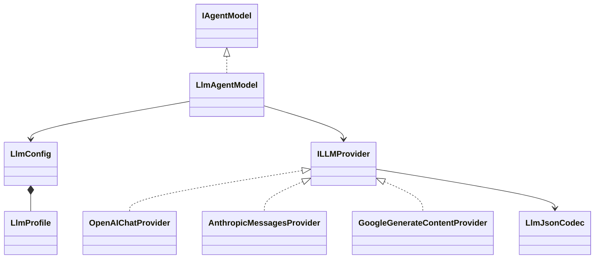

# spakky-llm

> `spakky-llm`은 `spakky-agent`의 `IAgentModel` port를 OpenAI-compatible, Anthropic, Google LLM API에 연결하는 outbound adapter plugin입니다.
> 연결 정보는 operator가 등록한 profile에서만 가져오고, provider 공식 SDK의 async client를 provider-neutral model contract로 정규화합니다.

## 설치

```bash
pip install spakky-llm
```

Agent 전체 조합은 root extra로 설치할 수 있습니다.

```bash
pip install "spakky[agent]"
```

`spakky-llm`은 model adapter만 제공합니다. Durable Agent 실행에는 `spakky-sqlalchemy[agent]` 같은 persistence contribution도 필요합니다.

## 구성요소



| 구성요소 | 책임 |
|----------|------|
| `LlmAgentModel` | `ModelSelection`을 allowlisted profile로 해석하고 단일 `IAgentModel` binding을 제공 |
| `LlmConfig`, `LlmProfile` | provider 연결 정보, model 기본값, capability와 dialect 옵션을 보관 |
| `OpenAIChatProvider` | 공식 `openai` SDK로 OpenAI Chat Completions와 vLLM dialect를 처리 |
| `AnthropicMessagesProvider` | 공식 `anthropic` SDK로 Messages API를 처리 |
| `GoogleGenerateContentProvider` | 공식 `google-genai` SDK로 Gemini GenerateContent API를 처리 |
| `LlmJsonCodec` | structured output과 tool argument를 portable JSON Schema subset으로 검증 |

Plugin entry point는 위 세 SDK adapter와 router를 등록하고 `IAgentModel`을 `LlmAgentModel`에 binding합니다. Root package `spakky.plugins.llm`은 plugin identity인 `PLUGIN_NAME`만 export합니다. 구현 타입이 필요하면 `spakky.plugins.llm.config`, `spakky.plugins.llm.model`, `spakky.plugins.llm.provider`와 `spakky.plugins.llm.providers.openai` / `anthropic` / `google`의 명시적 모듈 경로를 사용합니다.

## Provider API와 dialect

Profile의 `api`는 실제 SDK surface를 선택합니다.

| `api` 값 | SDK adapter | 적용 대상 |
|----------|-------------|-----------|
| `openai-chat-completions` | `OpenAIChatProvider` | OpenAI 또는 OpenAI-compatible endpoint |
| `anthropic-messages` | `AnthropicMessagesProvider` | Anthropic Messages API |
| `google-generate-content` | `GoogleGenerateContentProvider` | Google Gemini GenerateContent API |

OpenAI-compatible endpoint라고 해서 모든 확장 필드가 같다고 가정하지 않습니다. `openai_dialect=standard`는 표준 Chat Completions payload만 사용하고, `openai_dialect=vllm`일 때만 `chat_template_kwargs`와 vLLM structured-output extension을 `extra_body`로 전달합니다. 따라서 vLLM은 별도 package가 아니라 OpenAI-compatible profile의 명시적 dialect입니다.

각 adapter는 complete/stream, usage, structured output, tool-call candidate와 가능한 reasoning delta를 Spakky의 `ModelResponse`/`ModelStreamEvent`로 변환합니다. Tool candidate의 승인과 dispatch는 provider SDK가 아니라 Spakky `AgentRunner`가 소유하며, Google SDK의 automatic function calling은 tool을 선언한 요청에서 비활성화됩니다. 현재 표준 runner는 result/evidence를 방출한 뒤 같은 provider stream을 terminal로 닫고, tool result를 새 `ModelRequest`에 재주입하거나 같은 `run()`/`run_events()` invocation에서 model을 재호출하지 않습니다.

### Tool authority와 terminal validation

Provider가 tool call을 반환했다는 사실만으로 실행 권한이 생기지 않습니다. Request에 `ToolCallingSpec.tools` catalog가 선언되어 있어야 하며, provider가 반환한 모든 tool name과 arguments가 그 catalog의 schema를 통과해야 합니다. Catalog가 없거나 비어 있거나, catalog에 없는 tool이면 거부합니다. `ModelToolChoice.NONE`은 call 1개 이상을, `ModelToolChoice.REQUIRED`는 call 0개를 각각 `LlmResponseError`로 처리합니다.

OpenAI는 tool call 유무와 terminal `finish_reason=tool_calls`가 서로 일치해야 하고, Anthropic은 같은 규칙을 `stop_reason=tool_use`에 적용합니다. 세 provider의 성공 stream은 모두 terminal reason이 반드시 있어야 하며, EOF까지 reason이 없으면 partial output을 `DONE`으로 게시하지 않습니다.

`TOOL_CALL_CANDIDATE`는 `AgentRunner`가 approval/dispatch를 시작할 수 있는 side-effect authority gate입니다. 모든 provider는 terminal/refusal 상태, 전체 tool batch, tool choice와 provider terminal consistency, structured output을 먼저 검증한 뒤 candidate를 게시합니다. Batch 중 하나라도 invalid하면 앞선 valid call도 candidate가 되지 않습니다. OpenAI는 candidate 이전의 informational `TOOL_CALL_START`/`TOOL_CALL_ARGS_DELTA`는 stream할 수 있지만 `TOOL_CALL_END`와 candidate는 검증 완료까지 보류합니다. Anthropic은 `START`/`ARGS_DELTA`/`END`/candidate 전체를, Google은 candidate를 terminal 검증 전까지 buffer합니다.

SDK의 terminal literal 타입을 success allowlist로 간주하지 않습니다. 현재 설치된 OpenAI·Anthropic SDK는 future/unknown terminal reason도 typed response object로 loose-construct할 수 있으므로 adapter가 다음 allowlist를 명시적으로 적용합니다. 새 reason은 자동으로 성공 처리하지 않고 의미를 검토한 뒤 allowlist를 변경해야 합니다.

| Provider | Success | Refusal | `LlmResponseError` |
|----------|---------|---------|--------------------|
| OpenAI | `stop`, `length`, `tool_calls` | `content_filter`; non-empty message/delta refusal | `null`, legacy `function_call`, unknown reason |
| Anthropic | `end_turn`, `max_tokens`, `stop_sequence`, `tool_use`, `model_context_window_exceeded` | `refusal` 또는 non-null `stop_details` | `null`, `pause_turn`, unknown reason |
| Google | `STOP`, `MAX_TOKENS` | `SAFETY`, `RECITATION`, `LANGUAGE`, `BLOCKLIST`, `PROHIBITED_CONTENT`, `SPII`, `IMAGE_SAFETY`, `IMAGE_PROHIBITED_CONTENT`, `NO_IMAGE`, `IMAGE_RECITATION` | 위 목록 밖의 unknown/other reason |

Token/context limit 계열 success terminal도 structured output을 요청했다면 누적 JSON 검증을 그대로 통과해야 합니다.

Google thought part는 profile의 `INCLUDE_THOUGHTS=true`로 opt-in한 경우에만 SDK에 요청하고 `REASONING_DELTA`로 게시합니다. Provider가 unsolicited thought part를 보내도 opt-in하지 않은 profile에서는 노출하지 않습니다. OpenAI stream의 `include_usage=false`는 SDK `stream_options`에서 usage 요청을 생략하고 endpoint가 unsolicited usage chunk를 보내도 `DONE.usage`에 반영하지 않습니다.

### 응답 검증과 client lifecycle

`LlmJsonCodec`은 provider가 반환한 structured output과 tool argument를 선언된 portable JSON Schema subset으로 검증합니다. Value를 검사하기 전에 schema shape 전체를 재귀 검증하므로 선택되지 않은 `anyOf` branch나 실제 value에 사용되지 않은 `properties`, `additionalProperties`, `prefixItems`, `items` branch 안의 unsupported validation keyword도 거부합니다. 알 수 없는 schema `type`을 허용하지 않고, `anyOf`가 일치해도 같은 schema object에서 codec이 지원하는 sibling constraint를 계속 적용합니다. Array tuple schema에서는 `prefixItems` 이후 tail을 `items`로 검증하며 `items: false`이면 선언되지 않은 tail을 거부합니다.

JSON text와 SDK object에 포함된 `NaN`, `Infinity`, `-Infinity` 같은 non-finite number는 통과시키지 않습니다. Enum equality는 boolean과 number를 구분하고 nested object/array에도 같은 type-aware 비교를 재귀 적용하며, JSON number인 `1`과 `1.0`은 같은 값으로 취급합니다. Structured stream은 provider finish reason이 truncation을 나타내더라도 terminal에 누적 JSON을 decode·validate하므로 partial document를 structured output으로 게시하지 않습니다. Malformed schema와 불일치 응답은 모두 `LlmResponseError`로 fail closed합니다.

HTTP 200도 SDK decode와 typed payload validation을 통과해야 성공입니다. OpenAI, Anthropic, Google adapter는 malformed success JSON, SDK response validation failure, mapping 중 shape/type 불일치를 모두 `LlmResponseError`로 정규화합니다.

OpenAI와 Anthropic async client는 request/stream context가 끝날 때 닫습니다. Google adapter는 `HttpOptions.async_client_args`에 framework가 만든 `httpx.AsyncHTTPTransport`를 주입해 공식 SDK의 async backend를 httpx로 고정하고 aiohttp fallback을 허용하지 않습니다. Request와 stream은 여전히 Google SDK가 수행하고 SDK가 async client와 주입된 transport를 닫습니다. Adapter는 `client.aio` async context가 끝난 뒤, 성공·실패와 관계없이 root sync `Client`도 `finally`에서 닫습니다.

Google complete/stream transport 경계는 같은 error taxonomy를 사용합니다.

| httpx 예외 | Spakky error |
|------------|--------------|
| `InvalidURL`, `UnsupportedProtocol` | `LlmConfigurationError` |
| `TimeoutException` | `LlmTimeoutError` |
| `TransportError` | `LlmTransportError` |

## 설정

`LlmConfig`는 `SPAKKY_LLM__` prefix와 `__` nested delimiter를 사용합니다. 설정하지 않으면 다음 local vLLM profile이 기본입니다.

| 항목 | 기본값 | 의미 |
|------|--------|------|
| `default_profile` | `default` | 요청에 selection이 없을 때 사용할 profile |
| `profiles.default.provider` | `vllm` | 응답 metadata와 selection에 사용하는 provider id |
| `profiles.default.api` | `openai-chat-completions` | 공식 OpenAI SDK adapter 선택 |
| `profiles.default.model` | `default` | endpoint에 보낼 model id |
| `profiles.default.base_url` | `http://127.0.0.1:8000/v1` | local vLLM OpenAI-compatible base URL |
| `profiles.default.api_key` | `EMPTY` | OpenAI SDK client 구성을 위한 local sentinel |
| `profiles.default.openai_dialect` | `vllm` | vLLM 전용 extension 허용 |

예를 들어 Anthropic profile만 사용하는 deployment는 다음처럼 설정합니다.

```bash
export SPAKKY_LLM__DEFAULT_PROFILE=claude
export SPAKKY_LLM__PROFILES__CLAUDE__PROVIDER=anthropic
export SPAKKY_LLM__PROFILES__CLAUDE__API=anthropic-messages
export SPAKKY_LLM__PROFILES__CLAUDE__MODEL=your-model-id
export SPAKKY_LLM__PROFILES__CLAUDE__API_KEY=your-api-key
```

Google profile은 API family와 model만 바꾸어 같은 방식으로 등록합니다.

```bash
export SPAKKY_LLM__DEFAULT_PROFILE=gemini
export SPAKKY_LLM__PROFILES__GEMINI__PROVIDER=google
export SPAKKY_LLM__PROFILES__GEMINI__API=google-generate-content
export SPAKKY_LLM__PROFILES__GEMINI__MODEL=your-model-id
export SPAKKY_LLM__PROFILES__GEMINI__API_KEY=your-api-key
```

### 공통 profile 필드

환경변수는 `SPAKKY_LLM__PROFILES__<NAME>__<FIELD>` 형태로 지정합니다.

| `<FIELD>` | 기본값 | 의미 |
|-----------|--------|------|
| `PROVIDER`, `API`, `MODEL` | 필수 | 논리 provider id, SDK API family, 기본 model id |
| `BASE_URL`, `API_KEY`, `HEADERS__<NAME>` | 미설정 | operator가 허용한 연결 URL, secret, 추가 header; API key는 local vLLM 외 SDK 호출에 필요 |
| `REQUEST_TIMEOUT_SECONDS` | `30.0` | non-streaming request timeout |
| `STREAM_TIMEOUT_SECONDS` | `300.0` | streaming request timeout |
| `MAX_RETRIES` | `0` | provider SDK retry 횟수 |
| `STREAM_ENABLED` | `true` | 해당 profile의 streaming 허용 여부 |
| `CONTEXT_WINDOW_TOKENS` | 미설정 | `ModelCapability`에 광고할 context window |
| `SUPPORTS_REASONING` | `false` | reasoning capability 광고 여부 |
| `SUPPORTS_TOKEN_COUNTING` | `false` | token counting capability 광고 여부 |

### Provider별 profile 필드

| `<FIELD>` | 적용 API | 의미 |
|-----------|----------|------|
| `OPENAI_DIALECT` | OpenAI Chat Completions | `standard` 또는 `vllm` |
| `CHAT_TEMPLATE_KWARGS__<NAME>` | vLLM dialect | vLLM chat template option |
| `ANTHROPIC_MAX_TOKENS` | Anthropic Messages | request에 max token이 없을 때의 상한; 기본 `4096` |
| `INCLUDE_THOUGHTS` | Google GenerateContent | reasoning capability와 함께 Google thought part 요청 |

Profile 모델은 알 수 없는 필드를 거부합니다. `API_KEY`는 `SecretStr`로 보관되며 provider client를 만드는 경계에서만 평문으로 읽습니다.

### Fail-closed 연결 경계

`LlmConfig`는 알 수 없는 `SPAKKY_LLM__...` 설정을 묵인하지 않습니다. `SPAKKY_LLM__PROFILSE__...` 같은 최상위 key 오타와 `SPAKKY_LLM__PROFILES__PROD__BASE_ULR` 같은 nested profile field 오타는 모두 설정 생성 단계에서 실패합니다.

Standard provider profile에서 `BASE_URL`을 생략하면 SDK의 ambient base URL을 추론하지 않고 다음 공식 endpoint를 명시적으로 전달합니다. vLLM dialect는 명시적인 `BASE_URL` 없이 생성할 수 없습니다.

| API | `BASE_URL` 미설정 시 고정 endpoint |
|-----|-----------------------------------|
| OpenAI Chat Completions standard | `https://api.openai.com/v1` |
| Anthropic Messages | `https://api.anthropic.com` |
| Google GenerateContent | `https://generativelanguage.googleapis.com/`; `vertexai=False` |

Credential과 header도 profile만 정본으로 사용합니다. OpenAI client의 organization, project, admin key, webhook secret은 explicit empty value로 구성하여 SDK ambient inference를 차단합니다. `OPENAI_CUSTOM_HEADERS` 또는 `ANTHROPIC_CUSTOM_HEADERS`가 환경에 존재하면 provider client 생성은 `LlmConfigurationError`로 실패합니다. 추가 header는 반드시 profile의 `HEADERS__<NAME>`으로 등록합니다.

## 요청별 선택

외부 request는 operator가 등록한 profile을 선택할 수 있을 뿐, 새 연결을 만들 수 없습니다.

- `profile`을 지정하면 같은 이름의 profile이 반드시 존재해야 합니다.
- `provider`만 지정하면 그 provider와 일치하는 profile이 정확히 하나여야 합니다.
- `model`은 선택된 profile의 연결을 유지한 채 model id만 덮어씁니다.
- `ModelSelection.metadata`의 `base_url`, API key, header 같은 값은 연결 설정으로 사용하지 않습니다.

```python
from spakky.agent import ModelSelection, RunAgentInput

run_input = RunAgentInput(
    state_id="run-1",
    instruction="summarize this request",
    model_selection=ModelSelection(
        provider="anthropic",
        profile="claude",
        model="your-model-id",
    ),
)
```

## Plugin loading

```python
import spakky.agent
import spakky.plugins.llm
from spakky.agent import IAgentModel
from spakky.core.application.application import SpakkyApplication
from spakky.core.application.application_context import ApplicationContext

app = (
    SpakkyApplication(ApplicationContext())
    .load_plugins(
        include={
            spakky.agent.PLUGIN_NAME,
            spakky.plugins.llm.PLUGIN_NAME,
        }
    )
    .start()
)
model = app.container.get(type_=IAgentModel)
```

## 의존성 경계

이 plugin은 `spakky`와 `spakky-agent` core contract, 그리고 provider 공식 SDK(`openai`, `anthropic`, `google-genai`)에 의존합니다. `httpx`는 Google SDK의 async transport를 명시적으로 주입하고 그 transport 예외를 Spakky error로 정규화하는 데 사용합니다. HTTP request나 SSE parsing은 직접 구현하지 않으며 provider SDK가 transport lifecycle을 소유합니다. 다른 Spakky plugin을 import하지 않습니다.

## 개발 검증

패키지 디렉토리에서 실행합니다.

```bash
uv run ruff format .
uv run ruff check .
uv run pyrefly check src tests --min-severity warn --no-progress-bar --output-format min-text
uv run pytest
```

## 라이선스

MIT License
