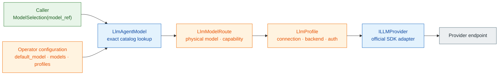
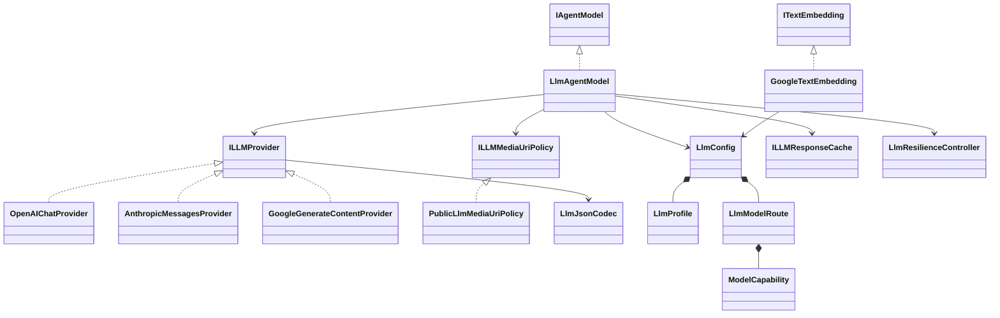

# spakky-llm

> `spakky-llm`은 `spakky-agent`의 multimodal `IAgentModel` port를 OpenAI-compatible, Anthropic, Gemini Developer API, Vertex AI에 연결하고 explicit Google route에서 optional `ITextEmbedding` adapter를 제공하는 outbound plugin입니다.
> Caller는 logical `model_ref`만 선택하고, operator가 model catalog, connection profile, media URI authority와 명시적 fallback/cache/resilience policy를 소유합니다.

## 설치

```bash
pip install spakky-llm
```

Agent 전체 조합은 root extra로 설치할 수 있습니다.

```bash
pip install "spakky[agent]"
```

`spakky-llm`은 model adapter와 explicit opt-in Google text-embedding adapter만 제공합니다. Retrieval/vector backend이나 durable persistence를 제공하지 않으므로, durable Agent 실행에는 `spakky-sqlalchemy[agent]` 같은 persistence contribution이 별도로 필요합니다.

## DX 경계

Application과 배포 설정의 책임을 다음처럼 분리합니다.



Caller가 알아야 하는 값은 `support/primary` 같은 logical `model_ref` 하나입니다. Profile 이름, physical model id, endpoint, credential과 header는 operator 설정에만 남습니다. 따라서 operator는 logical ref를 유지한 채 backend나 provider model을 교체할 수 있습니다.

Catalog membership은 connection/routing allowlist이지 caller authorization이 아닙니다. Caller·tenant별로 어떤 `model_ref`를 쓸 수 있는지는 상위 application/auth policy가 결정해야 하며, profile 이름에 `-prod`를 붙이는 것으로 접근 제어나 환경 격리가 생기지 않습니다.

`model_ref`는 앞뒤 공백만 routing 경계에서 제거하는 case-sensitive opaque key입니다. `/`를 provider/model separator로 분해하지 않습니다. `support/primary`, `moonshotai/kimi-k2`, `Qwen/Qwen3-8B`는 각각 logical ref와 provider model id의 독립된 문자열입니다. Catalog 밖 physical model id를 `model_ref`로 보내도 raw-model fallback 없이 `LlmModelSelectionError`로 실패합니다.

## 구성요소



| 구성요소 | 책임 |
|----------|------|
| `LlmAgentModel` | request snapshot을 exact catalog route에 결속하고 media policy → cache → profile resilience → provider → explicit fallback을 조정 |
| `LlmConfig` | `default_model`, operator-owned `models`, `profiles`의 참조 정합성 검증 |
| `LlmProfile` | provider API, endpoint, auth, header, SDK retry, streaming, dialect와 retry/concurrency/rate/circuit policy |
| `LlmModelRoute` | profile 참조, physical model id, capability, vLLM option, ordered fallback allowlist와 cache policy |
| `ILLMMediaUriPolicy` | provider/cache 전에 remote media URI를 비동기로 검증하는 교체 가능한 authority; 기본은 `PublicLlmMediaUriPolicy` |
| `ILLMResponseCache`, `ILLMCacheScopeResolver` | exact/semantic complete-response cache backend와 trusted tenant/safety partition port; production default 없음 |
| `ILLMBatchProvider`, `ILLMFileProvider`, `ILLMNativeToolProvider` | interactive inference와 분리된 optional batch/file/native web·file-search port; 자동 주입·실행 없음 |
| `OpenAIChatProvider` | 공식 `openai` SDK로 standard OpenAI-compatible API와 vLLM dialect 처리 |
| `AnthropicMessagesProvider` | 공식 `anthropic` SDK로 native Messages API 처리 |
| `GoogleGenerateContentProvider` | 공식 `google-genai` SDK로 Gemini Developer API와 Vertex AI 처리 |
| `GoogleTextEmbedding` | explicit `LlmConfig` Google route를 snapshot해 async text embedding batch를 `EmbeddingVector`로 정규화 |
| `LlmJsonCodec` | structured output과 tool argument를 portable JSON Schema subset으로 검증 |

Plugin entry point는 세 first-party SDK adapter와 router를 등록하고 `IAgentModel`을 `LlmAgentModel`에 binding합니다. `GoogleTextEmbedding`, cache backend/scope resolver, optional platform port와 custom media policy는 application authority가 필요한 explicit opt-in이므로 자동 등록하지 않습니다. Root package `spakky.plugins.llm`은 plugin identity인 `PLUGIN_NAME`만 export합니다. 구현 타입이 필요하면 `spakky.plugins.llm.config`, `spakky.plugins.llm.model`, `spakky.plugins.llm.provider`, `spakky.plugins.llm.cache`, `spakky.plugins.llm.media`, `spakky.plugins.llm.resilience`, `spakky.plugins.llm.providers.openai`, `spakky.plugins.llm.providers.anthropic`, `spakky.plugins.llm.providers.google`의 명시적 모듈 경로를 사용합니다.

## Operator model catalog

Profile은 connection/backend/auth만, route는 model/capability만 소유합니다. Profile 이름은 `google-vertex`, `openrouter`, `anthropic`, `vllm-local`처럼 역할을 설명하는 중립 key를 사용합니다. 환경을 profile 이름에 박은 `*-prod` 관례는 필요하지 않습니다. 같은 key에 들어가는 endpoint와 credential을 배포별 external configuration으로 바꿉니다.

```python
from pydantic import SecretStr
from spakky.agent import ModelCapability
from spakky.plugins.llm.config import (
    GoogleCredentialStrategy,
    LlmConfig,
    LlmModelRoute,
    LlmProfile,
    LlmProviderApi,
    OpenAICompatibleDialect,
)

config = LlmConfig(
    default_model="support/primary",
    profiles={
        "google-vertex": LlmProfile(
            provider="google",
            api=LlmProviderApi.GOOGLE_VERTEX,
            google_credential_strategy=GoogleCredentialStrategy.ADC,
            google_project="project-id",
            google_location="us-central1",
        ),
        "openrouter": LlmProfile(
            provider="openrouter",
            api=LlmProviderApi.OPENAI_CHAT_COMPLETIONS,
            base_url="https://openrouter.ai/api/v1",
            api_key=SecretStr("operator-managed-secret"),
        ),
        "anthropic": LlmProfile(
            provider="anthropic",
            api=LlmProviderApi.ANTHROPIC_MESSAGES,
            api_key=SecretStr("operator-managed-secret"),
        ),
        "vllm-local": LlmProfile(
            provider="vllm",
            api=LlmProviderApi.OPENAI_CHAT_COMPLETIONS,
            base_url="http://127.0.0.1:8000/v1",
            openai_dialect=OpenAICompatibleDialect.VLLM,
        ),
    },
    models={
        "support/primary": LlmModelRoute(
            profile="google-vertex",
            model="publishers/google/models/gemini-2.5-pro",
            capability=ModelCapability(
                context_window_tokens=1_000_000,
                supports_tools=True,
                supports_structured_output=True,
            ),
        ),
        "coding/primary": LlmModelRoute(
            profile="openrouter",
            model="moonshotai/kimi-k2",
        ),
        "analysis/primary": LlmModelRoute(
            profile="anthropic",
            model="claude-opus-4-1",
            capability=ModelCapability(supports_reasoning=True),
        ),
        "local/primary": LlmModelRoute(
            profile="vllm-local",
            model="Qwen/Qwen3-8B",
            chat_template_kwargs={"enable_thinking": False},
        ),
    },
)
```

### 기본 구성

`LlmConfig()`를 별도 설정 없이 만들면 명시적 local vLLM route를 제공합니다.

| 항목 | 기본값 | 의미 |
|------|--------|------|
| `default_model` | `assistant/default` | selection이 없을 때 사용할 logical ref |
| `models["assistant/default"].profile` | `vllm-local` | default route의 connection profile |
| `models["assistant/default"].model` | `default` | endpoint에 전달할 physical model id |
| `models["assistant/default"].capability` | text-in/out, tools·structured output true | default route가 광고하는 queryable capability |
| `profiles["vllm-local"].provider` | `vllm` | routing evidence의 provider id |
| `profiles["vllm-local"].api` | `openai-chat-completions` | 공식 OpenAI SDK adapter 선택 |
| `profiles["vllm-local"].base_url` | `http://127.0.0.1:8000/v1` | local vLLM endpoint |
| `profiles["vllm-local"].api_key` | `EMPTY` | local SDK 구성용 sentinel |
| `profiles["vllm-local"].openai_dialect` | `vllm` | vLLM extension만 허용 |

이 기본값은 상용 provider credential을 추론하거나 network fallback을 등록하지 않습니다. Endpoint가 실행 중이지 않으면 local 호출은 정상적으로 연결 실패합니다.

### Environment configuration

`LlmConfig`는 `SPAKKY_LLM__` prefix와 `__` nested delimiter를 사용합니다. Opaque key에 slash가 들어갈 수 있으므로 전체 catalog를 JSON object로 주입하는 방식이 명확합니다.

```bash
export SPAKKY_LLM__DEFAULT_MODEL='support/primary'
export SPAKKY_LLM__PROFILES='{"anthropic":{"provider":"anthropic","api":"anthropic-messages","api_key":"operator-managed-secret"}}'
export SPAKKY_LLM__MODELS='{"support/primary":{"profile":"anthropic","model":"claude-opus-4-1","capability":{"supports_reasoning":true,"supports_tools":true,"supports_structured_output":true}}}'
```

`LlmConfig`와 nested model은 unknown field를 거부합니다. `SPAKKY_LLM__DEFAULT_PROFILE` 같은 제거된 top-level selector, `PROFILSE` 같은 오타, profile의 이전 `MODEL`/capability field, route의 credential field는 compatibility alias나 silent fallback 없이 실패합니다.

Environment와 dotenv의 `PROFILES`/`MODELS` JSON은 `object_pairs_hook` 기반 strict decoder를 사용해 catalog key뿐 아니라 nested profile/route/capability field의 duplicate key도 거부합니다. 표준 JSON parser의 last-key-wins 의미로 보안·routing 설정이 덮이지 않습니다.

Direct constructor 인자는 같은 field의 environment/dotenv 값보다 우선할 뿐 아니라, 그 ambient field를 JSON decoding 전에 mask합니다. 예를 들어 `LlmConfig(profiles=...)`는 malformed `SPAKKY_LLM__PROFILES` 때문에 실패하지 않지만 명시하지 않은 `MODELS`/`DEFAULT_MODEL` env는 계속 parsing·validation합니다. `default_model`, `profiles`, `models`를 모두 직접 넘기면 ambient `SPAKKY_LLM__...` source는 effective config에 참여하지 않으므로 같은 field의 malformed 값과 unrelated prefixed key도 읽지 않습니다.

### `LlmProfile` 필드

| Field | 기본값 | 책임 |
|-------|--------|------|
| `provider` | 필수 | routing evidence용 provider id |
| `api` | 필수 | provider adapter API family |
| `base_url`, `api_key`, `headers` | `None`, `None`, `{}` | operator-owned endpoint, secret, 추가 header |
| `request_timeout_seconds` | `30.0` | complete request timeout |
| `stream_timeout_seconds` | `300.0` | stream request timeout |
| `max_retries` | `0` | provider SDK retry 횟수 |
| `stream_enabled` | `true` | profile의 streaming 허용 여부 |
| `resilience` | disabled `LlmResiliencePolicy()` | profile-scoped orchestration retry, concurrency, rate와 circuit policy |
| `openai_dialect` | `standard` | `standard` 또는 `vllm` |
| `google_credential_strategy` | `None` | `api-key`, `adc`, `service-account-file` 중 explicit Google auth source |
| `google_project`, `google_location` | `None` | Vertex AI project/location |
| `google_service_account_file` | `None` | mounted service-account file path |

`API_KEY`는 `SecretStr`로 보관되며 provider client 생성 경계에서만 평문으로 읽습니다. Model id, capability, Google thought opt-in, Anthropic default token 같은 model 동작은 profile field가 아닙니다.

### `LlmModelRoute`와 capability

| Field | 기본값 | 책임 |
|-------|--------|------|
| `profile` | 필수 | `LlmConfig.profiles`의 exact key |
| `model` | 필수 | SDK에 전달할 physical model id |
| `capability` | `ModelCapability()` | route의 queryable model 능력 |
| `chat_template_kwargs` | `{}` | vLLM dialect에서만 허용되는 model별 option |
| `fallbacks` | `()` | 현재 route failure에서만 고려할 ordered logical model refs |
| `fallback_on` | empty set | fallback edge를 열 explicit `LlmFailureClass` allowlist |
| `cache` | disabled `LlmCachePolicy()` | route별 exact/semantic complete-response cache policy |

`ModelCapability`은 `supports_reasoning`, `context_window_tokens`, `supports_token_counting`, `input_modalities`, `output_modalities`, `supports_tools`, `supports_structured_output`을 선언합니다. Base capability의 input/output modality는 text이며 비어 있을 수 없고, context window는 지정한다면 양수여야 합니다. `spakky-llm` default route만 tools와 structured output을 true로 덮어씁니다. Router의 `capability`는 default route를, `capability_for(selection)`은 exact selected route를 반환합니다.

Capability는 provider 이름에서 추측하지 않습니다. Operator가 실제 deployment 지원과 맞게 선언하고 acceptance test로 확인해야 합니다. Google은 selected route의 `supports_reasoning`이 true일 때 `ThinkingConfig(include_thoughts=True)`를 요청합니다. OpenAI-compatible·Anthropic adapter는 provider가 반환한 reasoning/thinking extension의 노출만 같은 capability로 gate하며 generic thought request를 추가하지 않습니다. `AgentExecutionSpec.output_type`을 선언한 run은 runner가 selected route의 `supports_structured_output`을 provider request 전에 검사하고, `ModelRequest`가 실제 포함한 `TEXT`/`IMAGE`/`AUDIO`/`VIDEO`/`DOCUMENT` input modality도 reachable route capability와 provider I/O 전에 대조합니다. Provider별 MIME/source 제한은 이 generic capability보다 좁을 수 있으므로 adapter가 별도로 fail closed합니다.

## Multimodal request와 URI authority

Core `ModelMessage.content`는 기존 plain `str` 또는 ordered `TextPart`/`ImagePart`/`AudioPart`/`VideoPart`/`DocumentPart` sequence입니다. `RunAgentInput.attachments`는 instruction을 첫 `TextPart`로 유지하면서 media를 순서대로 붙입니다. `LlmAgentModel.complete()`와 `stream()`은 진입 즉시 `ModelRequest.snapshot()`을 만들어 capability, media policy, cache key/semantic input, provider와 cache store가 같은 immutable request를 관찰하게 합니다. Request 전체에서 media는 기본 16개, inline bytes 합계 20 MiB이고 part별 custom limit가 있으면 가장 작은 limit를 적용합니다.

```python
from spakky.agent import ModelCapability, ModelModality
from spakky.plugins.llm.config import LlmModelRoute

vision_route = LlmModelRoute(
    profile="google-vertex",
    model="publishers/google/models/gemini-2.5-pro",
    capability=ModelCapability(
        input_modalities=frozenset({ModelModality.TEXT, ModelModality.IMAGE}),
    ),
)
```

URI part 생성은 syntax/scheme/explicit host/literal-address만 검증하는 side-effect-free 작업입니다. Default `PublicLlmMediaUriPolicy(timeout_seconds=2.0)`는 각 candidate의 provider/cache 전에 ordinary HTTP(S) hostname을 `asyncio.to_thread()`에서 resolve하고 timeout과 public-address 조건을 집행합니다. 다음 authority는 DNS를 생략합니다.

- `MediaSafetyLimits.allowed_uri_hosts`에 exact 등록된 host: application이 private gateway를 명시적으로 소유합니다.
- `.test` hostname: deterministic local/CI SDK fake mapping을 허용합니다.
- custom allowed scheme: DNS 의미가 framework에 없으므로 application/provider authority에 남깁니다.
- IP literal: core value validation에서 이미 public 또는 explicit host-authorized 조건을 통과했습니다.

이 default가 맞지 않으면 `ILLMMediaUriPolicy.validate(target, request)` 구현을 `LlmAgentModel`에 주입합니다. DNS failure·timeout·private resolution은 `LlmConfigurationError`로 정규화되고, route가 `CONFIGURATION` failure fallback을 명시한 경우에만 다음 candidate를 검토합니다. URI를 framework가 fetch하거나 cache에 body로 materialize하지 않습니다.

Provider mapping은 user content에만 media를 허용하고 system/evidence/assistant/tool history의 media를 text로 손실 변환하지 않습니다. OpenAI-compatible adapter는 supported image URI/inline, inline MP3/WAV audio와 filename이 있는 inline PDF/text document를 매핑하며 video를 거부합니다. Anthropic은 supported image URI/inline, PDF URI/inline과 inline UTF-8 plain-text document를 매핑하고 audio/video를 거부합니다. Google은 operator-declared modality의 URI/bytes를 SDK `Part.from_uri()`/`from_bytes()`로 보냅니다. 세 adapter 모두 capability·MIME/source mismatch를 SDK 호출 전에 실패시키며 common generated-media output contract는 제공하지 않습니다.

## Caller model selection

Application caller는 operator가 공개한 logical ref만 전달합니다.

```python
from spakky.agent import ModelSelection, RunAgentInput

run_input = RunAgentInput(
    state_id="run-1",
    instruction="summarize this request",
    model_selection=ModelSelection(model_ref="support/primary"),
)
```

Selection을 생략하면 `LlmConfig.default_model`을 사용합니다. `RunAgentInput.model_selection`은 `ModelRequest.model_selection`으로 전달됩니다. `ModelSelection`에는 provider, profile, raw model, credential, endpoint 또는 metadata field가 없습니다.

AG-UI caller는 `forwardedProps.modelSelection.modelRef`, A2A caller는 data part의 canonical `modelSelection.modelRef`를 사용합니다. A2A는 모든 data part를 scan해 legacy outer `model_selection`을 발견하거나 canonical selector가 둘 이상이면 fail closed합니다. 두 adapter 모두 legacy provider/profile/model field와 unknown sibling key를 core request로 전달하지 않고 거부합니다.

## Provider API와 backend mode

Profile의 `api`가 실제 SDK surface를 선택합니다.

`LlmProfile.provider`는 operator label과 routing evidence이며 adapter registry key가 아닙니다. 실제 구현은 `profile.api`에 해당하는 `ILLMProvider.apis`로 선택됩니다. 따라서 `provider="openrouter"`와 `provider="vllm"`이 같은 `OpenAIChatProvider`를 사용하면서 endpoint와 dialect만 명시적으로 달리할 수 있습니다.

| `api` 값 | SDK adapter | 적용 대상 |
|----------|-------------|-----------|
| `openai-chat-completions` | `OpenAIChatProvider` | OpenAI, OpenRouter, vLLM 등 OpenAI-compatible endpoint |
| `anthropic-messages` | `AnthropicMessagesProvider` | Anthropic Messages API |
| `google-gemini-developer` | `GoogleGenerateContentProvider` | Gemini Developer API + API key |
| `google-vertex` | `GoogleGenerateContentProvider` | Vertex AI + project/location + Google credential |

**Gemini Developer API는 Google의 제품명이지 dev 환경 이름이 아닙니다.** 상용 서비스에서도 operator가 선택할 수 있는 backend입니다. Repository의 로컬·CI unit/acceptance test는 injected SDK client와 credential test double로 mapping contract를 검증하므로 commercial credential이나 실제 cloud project 접근이 필요하지 않지만, live service/IAM 접근 가능성을 검증하는 테스트는 아닙니다.

### Google auth matrix

| API | SDK mode | 필수 설정 | 금지 설정 |
|-----|----------|-----------|-----------|
| Gemini Developer API | `enterprise=False` | `api-key` strategy + `api_key` | project, location, service-account file |
| Vertex AI + ADC | `enterprise=True` | project, location, `adc` strategy | API key, service-account file |
| Vertex AI + service account | `enterprise=True` | project, location, `service-account-file` strategy + file | API key, 누락된 file |

ADC (Application Default Credentials)를 선택하면 cloud-platform scope로 `google.auth.default()`를 호출합니다. Service-account strategy는 operator가 지정한 mounted file을 같은 scope로 읽습니다. ADC chain 사용 자체는 explicit strategy이므로 backend나 credential source를 request metadata에서 추론하지 않습니다. Developer API와 Vertex AI field를 섞거나 project/location을 누락하면 config 생성이 실패합니다.

ADC가 개발자 workstation credential을 발견할 수는 있지만 그 사실이 Vertex project 접근 권한을 만들지는 않습니다. 실제 접근 가능 범위는 선택된 identity에 부여된 Google IAM 권한이 결정하며 framework는 `-prod` 같은 profile 이름으로 권한을 부여하거나 우회하지 않습니다. ADC가 반환한 ambient project 값도 routing에 사용하지 않고 profile에 명시한 project/location을 SDK에 전달합니다.

Gemini Developer API는 `base_url`이 없으면 `https://generativelanguage.googleapis.com/`를 명시적으로 사용합니다. Vertex AI는 profile의 `base_url`이 있으면 그 값을 그대로 우선합니다. 없으면 `google_location="global"`은 `https://aiplatform.googleapis.com/`, multi-region `us`와 `eu`는 각각 `https://aiplatform.us.rep.googleapis.com/`와 `https://aiplatform.eu.rep.googleapis.com/`, 그 밖의 lowercase endpoint-safe region은 `https://{location}-aiplatform.googleapis.com/`로 변환해 `HttpOptions.base_url`에 명시합니다. 따라서 SDK ambient `GOOGLE_VERTEX_BASE_URL`은 Vertex endpoint를 바꾸지 못합니다. Project/location/credential과 `enterprise=True`도 SDK에 explicit 전달하며 caller metadata는 이 값을 바꿀 수 없습니다.

### Google text embedding — explicit opt-in

`GoogleTextEmbedding`은 `spakky.plugins.llm.providers.google`에 있는 `ITextEmbedding` 구현입니다. Operator가 먼저 existing `LlmConfig.profiles`/`models`에 Google embedding route를 명시하고 application이 logical ref를 직접 resolve해 생성합니다.

```python
from spakky.agent import VectorRetriever
from spakky.plugins.llm.providers.google import GoogleTextEmbedding

embedding = GoogleTextEmbedding.from_config(
    config,
    "embedding/default",
    output_dimensionality=768,
)
retriever = VectorRetriever(embedding, vector_search)
```

`from_config()`는 앞뒤 공백을 제거한 opaque model ref를 exact lookup하고 route/profile을 deep snapshot합니다. Route는 `google-gemini-developer` 또는 `google-vertex` API여야 하며 physical model id는 SDK `model`에 그대로 전달됩니다. Developer API key와 Vertex project/location/ADC/service-account 의미, explicit endpoint와 timeout은 위의 같은 profile 경계를 재사용합니다.

Installed `google-genai==2.19.0`의 `client.aio.models.embed_content()`를 사용해 nonblank text batch를 한 요청으로 보냅니다. `EmbeddingPurpose.QUERY`는 `RETRIEVAL_QUERY`, `EmbeddingPurpose.DOCUMENT`는 `RETRIEVAL_DOCUMENT`로 매핑하고 optional positive `output_dimensionality`를 `EmbedContentConfig`에 전달합니다. Adapter는 response count가 input count와 정확히 같은지, values가 nonempty finite number인지, batch 내 dimension이 일정한지, explicit dimension과 일치하는지를 검증하고 `EmbeddingVector(normalized=False)`를 반환합니다. SDK가 truncated statistics를 보고하면 silent acceptance 대신 `LlmResponseError`입니다. Client lifecycle과 configuration/timeout/transport/malformed-response error normalization도 generate-content adapter와 같은 경계를 씁니다.

이 adapter는 plugin entry point에서 auto-register/bind되지 않습니다. Operator가 어느 route를 embedding에 쓸지, 어느 `IVectorSearch`와 조합할지를 명시해야 하며 `spakky-llm`은 vector backend나 production in-memory fallback을 선택하지 않습니다. Existing knowledge base/index 수명주기는 application/vendor 책임입니다.

### OpenRouter와 vLLM

OpenRouter는 `provider="openrouter"`, `api=openai-chat-completions`, `openai_dialect=standard`, explicit OpenRouter base URL과 credential을 가진 일반 OpenAI-compatible profile로 구성합니다. Provider-specific payload semantics가 실제로 필요해질 때만 새 `ILLMProvider` 또는 explicit dialect를 추가합니다.

vLLM은 같은 OpenAI SDK adapter를 사용하되 `openai_dialect=vllm`과 explicit `base_url`을 요구합니다. `chat_template_kwargs`와 vLLM structured-output extension은 vLLM route에서만 `extra_body`로 전달됩니다. Standard OpenAI-compatible profile에 `chat_template_kwargs`가 연결되면 `LlmConfig`가 거부합니다.

Official OpenAI와 OpenRouter 같은 standard profile은 API key가 필요합니다. vLLM dialect는 API key를 생략할 수 있으며 adapter가 ambient OpenAI key 대신 non-secret `not-required` sentinel을 SDK에 전달합니다. OpenRouter profile에서 `base_url`을 생략하면 provider label로 endpoint를 추론하지 않고 official OpenAI endpoint가 선택되므로 OpenRouter 구성에는 base URL을 반드시 명시합니다.

Anthropic Messages 요청은 `SamplingOptions.max_tokens`가 있으면 그 값을 사용하고, 없으면 adapter 기본값 `4096`을 사용합니다. 현재 profile/route별 Anthropic default-output-token field는 없습니다.

## Fail-closed routing과 확장

Catalog는 다음 오류를 설정 또는 routing 경계에서 거부합니다.

- blank profile/model-ref/physical-model key
- 앞뒤 공백 제거 후 duplicate profile 또는 model ref
- models가 가리키는 unknown profile
- catalog에 없는 `default_model` 또는 request `model_ref`
- case-folded lookup, slash parsing, provider/raw-model fallback
- request metadata의 endpoint, credential, header, profile 또는 physical model override
- Google backend/auth field의 누락·혼합
- non-vLLM profile의 vLLM route option
- fallback refs/allowlist 불균형, missing/self/duplicate ref와 graph cycle
- orchestration retry와 SDK retry의 동시 활성화
- enabled cache mode의 backend/scope resolver 누락 또는 mode 중복

`ILLMProvider.apis`는 구현이 담당하는 `LlmProviderApi` 집합이고, generic `is_default` property는 replaceable default 여부입니다. First-party OpenAI/Anthropic/Google adapter는 `is_default=True`; custom 구현은 override하지 않으면 false입니다.

`LlmAgentModel`은 주입된 `tuple[ILLMProvider, ...]`를 API family별 registry로 만듭니다. API마다 non-default custom 구현이 정확히 하나면 같은 API를 claim하는 first-party default 대신 선택됩니다. Non-default가 둘 이상이면 ambiguity error이고, custom이 없으면 default가 정확히 하나여야 합니다. Empty `apis`와 configured profile API의 구현 누락도 `LlmConfigurationError`입니다. 한 adapter가 여러 API family를 명시하는 것은 허용하므로 `GoogleGenerateContentProvider`가 Developer API와 Vertex AI를 함께 담당합니다. 이 선택은 hardcoded first-party class 검사나 등록 순서, provider 문자열이 아니라 `apis`/`is_default` contract만 사용합니다.

새 OpenAI-compatible vendor는 standard profile의 endpoint/auth/header를 추가하는 것으로 확장합니다. 새로운 native wire protocol은 `LlmProviderApi` entry와 그 API를 claim하는 `ILLMProvider` 구현을 함께 추가해야 하며, free-form `provider` 문자열만으로 arbitrary native adapter를 활성화하지 않습니다.

## Explicit fallback과 profile resilience

Fallback은 global provider 순회가 아니라 **요청에서 선택한 current route가 여는 edge**입니다. `fallbacks`와 `fallback_on`은 함께 설정해야 하고 ref는 unique·existing·non-self여야 하며 전체 graph cycle은 config 생성 시 거부합니다. 실행은 primary부터 route가 선언한 순서의 depth-first candidate로 진행하지만, 각 실패에서 그 candidate route의 `fallback_on`이 현재 `LlmFailureClass`를 허용할 때만 다음 edge를 엽니다. Capability fallback도 `CAPABILITY`를 명시한 reachable edge만 request 전 탐색합니다.

```python
from spakky.plugins.llm.cache import LlmCacheMode, LlmCachePolicy
from spakky.plugins.llm.config import (
    GoogleCredentialStrategy,
    LlmModelRoute,
    LlmProfile,
    LlmProviderApi,
)
from spakky.plugins.llm.error import LlmFailureClass
from spakky.plugins.llm.resilience import LlmRetryPolicy, LlmResiliencePolicy

primary = LlmModelRoute(
    profile="google-vertex",
    model="publishers/google/models/gemini-2.5-pro",
    fallbacks=("support/secondary",),
    fallback_on=frozenset(
        {
            LlmFailureClass.TIMEOUT,
            LlmFailureClass.TRANSPORT,
            LlmFailureClass.CAPABILITY,
            LlmFailureClass.CACHE,
        }
    ),
    cache=LlmCachePolicy(mode=LlmCacheMode.EXACT),
)

vertex_profile = LlmProfile(
    provider="google",
    api=LlmProviderApi.GOOGLE_VERTEX,
    google_credential_strategy=GoogleCredentialStrategy.ADC,
    google_project="project-id",
    google_location="us-central1",
    resilience=LlmResiliencePolicy(
        retry=LlmRetryPolicy(
            max_attempts=3,
            failure_classes=frozenset(
                {LlmFailureClass.TIMEOUT, LlmFailureClass.TRANSPORT}
            ),
        ),
    ),
)
```

Profile resilience는 Spring-style opt-in입니다. Default retry는 `max_attempts=1`, concurrency는 `max_in_flight=None`, rate limit는 `requests_per_period=None`, circuit는 `failure_threshold=None`라서 동작을 바꾸지 않습니다. Retry를 켜면 failure class를 명시해야 하고 최대 10 attempts이며 provider `Retry-After` 또는 bounded deterministic exponential delay를 사용합니다. Concurrency/rate/circuit도 configured profile별 state로 동작하고 각 거부를 `CONCURRENCY`/`RATE_LIMIT`/`CIRCUIT_OPEN`으로 분류합니다. SDK `max_retries>0`와 orchestration `max_attempts>1`은 중복 소유를 막기 위해 함께 사용할 수 없습니다.

Retry는 한 candidate 안에서 먼저 소진하고 그 뒤에만 fallback을 검토합니다. Streaming은 첫 event를 caller에게 내보내기 전까지만 retry/fallback할 수 있으며 하나라도 emit한 뒤 실패하면 같은 candidate를 replay하지 않고 `ERROR`와 `DONE`으로 닫습니다. 선택·attempt·retry·fallback·circuit evidence는 routing metadata에 남고 credential은 포함하지 않습니다.

## Explicit response cache

`LlmCachePolicy` default는 `mode=disabled`, `ttl_seconds=300.0`, `namespace="spakky-llm:v1"`입니다. `exact` 또는 `semantic`을 고르면 application은 그 mode를 구현하는 `ILLMResponseCache` **정확히 하나**와 `ILLMCacheScopeResolver`를 제공해야 합니다. Missing/duplicate backend, disabled-mode backend나 resolver 누락은 construction에서 `LlmCacheConfigurationError`이며 production in-memory fallback은 없습니다. Resolver는 arbitrary request metadata key를 신뢰하지 않고 authoritative `LlmCacheScope(tenant_scope, safety_scope)`를 반환해야 합니다.

`LlmCacheKeyBuilder` exact digest는 namespace/scope, resolved route·connection, ordered guarded message fingerprint, context manifest/digest ref, tool/schema, sampling과 structured-output shape를 결속합니다. Text, inline bytes, URI와 arbitrary metadata body는 key에 raw로 넣지 않고 SHA-256으로 결속합니다. Semantic mode만 별도 `semantic_input`에 ordered text와 media MIME+digest descriptor를 전달하므로 semantic backend는 model input을 관찰하는 명시적 trust boundary입니다. `ModelRequest.snapshot()` 하나에서 key와 provider request를 만들기 때문에 caller의 mutable object가 lookup과 provider/store 사이에서 drift하지 않습니다.

Cache는 `complete()`의 complete·tool-free response만 저장하고 stream은 `cache_state=bypassed_streaming`으로 우회합니다. Hit는 provider call 없이 저장 당시 usage를 metadata evidence로 남기되 current usage는 zero로 반환합니다. Lookup failure가 다음 logical route로 넘어가려면 current route가 `LlmFailureClass.CACHE`를 허용해야 합니다. 반대로 provider 성공 뒤 store가 실패하면 billable model을 retry/fallback하지 않고 `fallback_suppressed="provider_success"`로 실패하며, usage와 routing receipt를 `AbstractAgentModelError`에 붙입니다. Core runner는 그 receipt를 cost/counter/MODEL evidence/checkpoint에 기록하므로 resume이 billable call을 재실행하지 않습니다.

## Optional provider-native platform ports

Batch inference는 `ILLMBatchProvider`의 `submit_batch()`/`batch_status()`/`batch_results()`, provider file lifecycle은 `ILLMFileProvider.upload_file()`/`delete_file()`, native web/file search는 `ILLMNativeToolProvider.invoke_native_tool()`로 분리합니다. 이 포트는 interactive `ModelRequest`, core `agent_tool` catalog와 다른 explicit application boundary입니다. First-party plugin entry point는 구현을 자동 등록하지 않고 file을 prompt에 주입하거나 native search를 model 대신 실행하지 않습니다. 현재 공통 interactive response는 text/structured/tool output만 유지합니다.

## Routing metadata

First-party adapter가 생성하는 `ModelResponse`, `ModelStreamEvent`, `ModelToolCall`, normalized `ModelError`는 공통 routing metadata를 보존합니다. 이 보장은 core `AgentEvent`나 AG-UI/A2A wire metadata 전체에 자동 전파된다는 뜻이 아닙니다.

| Field | 값 |
|-------|----|
| `model_ref` | caller selection 또는 `default_model` |
| `profile` | resolved operator profile key |
| `provider` | profile의 provider id |
| `model` | SDK에 전달한 physical model id |

Terminal response/event는 `finish_reason`을 추가하며 provider에 따라 `response_id`, `response_model`, reasoning 또는 thought signature가 추가될 수 있습니다. Unknown ref는 default route를 선택한 것처럼 꾸미지 않고 요청된 `model_ref`만 error metadata에 남깁니다. Credential과 header는 metadata에 포함하지 않습니다.

Router terminal metadata는 여기에 `attempted_model_ref`/`attempted_profile`/`attempted_provider`, ordered `attempts`, `attempt_ordinal`, `retry_count`, SDK/orchestration retry 설정, `fallback_used`/`fallback_from`, `circuit_state`, `cache_mode`/`cache_state`와 ordered `cache_selections`를 더합니다. Capability/media/cache 단계처럼 provider 호출이 없던 candidate는 `actual_attempt=false`로 구분해 actual ordinal을 부풀리지 않습니다. Partial stream 뒤 failure는 `partial_stream_emitted=true`로 남기며 replay하지 않습니다.

### Usage와 operator cost input

`ModelUsage`는 `input_tokens`, `output_tokens`, `total_tokens`에 optional cached input, aggregate cache-write, 5-minute cache-write, 1-hour cache-write token을 더합니다. First-party adapter는 provider-native usage를 다음처럼 정규화합니다.

| Provider | Input/total 의미 | Cache 매핑 |
|----------|------------------|------------|
| OpenAI-compatible | `prompt_tokens`, `completion_tokens`, `total_tokens` | prompt details `cached_tokens`, `cache_write_tokens` |
| Anthropic | base input + cache creation + cache read를 inclusive input으로 합산, output과 total 재계산 | read, aggregate creation, `cache_creation` 5m/1h category; nonzero creation의 breakdown 누락 또는 category 합과 aggregate 불일치는 `LlmResponseError` |
| Google | `prompt_token_count`, `candidates_token_count`, `total_token_count` | `cached_content_token_count`; cache-write는 없음 |

`ModelPricingCatalog`은 `spakky-agent`의 operator-owned 계약이며 이 plugin은 provider price 상수를 내장하거나 model name에서 요금을 추론하지 않습니다. Pricing을 runner에 주입하면 selected route의 `model_ref`와 위 usage가 exact cost input이 됩니다. Streaming usage를 opt out하거나 provider가 필수 input/output usage를 주지 않으면 임의 가격 fallback 대신 runner가 `agent_cost_unavailable`로 fail closed합니다. Categorized cache-write를 가격에 쓰려면 `ModelPrice` 5m/1h rate를 operator가 명시합니다.

### Iterative continuation history

`AgentRunner`는 validated model tool batch를 assistant history로 보존하고 각 실행 결과를 `TOOL` message로 추가한 뒤 같은 logical route로 다음 model step을 요청합니다. Assistant message의 `metadata["tool_calls"]`에는 call id, name, arguments와 adapter가 붙인 provider metadata가 함께 들어가고, `TOOL` message는 `call_id`와 `tool_name`으로 결과를 correlate합니다.

OpenAI adapter는 이를 assistant `tool_calls`와 `role="tool"` history로, Anthropic adapter는 `tool_use`/`tool_result` content block으로, Google adapter는 `FunctionCall`/`FunctionResponse` part로 복원합니다. Google function-call part의 base64 `thought_signature`는 `ModelToolCall.metadata` → assistant history → 다음 native `types.Part.thought_signature` 경로로 round-trip합니다. Physical route evidence도 assistant history와 step/evidence metadata에 유지되며 credential/header는 들어가지 않습니다.

Streaming model step과 `NO_STREAM_UNTIL_FINAL_GUARDED` complete step은 같은 continuation contract를 사용합니다. Complete response의 tool calls는 runner가 START/END/CANDIDATE/DONE event로 normalize한 뒤 streaming path와 동일하게 batch validation·approval·dispatch됩니다. Google처럼 candidate만 제공하는 stream은 runner가 missing START/END만 합성하고, OpenAI/Anthropic처럼 lifecycle side를 이미 제공한 stream은 중복 frame을 만들지 않습니다.

Provider request 직전 history는 assistant tool-call envelope와 모든 correlated TOOL result가 완전한 group인지 검사됩니다. Built-in compaction은 group 경계를 보존하고 custom compaction output도 strategy 단계마다 재검증되므로 orphan/missing/duplicate call-result history를 native SDK에 넘기지 않습니다. Invalid group은 provider 호출 전 `agent_model_execution_failed`로 terminalize됩니다.

## 선언형 structured output

Application의 권장 surface는 raw schema를 model adapter에 직접 넘기는 방식이 아니라 `AgentExecutionSpec(output_type=Answer)`입니다. Core가 Pydantic `BaseModel`, 표준 `dataclass`, `TypedDict`에서 alias-aware·strict portable schema를 생성하고, `LlmAgentModel`은 이를 selected route와 결속해 provider adapter에 전달합니다. Agent code는 provider별 response-format object나 schema compiler를 알 필요가 없습니다.

```python
from pydantic import BaseModel

from spakky.agent import Agent, AgentExecutionSpec, IAgentModel


class Answer(BaseModel):
    answer: str
    confidence: float


@Agent(spec=AgentExecutionSpec(name="support_agent", output_type=Answer))
class SupportAgent:
    def __init__(self, model: IAgentModel) -> None:
        self.model = model
```

Provider mapping은 core schema 의미를 유지하되 wire 형식은 각 SDK에 맞춰집니다.

- OpenAI-compatible standard mode는 `response_format={type: "json_schema", ...}`를 사용합니다. Strict request에서는 core schema를 mutate하지 않는 wire copy를 만들고, 모든 nested object의 property를 `required`로 만들며 `additionalProperties=false`를 적용합니다. 따라서 Python default를 생략할 수 있는 core contract은 그대로지만 OpenAI wire는 해당 property도 생성하도록 요청합니다. Arbitrary-key object처럼 `additionalProperties` 자체가 schema인 strict shape는 제약을 약화하지 않고 `LlmUnsupportedFeatureError`로 거부합니다.
- Anthropic은 Messages `output_config.format` JSON Schema로, Google은 `response_mime_type="application/json"` + `response_json_schema`로 매핑합니다.
- vLLM dialect는 같은 OpenAI SDK request와 함께 `extra_body.structured_outputs.json`에 core schema를 전달합니다. 이 extension은 standard dialect로 유출되지 않습니다.

세 adapter는 완료·stream 모두에서 provider JSON을 `LlmJsonCodec`의 portable schema로 먼저 검증한 후 `ModelResponse.structured_output` 또는 `ModelStreamEventKind.STRUCTURED_OUTPUT`으로 게시합니다. Runner는 이 값을 선언한 Python 타입으로 다시 strict materialization하므로, provider schema validation과 application type materialization은 서로 대체하지 않습니다. Text JSON fallback, coercion, extra-key drop, truncated/partial structured stream은 success final로 올라오지 않습니다.

## Tool authority와 terminal validation

Provider가 tool call을 반환했다는 사실만으로 실행 권한이 생기지 않습니다. Request에 `ToolCallingSpec.tools` catalog가 선언되어 있어야 하며, provider가 반환한 모든 tool name과 arguments가 그 catalog schema를 통과해야 합니다. Catalog가 없거나 비어 있거나 catalog에 없는 tool이면 거부합니다. `ModelToolChoice.NONE`은 call 1개 이상을, `ModelToolChoice.REQUIRED`는 call 0개를 각각 `LlmResponseError`로 처리합니다.

OpenAI는 tool call 유무와 terminal `finish_reason=tool_calls`가 서로 일치해야 하고, Anthropic은 같은 규칙을 `stop_reason=tool_use`에 적용합니다. 세 provider의 성공 stream은 terminal reason이 반드시 있어야 하며, EOF까지 reason이 없으면 partial output을 `DONE`으로 게시하지 않습니다.

`TOOL_CALL_CANDIDATE`는 `AgentRunner`가 batch authority 검증을 시작할 수 있는 side-effect 경계입니다. 모든 provider는 terminal/refusal 상태, provider-level 전체 tool batch, tool choice와 provider terminal consistency, structured output을 먼저 검증한 뒤 candidate를 게시합니다. Batch 중 하나라도 provider contract에서 invalid하면 앞선 valid call도 candidate가 되지 않습니다. Runner는 candidate batch 전체의 registered descriptor, stable/unique call id, Python argument binding, approval plan과 tool budget을 다시 prevalidate하고 모든 approval gate를 통과한 뒤 첫 tool을 dispatch합니다. Provider-level validation과 runner authority validation은 서로 대체하지 않습니다. OpenAI는 candidate 이전의 informational `TOOL_CALL_START`/`TOOL_CALL_ARGS_DELTA`는 stream할 수 있지만 `TOOL_CALL_END`와 candidate는 검증 완료까지 보류합니다. Anthropic은 `START`/`ARGS_DELTA`/`END`/candidate 전체를, Google은 candidate를 terminal 검증 전까지 buffer합니다.

SDK의 terminal literal type을 success allowlist로 간주하지 않습니다.

| Provider | Success | Refusal | `LlmResponseError` |
|----------|---------|---------|--------------------|
| OpenAI-compatible | `stop`, `length`, `tool_calls` | `content_filter`; non-empty message/delta refusal | `null`, legacy `function_call`, unknown reason |
| Anthropic | `end_turn`, `max_tokens`, `stop_sequence`, `tool_use`, `model_context_window_exceeded` | `refusal` 또는 non-null `stop_details` | `null`, `pause_turn`, unknown reason |
| Google | `STOP`, `MAX_TOKENS` | safety, recitation, language, blocklist, prohibited-content, image refusal family | unknown/other reason |

Token/context limit 계열 success terminal도 structured output을 요청했다면 누적 JSON 검증을 통과해야 합니다. Provider SDK의 automatic tool execution은 사용하지 않으며, Google automatic function calling은 tool 요청에서 명시적으로 비활성화합니다. Tool candidate의 승인·dispatch와 result/evidence는 Spakky `AgentRunner`가 소유합니다.

## 응답 검증과 client lifecycle

`LlmJsonCodec`은 provider가 반환한 structured output과 tool argument를 선언된 portable JSON Schema subset으로 검증합니다. Value를 검사하기 전에 schema shape 전체를 재귀 검증하므로 선택되지 않은 `anyOf` branch나 실제 value에 사용되지 않은 nested branch의 unsupported validation keyword도 거부합니다. 알 수 없는 schema `type`, non-finite number와 `prefixItems` 이후 금지된 tail을 허용하지 않습니다. Structured stream이 truncation으로 끝나도 terminal에 누적 JSON을 decode·validate하므로 partial document를 structured output으로 게시하지 않습니다.

HTTP 200도 SDK decode와 typed payload validation을 통과해야 성공입니다. OpenAI, Anthropic, Google adapter는 malformed success JSON, SDK response validation failure, mapping 중 shape/type 불일치를 `LlmResponseError`로 정규화합니다.

OpenAI와 Anthropic async client는 request/stream context가 끝날 때 닫습니다. Google adapter는 `HttpOptions.async_client_args`에 framework가 만든 `httpx.AsyncHTTPTransport`를 주입해 SDK async backend를 httpx로 고정합니다. SDK가 async client와 transport를 닫은 뒤 adapter가 root sync `Client`도 `finally`에서 닫습니다.

Google complete/stream transport 경계는 다음 error taxonomy를 사용합니다.

| httpx 예외 | Spakky error |
|------------|--------------|
| `InvalidURL`, `UnsupportedProtocol` | `LlmConfigurationError` |
| `TimeoutException` | `LlmTimeoutError` |
| `TransportError` | `LlmTransportError` |

Standard OpenAI와 Anthropic profile의 `base_url=None`은 SDK ambient endpoint를 추론하지 않고 각각 `https://api.openai.com/v1`, `https://api.anthropic.com`을 전달합니다. OpenAI organization/project/admin/webhook ambient 값은 explicit empty 값으로 차단하고, `OPENAI_CUSTOM_HEADERS` 또는 `ANTHROPIC_CUSTOM_HEADERS`가 환경에 있으면 설정 오류로 처리합니다. 추가 header는 profile만 권한을 갖습니다.

## Plugin loading

```python
import spakky.agent
import spakky.plugins.llm
from spakky.agent import IAgentModel
from spakky.core.application.application import SpakkyApplication
from spakky.core.application.application_context import ApplicationContext

app = (
    SpakkyApplication(ApplicationContext())
    .load_plugins(
        include={
            spakky.agent.PLUGIN_NAME,
            spakky.plugins.llm.PLUGIN_NAME,
        }
    )
    .start()
)
model = app.container.get(type_=IAgentModel)
```

## 의존성 경계

이 plugin은 `spakky`와 `spakky-agent` core contract, provider 공식 SDK(`openai`, `anthropic`, `google-genai`), Google credential resolver(`google-auth`)에 의존합니다. `httpx`는 Google SDK의 async transport를 명시적으로 주입하고 transport 예외를 Spakky error로 정규화하는 데 사용합니다. HTTP request나 SSE parsing은 직접 구현하지 않으며 provider SDK가 transport lifecycle을 소유합니다. 다른 Spakky plugin을 import하지 않습니다.

## 개발 검증

패키지 디렉토리에서 실행합니다.

```bash
uv run ruff format .
uv run ruff check .
uv run pyrefly check src tests --min-severity warn --no-progress-bar --output-format min-text
uv run pytest
```

Unit/acceptance test는 provider SDK client/response, DNS resolver 동작과 Google credential resolver를 deterministic test double로 격리합니다. 실제 OpenRouter·Anthropic·Google account나 commercial credential 없이 routing, multimodal mapping, media URI policy, cache/resilience, explicit Vertex endpoint/auth strategy와 lifecycle을 검증하지만 live provider availability나 IAM authorization을 증명하지 않습니다.

## 관련 결정

- [ADR-0015: Multi-provider LLM official SDK adapters](../../docs/adr/0015-multi-provider-llm-official-sdk-adapters.md)
- [ADR-0016: Operator-owned model catalog와 opaque model routing](../../docs/adr/0016-operator-owned-model-catalog.md)
- [ADR-0018: Typed agent output과 composed execution context](../../docs/adr/0018-typed-agent-output-and-context.md)
- [ADR-0019: Minimal retrieval runtime](../../docs/adr/0019-minimal-retrieval-runtime.md)
- [ADR-0020: Semantic memory, evaluation, pricing과 Agent telemetry](../../docs/adr/0020-agent-memory-evaluation-cost-telemetry.md)
- [ADR-0021: Multimodal model content와 explicit LLM execution policy](../../docs/adr/0021-multimodal-model-content-and-llm-execution-policy.md)

## 라이선스

MIT License
